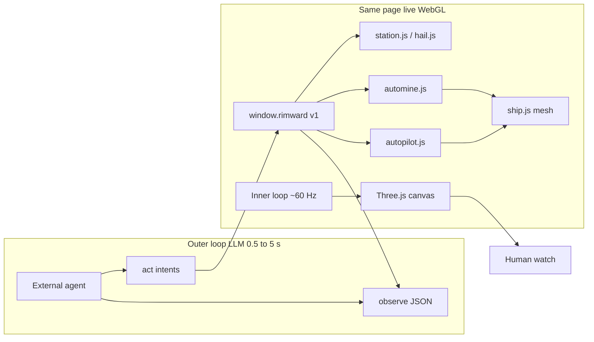
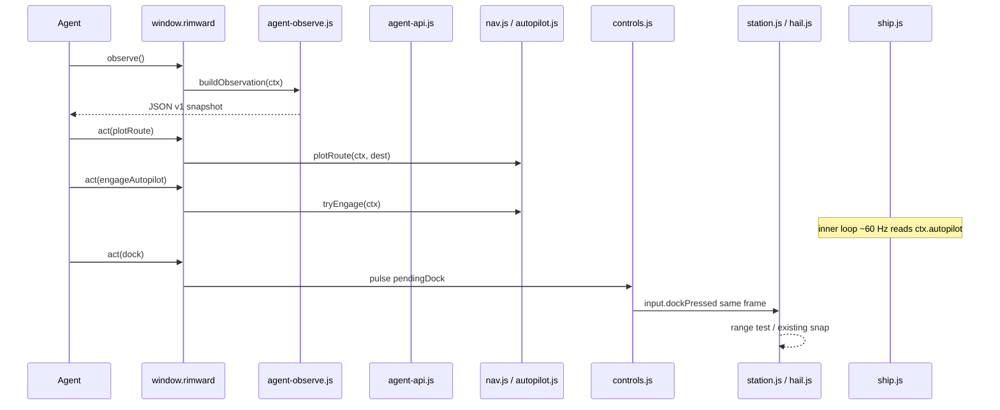

# RIMWARD Wave 126 — Agent API (AI play surface)

| Field | Value |
|---|---|
| **Title** | RIMWARD AGENT API (AI play surface) |
| **Author** | Wave 126 leftover integrator |
| **Date** | 2026-08-25 (rev 3 leftover freeze after Wave 125 census) |
| **Status** | Wave 127 PR1 implemented. `window.rimward` observe handle is live. Leftover was **REAL**. Merge law: shared-contract.md wins. |
| **Wave** | 127 — PR1 observe handle. PR2–PR6 still named later. |
| **Owner request** | Inbox P2 AGENT API: add a stable documented AI play API so an agent can play on a user's behalf, plus a live watch surface. Screenshot loops are too slow. Empty `e.code` never reaches TRACKED. Owner: write the design first. Do not implement. |
| **Merge law** | [`out/w126/agentapi/shared-contract.md`](../out/w126/agentapi/shared-contract.md). If this document and that file conflict, **the contract wins**. |
| **Honor** | HUD-01 empty 80 px hub. Aim-glass gauges stay off. Kit mutate omit. Digit 0/8/9 stay station. Digit 1–5 stay in-flight WPN. `innerHTML` forbidden later. Toasts stay `textContent`. `state.js` READ-ONLY (no new WORLD_FIELDS). `window.__ctx` stays debug/harness. Do **not** teleport. Do **not** grant credits, hull, or cargo. No in-repo LLM runner. No PR7/PR8. Owner locks: opt-in A, pad 2A, bridge 3A, never in-repo LLM 4C, grok-4.5 external-only 5, pause A. Do **not** steal CTL-03 PR2 stills, CTL-04 PR2 `fireHeld`, AI-05 PR2 home-berth bubble. Do **not** steal Hail01 demand lifecycle or Hud06 home-marker. Do **not** edit the wishlist, `PROGRESS.md`, leftover CTL/NAV/HUD docs, or `scripts/boot-test.mjs` this wave. Do **not** write `docs/OwnerDecisionsWave126.md`. |

**Verifier record:**

| Note | Path |
|---|---|
| Inventory (code wins; Wave 125 census) | [`out/w126/agentapi/current-agent-api-inventory.md`](../out/w126/agentapi/current-agent-api-inventory.md) |
| Merge law | [`out/w126/agentapi/shared-contract.md`](../out/w126/agentapi/shared-contract.md) |
| Security review | [`out/w126/agentapi/security-review.md`](../out/w126/agentapi/security-review.md) |
| Design-doc review | [`out/w126/agentapi/code-review.md`](../out/w126/agentapi/code-review.md) |
| UI audit | [`out/w126/agentapi/ui-audit.md`](../out/w126/agentapi/ui-audit.md) |
| Notes | [`out/w126/agentapi/notes.md`](../out/w126/agentapi/notes.md) |

Wishlist, `PROGRESS.md`, leftover CTL/NAV/HUD docs, and `src/` are **other workers**. **Do not edit** those paths in Wave 126.

**This is not NAV-03.** Autopilot already flies plotted routes. **This is not a cheat console.** **This is not an in-repo LLM copilot as the first ship.** The product is a stable play API plus a live watch surface.

---

## Overview

Inbox source (`docs/PLAYER-EXPERIENCE-WISHLIST.md` Idea inbox — **cite, do not edit**):

> INBOX (P2, AGENT API): Add an AI-agent play API so agents can play the
> game on a user's behalf. This playtest needed injected synthetic
> key/mouse events, a hand-rolled steering loop against `window.__ctx`, and
> screen-scraping to act at all — and stock agent keyboard events (empty
> `e.code`) never reached the game. Desired: a stable, documented interface
> (for example a versioned `window.rimward` handle or local endpoint) with
> read access to game state (ship, HUD, targets, station services, jobs,
> chart) and command access to intents (steer to, approach and dock, select
> target, accept job, trade, plot route, engage autopilot), plus an
> accessibility fallback so keys with `key` but empty `code` still work.
> Owner note: users may want their agents to play for them; this also makes
> future playtests and verification passes far cheaper.

Wave 126 this worker lands markdown only. Bindings do not change here.

Census (code wins, Wave 125 src): there is no `window.rimward` in `src/`, scripts, or `index.html`. `window.__ctx = ctx` is a debug/test handle (`src/main.js` **79**). `ctx.input` is written only by `controls.js` (`src/core/ctx.js` **15**). Keydown ignores events whose `e.code` is not in `TRACKED` (`src/systems/controls.js` **45–53**, **315–316**). Autopilot already owns a live command channel and flies `world.nav` (`src/game/autopilot.js`; helm merge `src/systems/ship.js` **738–830**). Automine exists. Station jobs/trade/hail resolve live in closures that boot-test reaches with `dispatchKey(code)` (`scripts/boot-test.mjs` **258–263**). Screenshot / vision loops cannot fly 120 u/s cruise (`ctx.js` **10–11**, **52**) across a 0.5–5 s LLM round-trip.

Wave 125 also landed session `ctx.flags.berthHold` (`ctx.js` **211**; overlay helpers **187–204**; ship skip **754**; AP latch **153–177**; gate emit skip **678**). Automine hypot still latches **chart only** (`automine.js` **169–171**). That hold is **not** this leftover. Agent `act` while held refuses with `token: 'held'`. Do not steal CTL-03 PR2.

This leftover is a **versioned outer-loop play API** plus a **live WebGL watch page**. It is not a new Digit. It is not god-mode. It is not an in-repo LLM runner. External agents only.

Recommended architecture (deputize; owner may override): **handle first** — `window.rimward` v1 with `observe()` + `act({ v, name, args })`. Same-tab WebGL is the watch surface **after PR3** (opt-in reticle latch so mouse hypot does not cancel AP/AM). Optional `?agent=1` badge is PR5. A later **127.0.0.1** CDP bridge forwards the **same** schema (PR6; Node `evaluate`, not an unauthenticated page WS). MCP / iframe `postMessage` / headless observe wrap that schema; they are not a second game.

v1 **does not** complete wishlist “steer to / approach and dock”. Autopilot flies **system** dests. `dock` is KeyJ inside 45 u (existing 90 u snap). Tests place the hull in zone. Pad approach is an owner-locked **v1 non-goal** (tests place the hull in 45 u). It is not a Wave 126 PR.

HUD-01 empty aim glass stays empty. `state.js` stays READ-ONLY. No new persist key. Digit 0/8/9 stay. Do not invent UU.

---

## Background & Motivation

### Why this change is needed

Flight is an inner loop at display rate (animation loop in `src/main.js` **146–158**, dt capped at 0.1 s). Cruise is **120 u/s**. Dock envelope is **45 u** (`U.DOCK_RANGE`, `src/game/state.js` **30**). Jump zone is **60 u** (`JUMP.zone`, `state.js` **585**).

An LLM round-trip of 2 s is **240 u** of travel if the ship keeps cruise: four dock radii, four jump zones, a large fraction of the **600 u** target range (`state.js` **32**). A 1080p screenshot is megabytes; a HUD-visible JSON snapshot is a few kilobytes. Vision loops therefore miss gates, overshoot pads, and fire late. The owner already found that injected keys with empty `e.code` never reached `TRACKED`.

Humans already solved the inner loop for routes and rocks: NAV-03 autopilot writes `ctx.autopilot` yaw/pitch/throttle; automine does the same for a locked asteroid; `ship.js` prefers AP, then AM, then mouse reticle (`ship.js` **738–830**). The agent should issue **those** intents, then watch the inner loop fly.

A watch page that shows JPEG tiles is a slideshow. The watch page must be the **same WebGL canvas** the human already uses — **and** mouse hypot must not cancel AP/AM while the agent is opted in. Today `mousemove` always writes `steerX/Y` (`controls.js` **380–383**, **461–478**). Autopilot interrupts at hypot ≥ 0.65 (`autopilot.js` **16**, **176–177**) unless `chartOpen` or berth hold latches the reticle (`autopilot.js` **153–167`). Automine matches (`automine.js` **9**, **166–185**). Agent watch does not open the chart. Without a latch, a cursor on a badge or DevTools cancels the inner loop.

### Current state (inventory)

Source of truth: [`out/w126/agentapi/current-agent-api-inventory.md`](../out/w126/agentapi/current-agent-api-inventory.md). Code wins.

| Surface | Today | Cite |
|---|---|---|
| Public agent handle | **none** | repo census |
| Debug handle | `window.__ctx = ctx` | `main.js` **79** |
| Input writer | `controls.js` only | `ctx.js` **15** |
| AP / AM writers | `autopilot.js` / `automine.js` only | `ctx.js` **16–17** |
| Keydown | `TRACKED.has(e.code)` | `controls.js` **315–316** |
| Helm merge | AP > AM > `input.steer*` | `ship.js` **738–830** |
| Plot | `plotRoute(ctx, dest)` | `nav.js` **279–300** |
| AP engage | `tryEngage(ctx)` | `autopilot.js` **216–229** |
| AM engage | `tryEngageAutomine(ctx)` | `automine.js` **232+** |
| Dock | `dockPressed` + range; snap if `≤ 2×` range | `station.js` **6321–6330** |
| Jump emit | `gate.js` only | `gate.js` **678–679** |
| Hail resolve | closure `resolveIntent` | `hail.js` **144–156** |
| Jobs / trade | closures `acceptJob` / `tryTrade` | `station.js` **4788**, **4616** |
| Boot keys | `{ code }` only | boot-test **260–263** |
| Overlay mutex | hail/chart/berth exclusive | `overlay-policy.js` **7**, **83–91**, **118–128**, **175–185** |
| Berth hold (Wave 125) | live session flag; not pause | `ctx.js` **211**; overlay **187–204**; `save.js` **1422** |
| Gate emit vs hold | `!berthHeld` in emit | `gate.js` **678–679** |
| HUD hub | 80 px / 44 px clamp | `hud.js` **1293** |
| Persist whitelist | `WORLD_FIELDS` — no agent key | `save.js` **80–105** |
| Nav AP on keep | `writeNav` sets `autopilot: false` | `nav.js` **54**, comment **191–192** |
| Event rotate | `lastEvents` = prior frame only | `main.js` **155–156** |
| Toast life | 4 s | `hud.js` **64** |
| Models attach | `ctx.models = { open, close, isOpen }` | `modelsbrowser.js` **16–17**, **832–836** |

### Pain points

- Screenshot loops cannot hold a 60 u jump zone at 120 u/s.
- `__ctx` is an unbounded debug object. Teaching agents to poke it will break ownership and become a cheat console.
- Stock agent keyboards set `key` and leave `code` empty. `controls.js` **316** drops them. Pause in `main.js` **168** also keys off `e.code`.
- Station jobs/trade/hail are real, but they live in `init*` closures. Playwright click-by-screenshot is the slow path.
- Boot-test **does** drive the sim, but it writes `ctx.input` directly. That is a harness privilege, not a product API.
- A naive HTTP server on `0.0.0.0` would remote-control the ship from the LAN.
- Copying `ctx.lastEvents` into `observe()` at 1–2 Hz misses almost every beat (one frame vs 4 s toasts).
- Same-tab watch without a hypot latch fights AP/AM.
- Station/hail verbs live in closures; hanging them on `ctx.station` would dump callables from a naive observe.

### Why now (design) / why not now (code)

The owner asked for the design first so later serials freeze: handle vs HTTP, observe vs dump, intent vs axis, opt-in vs always-on `act`, and “no teleport”. Inventory shows AP/AM already are the inner loop, and the missing piece is a small versioned outer loop. Wave 126 does not ship `src/`.

If census had proved a versioned `window.rimward` with observe+intents, this pack would freeze **CONSUME** and name serial **none**. Census did not. That CONSUME path is unexpected. Leftover is **REAL**. First remaining serial is **PR1**.



---

## Goals & Non-Goals

### Goals

1. Document live debug handle, ownership, helm merge, key `code` gate, AP/AM, dock/jump, hail/jobs/trade closures, and boot-test drive patterns from **live code**.
2. Freeze leftover **REAL**, named serial **PR1** (observe handle). Product = **versioned outer-loop play API + live watch**. Not a new Digit. Not god-mode. Not screenshot telemetry. Not CONSUME.
3. Freeze recommendation: **`window.rimward` first**, same-page canvas as watch **after PR3 latch**, optional later **127.0.0.1** CDP forwarder with the same schema.
4. Freeze loop split: inner = existing flight/AP/AM/combat/station; outer = JSON observe + `act({ v, name, args })`.
5. Freeze honor: `__ctx` stays debug; agent must play dock/jump/services/hail; no teleport; no free UU; `state.js` READ-ONLY; no new `WORLD_FIELDS`.
6. Freeze later write-set in the contract (§0.3). First impl PRs land **without** an LLM. **No in-repo demo runner. Ever.**
7. Freeze accessibility empty-`code` as **PR4** (`key-code.js` + controls, pause, station, hail, chart; title out; overlay-policy read-only).
8. Freeze security: local / opt-in `act`; never `0.0.0.0`; no key in the browser bundle.
9. Freeze a serial PR plan. This wave writes the document. A later wave ships serially.

### Non-goals (locked — do not reopen)

- No `src/` or live bindings in this worker.
- No in-repo LLM autopilot. **Never** `scripts/agent-demo.mjs`. External agents only.
- **v1 non-goal:** in-system pad approach / “steer to” / “approach and dock” as a playable outer verb. `dock` is in-zone KeyJ. Tests place the hull in 45 u. **Not a Wave 126 PR.**
- No replacing `__ctx` as the public contract.
- No third helm channel in Wave 126. Owner 2A closed pad-seeker for this wave.
- No HUD-01 hub child. No new Digit. No aim-glass agent pip.
- No `state.js` write. No WORLD_FIELDS agent blob.
- No remote bind. No cheat commands.
- No product event log from `ctx.lastEvents`.
- Do not steal CTL-03 PR2, CTL-04 PR2 `fireHeld`, AI-05 PR2, NAV leftovers, HUD skins.
- Do not edit the wishlist, `PROGRESS.md`, leftover docs, OwnerDecisions*.
- Do not write `docs/OwnerDecisionsWave126.md`.
- Do not run `npm run test:boot` or Playwright in this wave.

---

## Key Decisions

Architectural choices. Contract wins if this table and [`shared-contract.md`](../out/w126/agentapi/shared-contract.md) ever drift.

| Decision | Choice | Rationale |
|---|---|---|
| 1. Architecture | **Handle first** (`window.rimward` v1). Same page is the watch surface **after the PR3 hypot latch**. Optional later **127.0.0.1** CDP bridge forwards the same schema. | Screenshot loops fail at 120 u/s. AP/AM already are the inner loop. Playwright can `evaluate` a handle with zero new network surface. HTTP-first would add a server before the schema exists. “Both” is the **sequence**, not two schemas. |
| 2. `__ctx` vs public API | Keep `__ctx` as debug/harness. Public API is versioned, JSON-plain, and smaller. | `main.js` **79** already warns debug. Dumping ctx teaches agents to write `input` and credits. |
| 3. Loop split | Outer: `observe()` pull + **`act({ v, name, args })`**. Inner: existing 60 Hz systems. | LLM latency is 0.5–5 s. Axes every frame belong to AP/AM/controls, not the model. One signature only. |
| 4. Helm | Reuse AP (system routes) and AM (rocks). Dock/jump via **controls pulse**. No third helm in Wave 126. **v1 pad approach is a non-goal.** | `ship.js` **738–830** already merges AP > AM > input. AP dests are systems (`plotRoute`). Dock is 45 u. Owner pick **2A**. |
| 5. Station / hail | Attach **`ctx.stationDesk`** and **`ctx.hailApi`** at init, same shape as `ctx.models`. Do **not** hang functions on HUD `ctx.station`. | Closures are real (`station.js` **4788**, **4616**, **6129**; `hail.js` **144**). Observe must copy pose fields only. |
| 6. Opt-in | Matrix A: `?agent=1` sets `optIn` at boot. `enable()` only from `isTrusted` click (no query required). Playwright uses the query, **not** `enable()`. `observe` always allowed. | Observe is HUD-visible and origin-public (like `__ctx`). `evaluate` is not a user gesture. |
| 7. Watch | Live WebGL in `#app` **after PR3 latch**. PR5 badge via `textContent`. Not a second renderer. Not screenshots. | Mouse hypot cancels AP/AM today. Latch `optIn` like `chartOpen`. Badge without latch is a slideshow of cancelled AP. |
| 8. Persist | No new `WORLD_FIELDS`. `ctx.agent` is a session channel like `ctx.autopilot`. Restore must not resume agent drive. | `writeNav` always `autopilot: false` (`nav.js` **54**; comment **191–192**). |
| 9. LLM | **Never in-repo.** External clients may use xAI: `XAI_API_KEY`, `https://api.x.ai/v1`, model **grok-4.5**. Key never in the bundle. Confirming docs.x.ai is **not** a Wave 126 task. | Owner pick **4C** and **5**. The API is the product. |
| 10. A11y empty `code` | Named PR4. Shared `key-code.js`. Callers: controls, pause, station, hail, chart. **title.js out. overlay-policy read-only.** | Empty `code` is dropped in all of those listeners. Title capture is a different leftover. |
| 11. Security | Local only. `?agent=1` is a **product** gate, not a remote-threat boundary. PR6: Node CDP + `127.0.0.1` + full-token `timingSafeEqual`. Never `0.0.0.0`. Forbidden intents + boot pins. | Page cannot read `process.env`. Unauthenticated `ws://127.0.0.1` is localhost CSRF. XSS already has `__ctx`. |
| 12. Tests | Later: `npm run test:boot` still PASS. PR1 pins: JSON-plain, no THREE, event ring survives 30 frames, no-ctx `ok:false`, forbidden names fail. Pulse then one `update`. This wave runs neither boot nor Playwright. | `lastEvents` is one frame. Harness dock is `dockPressed` then `tick(1)` (**1137–1139**). |
| 13. Events | Session ring on `ctx.agent.events`, cap 16, authored primitives. Harvest `ctx.events` in agent-api `update`. | `lastEvents` (`main.js` **155–156**) cannot feed a 1–2 Hz outer loop. HUD toasts last 4 s (`hud.js` **64**). |
| 14. Desk v1 | Play: jobs, market, feed, repair, undock. `openService` for other ids is observe-only (`v1-observe-only`). Chart read = `plotRoute`, no `openChart`. | Digit 6–9/0 stay station. Do not ship `openService` as play-complete. |

---

## Proposed Design

### 1. Merge resolutions (contract wins)

| Question | Integrator freeze | Why |
|---|---|---|
| Leftover real? | **Yes** — no public handle | Inventory §0 |
| CONSUME? | **No**. Serial is **not** none | Census |
| First serial | **PR1 observe handle** | Named only |
| `berthHold` vs `act` | refuse later names; `token: 'held'` | Contract law 20 |
| New persist key? | **No** | Contract §0.6 |
| `state.js` write? | **No** | Honor |
| Replace `__ctx`? | **No** | Contract §0.3 |
| HTTP in PR1? | **No** | Contract §0.9 |
| LLM in-repo? | **Never** | Owner pick **4C** |
| New Digit? | **No** | HUD-01 / station map |
| Third helm in Wave 126? | **No** | Owner 2A |
| Pad approach v1? | **Non-goal** — tests place hull in 45 u | Owner pick **2A** |
| Event log | `ctx.agent.events` ring, not `lastEvents` | `main.js` **155–156** |
| Desk attach | `ctx.stationDesk` / `ctx.hailApi` | models pattern |
| Pulse edges | `dock`\|`hail`\|`target`\|`reticleLock` | contract §0.1 |
| Watch hypot | PR3 latch while `optIn` | `autopilot.js` **153–177** |
| Dock snap extra warp? | **No** — reuse human J path | `station.js` **6323–6328** |
| `innerHTML`? | **No** | XSS |

### 2. Outer vs inner (do not invert)

**Inner loop (already shipped)**

- `main.js` animation loop calls every `system.update(dt)`.
- `controls.js` publishes `input` (reticle, edges, WPN).
- `autopilot.js` / `automine.js` publish command channels.
- `ship.js` moves the mesh.
- `gate.js` emits `jumpRequested` only in zone.
- `station.js` docks only in (or the existing 2× snap of) `DOCK_RANGE`.
- Combat, hail DOM, HUD all tick here.

**Outer loop (this leftover)**

- Agent calls `observe()` when it wants a snapshot (1–2 Hz is enough).
- Agent calls `act({ v:1, name, args })` for a high-level intent.
- `act` either: calls `plotRoute` / `tryEngage` / `tryEngageAutomine`; or asks controls for a one-frame pulse (`dockPressed` path); or asks station/hail wrappers.
- Result is `{ ok, error, token }` English-stable (reuse `AP_LINES` / `AM_LINES` / station `ui.notice` where they already exist).

Do not let the outer loop write `steerX` every frame. Mouse reticle already overwrites axes in `controls.js` **461–478**. That is why AP/AM exist.

`observe().events` is the **session ring**, not `lastEvents`. Pulse commands need **one systems `update`** before dock/jump asserts (boot-test **1137–1139**).

`flags.paused === true` → all `act` except `ping` / `disable` return `token: 'paused'`.

`flags.berthHold === true` → all `act` except `ping` / `disable` return `token: 'held'`. Agent-api never writes hold. Do not map hold onto pause.

### 3. Module split (later)



New files (named, not created this wave):

- `src/game/agent-schema.js` — `VERSION = 1`, authored command names, error tokens. No DOM. No THREE.
- `src/game/agent-observe.js` — `buildObservation(ctx)` → JSON-plain object. Caps arrays. Strips functions and buffers. Never throws.
- `src/systems/agent-api.js` — `initAgentApi(ctx)` installs `window.rimward`, owns `ctx.agent` session `{ optIn, lastIntent, events[] }`, harvests authored events from `ctx.events` each `update`.

`src/core/ctx.js` later adds one ownership line: **`ctx.agent` written ONLY by `agent-api.js` (session; not persist; not a helm).**

Init order (`main.js` **104–136** is load-bearing): station is **before** controls. Install agent-api **after** hail, save, chart (and after station/hail have assigned `stationDesk` / `hailApi`) — before or with HUD. Do not run before `initControls`. Harvest uses this-frame `ctx.events` before `main.js` **155–156** rotates the queue.

### 4. `window.rimward` shape (v1)

```js
// Named freeze. Not implemented this wave.
window.rimward = {
  version: 1,
  observe() { /* return buildObservation(ctx) */ },
  act(command) { /* { v, name, args } → { v, ok, error, name, token } */ },
  enable() { /* trusted click only; no-op if already optIn */ },
  disable() { /* clear optIn; do not cancel AP/AM */ },
};
```

Rules (contract §0.1.1):

- Freeze the object (or freeze a facade). Do not put `ctx` on it.
- `observe` always allowed (origin-public HUD JSON; opt-in does **not** shrink observe).
- Query `agent=1` sets `ctx.agent.optIn` at boot (PR1, no badge required).
- Playwright: `goto('/?agent=1')` then `act`. Do **not** call `enable()` from `evaluate`.
- `enable()` succeeds only if `event.isTrusted === true` (or an internal controls click handler). Without trust → `token: 'opt-in'`.
- `act` without `optIn` → `token: 'opt-in'`.
- `ping` works in PR1 when opted in.
- `flags.paused` → other acts `token: 'paused'`.
- Never return THREE.Vector3. Use `[x,y,z]` like `state.js`.

### 5. Observation snapshot (HUD-visible)

**Frozen keys, types, and null rules live in the contract §0.2.1.** Copy that example. Do not invent a second v1 shape.

Builder rules:

- Missing ctx → `{ v:1, t:0, ok:false, error:'no-ctx', agentOptIn:false, events:[] }` and omit the rest.
- Copy authored fields only. Never `JSON.stringify(ctx)`. Never functions / THREE / `stationDesk`.
- `jumping` lives on `gate.jumping` (`ctx.gate.jumping`, `ctx.js` **183**). **Not** `flags.jumping`.
- `flags` includes `chartOpen`, `berthHold`, `matchSpeed`, `camera`. `agentOptIn` is top-level.
- `ship` includes hull/screen/shell/engine/power/heat/`weaponGroup` (`state.js` **167–181**; `input.weaponGroup`).
- `targets.nearby` ≤ 12, nearest first, range ≤ `U.TARGET_RANGE`, **ships and rocks** (AM needs the locked asteroid).
- `events` ≤ 16 from **`ctx.agent.events` ring**, not `lastEvents`. Authored types only. `hailOpened` has `{ intents, salvage }` — never `ship`.
- `jobs` only when `flags.docked`.
- `station` is a **pose copy** (`inZone`, `name`, `systemName`, `service`, `services`). Never copy `ctx.station` wholesale and never serialize `stationDesk`.
- `bio` is HUD-true (`mood`, `hunger`, `wounds`, `bond`).
- **Omit:** `npc.ai` internals, interest rolls, scene, renderer, `__ctx`, save slots, settings storage, API keys, functions.

Rough size: ~2–8 KB per pull at 2 Hz ≪ one screenshot. This is HUD-visible extract, not 4 s toast telemetry. The ring is the outer-loop log.

### 6. Commands (PR2+, reuse live verbs)

| `name` | Args | Live call | Refuse when |
|---|---|---|---|
| `ping` | — | none | `opt-in` if not opted in |
| `plotRoute` | `{ dest }` | `plotRoute` | uncharted / proto id (`nav.js` already sanitizes); `paused` |
| `clearRoute` | — | `clearRoute` | `paused` |
| `engageAutopilot` | — | `tryEngage` | `AP_LINES` tokens; `paused` |
| `cancelAutopilot` | — | `disengage(ctx, 'cancel')` | not flying |
| `engageAutomine` | — | `tryEngageAutomine` | `AM_LINES`; `paused` |
| `cancelAutomine` | — | `disengageAutomine(ctx, 'cancel')` | — |
| `selectTarget` | `{ id? }` or cycle | controls export / pulse `target` | none in range; PR3 |
| `hail` | — | pulse `pendingHail` via controls | overlay policy; PR3 |
| `hailResolve` | `{ intent }` or `{ index }` | `ctx.hailApi.resolve` | card closed; unknown intent; `hailDigitsAllowed` false |
| `dock` | — | pulse `pendingDock` via controls | same as KeyJ skip; **not in pad zone** (no warp); PR3 |
| `undock` | — | `ctx.stationDesk.undock` | not docked |
| `openService` | `{ id }` authored `DOCK_KEY_SERVICES` | `ctx.stationDesk.selectService` | not docked; unknown id |
| `acceptJob` | `{ id }` | `ctx.stationDesk.acceptJob` | not docked; **`service !== 'jobs'`**; not offered; hold full |
| `trade` | `{ commodity, qty, side:'buy'\|'sell' }` | `ctx.stationDesk.trade` | not docked; **`service !== 'market'`**; locker; UU; hold; **qty not integer 1..min(99, capacity)**; unknown commodity |
| `repairAll` | — | `ctx.stationDesk.repairAll` | not docked; **`service !== 'repair'`** |
| `feed` | `{ kind:'biomass'\|'rock'\|'tend' }` | `ctx.stationDesk.feed` | not docked; **`service !== 'feed'`**; bad kind |
| `setWeaponGroup` | `{ n:1..5 }` | `agentSetWeaponGroup` | skip surfaces; PR3 |
| `pulse` | `{ edge }` | `agentPulse` | edge not in `dock`\|`hail`\|`target`\|`reticleLock` |
| `disable` | — | clear `optIn` | never (does not cancel AP) |

`token` is the enum; `error` may copy live English (`AP_LINES`, `ui.notice`). Desk wrappers **do not** return `AP_LINES` keys; they set `token` from an authored desk map or `notice` as `error`.

**Attach point (PR2):** `initStation` assigns `ctx.stationDesk = { selectService, acceptJob, trade, repairAll, feed, undock, peekService }` synchronously, same as `ctx.models` (`modelsbrowser.js` **832–836**). `initHail` assigns `ctx.hailApi = { resolve, peek }`. Do **not** put functions on `ctx.station`. PR2 writes **helpers only** — no overlay CSS/HTML rewrite.

**Desk completeness:** `openService` may select any `DOCK_KEY_SERVICES` id so observe can see the pane. Named play verbs in v1 are jobs / market / feed / repair / undock only. Bar, outfitting, people, epics, shipyard → further acts `token: 'v1-observe-only'`. Chart plot is `plotRoute`; **no** `openChart` in v1.

**Approach and dock (wishlist) — v1 non-goal (owner 2A):** `dock` is KeyJ. If the hull is inside **45 u**, station docks. If inside **90 u**, existing human snap applies (`station.js` **6323–6328**). If farther, **v1 cannot close the pad**. AP flies a **system** dest and arrives at a **gate**, not the pad. Tests that need dock **place the hull in `U.DOCK_RANGE`** (harness privilege, like boot-test) then `act({ name:'dock' })` and **one `update`**. Do **not** imply PR2–PR3 complete “approach and dock”. Do **not** add a warp-to-pad command. Do **not** land an `agentHelm` PR in Wave 126.

**Steer to:** not a raw-axis command in v1. Routes use AP. Rocks use AM.

Forbidden: `teleport`, `setCredits`, `setHull`, `setCargo`, `god`, `win`, assigning `world.currentSystem`, emitting `jumpRequested` from the agent module, assigning `ctx.ship.object.position`. Boot pins must call those names and assert `token: 'forbidden'`.

### 7. Controls pulse sink (PR3)

`ctx.input` must stay controls-owned (`ctx.js` **15**).

Later export from `controls.js` (names freeze; implementation later):

```js
export function agentPulse(ctx, edge) {
  // authored only: 'dock' | 'hail' | 'target' | 'reticleLock'
  // sets the same pending* flags keydown already sets (controls.js 289, 331, 422–433)
}
export function agentSetWeaponGroup(ctx, n) {
  // Digit1–5 law: call shouldSkipWeaponGroupDigits; refuse if skip
}
```

No `camera` / `afterburner` pulse (those are human steal-the-stick). No `agentSetFireHeld` in v1 (do not steal CTL-04 PR2).

`agent-api.js` **calls** those exports. It does not write `ctx.input`.

**Timing:** `act({ name:'dock' })` sets `pendingDock`. The next `system.update` publishes `input.dockPressed` for one frame. Boot pins must `act` then `tick(1)` (boot-test **1137–1139**). Same-tick `flags.docked` asserts fail.

**Watch-mode latch (PR3, required for same-tab watch):** while `ctx.agent.optIn === true`, `autopilot.js` `inputBreak` and `automine.js` `inputBreak` treat mouse hypot like `chartOpen` (`autopilot.js` **153–177**, `automine.js` **166–185**): do **not** return `'input'` from hypot. Still steal on strafe, roll, `throttleHeld`, afterburner, drift, `fullStop`. `disable()` clears `optIn`; re-arm hypot like chart close. Keep `ctx.input` controls-owned — this is an interrupt predicate, not a third helm. Latch **`optIn` only**. AP already latches `berthHeld` (Wave 125). Automine does **not**. Do not add `berthHold` to automine.

### 8. Watch chrome (PR5)

Do **not** call the canvas a working watch surface until PR3 latch lands.

`?agent=1` (PR5):

- Same `index.html` canvas. No second page required for the recommended path.
- A small fixed badge **sibling of `#app`**, not a `#hud` 80 px hub child. Frozen literals: contract §0.1.2 (`Agent play` + `on`/`off` + `Enable agent play` / `Stop agent play`). Do **not** ship the jargon `AGENT DRIVE`.
- `textContent` only. `aria-live="polite"` on the status line. Buttons are real `<button type="button">`.
- Enable is a **trusted click** (no query required). Stop clears `optIn` only. Stop does **not** cancel Autopilot.
- Color is not the only cue. Reuse HUD tokens (`hud.css` **12–21**). Visible focus ring. Hit target ≥ 44 px. `z-index` below pause 50 and berth 60.
- `reducedMotion`: no pulse animation. Default: no animation.
- Human still has KeyP pause (`main.js` **167–178**). After PR3, mouse hypot does **not** cancel AP while opted in. Strafe / R-F / Space / Shift still steal.

A **separate** watch webpage is only justified with PR6. Default watch is this tab. Alternative “second window so the cursor is not on the canvas” is rejected: the latch is cheaper and keeps one WebGL view.

### 9. Loopback bridge (PR6 optional)

The browser **cannot** read `process.env`. A page `WebSocket` cannot set a portable `Authorization` header. An unauthenticated `ws://127.0.0.1` is localhost CSRF from other origins.

**Default PR6 (c):** Node listens on **`127.0.0.1`** (optional `::1`; refuse `0.0.0.0` and `::`). Agents talk HTTP/WS to Node. Node holds the game tab with Playwright/CDP and `evaluate(() => window.rimward.observe/act)`. The page never sees the token. Compare the agent token with **equal-length full buffers** via `crypto.timingSafeEqual` (not a prefix). If lengths differ: dummy equal-length compare, then **return false**. Do not throw. Never put `XAI_API_KEY` on this socket.

Owner pick **3A**: optional CDP after the handle works. Bind `127.0.0.1`. **No page WebSocket.**

`?agent=1` remains a **product** gate (no surprise `act` on a normal tab). It is **not** a remote-threat boundary. XSS already has `window.__ctx` (`main.js` **79**).

Never put `XAI_API_KEY` on this socket. No HTTP in PR1.

### 10. External LLM clients (never in-repo)

Owner pick **4C**: **never** ship `scripts/agent-demo.mjs` or any in-repo runner. External agents call `window.rimward` or the PR6 CDP bridge.

If someone later writes an **external** client, document model **grok-4.5**, env `XAI_API_KEY`, base `https://api.x.ai/v1`. Never put the key in the browser bundle. Confirming docs.x.ai is **not** a Wave 126 task (owner pick **5**).

### 11. Accessibility empty `code` (PR4)

Wishlist: keys with `key` but empty `code` still work.

Shared helper `src/systems/key-code.js` (authored literals only):

- Normalize letters with `toLowerCase()` (`W` and `w` → `KeyW`).
- `1`–`5` → `Digit1`–`Digit5`; station Digit 0/6–9 decode too for **station.js**, not for controls `TRACKED`.
- ` ` → `Space`. Shift / drift: map `shift` → `ShiftLeft` so vector-hold works.
- `j` → `KeyJ`, `m` → `KeyM`, `p` → `KeyP`, `escape` → `Escape`.

Callers: `controls.js`, `main.js` pause, `station.js`, `hail.js`, `galaxychart.js`. **`overlay-policy.js` stays read-only.** **`title.js` stays out of PR4** (capture-phase `stopImmediatePropagation`; empty-code title pick is a different leftover).

If `e.code` is already a real code, ignore `key`. If both empty, drop. Overlay Digit skip still uses decoded `Digit1`–`Digit5`.

### 12. Neighbours

| Module | This leftover does | This leftover does not |
|---|---|---|
| `agent-*.js` (new) | schema, observe, ring, dispatch | cheat; THREE dump; lastEvents-as-log |
| `controls.js` | pulse edges; key-code use | remap KeyJ/D; Digit 0/8/9; fireHeld v1 |
| `station.js` / `hail.js` | `stationDesk` / `hailApi` attach only | new services; CSS/HTML rewrite; fns on `ctx.station` |
| `nav.js` | **call** plot/clear | change `writeNav` AP-false |
| `autopilot.js` / `automine.js` | **call**; PR3 hypot latch on **`optIn` only** | new jump emit; teleport; AM `berthHold` latch |
| `ship.js` | none in PR1–PR3 | third helm |
| `hud.js` | none in PR1–PR5 | hub child |
| `state.js` / `save.js` | none | WORLD_FIELDS (`save.js` **80–105**) |
| `overlay-policy.js` | **read** | write (Wave 125 already owns hold helpers) |
| `title.js` | none in PR4 | capture rewrite |
| `boot-test.mjs` | later named pins | replace `__ctx` drives wholesale |
| `npc.js` | none | AI-05 PR2 |

---

## API / Interface Changes

**Before (today)**

```js
window.__ctx.input.dockPressed = true;           // harness only
window.__ctx.world.credits += 9999;              // cheat if copied
dispatchEvent(new KeyboardEvent('keydown', { key: 'j' })); // dropped: empty code
```

**After (later PR1+)**

```js
const rw = window.rimward;
const snap = rw.observe();          // contract §0.2.1
rw.act({ v: 1, name: 'plotRoute', args: { dest: 'veridian' } });
rw.act({ v: 1, name: 'engageAutopilot', args: {} });
```

Playwright (query sets `optIn`; do **not** call `enable()`):

```js
await page.goto('http://127.0.0.1:5173/?agent=1');
await page.waitForFunction(() => window.rimward?.version === 1);
await page.evaluate(() => window.rimward.act({ v: 1, name: 'ping', args: {} }));
```

`window.__ctx` remains for boot-test and capture scripts. New product code must not document it as the agent API.

---

## Data Model Changes

| Item | Change |
|---|---|
| `WORLD_FIELDS` | **none** |
| `state.js` | **none** |
| `localStorage` | **none** (settings key unchanged) |
| `ctx.agent` | new **session** bag: `{ optIn, lastIntent, events[] }`. Not saved. Restore must not set `optIn` from disk. |
| `ctx.stationDesk` / `ctx.hailApi` | session function bags at init; **not** persisted; **not** copied by observe |
| `world.nav.autopilot` | unchanged; `writeNav` always `false` (`nav.js` **54**, **191–192**) |
| Observation | ephemeral JSON; not a save field |

Migration: none. Old saves load. Agent drive is a tab session.

---

## Alternatives Considered

The owner asked that these be treated seriously. Recommendation is **Alternative 3 sequenced as Alternative 1 first**.

### Alternative 1 — Versioned in-page handle only

`window.rimward` + live canvas + optional `?agent=1` chrome. External agents: Playwright `page.evaluate`, bookmarklets, in-page consoles.

| | |
|---|---|
| Pros | Zero network surface; matches how capture scripts already wait for `__ctx`; watch is the game canvas **once PR3 latches hypot**; first PRs are reviewable without a server; boot-test can import `buildObservation`. |
| Cons | Agents that cannot inject JS (a chat box in another process) cannot call it until a bridge exists. |
| Verdict | **Do this first.** It unblocks playtests immediately. |

### Alternative 2 — Local HTTP / WebSocket + second watch page

Node serves JSON and a mirror page.

| | |
|---|---|
| Pros | Any HTTP client (curl, Grok tool loop) can play without CDP. |
| Cons | Must not bind `0.0.0.0`. Second page that is not the WebGL canvas becomes a slideshow unless it iframes the game (then you still need the handle). Schema still has to exist. Extra process for every playtest. |
| Verdict | **Not first.** Do not design two schemas. |

### Alternative 3 — Both (handle, then loopback, same schema)

Handle is the source of truth. `scripts/agent-bridge.mjs` binds `127.0.0.1`, token required, forwards `observe`/`act`. Watch remains the game tab (iframe optional).

| | |
|---|---|
| Pros | HTTP agents get a path **without** replacing the in-page contract. Security stays loopback. PRs stay incremental. |
| Cons | Two transports to test. |
| Verdict | **Recommended end state.** PR1–PR5 = Alternative 1. PR6 = loopback. |

### Alternative 4 — Other ideas after reading the code

**4a. MCP tool wrapper.** Wrap the same `observe`/`act` names as MCP tools. Useful for Claude/Grok desktop. Still needs the handle or the loopback underneath. **Later**, after PR1 schema, not a first architecture.

**4b. `postMessage` from an iframe.** If a dashboard origin embeds the game, `postMessage` + `event.origin` check is the right bridge. Same schema. Do not invent it until someone ships that dashboard. The default watch is not an iframe.

**4c. Headless observation without WebGL.** Boot-test already runs the graph in Node with stub DOM (`scripts/boot-test.mjs` **234–263**). `buildObservation` must be pure enough to import there. That is the **test** path, not the watch path. Humans still need the canvas.

**4d. Reuse boot-test `ctx.input` writes as the public API.** Reject. It violates `ctx.js` **15** and is how a cheat console starts. Harness may keep direct writes; product agents may not.

**4e. Agent writes mouse coordinates every outer tick.** Reject as the primary steer path. Reticle is 60 Hz (`controls.js` **461–478**). AP/AM already beat this.

**4f. Dump `__ctx` with a Proxy allowlist.** Reject. Too easy to grow into god-mode. Explicit snapshot fields are the contract.

**4g. Same-tab watch vs mouse hypot.** Options: (i) second window so the cursor is off the canvas; (ii) pointer-lock steal; (iii) **reuse the chart/berth reticle latch while `optIn`** (recommended). (i) splits the watch from the game. (ii) fights human steal. (iii) matches `helmSteerLatched` (`autopilot.js` **153–167**) and lands in PR3 without a third helm.

---

## Security & Privacy Considerations

Threat model: local XSS, a malicious extension, a LAN peer, a pasted command list, a hostile save, a leaked API key.

| Threat | Severity | Mitigation |
|---|---|---|
| Remote control on LAN | **High** | No server in PR1–PR5. PR6 binds `127.0.0.1` / optional `::1`; refuse `0.0.0.0` / `::`. Node CDP `evaluate`; no unauthenticated page WS. Equal-length `timingSafeEqual` (contract law 9). |
| Cheat console | **High** | Forbidden names + boot pins. Qty clamp. Desk verbs need docked **and** matching service. No credit/hull/cargo/position writers. Dock/jump still range-gated. |
| `__ctx` dump as docs | **High** | Public docs describe `window.rimward` only. `__ctx` stays comment-labeled debug. |
| XSS calling `act` | **Med** | Product gate: query or trusted Enable. **Not** a threat boundary — XSS already has `__ctx` (`main.js` **79**). `enable()` without `isTrusted` fails. |
| Always-on `observe` | **Low** | HUD-visible origin-public extractor. Same class as `__ctx`. Opt-in does **not** gate observe. Do not log snapshots. |
| Prototype pollution | **Med** | `sanitizeSystemId` / `Object.hasOwn` / authored name maps. No `for-in` into ctx. Job ids / dest strings validated like nav. |
| `innerHTML` badge | **Med** | `textContent` only. |
| API key in bundle | **High** | xAI key only in Node env. Never `import.meta.env` into client Vite for this. |
| Token in URL / page WS | **High** | Default PR6: token stays in Node. Optional paste-nonce is user-held, not bundled. |
| Restore resumes agent | **Med** | `ctx.agent` not in `WORLD_FIELDS` (**80–105**). `writeNav` AP false (**54**). |
| Overlay bypass | **Med** | Digit/WPN pulses call `shouldSkipWeaponGroupDigits`. Hail resolve still uses `hailDigitsAllowed`. Do not `stopImmediatePropagation` wars. |
| Empty-code remap steal | **Low** | Authored map; `e.code` wins when present. |
| Naive `lastEvents` leak | **Med** | Ring strips `hailOpened.ship` and unknown types. |

Fail closed: missing `ctx` → empty observe with `ok: false`. Unknown `act` name → `error: 'unknown'`. Thrown helper → catch, `error: 'refuse'`, never freeze the animation loop.

---

## Observability

| Signal | How |
|---|---|
| Last intent / error | `ctx.agent.lastIntent` + badge `textContent` |
| Opt-in | `ctx.agent.optIn` boolean in observe |
| AP/AM English | reuse `AP_LINES` / `AM_LINES` / `commLine` events already toasted |
| Metrics (later optional) | count `act` ok/fail in session; no persist |
| Logs | `console.warn` on forbidden names; no credit dumps |
| Alerting | none (local toy). Boot pins fail the harness, not a pager |

Do not log full snapshots (they include credits). Do not log tokens or keys.

---

## Rollout Plan

| Stage | What |
|---|---|
| Wave 126 | This brief + inventory + contract. No `src/`. |
| PR1 | Observe handle + event ring + `?agent=1`→`optIn`. Boot pins: JSON-plain, no THREE, ring survives 30 frames, no-ctx `ok:false`. |
| PR2 | Desk/hail attach + named intents. **Not** watch-complete. **Not** pad approach. |
| PR3 | Pulse + hypot latch. Same-tab watch becomes possible. |
| PR4 | Empty `code` fallback. |
| PR5 | Badge watch chrome (after latch). |
| PR6 | Optional CDP loopback (`127.0.0.1`, no page WS). Not started by `dev`. |
| Rollback | Delete `window.rimward` init; `__ctx` and human play unchanged. No save migration. |
| Flag | URL `agent=1` is the flag. Default tab does not `act`. |

Later `npm run test:boot` must still print `BOOT TEST PASS`. Playwright watch is not this design wave.

---

## Risks

| Risk | Severity | Mitigation |
|---|---|---|
| Agents keep writing `__ctx.input` | Med | Docs + boot pins use `rimward.act`. Do not remove `__ctx` (harness). |
| Third helm creeps into Wave 126 | Med | Contract forbids. Owner 2A: pad approach is not a Wave 126 PR. |
| Station wrappers drift from Digit path | Med | Wrappers call the same `acceptJob` / `tryTrade` / `selectService` closures. |
| CTL-04 skip bypassed by `agentSetWeaponGroup` | Med | Call `shouldSkipWeaponGroupDigits`. |
| Empty-code map fights overlay | Low | Decode then reuse existing skips. Shared helper. |
| Loopback accidentally `0.0.0.0` | High | Bind address literal `127.0.0.1`; test refuses other hosts. |
| Observe leaks AI guts | Med | Field allowlist in `agent-observe.js` / contract §0.2.1. |
| Performance: observe clones ships | Low | Cap 12 nearby; no scene walk. |
| Boot-test stub `getElementById` creates nodes | Low | Observe must not treat create-on-miss as title-open (CTL-04 already learned this). |
| Owner wanted HTTP-first | Low | Owner 3A: optional CDP PR6 after the handle. No page WS. |
| Same-tab mouse cancels AP | **High** until PR3 | Hypot latch while `optIn`. Do not ship watch copy before PR3. |
| `lastEvents` empty observe | **High** until PR1 ring | Session ring, 30-frame boot pin. |
| Pad approach looks complete | Med | Explicit v1 non-goal; harness places hull. |
| `openService` dead-end | Med | v1-observe-only for non-play desks; repair/feed named. |

---

## Player / operator outcome (later serials)

1. Open `/?agent=1`. The live game canvas runs. After PR5 a badge names opt-in. After PR3, moving the mouse does **not** cancel AP hypot.
2. An external agent calls `observe()`, then `plotRoute` + `engageAutopilot`. The ship flies **gates** through existing NAV-03. The human **sees WebGL**, not screenshots.
3. `dock` works when the hull is already in the pad envelope (tests place it, or a human flies it). Then `openService` / `acceptJob` / `trade` / `repairAll` / `feed` use the same refuse lines. Other desks are observe-only in v1.
4. Stock keyboards with empty `code` still steer after PR4.
5. No free UU. No warp across the system. Pause still refuses `act` (`token: 'paused'`). `disable()` leaves AP on.

---

## Open Questions

Owner session locked these. Do **not** reopen.

1. **`act` opt-in** — **resolved A.** `?agent=1` at boot; trusted Enable without the query; Playwright uses the query. Contract §0.1.1.

2. **Far-pad approach** — **resolved A.** v1 non-goal. Tests place the hull in 45 u then `act({ name:'dock' })`. Not a Wave 126 PR. Do not land `agentHelm` unless a **later** owner pick of 2B (out of this wave).

3. **HTTP bridge** — **resolved A.** Optional CDP PR6 after the handle works. `127.0.0.1`. No page WebSocket.

4. **Demo LLM runner** — **resolved C. Never in-repo.** No `scripts/agent-demo.mjs`. External agents only.

5. **xAI model id** — **resolved.** Document **grok-4.5** for any later *external* client. Env `XAI_API_KEY`, base `https://api.x.ai/v1`. Confirming docs.x.ai is **not** a Wave 126 task.

6. **Pause while agent drives** — **resolved A.** KeyP still pauses the whole loop (`main.js` **151**). `act` except `ping` / `disable` returns `token: 'paused'`.

Deputize (not an owner reopen): Wave 125 `berthHold` → `token: 'held'` for the same `act` set. Hold is not pause.

---

## References

- Wishlist inbox P2 AGENT API — `docs/PLAYER-EXPERIENCE-WISHLIST.md` (cite, do not edit)
- Architecture header — `src/core/ctx.js`
- Progress / Wave 125 — `PROGRESS.md` **5030–5070**
- NAV-03 — `docs/Nav03AutopilotDesign.md`; `src/game/autopilot.js`
- CTL-04 style — `docs/Ctl04MenuInputDesign.md`
- AI-05 style — `docs/Ai05StarterGraceDesign.md`
- Overlay — `src/systems/overlay-policy.js`
- Boot harness — `scripts/boot-test.mjs`
- External client model id (not in-repo) — grok-4.5 / `XAI_API_KEY` / `https://api.x.ai/v1`
- Merge law — [`out/w126/agentapi/shared-contract.md`](../out/w126/agentapi/shared-contract.md)
- Inventory — [`out/w126/agentapi/current-agent-api-inventory.md`](../out/w126/agentapi/current-agent-api-inventory.md)

---

## PR Plan

Concrete, ordered, independently reviewable. **No HTTP in PR1. No third helm in Wave 126. No in-repo LLM. Ever.** This wave does **not** implement them.

### PR1 — Agent observe handle (`window.rimward` v1 read)

- **Title:** Wave 126 PR1 — Agent observe handle
- **Files / components:** `src/game/agent-schema.js` (new), `src/game/agent-observe.js` (new), `src/systems/agent-api.js` (new), `src/core/ctx.js` (header + `ctx.agent` session `{ optIn, lastIntent, events }`), `src/main.js` (init after hail/save/chart, before or with HUD; keep `window.__ctx`), named pins in `scripts/boot-test.mjs`
- **Depends on:** none (after this brief)
- **Description:** Install versioned `window.rimward.observe()` with the **frozen §0.2.1 snapshot**. Harvest authored events from `ctx.events` into `ctx.agent.events` (cap 16). **Do not** walk `lastEvents` as the product log. Read `?agent=1` into `optIn` (no badge). `ping` when opted in; other `act` names `unknown`; no opt-in → `opt-in`. No helm. No HTTP. No HUD hub child. No persist. Boot pins: JSON-plain, no THREE, no throw, ring still holds a `commLine` after **30** frames, missing ctx → `ok: false`, `act({ name:'teleport' })` → `forbidden`.

### PR2 — Agent command intents (plot, AP, AM, hail, desk)

- **Title:** Wave 126 PR2 — Agent command intents
- **Files / components:** `src/systems/agent-api.js` (`act` dispatch), `src/systems/station.js` (**attach `ctx.stationDesk` only** — no overlay CSS/HTML rewrite), `src/systems/hail.js` (**attach `ctx.hailApi` only**), `src/game/nav.js` / `autopilot.js` / `automine.js` (**call** existing exports), named boot pins
- **Depends on:** PR1
- **Description:** Names: `plotRoute`, `clearRoute`, `engageAutopilot`, `cancelAutopilot`, `engageAutomine`, `cancelAutomine`, `hailResolve`, `openService`, `acceptJob`, `trade`, `repairAll`, `feed`, `undock`. Desk verbs need `flags.docked` **and** matching `ui.service`. Other services → `v1-observe-only`. Qty clamp. Same refuse English. No teleport. No credit/position writers. **Does not** complete pad approach. **Does not** make same-tab watch safe (PR3 latch). `hail` pulse waits PR3; `hailResolve` is inert until a card is open.

### PR3 — Controls pulse sink + watch-mode hypot latch

- **Title:** Wave 126 PR3 — Controls agent pulse sink
- **Files / components:** `src/systems/controls.js` (`agentPulse`, `agentSetWeaponGroup`; input writer stays this file), `src/game/autopilot.js` / `src/game/automine.js` (`optIn` hypot latch like `chartOpen`), `src/systems/agent-api.js` (`dock`, `hail`, `selectTarget`, `pulse`, `setWeaponGroup`), named boot pins (`act` then one `update`; not raw `ctx.input` for new pins)
- **Depends on:** PR1; may land with or right after PR2
- **Description:** Pulse edges `dock` \| `hail` \| `target` \| `reticleLock`. Dock/jump stay the KeyJ `dockPressed` path (`gate.js` **678–679**, `station.js` **6321–6330**). Weapon group honors `shouldSkipWeaponGroupDigits`. While `optIn`, mouse hypot does **not** cancel AP/AM; strafe/roll/throttle/burner/drift/fullStop still steal. This is the first PR that makes the **canvas a watch surface**. No `fireHeld`. No HTTP. No third helm.

### PR4 — Accessibility empty `e.code` fallback

- **Title:** Wave 126 PR4 — Key fallback when `code` is empty
- **Files / components:** `src/systems/key-code.js` (new), `src/systems/controls.js`, `src/main.js` pause listener, `src/systems/station.js`, `src/systems/hail.js`, `src/systems/galaxychart.js`
- **Depends on:** none strictly; safest after PR3 so pulses and keys share decode
- **Description:** When `e.code` is empty and `e.key` maps to an authored code (`toLowerCase()` for letters), use the map. Existing `e.code` wins. Overlay-policy **read-only**. **title.js out of PR4.** No new Digit. No bind-remap UI.

### PR5 — `?agent=1` watch chrome

- **Title:** Wave 126 PR5 — Agent watch badge
- **Files / components:** `src/systems/agent-api.js` (DOM badge), maybe `src/style.css` (not `hud.js` hub), `index.html` only if a static hook is required (prefer createElement)
- **Depends on:** PR1 and **PR3 latch** (PR2 so last-intent is meaningful)
- **Description:** Live WebGL is the watch surface **because PR3 latched hypot**. Badge copy is contract §0.1.2. `textContent`. `aria-live` on the status line. No innerHTML. Not the 80 px aim glass. Enable = trusted click. Stop clears `optIn` only and does not cancel Autopilot.

### PR6 — 127.0.0.1 loopback bridge (optional)

- **Title:** Wave 126 PR6 — Loopback agent bridge
- **Files / components:** `scripts/agent-bridge.mjs` (new), `package.json` script `agent:bridge` only
- **Depends on:** PR1–PR3 (same schema)
- **Description:** Listen on `127.0.0.1` (optional `::1`). Refuse `0.0.0.0` / `::`. Agents talk to Node. Node drives the tab with CDP/`evaluate`. Equal-length full-buffer `timingSafeEqual`. **No page WebSocket.** Never xAI key. Watch is still the game tab.

Wave 126 ends at PR6. There is **no** PR7 runner. There is **no** PR8 helm. A later owner who picks far-pad 2B would start a **new** wave, not this serial list.
