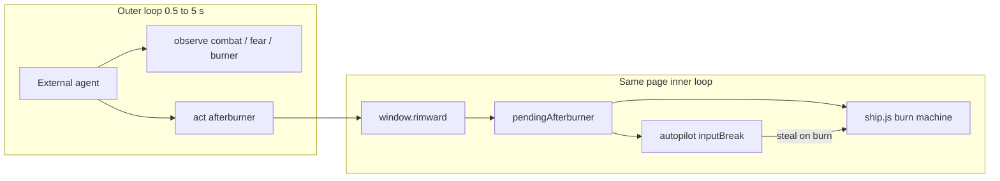

# RIMWARD Wave 137 — Agent evade / flee (outer afterburner)

| Field | Value |
|---|---|
| **Title** | RIMWARD AGENT EVADE (outer afterburner pulse) |
| **Author** | Wave 137 leftover integrator |
| **Date** | 2026-08-26 |
| **Status** | Implemented Wave 138 PR1. Owner playtest: afterburner now latches a session flee helm that samples headings, prefers a sun-clear run to the station ring, and pulses in-zone dock. Not pad warp. Merge law: shared-contract.md wins. |
| **Wave** | 137 — markdown leftover pack only. |
| **Owner request** | Inbox P1 AGENT API/AI: A Fear 5 starter drifter cannot flee under agent control and dies a lot. Give the outer loop a usable evade/flee path (and/or pace Fear for agent playtests) without a cheat warp. Census live code. If a named outer intent already lets an opted-in agent break off, afterburner-flee, or reach a safe vector without `__ctx` synthesis and without teleport, freeze leftover **CONSUME** and serial **none**. Census: **not** live. Freeze leftover **REAL** and name later serial **PR1**. |
| **Merge law** | [`out/w137/evade/shared-contract.md`](../out/w137/evade/shared-contract.md). If this document and that file conflict, **the contract wins**. |
| **Honor** | HUD-01 empty 80 px hub. Aim-glass gauges stay off. Kit mutate omit. Digit 0/8/9 stay. No new Digit. KeyH/J/L/M/P stay. KeyD strafe. `innerHTML` forbidden later. Toasts stay `textContent`. `state.js` READ-ONLY later. No new WORLD_FIELDS. No persist of `optIn`. `window.__ctx` stays debug/harness. Do **not** teleport. Do **not** grant credits, hull, or cargo. No in-repo LLM runner. No page WebSocket. No `XAI_API_KEY` in the bundle. Owner pick **2A** pad non-goal. Do **not** land pad-seeker / third helm / warp-to-pad. Do **not** steal CTL-03 PR2, CTL-04 PR2 `fireHeld`, AI-05 PR2 home-berth bubble, Hail01, Hail02, HUD-06, HUD-07, NAV-09, NAV-10 governor, TGT-07 stills, MSN-04 other families. Do **not** steal sibling Wave 137 packs (NAV-11, MSN-05, routepersist, oreguide). Do **not** reopen Agent API PR1–PR6. Do **not** edit `docs/AgentApiDesign.md`, the wishlist, or `PROGRESS.md`. CTL-02 never writes `flags.paused`. CTL-03: `act` while held still `token: 'held'`. Agent badge stays Wave 134/Fable pin (top-right). Do not cover PWR/range marker. Badge overlap Manifest is a sibling inbox. Do not “fix” known REDMARCH `castMatches` flake. Fail closed: never throw from act; bad name → unknown; non-finite pose → no warp. |

**Verifier record:**

| Note | Path |
|---|---|
| Inventory (code wins; Wave 137 census) | [`out/w137/evade/current-agent-evade-inventory.md`](../out/w137/evade/current-agent-evade-inventory.md) |
| Merge law | [`out/w137/evade/shared-contract.md`](../out/w137/evade/shared-contract.md) |
| Security review | [`out/w137/evade/security-review.md`](../out/w137/evade/security-review.md) |
| Design-doc review | [`out/w137/evade/code-review.md`](../out/w137/evade/code-review.md) |
| UI audit | [`out/w137/evade/ui-audit.md`](../out/w137/evade/ui-audit.md) |
| Notes | [`out/w137/evade/notes.md`](../out/w137/evade/notes.md) |

Siblings NAV-11 / MSN-05, Agent API optional leftovers, AI-05 PR2, pad 2B, wishlist, `PROGRESS.md`, and `docs/AgentApiDesign.md` are **other workers**. **Do not edit** those paths. **Do not** write `src/`. **Do not** write `out/w137/evade/verify/**`.

**This is not NAV-10 human SLOW cue.** **This is not NAV-03 Autopilot.** **This is not pad 2B.** **This is not AI-05 PR2 home-berth bubble.** Wishlist evade/flee is **INBOX**. Census still finds **no afterburner `act`**.

Honor `docs/AgentApiDesign.md` header/laws: handle first, observe + `act({ v, name, args })`, `__ctx` debug, opt-in, hypot latch, forbidden cheat names, desk attach, no in-repo LLM, pad **2A**. This pack does **not** rewrite that document.

---

## Overview

Inbox source (`docs/PLAYER-EXPERIENCE-WISHLIST.md` Playtest capture 2026-08-27 Claude Fable — **292–297** — **cite, do not edit**):

> INBOX (P1, AGENT API/AI): A Fear 5 starter drifter cannot flee under
> agent control and dies a lot. Fable’s run was a pirate gauntlet; two hull
> losses. AI-05 starter grace is live, but this agent still could not break
> off, afterburner-flee, or reach a pad without a hand-rolled loop. Give the
> outer loop a usable evade/flee path (and/or pace Fear for agent playtests)
> without a cheat warp.

Wave 137 this worker lands markdown only. Bindings do not change here.

Census (code wins): `COMMAND_NAMES` has no `afterburner` / `evade` / `flee` (`src/game/agent-schema.js` **17–40**). `dispatchLive` default is `unknown` (`src/systems/agent-api.js` **432**). `PULSE_EDGES` are dock/hail/target/reticleLock (`agent-api.js` **30**; `controls.js` **64**). Space afterburner lives in an `initControls` local (`controls.js` **458**, **490–492**). `agentPulse` cannot set it (`controls.js` **252–276**). Autopilot dests are **systems** (`nav.js` **279–300**; `autopilot.js` **119–120**). `dock` is in-zone KeyJ (`agent-api.js` **399–404**). AI-05 hop **60** s + death calm **90** s are live; drifter extra starter is **0** (`npc.js` **169–174**, **184**; `state.js` **588**, **766**). Leftover is **REAL**.

This leftover is a **named outer afterburner pulse**. It is not a new Digit. It is not god-mode. It is not pad Autopilot. It is not a Fear mute.

This document is the integrator for a **later** implementation wave.

HUD-01 empty aim glass stays empty. `state.js` stays READ-ONLY. No new persist key. Digit 0/8/9 stay. Do not invent UU.

Wave 137 deputize (recorded here and in the contract; owner may override after playtest): `act({ name: 'afterburner' })` queues the live Space edge. Inner `ship.js` burn machine unchanged. Afterburner still steals AP/AM. Hypot latch stays. Pad 2A stays a non-goal. Fear stays AI-05. Fail-closed.

If census had proved a named outer intent already let an opted-in agent break off combat, afterburner-flee, or reach a safe vector without `__ctx` synthesis and without teleport, this pack would freeze **CONSUME** and name serial **none**. Census did not. That CONSUME path is unexpected.

---

## Background & Motivation

### Why this change is needed

Fable’s Fear **5** drifter (`ORIGINS.drifter` `state.js` **763–767**) starts in **redmarch**. AI-05 hop grace is **60** s and death calm is **90** s (`JUMP.graceSeconds`; `DEATH_CALM_SECONDS`). Drifter extra starter is **0** (`STARTER_GRACE_SECONDS.drifter`). A pirate gauntlet after hop grace is legal. Humans tap **Space** (×2 for 6 s). The outer loop cannot.

Cruise is **120** u/s. Cutter burn is **210** u/s (`SHIP_CLASSES`). AP flies a **gate**. Dock needs **45** u. Without afterburner, the agent either dies or forges keys against `window.__ctx`. That is the captured two hull losses.

Wave 126 v1 forbade an afterburner pulse so PR3 would not grow a third helm (`docs/AgentApiDesign.md` **398**). That serial is complete. The new inbox is **flee**, not pad-seeker.

### Current state (inventory)

Source of truth: [`out/w137/evade/current-agent-evade-inventory.md`](../out/w137/evade/current-agent-evade-inventory.md). Code wins.

| Surface | Today | Cite |
|---|---|---|
| Public handle | `window.rimward` observe + act | `agent-api.js` **689–696** |
| Afterburner `act` | **none** → unknown | `agent-schema.js` **17–40**; `agent-api.js` **432** |
| Pulse edges | four names, no afterburner | `agent-api.js` **30** |
| Space | initControls-local pending | `controls.js` **458**, **490–492** |
| Burn machine | live | `ship.js` **755–766** |
| AP dests | systems / gates | `nav.js` **279–300** |
| Dock | in-zone 45 u | `agent-api.js` **399–404** |
| Fear observe | `world.fear` | `agent-observe.js` **450** |
| Combat observe | `flags.combat` | `agent-observe.js` **437** |
| Burner observe | `burnerActive` only | `agent-observe.js` **432** |
| AI-05 | hop 60 + death 90; drifter extra 0 | `npc.js` **169–185** |
| Forbidden | teleport / warp / god | `agent-schema.js` **69–76**, **175** |
| Pad 2A | v1 non-goal | `AgentApiDesign.md` **173**, **227**, **376** |

### Pain points

- `plotRoute` + AP is a **gate** vector. It is not a burn. Afterburner **cancels** AP (`autopilot.js` **175**).
- `dock` refuses `range` outside the pad. Tests place the hull. That is 2A, not flee.
- Observe shows combat and fear. The agent still cannot tap Space.
- Retuning Fear or deleting redmarch pirates would steal AI-05 / origin authored danger.
- A warp-to-safe-vector is a cheat.
- A third helm toward the pad is owner **2B**, a different wave.
- NAV-10 SLOW is a **human** HUD cue. It does not fly the agent.

### Why now (design) / why not now (code)

The owner asked for the leftover integrator so a later serial can name afterburner **before** the first `act` write. Inventory shows a live burn machine and a missing outer verb. Merge law can exist without touching `src/`. Implementation waits so pad theft, Fear mute, teleport, third helm, and persist god-mode are frozen. Wave 137 this worker does not ship `src/`.

If census had proved the flee path already existed, this pack would freeze **CONSUME**. Census did not.

---

## Goals & Non-Goals

### Goals

1. Document live acts, Space afterburner, AP dests, dock range, observe combat/fear, AI-05 grace, and forbidden names from **live code**.
2. Freeze leftover **REAL**, named serial **PR1** (afterburner act). Product = **outer Space-equivalent pulse**. Not a new Digit. Not god-mode. Not pad AP. Not CONSUME.
3. Freeze deputize: one named `afterburner` act; lift `pendingAfterburner`; reuse `ship.js`; steal AP/AM as live Space; hypot latch stays.
4. Freeze pad **2A**: tests place hull in 45 u. Do not fly the pad.
5. Freeze Fear: AI-05 live; do not rewrite hop/death calm; do not persist mute.
6. Freeze honor: `__ctx` stays debug; no teleport; no free UU; `state.js` READ-ONLY; no new `WORLD_FIELDS`; no in-repo LLM.
7. Freeze later write-set in the contract (§1). First impl PR lands **without** an LLM.

### Non-goals (locked — do not reopen)

- No `src/` or live bindings in this worker.
- No in-repo LLM. **Never** `scripts/agent-demo.mjs`. External agents only.
- **v1 non-goal:** in-system pad approach / “steer to” / “approach and dock”. Owner **2A**. Not this leftover.
- No third helm channel.
- No HUD-01 hub child. No new Digit. No aim-glass agent pip.
- No `state.js` write. No WORLD_FIELDS agent blob. No persist `optIn`.
- No remote bind. No cheat commands. No god-mode shield.
- Do not steal NAV-10, NAV-03 dests, AI-05 PR2, Hail01/02, HUD-06/07, CTL-03/04, TGT-07 stills, MSN-04/05, NAV-11.
- Do not edit the wishlist, `PROGRESS.md`, `docs/AgentApiDesign.md`.
- Do not run Vite, Chrome, Playwright, or CDP in this wave.

---

## Key Decisions

Architectural choices. Contract wins if this table and [`shared-contract.md`](../out/w137/evade/shared-contract.md) ever drift.

| Decision | Choice | Rationale |
|---|---|---|
| 1. Leftover | **REAL**. Serial **PR1**. Not CONSUME. | No afterburner/evade act. AP is gates. Dock is in-zone. AI-05 does not give a flee verb. |
| 2. Verb | Named `afterburner`, not `evade` / `flee` / `warp` | Matches Space. `evade` implies pad or combat-off. `warp` is forbidden. |
| 3. Mechanism | Pulse pending flag; `ship.js` unchanged | Smallest additive. No second burn machine. |
| 4. Helm | No third helm. Burn steals AP/AM | Live `inputBreak`. Special-case keep-AP is helm creep. |
| 5. Pad | **2A** non-goal | Inbox “reach a pad” is sibling 2B. |
| 6. Fear | Do not retune | AI-05 live. Prefer outer command. |
| 7. Observe | Optional `burnerReadyAt` in PR1 | HUD already shows cooldown. No `npc.ai`. |
| 8. Persist | None | Restore must not resume a burn cheat. |
| 9. Wave 126 **398** | Reopen afterburner **as this leftover only** | v1 closed helm creep. This inbox is flee. Do not edit AgentApiDesign. |
| 10. Badge | No chrome change | Last: afterburner via live lastIntent. |

---

## Proposed Design

### 1. Merge resolutions (contract wins)

| Question | Integrator freeze | Why |
|---|---|---|
| Leftover real? | **Yes** — no flee act | Inventory |
| CONSUME? | **No**. Serial is **not** none | Census |
| First serial | **PR1 afterburner** | Named only |
| Pad 2B stolen? | **No** | Owner 2A |
| Third helm? | **No** | Space edge only |
| Fear rewrite? | **No** | AI-05 live |
| New persist key? | **No** | Contract §0.5 |
| `state.js` write? | **No** | Honor |
| LLM in-repo? | **Never** | Owner 4C |
| New Digit? | **No** | HUD-01 |
| Teleport? | **No** | Fail closed |
| `innerHTML`? | **No** | XSS |

### 2. Player / agent outcome

An opted-in outer loop that sees `flags.combat === true` can `act({ name: 'afterburner' })` without synthesizing Space and without writing `__ctx.input`. If power and cooldown allow, the hull burns ×2 for 6 s. Autopilot drops (same as a human tap). The agent may plot a gate and re-engage AP after the edge. The agent still cannot warp to a pad. Fear 5 is unchanged. Death calm is unchanged.

### 3. Serial PR plan (named only)

See contract §3. First remaining serial is **PR1**.

---

## Risks

| Risk | Level | Mitigation |
|---|---|---|
| Implementer ships pad helm as “reach a pad” | High | Contract 2A; write-set omits `station.js` / AP dests |
| Implementer mutes Fear for `?agent=1` | Critical | No npc.js claim; persist none |
| Implementer teleports 800 u on `evade` | Critical | Name is `afterburner`; warp forbidden |
| Agent burn keeps AP (third helm) | Med | Steal stays |
| `pendingAfterburner` stays closure-local | High | Contract lift to module scope |
| Dual `evade` + `afterburner` | Med | One name |
| Badge move / Manifest steal | Med | No style.css claim |
| LLM / page WS | Critical | Honor never |

---

## Open questions (owner may override after playtest)

1. Public `pulse.edge = 'afterburner'` alias — deputize **off** (named act only).
2. Observe `burnerReadyAt` — deputize **on**.
3. Token `cooldown` when not ready — deputize **off** (inner no-op; queued ok).
4. Law (b) Fear extra for agent playtests — **not PR1**. Different leftover if the owner drops (a).

---

## Appendix — AgentApiDesign honor (do not edit that file)

Copy of live owner locks this leftover must keep:

- Handle `window.rimward` v1. Observe always allowed. `act` opt-in.
- `__ctx` debug/harness. Not the public contract.
- Pad approach v1 non-goal (2A). Tests place 45 u.
- No in-repo LLM (4C). grok-4.5 external-only. Key never in the bundle.
- Forbidden: teleport, setCredits, setHull, setCargo, god, win.
- Hypot latch on `optIn`. Strafe / R-F / Space / Shift still steal.
- No PR7 runner. No PR8 helm. Far-pad 2B is a **new** wave, not this pack.
