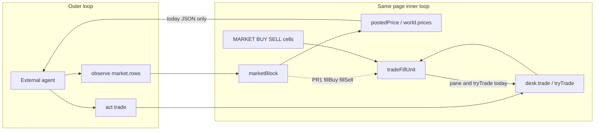

# RIMWARD Wave 139 — Agent market fill (observe JSON fill vs posted)

| Field | Value |
|---|---|
| **Title** | RIMWARD AGENT MARKET FILL (observe fill vs posted) |
| **Author** | Wave 139 leftover integrator |
| **Date** | 2026-08-27 |
| **Status** | Implemented Wave 140 PR1. Merge law: shared-contract.md wins. |
| **Wave** | 140 PR1 — observe `fillBuy` / `fillSell` vs posted. Desk `peekFillUnit` read-only. |
| **Owner request** | Inbox P2 AGENT API: Observe market rows expose **posted** table prices (`priceOf` / `world.prices`). Desk fill still applies rank, faction, epic, and hermit modifiers. An agent can still buy/sell on the wrong unit if it trusts JSON posted instead of the pane fill. Add fill buy/sell on the market block, or document that `trade` uses fill and show both. Census live `agent-observe.js` `marketBlock` / `postedPrice`, `station.js` `tradeFillUnit` / MARKET pane cells, `agent-api.js` `trade` act, and any boot-test TRADE offset. Code wins. If observe already exposes fill buy/sell that match `tradeFillUnit` (and agents cannot be misled by posted-only JSON), freeze leftover **CONSUME** and named serial **none**. Name: **no remaining Agent market-fill leftover.** Census: **posted-only rows**; `trade` still fills at `tradeFillUnit`. Freeze leftover **REAL** and name later serial **PR1**. |
| **Merge law** | [`out/w139/mktfill/shared-contract.md`](../out/w139/mktfill/shared-contract.md). If this document and that file conflict, **the contract wins**. |
| **Honor** | HUD-01 empty 80 px hub. Aim-glass gauges stay off. Kit mutate omit. Digit 0/8/9 stay. Digit 1 stays market. No new Digit. KeyH/J/L/M/P stay. KeyD strafe. `innerHTML` forbidden later. Toasts stay `textContent`. Pane stays `h()` `textContent`. `state.js` READ-ONLY later. No new WORLD_FIELDS. No persist of fill or `optIn`. `window.__ctx` stays debug/harness. Do **not** teleport. Do **not** grant credits, hull, or cargo. Do **not** retune UU / `HERMIT` / epic / rank. No in-repo LLM runner. No page WebSocket. No `XAI_API_KEY` in the bundle. Owner pick **2A** pad non-goal. Do **not** land pad-seeker / third helm / warp-to-pad. Do **not** steal Hail01, Hail02, HUD-06, HUD-07, NAV-09, NAV-10 governor, TGT-07 stills, MSN-04 other families, CTL-03, AI-05, CTL-04. Do **not** steal sibling Wave 139 packs (Agent badge layout, Market desk layout). Do **not** steal Agent API PR1–PR6. Do **not** reopen evade. Do **not** edit `docs/AgentApiDesign.md`, the wishlist, or `PROGRESS.md`. CTL-02 never writes `flags.paused`. CTL-03: `act` while held still `token: 'held'`. Agent badge stays Wave 134/Fable pin (top-right). Do not cover PWR/range marker. TRADE offset **5** stays. Fail closed: unknown commodity skip; non-finite fill omit or 0, never throw; never `for-in` `world.prices`; authored `COMMODITIES` keys only; prototype/reserved keys drop. `peekFillUnit` is read-only (never `tryTrade` from observe). Do not “fix” known REDMARCH `castMatches` flake. |

**Verifier record:**

| Note | Path |
|---|---|
| Inventory (code wins; Wave 139 census) | [`out/w139/mktfill/current-agent-market-fill-inventory.md`](../out/w139/mktfill/current-agent-market-fill-inventory.md) |
| Merge law | [`out/w139/mktfill/shared-contract.md`](../out/w139/mktfill/shared-contract.md) |
| Security review | [`out/w139/mktfill/security-review.md`](../out/w139/mktfill/security-review.md) |
| Design-doc review | [`out/w139/mktfill/code-review.md`](../out/w139/mktfill/code-review.md) |
| UI audit | [`out/w139/mktfill/ui-audit.md`](../out/w139/mktfill/ui-audit.md) |
| Notes | [`out/w139/mktfill/notes.md`](../out/w139/mktfill/notes.md) |

Siblings Agent badge layout / Market desk layout, Agent API PR1–PR6, evade, wishlist, `PROGRESS.md`, and `docs/AgentApiDesign.md` are **other workers**. **Do not edit** those paths. **Do not** write `src/`. **Do not** write `out/w139/mktfill/verify/**`.

**This is not a desk rewrite.** **This is not TRADE overflow.** **This is not badge Manifest overlap.** **This is not evade.** Wishlist observe fill vs posted is **INBOX**. Census still finds **posted-only JSON rows**.

Honor `docs/AgentApiDesign.md` header/laws: handle first, observe + `act({ v, name, args })`, `__ctx` debug, opt-in, hypot latch, forbidden cheat names, desk attach, no in-repo LLM, pad **2A**. This pack does **not** rewrite that document.

---

## Overview

Inbox source (`docs/PLAYER-EXPERIENCE-WISHLIST.md` Playtest capture 2026-08-27 Claude Fable — **308–312** — **cite, do not edit**):

> INBOX (P2, AGENT API): Observe market rows expose **posted** table
> prices (`priceOf` / `world.prices`). Desk fill still applies rank, faction,
> epic, and hermit modifiers. An agent can still buy/sell on the wrong unit
> if it trusts JSON posted instead of the pane fill. Add fill buy/sell on the
> market block, or document that `trade` uses fill and show both.

Wave 139 this worker lands markdown only. Bindings do not change here.

Census (code wins): `marketBlock` rows are `{ commodity, name, posted, hold, legal }` (`src/game/agent-observe.js` **267–273**). `postedPrice` comment already says desk fill may apply modifiers (**243**) but JSON has **no** fill keys. Nested `tradeFillUnit` applies rank, faction, epic, hermit, restricted, fixer (`src/systems/station.js` **4692–4714**). Pane BUY/SELL cells call it (**4842–4843**). `tryTrade` debits/credits those units (**4736**, **4745**). Agent `trade` calls `desk.trade` (`src/systems/agent-api.js` **369–382**). Boot-test TRADE offset is **5** (`scripts/boot-test.mjs` **2809–2811**). Leftover is **REAL**.

This leftover is **observe fill vs posted**. It is not a new Digit. It is not god-mode prices. It is not a pane wrap.

This document is the integrator for a **later** implementation wave.

HUD-01 empty aim glass stays empty. `state.js` stays READ-ONLY. No new persist key. Digit 0/8/9 stay. Digit 1 stays market. Do not invent UU.

Wave 139 deputize (recorded here and in the contract; owner may override after playtest): add `fillBuy` / `fillSell` on observe market rows; keep `posted`; read live `tradeFillUnit` via `peekFillUnit` (or export) **without moving** the helper; do not rewrite `trade` / pane. Fail-closed.

If census had proved fill buy/sell already on observe matching `tradeFillUnit`, this pack would freeze **CONSUME** and name serial **none**. Census did not. That CONSUME path is unexpected.

---

## Background & Motivation

### Why this change is needed

Fable’s agent sees JSON `posted` (`COMMODITIES.provisions.base` **100** on the hardening fake ctx; live `world.prices` at a dock). Humans see BUY/SELL **fill** cells. Hermit Vigil buy is posted × epic × **1.25** (`station.js` **4695–4697**; `state.js` **622**). Rank goodwill is sell-only (**4698–4699**). An agent that budgets `posted * qty` can think a buy is legal and then lose more UU than planned, or refuse a sell that the pane would pay.

`trade` is already honest: it calls `tryTrade` → `tradeFillUnit`. The lie is the **observe row**, not the desk.

Wave 126/131 market observe shipped posted-only on purpose (`docs/AgentApiDesign.md` **337**). That serial is complete. The new inbox is **fill on the JSON row**. Do not edit AgentApiDesign.

### Current state (inventory)

Source of truth: [`out/w139/mktfill/current-agent-market-fill-inventory.md`](../out/w139/mktfill/current-agent-market-fill-inventory.md). Code wins.

| Surface | Today | Cite |
|---|---|---|
| Public handle | `window.rimward` observe + act | `agent-api.js` (honor) |
| Market JSON | posted only | `agent-observe.js` **267–273** |
| Posted helper | table / base / 0; fill comment | **242–256** |
| Desk fill | nested `tradeFillUnit` | `station.js` **4692–4714** |
| Pane cells | BUY/SELL fill | **4842–4847** |
| `trade` act | desk `tryTrade` fill | `agent-api.js` **369–382** |
| TRADE offset | **5** | `boot-test.mjs` **2809–2811** |
| Hardening | `posted === 100`; no fill | `agent-api-hardening-test.mjs` **318–325** |
| Digit 1 | market | `station.js` **189** |
| Forbidden | teleport / warp / god | `agent-schema.js` **69–76**, **175** |

### Pain points

- Posted JSON + fill desk = wrong-unit trades for any agent that trusts observe.
- The `postedPrice` comment is not a field. Agents do not read comments.
- Duplicating fill math in observe **will drift** from hermit/fixer/restricted.
- Moving `tradeFillUnit` into `state.js` **claims** READ-ONLY.
- Rewriting `tryTrade` to posted **undoes** the pane honesty (wishlist **286–288** DONE).
- Wrapping `.market-actions` **steals** sibling Market desk layout.
- Moving the badge **steals** sibling Agent badge layout.
- `for-in` `world.prices` copies save-attacker keys.
- `innerHTML` of commodity names is XSS.
- Persist of a “use posted” flag is god-mode mute.

### Why now (design) / why not now (code)

The owner asked for the leftover integrator so a later serial can name fill fields **before** the first observe write. Inventory shows posted-only JSON and a live fill helper. Merge law can exist without touching `src/`. Implementation waits so desk rewrite, helper move, TRADE offset, layout theft, persist god-mode, and prototype keys are frozen. Wave 139 this worker does not ship `src/`.

If census had proved fill already on observe, this pack would freeze **CONSUME**. Census did not.

---

## Goals & Non-Goals

### Goals

1. Document live observe market rows, `postedPrice`, `tradeFillUnit`, pane cells, `trade` act, and TRADE offset from **live code**.
2. Freeze leftover **REAL**, named serial **PR1** (observe fill buy/sell). Product = **JSON fill that matches the desk**. Not a desk rewrite. Not CONSUME.
3. Freeze deputize: `fillBuy` / `fillSell`; keep `posted`; read live helper without moving it; omit non-finite; skip unknown/reserved.
4. Freeze desk: `tryTrade` / pane / TRADE offset **5** unchanged.
5. Freeze honor: `__ctx` stays debug; no teleport; no free UU; `state.js` READ-ONLY; no new `WORLD_FIELDS`; no in-repo LLM.
6. Freeze later write-set in the contract (§1). First impl PR lands **without** an LLM.

### Non-goals (locked — do not reopen)

- No `src/` or live bindings in this worker.
- No in-repo LLM. **Never** `scripts/agent-demo.mjs`. External agents only.
- **v1 non-goal:** pad approach. Owner **2A**. Not this leftover.
- No third helm channel.
- No HUD-01 hub child. No new Digit. No aim-glass agent pip.
- No `state.js` write. No WORLD_FIELDS agent blob. No persist `optIn` / fill mute.
- No remote bind. No cheat commands. No god-mode prices.
- Do not rewrite `tryTrade` / `renderMarket`. Do not move `tradeFillUnit`.
- Do not steal Hail01/02, HUD-06/07, NAV-09, NAV-10 governor, TGT-07 stills, MSN-04, CTL-03/04, AI-05.
- Do not steal sibling Wave 139 Agent badge layout or Market desk layout.
- Do not reopen evade. Do not edit the wishlist, `PROGRESS.md`, `docs/AgentApiDesign.md`.
- Do not run Vite, Chrome, Playwright, or CDP in this wave.

---

## Key Decisions

Architectural choices. Contract wins if this table and [`shared-contract.md`](../out/w139/mktfill/shared-contract.md) ever drift.

| Decision | Choice | Rationale |
|---|---|---|
| 1. Leftover | **REAL**. Serial **PR1**. Not CONSUME. | Posted-only JSON. Desk already fills. |
| 2. Fields | `fillBuy` / `fillSell` + keep `posted` | Inbox “show both”. Distinct from side. |
| 3. Desk | Unchanged `tryTrade` / pane | Wishlist pane fill already DONE. |
| 4. Helper | Read live; do not move | Nested today; peek/export only. |
| 5. Duplicate math | **Forbidden** | Drift = same hole. |
| 6. Comment-only | **Not enough** | Agents trust JSON, not comments. |
| 7. Persist | None | Restore must not mute fill. |
| 8. TRADE offset | **5** stays | Boot-test / sibling layout. |
| 9. Badge | No chrome change | Sibling inbox. |
| 10. AgentApiDesign | Honor; do not edit | New leftover doc owns fill fields. |

---

## Proposed Design

### 1. Merge resolutions (contract wins)

| Question | Integrator freeze | Why |
|---|---|---|
| Leftover real? | **Yes** — posted-only observe | Inventory |
| CONSUME? | **No**. Serial is **not** none | Census |
| First serial | **PR1 observe fill** | Named only |
| Rewrite desk? | **No** | Honor |
| Move helper? | **No** | Honor |
| New persist key? | **No** | Contract §0.5 |
| `state.js` write? | **No** | Honor |
| LLM in-repo? | **Never** | Owner 4C |
| New Digit? | **No** | HUD-01 / Digit 1 market |
| Teleport? | **No** | Fail closed |
| `innerHTML`? | **No** | XSS |

### 2. Player / agent outcome

An opted-in outer loop that opens Digit 1 market sees JSON rows with `posted` **and** `fillBuy` / `fillSell`. Those fill integers match the pane BUY/SELL cells and match `act({ name: 'trade' })` debit/credit per unit. The agent can budget UU without trusting table price. Humans still use Q/W/A/S. TRADE buttons stay offset **5**. No new Digit. No teleport.

### 3. Serial PR plan (named only)

See contract §3. First remaining serial is **PR1**.

---

## Risks

| Risk | Level | Mitigation |
|---|---|---|
| Implementer rewrites `tryTrade` to posted | High | Contract: desk out |
| Implementer duplicates fill math | High | peek/export only |
| Implementer `for-in` `world.prices` | Critical | Authored COMMODITIES keys |
| Implementer `innerHTML` names | Critical | Forbidden |
| Persist fill mute / god prices | Critical | Persist none |
| Uncaught throw on bad peek | High | omit; never throw |
| Observe samples fill via `desk.trade` | Critical | peek read-only; never `tryTrade` from observe |
| TRADE wrap / badge move | Med | Sibling packs |
| LLM / page WS | Critical | Honor never |

---

## Open questions (owner may override after playtest)

1. Non-finite fill → omit vs `0` — deputize **omit**.
2. Desk hook `peekFillUnit` vs `export function tradeFillUnit` — deputize **peekFillUnit** (helper is nested).
3. Optional PR2 hermit still — deputize **skip unless owner asks**.

---

## Appendix — AgentApiDesign honor (do not edit that file)

Copy of live owner locks this leftover must keep:

- Handle `window.rimward` v1. Observe always allowed. `act` opt-in.
- `__ctx` debug/harness. Not the public contract.
- Pad approach v1 non-goal (2A). Tests place 45 u.
- No in-repo LLM (4C). grok-4.5 external-only. Key never in the bundle.
- Forbidden: teleport, setCredits, setHull, setCargo, god, win.
- Market observe today: `{ rows:[{ commodity, name, posted, hold, legal }] }` while docked on market (`docs/AgentApiDesign.md` **337**). `posted` is table price; fill may apply modifiers. **This leftover adds fill fields in a later PR.** Do not rewrite that document here.
- `trade` args `{ commodity, qty, side }` via `ctx.stationDesk.trade`.
- Hypot latch on `optIn`.
- No PR7 runner. No PR8 helm. Far-pad 2B is a **new** wave, not this pack.
