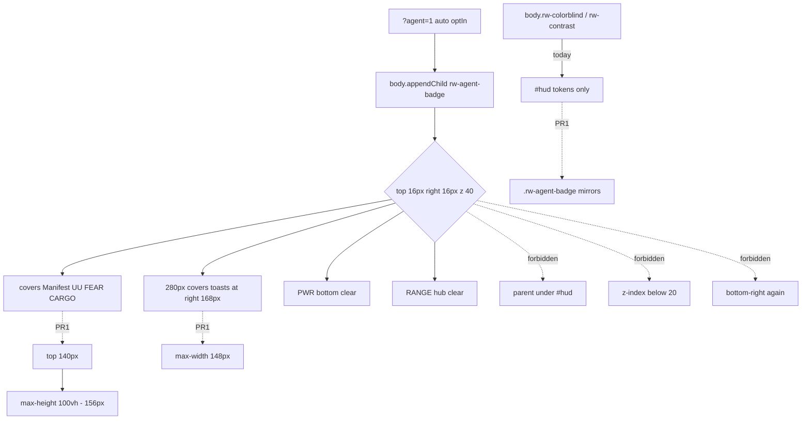

# RIMWARD Agent play badge layout + a11y tokens

| Field | Value |
|---|---|
| **Title** | RIMWARD Agent play badge layout + a11y tokens |
| **Author** | Wave 139 Agent badge leftover integrator |
| **Date** | 2026-08-27 |
| **Status** | Implemented Wave 140 PR1. Merge law: shared-contract.md wins. |
| **Wave** | 139 — leftover census + brief. No `src/`. KeyH/J/L/M/P stay. KeyD strafe. Digit 0/8/9 stay. |
| **Owner request** | Two INBOX items, one pack. (P2 HUD/AGENT): After the badge move, `?agent=1` still covers Manifest (UU / FEAR / CARGO) and some toasts at top-right (`z-index` 40 over HUD 10). Offset the badge below Manifest, or narrow it. Do not cover PWR or the range marker again. Do not lower badge `z-index` below the station scrim (20). (P3 HUD/AGENT): Colorblind and high-contrast body classes do not retint the Agent play badge tokens. Mirror HUD token overrides on `.rw-agent-badge` without moving it under `#hud`. Census live `.rw-agent-badge` in `src/style.css`, badge mount in `src/systems/agent-api.js`, Manifest / toast / PWR / range-marker layout in `src/ui/hud.css` + `src/systems/hud.js`, and `body.rw-colorblind` / `body.rw-contrast` token overrides. Code wins. If the badge already clears Manifest and toasts **and** colorblind/contrast retint badge tokens without moving the node under `#hud`, freeze leftover **CONSUME** and named serial **none**. Name: **no remaining Agent badge-layout leftover.** If census finds overlap and/or missing palette overrides, freeze leftover **REAL** and name later serial **PR1**. |
| **Merge law** | [`out/w139/badge/shared-contract.md`](../out/w139/badge/shared-contract.md). If this document and that file conflict, **the contract wins**. |
| **Honor** | HUD-01 empty 80 px hub. Aim-glass gauges stay off. Kit mutate omit. Digit 0/8/9 stay station. No new Digit. KeyH hail, KeyJ dock/jump, KeyL berth, KeyM chart, KeyP pause stay. KeyD strafe. Do not remap. CTL-02 never writes `flags.paused`. CTL-03/04 not this pack. `innerHTML` forbidden later. Buttons stay `type="button"` min 44 px. Color is not the only on/off cue (border solid vs dashed already). `reducedMotion` already exists — keep it. Body child stays. `z-index` **40**. No persist of badge geometry. Fail closed: missing Manifest is not a crash; badge still mounts on `document.body`; `?agent=1` still required to auto-enable; default `optIn` off. Do not steal Hail01 / HUD-06 / Hail02 / HUD-07 / NAV-09 / NAV-10 governor / TGT-07 stills / MSN-04 other families / CTL-03 / AI-05 / CTL-04. Do not steal sibling Wave 139 packs (Agent market fill, Market desk layout). Do not steal pad 2B or in-repo LLM. Do not reopen Agent API PR5 badge mount. Do not edit `docs/AgentApiDesign.md`. |

**Verifier record:**

| Note | Path |
|---|---|
| Inventory (code wins; Wave 139 census) | [`out/w139/badge/current-agent-badge-layout-inventory.md`](../out/w139/badge/current-agent-badge-layout-inventory.md) |
| Merge law | [`out/w139/badge/shared-contract.md`](../out/w139/badge/shared-contract.md) |
| Wave 139 security review | [`out/w139/badge/security-review.md`](../out/w139/badge/security-review.md) |
| Wave 139 design-doc review | [`out/w139/badge/code-review.md`](../out/w139/badge/code-review.md) |
| Wave 139 UI audit | [`out/w139/badge/ui-audit.md`](../out/w139/badge/ui-audit.md) |
| Wave 139 notes | [`out/w139/badge/notes.md`](../out/w139/badge/notes.md) |

Siblings Agent market fill, Market desk layout, Agent API design, HUD-07 deconfliction, pad 2B, wishlist, and `PROGRESS.md` are **other workers**. **Do not edit** those paths. **Do not** steal sibling Wave 139 paths. **Do not** write `out/w139/badge/verify/**`.

**This is not Agent API PR5 remount.** **This is not HUD-07.** **This is not market fill.** **This is not pad 2B.** Wishlist Manifest/toast overlap and badge palette miss are **INBOX**. Census still finds **`top: 16px` over Manifest** and **no badge colorblind/contrast rules**.

---

## Overview

Inbox source (`docs/PLAYER-EXPERIENCE-WISHLIST.md` Playtest capture 2026-08-27 Claude Fable — **313–317** and **324–327** — **cite, do not edit**):

> INBOX (P2, HUD/AGENT): After the badge move, `?agent=1` still covers Manifest (UU / FEAR / CARGO) and some toasts at top-right (`z-index` 40 over HUD 10). Offset the badge below Manifest, or narrow it. Do not cover PWR or the range marker again. Do not lower badge `z-index` below the station scrim (20). Cite `out/orch-fable/t2/ui-audit.md`.

> INBOX (P3, HUD/AGENT): Colorblind and high-contrast body classes do not retint the Agent play badge tokens. Mirror HUD token overrides on `.rw-agent-badge` without moving it under `#hud`. Cite `out/orch-fable/t2/ui-audit.md`.

The badge **already** sits top-right and **already** clears PWR and the hub range word. The hole is **corner share** with Manifest/toasts, plus **settings palette** that only retargets `#hud`.

Wave 139 this worker lands markdown only. Bindings do not change here.

Census (code wins): `.rw-agent-badge` is `top: 16px; right: 16px; z-index: 40; max-width: min(280px, …)` (`style.css` **38–48**). Manifest `.rw-resources` is `top: 14px; right: 14px` (`hud.css` **1172–1176**; meters UU / FEAR / CARGO `hud.js` **1263–1274**). Toasts `.rw-toasts` are `top: 14px; right: 168px` (`hud.css` **710–713**). `#hud` is z-index **10** (`style.css` **28**). Colorblind/contrast overrides are `body.rw-colorblind #hud` / `body.rw-contrast #hud` (`hud.css` **1234–1248**). Badge reduced-motion **exists** (`style.css` **128–132`). No badge palette rules. Leftover is **REAL**.

This leftover is a **CSS offset + token mirror** on a body-child play card. It is not a HUD hub child. It is not a remount. It is not a z-index drop.

This document is the integrator for a **later** implementation wave.

HUD-01 empty aim glass stays empty. No new persist key. Digit 0/8/9 stay. KeyH/J/L/M/P stay. Do not invent UU. Do not steal market fill or pad 2B.

Wave 139 deputize (recorded here and in the contract; owner may override after playtest): `top: 140px`; `max-width: min(148px, calc(100vw - 32px))`; `max-height: calc(100vh - 156px)`; z-index **40**; Okabe-Ito + contrast mirrors on `.rw-agent-badge`; keep reduced-motion and solid/dashed.

If census had proved Manifest/toasts already clear **and** palette already mirrored without a HUD parent, this pack would freeze **CONSUME** and name serial **none**. Census did not. That CONSUME path is unexpected.

---

## Background & Motivation

### Current state (inventory)

Source of truth: [`out/w139/badge/current-agent-badge-layout-inventory.md`](../out/w139/badge/current-agent-badge-layout-inventory.md). Code wins.

| Surface | Today | Cite |
|---|---|---|
| Badge pin | `top: 16px; right: 16px; z-index: 40` | `style.css` **38–43** |
| Badge size | max-width 280 px; max-height `100vh - 32px` | **48–50** |
| Mount | `document.body` child; `createElement` | `agent-api.js` **511–566**, **706** |
| Query enable | `?agent=1` → `optIn true` | **48–71**, **640** |
| Manifest | top-right UU / FEAR / CARGO | `hud.js` **1263–1274**; `hud.css` **1172–1176** |
| Toasts | `top: 14px; right: 168px` | `hud.css` **710–713** |
| PWR | bottom strip | `hud.js` **1223**; `hud.css` **1021–1025** |
| Range word | hub `.rw-reticle-range` | `hud.css` **207–220** |
| Colorblind | `#hud` only | `hud.css` **1234–1238** |
| Contrast | `#hud` only | `hud.css` **1243–1248** |
| Reduced motion | badge already | `style.css` **128–132** |
| ON/OFF | text + solid/dashed | `style.css` **61–67** |

The previous pin fix cleared PWR, the range word, and docked market bottom rows (wishlist DONE **283–285**). It moved the cover onto Manifest and toasts. Palette was never wired.

### Pain points

- Top-right 280 px card at z-index 40 hides UU / FEAR / CARGO and toast chips during `?agent=1` flight.
- A naive later PR that drops z-index below 20 **click-jacks** Enable/Stop under the station scrim.
- A naive later PR that pins bottom-right again **hides PWR / RANGE** (safety for flight power).
- A naive later PR that parents the badge under `#hud` **steals** HUD-01 / pointer-events none and reopens PR5.
- A naive later PR that only offsets `top` and keeps 280 px **still covers toasts**.
- A naive later PR that only narrows and stays at `top: 16px` **still covers Manifest**.
- A naive later PR that keeps `max-height: calc(100vh - 32px)` after raising `top` **can cover PWR**.
- A naive later PR that moves the node under `#hud` “so tokens inherit” **steals** body-child freeze.
- A naive later PR that `innerHTML`s intent names is XSS.
- A naive later PR that writes `flags.paused` **steals** CTL-02.
- A naive later PR that persists `top`/`width` is a geometry save the honor forbade.
- Colorblind/contrast players keep default cyan on the play overlay while the HUD retints.

### Why now (design) / why not now (code)

The owner asked for the Agent badge leftover integrator so a later serial can clear Manifest/toasts **and** retint tokens **before** the first CSS edit. Inventory shows overlap and missing palette. Merge law can exist without touching `src/`. Implementation waits so HUD-child theft, z-index drop, bottom-right regression, persist geometry, and `hud.css` claims are frozen before the first rule. Wave 139 this worker does not ship `src/`.

If census had proved both holes already closed, this pack would freeze **CONSUME** and name serial **none**. Census did not.

---

## Goals & Non-Goals

### Goals

1. Document live badge pin, mount, Manifest / toast / PWR / range layout, z-index stack, and a11y body classes from **live code**.
2. Freeze leftover = **layout offset + token mirror**. Not PR5 remount. Not HUD-07. Not market fill.
3. Freeze deputize: `top: 140px`; Manifest-column width; PWR-safe max-height; z-index 40; Okabe-Ito + contrast on `.rw-agent-badge`. Owner may override after playtest. Do not park.
4. Freeze persist: **none** new. No badge geometry. No new Digit.
5. Freeze HUD-01 empty hub. Digit 0/8/9 stay. KeyH/J/L/M/P stay. KeyD strafe.
6. Freeze later copy via `textContent`. `innerHTML` forbidden. Color is not the only on/off cue.
7. Freeze a serial PR plan. This wave writes the document. A later wave ships serially.

### Non-goals (locked — do not reopen)

- No `src/` or live bindings in this worker.
- No `flags.paused` write. CTL-03/04 not this pack.
- No Agent API PR5 remount / HUD child.
- No `src/ui/hud.css` claim. No `hud.js` / `agent-api.js` / `settings.js` claim.
- No `--rw-text-scale` on the badge (inbox is palette).
- No z-index below 20 or above pause 50.
- No bottom-right pin. No PWR / RANGE cover.
- No persist of badge geometry. No new WORLD_FIELDS.
- No Hail01 / HUD-06 / Hail02 / HUD-07 / NAV-09 / NAV-10 / TGT-07 / MSN-04 / CTL-03 / AI-05 / CTL-04.
- No sibling Wave 139 Agent market fill or Market desk layout.
- No pad 2B. No in-repo LLM.
- Do not edit the wishlist, `PROGRESS.md`, `docs/AgentApiDesign.md`, OwnerDecisions*.
- Do not write `out/w139/badge/verify/**`.
- Do not start Vite or Chrome. Do not call `graph_propose` / `graph_approve`.

---

## Proposed Design

### 1. Merge resolutions (contract wins)

| Question | Integrator freeze | Why |
|---|---|---|
| Leftover real? | **Yes** | Inventory §8 |
| CONSUME? | **No**. Serial is **not** none | Overlap live; palette **not** live |
| New persist key? | **No** | Contract §0.5 |
| HUD child? | **No** | Honor PR5 |
| Claim `hud.css` / `hud.js` / `agent-api.js`? | **No** | Census: CSS offset enough |
| Drop z-index? | **No**. Keep **40** | Scrim 20; pause 50 |
| Bottom-right again? | **No** | PWR / RANGE safety |
| Offset only **or** narrow only? | **Both** | Offset clears Manifest; width clears toasts |
| Named PR1? | **PR1** CSS in `style.css` | REAL leftover |

### 2. Current pin (do not break PWR / RANGE / PR5)

Wave Fable t2 moved the card from bottom-right to top-right. PWR, hub RANGE, and market bottom rows stay free. Manifest and toasts do not. Palette stays default on the body child.

### 3. Deputize table (copy of contract §0.1)

Owner may override after playtest. Do not park.

| Knob | Value |
|---|---|
| `top` | `140px` |
| `right` | `16px` (unchanged) |
| `max-width` | `min(148px, calc(100vw - 32px))` |
| `max-height` | `calc(100vh - 156px)` |
| `z-index` | **40** |
| Colorblind | Okabe-Ito on `.rw-agent-badge` |
| Contrast | HUD contrast panel/edge/white on `.rw-agent-badge` |
| Reduced motion | keep live |
| ON/OFF | text + solid/dashed |
| Buttons | `type="button"` min 44 px |
| Mount | body child |
| Persist | none new |
| Fail-closed | missing Manifest ≠ crash |

### 4. Neighbours

| Module | This leftover does | This leftover does not |
|---|---|---|
| `src/style.css` | later PR1: pin, width, height, palette mirrors | drop z-index; HUD child; innerHTML |
| `hud.css` | **none** | Manifest/toast/PWR rules |
| `hud.js` | **none** | remount; new class |
| `agent-api.js` | **none** (cite mount) | PR5 rewrite; query gate change |
| `settings.js` | **none** | text-scale on badge |
| `overlay-policy.js` | **cite only** | pause write |

### 5. Serial PR plan

Matches contract §3. **Named only. Do not implement in Wave 139.**

| PR | Lands | Does not land |
|---|---|---|
| **PR1** layout + a11y | offset + width + PWR-safe max-height + token mirrors; z-index 40 | HUD child; `hud.css`; JS; persist; z drop; bottom pin |
| **PR2 stills (optional skip)** | `?agent=1` Manifest+toasts readable; PWR/RANGE clear; palette live | required with PR1 |

First remaining serial is **PR1**. It must not steal Digit 0/8/9. It must not claim `hud.css`. Do not land a HUD child as required PR1.

### 6. Picture

A player who loads `?agent=1` still sees Agent play at the **right** edge, **below** Manifest. UU / FEAR / CARGO stay readable. Toast chips at `right: 168px` stay readable. PWR and the hub RANGE word stay free. Enable/Stop stay 44 px and stay above the dock scrim (z-index 40). Colorblind settings retint badge accent to `#56B4E9`. High-contrast settings darken the badge panel. ON/OFF still uses text plus solid vs dashed. The node stays a body child.

---

## Player outcome (later serial; freeze here)

You launch with `?agent=1`. You fly. You read Manifest UU / FEAR / CARGO in the top-right. You read toasts to the left of Manifest. The Agent play card sits **under** that column, not on it.

You open settings. You enable colorblind-safe palette. The badge title accent matches the HUD Okabe-Ito cyan. You enable high contrast. The badge panel and edge match HUD contrast tokens.

You dock. Enable/Stop still receive clicks on the station scrim. You do **not** lose PWR. You do **not** lose the RANGE word. You do **not** pause.

**Agent API PR5 mount** is **not** this work. **Market fill** is **not** this work. **HUD-07** is **not** this work.

---

## Security

See [`out/w139/badge/security-review.md`](../out/w139/badge/security-review.md).

- XSS: no `innerHTML` for intent / error / title. `textContent` only.
- Click-jack: do not drop z-index below scrim 20.
- Flight safety: do not cover PWR or RANGE; retune `max-height` when `top` rises.
- Persist: no geometry key.
- Fail-closed: missing Manifest is not a crash; never throw; never write `paused`.

---

## Acceptance direction (implementation wave)

1. With `?agent=1` in flight, Manifest UU / FEAR / CARGO are not covered by `.rw-agent-badge`.
2. Toast column at `right: 168px` is not covered by the badge.
3. PWR and `.rw-reticle-range` stay clear.
4. Badge `z-index` is **40**.
5. `body.rw-colorblind .rw-agent-badge` uses `--rw-accent: #56B4E9` (and the other Okabe-Ito state tokens).
6. `body.rw-contrast .rw-agent-badge` uses HUD contrast `--white` / `--panel` / `--panel-edge` (and `--dim`).
7. Node remains a `document.body` child. Not under `#hud`.
8. Buttons stay `type="button"` min 44 px. Solid vs dashed ON/OFF stays. Reduced-motion stays.
9. No new `WORLD_FIELDS`. No `innerHTML`. No `hud.css` / `hud.js` / `agent-api.js` write. No Digit remap.
10. Missing Manifest does not crash. Default `optIn` remains off without trusted Enable / `?agent=1`.

---

## Alternatives considered

| Alternative | Why not |
|---|---|
| Freeze CONSUME / serial none | PWR/RANGE clear is the **old** fix; Manifest/toasts and palette still hole |
| Parent under `#hud` so tokens inherit | Reopens PR5; HUD pointer-events none; HUD-01 steal |
| Drop z-index to 15 | Enable/Stop under station scrim 20 |
| Bottom-right pin | Covers PWR / RANGE again |
| Offset only, keep 280 px | Toasts at `right: 168px` still under the card |
| Narrow only, keep `top: 16px` | Manifest still under the card |
| JS measure of `.rw-resources` | Claims `hud.js` / `agent-api.js`; per-frame layout; persist temptation |
| `--rw-text-scale` on badge | Inbox is palette; would claim `settings.js` to set the var |
| Persist last `top` | Geometry save forbidden |
| `innerHTML` status | XSS |
| Pause while “agent overlay” | CTL-02 |

---

## Regression risks

| Risk | Mitigation |
|---|---|
| XL textScale Manifest taller than 140 px | 140 px sized for scale 1.5 census; owner may raise after still |
| Narrow 148 px wraps buttons | `flex-wrap` + 44 px already live; two buttons fit `44+8+44` |
| Tall card covers PWR | `max-height: calc(100vh - 156px)` |
| Dock credits overlap on 1280 px | accepted for z-index 40 (orch-fable t2); do not drop z |
| Color-only ON | keep dashed vs solid + text |
| Token drift vs HUD | copy the live hex/rgba from `hud.css` **1234–1248** |
| Digit 0/8/9 | no new Digit |
| PR5 remount | do not claim `agent-api.js` |
| `reducedMotion` | keep live rules |

---

## Ownership

| Object | Writer | Reader |
|---|---|---|
| Badge pin / size / palette | later PR1 `src/style.css` | player |
| Badge DOM | live `agent-api.js` (unchanged) | player |
| Manifest / toasts / PWR / RANGE | live `hud.css` / `hud.js` (unchanged) | player |
| Body a11y classes | live `settings.js` (unchanged) | CSS |
| `flags.paused` | **none** (KeyP) | overlay-policy |
| `docs/AgentApiDesign.md` | **none** | — |

---

## Open owner questions (non-blocking)

1. Prefer keep `max-width: 280px` and only offset `top`? Default: **no** — toasts stay covered. Width cap is in PR1.
2. Prefer a larger `top` if XL Manifest still clips after playtest? Default: **140 px** now; raise in a still, not a second required PR.
3. Should `--rw-text-scale` also multiply badge type? Default: **not this leftover** (inbox P3 is palette only).
