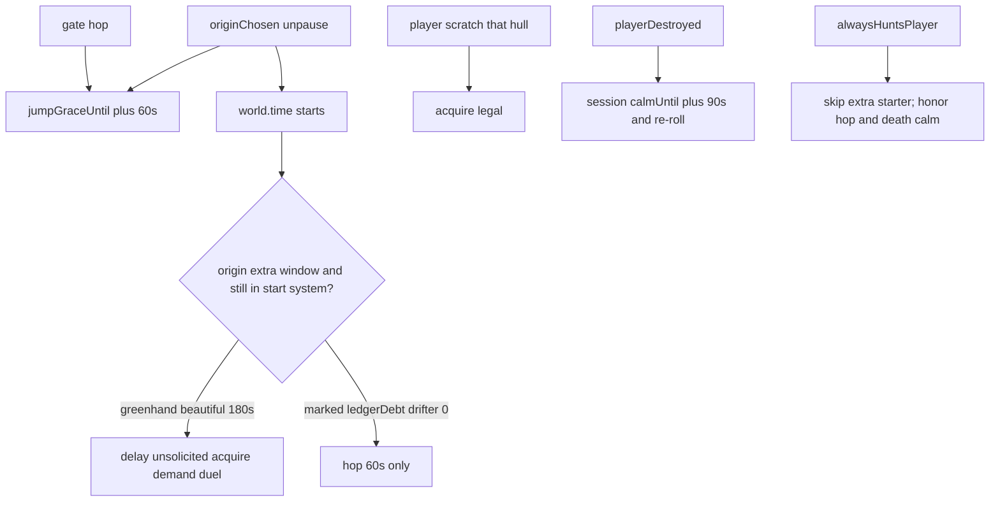

# RIMWARD AI-05 remaining starter grace / hostility pacing

| Field | Value |
|---|---|
| **Title** | RIMWARD AI-05 remaining starter grace / hostility pacing |
| **Author** | Wave 124 leftover integrator |
| **Date** | 2026-08-25 |
| **Status** | Wave 125 PR1 implemented. Death calm is session remaining `deathCalmLeft` (90 s of dt), not an absolute `world.time` stamp. Hop tamper still fail-closes remaining > 180 s to 0. Leftover **REAL**. Named serial **PR1 starter-grace**. Merge law [`out/w124/startergrace/shared-contract.md`](../out/w124/startergrace/shared-contract.md) — that file wins on conflict. |
| **Wave** | 125 — npc.js PR1 starter-grace. |
| **Owner request** | Inbox P0 ONBOARDING/AI leftover: starter-system grace. A pirate ace attacked ~1 minute after origin pick; after respawn a new demand arrived within another minute; four attacks in ~10 minutes. Mining and trade are not playable. Add a spawn-area grace window, a pirate interest cooldown after death, or a patrolled safe bubble near the home berth. AI-04 defines who is hostile; nothing covers hostility pacing or starter difficulty. Census live code. If real, freeze later serial **PR1**. If already gone, freeze CONSUME. Census did **not** prove gone. |
| **Merge law** | [`out/w124/startergrace/shared-contract.md`](../out/w124/startergrace/shared-contract.md). If this document and that file conflict, the contract wins. |
| **Honor** | HUD-01 empty hub. Digit 0/8/9 stay. No new Digit. No new key. Kit mutate omit. Aim-glass gauges stay off. `state.js` READ-ONLY later. No new persist key (default session + `world.time`). `innerHTML` forbidden later. Toasts stay `textContent`. AI-04 who unchanged. Dresk / Illyx / Vane not deleted. Do **not** edit the wishlist, `PROGRESS.md`, `docs/Ctl*.md`, `docs/Nav*.md`, or `docs/OwnerDecisions*.md`. Do **not** write `docs/OwnerDecisionsWave124.md`. Do **not** steal P2 encyclopedia, P1 hail cards, CTL-03, CTL-04, PHY avoid, AI-01 spawn clearance, pirate mix cap. |

**Verifier record:**

| Note | Path |
|---|---|
| Inventory (code wins; Wave 124 census) | [`out/w124/startergrace/current-ai05-starter-grace-inventory.md`](../out/w124/startergrace/current-ai05-starter-grace-inventory.md) |
| Merge law | [`out/w124/startergrace/shared-contract.md`](../out/w124/startergrace/shared-contract.md) |
| Security review | [`out/w124/startergrace/security-review.md`](../out/w124/startergrace/security-review.md) |
| Design-doc review | [`out/w124/startergrace/code-review.md`](../out/w124/startergrace/code-review.md) |
| UI audit | [`out/w124/startergrace/ui-audit.md`](../out/w124/startergrace/ui-audit.md) |
| Notes | [`out/w124/startergrace/notes.md`](../out/w124/startergrace/notes.md) |

Siblings CTL-03 / CTL-04, wishlist, `PROGRESS.md`, `docs/Ctl*.md`, `docs/Nav*.md`, and `docs/OwnerDecisions*.md` are **other workers**. **Do not edit** those paths. Do **not** write `src/`. Do **not** steal sibling Wave 124 paths (`out/w124/berthfreeze/**`, `out/w124/menuinput/**`).

**This is not AI-04 who-is-hostile.** **This is not P1 hail-demand lifecycle.** **This is not P2 onboarding encyclopedia.** **This is not PHY-02.** Wishlist starter grace is **PLANNED** (Wave 124 brief). Census still finds **60 s hop grace only** + **death keeps live interest**.

---

## Overview

Inbox source (`docs/PLAYER-EXPERIENCE-WISHLIST.md` Idea inbox — **cite, do not edit**):

> INBOX (P0, ONBOARDING/AI): Give the starter system a new-player grace period. A pirate ace attacked ~1 minute after the origin pick and destroyed the ship; after respawn a new demand arrived within another minute; four attacks landed in ~10 minutes. Mining and trade are not playable under this pressure. Add a spawn-area grace window, a pirate interest cooldown after a player death, or a patrolled safe bubble near the home berth. AI-04 defines who is hostile; nothing covers hostility pacing or starter difficulty.

Initiative AI-04 (`docs/PLAYER-EXPERIENCE-WISHLIST.md` **1257–1265**, status first pass DONE Wave 56 — **cite, do not edit**): traders never hunt; patrols need scratch or standing ≤ −10; pirates keep the wave-32 interest roll. **AI-04 is who. This leftover is when / how often / how close to home.**

Census (code wins): `JUMP.graceSeconds` is **60**. Origin pick stamps `world.jumpGraceUntil` with that hop length (`origins.js` **120**). Hunt acquire, pirate demand, and Carver Illyx’s duel wait on it (`npc.js` **1838**, **1893**, **1927–1935**). Freehold is 4 pirates + an authored ace. The mine field sits ≈ **796 u** from Illyx’s gate (`U.ENCOUNTER_BUBBLE` **800**). Death recover keeps live NPC AI (`save.js` **1139–1180**) and does not re-stamp grace. There is no origin-keyed extra window, no death interest cooldown, and no mining-safe bubble. Leftover is **real**.

This leftover is **two PR1 gates** (starter-system time grace + post-death session calm / re-roll) that delay **unsolicited** acquire / demand / duel. It is not a new Digit. It is not a god-mode shield. It is not a hail card.

This document is the integrator for a **later** implementation wave.

HUD-01 empty aim glass stays empty. `state.js` stays READ-ONLY. `JUMP.graceSeconds` stays **60**. No new persist key. Digit 0/8/9 stay. Do not invent UU. Do not steal Digit 0/8/9.

Wave 124 deputize (recorded here and in the contract; owner may override after playtest): Greenhand / Beautiful extra **180 s** of `world.time` in the start system. Marked / Ledger Debt / Drifter **0** extra (hop 60 s only). Death: session `calmUntil` **+90 s** and re-roll cold (Dresk delays, does not cancel). Scratch still breaks grace for that hull. Home-berth bubble is **optional PR2**.

If census had proved starter grace, death-interest cooldown, or a home-berth safe bubble already existed, this pack would freeze **CONSUME** and name serial **none**. Census did not.

---

## Background & Motivation

### Current state (inventory)

Source of truth: [`out/w124/startergrace/current-ai05-starter-grace-inventory.md`](../out/w124/startergrace/current-ai05-starter-grace-inventory.md). Code wins.

| Surface | Today | Cite |
|---|---|---|
| Who hunts | Traders never; patrols scratch or standing ≤ −10; pirates roll; aces duel | `npc.js` **1182–1190**, **1697–1715**, **1912+** |
| Interest roll | base 0.005 … max 0.20; Dresk chance **1** | **155–163**, **1698** |
| Hop / new-game grace | **60 s** `jumpGraceUntil` | `state.js` **588**; `origins.js` **120**; `jump.js` **162** |
| Acquire gate | hop grace + law 300 u + bubble 800 + interested | `npc.js` **1835–1849** |
| Demand | after acquire; 300 s record cooldown; `hailOpened` | **1880–1907** |
| Telegraph toast | `Heave to. Cargo or hull.` | **1669** |
| Ace duel grace | hop 60 s only; **no** interest roll | **1927–1935** |
| Law zone | 300 u; hostile intent never develops | **97**, **1795–1798** |
| Freehold cast | 4 pirates + ace Illyx | `authored-systems.js` **54**; `world.js` **348–420** |
| Rocks vs Illyx | field ≈ 796 u from gate (bubble 800) | authored **43–44**; `U` **27** |
| Death recover | live NPCs kept; no grace re-stamp | `save.js` **1139–1329** |
| `WORLD_FIELDS` | `jumpGraceUntil` yes; starter/death no | `save.js` **77–81** |
| Mix cap | 0.4 share; do not retune | `traffic-feel.js` **29**, **157–161** |

The Greenhand who undocks, reaches the rocks in ~9 s, and still mines at t = 61 s is inside Illyx’s encounter bubble the instant hop grace ends. That is the captured ~1 minute ace.

### Pain points

- Hop grace **is** 60 s and **is** the playtest clock. It is not a career window.
- Illyx does not roll interest. He is Freehold content. Greenhand did not opt into a Named Gun.
- Death restore does not cool live `playerInterested` / duel. The second minute repeats the first.
- Law zone 300 u protects the pad. Mining and the gate lane are outside it.
- Extending `JUMP.graceSeconds` to 180 would also mute **every hop** in every system.
- Nerfing Marked / ledgerDebt to Greenhand numbers would erase origin-authored danger.
- Deleting Illyx or Dresk would steal ace arcs.
- A hub “SAFE” pip would steal HUD-01.
- A hail-card fix would steal P1.

### Why now (design) / why not now (code)

The owner asked for the leftover integrator so later serials can gate acquire **before** the first npc.js helper. Inventory shows hop 60 s, Illyx on the rocks’ bubble, and death that keeps hunters. Merge law can exist without touching `src/`. Implementation waits so Digit theft, persist god-mode, hail-card steal, PHY retune, and origin-flattening are frozen before the first `starterGraceBlocksAcquire`. Wave 124 this worker does not ship `src/`.

If census had proved pacing already existed, this pack would freeze **CONSUME**. Census did not.

---

## Goals & Non-Goals

### Goals

1. Document live interest, acquire, hop grace, Freehold traffic, death recover, and named-gun inject from **live code**.
2. Freeze leftover = **starter time grace + death cooldown**. Not a new key. Not a who-table rewrite.
3. Freeze deputize numbers: Greenhand/Beautiful **180 s**; danger origins **0** extra; death **90 s** session calm + re-roll. Owner may override after playtest. Do not park.
4. Freeze Dresk: extra starter **bypass**; hop + death delay **honor**. Do not delete `alwaysHuntsPlayer`.
5. Freeze persist: **none** new. `state.js` READ-ONLY. Hop length stays 60. No UU. No SKU. No new Digit.
6. Freeze HUD-01 empty hub. Digit 0/8/9 stay. Scratch still works.
7. Freeze later copy via `textContent`. `innerHTML` forbidden.
8. Freeze fail-closed clamps so a corrupted timer cannot grant god-mode.
9. Freeze a serial PR plan. This wave writes the document. A later wave ships serially.

### Non-goals (locked — do not reopen)

- No `src/` or live bindings in this worker.
- No AI-04 who rewrite. No interest-weight retune as the fix.
- No Illyx / Vane / Dresk deletion.
- No hail cards. No encyclopedia lesson.
- No PHY-02 rewrite. No spawn-clearance retune. No pirate mix-cap retune.
- No CTL-03 / CTL-04. No `controls.js`. No overlay-policy claim.
- No HUD-01 hub child. No new Digit. No aim-glass grace gauge.
- No `state.js` write. No new `WORLD_FIELDS`.
- Do not edit the wishlist, `PROGRESS.md`, `docs/Ctl*.md`, `docs/Nav*.md`, OwnerDecisions*.
- Do not write `docs/OwnerDecisionsWave124.md`.
- Do not fix known boot FAILs.
- Do not steal `out/w124/berthfreeze/**`, `out/w124/menuinput/**`.

---

## Proposed Design

### 1. Merge resolutions (contract wins)

| Question | Integrator freeze | Why |
|---|---|---|
| Leftover real? | **Yes** — hop 60 s only; death keeps hunters | Inventory §0 |
| CONSUME? | **No**. Serial is **not** none | Census |
| New persist key? | **No** | Contract §0.7 |
| `state.js` write? | **No**. Hop stays 60 | Contract §0.6 |
| Who-is-hostile change? | **No** | AI-04 |
| Greenhand extra? | **180 s** `world.time` in `freehold` | Deputize |
| Marked / ledgerDebt extra? | **0** | Origins sell danger |
| Death tool? | session `calmUntil` **90 s** + re-roll cold | Deputize pick |
| Dresk extra starter? | **Bypass** | Origin-authored hunter |
| Dresk death? | **Delay 90 s**, do not cancel | Pacing ≠ delete |
| Home bubble? | **PR2 optional** | (1)+(2) close playtest |
| Named PR1? | **PR1 starter-grace** | REAL leftover |
| Hail cards? | Call out sibling only | P1 inbox |

### 2. Current hostility motion (do not break AI-04 / named guns)

Traders still never acquire the player. Patrols still need scratch or standing ≤ −10. Pirates still **roll** interest (do not set chance to 0). Q-ships still reveal on hostile act. Illyx still exists in the Freehold bank. Vane still injects at fear 25. Dresk still stamps `alwaysHuntsPlayer` at inject and on spawn heal (`world.js` **957**; `npc.js` **314**). Law zone 300 u still breaks intent at the pad. Hop arrival still gets 60 s.

### 3. Smallest additive punch (later)

See contract §0.1. npc.js header maps + helper on acquire / demand / duel + `playerDestroyed` death calm. No new key bind. No persist. No hail DOM.

Helper (named freeze; not implemented):

- Input: `ctx`, `live`, `now`.
- Output: boolean **block unsolicited player acquire**.
- Never throw. Catch → **false** (fail closed toward live AI-04, except hop clamp still applied at the call site with `?? 0` then min cap).
- Authored origin keys only (`Object.hasOwn`).

Call sites later: hunt acquire (`npc.js` **1835–1843**), demand (`1890–1895`), ace duel (`1927–1935`). Do **not** add the helper to the scratch override (**1736–1761**).

### 4. Neighbours

| Module | This leftover does | This leftover does not |
|---|---|---|
| `npc.js` | later PR1: maps, helper, death listener, clamps | interest weights; PHY; turrets |
| `world.js` | none in PR1 | Illyx/Vane/Dresk tables |
| `origins.js` | none | overlay; Digit1–5 |
| `jump.js` | none | hop 60 |
| `save.js` | none | berth; recover overlay; `WORLD_FIELDS` |
| `hail.js` | none | demand card lifecycle |
| `hud.js` | none | hub; new toast |
| `state.js` | none | write |
| `controls.js` | none | keys |
| `station.js` | none | Digit 0/8/9 |

### 5. Serial PR plan

Matches contract §3. **Named only. Do not implement in Wave 124.**

| PR | Lands | Does not land |
|---|---|---|
| **PR1 starter-grace** | npc.js extra window + death calm/re-roll + clamps | persist; hail cards; hub pip; PHY; mix cap; Digit; `state.js`; Dresk delete |
| **PR2 home-berth bubble (optional)** | unsolicited acquire keep-out near dock envelope | god-mode; PHY-02; mining-in-town |
| **PR3 stills (optional skip)** | Greenhand first 3 min mine/trade; death recover | known FAILs; hail cards |

First remaining serial is **PR1 starter-grace**. It must not steal Digit 0/8/9. It must not write `state.js`. It must not claim `hail.js`. It must not claim `save.js`.

### 6. Picture

Reuse live hunt, live duel, live law zone, live hop grace. No new chrome in PR1. Greenhand flies three minutes in Freehold without unsolicited Illyx/pirate acquire unless they fire first. After 180 s or after they jump, the rim has teeth. Death buys 90 s. Marked and Ledger Debt still sell danger. Dresk still comes.

No hub pip. Digit 0 stays shipyard. Hop stays 60 s.

---

## Player outcome (later serial; freeze here)

Pick **Freehold Greenhand**. Fly. Mine the near field. Dock. Buy. Unsolicited pirates and Illyx do **not** acquire for **180 s** of world time while the ship stays in Freehold. Fire on a hull and **that** hull may hunt. After 180 s, interest rolls and Illyx duels as live.

Die. Recover. Live pirates re-roll cold. Hunters hold session remaining **90 s** of dt. Then the rim resumes. Dresk, if already injected, delays those 90 s and then hunts (vector kept).

Pick **Marked** or **Ledger Debt**. Extra starter is **0**. Hop 60 s still applies on origin confirm. The board and the collector remain origin-authored danger.

Pick **Rim Drifter**. Start in Redmarch. Extra **0**. Hop 60 s only. Freehold aquarium does not follow.

`reducedMotion` is unchanged.

**Hail cards** are **not** this work. **Encyclopedia** is **not** this work. **AI-04 who** is **not** this work.

---

## Data model

No new `WORLD_FIELDS`. No new `localStorage` key.

| Datum | Where | Persist |
|---|---|---|
| Extra window | npc.js const map keyed by `world.origin` | no (code) |
| Clock | existing `world.time` | already |
| Origin id | existing `world.origin` | already |
| Hop grace | existing `jumpGraceUntil` | already (clamp on read) |
| Death calm | module `deathCalmLeft` remaining countdown | **no** |

---

## Security

See [`out/w124/startergrace/security-review.md`](../out/w124/startergrace/security-review.md).

- XSS: no `innerHTML` for any later toast. `textContent` only.
- Persist: no new key. Death calm session-only so a hostile save cannot freeze hunters forever **or** grant forever-safe.
- Timer tamper: non-finite or hop remaining `> 180` → treat hop until as **0** (fail closed). Do not slide `now + 180` on read. Legitimate hop expires at the stamped time.
- Death remaining is session countdown. Restore / F5 must not stretch calm. A `world.time` rewind does not extend `deathCalmLeft`.
- Dresk flag stays a record boolean; do not accept save-authored `starterGraceUntil: Infinity`.
- Fail-closed never freeze the sim.

---

## Acceptance direction (implementation wave)

1. Greenhand, Freehold, `world.time` 10, empty hold, not firing: no pirate/ace unsolicited `target === 'player'`.
2. Greenhand, `world.time` 181: acquire/duel legal again under live AI-04.
3. Marked / ledgerDebt: extra window off; hop 60 s still.
4. Dresk: extra starter does not block; hop + death calm still delay.
5. Death recover same system: live interested pirates re-roll; no player target for 90 s unless scratch.
6. Player scratch during grace: that hull may acquire (law zone still applies).
7. `JUMP.graceSeconds` still 60. Gate hops unchanged.
8. No new `WORLD_FIELDS`. No `innerHTML`. No hub child. Digit 0/8/9 unchanged.
9. Known boot FAILs untouched.
10. Illyx / Vane records still in banks; Dresk still `alwaysHuntsPlayer`.

---

## Verification (later; not this worker)

Domain **data**. Wave 124 does not start Vite or Chrome and does not write `out/w124/startergrace/verify/**`.

Later impl: inventory vs `npc.js` / `world.js` / `origins.js`; leftover REAL; no accidental `src/` in this pack; later write-set npc/world only; AI-04 who unchanged; Dresk not cancelled; contract wins; clamp unit on NaN / huge `jumpGraceUntil`.

---

## Alternatives considered

| Alternative | Why not |
|---|---|
| Freeze CONSUME / serial none | Census: 60 s hop is not starter pacing; death keeps hunters |
| Set `JUMP.graceSeconds` to 180 | Mutes every hop in every system |
| Zero chance interest while in Freehold forever | Aquarium; steals Fear; violates AI-04 “pirates remain primary aggression” |
| Delete Freehold ace | Steals Illyx lineage |
| Cancel Dresk during grace | Origin-authored hunter |
| Same 180 s for Marked / ledgerDebt | Silently nerfs danger origins |
| Persist `starterGraceUntil` | Tamper god-mode; not needed (`world.time` + origin) |
| Persist death cooldown | Hostile save could mute hunters forever; session is enough |
| Re-roll only, no `calmUntil` | Dresk chance is 1; re-roll does not delay him |
| `calmUntil` only, no re-roll | Ordinary pirates stay interested and slam at t+90 |
| Enlarge law zone over the field | Mining-in-town; PHY/law rewrite; not PR1 |
| Hub SAFE pip | HUD-01 |
| Hail card as the fix | P1 sibling |
| Retune mix cap / spawn gap / PHY avoid | Explicitly forbidden |

---

## Regression risks

| Risk | Mitigation |
|---|---|
| Freehold aquarium | 180 s cap; danger origins 0 extra; jump-out ends extra |
| Fear never starts | Window is time, not “until first dock forever” |
| Aces wait forever | Extra only in start system until `world.time` threshold |
| Dresk deleted | Bypass extra; keep flag |
| Death loop still instant | 90 s calm + re-roll |
| God-mode timer | Clamp 180 s; NaN → no extra |
| Hail toast during grace | Gate acquire so telegraph does not start; remaining toast-without-card is P1 |
| Scratch ignored | Do not gate **1736–1761** |
| Mix-cap / PHY steal | Contract §0.12 |
| Digit / hub steal | Contract §0.2 |
| Freeze the sim | Never throw; helper catch |

---

## Ownership

| Object | Writer | Reader |
|---|---|---|
| Extra grace map + helper | later PR1 `npc.js` | acquire; demand; duel |
| Death calm / re-roll | later PR1 `npc.js` on `playerDestroyed` | hunt/duel |
| Hop `jumpGraceUntil` | live `origins.js` / `jump.js` | npc clamp-on-read |
| `alwaysHuntsPlayer` | live `world.js` inject + npc spawn heal | interest chance |
| Illyx / Vane banks | live `world.js` | npc duel |
| Hail card | **none** (P1) | — |
| Berth panel | **none** (CTL-03) | — |
| Menu digits | **none** (CTL-04) | — |
| `state.js` | **none** | read `world.origin` / time only |
| Digit / hub | **none** | — |

---

## Open owner questions

**Deputized this wave** (contract §0.1). Owner may override after playtest. Do not park.

1. Smallest additive = Greenhand/Beautiful **180 s** extra in start system + death **90 s** session calm and re-roll. Do not persist.
2. Marked / ledgerDebt / drifter extra = **0**. Hop 60 s stays.
3. Dresk bypasses extra starter. Death still delays 90 s.
4. Scratch breaks grace per hull.
5. Home-berth bubble is optional PR2, not required with PR1.
6. Home: `npc.js`. Not `state.js`. Not `hail.js`. Not `save.js`.
7. Optional PR3 stills are skippable after playtest.
