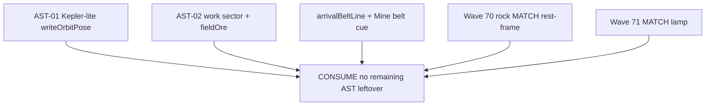

# RIMWARD remaining AST leftover after AST-01/02

| Field | Value |
|---|---|
| **Title** | RIMWARD remaining AST leftover after named AST slices |
| **Author** | Wave 123 AST leftover integrator |
| **Date** | 2026-08-25 |
| **Status** | leftover **CONSUME**. Wave 123 markdown only. Named serial: **none**. Name: **no remaining AST leftover.** |
| **Wave** | 123 — no `src/`. Bindings do not change here. |
| **Owner request** | Census **remaining AST leftover after named AST slices shipped**, from live code. Live AST already shipped closed-form Kepler-lite belts, work sector, sparse `fieldOre` persist, arrival line + group-3 mine cue (Wave 69); MATCH on a locked rock holds in the rock rest frame (Wave 70); MATCH lamp lights on that rock lock (Wave 71). Wishlist AST still wants individual stellar orbits, a broad belt/cloud, mining still practical. Code wins. If remaining leftover is already gone (named slices live; remaining wishlist bullets live or owner-omitted), freeze leftover **CONSUME** and named serial **none**. Name: **no remaining AST leftover.** If census finds a real remaining player-facing hole that is not a named skippable omit (example: rocks still a single local clump with no orbit, or depletion identity lost on orbit), freeze leftover **REAL** and name later serial **PR1** (named only). Do **not** implement `src/`. Do not invent a second belt model, a new Digit, a new persist key, UU, SKU, kit mutate, aim-glass gauges, or a hub PPI unless inventory proves a real hole. Do not break `ctx.asteroids.list` `id === array index`. |
| **Merge law** | [`out/w123/astrest/shared-contract.md`](../out/w123/astrest/shared-contract.md). If this brief and that file conflict, **the contract wins**. |
| **Honor** | HUD-01 empty 80 px hub. Aim-glass gauges stay off. Kit mutate omit. Digit 0 shipyard. Digit 8/9 stay. Group-3 mine cue stays. `state.js` READ-ONLY later. No new persist key. `innerHTML` forbidden later. Wave 51 `id === index` + `oreKey`/`hardness`. Wave 52 rock look is DATA (`ORE_TYPES[key].rock`). Do not “fix” known boot FAILs (REDMARCH `castMatches` flake). Do **not** write `docs/OwnerDecisionsWave123.md`. Do **not** edit wishlist, `PROGRESS.md`, `docs/AstOrbitsDesign.md`, `docs/OwnerDecisions*`, sibling Wave 123 packs. Do **not** steal `out/w123/phyrest/**`, `out/w123/fxrest/**` (read ok). Read ok: `out/w67/**`, `out/w69/**`, `out/w70/**`, `out/w71/**`, `out/w122/**`. |

**Verifier record:**

| Note | Path |
|---|---|
| Inventory (code wins; Wave 123 census) | [`out/w123/astrest/current-ast-remaining-inventory.md`](../out/w123/astrest/current-ast-remaining-inventory.md) |
| Merge law | [`out/w123/astrest/shared-contract.md`](../out/w123/astrest/shared-contract.md) |
| Wave 123 security review | [`out/w123/astrest/security-review.md`](../out/w123/astrest/security-review.md) |
| Wave 123 design-doc review | [`out/w123/astrest/code-review.md`](../out/w123/astrest/code-review.md) |
| Wave 123 UI audit | [`out/w123/astrest/ui-audit.md`](../out/w123/astrest/ui-audit.md) |
| Wave 123 notes | [`out/w123/astrest/notes.md`](../out/w123/astrest/notes.md) |
| AST orbits brief (cite) | [`docs/AstOrbitsDesign.md`](./AstOrbitsDesign.md) |

Siblings PHY rest (`out/w123/phyrest/**`), FX rest (`out/w123/fxrest/**`), NAV/TGT leftover, mining Jobs MSN, MATCH rewrite, wishlist, and `PROGRESS.md` are **other workers**. **Do not edit** those paths. **Do not write** `src/`.

**This is not PHY bounce.** **This is not FX.** **This is not NAV.** **This is not mining jobs MSN.** **This is not a MATCH rewrite.** Remaining AST leftover after AST-01/02 is **already gone**.

---

## Overview

Wave 69 shipped AST-01/02 first impl: closed-form Kepler-lite belts, work sector, sparse `fieldOre`, arrival line + group-3 cue. Wave 70 shipped MATCH on a locked rock in the rock rest frame. Wave 71 shipped the MATCH lamp on that rock lock.

Census (code wins): remaining AST leftover after those named slices is **not** missing. Rocks occupy a sun-relative annulus, not one 160 u clump. Pose is `f(seed, world.time)`. Depletion rides index `i` through `fieldOre`. Mining stays findable (`Belt lies …` + `Mine · belt Nu`). A second belt model, an unbounded Oort, chart rock marks, or UUID ids would invent work the owner forbade.

This leftover is **CONSUME**. Name: **no remaining AST leftover.** Do **not** freeze a remaining-AST serial. Wishlist “single local cluster” is **stale vs code**.

This brief is the integrator document. Wave 123 this worker lands markdown only. Bindings do not change here.

HUD-01 empty aim glass stays empty. `state.js` stays READ-ONLY. No new persist key. Digit 0 stays shipyard. Digit 8/9 stay. Group-3 mine cue stays. Do not invent UU. Do not steal PHY or FX. Aim-glass gauges stay off. Do not break `id === array index`.

Wave 123 deputize (recorded here and in the contract; owner may override after playtest): **do not invent remaining AST work**. Fail closed to today’s belts + work sector + `fieldOre` + cue + rock MATCH + lamp. Never freeze the sim.

If census had proved a real remaining hole that is not a named skippable omit (example: rocks still a single local clump with no orbit, or depletion identity lost on orbit), this pack would freeze **REAL** and name serial **PR1**. Census did not.

---

## Background & Motivation

### Current state (inventory)

Source of truth: [`out/w123/astrest/current-ast-remaining-inventory.md`](../out/w123/astrest/current-ast-remaining-inventory.md). Code wins.

| Surface | Today | Cite |
|---|---|---|
| Kepler-lite pose | LIVE closed-form from `world.time` | `asteroids.js` **73**, **97–108**, **2015–2027** |
| Kind | LIVE `belt` / `sparse` / `cloud` | `asteroids.js` **88–95** |
| Work sector | LIVE ≥60% (cloud 50%) | `asteroids.js` **75**, **1650–1654** |
| Identity | LIVE `id === i` | `asteroids.js` **1898–1906** |
| Persist | LIVE sparse `fieldOre` | `save.js` **99**, **184–232** |
| Arrival line | LIVE `Belt lies Nu…` | `jump.js` **48–58**, **178** |
| Group-3 cue | LIVE `Mine · belt Nu` | `hud.js` **2200–2206** |
| Rock MATCH | LIVE rest-frame | `ship.js` **851–897** |
| MATCH lamp | LIVE on rock lock | `hud.js` **356**, **1896** |
| Empty hub | 80 px | `hud.css` **184–193** |
| Digit 0 / 8 / 9 | shipyard / launch / epics | `station.js` **188**, **6171–6173** |
| Persist extra | **none** | `save.js` **77–101** |
| `innerHTML` asteroids/hud | **none** | grep 0 |
| WAVE69 / 70 / 71 | pins live | `boot-test.mjs` **14187+**, **14299+**, **14386+** |

The player who enters Freehold already sees a belt, not a blob. The player who mines, jumps, and returns already finds that index depleted. The player who arms group 3 already reads `Mine · belt Nu`. The player who locks a rock and taps X already holds in the rock rest frame with MATCH lit. Wishlist cluster prose is **stale vs code**.

### Pain points

- A naive later PR that “adds remaining AST orbits” would **double-ship** Kepler-lite and smash `id === index`.
- A naive later PR that adds a second belt model fights live `kindFromDef`.
- A naive later PR that spreads an Oort makes mining a hike (AST-02).
- A naive later PR that persists pose lies vs closed-form `world.time`.
- A naive later PR that UUIDs rocks breaks `mineHit.asteroidId`.
- A naive later PR that adds chart rock marks reopens HUD-02.
- A naive later PR that `innerHTML`s `Mine · belt` is XSS.
- A naive later PR that steals Digit 0/8/9 smashes shipyard, launch, or epics.
- A naive later PR that rewrites MATCH steals Wave 70/71.
- Inventing “CONSUME is boring, add an Oort” invents work the owner forbade.

### Why now (design) / why not now (code)

The owner asked for a leftover census so later serials do **not** invent a second belt, a Digit, or a persist key while chasing holes Wave 69/70/71 already closed. Inventory shows remaining AST leftover **gone**. Merge law can exist without touching `src/`. Implementation does **not** wait — it **does not ship**. Wave 123 this worker does not write `src/`.

---

## Goals & Non-Goals

### Goals

1. Document live named AST slices from **live code**.
2. Freeze leftover as **CONSUME** (not REAL). Name **no remaining AST leftover.** Serial **none**.
3. Freeze **reuse** of live belts / work sector / `fieldOre` / arrival line / group-3 cue / rock MATCH / MATCH lamp. No second instrument. No new persist key.
4. Freeze standing omit: unbounded Oort, chart/scanner/landmark rock marks, UUID ids, second belt model.
5. Freeze PHY / FX / NAV / MSN / MATCH rewrite as **sibling — do not steal**.
6. Freeze no new Digit, no `state.js` write, no UU, no hub pip.
7. Freeze a serial PR plan with **no implementation PR1**.

### Non-goals (locked — do not reopen)

- No `src/` or live bindings in this worker.
- No second belt model. No n-body. No unbounded Oort.
- No UUID asteroid ids. No break of `id === index`.
- No new `WORLD_FIELDS` key. No pose persist.
- No HUD-02 chart marks. No mystery landmarks. No scanner-arc rocks.
- No MATCH rewrite. No mining Jobs MSN rewrite.
- No PHY bounce leftover. No FX leftover. No NAV leftover.
- No HUD-01 hub child. No RANGE rewrite. No Digit steal.
- Do not pause the sim.
- Do not edit the wishlist, `PROGRESS.md`, `docs/AstOrbitsDesign.md`, sibling Owner docs.
- Do not write `docs/OwnerDecisionsWave123.md`.
- Do not steal `out/w123/phyrest/**`, `out/w123/fxrest/**`.
- Do not fix known boot FAILs.

---

## Proposed Design

### 1. Merge resolutions (contract wins)

| Question | Integrator freeze | Why |
|---|---|---|
| Leftover real? | **No. CONSUME.** | Inventory §0: named slices LIVE; wishlist bullets live or omit |
| Named PR1? | **None** | CONSUME |
| New persist key? | **No** | `fieldOre` already on `WORLD_FIELDS` |
| `state.js` write? | **No** | Contract §0.5 |
| Second belt model? | **No** | `kindFromDef` LIVE |
| UUID ids? | **No** | `id === i` |
| Hub PPI / chart rocks? | **No** | HUD-01; AstOrbitsDesign §7 |
| Steal MATCH / PHY / FX / MSN? | **No** | Cite only |
| Fail closed? | reserved ids; unknown kind → band default; omitted bag delete; never pause | Live |
| Wishlist “cluster”? | Stale; code wins | Wave 69 landed |

### 2. Current AST motion (do not break named slices)

Player jumps in. Arrival line names the belt. Rocks already sit on closed-form paths. Group 3 paints `Mine · belt Nu` until a rock lock. Mine hits index `i`. Sparse `fieldOre` records remaining units. Jump out and back: overlay restores depletion; pose snaps from `world.time`. KeyX on that lock holds in the rock rest frame; MATCH lamp lights. Do not add a sixth field.

**This serial must not change** `writeOrbitPose`, `fieldOre`, `arrivalBeltLine`, group-3 cue, `id === i`, Digit map, empty hub. Additive: **none**.

Digit 0 and `DOCK_KEY_SERVICES` stay. Digit 8/9 stay.

### 3. Deputize table (copy of contract §0.1)

Owner may override after playtest. Do not park. Do not invent work.

| Knob | Value |
|---|---|
| Verdict | **CONSUME** |
| Fail-closed | reserved ids drop; unknown kind → band default; omitted `fieldOre` deletes bag; never pause |
| Additive | **none** |
| Persist | existing `world.fieldOre`; no pose |
| Find-aid | consume LIVE commLine + group-3; do not add chart marks |
| MATCH | cite LIVE; do not rewrite |
| Alloc | reuse live field + prompt + MATCH lamp |
| Missing host | today’s Wave 69/70/71 |

Remaining AST already has the full named stack (inventory §0). Later serial **does not add a helper**. Do not steal PHY or FX.

### 4. Neighbours

| Module | Remaining AST leftover does | Remaining AST leftover does not |
|---|---|---|
| `asteroids.js` | **none** (CONSUME) | second belt; UUID; dt-integrate orbit |
| `save.js` | none | new `WORLD_FIELDS` key; pose persist |
| `jump.js` | none | second arrival instrument |
| `hud.js` | none | hub pip; MATCH steal beyond cite; Digit |
| `ship.js` | none | MATCH rewrite |
| `state.js` | **read-only later** | write; new `ORE_TYPES` |
| HUD-01 | none | gauge / PPI |
| Digit 0/8/9 | cite freeze | bind AST |
| PHY / FX / NAV / MSN | none | steal sibling packs |

### 5. Serial PR plan

Matches contract §3. **Named only. Do not implement in Wave 123.**

| PR | Lands | Does not land |
|---|---|---|
| **PR1 remaining AST** | **Does not exist.** Leftover CONSUME | second belt; Oort; chart rocks; UUID; Digit; persist; hub; `innerHTML`; MATCH rewrite |
| **PR-census (optional skip)** | Re-grep `writeOrbitPose` + `fieldOre` + `Mine · belt` + `arrivalBeltLine` + rock MATCH + MATCH lamp + `id === i` | New world field; hub pip; boot-log invention |

First remaining AST serial is **none**. It must not steal Digit 0/8/9. It must not write `state.js`. It must not break `id === index`.

### 6. Picture

Reuse live belt + prompt + MATCH lamp. No new chrome. Player finds the work sector, mines, saves depletion, and holds MATCH on a rock already. PHY bounce is **PHY**. FX is **FX**. Jobs cards are **MSN**.

No hub pip. Digit 0 stays shipyard. Group-3 cue stays.

### 7. UI (specified later UI — CONSUME: already live)

See [`out/w123/astrest/ui-audit.md`](../out/w123/astrest/ui-audit.md).

**This wave:** no chrome.

**Later (none):** do not add AST chrome. Live find-aid already uses `commLine` `textContent` and the existing prompt slot (`Mine · belt Nu`). MATCH lamp is a real ``. Empty hub stays empty.

### 8. Events / persist / security

Prefer live `'systemLoaded'` / `'mineHit'` / `'mineBlocked'` / `'commLine'` / `'hudMechMatch'`. No new frozen event. No new `WORLD_FIELDS` key.

Security freeze: `innerHTML` forbidden; proto-safe `sanitizeFieldOre`; restore omit-deletes bag; overlay `min(seeded, persisted)`; `id === i`.

### 9. Coupling

| Sibling | Boundary |
|---|---|
| PHY rest | bounce / keep-out net; do not steal |
| FX rest | not this leftover |
| NAV rest | not this leftover |
| MSN mining jobs | system + ore key; no asteroid UUID |
| MATCH | Wave 70/71 cite only |
| AstOrbitsDesign | cite only; do not edit |

---

## Player outcome (CONSUME; freeze here)

Jump into Freehold. The belt already occupies a wide sun-relative annulus. Echo says where it lies off the station. Arm group 3. The prompt reads `Mine · belt` plus a range. Lock a rock. Tap X. The ship holds in the rock rest frame and MATCH lights.

Mine a rock. Jump out. Jump back. That index is still depleted. Save/load the same. Digit 0 is still shipyard. The 80 px hub stays empty. No one sells a second belt model.

**PHY bounce** is **not** this work. **FX** is **not** this work. **NAV** is **not** this work. **Mining Jobs** are **not** this work. **Wishlist status prose** is **not** this work (other worker).

---

## Risks & Mitigations (frozen; no PR1)

| Risk | Mitigation |
|---|---|
| Later worker invents remaining AST | Contract §0 / §3 CONSUME; inventory §0 |
| Later worker UUIDs rocks | Contract §0.8; `id === i` |
| Later worker persists pose | Contract §0.6 |
| Later worker treats wishlist “cluster” as REAL | Code wins; do not edit wishlist here |
| XSS on belt cue | `innerHTML` forbidden; live 0 |
| Digit / hub theft | Contract §0.2 / §0.3 |
| MATCH / PHY / FX / MSN steal | Contract §0.12 / §0.13 |
| Sibling pack steal | Coupling §9 |

---

## Security (freeze)

- No `innerHTML` later. Live prompt `textContent`.
- No new `WORLD_FIELDS` key. Do not persist pose.
- Prototype-safe: `sanitizeFieldOre`; reserved ids; `kindFromDef` `Object.hasOwn`.
- Overlay remaining cannot exceed seed.
- Fail-closed never freeze the sim.

---

## Acceptance (CONSUME)

Verifier accepts this leftover freeze when:

1. Inventory + contract + this brief all say **CONSUME** / serial **none**.
2. Cites match live `writeOrbitPose`, `fieldOre`, `Mine · belt`, `arrivalBeltLine`, rock MATCH, MATCH lamp, `id === i`.
3. Worker wrote **no** `src/`.
4. Honor files untouched.
5. Named serial PR1 **does not exist**.
6. Security / code-review / UI audit have no open CRITICAL / HIGH / Blocker / Major in **this markdown pack**.

Re-open only if a later census proves named slices **gone**.

---

## Open questions

None for this leftover. Owner may override CONSUME after playtest by a successor census, not by this pack shipping `src/`.
