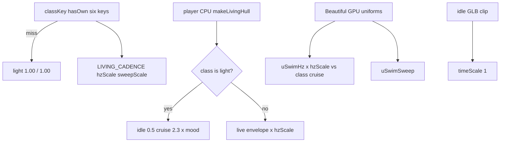

# RIMWARD BIO-06 class-scaled living fin cadence

| Field | Value |
|---|---|
| **Title** | RIMWARD BIO-06 class-scaled living fin cadence |
| **Author** | Wave 104 BIO-06 integrator |
| **Date** | 2026-08-23 |
| **Status** | Wave 107 first impl PR1–PR4. Notes: [`out/w107/bio06/`](../out/w107/bio06/) |
| **Wave** | 104 — markdown only. Later serials land per-class Hz/sweep. |
| **Owner request** | Larger Beautiful Ones ships flap too fast at high speed. Scale fin-stroke cadence by class/size. Small ships quicker. Large ships slower, heavier sweeps. Preserve speed responsiveness inside each class. Player living ship is the quality bar — do not weaken it. Avoid one universal animation-speed multiplier. |
| **Merge law** | [`out/w104/bio06/shared-contract.md`](../out/w104/bio06/shared-contract.md). If this brief and that file conflict, the contract wins. |
| **Honor** | HUD-01 empty hub. Digit 0 shipyard. Digit 8/9 stay. HUD never writes `hullKind`. `state.js` READ-ONLY; later default **no** `state.js` write and **no** new class keys. Player CPU `makeLivingHull` stays the quality bar. Do **not** clone it onto NPCs. BIO-05 graft closed (Wave 97). BIO-02 kit mutate omit; career labels already Wave 102. BIO-07 species bodies = **other worker**. No persist key for cadence. No new Digit. `innerHTML` forbidden later. **Do not edit** sibling Bio/Rep/Msn/Owner docs or the wishlist. |

**Verifier record:**

| Note | Path |
|---|---|
| Inventory (code wins) | [`out/w104/bio06/current-bio06-inventory.md`](../out/w104/bio06/current-bio06-inventory.md) |
| Merge law | [`out/w104/bio06/shared-contract.md`](../out/w104/bio06/shared-contract.md) |
| Security review | [`out/w104/bio06/security-review.md`](../out/w104/bio06/security-review.md) |
| Design-doc review | [`out/w104/bio06/code-review.md`](../out/w104/bio06/code-review.md) |
| UI audit | [`out/w104/bio06/ui-audit.md`](../out/w104/bio06/ui-audit.md) |

Siblings REP-05, MSN-03, HUD-03, BIO-07, TGT, NAV, SHP, HUD-02, BIO-01..05, `docs/BioLivingShipsDesign.md`, wishlist, `PROGRESS.md`, and `docs/OwnerDecisions*.md` are **other workers**. **Do not edit** those paths. Those sibling files need not exist for this brief to stand. Do **not** write `docs/OwnerDecisionsWave104.md`. Sibling Wave 104 workers own REP-05 `src` and MSN-03 `station.js` — do not edit those paths.

**BIO-07** distinct species-inspired bodies is a leftover for **another worker**. Not this brief.

---

## Overview

Every origin already flies one living hull: CPU `makeLivingHull` with swim, breath, heartbeat, vein skin, and a thrust bioluminescent surge. That **light** rig is the quality benchmark. Beautiful Ones **NPC** ships load faction GLBs and a Wave 76 GPU swim (`uSwimHz` / `uSwimAmp`). Yards already sell living stock across the six live class keys.

Wishlist BIO-06 is **not** a missing mesh and **not** a missing Digit. Live idle/cruise Hz is a **single pair** (0.5 → 2.3) for every class. Amplitude already grows with size. Frequency does not. Large Beautiful hulls that reach ~120 u/s (or a player living **heavy** remount at **its** cruise) flap like a young light ship.

This brief is the integrator document for a **later** implementation wave. Wave 104 lands this markdown only. Bindings do not change here.

HUD-01 empty aim glass stays empty. `state.js` stays READ-ONLY. No new SKU. No persist key. Digit 0 stays shipyard. Digit 8/9 stay. Do not invent UU. Do not replace `makeLivingHull`. Do not clone it onto NPCs.

Wave 104 deputize (recorded here and in the contract; owner may override after playtest): frozen `LIVING_CADENCE` scales **Hz** and **sweep** monotonically by the six live keys; **light = 1.00 / 1.00** (player bar); NPC speed-norm switches from **/ 120** to **class cruise**; no `mixer.timeScale`; no `state.js` write. Preferred PR1 home: `src/game/living-cadence.js` (THREE-free).

---

## Background & Motivation

### Current state (inventory)

Source of truth: [`out/w104/bio06/current-bio06-inventory.md`](../out/w104/bio06/current-bio06-inventory.md). Code wins over stale “0.7 Hz global NPC swim” comments in older Bio docs.

| Surface | Today | Cite |
|---|---|---|
| Class keys | six: light ace cutter heavy frigate freighter | `state.js` 37–44; `ship-assets.js` 11 |
| Player sculpt | `makeLivingHull(classKey)` manta/whale | `ship.js` 274–334 |
| Player remount | living visual, not NPC GLB | `ship.js` 546–560 |
| Player Hz | idle 0.5 → cruise 2.3 × mood.rate | `ship.js` 144–157, 948–956 |
| Player speed-norm | `speed / shipCfg.maxSpeed` (class cruise) | `ship.js` 950; `hangar.js` 568 |
| Player amp | body/flap × `restScale` (size, not Hz) | `ship.js` 252–256, 958–959 |
| NPC Beautiful | GLB + GPU swim + idle clip | `ship-assets.js` 33, 234, 387–470 |
| NPC uniforms | `uSwimTime` / `uSwimAmp` / `uSwimHz` | `ship-assets.js` 51–87 |
| NPC Hz | **same** 0.5→2.3; speed / **120** | `ship-assets.js` 46–48, 467–470 |
| NPC amp | reducedMotion 0 else 1; `sz` in `aSwim.w` | `ship-assets.js` 76–84, 247–277, 469 |
| Beautiful path | `/assets/ships/beautiful/{class}/{lod}.glb` | `ship-assets.js` 13, 27, 234; `public/assets/ships/beautiful/` |
| Traffic tick | `animateShipMesh(..., velocity.length())` | `npc.js` 186–188, 2280 |
| `reducedMotion` NPC | amp 0; mixer frozen | `ship-assets.js` 459, 469 |
| `reducedMotion` player living | **CPU swim still on** | `ship.js` 948–993 |
| Organics | `animateOrganic` no-op if reduced | `organic.js` 647–648 |
| Empty hub | 80 px + RANGE | `hud.css` 184–193; `hud.js` 709–712 |
| HUD `hullKind` | read only | `hud.js` 80–87 |
| Digit 0 / 8 / 9 | shipyard / launch / epics | `station.js` 185, 6023–6028 |
| Cadence persist | **none** | `save.js` `WORLD_FIELDS` |
| Per-class Hz table | **absent** | grep 0 |

The player flying **light** already has the bar: idle 0.5 Hz, cruise 2.3 Hz, mood, breath, heart. The player who remounts a living **heavy** already norms speed to 90 u/s, so cruise **is** 2.3 Hz — frantic for that mass. Beautiful NPC heavies/freighters hit 2.3 Hz once velocity reaches 120 (burn). Wishlist “class-scaled cadence” as a **table + two paths** is absent. It is not a missing hub disc.

### Pain points

- A naive later PR that sets `mixer.timeScale` by class would also slow the idle GLB clip and ignore CPU vs GPU split — the forbidden universal multiplier.
- A naive later PR that multiplies **all** living Hz including **light** would weaken the player bar.
- A naive later PR that clones `makeLivingHull` onto traffic would smash Wave 76 GPU cheapness and BIO-03 preserve.
- Putting a cadence number on the 80 px hub would reopen HUD-01.
- Stealing Digit 0/8/9 would smash shipyard, launch, Standing, or papers.
- Writing scales into `SHIP_CLASSES` would violate `state.js` READ-ONLY and later default no-write.
- Persisting cadence would invent a world field for a visual constant.
- Inventing UU / a “elder stroke” SKU would impersonate the owner.
- Lowering Hz without raising sweep would freeze large fins (wishlist regression).
- Keeping NPC `/ 120` after adding `hzScale` would under-drive frigates (they never reach “cruise stroke”) **and** still let burn-120 hulls hit the light cap before scale.
- `innerHTML` of a class name on a debug HUD would XSS. This serial has no DOM.
- Reopening BIO-05 overlay or BIO-07 bodies would steal other waves.
- “Fixing” player reducedMotion by killing CPU swim would change the live quality bar.

### Why now (design) / why not now (code)

The owner asked for the BIO-06 integrator brief so later serials can land class cadence without a universal multiplier and without weakening light. Inventory shows one Hz pair, size-scaled amp only, NPC `/ 120`, player class-norm already. Merge law can exist without touching `src/`. Implementation waits so hub theft, Digit theft, `state.js` writes, persist keys, NPC `makeLivingHull` clones, and light-bar damage are frozen before the first uniform changes. Wave 104 does not ship `src/`.

---

## Goals & Non-Goals

### Goals

1. Document live player CPU swim, NPC GPU uniforms, class keys, reducedMotion split, and Beautiful GLB path from **live code**.
2. Freeze a monotonic **per-class** `hzScale` + `sweepScale` with Wave 104 deputize numbers. Light = 1.00 / 1.00.
3. Freeze speed responsiveness **inside** each class (idle→cruise vs **that** class’s cruise). Cap Hz at cruise (live player shape).
4. Freeze no universal `mixer.timeScale` / global dt scale.
5. Freeze no new persist key, no new Digit, no `state.js` write, no new class keys, no UU.
6. Freeze player `makeLivingHull` honor / NPC GPU keep.
7. Freeze `innerHTML` = 0, empty hub, Digit 0/8/9, HUD never writes `hullKind`.
8. Freeze a serial PR plan. This wave writes the brief. A later wave ships serially.

### Non-goals (locked — do not reopen)

- No `src/` or live bindings in Wave 104.
- No `makeLivingHull` replace. No NPC CPU vertex clone.
- No BIO-07 species bodies (other worker). One-line pointer only.
- No BIO-05 graft / overlay / ungraft / hangar badge.
- No BIO-02 kit mutate. No career-label reopen (Wave 102).
- No aim-glass cadence pip / RANGE rewrite.
- No new Digit. No KeyO row. No toast.
- No `SHIP_CLASSES` extra fields. No invented UU or standing deltas.
- No persist `world.cadence`. No settings checkbox for flap rate.
- Do not retune light 0.5 / 2.3, mood rates, breath 0.25, heart 1.1.
- Do not retune `SHIP_SCALE` targets or cruise/burn integers.
- Do not edit the wishlist, `PROGRESS.md`, Bio01–05, BioLiving, Rep05, Msn03, OwnerDecisions*.
- Do not write `docs/OwnerDecisionsWave104.md`.
- Do not fix known boot FAILs.
- Do not edit REP-05 / MSN-03 `src` (sibling Wave 104).

---

## Proposed Design

### 1. Merge resolutions (contract wins)

| Question | Integrator freeze | Why |
|---|---|---|
| New persist key? | **No** | Visual constant. Inventory: none needed |
| `state.js` write? | **No** | Contract §0.6 |
| New class keys? | **No** | Six live keys |
| Universal anim multiplier? | **Forbidden** | Wishlist + mixer/clip smash |
| Clone `makeLivingHull` to NPC? | **No** | GPU stay |
| Weaken player light? | **No** | hzScale 1.00 |
| Where is the table? | `living-cadence.js` (preferred) or export from `ship-assets.js` | Not `state.js` |
| NPC speed-norm? | **Class cruise**, miss → 120 | Stops /120 light inherit |
| Player larger living? | Apply table | Heavy remount is the worst live case |
| Sweep vs Hz? | **Both** | Avoid frozen large fins |
| Breath / heart / mood? | **Unscaled** | Player identity |
| Idle GLB clip? | **Unscaled** | Not fin cadence |
| reducedMotion NPC? | amp 0 stay | Inventory §6 |
| reducedMotion player living? | CPU swim stay | Do not “fix” |
| HUD / Digit / SKU? | **No** | Frozen |
| BIO-07? | **Not this brief** | Other worker |

### 2. Current motion (do not break light)

See inventory §§3–4. Load-bearing loops:

**Player living**

1. `makeLivingHull` sculpts + stores `base` / `zNorm` / `wingness` / `restScale`.
2. Each frame: `speedNorm` from `ship.speed / maxSpeed`.
3. `swimHz = lerp(0.5, 2.3, min(speedNorm,1)) * mood.rate`.
4. Mutate vertices. Breath/heart/veins independent.

**Beautiful NPC**

1. Prime GLB `/assets/ships/beautiful/{class}/lod0.glb`. Bake `aSwim`.
2. Per instance uniforms. Random morph phase.
3. Each frame: `uSwimHz = lerp(0.5, 2.3, min(speed/120, 1))`.
4. Idle mixer `setTime(elapsed)` unless reducedMotion.

**This serial must not change** light step 3’s 0.5/2.3/mood, sculpt topology, GLB paths, or organic station sway. Additive: multiply Hz/amp by class scales; NPC denom = class cruise.

Digit 0 and `DOCK_KEY_SERVICES` stay. Digit 8/9 stay.

### 3. Deputize table (copy of contract §0.1)

Owner may override after playtest. Do not park.

| classKey | hzScale | sweepScale | Idle Hz | Cruise Hz |
|---|---|---|---|---|
| light | 1.00 | 1.00 | 0.50 | 2.30 |
| ace | 0.96 | 1.06 | 0.48 | 2.21 |
| cutter | 0.80 | 1.22 | 0.40 | 1.84 |
| heavy | 0.62 | 1.42 | 0.31 | 1.43 |
| frigate | 0.44 | 1.68 | 0.22 | 1.01 |
| freighter | 0.30 | 2.00 | 0.15 | 0.69 |

Freighter idle 0.15 Hz ≈ 6.7 s/stroke — deliberate, still moving. Do not drop below this without a successor owner line (frozen-fin risk).

NPC `uSwimAmp` stays the reducedMotion gate (0/1). Do **not** overload it as sweep. New float `uSwimSweep` (default 1).

### 4. Neighbours

| Module | BIO-06 does | BIO-06 does not |
|---|---|---|
| `ship.js` CPU | later PR2 scale | Replace sculpt; kill mood |
| `ship-assets.js` GPU | later PR3 uniforms | mixer.timeScale; Unknowables swim |
| `state.js` | **read cruise** | write |
| `organic.js` | cite freeze | retune station sway |
| HUD-01/02 | none | hub pip; `hullKind` write |
| Digit 0 | cite shipyard | bind cadence |
| BIO-05 | none | graft overlay |
| BIO-07 | one-line leftover | bodies |
| REP-05 / MSN-03 src | none | sibling owns |

### 5. Serial PR plan

Matches contract §8. **Named only. Do not implement in Wave 104.**

| PR | Lands | Does not land |
|---|---|---|
| **PR1 data** | `LIVING_CADENCE` + `cadenceFor` hasOwn → light. Preferred `src/game/living-cadence.js` | `state.js`; Digit; persist |
| **PR2 player CPU** | honor light bit-identical; scale other living classKeys | `makeLivingHull` replace; NPC clone |
| **PR3 NPC GPU** | class-cruise norm; `uSwimHz` / `uSwimSweep`; stash `userData.classKey` | mixer.timeScale; non-beautiful |
| **PR4 reducedMotion + boot pins** | NPC amp 0; light 0.5→2.3; monotonic; no persist key; Digit 0 shipyard | wishlist rewrite; boot FAIL fixes |

First remaining serial is **PR1**. It must not steal Digit 0/8/9.

### 6. Picture

Reuse live cameras. No new chrome. Fleet readability is **motion**, not a HUD label.

Yard living preview stays static this serial (`yard-preview.js` 115 `update: null`). Do not sneak a second CPU swim into the desk.

---

## Player outcome (later serial; freeze here)

Fly the **light** living ship: she still breathes and strokes as she does today — idle hush at 0.5 Hz, cruise at 2.3 Hz, keen/feral still quicken her. That feel is the bar.

Remount (or watch) a **cutter**: fins still answer speed, but the stroke is a step slower and a little heavier.

A **heavy** or **frigate** at full travel no longer shimmers like a panicked ray. Strokes are fewer, longer, with more follow-through. A **freighter** reads as mass: slow powerful sweeps, never the light ship’s 2.3 Hz flap.

Beautiful traffic matches that gradient on the GPU path. They do not become extra player CPU whales.

KeyO reduced motion still freezes Beautiful NPC swim and station organics. The player living hull still lives, as today. The 80 px hub stays empty. Digit 0 is still shipyard. No one sells “cadence.”

**BIO-07** (different species bodies per class) is **not** this work.

---

## Security

See [`out/w104/bio06/security-review.md`](../out/w104/bio06/security-review.md).

- XSS: no new DOM. `innerHTML` forbidden later. Do not interpolate `classKey` into shader source.
- Proto: `cadenceFor` + `classKeyOf` hasOwn; unknown → light.
- Persist: no new key.
- No secrets. No Digit theft. No UU.

---

## Acceptance direction (implementation wave)

1. Light player idle 0.5 / cruise 2.3 / mood rates unchanged (boot pin).
2. Side-by-side Beautiful classes at idle, cruise, high speed: monotonic slower Hz as size grows.
3. Heavy / frigate / freighter never display 2.3 Hz flap.
4. Inside one class, faster travel still intensifies toward that class’s cruise cap.
5. Large-ship strokes read heavier (`sweepScale`); not frozen, not rubbery.
6. `makeLivingHull` still the player living mesh. NPCs still GLB + GPU.
7. `reducedMotion`: NPC `uSwimAmp` 0; player CPU swim still on.
8. No cadence persist key. No `SHIP_CLASSES` new field. Digit 0 shipyard. Hub 80 px empty of new children.
9. Unknown classKey → light.
10. No `innerHTML` on paths this serial touches.
11. BIO-07 meshes unchanged.

---

## Alternatives considered

| Alternative | Why not |
|---|---|
| One `mixer.timeScale` / global dt | Forbidden universal multiplier; slows idle clip + organics |
| Slow light player to match fleet | Weakens the quality bar |
| Clone `makeLivingHull` onto NPC | Perf + BIO-03 preserve |
| Only scale NPC, skip player remount | Player heavy at cruise is the worst live 2.3 Hz case |
| Only change `/ 120` to class cruise, no hzScale | Player already class-norms; heavy would still 2.3 at cruise |
| Only hzScale, keep NPC `/ 120` | Frigate never reaches a class cruise stroke |
| `SHIP_CLASSES.cadence` in `state.js` | READ-ONLY / no-write freeze |
| Persist cadence / Digit / SKU | Impersonates owner; HUD-01 / Digit freeze |
| Scale breath + heart with class | Changes player identity; not fins |
| Kill player CPU swim under reducedMotion | Silent a11y “fix”; live split stays |
| Design BIO-07 bodies here | Other worker |

---

## Regression risks

| Risk | Mitigation |
|---|---|
| Light player feel changes | Contract §0.10; PR2 light bit-identical; PR4 pin 0.5/2.3 |
| Large fins frozen | sweepScale + freighter idle floor 0.15 Hz |
| Abrupt class steps | monotonic six-key table; ace near light |
| Speed unlink | keep idle→cruise lerp vs class cruise |
| Universal multiplier sneaks in | forbid mixer.timeScale; PR4 grep |
| NPC `makeLivingHull` clone | Contract §0.9 |
| `state.js` write / new class key | Contract §0.6 |
| Persist key | Contract §0.7 |
| Hub pip / Digit steal | Contract §0.2–0.3 |
| BIO-05 / BIO-07 reopen | Contract §0.12–0.13 |
| Player reducedMotion smash | Contract §0.16 |
| Shader string injection | authored GLSL; uniform float only |
| Unknown class proto | hasOwn → light |

---

## Ownership

| Object | Writer | Reader |
|---|---|---|
| `makeLivingHull` | **none this leftover** (honor) | player remount, yard, catalog |
| `LIVING_CADENCE` | later PR1 module | PR2 CPU, PR3 GPU |
| `uSwimHz` / `uSwimAmp` | later PR3 | GPU |
| `uSwimSweep` | later PR3 | GPU |
| `state.js` `SHIP_CLASSES` | **none** | cruise read |
| `state.js` | serial data owner only | **feature PRs read-only** |
| HUD / Digit | **none** | — |

---

## Open owner questions

**Deputized this wave** (contract §0.1). Owner may override after playtest. Do not park.

1. Table: six live keys; light 1.00/1.00; freighter 0.30/2.00; monotonic Hz.
2. Home: not `state.js`; preferred `living-cadence.js`.
3. NPC denom: class cruise, miss 120.
4. Player light unchanged; larger living remounts scale.
5. reducedMotion split stays live.

Do not invent prices, class keys, or persist in a later impl without a successor owner line.
