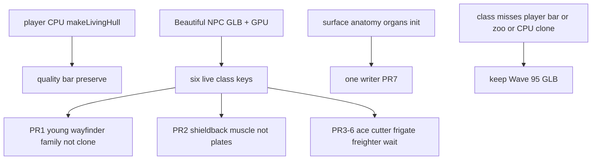

# RIMWARD BIO-07 distinct species-inspired living ship bodies

| Field | Value |
|---|---|
| **Title** | RIMWARD BIO-07 distinct species-inspired living ship bodies |
| **Author** | Wave 105 BIO-07 integrator |
| **Date** | 2026-08-24 |
| **Status** | design-only (this worker). Sibling Wave 105 workers may land light + heavy first organic slices against this freeze. |
| **Wave** | 105 — markdown only for this worker. Later serials land remaining four class bodies. |
| **Owner request** | Player living ship is GREAT. Beautiful Ones **faction NPC** ships still look like fusions of sea creatures and mechanical ships. Make them look like **sea creatures**: organic, fewer rigid lines, marine inspiration not copies, not kitbashed flesh-on-hull. |
| **Merge law** | [`out/w105/bio07/shared-contract.md`](../out/w105/bio07/shared-contract.md). If this brief and that file conflict, the contract wins. |
| **Honor** | BIO-03 merge law [`out/w81/bio03/shared-contract.md`](../out/w81/bio03/shared-contract.md) and [`docs/Bio03ClassLookDesign.md`](Bio03ClassLookDesign.md) — **READ only; do not edit**. Player CPU `makeLivingHull` is the quality bar. Do **not** clone it onto NPCs. NPC stay GLB bake path. Class set = six live keys. Marine inspiration, not Earth photocopies, not player-manta clones. HUD never writes `hullKind`. `state.js` READ-ONLY. No new class keys. No persist. No Digit. `innerHTML` forbidden. Yard buy: do not **add** living frigate/ace/freighter SKU. Wave 76 GPU swim stays. **Do not edit** sibling Bio/Rep/Msn/Owner docs or the wishlist. |

**Verifier record:**

| Note | Path |
|---|---|
| Inventory (code wins) | [`out/w105/bio07/current-bio07-inventory.md`](../out/w105/bio07/current-bio07-inventory.md) |
| Merge law | [`out/w105/bio07/shared-contract.md`](../out/w105/bio07/shared-contract.md) |
| Security review | [`out/w105/bio07/security-review.md`](../out/w105/bio07/security-review.md) |
| Design-doc review | [`out/w105/bio07/code-review.md`](../out/w105/bio07/code-review.md) |
| UI audit | [`out/w105/bio07/ui-audit.md`](../out/w105/bio07/ui-audit.md) |

Siblings BIO-06, REP-05, MSN-03, HUD, TGT, NAV, SHP, BIO-01..05, `docs/BioLivingShipsDesign.md`, wishlist, `PROGRESS.md`, and `docs/OwnerDecisions*.md` are **other workers**. **Do not edit** those paths. Those sibling files need not exist for this brief to stand. Do **not** write `docs/OwnerDecisionsWave105.md`. Sibling Wave 105 workers own `scripts/ship_builders/beautiful/light.py` and `heavy.py` first organic slices plus their blend/GLB — do not edit those paths from this worker.

**BIO-06** class-scaled living fin cadence is a leftover for **another worker**. Not this brief. One line only. Do not design Hz tables here.

---

## Overview

Every origin already flies one living hull: CPU `makeLivingHull` with swim, breath, heartbeat, vein skin, and a thrust bioluminescent surge. That **player** rig is GREAT and is the quality benchmark. Beautiful Ones **NPC** ships load faction GLBs (Wave 95 look/bake) and a Wave 76 per-instance GPU swim. Six live class keys already have builders and GLBs. Yards already sell the live class set as living hulls (`LIVING_STOCK` six keys — code wins over stale BIO-03 omit).

Wishlist BIO-07: the NPC size range must not be one body scaled up and down. Each class needs a distinct primary silhouette inspired by different marine life, still one Beautiful Ones lineage. Owner playtest: NPC ships still read as **fusions of sea creatures and mechanical ships**. Kill rigid panel lines, box wells, fitted-armor mantle reads, and window/nozzle/turret leftovers. Prefer grown lofts, overlapping flesh, rounded paddles, irregular hollow lips.

This brief is the integrator document. Wave 105 this worker lands markdown only. Light + heavy first slices **may** land from sibling class authors against this freeze. Ace / cutter / frigate / freighter wait as later serial. Shared `surface.py` / `anatomy.py` / `organs.py` / `__init__.py` stay **one writer**.

HUD-01 empty aim glass stays empty. `state.js` stays READ-ONLY. No new SKU. No persist key. Digit 0 stays shipyard. Do not invent UU. Do not replace `makeLivingHull`. Do not clone it onto NPCs.

---

## Background & Motivation

### Current state (inventory)

Source of truth: [`out/w105/bio07/current-bio07-inventory.md`](../out/w105/bio07/current-bio07-inventory.md). Code wins over stale Wave 81 “Wave 8 GLB” and “`LIVING_STOCK` omit ace/frigate/freighter” comments.

| Surface | Today | Cite |
|---|---|---|
| Class keys | six: light ace cutter heavy frigate freighter | `state.js` 37–44; `ship-assets.js` 11; `__init__.py` 73 |
| Player sculpt | `makeLivingHull(classKey)` manta/whale sphere 64×40 | `ship.js` 274–334 |
| Player remount | living visual, not NPC GLB. Boot `createShipState('light')`; default faction **independent** | `ship.js` 546–560, 624; `state.js` 173 |
| Models Browser | `ship:player` = `makeLivingHull()` | `model-catalog.js` 93–113 |
| NPC Beautiful | GLB + GPU swim + idle clip | `ship-assets.js` 33, 387–470 |
| NPC uniforms | `uSwimTime` / `uSwimAmp` / `uSwimHz` | `ship-assets.js` 51–87, 457–470 |
| Beautiful path | `/assets/ships/beautiful/{class}/{lod}.glb` | `ship-assets.js` 13, 27; `public/assets/ships/beautiful/` |
| Fail-closed GLB | Wave 95 set on disk | inventory §4 |
| `LIVING_STOCK` | **six keys** | `shipyard.js` 28–30 |
| Grown body | `sf.grown_loft` | `surface.py` 338 |
| Rigid crease | `kit.box` floor strips | `anatomy.py` 834–835 |
| Rigid hollow | `kit.box` well + glow panel | `organs.py` 454–455, 492–493 |
| Heavy mantles | overlapping spheres, ROLE_ARMOUR | `organs.py` 718–776; `heavy.py` 258–261 |
| Generic stub | sphere + manta-fin spheres | `build-ship-assets.py` 354–361 |
| HUD `hullKind` | read only | `hud.js` 81–89 |
| Digit 0 | shipyard | `station.js` 185 |
| Cadence table | **absent** (BIO-06 other worker) | — |
| `innerHTML` | modelsbrowser only | `modelsbrowser.js` |

The player flying **light** already has the bar: one continuous organic mesh, never-still motion, veins, breath, heart, no panels. Beautiful NPC builders already **claim** grown bodies and “no panel lines” (`__init__.py` 7–20). The kit still stamps **box wells** and **box crease floors**. Owner glance: flesh on a mechanical hull, not a sea creature.

### Pain points (rigid lines / mech fusion)

- `fold_crease` floors are `kit.box` strips (`anatomy.py` 834). At thumbnail they read as **panel lines**.
- `sanctuary_hollow` wells are `kit.box` (`organs.py` 454). Frigate/freighter hollows can read as **fitted bays**.
- Hollow glow is a `kit.box` panel (`organs.py` 492). That is a **window leftover**.
- Heavy dorsal mantles are the right idea (overlapping ellipsoids) but plate borders still read as **fitted armour** if they do not interpenetrate as muscle.
- Vent `kit.torus` lips can read as **portholes**.
- Stern `RIMWARD_ENGINE_GLOW` can read as a **nozzle** if the tail does not dissolve into wake.
- A naive later PR that clones `makeLivingHull` onto traffic would smash Wave 76 GPU cheapness and BIO-03 preserve.
- A naive later PR that scales one light body up for heavy/frigate/freighter would smash wishlist “not resized copies.”
- A naive later PR that photocopies Earth dolphins / whales / squid would ship a zoo.
- Parallel class authors editing `organs.py` would race (BIO-03 §0.6).
- Putting a species label on the 80 px hub would reopen HUD-01.
- Adding a living SKU or UU would impersonate the owner.
- Reopening BIO-06 Hz here would steal the cadence leftover.
- Falling through to `BUILDERS['beautiful']` sphere stub would ship a worse mesh than Wave 95.

### Why now (design) / why not now (code, this worker)

The owner asked for the BIO-07 integrator leftover so sibling light/heavy authors and later serials can kill mech fusion against a frozen preserve rule. Inventory shows six GLBs, six builders, box wells still live, player CPU unique. Merge law can exist without this worker touching `src/` or `light.py` / `heavy.py`. Implementation of remaining four waits so zoo, CPU clone, shared-module race, catalog theft, and HUD theft are frozen before those class files change.

---

## Goals & Non-Goals

### Goals

1. Document live player CPU sculpt, NPC GLB + GPU, six class keys, Wave 95 GLB pins, and **rigid kit.box** call sites from **live code**.
2. Freeze anti-rigidity: kill panel lines, box-well reads, fitted-armor mantles, window/nozzle/turret leftovers. Prefer grown lofts, overlapping flesh, rounded paddles, irregular hollow lips.
3. Freeze class identity by anatomy and size, not scaled copies of one body.
4. Freeze light = young wayfinder (family, not CPU clone); heavy = shieldback whale (muscle, not plates). Sibling PR1/PR2 this wave.
5. Freeze ace/cutter/frigate/freighter glance from bible §4.6; remaining four later serial.
6. Freeze fail closed = **Wave 95 GLB** per class. No generic stub.
7. Freeze no new persist key, no new Digit, no `state.js` write, no new class keys, no UU, no `innerHTML`.
8. Freeze player `makeLivingHull` honor / NPC GPU keep / shared organs serial.
9. Freeze a serial PR plan. This worker writes the brief. Siblings may land light/heavy. Remaining four wait.

### Non-goals (locked — do not reopen)

- No `src/` from **this** worker. No bake from **this** worker. No edit of `light.py` / `heavy.py` from **this** worker.
- No `makeLivingHull` replace. No NPC CPU vertex clone.
- No BIO-06 Hz tables (other worker). One-line pointer only.
- No BIO-05 graft / overlay. No BIO-04 psionics. No BIO-02 career keys.
- No aim-glass species pip / RANGE rewrite.
- No new Digit. No toast. No invented UU.
- No `SHIP_CLASSES` extra fields.
- No persist `world.hullLook`.
- Do not retune light 0.5 / 2.3, mood rates, breath, heart (BIO-06 / player bar).
- Do not mutate live `LIVING_STOCK` / `YARD_LIST_UU`.
- Do not edit the wishlist, `PROGRESS.md`, Bio01–06, BioLiving, Bio03*, OwnerDecisions*.
- Do not write `docs/OwnerDecisionsWave105.md`.
- Do not fix known boot FAILs.

---

## Proposed Design

### 1. Merge resolutions (contract wins)

| Question | Integrator freeze | Why |
|---|---|---|
| Clone `makeLivingHull` to NPC? | **No** | GPU stay; perf; BIO-03 |
| NPC path? | **Keep live GLB + GPU** | Inventory §2 |
| Procedural Three.js ships? | **No** | BIO-03 owner Q1 |
| Class keys? | Live six only | `state.js` 37–44 |
| Per-class writes? | Disjoint class `.py`. Shared modules serial | Contract §0.6, §3 |
| Light this wave? | **Sibling PR1** against this freeze | Owner |
| Heavy this wave? | **Sibling PR2** against this freeze | Owner |
| Ace/cutter/frigate/freighter? | Glance frozen; **later serial** | Owner |
| Fail closed? | **Wave 95 GLB** for that class | Owner; inventory §4 |
| Yard SKU? | Do **not add**. Live six already. Do not cut | `shipyard.js` 28–30 |
| HUD `hullKind`? | HUD never writes | HUD-02 |
| Persist / events / Digit? | None | Contract §5 |
| BIO-06 Hz? | **Not this brief** | Other worker |
| Earth photocopies? | **Forbidden** | Wishlist + bible |
| Player manta clone on traffic? | **Forbidden** | Light may rhyme, must differ head/fin |
| `innerHTML` / UU? | **No** | XSS / impersonation |
| Path join / remote GLB / `eval`? | Canonical only; forbidden | Contract §7 |

### 2. Player outcome (later serial; freeze here)

Meet a Beautiful NPC **light**: a compact young wayfinder. Crown-forward. Family of the player hull. **Not** the player CPU manta copied into a GLB. **Not** a dolphin toy.

Meet a **heavy**: a shieldback whale. Dense height. Overlapping **muscle** mantles. Shield fins. Not fitted armour. Not a scaled-up light.

At a later serial: **ace** is a taut dart; **cutter** holds without a mouth of teeth; **frigate** is a long elder with grown hollows; **freighter** is a gardenback with a few large biomes. Six black silhouettes read as six creatures of one lineage, not one mesh resized, not a zoo.

The player’s own hull still breathes, beats, veins, and surges on CPU. Traffic still loads GLB + GPU. No species name on the aim glass. Digit 0 is still shipyard.

**BIO-06** (how fast fins stroke by class) is **not** this work.

### 3. Preserve: living player ship

The shipped player living hull **is** the product.

`makeLivingHull` sculpts one sphere into a manta/whale. Each frame the living rig mutates vertices. Thrust is a bioluminescent surge, not a nozzle.

Later BIO-07 body work must **not**:

- Replace player `makeLivingHull` CPU swim with NPC GPU swim “for consistency.”
- Treat `isBeautiful(player.faction)` as the living-player test.
- Weaken breath / heartbeat / vein / thrust surge.
- Copy the player vertex sculpt onto NPC GLBs so traffic is a fleet of the same manta.
- Point Models Browser `ship:player` at a Beautiful GLB.

### 4. NPC path (keep GLB)

Live: `npc.js` `buildShipMesh` → primed GLB. Keep bake + `public/assets/ships/beautiful/`.

Do not ship the generic `BUILDERS['beautiful']` sphere stub as a class look.

### 5. Anti-rigidity (deputize)

Copy of contract §0.1. Owner may override after playtest. Do not park.

**Kill:** rigid panel lines, box wells, fitted-armor mantle reads, window/nozzle/turret leftovers.

**Prefer:** grown lofts, overlapping flesh, rounded paddles, irregular hollow lips.

**Until PR7** (shared organs): class files must not expose `kit.box` faces. Bury crease floors. Cover wells with grown lips. Do not add new `kit.box` calls in a class `.py`. Shared replacement of box wells is **serial**.

**Heavy mantles:** swollen interpenetrating muscle. Not coaxial discs. Not shell plates.

**Light:** family to player. Different head and fin anatomy. Not a CPU hull clone.

### 6. Class identity (glance)

Use live keys only. Bible §4.6 + plates README. Marine *vibes* are inspiration.

Fail closed: if a class cannot beat the player bar, keep the Wave 95 GLB for **that class**. Do not hold the other five hostage.

### 7. Motion (Wave 76 — keep; BIO-06 leftover)

Keep per-instance GPU uniforms. Do not clone `makeLivingHull`. Do **not** design class Hz here. BIO-06 owns cadence.

### 8. Bake / wire

Live pipeline still owns Beautiful NPC GLBs. Sibling PR1/PR2 may bake **their** class only. Remaining four bake with PR8 after those class files. Canonical path. Glow mesh. Measure ladder. Fail closed keep Wave 95.

### 9. HUD-02 / yards / persist

- HUD never writes `hullKind`. Grafted built hulls stay `mech`.
- `LIVING_STOCK` stays the live six. Do not add a SKU. Do not invent UU. Player remount of a bought living row still uses `makeLivingHull`.
- No BIO-07 persist. No new Digit. `state.js` READ-ONLY.

### 10. Serial PR plan

Matches contract §6. **Named only for remaining classes. Do not implement PR3–PR8 in this worker.**

| PR | Lands | Does not land | Wave |
|---|---|---|---|
| **PR1 light** | Young wayfinder NPC vs plates + player family, not CPU clone | Shared-module rewrite; catalog SKU | sibling **this wave** |
| **PR2 heavy** | Shieldback; muscle mantles | Fitted plates; shared-module race | sibling **this wave** |
| **PR3 ace** | Taut dart hunter | Light scaled | later |
| **PR4 cutter** | Ventral cradle; open hold | Mouth with teeth | later |
| **PR5 frigate** | Long elder; four grown hollows | Hangar barge | later |
| **PR6 freighter** | Gardenback; separated biomes | Coral zoo | later |
| **PR7 shared organs** | New organ types **only if** needed (box-well / crease-floor replacement) | Parallel class authors on `organs.py` | serial writer |
| **PR8 bake/measure/validate pins** | Ladder; self-contained GLB; glow; Wave 76 still attached | Plated-faction rebuild | after the class |

Remaining four **wait**. Shared organs **serial**.

### 11. Picture

Reuse live cameras. No new chrome. Fleet readability is **silhouette and skin**, not a HUD label.

Yard living preview stays the desk’s live still/preview path. Do not sneak `makeLivingHull` onto NPC traffic to “match the yard.”

---

## Security

See [`out/w105/bio07/security-review.md`](../out/w105/bio07/security-review.md).

- XSS: no new DOM. `innerHTML` forbidden later. Do not interpolate `classKey` into shader source or HTML.
- Proto: path join after `canonicalClass` / `canonicalFaction`. Unknown → light / independent.
- Persist: no new key.
- No secrets. No Digit theft. No UU.
- Bake CLI: allowlisted tokens only.

---

## Acceptance direction (implementation wave)

1. Boot: player living hull still swims, breathes, beats, veins, thrust surge at idle. CPU path. Models Browser `ship:player` still `makeLivingHull`.
2. `isBeautiful(ctx.player.faction)` false on independent starter; hull still living.
3. Beautiful NPC six classes still load from the GLB path (or an owner-approved replacement that is **not** `makeLivingHull`).
4. NPC swim does not allocate a player-sized CPU vertex loop per ship. Wave 76 uniforms stay. BIO-06 Hz is not this leftover.
5. At a glance (Models Browser + in-system), classes read as different **creatures** by shape and size. Not literal Earth animals. Not clones of the player manta. Not flesh on a plated hull.
6. Light reads young wayfinder (family, not CPU clone). Heavy reads shieldback muscle, not plates.
7. Rigid panel / box-well / window / nozzle / turret leftovers are gone on any class that ships a new GLB.
8. Beautiful yard does not gain a new SKU from this leftover. Live six-key catalog is not cut.
9. HUD never assigns `player.hullKind`. Hub 80 px empty of a species child. Digit 0 shipyard.
10. No remote GLB. No `eval`. `userData.glow` is a mesh. Paths join only after canonical faction/class.
11. If a class misses the bar, that class’s Wave 95 GLB remains on disk and in the runtime path.
12. Shared `organs.py` / `anatomy.py` / `surface.py` / `__init__.py` change only under a serial writer.

Later visual verify: real Chrome, vite + swiftshader — **not this worker**. `npm run test:boot` later; WAVE4 / WAVE26 / WAVE35 FAILs stay.

---

## Alternatives considered

| Alternative | Why not |
|---|---|
| Clone `makeLivingHull` onto NPC | Perf + BIO-03 preserve |
| Procedural Three.js ships like Bloom | Owner keep GLB |
| Scale one body by `SHIP_SCALE` | Wishlist BIO-07 smash |
| Literal Earth animals | Zoo; plates + bible forbid |
| Rewrite shared organs in every class PR | Race; contract serial |
| Design BIO-06 Hz here | Other worker |
| Cut `LIVING_STOCK` back to three | Code wins; live six |
| Add a species Digit / hub pip | Digit / HUD-01 freeze |
| Fail closed to generic sphere stub | Worse than Wave 95 |
| Fail closed to Wave 8 | Stale; Wave 95 is on disk |

---

## Regression risks

| Risk | Mitigation |
|---|---|
| Weaken player living animation | Contract §1; remount rebuilds `makeLivingHull` |
| GPU-for-consistency on the player | Forbidden |
| Literal marine copies / zoo | Art law; fail closed keep Wave 95 |
| Clone CPU swim onto NPCs | Motion fail-closed GPU |
| Clone player manta onto every class | Glance table; light may rhyme, must differ head/fin |
| Shared-module race | Disjoint class files; shared serial; PR7 |
| Yard SKU sneak | Do not mutate `LIVING_STOCK` |
| `hullKind` smuggle | HUD never writes |
| Path injection / remote GLB | Canonical allowlist; same origin |
| Glow not a mesh | Wave 42; `buildShipAsset` Group+mesh |
| Bake ships a broken class | Keep Wave 95 GLB for that class |
| Box wells remain | Deputize kill; PR7 serial if new organ types needed |
| BIO-06 reopen | Contract one-line leftover |

---

## Ownership

| Object | Writer | Reader |
|---|---|---|
| `makeLivingHull` | **none this leftover** (honor) | player remount, yard, catalog |
| `light.py` / `heavy.py` | sibling Wave 105 class authors | bake driver |
| `ace.py` `cutter.py` `frigate.py` `freighter.py` | later PR3–PR6 | bake driver |
| Shared beautiful modules | **one** serial writer (PR7) | class files |
| Beautiful NPC GLB | bake (sibling / PR8) | `ship-assets.js` |
| `state.js` | serial data owner only | **feature PRs read-only** |
| HUD / Digit | **none** | — |

---

## Open owner questions

**Deputized this wave** (contract §0.1). Owner may override after playtest. Do not park.

1. Anti-rigidity: kill box-well / panel / mantle-plate / nozzle reads.
2. Light = family not CPU clone. Heavy = shieldback muscle.
3. Remaining four later serial; glance law frozen now.
4. Fail closed = Wave 95 GLB per class.
5. NPC stay GLB + GPU. Shared organs serial.

Do not invent prices, class keys, or persist in a later impl without a successor owner line.
