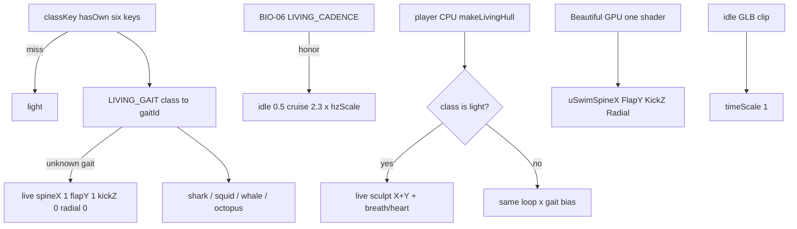

# RIMWARD BIO-08 anatomy-native living locomotion

| Field | Value |
|---|---|
| **Title** | RIMWARD BIO-08 anatomy-native living locomotion |
| **Author** | Wave 107 BIO-08 integrator |
| **Date** | 2026-08-24 |
| **Status** | design-only |
| **Wave** | 107 — markdown only. Later serials land per-class gait bias. |
| **Owner request** | Remaining BIO motion after BIO-06 cadence (Hz/sweep) and BIO-07 species bodies: locomotion native to anatomy for Beautiful Ones NPC (and living player remounts). Fins sweep, mantle pulse, tentacles trail, massive bodies undulate. Live GPU swim is still **one** spine+flap shader for every Beautiful class. |
| **Merge law** | [`out/w107/bio08/shared-contract.md`](../out/w107/bio08/shared-contract.md). If this brief and that file conflict, the contract wins. |
| **Honor** | HUD-01 empty hub. Digit 0 shipyard. Digit 8/9 stay. HUD never writes `hullKind`. `state.js` READ-ONLY; later default **no** `state.js` write and **no** new class keys. Player CPU `makeLivingHull` stays the quality bar. Do **not** clone it onto NPCs. BIO-05 graft closed (Wave 97). BIO-02 kit mutate omit. Do **not** retune BIO-06 `LIVING_CADENCE`. BIO-07 meshes = **other worker**. No persist key. No new Digit. `innerHTML` forbidden later. **Do not edit** sibling Bio/Rep/Msn/Owner docs or the wishlist. |

**Verifier record:**

| Note | Path |
|---|---|
| Inventory (code wins) | [`out/w107/bio08/current-bio08-inventory.md`](../out/w107/bio08/current-bio08-inventory.md) |
| Merge law | [`out/w107/bio08/shared-contract.md`](../out/w107/bio08/shared-contract.md) |
| Security review | [`out/w107/bio08/security-review.md`](../out/w107/bio08/security-review.md) |
| Design-doc review | [`out/w107/bio08/code-review.md`](../out/w107/bio08/code-review.md) |
| UI audit | [`out/w107/bio08/ui-audit.md`](../out/w107/bio08/ui-audit.md) |

Siblings BIO-06, BIO-07, REP-05, HUD, TGT, NAV, SHP, BIO-01..05, `docs/BioLivingShipsDesign.md`, wishlist, `PROGRESS.md`, and `docs/OwnerDecisions*.md` are **other workers**. **Do not edit** those paths. Those sibling files need not exist for this brief to stand. Do **not** write `docs/OwnerDecisionsWave107.md`. Sibling Wave 107 workers own `src/systems/ship.js`, `src/systems/ship-assets.js`, `src/game/living-cadence.js`, `scripts/boot-test.mjs`, `src/systems/station.js` — do not edit those paths.

**This is not BIO-06** (class Hz/sweep). **This is not BIO-07** (mesh/body). Wishlist BIO-07 acceptance still says each body’s animation must feel native to its anatomy **and** follow BIO-06’s size-based cadence.

---

## Overview

Every origin already flies one living hull: CPU `makeLivingHull` with swim, breath, heartbeat, vein skin, and a thrust bioluminescent surge. That **light** rig is the quality benchmark. Beautiful Ones **NPC** ships load faction GLBs and a Wave 76 per-instance GPU swim. Wave 106 / BIO-07 already maps six live class keys onto four marine body plans (shark, squid, whale, octopus). Live motion still displaces **every** Beautiful hull as a manta: spine on X, flap on Y, `wingness` from `|x|`.

Wishlist leftover is **not** a missing mesh and **not** a missing Digit. It is **gait**: the same one shader (and the player CPU loop on larger remounts) must bias axes so a squid pulses, a whale’s fluke drives X/Z, a shark kicks a caudal, and an octopus trails arms in travel pose.

This brief is the integrator document for a **later** implementation wave. Wave 107 this worker lands markdown only. Bindings do not change here.

HUD-01 empty aim glass stays empty. `state.js` stays READ-ONLY. No new SKU. No persist key. Digit 0 stays shipyard. Digit 8/9 stay. Do not invent UU. Do not replace `makeLivingHull`. Do not clone it onto NPCs. Do not retune BIO-06 light 0.5 / 2.3.

Wave 107 deputize (recorded here and in the contract; owner may override after playtest): frozen `LIVING_GAIT` maps six live keys to four gait ids; fail closed = **current** spine+flap shader (BIO-06 scales still apply); player **light** CPU may stay the live sculpt; larger living remounts take gait **bias** without losing breath/heart/veins; preferred PR1 home: `src/game/living-gait.js` (THREE-free).

---

## Background & Motivation

### Current state (inventory)

Source of truth: [`out/w107/bio08/current-bio08-inventory.md`](../out/w107/bio08/current-bio08-inventory.md). Code wins over stale Wave 104 line numbers. Sibling Wave 107 **landed** BIO-06 cadence; this leftover is gait.

| Surface | Today | Cite |
|---|---|---|
| Class keys | six: light ace cutter heavy frigate freighter | `state.js` 37–44; `ship-assets.js` 20 |
| Player sculpt | `makeLivingHull(classKey)` manta/whale sphere 64×40 | `ship.js` 279–339 |
| Player remount | living visual, not NPC GLB | `ship.js` 551–565 |
| Player Hz | idle 0.5 → cruise 2.3 × mood.rate; BIO-06 scales non-light | `living-cadence.js` 8–26; `ship.js` 151–162, 953–976 |
| Player motion | radial breath/heart → **X spine** → **Y flap** → shimmer | `ship.js` 986–1009 |
| Player Z kick | **none** | `ship.js` 997 |
| NPC Beautiful | GLB + GPU swim + idle clip | `ship-assets.js` 42, 278–310, 421–479 |
| NPC uniforms **live** | `uSwimTime` / `uSwimAmp` / `uSwimHz` / **`uSwimSweep`** | `ship-assets.js` 57–63, 66–95, 492–509 |
| NPC shader | one program: X spine + Y flap × sweep | `ship-assets.js` 66–95, 55 |
| `uSwimSweep` | **live** (BIO-06 sibling) | `ship-assets.js` 62, 92, 509 |
| `LIVING_CADENCE` | **live**; light 1.00/1.00 | `living-cadence.js` 12–26; do not retune |
| `aSwim` | `(zNorm, wingness\|x\|, xNorm, size)` | `ship-assets.js` 294–300 |
| Beautiful path | `/assets/ships/beautiful/{class}/{lod}.glb` | `ship-assets.js` 22, 36 |
| Traffic tick | `animateShipMesh(..., velocity.length())` | `npc.js` 188–189, 2287 |
| `reducedMotion` NPC | amp 0; sweep 0; mixer frozen | `ship-assets.js` 494, 506–509 |
| `reducedMotion` player living | **CPU swim still on** | `ship.js` 953–1009 |
| Wave 106 bodies | shark / squid / whale / octopus | `out/w106/foundation/notes.md`; class `.py` |
| Empty hub | 80 px + RANGE | `hud.css` 184–193; `hud.js` 709–712 |
| HUD `hullKind` | read only | `hud.js` 81–89 |
| Digit 0 / 8 / 9 | shipyard / launch / epics | `station.js` 185, 6026–6033 |
| Gait persist | **none** | `save.js` `WORLD_FIELDS` |
| Per-class gait table | **absent** | grep 0 |
| Yard living preview | `update: null` | `yard-preview.js` 115 |

The player flying **light** already has the bar: idle 0.5 Hz, cruise 2.3 Hz, mood, breath, heart, never-still manta sculpt. Wave 106 light is a **young reef shark** on the NPC GLB. Those two must **rhyme in family**, not by cloning CPU vertices onto traffic.

Beautiful NPC heavies are **humpback whales** with a **horizontal fluke** (`heavy.py` 7–18) and still **Y-flap from |x|** like a ray. Ace is a **hunting squid** (`ace.py`) and still grows manta wings in the shader. Frigate is **travel-pose octopus** (`frigate.py` 1–25) and the |x| wing term reads as a **radial sunburst** — the exact silhouette Wave 106 forbade.

### Pain points

- A naive later PR that sets `mixer.timeScale` by class would slow the idle GLB clip and ignore CPU vs GPU split — the forbidden universal multiplier.
- A naive later PR that adds **one shader per species** would smash the Wave 76 cheap path and explode program variants.
- A naive later PR that clones `makeLivingHull` onto traffic would smash GPU cheapness and BIO-03 preserve.
- A naive later PR that retunes BIO-06 `hzScale` “because whales should be slower” steals the cadence leftover. Slow is **Hz**, not gait.
- Putting a species disc or gait pip on the 80 px hub would reopen HUD-01.
- Stealing Digit 0/8/9 would smash shipyard, launch, Standing, or papers.
- Writing gait into `SHIP_CLASSES` would violate `state.js` READ-ONLY.
- Persisting gait would invent a world field for a visual constant.
- Inventing UU / a “fluke stroke” SKU would impersonate the owner.
- Ace that keeps manta `flapY≈1` fails squid.
- Frigate with high `radial` fails travel pose (sunburst).
- Falling through to a generic stub mesh is worse than the live manta shader on the class GLB.
- “Fixing” player reducedMotion by killing CPU swim would change the live quality bar.
- Sneaking a second swim into `yard-preview.js` would steal Digit 0.

### Why now (design) / why not now (code)

The owner asked for the BIO-08 integrator leftover so later serials can match Wave 106 anatomy without a second shader, without weakening light, and without reopening BIO-06 numbers. Inventory shows one manta loop, one manta shader, four body plans, no gait id. Merge law can exist without touching `src/`. Implementation waits so hub theft, Digit theft, `state.js` writes, persist keys, NPC `makeLivingHull` clones, light-bar damage, and per-class GLSL injection are frozen before the first uniform changes. Wave 107 this worker does not ship `src/`.

---

## Goals & Non-Goals

### Goals

1. Document live player CPU swim, NPC GPU uniforms, Wave 106 body plans, reducedMotion split, and Beautiful GLB path from **live code**.
2. Freeze a **per-class gait id** + axis mix (`spineX` / `flapY` / `kickZ` / `radial`) with Wave 107 deputize numbers. Fail closed = live spine+flap.
3. Freeze **one** GPU shader for every Beautiful class. Gait is floats, not programs.
4. Freeze no universal `mixer.timeScale` / global dt scale / idle-clip slowdown.
5. Freeze no new persist key, no new Digit, no `state.js` write, no new class keys, no UU.
6. Freeze player `makeLivingHull` honor / NPC GPU keep. Light CPU may stay live sculpt. Larger remounts bias without losing breath/heart/veins.
7. Freeze `innerHTML` = 0, empty hub, Digit 0/8/9, HUD never writes `hullKind`.
8. Freeze BIO-06 `LIVING_CADENCE` numbers (honor `out/w104/bio06/shared-contract.md`).
9. Freeze a serial PR plan. This wave writes the brief. A later wave ships serially.

### Non-goals (locked — do not reopen)

- No `src/` or live bindings in this worker.
- No `makeLivingHull` replace. No NPC CPU vertex clone.
- No BIO-06 Hz/sweep retune. One-line honor only.
- No BIO-07 rebake / blender / GLB from this leftover.
- No BIO-05 graft / overlay / ungraft / hangar badge.
- No BIO-02 kit mutate. No career-label reopen (Wave 102).
- No aim-glass gait pip / species disc / RANGE rewrite.
- No new Digit. No KeyO row. No toast.
- No `SHIP_CLASSES` extra fields. No invented UU or standing deltas.
- No persist `world.gait`. No settings checkbox for gait.
- Do not retune light 0.5 / 2.3, mood rates, breath 0.25, heart 1.1.
- Do not retune `SHIP_SCALE` targets or cruise/burn integers.
- Do not edit the wishlist, `PROGRESS.md`, Bio01–07, BioLiving, Rep05, OwnerDecisions*.
- Do not write `docs/OwnerDecisionsWave107.md`.
- Do not fix known boot FAILs.
- Do not edit sibling Wave 107 `src` paths listed above.
- Do not add a living-preview swim on Digit 0.

---

## Proposed Design

### 1. Merge resolutions (contract wins)

| Question | Integrator freeze | Why |
|---|---|---|
| New persist key? | **No** | Visual constant. Inventory: none needed |
| `state.js` write? | **No** | Contract §0.6 |
| New class keys? | **No** | Six live keys |
| Universal anim multiplier? | **Forbidden** | Wishlist + mixer/clip smash |
| Clone `makeLivingHull` to NPC? | **No** | GPU stay |
| Weaken player light CPU? | **No** | Live sculpt stays |
| Where is the table? | `living-gait.js` (preferred) | Not `state.js` |
| Shader count? | **One** | Wave 76 cheap path |
| Fail closed? | Live spine+flap; **never** stub mesh | Owner; inventory §10 |
| BIO-06 Hz/sweep? | Honor; do not retune | Contract §0.10 |
| Player larger living? | Gait **bias**; keep breath/heart/veins | Owner |
| Unknowables NPC? | No Beautiful swim uniforms | Inventory §4.2 |
| HUD / Digit / SKU? | **No** | Frozen |
| BIO-07 bake? | **Not this brief** | Other worker |

### 2. Current motion (do not break light)

See inventory §§3–5. Load-bearing loops:

**Player living**

1. `makeLivingHull` sculpts + stores `base` / `zNorm` / `wingness` / `restScale`.
2. Each frame: `speedNorm` from `ship.speed / maxSpeed`.
3. Light: `swimHz = lerp(0.5, 2.3, min(speedNorm,1)) * mood.rate`. Other living classKeys: BIO-06 `cadenceFor` / `classCruise` (do not retune).
4. Mutate vertices: breath/heart radial → X spine → Y flap → shimmer. Veins independent. **Z not kicked.**

**Beautiful NPC**

1. Prime GLB `/assets/ships/beautiful/{class}/lod0.glb`. Bake `aSwim` from bbox `|x|`.
2. Per instance uniforms. Random morph phase. `userData.classKey` stashed.
3. Each frame: `uSwimHz = lerp(0.5, 2.3, min(speed/classCruise, 1)) * hzScale`; `uSwimSweep = sweepScale` (0 if reducedMotion).
4. Shader: X spine + Y flap × sweep. Idle mixer `setTime(elapsed)` unless reducedMotion.

**This serial must not change** light 0.5/2.3/mood, BIO-06 floats, sculpt topology, GLB paths, or organic station sway. Additive: gait axis mix; NPC still Beautiful-only.

Digit 0 and `DOCK_KEY_SERVICES` stay. Digit 8/9 stay.

### 3. Deputize table (copy of contract §0.1)

Owner may override after playtest. Do not park.

| classKey | gaitId | spineX | flapY | kickZ | radial |
|---|---|---|---|---|---|
| *(fail closed)* | live spine+flap | 1.00 | 1.00 | 0.00 | 0.00 |
| light | shark-caudal | 0.55 | 1.00 | 0.70 | 0.00 |
| cutter | shark-caudal | 0.55 | 1.00 | 0.70 | 0.00 |
| ace | squid-mantle | 0.15 | 0.12 | 0.50 | 1.00 |
| heavy | whale-fluke | 0.90 | 0.28 | 0.85 | 0.08 |
| freighter | whale-fluke | 0.90 | 0.28 | 0.85 | 0.08 |
| frigate | octopus-trail | 0.22 | 0.18 | 1.00 | 0.28 |

Player **light** CPU ignores the shark row (quality bar). NPC **light** GPU **may** use shark-caudal.

NPC `uSwimAmp` stays the reducedMotion gate (0/1). Do **not** overload it as gait. Live BIO-06 `uSwimSweep` stays sweep, not gait. New floats: `uSwimSpineX` / `uSwimFlapY` / `uSwimKickZ` / `uSwimRadial` (defaults = live mix).

BIO-06 sibling **landed** `uSwimSweep` and `living-cadence.js` (Wave 104 numbers). Later PR3 adds gait floats to **that** four-uniform shader. Do not retune cadence numbers. Do not overload `uSwimSweep` as gait.

### 4. Neighbours

| Module | BIO-08 does | BIO-08 does not |
|---|---|---|
| `ship.js` CPU | later PR2 bias on non-light living | Replace sculpt; kill mood; rewrite light |
| `ship-assets.js` GPU | later PR3 gait floats | mixer.timeScale; Unknowables swim; second shader |
| `living-gait.js` | later PR1 table | Digit; persist |
| `living-cadence.js` | consume **live** | Retune hzScale/sweepScale |
| `state.js` | **read cruise** | write |
| `organic.js` | cite freeze | retune station sway |
| HUD-01/02 | none | hub pip; `hullKind` write |
| Digit 0 | cite shipyard | bind locomotion; desk swim |
| BIO-05 | none | graft overlay |
| BIO-07 | one-line leftover | bodies / bake |

### 5. Serial PR plan

Matches contract §8. **Named only. Do not implement in Wave 107.**

| PR | Lands | Does not land |
|---|---|---|
| **PR1 data** | `LIVING_GAIT` + `gaitFor` hasOwn → light; unknown gait → live mix. Preferred `src/game/living-gait.js` | `state.js`; Digit; persist |
| **PR2 player CPU** | honor light bit-identical; bias other living classKeys; keep breath/heart/veins | `makeLivingHull` replace; NPC clone |
| **PR3 NPC GPU** | gait floats on **one** shader; Beautiful only; keep `userData.classKey`; consume live cadence | mixer.timeScale; non-beautiful; stub mesh |
| **PR4 reducedMotion + boot pins** | NPC amp 0; light 0.5→2.3; no persist key; Digit 0 shipyard; no hub child | wishlist rewrite; boot FAIL fixes; desk swim |

First remaining serial is **PR1**. It must not steal Digit 0/8/9.

### 6. Picture

Reuse live cameras. No new chrome. Fleet readability is **motion**, not a HUD label.

Yard living preview stays static this serial (`yard-preview.js` 115 `update: null`). Do not sneak a second CPU swim into the desk.

---

## Player outcome (later serial; freeze here)

Fly the **light** living ship: she still breathes, beats, and strokes as she does today — idle hush at 0.5 Hz, cruise at 2.3 Hz, keen/feral still quicken her. That feel is the bar.

Watch Beautiful **traffic**: a **light** or **cutter** kicks a caudal and folds pectorals — shark family, not a diamond ray. A **cutter** is not a scaled-up light mesh (BIO-07 already); gait stays the same family.

An **ace** darts on a mantle pulse. Arms trail. It does not flap manta wings.

A **heavy** or **freighter** drives a horizontal fluke: more X/Z, less Y, whole-body follow-through. BIO-06 still makes the freighter’s **Hz** the slowest. Gait does not steal that.

A **frigate** travels as an octopus: mantle toward the nose (−Z), arms trailing aft. It does not bloom into a radial sunburst.

Remount a living **heavy**: you keep breath, heart, and veins. The sculpt is still `makeLivingHull` (player bar, not the NPC GLB). Motion **biases** toward a fluke, and must not go still.

KeyO reduced motion still freezes Beautiful NPC swim and station organics. The player living hull still lives, as today. The 80 px hub stays empty. Digit 0 is still shipyard. No one sells “gait.”

**BIO-06** (how fast fins stroke by class) is **not** this work. **BIO-07** (what the body looks like) is **not** this work.

---

## Security

See [`out/w107/bio08/security-review.md`](../out/w107/bio08/security-review.md).

- XSS: no new DOM. `innerHTML` forbidden later. Do not interpolate `classKey` / `gaitId` into shader source.
- Proto: `gaitFor` + `classKeyOf` hasOwn; unknown classKey → light; unknown gait → live mix.
- Persist: no new key.
- No secrets. No Digit theft. No UU.

---

## Acceptance direction (implementation wave)

1. Light player idle 0.5 / cruise 2.3 / mood / breath / heart unchanged (boot pin). Light CPU sculpt stays.
2. Side-by-side Beautiful classes: shark (light, cutter), squid (ace), whale (heavy, freighter), octopus trail (frigate). Not one manta flap.
3. Ace is not manta wings. Frigate is not a radial sunburst. Cutter is shark family, not a scaled-light motion toy on a different problem (mesh is BIO-07).
4. BIO-06 monotonic slower Hz as size grows still holds when cadence is landed. Gait does not invert it.
5. `makeLivingHull` still the player living mesh. NPCs still GLB + GPU. One shader.
6. `reducedMotion`: NPC `uSwimAmp` 0; player CPU swim still on.
7. No gait persist key. No `SHIP_CLASSES` new field. Digit 0 shipyard. Hub 80 px empty of new children.
8. Unknown classKey → light. Missing gait → live spine+flap. Never a generic stub mesh.
9. No `innerHTML` on paths this serial touches.
10. BIO-06 numbers unchanged. BIO-07 meshes unchanged by this leftover.

---

## Alternatives considered

| Alternative | Why not |
|---|---|
| One `mixer.timeScale` / global dt | Forbidden universal multiplier; slows idle clip + organics |
| One shader per species / compile-key from classKey | Program explosion; injection footgun |
| Slow light player to match fleet | Weakens the quality bar |
| Clone `makeLivingHull` onto NPC | Perf + BIO-03 preserve |
| Only scale NPC, skip player remount | Living heavy remount still flaps as a manta |
| Retune BIO-06 Hz instead of gait | Steals cadence; does not change axis |
| `SHIP_CLASSES.gait` in `state.js` | READ-ONLY / no-write freeze |
| Persist gait / Digit / SKU | Impersonates owner; HUD-01 / Digit freeze |
| Scale breath + heart with gait | Changes player identity |
| Kill player CPU swim under reducedMotion | Silent a11y “fix”; live split stays |
| Desk swim on Digit 0 living preview | Steals shipyard; second animator |
| Design BIO-07 bodies here | Other worker |
| High radial on frigate | Travel-pose sunburst; Wave 106 forbid |

---

## Regression risks

| Risk | Mitigation |
|---|---|
| Light player feel changes | Contract §0.1 player light CPU; PR2 light bit-identical; PR4 pin 0.5/2.3 |
| Ace still manta | squid-mantle flapY 0.12; PR3 playtest |
| Frigate sunburst | octopus-trail radial 0.28 < squid; kickZ 1.00 |
| Large fins frozen | BIO-06 sweepScale honor; gait does not zero amp |
| Universal multiplier sneaks in | forbid mixer.timeScale; PR4 grep |
| NPC `makeLivingHull` clone | Contract §0.9 |
| `state.js` write / new class key | Contract §0.6 |
| Persist key | Contract §0.7 |
| Hub pip / Digit steal | Contract §0.2–0.3 |
| BIO-05 / BIO-06 / BIO-07 reopen | Contract §0.10, §0.12–0.13 |
| Player reducedMotion smash | Contract §0.14 |
| Shader string injection | authored GLSL; uniform floats only |
| Unknown class proto | hasOwn → light |
| Stub mesh on miss | fail closed live shader + class GLB |

---

## Ownership

| Object | Writer | Reader |
|---|---|---|
| `makeLivingHull` | **none this leftover** (honor) | player remount, yard, catalog |
| `LIVING_GAIT` | later PR1 module | PR2 CPU, PR3 GPU |
| `uSwimHz` / `uSwimAmp` | BIO-06 / live GPU | GPU |
| `uSwimSweep` | BIO-06 live; **do not retune** | GPU |
| gait floats | later BIO-08 PR3 | GPU |
| `state.js` `SHIP_CLASSES` | **none** | cruise read |
| `state.js` | serial data owner only | **feature PRs read-only** |
| HUD / Digit | **none** | — |
| class `.py` / GLB | BIO-07 siblings | glance only |

---

## Open owner questions

**Deputized this wave** (contract §0.1). Owner may override after playtest. Do not park.

1. Four gait ids; six-key map as Wave 106 body plans; fail closed live spine+flap.
2. Home: not `state.js`; preferred `living-gait.js`.
3. One shader; gait = float axis mix.
4. Player light CPU unchanged; larger living remounts bias; keep breath/heart/veins.
5. reducedMotion split stays live.
6. BIO-06 numbers untouched.

Do not invent prices, class keys, or persist in a later impl without a successor owner line.
