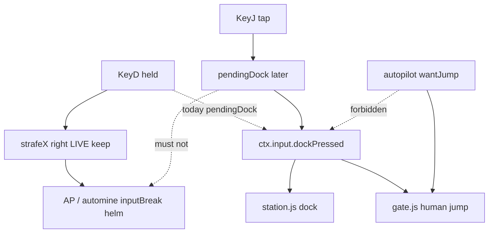

# RIMWARD CTL-01 remaining dock/jump interaction bind

| Field | Value |
|---|---|
| **Title** | RIMWARD CTL-01 remaining dock/jump interaction bind |
| **Author** | Wave 116 CTL-01 leftover integrator |
| **Date** | 2026-08-24 |
| **Status** | Wave 117 PR1 landed — KeyJ sets `pendingDock`; KeyD is strafe only. Boot pins applied. Title skip is overlay-attached (not create-on-miss `getElementById`). |
| **Wave** | 117 — PR1 dedicated dock/jump bind + boot pins. |
| **Owner request** | Inbox P0 CONTROLS leftover: live `D` means both lateral strafe-right and dock/jump, so the displayed gate or dock prompt can move the ship out of interaction range. Census whether that dual-bind is still live. If real, freeze a later serial that gives dock **and** gate jump one dedicated **non-movement** interaction key. Keep `ctx.input.dockPressed` as the world edge. Autopilot `wantJump` stays independent. |
| **Merge law** | [`out/w116/ctl01/shared-contract.md`](../out/w116/ctl01/shared-contract.md). If this document and that file conflict, the contract wins. |
| **Honor** | HUD-01 empty hub. Digit 0 shipyard. Digit 8/9 stay. KeyT/KeyV/KeyK/KeyX stay. `state.js` READ-ONLY; later **no** `state.js` write and **no** new persist key. No UU. No SKU. No new Digit. `innerHTML` forbidden later. Help strings / prompts update with `textContent`. `reducedMotion` n/a. Autopilot `wantJump` is NAV-03/NAV-05 — **cite, do not steal**. HUD-02 combat rails in `src/systems/hud.js` are a Wave 116 sibling — later CTL-01 may retouch **prompt copy only**. Do **not** edit the wishlist, `PROGRESS.md`, `docs/Nav*.md`, `docs/Hud02RemainingTargetSilhouettesDesign.md`, or `docs/OwnerDecisions*.md`. Do **not** write `docs/OwnerDecisionsWave116.md`. Do **not** steal sibling `out/w116/hud02tgt/**` or `out/w116/nav05/**`. |

**Landed (Wave 117 PR1):** `controls.js` KeyJ → `pendingDock`; KeyD strafe only; title/models/typing skip; help / onboarding / HUD prompt family name **J**. Boot pins applied after NAV-05: WAVE21 `dispatchKey('KeyJ')`; WAVE6 `hintCardVisible('J — dock')`. Direct `ctx.input.dockPressed = true` dock helpers kept. Recipe: [`out/w117/ctl01/boot-pin-recipe.md`](../out/w117/ctl01/boot-pin-recipe.md).

**Verifier record:**

| Note | Path |
|---|---|
| Inventory (code wins; Wave 116 census) | [`out/w116/ctl01/current-ctl01-dock-bind-inventory.md`](../out/w116/ctl01/current-ctl01-dock-bind-inventory.md) |
| Merge law | [`out/w116/ctl01/shared-contract.md`](../out/w116/ctl01/shared-contract.md) |
| Wave 116 security review | [`out/w116/ctl01/security-review.md`](../out/w116/ctl01/security-review.md) |
| Wave 116 design-doc review | [`out/w116/ctl01/code-review.md`](../out/w116/ctl01/code-review.md) |
| Wave 116 UI audit | [`out/w116/ctl01/ui-audit.md`](../out/w116/ctl01/ui-audit.md) |
| Wave 116 notes | [`out/w116/ctl01/notes.md`](../out/w116/ctl01/notes.md) |
| Wave 117 boot-pin recipe (applied) | [`out/w117/ctl01/boot-pin-recipe.md`](../out/w117/ctl01/boot-pin-recipe.md) |
| Wave 117 security / code / UI | [`out/w117/ctl01/security-review.md`](../out/w117/ctl01/security-review.md), [`out/w117/ctl01/code-review.md`](../out/w117/ctl01/code-review.md), [`out/w117/ctl01/ui-audit.md`](../out/w117/ctl01/ui-audit.md) |

Siblings HUD-02 target silhouettes, NAV-05 AP handoff, wishlist, `PROGRESS.md`, `docs/Nav*.md`, `docs/Hud02RemainingTargetSilhouettesDesign.md`, and `docs/OwnerDecisions*.md` are **other workers**. **Do not edit** those paths. Do **not** write `src/`. Do **not** steal sibling Wave 116 paths (`out/w116/hud02tgt/**`, `out/w116/nav05/**`).

**This is not NAV-05.** **This is not HUD-02 combat rails.** **This is not CTL overlay-priority (P1 inbox).** Wishlist CTL-01 dual-bind is **INBOX**. Census still finds **KeyD dual-bind live**.

---

## Overview

Inbox source (`docs/PLAYER-EXPERIENCE-WISHLIST.md` Idea inbox — **cite, do not edit**):

> IDEA (P0, CONTROLS): `D` currently means both lateral strafe-right and dock/jump, so using the displayed gate or dock prompt can move the ship out of interaction range; give dock/jump a dedicated non-movement interaction binding so movement and contextual actions cannot fire from the same key.

Wave 116 this worker lands markdown only. Bindings do not change here.

Census (code wins): `controls.js` keydown `KeyD` sets `pendingDock = true` **and** held `KeyD` writes `input.strafeX`. HUD help still says “A/D — lateral strafe (D = right)” **and** “H — hail · D — dock”. Onboarding still says “D — dock” / “D — jump the gate”. Context prompt still paints `D` for Dock and Jump (hub paints `G` plus “D — Jump”). `gate.js` human path is `inZone && dockPressed`. Autopilot ORs `wantJump` **separately**. `station.js` docks on `dockPressed` within `U.DOCK_RANGE`. Dual-bind is **LIVE**. Leftover is **real**.

This leftover is a **dedicated non-movement interaction bind** for the existing dock/jump **prompt family**. It is not a new event name. It is not an autopilot emit. It is not overlay stacking.

This document is the integrator for a **later** implementation wave.

HUD-01 empty aim glass stays empty. `state.js` stays READ-ONLY. No new persist key. Digit 0 stays shipyard. Digit 8/9 stay. KeyT/KeyV/KeyK/KeyX stay. Do not invent UU. Do not steal Digit 0/8/9. Do not remap KeyT/V/K/X.

Wave 116 deputize (recorded here and in the contract; owner may override after playtest): **KeyJ** sets `pendingDock`. **KeyD** stays lateral strafe-right only. World readers keep `ctx.input.dockPressed`. Dock and gate jump stay the **same** key unless a later census proves they must split (live they share one edge). Autopilot `wantJump` does **not** require KeyJ and must **not** write `dockPressed`.

If census had proved D is no longer dual-bind, this pack would freeze **CONSUME** and name serial **none**. Census did not.

---

## Background & Motivation

### Current state (inventory)

Source of truth: [`out/w116/ctl01/current-ctl01-dock-bind-inventory.md`](../out/w116/ctl01/current-ctl01-dock-bind-inventory.md). Code wins.

| Surface | Today | Cite |
|---|---|---|
| Dual-bind | `KeyD` → `pendingDock` **and** held `strafeX` | `controls.js` 274–276, 440 |
| Edge publish | `input.dockPressed = pendingDock` one frame | `controls.js` 370–377 |
| Help | “A/D — lateral strafe (D = right)”; “H — hail · D — dock” | `controls.js` 343, 353 |
| `TRACKED` | includes `KeyD`; **no** `KeyJ` | `controls.js` 41–48 |
| `ctx.input` | `strafeX` “>0 = strafe right (D)”; `dockPressed` “edge: D” | `ctx.js` 76, 88 |
| Human jump | `inZone && (dockPressed \|\| apJump)` | `gate.js` 643–650 |
| AP jump | `wantJump` after `inZone` + routed hop | `gate.js` 643–647; `autopilot.js` 317 |
| Hub cycle | `KeyG` (not dock) | `gate.js` 577–585 |
| Station dock | `dockPressed` + `U.DOCK_RANGE` | `station.js` 6250–6259 |
| Prompt | dock `D`; jump `D`; hub `G` + “D — Jump” | `hud.js` 2127–2138 |
| Prompt DOM | `textContent` on key + verb | `hud.js` 837–839, 2184–2185 |
| Onboarding | “D — dock”; “D — jump the gate” | `onboarding.js` 50, 53 |
| Title | systems[0]; capture swallows all but KeyO/Escape; Enter = first entry | `title.js` 190–227; `main.js` 105–106 |
| Origins | Digit1–5 only (bubble) | `origins.js` 143–149 |
| Settings | KeyO / Escape | `settings.js` 228–234 |
| AP `inputBreak` | `strafeX` is helm; **not** `dockPressed` | `autopilot.js` 153 |
| Automine `inputBreak` | `strafeX` is helm; **not** `dockPressed` | `automine.js` 177 |
| MATCH cancel | throttle / docked / jump / lost lock; **not** `dockPressed` | `ship.js` 748–750 |
| Boot jump | `dispatchKey('KeyD')` WAVE21 | `boot-test.mjs` 706, 732 |
| Boot dock | direct `ctx.input.dockPressed = true` | `boot-test.mjs` 1137, 4460, 6572 |
| Boot hint | `'D — dock'` WAVE6 | `boot-test.mjs` 1732 |
| Unbound dismiss | `dispatchKey('KeyZ')` | `boot-test.mjs` 1723 |

### Pain points

- A player who taps the painted **D** prompt also strafes right and can leave the dock/gate zone.
- Holding D in zone today **jumps and strafes**. After a dedicated bind, holding D must **never** jump.
- A naive later PR that invents `jumpPressed` forces `gate.js` / `station.js` rewrites and fights AP `wantJump`.
- A naive later PR that makes AP write `dockPressed` mixes human and autopilot edges.
- A naive later PR that steals Digit 0/8/9 or KeyT/V/K/X fights HUD-01 / TGT-05 / MATCH.
- A naive later PR that picks **Enter** fires title CONTINUE / death recover.
- A naive later PR that picks **KeyZ** fights WAVE6 “unbound dismiss”.
- A naive later PR that `innerHTML`s help lines is XSS.
- Putting a new persist key or Digit impersonates the owner.
- Reopening P1 overlay stacking is a different inbox item.

### Why now (design) / why not now (code)

The owner asked for the CTL-01 leftover integrator so later serials can split movement from contextual dock/jump **before** the first remap. Inventory shows one dual-bind, one shared `dockPressed` edge, independent `wantJump`, and boot pins that dispatch **KeyD** for jump. Merge law can exist without touching `src/`. Implementation waits so Digit theft, event rename, AP coupling, overlay hijack, and HUD-02 combat-rail theft are frozen before the first `case 'KeyJ'`. Wave 116 this worker does not ship `src/`.

If census had proved D is no longer dual-bind, this pack would freeze **CONSUME** and name serial **none**. Census did not.

---

## Goals & Non-Goals

### Goals

1. Document live KeyD dual-bind, `dockPressed` readers, AP `wantJump`, HUD/onboarding/boot strings from **live code**.
2. Freeze leftover = **dedicated non-movement dock/jump bind**. Not a new event. Not AP emit.
3. Freeze deputize **KeyJ** (unused letter; mnemonic jump/dock). Owner may override after playtest. Do not park.
4. Freeze dock **and** gate jump on the **same** new key (same prompt family).
5. Freeze `ctx.input.dockPressed` as the world edge. Remap the **key that sets `pendingDock`**.
6. Freeze KeyD as strafe-right only. Movement keys must not emit dock/jump.
7. Freeze AP `wantJump` independent. Do not require KeyJ for AP jumps. Do not make AP write `dockPressed`.
8. Freeze persist: **none** new. `state.js` READ-ONLY. No UU. No SKU. No new Digit.
9. Freeze HUD-01 empty hub. Digit 0/8/9 stay. KeyT/V/K/X stay.
10. Freeze later copy via `textContent`. `innerHTML` forbidden.
11. Freeze accessibility: the prompt **names** the new key. Color is not the only cue.
12. Freeze a serial PR plan. This wave writes the document. A later wave ships serially.

### Non-goals (locked — do not reopen)

- No `src/` or live bindings in this worker.
- No new `input.jumpPressed` / `pendingJump` event name unless a later census proves a split is load-bearing (it is not).
- No AP `wantJump` rewrite. No `src/game/autopilot.js` in this leftover’s later write-set.
- No HUD-02 combat rails (`tgtFacing`, class tokens, hub). Later CTL-01 may retouch **prompt copy only** in `hud.js`.
- No HUD-01 hub child. No new Digit. No KeyT/V/K/X remap.
- No `state.js` write. No WORLD_FIELDS. No settings bind-remap UI this serial.
- No P1 overlay-priority policy (hail / chart / berth stack). Call out collision only.
- Do not edit the wishlist, `PROGRESS.md`, `docs/Nav*.md`, `docs/Hud02RemainingTargetSilhouettesDesign.md`, Bio*, Msn*, Rep*, Tgt*, OwnerDecisions*.
- Do not write `docs/OwnerDecisionsWave116.md`.
- Do not fix known boot FAILs except later PR1 **string / KeyD jump pin** updates on purpose.
- Do not steal `out/w116/hud02tgt/**` or `out/w116/nav05/**`.

---

## Proposed Design

### 1. Merge resolutions (contract wins)

| Question | Integrator freeze | Why |
|---|---|---|
| Leftover real? | **Yes** — KeyD dual-bind live | Inventory §1 |
| CONSUME? | **No**. Serial is **not** none | Census |
| New persist key? | **No** | Contract §0.6 |
| `state.js` write? | **No** | Contract §0.5 |
| Rename `dockPressed`? | **No** | Readers stay `gate.js` / `station.js` |
| Split dock vs jump keys? | **No** unless later census proves split | Same edge, same prompt family |
| AP `wantJump`? | Independent; do not write `dockPressed` | NAV-05; `gate.js` 643–650 |
| Deputize | **KeyJ** | Unused + mnemonic; contract §0.1 |
| Enter? | **Forbidden** | Title capture + death recover |
| KeyZ? | **Forbidden** | WAVE6 unbound dismiss |
| Digit 0/8/9 steal? | **No** | HUD-01 / station |
| KeyT/V/K/X remap? | **No** | TGT-05 / MATCH |
| `innerHTML`? | **No** | XSS |
| `reducedMotion`? | n/a | No new motion |
| First serial | **PR1 dedicated dock/jump bind** | Named only |

### 2. Current dual-bind (do not keep)

**Today (every KeyD tap while flying)**

1. Capture/bubble: title may swallow; else `controls.js` tracks `KeyD`.
2. Keydown (non-repeat): `pendingDock = true`.
3. Same frame update: `dockPressed = true` **and** `strafeX += 1` while held.
4. `gate.js` (runs **before** controls in `main.js`) reads **previous-frame** `dockPressed`.
5. `station.js` reads `dockPressed` in-range.
6. Ship strafes right for as long as D is held.

**This serial must not change** WASD strafe axes (except KeyD must stop setting `pendingDock`), Q/E roll, R/F throttle, Space burn, Shift drift, LMB fire, KeyT/V/K/X, Digit 1–5, AP `wantJump`, station Digit map, HUD-01 hub.

### 3. Deputize table (copy of contract §0.1)

Owner may override after playtest. Do not park.

| Knob | Value |
|---|---|
| New dock/jump key | **KeyJ** |
| Old KeyD | strafe-right **only** |
| World edge | keep `ctx.input.dockPressed` |
| Dock vs jump | **same** KeyJ |
| AP | `wantJump` independent |
| Fail-closed | unknown overlay / typing → **do not** pulse `pendingDock`; never throw; never freeze the sim |
| Persist | none new |
| `reducedMotion` | n/a |
| Copy | `textContent` / `el()` / `h()` only |
| Home | `controls.js` (bind) + HUD/onboarding/boot **strings** |

Hint language: prompt **names J**. Color chip is not the only cue.

### 4. Neighbours

| Module | This leftover does | This leftover does not |
|---|---|---|
| `controls.js` | later PR1: `pendingDock` from KeyJ; KeyD strafe only; help lines | steal T/V/K/X; Digit |
| `ctx.js` | later comment hygiene on `dockPressed` / `strafeX` | new input field |
| `gate.js` | **read** `dockPressed` (unchanged) | require KeyJ; rewrite `wantJump` OR |
| `station.js` | **read** `dockPressed` (unchanged) | Digit remap |
| `hud.js` | later **prompt copy** D→J only | combat rails; hub; class tokens |
| `onboarding.js` | later hint strings | persist `seen` schema |
| `boot-test.mjs` | later KeyD **jump** pins → KeyJ; `'D — dock'` string | known FAIL fixes; combat pins |
| `autopilot.js` | none | `wantJump`; `inputBreak` must **not** treat KeyJ as helm |
| `state.js` | none | write |
| Title / origins | capture census | steal Enter |

### 5. Serial PR plan

Matches contract §3. **Named only. Do not implement in Wave 116.**

| PR | Lands | Does not land |
|---|---|---|
| **PR1 dedicated dock/jump bind** | KeyJ → `pendingDock`; KeyD strafe only; TRACKED add KeyJ; help / onboarding / prompt **copy**; `ctx.js` comments; boot `dispatchKey('KeyD')` jump pins → KeyJ; WAVE6 `'D — dock'` → `'J — dock'`; skip `pendingDock` while title / models / typing | `state.js`; Digit; persist; AP `wantJump`; HUD-02 rails; overlay-priority policy; `innerHTML`; Enter |
| **PR2 prompt chrome (optional)** | Playtest stills of dock/jump prompt naming J; optional key-chip polish | Required with PR1; overlay stacking; known boot FAILs |
| **PR3 census (optional skip)** | Re-grep: KeyD must not set `pendingDock`; KeyJ must | New world field |

First remaining serial is **PR1**. It must not steal Digit 0/8/9. It must not write `state.js`. It must not claim `src/game/autopilot.js`. Do not land overlay policy as required PR1.

### 6. Picture

Reuse live prompt. No new chrome required in PR1. Dock and jump still share one edge. The painted key becomes **J**. Strafe help still says A/D.

No hub pip. Digit 0 stays shipyard. KeyT/V/K/X stay. AP still jumps without J.

---

## Player outcome (later serial; freeze here)

Fly with A/D. D strafes right. D does **not** dock. D does **not** jump.

Enter a station zone. Prompt names **J** and the verb Dock. Tap J. Ship docks. Hold D in the same zone: ship strafes; ship does **not** dock.

Enter a gate zone. Prompt names **J** and Jump to \<dest\>. Tap J. Human jump emits. Autopilot on a routed hop still uses `wantJump` without J.

At a Lamplighter hub, **G** still cycles routes. Jump uses **J**, not D.

HUD CONTROLS list: A/D lateral strafe; hail / **J dock** / camera. Onboarding matches.

Title still uses 1–n / Enter / click. Typing J on the title does not jump. Settings KeyO stays.

`reducedMotion` is unchanged.

**NAV-05 AP handoff** is **not** this work. **HUD-02 target silhouettes** are **not** this work.

---

## Security

See [`out/w116/ctl01/security-review.md`](../out/w116/ctl01/security-review.md).

- Title capture already swallows KeyJ (not Enter). Do not deputize Enter.
- Models filter: letters can reach bubble `controls.js`. Later PR1 must not pulse `pendingDock` while an INPUT/TEXTAREA/SELECT/contentEditable is focused, while the `#rw-title` overlay is attached, or while `ctx.models.isOpen()`. A create-on-miss `getElementById` stub is not title open.
- Settings / chart / berth / hail stacking is P1 overlay policy — **call out**, do not solve here. Later PR1 may fail-closed skip dock while those overlays are obviously open if a live flag exists; do not invent a persist flag.
- XSS: no `innerHTML` for help/prompt. `textContent` only.
- Proto: no new dataset merge. Key codes are authored literals.
- Persist: no new key.
- AP must not write `dockPressed`. Hostile save cannot bind keys (no remap store).
- Fail-closed never freeze the sim.

---

## Acceptance direction (implementation wave)

1. `controls.js`: `case 'KeyD'` does **not** set `pendingDock`. Held `KeyD` still sets `strafeX`. `case 'KeyJ'` sets `pendingDock`. `TRACKED` includes `KeyJ`.
2. Help lines name J for dock and keep A/D for strafe. `textContent` / `el()` only.
3. Onboarding `'J — dock'` and `'J — jump the gate'`.
4. HUD context prompt dock/jump family names **J** (hub verb “J — Jump to …”). Do **not** rewrite combat rails.
5. `gate.js` / `station.js` still read `dockPressed`. No new event.
6. AP `wantJump` still jumps without KeyJ. AP does not write `dockPressed`. KeyJ is **not** AP/automine helm.
7. Boot: WAVE21 `dispatchKey('KeyD')` jump paths become `KeyJ` **on purpose**. Direct `ctx.input.dockPressed = true` dock helpers may stay. WAVE6 hint pin updates to `'J — dock'`. KeyZ stays unbound dismiss.
8. No new persist key. Digit 0 shipyard. Digit 8/9 stay. KeyT/V/K/X stay.
9. Prompt names the key in text. Color chip is not the only cue.
10. Known boot FAILs untouched except the KeyD-jump / dock-string pins above.

---

## Alternatives considered

| Alternative | Why not |
|---|---|
| Freeze CONSUME / serial none | Census: KeyD still dual-binds |
| Keep D = dock, move strafe to another key | Breaks WASD muscle memory worse than dock; inbox asked to free **interaction** from movement |
| Split dock Key vs jump Key | Live one edge; HUD one family; extra keys |
| Rename to `jumpPressed` | Load-bearing readers; AP already has `wantJump` |
| Make AP write `dockPressed` | Mixes human vs AP; NAV-05 |
| Digit 6 / 0 | Digit map / HUD-01 |
| KeyT/V/K/X | TGT-05 / MATCH |
| Enter | Title CONTINUE + death recover |
| KeyZ | WAVE6 unbound dismiss |
| KeyO | Settings |
| KeyG | Hub cycle |
| KeyB / KeyY | Docked undock / shipyard |
| `innerHTML` help | XSS |
| Persist rebind UI | Settings schema; not this leftover |
| Overlay stacking PR | P1 inbox; not this wave |

---

## Regression risks

| Risk | Mitigation |
|---|---|
| Players trained on D-to-dock | Prompt + onboarding + CONTROLS list name J |
| Boot `dispatchKey('KeyD')` jump | Later pin update **on purpose** (WAVE21 706/732) |
| Hold D in zone accidentally jumping (today) vs never (after) | Intended; document in notes |
| Title/origin/settings eating KeyJ | Title swallows; origins ignore non-Digit; settings is KeyO; skip typing/title/models |
| AP `inputBreak` treating KeyJ as helm | Do **not** add dock key to helm table; `strafeX` stays D |
| Overlay policy collision | Call out; P1 not this wave |
| HUD-02 combat-rail steal | Prompt copy only |
| NAV-05 `wantJump` steal | Independent OR in `gate.js` |
| Digit / hub / persist | contract §0.2–0.6 |
| `innerHTML` | contract §0.4 |
| Enter hijack | KeyJ not Enter |

---

## Ownership

| Object | Writer | Reader |
|---|---|---|
| `pendingDock` / `input.dockPressed` | later PR1 `controls.js` (KeyJ) | `gate.js`, `station.js`, `ship.js` collision skip |
| `input.strafeX` | `controls.js` KeyA/KeyD (unchanged keys) | `ship.js`; AP/AM `inputBreak` |
| `autopilot.wantJump` | **none** (NAV-05 / live AP) | `gate.js` |
| HUD help lines | later PR1 via `config.controls` | `hud.js` list (`el` text) |
| HUD prompt dock/jump copy | later PR1 `hud.js` **pKey/pVerb only** | overlay prompt |
| Onboarding hint text | later PR1 | hint card `textContent` |
| Boot KeyD jump pins | later PR1 `boot-test.mjs` | harness |
| `state.js` | **none** | — |
| Digit / station services | **none** | — |

---

## Open owner questions

**Deputized this wave** (contract §0.1). Owner may override after playtest. Do not park.

1. Smallest additive = remap `pendingDock` from KeyD to **KeyJ**. Keep `dockPressed`. KeyD = strafe only.
2. Dock and jump stay one key.
3. AP `wantJump` stays independent.
4. No new persist key.
5. Home: `controls.js` + copy pins. Not `state.js`. Not a new Digit. Not HUD-02 rails. Not `autopilot.js`.
6. Optional PR2 prompt chrome is skippable after playtest.
7. Leftover is **real**. Not CONSUME. Serial is **PR1 dedicated dock/jump bind**, not none.
8. KeyJ unused in `src/` (I/U also unused; Z is harness-unbound; Enter is title/death). Deputize J.
