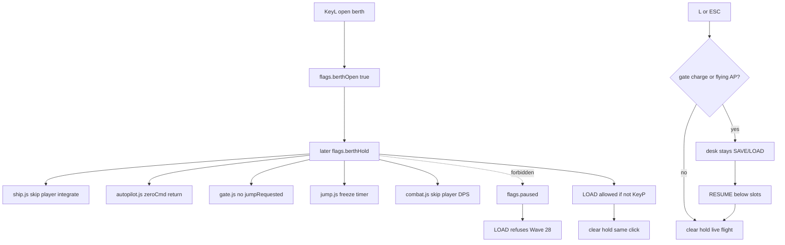

# RIMWARD CTL-03 remaining Berth Records sim freeze

| Field | Value |
|---|---|
| **Title** | RIMWARD CTL-03 remaining Berth Records sim freeze |
| **Author** | Wave 124 CTL-03 leftover integrator |
| **Date** | 2026-08-25 |
| **Status** | Wave 125 PR1 implemented. Helm on the records desk does not disengage a flying Autopilot leg. Leftover was **REAL**. Merge law: shared-contract.md wins. |
| **Wave** | 125 — PR1 session `berthHold` + explicit RESUME. Bindings KeyL/M/H/J/P stay. |
| **Owner request** | Inbox P0 RECORDS/OVERLAYS leftover: Opening Berth Records during an active routed flight allowed the ship to enter a gate and arrive in another system behind the modal. Census live code. Code wins. If hold + resume-on-close are already live, freeze CONSUME and named serial **none**. Census: **not** live. Freeze leftover **REAL** and name later serial **PR1**. |
| **Merge law** | [`out/w124/berthfreeze/shared-contract.md`](../out/w124/berthfreeze/shared-contract.md). If this document and that file conflict, **the contract wins**. |
| **Honor** | HUD-01 empty hub. Aim-glass gauges stay off. Kit mutate omit. Digit 0 shipyard. Digit 8/9 stay. No new Digit. KeyL berth, KeyM chart, KeyH hail, KeyJ dock/jump, KeyP pause stay. CTL-02 Wave 118 mutex hail/chart/berth; hail/chart/berth **never** write `ctx.flags.paused` — **cite this collision**. Do not reopen hail defer/calm. Do not pause hail or chart. Wave 28: SAVE while paused still writes; LOAD is paused-gated. NAV-05 `showApLive` / `gate.js` sole `jumpRequested`. NAV-03 restore never resumes flying Autopilot. `state.js` READ-ONLY later. No new `WORLD_FIELDS` persist key. `innerHTML` forbidden later. Do **not** steal sibling Wave 124 packs (starter grace, menu input). Do **not** steal P1 hail-demand lifecycle, HUD deconfliction, chart zoom, onboarding lesson, Settings rebind, Agent API. Do **not** edit the wishlist, `PROGRESS.md`, `docs/Ctl01DockBindDesign.md`, `docs/Ctl02OverlayDesign.md`, `docs/Nav*.md`, or `docs/OwnerDecisions*.md`. Do **not** write `docs/OwnerDecisionsWave124.md`. |

**Verifier record:**

| Note | Path |
|---|---|
| Inventory (code wins; Wave 124 census) | [`out/w124/berthfreeze/current-ctl03-berth-freeze-inventory.md`](../out/w124/berthfreeze/current-ctl03-berth-freeze-inventory.md) |
| Merge law | [`out/w124/berthfreeze/shared-contract.md`](../out/w124/berthfreeze/shared-contract.md) |
| Wave 124 security review | [`out/w124/berthfreeze/security-review.md`](../out/w124/berthfreeze/security-review.md) |
| Wave 124 design-doc review | [`out/w124/berthfreeze/code-review.md`](../out/w124/berthfreeze/code-review.md) |
| Wave 124 UI audit | [`out/w124/berthfreeze/ui-audit.md`](../out/w124/berthfreeze/ui-audit.md) |
| Wave 124 notes | [`out/w124/berthfreeze/notes.md`](../out/w124/berthfreeze/notes.md) |

Siblings CTL-02 overlay, CTL-01 KeyJ, NAV-05, CTL-04 menu digits, AI-05, wishlist, `PROGRESS.md`, `docs/Ctl02OverlayDesign.md`, `docs/Nav*.md`, and `docs/OwnerDecisions*.md` are **other workers**. **Do not edit** those paths. Do **not** write `src/`. Do **not** steal sibling Wave 124 paths.

**This is not CTL-02 hail/chart pause.** **This is not KeyP pause.** **This is not NAV-05 `showApLive`.** **This is not CTL-04 `controls.js`.** Wishlist berth-behind-modal is **PLANNED** (Wave 124 brief). Census still finds **live sim under berth**.

---

## Overview

Inbox source (`docs/PLAYER-EXPERIENCE-WISHLIST.md` Idea inbox — **cite, do not edit**):

> INBOX (P0, RECORDS/OVERLAYS): Opening Berth Records during an active routed flight allowed the ship to enter a gate and arrive in another system behind the modal. Suspend flight, autopilot, hazards, and gate activation while save/load UI is open; on close, require an explicit resume when a transition or autopilot leg was interrupted. A save/load screen must be a safe place to stop and understand the current state.

Wave 124 this worker lands markdown only. Bindings do not change here.

Census (code wins): Berth (`z-index:60`, `flags.berthOpen`) does **not** pause. `setBerthOpen` never writes `flags.paused`. Hint still says **records hold while you fly**. `main.js` skips `system.update` **only** when `flags.paused`. Autopilot returns on pause, **not** on berth. `gate.js` still emits `jumpRequested` in zone. `jump.js` still charges and swaps. Sun heat/kill and NPC fire still hit the player. CTL-02 mutex defers the hail **card**, not the attack. `berthHold` is **absent**. Resume-on-close is **absent**. LOAD still refuses **only** `flags.paused` (Wave 28). Leftover is **REAL**.

This leftover is a **session berth-open hold** that is **not** KeyP pause, plus an **explicit RESUME** text control when a gate charge, jump, or flying Autopilot was interrupted. It is not a new Digit. It is not a second jump path.

This document is the integrator for a **later** implementation wave.

HUD-01 empty aim glass stays empty. `state.js` stays READ-ONLY. No new persist key. Digit 0 stays shipyard. Digit 8/9 stay. KeyL/M/H/J/P stay. Do not invent UU. Do not steal Digit 0/8/9. Do not remap overlay keys.

Wave 124 deputize (recorded here and in the contract; owner may override after playtest): **`ctx.flags.berthHold`** session. Writers: `save.js` / optional overlay-policy helper. **Never** `flags.paused`. Freeze player flight, AP steering, gate emit, jump charge, sun, and combat **against the player**. Keep distant traffic. On close with no interrupt → live flight. On interrupt → **desk stays**; SAVE/LOAD stay; named **RESUME** below slots. LOAD clears hold the same click. Change the berth hint English.

If census had proved hold + resume already live, this pack would freeze **CONSUME** and name serial **none**. Census did not. That CONSUME path is unexpected.

---

## Background & Motivation

### Current state (inventory)

Source of truth: [`out/w124/berthfreeze/current-ctl03-berth-freeze-inventory.md`](../out/w124/berthfreeze/current-ctl03-berth-freeze-inventory.md). Code wins.

| Surface | Today | Cite |
|---|---|---|
| Berth open | local + `flags.berthOpen` | `save.js` **1383**, **1393** |
| Berth z / pause | 60; fly continues | **1353**; header **38–50** |
| Hint | “records hold while you fly” | **1377** |
| `setBerthOpen` paused write | **never** | **1385–1406** |
| `berthHold` | **absent** | grep `src/` 0 |
| LOAD vs pause | refuse | **1420** |
| Overlay mutex | hail/chart/berth exclusive | `overlay-policy.js` **118–128** |
| Overlay paused write | **never** | **4** |
| Hail vs berth | defer card | **111** |
| Pause loop | skip all `system.update` | `main.js` **149–152** |
| Pause z | 50 | **162** |
| `jumpRequested` | `gate.js` only in `src/` | `gate.js` **678** |
| Jump charge | `jump.js` `timer += dt` | `jump.js` **221** |
| AP pause return | `zeroCmd`; keep engaged | `autopilot.js` **388–390** |
| Restore AP | `writeNav` `autopilot: false` | `nav.js` **54** |
| Sun / player combat | ticks under berth | `combat.js` **1873–1902** |

The player who opens L on a routed Autopilot leg still flies into the gate. The modal stays in the old system name. The world swaps underneath.

### Pain points

- Berth claims to be a records desk. The ship is still a missile.
- Hint English **lies** relative to the inbox (“safe place to stop”).
- A naive later PR that sets `flags.paused` **breaks LOAD** (Wave 28) and **fights CTL-02** (hail/chart/berth never write paused).
- A naive later PR that skips the full `systems` loop **drops `systemLoaded`** after a berth LOAD (same hazard as pause).
- A naive later PR that only gates `gate.js` emit **still lets an in-flight `jump.js` charge complete**.
- A naive later PR that `disengage`s Autopilot on hold **steals** the resume-the-leg inbox.
- A naive later PR that persist-resumes AP **steals NAV-03**.
- A naive later PR that emits a second `jumpRequested` **steals NAV-05**.
- A naive later PR that remaps keys in `controls.js` **steals CTL-04**.
- A naive later PR that retunes pirates **steals AI-05**.
- A naive later PR that `innerHTML`s hint/resume is XSS.
- Putting a new Digit or persist key impersonates the owner.

### Why now (design) / why not now (code)

The owner asked for the CTL-03 leftover integrator so a later serial can hold the sim under Berth **without** KeyP pause **before** the first `berthHold` write. Inventory shows live flight under the modal, a LOAD pause-gate that must stay, and CTL-02 mutex that must not grow a pause. Merge law can exist without touching `src/`. Implementation waits so pause-collision, full-loop skip, second jump path, persist, Digit theft, and hail/chart pause are frozen before the first flag. Wave 124 this worker does not ship `src/`.

If census had proved hold + resume already live, this pack would freeze **CONSUME** and name serial **none**. Census did not.

---

## Goals & Non-Goals

### Goals

1. Document live berth open, hint, LOAD pause refuse, overlay mutex, pause loop, gate emit, jump charge, AP pause return, and player hazards from **live code**.
2. Freeze leftover = **berth-open session hold + explicit resume**. Not KeyP. Not hail/chart pause.
3. Freeze deputize `ctx.flags.berthHold`. Owner may override after playtest. Do not park.
4. Freeze LOAD vs `flags.paused` collision: hold **must not** be pause.
5. Freeze persist: **none** new. `state.js` READ-ONLY. No UU. No SKU. No new Digit.
6. Freeze HUD-01 empty hub. Digit 0/8/9 stay. KeyL/M/H/J/P stay.
7. Freeze later copy via `textContent`. `innerHTML` forbidden. Hint English **changes**.
8. Freeze accessibility: RESUME named in text. Color is not the only cue.
9. Freeze a serial PR plan. This wave writes the document. A later wave ships serially.

### Non-goals (locked — do not reopen)

- No `src/` or live bindings in this worker.
- No `flags.paused` write from berth / overlay-policy.
- No pause-the-sim under hail or chart.
- No full `system.update` skip for hold.
- No NAV-05 `showApLive` rewrite. No second `jumpRequested` writer. No teleport.
- No NAV-03 persist-resume Autopilot.
- No CTL-01 KeyJ remap. No `controls.js` (CTL-04).
- No AI-05 pirate interest/spawn retune.
- No HUD-02 combat rails. No HUD-01 hub child. No new Digit.
- No `state.js` write. No WORLD_FIELDS. No settings rebind UI.
- Do not edit the wishlist, `PROGRESS.md`, `docs/Ctl01DockBindDesign.md`, `docs/Ctl02OverlayDesign.md`, `docs/Nav*.md`, Bio*, Msn*, Rep*, Tgt*, OwnerDecisions*.
- Do not write `docs/OwnerDecisionsWave124.md`.
- Do not fix known boot FAILs.
- Do not steal sibling Wave 124 packs.

---

## Proposed Design

### 1. Merge resolutions (contract wins)

| Question | Integrator freeze | Why |
|---|---|---|
| Leftover real? | **Yes** — sim live under berth | Inventory §10 |
| CONSUME? | **No**. Serial is **not** none | Census |
| New persist key? | **No** | Contract §0.6 |
| `state.js` write? | **No** | Contract §0.5 |
| Use `flags.paused`? | **No** | LOAD + CTL-02 |
| Skip full systems loop? | **No** | LOAD `systemLoaded` |
| Pause hail/chart? | **No** | CTL-02 collision |
| Hold flag | `ctx.flags.berthHold` session | Contract §0.1 |
| Jump path | keep `gate.js` emit; `jump.js` freeze timer | NAV-05; charge owner |
| Restore AP | stay false | NAV-03 |
| NPC pick | freeze player hazards; keep distant traffic | cheaper; no AI-05 |
| Named PR1? | **PR1** berth-open hold + resume | REAL leftover |

### 2. Current berth motion (do not break Wave 28 / CTL-02 / NAV-05)

Title stays `systems[0]` capture. Settings KeyO stays z 80. Pause KeyP stays z 50 and is the **only** full-loop freeze. CTL-02 mutex stays: at most one of hail/chart/berth. Hail still defers while berth open. Chart still does not pause. `gate.js` remains the only `src/` `jumpRequested` writer. Chart `showApLive` stays NAV-05. `sanitizeNav` still forces AP false.

### 3. Deputize table (copy of contract §0.1)

Owner may override after playtest. Do not park.

| Knob | Value |
|---|---|
| Hold | `ctx.flags.berthHold` session |
| Not hold | `ctx.flags.paused` |
| Player flight | skip integrate |
| Autopilot | `zeroCmd` + return; **keep** flying flag |
| Gate | no emit |
| Jump | freeze charge; no swap; no cancel-teleport |
| Hazards | skip sun + combat vs player |
| Distant traffic | **keep** |
| Hail card | live defer (CTL-02) |
| Close no interrupt | live flight |
| Close interrupt | **panel stays**; SAVE/LOAD stay visible; named RESUME below slots; `berthOpen` stays true |
| LOAD | clear hold same click; no AP resume |
| Hint | **rewrite**; not “while you fly” |
| Fail-closed | never throw; never fall back to pause |
| Persist | none |
| Copy | `textContent` / `el()` only |
| Home | `save.js` + optional overlay-policy helper |

Hint language (later, authored `textContent` literals). **Open, no interrupt:** `L or ESC to close — your ship holds. This is not Pause (P).` **Interrupt (desk still full):** `Ship holds. RESUME continues the interrupted leg. This is not Pause (P).` Do **not** say L or ESC dumps to live flight. Resume button: `RESUME`, **below** SAVE/LOAD, more prominent than slot SAVE. Reason line: Autopilot `Autopilot is waiting. RESUME continues that leg.`; gate `Gate charge is waiting. RESUME continues that jump.`; both `Autopilot and gate charge are waiting. RESUME continues.` Do not interpolate system ids into HTML. Do **not** shrink to a resume-only card.

### 4. Neighbours

| Module | This leftover does | This leftover does not |
|---|---|---|
| `save.js` | later PR1: hold write, hint, resume, LOAD clear | WORLD_FIELDS; death overlay; autosave math |
| `overlay-policy.js` | optional `berthHold` writer / `berthHeld` read | pause write; hail defer rewrite |
| `ctx.js` | later session `berthHold: false` + comment | WORLD_FIELDS |
| `ship.js` | later skip player integrate on hold | MATCH / hub |
| `combat.js` | later skip player sun/NPC damage on hold | NPC spawn |
| `gate.js` | later refuse emit on hold | new emit path; hub cycle policy |
| `jump.js` | later freeze timer / skip consume on hold | teleport; dest rewrite |
| `autopilot.js` | **one** early-return on hold | NAV-05 handoff exclusive; `showApLive` |
| `main.js` | must **not** map hold → pause | full-loop skip |
| `hail.js` | none (live defer is enough for the card) | calm; Digit |
| `controls.js` | **none** | CTL-04 |
| `npc.js` | **none** | AI-05 interest/spawn |
| `state.js` | none | write |
| Title / settings | honor ladder | steal Enter / KeyO |

### 5. Serial PR plan

Matches contract §3. **Named only. Do not implement in Wave 124.**

| PR | Lands | Does not land |
|---|---|---|
| **PR1** berth-open hold + resume | `berthHold`; hint rewrite; RESUME **below** slots; SAVE/LOAD stay on interrupt; readers early-return; LOAD same-click clear | `paused` write; full-loop skip; resume-only remainder; `controls.js`; npc retune; persist; Digit; `innerHTML`; `showApLive`; hail defer rewrite |
| **PR2 stills (optional)** | Playtest stills: no behind-modal arrival; LOAD works; hail/chart still live | Required with PR1; known FAILs |
| **PR3 census (optional skip)** | Re-grep no berth→paused; hint gone; sole `jumpRequested` | New world field |

First remaining serial is **PR1**. It must not steal Digit 0/8/9. It must not write `state.js`. It must not claim `controls.js`. Do not land overlay pause as required PR1.

### 6. Picture

Reuse live berth panel. No new Digit. No hub pip. Player opens L. Ship stops. Gate does not swallow them. Sun does not kill them behind SAVE. Distant traffic may still move. If Autopilot or a gate charge was live, the **desk stays**: SAVE/LOAD rows stay visible. Reason + **RESUME** sit below the slots. L / ESC do not dump into the jump. LOAD still works without tapping P. Hail and chart still do **not** pause the world.

---

## Player outcome (later serial; freeze here)

Fly a routed Autopilot leg toward a gate. Open Berth Records with L. The ship **holds**. Autopilot does not steer. The gate does not charge. A pirate does not hull you through the panel. Distant ships may still drift.

Hint names the hold and names that this is **not** Pause. With no interrupt it names L / ESC to close. With interrupt it names RESUME, not a close-to-live dump.

Tap SAVE. Slot writes (unless mid-jump or combat bubble — live gates). Tap LOAD. World restores. Panel closes. Autopilot stays **off** (NAV-03). No resume prompt.

If you opened L during an already-charging jump or a flying Autopilot leg, the SAVE/LOAD desk **stays**. Hint says the ship holds and RESUME continues the interrupted leg. L / ESC keep the desk; they do not dump you into a live charge. A **RESUME** control below the slots names the interrupted leg. Tap RESUME. The **same** jump charge or Autopilot leg continues. No teleport. No second jump emit. Tap LOAD instead: restore, hold clears, Autopilot stays off.

Close with nothing interrupted: you are flying again.

Open Galaxy Chart with M (after berth closed): the sim stays live (CTL-02). Open hail: the sim stays live. Pause is still P.

`reducedMotion` is unchanged.

**NAV-05 AP handoff** is **not** this work. **CTL-02 hail defer** is **not** this work. **CTL-04 menu digits** are **not** this work. **AI-05 pirates** are **not** this work.

---

## Security

See [`out/w124/berthfreeze/security-review.md`](../out/w124/berthfreeze/security-review.md).

- LOAD vs pause: hold must not impersonate `flags.paused`.
- LOAD vs full-loop skip: same `systemLoaded` hazard — **forbidden**.
- XSS: no `innerHTML` for hint / resume / meta. `textContent` only.
- Proto: no persist merge of hold. Authored flag name only.
- Persist: no new key. Hostile save cannot freeze hold forever.
- Restore AP false stays the anti-tamper for flying Autopilot.
- Fail-closed never freeze the sim. Never fall back to KeyP pause.

---

## Acceptance direction (implementation wave)

1. While Berth is open, player flight does not integrate; AP does not steer; `gate.js` does not emit `jumpRequested`; `jump.js` does not advance charge; sun/combat do not damage the player.
2. `flags.paused` is **false** for that hold (unless the player also tapped P).
3. LOAD from a berth slot works while hold is on and KeyP is off. Same click clears hold. SAVE/LOAD rows stay visible on the interrupt panel (no resume-only remainder).
4. Mid-jump SAVE/LOAD still refuse (live).
5. Close with no interrupt → live flight. Interrupt → **panel stays**; SAVE/LOAD stay; RESUME below slots; `berthOpen` remains until RESUME or LOAD. L/ESC do not dump to charge.
6. LOAD does **not** offer Autopilot RESUME. `sanitizeNav` stays false.
7. Hint no longer says records hold while you fly. Copy via `textContent`.
8. Hail/chart still never write `flags.paused`. KeyH/M/L/J/P stay. Digit 0/8/9 stay.
9. `jumpRequested` still only from `gate.js` in `src/`.
10. No new `WORLD_FIELDS`. No `innerHTML`. No `controls.js`. No npc spawn retune.
11. Known boot FAILs untouched.

---

## Alternatives considered

| Alternative | Why not |
|---|---|
| Freeze CONSUME / serial none | Census: hold + resume **not** live |
| Set `flags.paused` from berth | LOAD refuse; CTL-02 collision |
| Skip full `systems` loop | Drops `systemLoaded` after LOAD |
| Pause hail and chart too | CTL-02; inbox is berth save/load |
| Cancel jump and teleport to pre-zone | Second travel path; inbox asked resume |
| Disengage AP on open | Drops the interrupted leg |
| Persist hold | Hostile/forever freeze; clocks lie |
| New Digit for resume | Digit map / HUD-01 |
| Enter to resume | Title CONTINUE + death recover |
| Claim `controls.js` | CTL-04 |
| Freeze all NPC | cost; AI-05; default keep distant traffic |
| `innerHTML` hint | XSS |
| Resume-only remainder (hide SAVE/LOAD) | Inbox is a save/load **desk**; LOAD must stay while hold is on |

---

## Regression risks

| Risk | Mitigation |
|---|---|
| LOAD desync | Never pause; never skip full loop; clear hold same click |
| Interrupt card hides LOAD | **Forbidden** — panel stays; slots stay |
| CTL-02 pause regression | Overlay-policy still never writes `paused` |
| Behind-modal jump | gate refuse + jump timer freeze |
| AP stolen by NAV-05 rewrite | one early-return only |
| Restore AP on | `sanitizeNav` untouched |
| Hail attack behind modal | skip player DPS; card already defers |
| Hint still lies | PR1 must land copy with hold |
| Title/settings capture | live `playSurfaceBlocked`; keep |
| Freeze the sim on helper miss | skip hold write; never throw; never pause |
| Digit 0/8/9 | no new Digit; resume is text |
| `controls.js` steal | forbidden |
| REDMARCH boot flake | do not “fix” |

---

## Ownership

| Object | Writer | Reader |
|---|---|---|
| `flags.berthOpen` | later PR1 `save.js` (live writer stays) | overlay-policy |
| `flags.berthHold` | later PR1 `save.js` / overlay-policy | ship, combat, gate, jump, AP |
| Interrupt snapshot | later PR1 `save.js` local | resume copy |
| Hint / RESUME | later PR1 `save.js` `textContent` | player |
| `jumpRequested` | **none new** (`gate.js`) | `jump.js` |
| `flags.paused` | **none** (KeyP) | LOAD |
| `controls.js` | **none** (CTL-04) | — |
| npc spawn | **none** (AI-05) | — |
| `state.js` | **none** | — |
| Digit / station | **none** | — |

---

## Open owner questions

**Deputized this wave** (contract §0.1). Owner may override after playtest. Do not park.

1. Smallest additive = session `berthHold` + RESUME when gate/AP interrupted. Do not use KeyP pause.
2. Distant traffic may continue. Player-facing hazards and gate freeze.
3. LOAD clears hold. Restore does not resume Autopilot.
4. No new persist key.
5. Home: `save.js` + optional overlay-policy helper + reader early-returns. Not `controls.js`. Not `state.js`. Not npc interest.
6. Optional PR2 stills are skippable after playtest.
7. Leftover is **real**. Not CONSUME. Serial is **PR1**, not none.
