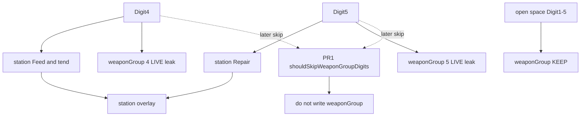

# RIMWARD CTL-04 remaining station-menu input scoping

| Field | Value |
|---|---|
| **Title** | RIMWARD CTL-04 remaining station-menu input scoping |
| **Author** | Wave 124 CTL-04 leftover integrator |
| **Date** | 2026-08-25 |
| **Status** | Wave 125 PR1 implemented. Digit1–5 skip `input.weaponGroup` while a dock menu or play surface owns those digits. |
| **Wave** | 125 — PR1 `src/systems/controls.js`. |
| **Owner request** | Inbox P1 CONTROLS leftover: Digit keys inside landing menus also fire the weapon-group binding. Wave 117 fixed only D/J. Menu input must not reach flight or weapon handlers. Census whether Digit1–5 still write `input.weaponGroup` while docked. If real, freeze a later serial that skips that write while dock menus and other play surfaces own digits. If already skipped, freeze CONSUME and name serial **none**. |
| **Merge law** | [`out/w124/menuinput/shared-contract.md`](../out/w124/menuinput/shared-contract.md). If this document and that file conflict, the contract wins. |
| **Honor** | HUD-01 empty hub. Aim-glass gauges stay off. Kit mutate omit. Digit 0 shipyard. Digit 8/9 stay **station** services. Digit 1–5 stay weapon groups **in flight**. CTL-01 KeyJ dock/jump; KeyD strafe only. CTL-02 `hailDigitsAllowed` is hail **resolution**, not WPN write — do not reopen overlay mutex. Wave 118 did **not** teach `controls.js` to skip Digit1–5 when docked. `hail.js` Digit overlap comment — cite. Hail-demand lifecycle out of scope. CTL-03 owns `save.js`. AI-05 owns `npc.js`. Later write-set **`src/systems/controls.js` only**. `state.js` READ-ONLY. No persist key. No new Digit. No bind-remap schema. `innerHTML` forbidden later. Do **not** edit the wishlist, `PROGRESS.md`, `docs/Ctl01DockBindDesign.md`, `docs/Ctl02OverlayDesign.md`, or `docs/OwnerDecisions*.md`. Do **not** write `docs/OwnerDecisionsWave124.md`. Do not steal pause-menu P2, Settings rebind, onboarding lesson. |

**Verifier record:**

| Note | Path |
|---|---|
| Inventory (code wins; Wave 124 census) | [`out/w124/menuinput/current-ctl04-menu-input-inventory.md`](../out/w124/menuinput/current-ctl04-menu-input-inventory.md) |
| Merge law | [`out/w124/menuinput/shared-contract.md`](../out/w124/menuinput/shared-contract.md) |
| Wave 124 security review | [`out/w124/menuinput/security-review.md`](../out/w124/menuinput/security-review.md) |
| Wave 124 design-doc review | [`out/w124/menuinput/code-review.md`](../out/w124/menuinput/code-review.md) |
| Wave 124 UI audit | [`out/w124/menuinput/ui-audit.md`](../out/w124/menuinput/ui-audit.md) |
| Wave 124 notes | [`out/w124/menuinput/notes.md`](../out/w124/menuinput/notes.md) |

Siblings CTL-01 / CTL-02 / CTL-03 / AI-05, wishlist, `PROGRESS.md`, `docs/Ctl01DockBindDesign.md`, `docs/Ctl02OverlayDesign.md`, and `docs/OwnerDecisions*.md` are **other workers**. **Do not edit** those paths. Do **not** write `src/`.

**This is not CTL-01 KeyJ.** **This is not CTL-02 overlay mutex.** **This is not hail-card design.** Wishlist station-menu Digit leak is **PLANNED** (Wave 124 brief). Census still finds **Digit1–5 → `weaponGroup` with no docked skip**.

---

## Overview

Inbox source (`docs/PLAYER-EXPERIENCE-WISHLIST.md` Idea inbox — **cite, do not edit**):

> INBOX (P1, CONTROLS): Scope keyboard input while station menus are open. Digit keys inside the landing menus also fire the weapon-group binding: pressing 5 for Repair set WPN to "5 · Psionic bolt"; pressing 4 for Feed & tend set WPN to "4 · —", an empty group that cannot fire. Wave 117 fixed only the D/J dock conflict. Menu input must not reach flight or weapon handlers.

Wave 124 this worker lands markdown only. Bindings do not change here.

Census (code wins): `controls.js` keydown `Digit1`–`Digit5` assign `input.weaponGroup` with **no** `flags.docked` test. `station.js` bubble listener maps those same digits to landing services (Digit4 Feed & tend, Digit5 Repair) and **does not** `stopPropagation`. Both window `keydown` handlers run. HUD `weaponHudLabel` paints `4 · —` and `5 · Psionic bolt`. Wave 118 `hailDigitsAllowed` skips hail **resolve** under pause/settings/title/models/chart/berth; it does **not** skip the WPN write. Digit1–5 **do not** already skip `input.weaponGroup` while docked. Leftover is **real**.

This leftover is a **skip of weapon-group digit writes** while a dock menu or other play surface owns those digits. It is not a bind remap. It is not a new Digit. It is not overlay stacking.

This document is the integrator for a **later** implementation wave.

HUD-01 empty aim glass stays empty. `state.js` stays READ-ONLY. No new persist key. Digit 0 stays shipyard. Digit 8/9 stay station. Digit 1–5 stay flight WPN. KeyJ stays dock. Do not invent UU. Do not steal Digit 0/8/9.

Wave 124 deputize (recorded here and in the contract; owner may override after playtest): while `ctx.flags.docked === true`, Digit1–5 **must not** set `input.weaponGroup`. Also skip when title owns the screen, models open, settings open, typing focus, hail card open, chart open, berth open, or `hailDigitsAllowed` is false (pause included). Do **not** skip in open space with no overlay. Do **not** add Digit6–9/0 to controls. Prefer skip in the existing keydown switch. Do **not** start `stopImmediatePropagation` wars.

If census had proved Digit1–5 already skip `weaponGroup` while docked menus are open, this pack would freeze **CONSUME** and name serial **none**. Census did not.

---

## Background & Motivation

### Current state (inventory)

Source of truth: [`out/w124/menuinput/current-ctl04-menu-input-inventory.md`](../out/w124/menuinput/current-ctl04-menu-input-inventory.md). Code wins.

| Surface | Today | Cite |
|---|---|---|
| Digit1–5 → WPN | unconditional assign | `controls.js` **329–344** |
| TRACKED | Digit1–5 only; no 6–9/0 | **45** |
| KeyJ skip | title / models / typing | **68–82**, **303** |
| Digit skip | **none** | Digit cases |
| `fireHeld` | skips `chartOpen` only | **476** |
| Station services | Digit 0–9 while `ui.open`; no stop | `station.js` **6156–6177** |
| Digit4 / 5 dock root | Feed & tend / Repair | **188**, **6034** |
| Digit 0 / 8 / 9 | shipyard / launch / epics | **188**, **6169–6177**, **6248–6250** |
| Listener order | station bubble **before** controls bubble | `main.js` **109**, **112** |
| Hail overlap | Digit1–3 also switch groups | `hail.js` **431–432** |
| `hailDigitsAllowed` | hail resolve gate | `overlay-policy.js` **175–185** |
| `playSurfaceBlocked` | title / models / typing | **83–91** |
| WPN rail | `g · name` / `4 · —` / `5 · —` | `hud.js` **255–273**, **926–927** |
| Combat docked | weapons cold | `combat.js` **1825–1828** |
| Input writer | `controls.js` only | `ctx.js` **15** |
| Title capture | Digit1–9 + stopImmediate | `title.js` **209–227** |
| Settings | KeyO / Escape only | `settings.js` **228–234** |

The player who docks and taps **5** for Repair also sets WPN to group 5. The player who taps **4** for Feed also sets group 4 (often empty `4 · —`). The player who answers a hail with Digit1 also changes cannon/disruptor/mining.

### Pain points

- Station chrome **looks** modal (z 20 scrim) but flight weapon handlers still hear Digit1–5.
- Empty group 4 after Feed is a **cannot fire** surprise after undock.
- Group 5 after Repair is a **psionic** surprise after undock.
- Hail Digit1–3 resolve **and** switch WPN (commented overlap, still live).
- Chart / berth / settings / pause / typing can change WPN behind a card.
- A naive later PR that remaps Digit1–5 off weapons **breaks flight**.
- A naive later PR that steals Digit 0/8/9 **breaks shipyard / launch / papers**.
- A naive later PR that `stopImmediatePropagation`s station digits **fights** hail/title/origins order.
- A naive later PR that edits `overlay-policy.js` / `save.js` **steals CTL-02 / CTL-03**.
- A naive later PR that `innerHTML`s WPN copy is XSS.
- Putting a new persist key or bind-remap schema impersonates the owner.

### Why now (design) / why not now (code)

The owner asked for the CTL-04 leftover integrator so later serials can scope Digit1–5 **before** the first skip. Inventory shows one unconditional assign, one station map that does not stop the event, hail resolve already gated, and combat already cold while docked. Merge law can exist without touching `src/`. Implementation waits so Digit theft, KeyJ steal, overlay mutex reopen, berth-hold steal, and bind UI are frozen before the first `if (docked) return`. Wave 124 this worker does not ship `src/`.

If census had proved Digit1–5 already skip while docked, this pack would freeze **CONSUME** and name serial **none**. Census did not.

---

## Goals & Non-Goals

### Goals

1. Document live Digit1–5 → `weaponGroup`, station Digit services, overlay helpers, hail overlap, WPN meter, and listener order from **live code**.
2. Freeze leftover = **skip WPN writes while a menu owns digits**. Not a remap. Not a new event.
3. Freeze deputize: docked **must** skip; title/models/settings/typing/hail/chart/berth/pause skip via live flags + `hailDigitsAllowed` / `playSurfaceBlocked`. Owner may override after playtest. Do not park.
4. Freeze open-space Digit1–5 as flight WPN.
5. Freeze Digit 0/8/9 as station-only. Controls does not grow Digit6–9/0.
6. Freeze later write-set: **`controls.js` only** (+ named boot pins).
7. Freeze persist: **none** new. `state.js` READ-ONLY. No UU. No SKU. No new Digit.
8. Freeze HUD-01 empty hub. Aim-glass gauges off. KeyJ / KeyD stay.
9. Freeze later copy via `textContent`. `innerHTML` forbidden. No “not available”.
10. Freeze a serial PR plan. This wave writes the document. A later wave ships serially.

### Non-goals (locked — do not reopen)

- No `src/` or live bindings in this worker.
- No Digit remap. No Settings rebind UI. No onboarding lesson.
- No overlay mutex rewrite. No hail-card design. No hail-demand lifecycle.
- No CTL-03 `save.js` / berth hold. No `npc.js`. No `overlay-policy.js` write.
- No KeyJ / KeyD remap. No KeyT/V/K/X remap.
- No HUD-02 combat rails. No HUD-01 hub child. No new Digit.
- No `state.js` write. No WORLD_FIELDS. No `fireHeld` stuffed into PR1.
- Do not edit the wishlist, `PROGRESS.md`, `docs/Ctl01DockBindDesign.md`, `docs/Ctl02OverlayDesign.md`, Bio*, Msn*, Rep*, Tgt*, OwnerDecisions*.
- Do not write `docs/OwnerDecisionsWave124.md`.
- Do not steal pause-menu P2.

---

## Proposed Design

### 1. Merge resolutions (contract wins)

| Question | Integrator freeze | Why |
|---|---|---|
| Leftover real? | **Yes** — Digit1–5 write WPN while docked | Inventory §1, §2 |
| CONSUME? | **No**. Serial is **not** none | Census |
| First serial | **PR1 station-menu Digit skip** | Named only |
| New persist key? | **No** | Contract §0.8 |
| `state.js` write? | **No** | Contract §0.8 |
| Digit 0/8/9 steal? | **No** | Contract §0.2 |
| Digit1–5 in flight? | **Stay WPN** | Inbox + HUD |
| KeyJ / KeyD? | **No remap** | CTL-01 landed |
| Overlay mutex reopen? | **No** | CTL-02 |
| `hailDigitsAllowed` role? | **Read** for skip; hail resolve stays hail | Contract §0.4 |
| `stopImmediatePropagation`? | **Not default** | Inventory §6 |
| Later write-set | **`controls.js` only** | Contract §0.7 |
| `fireHeld` docked | **PR2 optional** | Not Digit switch |
| `innerHTML`? | **No** | XSS |
| `reducedMotion`? | n/a | No new motion |

### 2. Current leak (do not keep)

**Today (every Digit1–5 tap while the station overlay is open)**

1. Station bubble keydown (`ui.open`): maps Digit4 → Feed, Digit5 → Repair, etc.
2. Station does **not** stop the event.
3. Controls bubble keydown (`TRACKED`): `input.weaponGroup = n`.
4. HUD WPN rail paints the new group (`5 · Psionic bolt` or `4 · —`).
5. Combat is cold while docked, so the player may not notice until undock.

**This serial must not change** WASD, KeyJ dock, KeyD strafe, Digit 0/8/9 station map, Digit1–5 **in open space**, hail card intents, overlay mutex, `hailDigitsAllowed` semantics for hail, HUD-01 hub.

### 3. Deputize table (copy of contract §0.1)

Owner may override after playtest. Do not park.

| Knob | Value |
|---|---|
| Docked Digit1–5 | **must not** set `weaponGroup` |
| Open space Digit1–5 | **must** set `weaponGroup` |
| Hail open | skip WPN write; hail resolve unchanged |
| Title / models / settings / typing / chart / berth / pause | skip WPN write |
| Digit 0/8/9 | station.js only |
| Digit6–9 in controls | **do not add** |
| Listener fix | skip in controls switch, **not** stopImmediate |
| Fail-closed | missing flags = not-docked; never throw |
| Persist | none new |
| `reducedMotion` | n/a |
| Copy | no new chrome; no “not available” |
| Home | `controls.js` |

Tradeoff (must surface): the player **cannot** change WPN while docked. That is the point. Outfitting still uses Digit **8/9** papers, not weapon-group 1–5.

Hail Digit1–3 would still change WPN **today** even if hail resolves a demand. Scoping hail+controls together is good. Do not design hail cards.

### 4. Neighbours

| Module | This leftover does | This leftover does not |
|---|---|---|
| `controls.js` | later PR1: skip Digit1–5 → `weaponGroup` | remap keys; Digit6–9/0; KeyJ |
| `overlay-policy.js` | **read** `hailDigitsAllowed` / `playSurfaceBlocked` | write; new exports unless census forces |
| `station.js` | **cite** Digit map | edit; stopImmediate |
| `hail.js` | **cite** overlap comment | hail cards; demand lifecycle |
| `hud.js` | **cite** WPN label | combat rails; hub; write-set |
| `save.js` | **cite** `berthOpen` flag | CTL-03 hold |
| `npc.js` | none | AI-05 |
| `state.js` | none | write |
| `boot-test.mjs` | later docked Digit vs group pins **named** | known FAIL fixes |
| Title / settings / models | skip via helpers / flags | steal capture |

### 5. Serial PR plan

Matches contract §3. **Named only. Do not implement in Wave 124.**

| PR | Lands | Does not land |
|---|---|---|
| **PR1 station-menu Digit skip** | Digit1–5 skip while docked / hailOpen / `hailDigitsAllowed === false` / playSurface / typing / title / models; read overlay helpers; named boot pins | `state.js`; persist; overlay-policy write; `save.js`; `hail.js`; `station.js`; `npc.js`; KeyJ; Digit 0/8/9; `fireHeld`; `stopImmediatePropagation`; `innerHTML` |
| **PR2 fireHeld while docked (optional)** | `update()` `docked !== true` on `fireHeld` | Digit switch; combat (already cold) |
| **PR3 census (optional skip)** | Re-grep: Digit1–5 assign only behind skip | New world field |

First remaining serial is **PR1**. It must not steal Digit 0/8/9. It must not write `state.js`. Do not land overlay policy as required PR1.

### 6. Picture

Reuse live station overlay and live WPN rail. **No new chrome** in PR1. Station legend still `1-9, 0`. Flight help still `1/2/3/4/5` weapon group. After PR1, tapping Repair does **not** rewrite the WPN value.

No hub pip. Digit 0 stays shipyard. KeyJ stays dock.

---

## Player outcome (later serial; freeze here)

Dock. Open the landing list. Tap **5**. Repair service opens. WPN rail **does not** change.

Tap **4**. Feed & tend opens. WPN does **not** become `4 · —`.

Undock into open space. Tap **1–5**. WPN still cycles cannon / disruptor / mining / missiles / psionic.

Dock. Open outfitting. Digit **8/9** still arm papers. Digit **0** still shipyard from the root list.

Hail card open. Digit1 still resolves the first intent **when `hailDigitsAllowed`**. WPN does **not** also switch.

Chart or berth or settings or pause or a focused text field: Digit1–5 do **not** rewrite WPN.

`reducedMotion` is unchanged.

**CTL-01 KeyJ** is **not** this work. **CTL-02 mutex** is **not** this work.

---

## Security

See [`out/w124/menuinput/security-review.md`](../out/w124/menuinput/security-review.md).

- Skip uses authored `e.code` literals and `=== true` flag reads. Hostile saves cannot remap keys (no persist schema).
- Typing / title / models must skip so a focused filter cannot change WPN.
- XSS: no `innerHTML` for WPN or help.
- Proto: no dataset merge.
- Fail-closed never freeze the sim. Missing flags = not-docked.
- Do not `stopImmediatePropagation` from station (title/models capture already use it; bubble wars are a bug farm).

---

## Acceptance direction (implementation wave)

1. `controls.js`: `case 'Digit1'`–`'Digit5'` assign `weaponGroup` **only when** `shouldSkipWeaponGroupDigits(ctx)` is false.
2. Skip **must** include `flags.docked === true`.
3. Skip **must** include `flags.hailOpen === true` and `hailDigitsAllowed(ctx) === false` (or equivalent live flag reads if the helper throws).
4. Open space with no overlay: Digit1–5 still set WPN.
5. Digit 0/8/9: controls still does not handle them. Station still does.
6. KeyJ / KeyD unchanged. TRACKED still Digit1–5 only.
7. No new persist key. `state.js` untouched. No `innerHTML`.
8. Boot: add pins that dock, snapshot `weaponGroup`, `dispatchKey('Digit5')` / `'Digit4'`, assert group unchanged **and** station service still selected. Open-space Digit1 still sets group 1. Do not invert Digit0 shipyard pins.
9. WPN meter must not silently change while docked. No “not available” string.
10. Known boot FAILs untouched except the new docked-Digit pins.

---

## Alternatives considered

| Alternative | Why not |
|---|---|
| Freeze CONSUME / serial none | Census: Digit1–5 still write WPN while docked |
| Station `stopImmediatePropagation` | Fragile vs hail/title/origins; inventory does not prove it is the only fix |
| Remap station Digit4/5 off 1–5 | Breaks painted `4 — Feed & tend` / `5 — Repair` |
| Remap flight WPN off 1–5 | Breaks combat muscle memory; inbox asked **scope** |
| Steal Digit 0/8/9 | HUD-01 / outfitting papers |
| Add Digit6–9 to controls | Controls does not handle them; station does |
| Pause the sim harder under station | Station already owns the screen; combat already cold; not the inbox |
| Edit overlay-policy / hail.js | Write-set is controls.js; mutex already landed |
| Bind-remap settings UI | P2 inbox; persist schema |
| Stuff fireHeld into PR1 | Not the Digit switch; combat already cold; PR2 |

---

## Regression risks

| Risk | Mitigation |
|---|---|
| Flight WPN 1–5 die in open space | Skip only `=== true` surfaces; pin open-space Digit |
| Digit0 shipyard / 8/9 papers | Do not add those codes to controls; station unchanged |
| Hail Digit no longer resolves | Do **not** stop the event; only skip WPN write |
| Title Digit1–n entries | Title capture already stops; skip is extra |
| Origins Digit1–5 pick | Origins listener stays; pause skip only blocks WPN |
| Boot repair `dispatchKey('Digit5')` | Station still consumes; new pin asserts group unchanged |
| Overlay mutex reopen | Read helpers only |
| CTL-03 `save.js` steal | Cite `berthOpen`; do not write save.js |
| `innerHTML` | contract §0.9 |
| Missing flags throw | try/catch; `=== true` only |
| LMB fire after undock | PR2 optional; not PR1 |

---

## Ownership

Later PR1: `src/systems/controls.js` (+ named `scripts/boot-test.mjs` pins).  
This wave: markdown paths listed in the verifier record only.

---

## Verification (this wave)

Domain: **data**. Inventory vs `controls.js` / `station.js` / `overlay-policy.js` / `hail.js` / `hud.js`. Leftover REAL. No `src/`. Later write-set `controls.js` only. Digit 0/8/9 stay station. Contract wins.

Do **not** run `npm run test:boot`. Do **not** start Vite or Chrome. Do **not** create `out/w124/menuinput/verify/**`.
