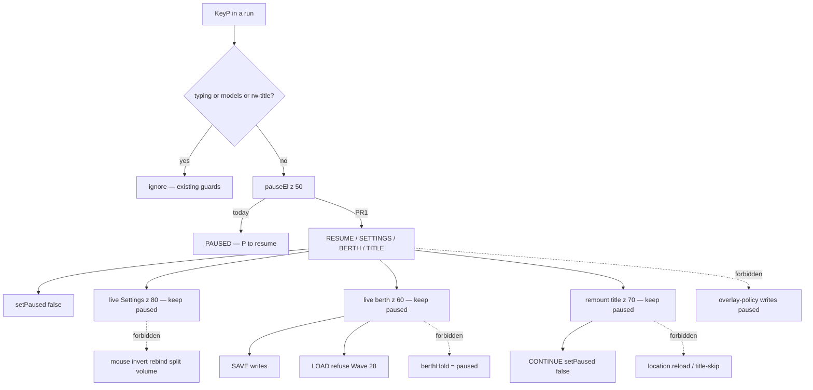

# RIMWARD CTL-05 remaining pause menu

| Field | Value |
|---|---|
| **Title** | RIMWARD CTL-05 remaining pause menu |
| **Author** | Wave 141 CTL-05 leftover integrator |
| **Date** | 2026-08-27 |
| **Status** | Wave 141 leftover census + brief. No `src/`. KeyP stays pause. KeyH/J/L/M stay. KeyD strafe. Digit 0/8/9 stay. |
| **Wave** | 141 — leftover census + brief. Banner is copy-only. Leftover **REAL**. Named serial **PR1**. |
| **Owner request** | Inbox P2 CONTROLS/SETTINGS leftover: Add a real pause menu. P shows only "PAUSED — P to resume"; there is no path to Settings, save, or the title screen from inside a run. Census live `main.js` pause listener and `pauseEl`. Code wins. If pause already offers Settings, save, and title from inside a run, freeze leftover **CONSUME** and named serial **none**. Name: **no remaining Ctl05 leftover.** Census: banner is copy-only. Freeze leftover **REAL** and name later serial **PR1**. Deputize: ACCESS to existing Settings / berth / title / resume. Do **not** steal Settings expansion (mouse sensitivity, invert, rebinding, split volume). |
| **Merge law** | [`out/w141/pause/shared-contract.md`](../out/w141/pause/shared-contract.md). If this document and that file conflict, **the contract wins**. |
| **Honor** | HUD-01 empty 80 px hub. Aim-glass gauges stay off. Kit mutate omit. Digit 0/8/9 stay. No new Digit. KeyP pause, KeyH hail, KeyJ dock/jump, KeyL berth, KeyM chart stay. KeyD strafe. Do not remap. CTL-02 never writes `flags.paused`. Pause already writes `flags.paused` in `main.js`. Later keep one in-run display owner for that flag. CTL-03 `berthHold` is session hold, not pause — do not merge. LOAD while paused stays gated (Wave 28). SAVE while paused still writes. Title z 70, settings z 80, pause z 50. Opening Settings from pause must not break title-first capture-phase keys. `innerHTML` forbidden later. Menu labels `textContent`. Color is not the only cue. `reducedMotion`: no new animation that ignores it. Fail closed: never throw from pause paint; unknown action skip; do not unpause into a title-filter KeyP. `state.js` READ-ONLY. Default persist **none**. Do not teleport. Do not grant credits. This is not Onb01. This is not Org01. This is not CTL-04 `fireHeld`. This is not pad 2B. Do not steal Hail01 / HUD-06 / Hail02 / HUD-07 / NAV-09 / NAV-10 governor / TGT-07 stills / MSN-04 other families / CTL-03 / AI-05 / CTL-04. Pad 2B still owner lock. No in-repo LLM. NAV-11 serial none. Do not steal sibling Wave 141 packs. Do not edit the wishlist or `PROGRESS.md`. |

**Verifier record:**

| Note | Path |
|---|---|
| Inventory (code wins; Wave 141 census) | [`out/w141/pause/current-ctl05-pause-menu-inventory.md`](../out/w141/pause/current-ctl05-pause-menu-inventory.md) |
| Merge law | [`out/w141/pause/shared-contract.md`](../out/w141/pause/shared-contract.md) |
| Wave 141 security review | [`out/w141/pause/security-review.md`](../out/w141/pause/security-review.md) |
| Wave 141 design-doc review | [`out/w141/pause/code-review.md`](../out/w141/pause/code-review.md) |
| Wave 141 UI audit | [`out/w141/pause/ui-audit.md`](../out/w141/pause/ui-audit.md) |
| Wave 141 notes | [`out/w141/pause/notes.md`](../out/w141/pause/notes.md) |

Siblings Onb01 flight lesson, Org01 origin preview, Settings expansion inbox, CTL-02/03/04, wishlist, and `PROGRESS.md` are **other workers**. **Do not edit** those paths. **Do not** steal sibling Wave 141 paths. **Do not** write `out/w141/pause/verify/**`.

**This is not Settings expansion.** **This is not Onb01.** **This is not Org01.** **This is not CTL-03 berthHold.** **This is not CTL-04 `fireHeld`.** **This is not pad 2B.** Wishlist pause menu is **INBOX**. Census still finds **copy-only banner**.

---

## Overview

Inbox source (`docs/PLAYER-EXPERIENCE-WISHLIST.md` Playtest capture 2026-08-25 second pass — **217–220** — **cite, do not edit**):

> INBOX (P2, CONTROLS/SETTINGS): Add a real pause menu. P shows only "PAUSED — P to resume"; there is no path to Settings, save, or the title screen from inside a run — Settings exist only on the title menu. The captured Settings item covers new options, not in-game access.

Wave 141 this worker lands markdown only. Bindings do not change here.

Census (code wins): `pauseEl.textContent = 'PAUSED — P to resume'` (`main.js` **172**). z-index **50**. KeyP toggle with typing / models / `#rw-title` guards (**174–187**). Overlay-policy **never** writes `flags.paused` (**4**); hail Digit skip under pause WAVE118 (`hailDigitsAllowed` **177**). Title capture z **70**; SETTINGS is a title button plus global KeyO (`settings.js` **228–234**, z **80**). KeyL berth open refuses pause (`save.js` **1625**). `berthHold` is **not** pause. Title `closeTitle` removes `#rw-title` (**251–256**). Leftover is **REAL**.

KeyO **does** open Settings in a run. That is **not** a pause-menu path. The Settings **expansion** inbox (**131–135**) covers new knobs, not in-game access. This pack must **not** steal it.

This leftover is a **named access pack**: pause becomes a menu that opens **existing** Settings, **existing** Berth Records, and **existing** title, plus resume. It is not a new Digit. It is not a Settings rewrite.

This document is the integrator for a **later** implementation wave.

HUD-01 empty aim glass stays empty. `state.js` stays READ-ONLY. No new persist key. Digit 0/8/9 stay. KeyH/J/L/M/P stay. Do not invent UU. Do not steal Onb01 / Org01 / CTL-04.

Wave 141 deputize (recorded here and in the contract; owner may override after playtest): pause menu is **ACCESS**. RESUME = KeyP resume. SETTINGS = live KeyO panel; keep paused. BERTH = live desk while still paused; LOAD gated; SAVE writes; do not merge `berthHold`. TITLE = remount without reload or skip marker; hide banner while title owns; CONTINUE syncs `pauseEl`. Fail-closed skip. Overlay-policy never writes pause.

If census had proved Settings, save, **and** title already offered from the in-run pause surface, this pack would freeze **CONSUME** and name serial **none**. Census did not. That CONSUME path is unexpected.

---

## Background & Motivation

### Current state (inventory)

Source of truth: [`out/w141/pause/current-ctl05-pause-menu-inventory.md`](../out/w141/pause/current-ctl05-pause-menu-inventory.md). Code wins.

| Surface | Today | Cite |
|---|---|---|
| Banner copy | `PAUSED — P to resume` | `main.js` **172** |
| Pause z | 50 | **171** |
| Menu actions | **absent** | **169–187** |
| KeyP guards | typing / models / `#rw-title` | **177–184** |
| Loop skip | only `flags.paused` | **156–161** |
| Overlay pause write | **never** | `overlay-policy.js` **4** |
| Digit skip | `hailDigitsAllowed` false when paused | **177** |
| Settings KeyO | global; z 80; no expansion knobs | `settings.js` **29–38**, **93**, **228–234** |
| Title | z 70; capture; close removes root | `title.js` **145–256**; `screens.css` **512** |
| Berth KeyL open | `!paused` | `save.js` **1625** |
| LOAD paused | refuse | **1502** |
| SAVE paused | writes | **1643** |
| `berthHold` | not pause | **1433–1440**; policy **196–203** |

The player who taps P in a run sees a sentence. They cannot reach Settings from that banner. They cannot open Berth. They cannot return to title without a reboot.

### Pain points

- Copy-only pause hides every existing overlay behind “P to resume”.
- KeyO in-run is undocumented on the pause surface. Playtest reads as title-only Settings.
- KeyL cannot open berth while paused, so save is unreachable from the freeze the player just entered.
- Title is destroyed on CONTINUE. No remount.
- A naive later PR that **unpauses** to open berth drops the player into live combat and can LOAD while the loop is still racing (Wave 28).
- A naive later PR that **reloads** for title wipes the run or misuses `rimward-title-skip`.
- A naive later PR that writes `flags.paused` from overlay-policy **steals** CTL-02.
- A naive later PR that sets `berthHold = paused` **steals** CTL-03.
- A naive later PR that adds mouse invert / rebind / split volume **steals** inbox **131–135**.
- A naive later PR that `innerHTML`s slot names or system ids is XSS.
- A naive later PR that remaps P, or that unpauses into the models filter INPUT, repeats a known traffic spawn bug.
- Putting a new Digit or hub pip impersonates the owner.

### Why now (design) / why not now (code)

The owner asked for the CTL-05 leftover integrator so a later serial can grow `pauseEl` into access **before** the first extra Settings field or a pause/berth merge. Inventory shows copy-only banner, LOAD gate, CTL-02 never-write, and a one-way title close. Merge law can exist without touching `src/`. Implementation waits so expansion theft, reload-to-title, overlay pause write, and KeyP remap are frozen before the first button. Wave 141 this worker does not ship `src/`.

If census had proved pause already offered Settings, save, and title, this pack would freeze **CONSUME** and name serial **none**. Census did not.

---

## Goals & Non-Goals

### Goals

1. Document live pause banner, KeyP guards, overlay digit skip, title capture, Settings KeyO, berth LOAD/SAVE vs pause, and the z ladder from **live code**.
2. Freeze leftover = **pause-menu access**. Not Settings expansion. Not berthHold. Not a lesson.
3. Freeze deputize: RESUME / SETTINGS / BERTH / TITLE on `pauseEl`. Owner may override after playtest. Do not park.
4. Freeze persist: **none** new. `state.js` READ-ONLY. No UU. No SKU. No new Digit.
5. Freeze HUD-01 empty hub. Digit 0/8/9 stay. KeyH/J/L/M/P stay. KeyD stays strafe.
6. Freeze later copy via `textContent`. `innerHTML` forbidden. Color is not the only cue.
7. Freeze a serial PR plan. This wave writes the document. A later wave ships serially.

### Non-goals (locked — do not reopen)

- No `src/` or live bindings in this worker.
- No Settings expansion knobs (mouse sensitivity, invert, rebind, split volume).
- No overlay-policy `flags.paused` write.
- No merge of `berthHold` and pause.
- No LOAD while paused.
- No title-skip / reload as the title path.
- No Onb01 flight lesson. No Org01 origin preview. No CTL-04 `fireHeld`. No pad 2B.
- No HUD layout. No new Digit.
- Do not edit the wishlist, `PROGRESS.md`, OwnerDecisions*, Ctl02/Ctl03/Ctl04 design docs.
- Do not write `out/w141/pause/verify/**`.
- Do not write sibling Wave 141 Onb01 / Org01 paths.
- Do not steal optional PR2s, Agent pad 2B, or in-repo LLM.
- Do not start Vite or Chrome.
- Do not call `graph_propose` / `graph_approve`.

---

## Proposed Design

### 1. Merge resolutions (contract wins)

| Question | Integrator freeze | Why |
|---|---|---|
| Leftover real? | **Yes** | Inventory §1, §10 |
| CONSUME? | **No**. Serial is **not** none | Banner copy-only; no save/title path |
| New persist key? | **No** | Contract §0.5 |
| `state.js` write? | **No** | Honor |
| Overlay-policy writes pause? | **No** | CTL-02 |
| Merge `berthHold`? | **No** | CTL-03 |
| Settings expansion? | **No** | Inbox **131–135** |
| Title path | remount, no reload, no skip | World wipe / skip steal |
| Named PR1? | **PR1** pause menu access | REAL leftover |

### 2. Current pause motion (do not break Wave 28 / CTL-02 / title capture)

KeyP stays the only full-loop skip. Overlay-policy still never writes pause. Title capture still owns keys while `#rw-title` is a body child (KeyO/Escape pass). Models filter typing still swallows KeyP. LOAD still refuses `flags.paused`. SAVE still writes.

### 3. Deputize table (copy of contract §0.1)

Owner may override after playtest. Do not park.

| Knob | Value |
|---|---|
| Leftover | **REAL** |
| Serial | **PR1** |
| Menu | ACCESS: RESUME / SETTINGS / BERTH RECORDS / TITLE |
| Pause z | **50** |
| Title z | **70** |
| Settings z | **80** |
| KeyP | pause; guards stay |
| Settings knobs | live FIELDS only |
| Berth from pause | open while paused; LOAD gated; SAVE writes |
| `berthHold` | not pause |
| Title from pause | remount; no reload; no skip |
| Overlay-policy | never write `paused` |
| Click-through | `pauseEl` pointer-events none while settings/berth/title cover |
| Persist | none new |
| Fail-closed | never throw; unknown skip |

### 4. Neighbours

| Module | This leftover does | This leftover does not |
|---|---|---|
| `main.js` | later PR1: `pauseEl` menu; `setPaused`; KeyP guards kept | remap P; per-frame paint; `innerHTML` |
| `title.js` | later PR1: reopen from pause; CONTINUE hides banner | skip marker; Org01 preview; capture rewrite |
| `save.js` | later PR1: open berth from pause menu; LOAD named-disabled | WORLD_FIELDS; merge hold; LOAD while paused |
| `settings.js` | optional `setOpen` export | new FIELDS; expansion inbox |
| `overlay-policy.js` | cite digit skip / mutex | pause write |
| `controls.js` | none | CTL-04 `fireHeld` |
| `onboarding.js` | none | Onb01 |
| `origins.js` | none | Org01 |
| `state.js` | none | write |
| HUD | none | hub child |

### 5. Serial PR plan

Matches contract §3. **Named only. Do not implement in Wave 141.**

| PR | Lands | Does not land |
|---|---|---|
| **PR1** pause menu access | menu on `pauseEl`; four access actions; `setPaused`; `textContent`; guards; LOAD gate; z ladder; pointer-events none while covered | expansion knobs; remap; hold merge; overlay pause write; `innerHTML`; Digit; persist; teleport; credits; Onb01; Org01; `fireHeld`; pad 2B |
| **PR2 stills (optional skip)** | playtest stills of the four paths | required with PR1 |
| **PR3** | **none here** — Settings expansion is the other inbox | this pack |

First remaining serial is **PR1**. It must not steal Digit 0/8/9. It must not write `state.js`. It must not claim expansion Settings. It must not claim Onb01 / Org01.

### 6. Picture

Reuse live Settings dialog, live Berth Records desk, live title overlay. Pause stays a z-50 scrim with named buttons. Player taps P. They see RESUME, SETTINGS, BERTH RECORDS, TITLE. Settings opens on top. Berth opens on top with SAVE live and LOAD named-disabled until resume. Title remounts over the run without wiping it. P still resumes. The sim stays frozen until resume or CONTINUE.

---

## Player outcome (later serial; freeze here)

Fly. Tap P. The banner is a **menu**, not only a sentence.

Tap RESUME or P. The sim runs. The banner hides.

Tap SETTINGS. The live Settings panel opens at z 80. Accessibility toggles and master volume still apply immediately. No new invert/rebind/split-volume rows. Clicks on the dim ring do **not** resume. P still resumes. O or ESC still closes Settings. Title capture is not in this path.

Tap BERTH RECORDS. The live desk opens at z 60. The sim stays paused (full-loop skip). SAVE still writes. LOAD stays refused and the LOAD control says so in **text**. This is not Pause merging into `berthHold`. Close L / ESC. Pause menu remains until P.

Tap TITLE. The live title remounts at z 70. Capture swallows play keys except KeyO/Escape. CONTINUE unpauses **and** hides the pause banner. NEW GAME keeps its live confirm/reload. The skip marker is **not** set by this path.

`reducedMotion` is unchanged (no new motion).

**Settings expansion** is **not** this work. **Onb01** is **not** this work. **Org01** is **not** this work. **CTL-03 hold math** is **not** this work. **CTL-04 `fireHeld`** is **not** this work.

---

## Security

See [`out/w141/pause/security-review.md`](../out/w141/pause/security-review.md).

- XSS: no `innerHTML` for pause labels / berth meta. `textContent` only.
- KeyP while typing: existing INPUT/TEXTAREA/SELECT/contentEditable + models + `#rw-title` guards stay.
- Title-skip / sessionStorage: TITLE must not set `rimward-title-skip`. That marker is NEW GAME reload only.
- LOAD-while-paused: refuse stays. Do not unpause to “make LOAD work”.
- Overlay mutex: berth-from-pause still `canOpenPlayCard`. Overlay-policy never writes `paused`.
- Click-through: `pauseEl` pointer-events none while settings/berth/title cover. Dim-ring must not RESUME.
- Persist mute: no new key. Do not persist pause.

---

## Acceptance direction (implementation wave)

1. In-run P shows named RESUME, SETTINGS, BERTH RECORDS, TITLE. Copy is not only `PAUSED — P to resume`.
2. SETTINGS opens the live z 80 panel. Live FIELDS only. Title capture KeyO/Escape still pass when title is open.
3. BERTH opens while `flags.paused` stays true. SAVE writes. LOAD refuses. LOAD control is named-disabled.
4. TITLE remounts without reload and without skip. CONTINUE hides `pauseEl` and clears pause.
5. KeyP still pause. Typing / models / title guards still ignore P.
6. Overlay-policy still never writes `flags.paused`. Digit skip under pause still true.
7. `berthHold` still not pause. KeyH/J/L/M/D stay. Digit 0/8/9 stay.
8. No new `WORLD_FIELDS`. No `innerHTML`. No expansion knobs. No Onb01/Org01/`fireHeld`/pad 2B.
9. Known boot FAILs untouched.

---

## Alternatives considered

| Alternative | Why not |
|---|---|
| Freeze CONSUME / serial none | Census: banner copy-only; no save/title from pause |
| Treat live KeyO as the Settings path | Inbox asked a pause **menu**; KeyO is not that menu |
| Unpause then open berth | Combat + Wave 28 LOAD hazard |
| Reload to show title | Wipes the run or misuses skip |
| Set `paused` from overlay-policy | CTL-02 collision |
| `berthHold = paused` | CTL-03 collision |
| Add invert / rebind / split volume | Other inbox **131–135** |
| New Digit for menu rows | Digit map / HUD-01 |
| `innerHTML` labels | XSS |
| Raise pause z over settings/title | Breaks wave 40 ladder and capture |

---

## Regression risks

| Risk | Mitigation |
|---|---|
| LOAD desync | Keep paused refuse; named-disable LOAD |
| Overlay-policy pause write | **Forbidden** |
| Title-skip skip | TITLE path must not set the marker |
| Banner left up after CONTINUE | `setPaused` owns flag + display |
| KeyP in models filter | existing guards stay |
| Settings expansion steal | FIELDS frozen |
| BerthHold merge | open berth may hold; flag stays distinct |
| Title capture broken | reopen uses the same capture; KeyO/Escape pass |
| Digit 0/8/9 | no new Digit |
| Sibling Onb01/Org01 | write-set forbids |

---

## Ownership

| Object | Writer | Reader |
|---|---|---|
| `flags.paused` in-run | later PR1 `main.js` `setPaused` | loop; LOAD; hail digits |
| `pauseEl` | later PR1 `main.js` | player |
| Title remount | later PR1 `title.js` | capture; CONTINUE |
| Berth open-from-pause | later PR1 `save.js` | KeyL still L |
| Settings open | live KeyO / optional export | player |
| `flags.paused` from overlay-policy | **none** | hail digits |
| `berthHold` | **none new** (CTL-03 live) | hold readers |
| Settings FIELDS | **none** (expansion inbox) | — |
| `state.js` | **none** | — |
| Digit / station | **none** | — |

---

## Open owner questions

**Deputized this wave** (contract §0.1). Owner may override after playtest. Do not park.

1. Smallest additive = pause **menu access** to existing Settings, berth, title, resume. Do not invent knobs.
2. Stay paused when opening Settings or berth. LOAD stays gated.
3. Title remount without reload. Do not set skip.
4. No new persist key.
5. Home: `main.js` + title reopen + berth open-from-pause. Not `controls.js`. Not `state.js`. Not overlay-policy pause write.
6. Optional PR2 stills are skippable after playtest.
7. Leftover is **real**. Not CONSUME. Serial is **PR1**, not none.
