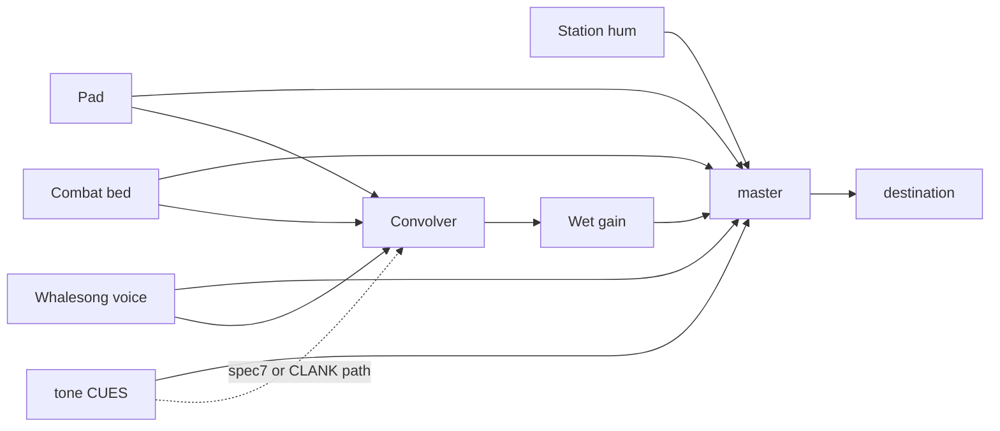
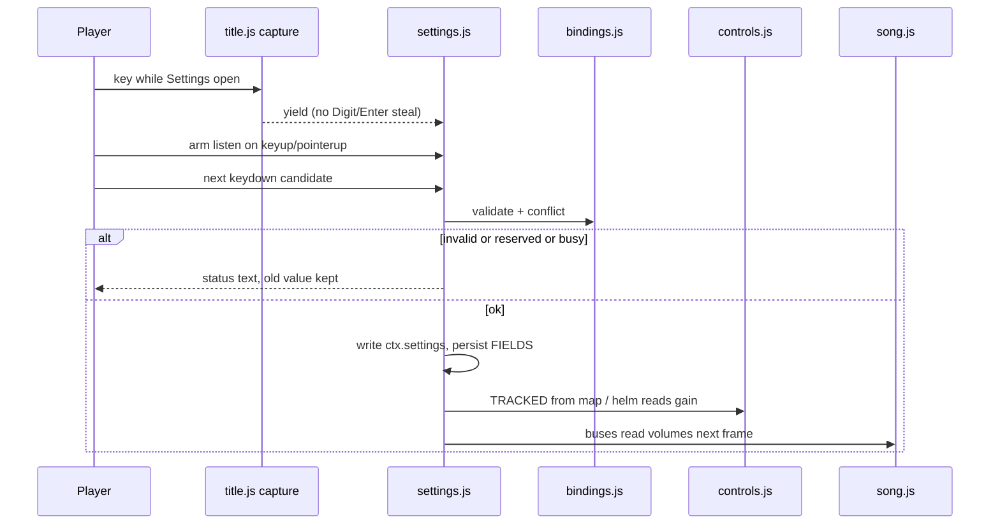

# RIMWARD RW-002 expanded Settings and rebinding

| Field | Value |
|---|---|
| **Title** | RIMWARD RW-002 expanded Settings and rebinding |
| **Issue** | [RW-002 / GitHub #3](https://github.com/barryrwilson/Rimward/issues/3) |
| **Author** | RW-002 design (issue #3) |
| **Date** | 2026-08-27 |
| **Revised** | 2026-08-28 (design-review pass 3) |
| **Status** | **Accepted.** Owner accepted the deputized laws as written on 2026-08-28. |
| **Accepted** | 2026-08-28 (owner) |
| **Wave** | Design-only. Later serials land code. |
| **Owner request** | Expand Settings with flight-comfort controls and independent audio control: mouse sensitivity, invert X/Y, complete key rebinding with conflict detection, and separate music / effects / voice / UI volume. |
| **Honor** | HUD-01 empty hub. Aim-glass gauges stay off. Kit mutate omit. Digit 0 shipyard. Digit 8/9 stay station services. Digit 1–5 stay flight WPN **unless the player rebinds those existing WPN commands**. While station or hail owns the screen, Digit0–9 / `KeyB` / `KeyY` never enter `pressed` or edge pulses. KeyJ dock/jump. KeyD strafe-right default. CTL-02 never writes `flags.paused`. CTL-03 `berthHold` is not pause. CTL-04 Digit skip while menus own digits stays. CTL-05 pause menu is ACCESS to live Settings; it must not invent knobs. `state.js` READ-ONLY. New persisted Settings fields are in scope if JSON-safe and migrated. Frozen event vocabulary: **no new `ctx.emit` types**. `innerHTML` forbidden. Labels `textContent`. Color is not the only cue. `reducedMotion`: no new animation that ignores it. Fail closed: never throw from Settings paint, bind capture, or audio bus math. No in-repo LLM. Do not steal RW-003 Models, OPT-004 `fireHeld`, Onb01 lesson rewrite, or pad approach. |

**This stamp does not ship `src/`.** Design accepted 2026-08-28. Serials may start after this stamp.

**This is not a HUD redesign.** **This is not new gameplay commands.** **This is not CTL-05 pause access.** **This is not OPT-004 `fireHeld`.** Census of live code wins over the issue’s “HUD scale” phrasing.

---

## Issue acceptance (GitHub #3)

The issue body is the outcome source. Wishlist **135–139** and remaining-work RW-002 match it. This brief enables every criterion:

| Criterion | Where this brief closes it |
|---|---|
| Inventory of live bindings, input paths, persisted settings, and audio channels | Background census |
| Ranges/defaults, invert semantics, rebind conflict, keyboard-only, reset/migration | §2–§6, §9 |
| Music/effects/voice/UI routing without regressing mute | §2, §8 |
| Bounded verifiable slices with live browser flows | Implementation slices, Live browser, PR Plan |
| No implementation until the design is accepted | Status line; this task writes docs only |

Live census: there is **no** HUD-scale slider. Do not add one.

---

## Overview

Playtest inbox (`docs/PLAYER-EXPERIENCE-WISHLIST.md` **135–139**) asks for flight-comfort knobs and split audio on the existing Settings surface. Live Settings already persist accessibility toggles, hints, text size, mute, and one master volume under `rimward-settings-v1`. Aiming is a fixed reticle offset. Every synth path dumps into one `GainNode`, with extra dry/wet taps into a convolver. Bindings are authored `KeyboardEvent.code` literals in `controls.js` plus sibling listeners in `main.js`, `gate.js`, `galaxychart.js`, `save.js`, `settings.js`, and `title.js`.

The smallest compatible expansion is:

1. Keep `settings.js` as the only writer of `ctx.settings`.
2. Add JSON-safe client fields (not `WORLD_FIELDS`) for mouse gain, invert X/Y, four audio buses, and a complete map of **existing** commands.
3. Route those fields through the live mouse math in `controls.js` and a bus-then-split graph in `song.js`.
4. Teach overlay listeners to read the same map, and stop opening Settings by synthesizing `KeyO`.
5. Make Settings a real modal: title/origins yield keys; the Settings root eats pointer hits.

Numeric flight/audio defaults match today’s feel. Opening in-run Settings **does** start a flight-input mutex (see §6 and Key Decision 8). Missing or corrupt storage falls back per field. Mute still zeros the master. Digit 0/8/9 stay station-only and are not assignable.

---

## Background & Motivation

### Current evidence (code wins)

Issue #3 says the game already has HUD scale, contrast, color-blind, reduced-motion, mute, and text-size foundations. Live census:

| Claim | Live | Cite |
|---|---|---|
| HUD scale slider | **Absent.** Text size is `--rw-text-scale` on `#hud` | `settings.js` **36–37**, **69–73**, **142–177**; `ctx.js` **252** |
| Contrast / color-blind / reduced-motion | Present; body classes | `settings.js` **30–32**, **69–72** |
| Mute | Present; song zeros master | `settings.js` **33**, **44**; `song.js` **462–464** |
| Master volume | Present; 0..1 | `settings.js` **37**, **180–210**; `ctx.js` **253** |
| HUD audio alerts | Present; gated before cues | `settings.js` **34**, **43**; `song.js` **132–140**, **437** |
| Mouse sensitivity / invert | **Absent** | `controls.js` **655–672** |
| Key rebinding | **Absent**; authored literals | `controls.js` **49–56**, **505–565** |
| Split audio buses | **Absent**; one `master` GainNode plus dry/wet convolver taps | `song.js` **183–260**, **283–285**, **400–401**, **462–464** |

Do **not** invent a HUD-scale control in this issue.

### Current Settings persistence

`settings.js` is the only writer of `ctx.settings` (`ctx.js` **245–247**, `settings.js` **3–5**). Storage key `rimward-settings-v1` (`settings.js` **24**). It is client state and never rides `save.js` `WORLD_FIELDS`.

Load (`settings.js` **52–65**): `JSON.parse`; for each key in `FIELDS`, copy if `Object.prototype.hasOwnProperty.call(data, key)` and the validator returns true. New serials use `Object.hasOwn` for the same test. Corrupt JSON or denied storage keeps `createCtx` defaults.

Persist (`settings.js` **76–81**): `JSON.stringify(s)` of the **whole** `ctx.settings` object. That is a migration hazard: a later runtime-only field would leak into storage. Later serials persist **only** `FIELDS` keys.

Live `FIELDS` (`settings.js` **29–38**): `colorblind`, `highContrast`, `reducedMotion`, `muted`, `hudAlerts`, `hints` (bool); `textScale` in `{0.85, 1, 1.2, 1.5}`; `masterVolume` number in `[0, 1]`.

Live defaults (`ctx.js` **248–257**): all a11y false except `hints: true`, `textScale: 1`, `masterVolume: 1`, `muted: false`, `hudAlerts: false`.

Panel: z-index **80**, `role="dialog"`, `aria-label="Settings"` (`settings.js` **91–103**). The **root** is `pointer-events:none`; only the inner panel is `auto` (`settings.js` **91–106`). Title overlay is `pointer-events: auto` (`screens.css` **511–515**). Clicks on the dim ring currently miss Settings and hit title CONTINUE / MODELS / SETTINGS. Title z **70** (`screens.css` **512**). Pause z **50** (`main.js` **175**). Models CSS also uses z **80** (`models.css` **13**); title Models and Settings stay mutually exclusive via `title.js` **209**. Every control applies and persists immediately (`settings.js` **16**, **84–87**). Close: KeyO toggle, Escape when open (`settings.js` **228–234**). Title SETTINGS and pause SETTINGS synthesize `keydown` `{ code: 'KeyO' }` (`title.js` **138–147**, `main.js` **274–278**). `settingsOwnsScreen()` sniffs a visible body child whose inner dialog is labelled Settings (`overlay-policy.js` **48–70**). That sniff must keep working.

Title registers first (`main.js` **107–111**, **110–145**) with a **capture-phase** listener that swallows every key except `KeyO` and `Escape` (`title.js` **204–237`). Digit 1–N and Enter still run title menu actions even while Settings is open. Settings init is later, so a Settings bubble/capture listener cannot beat title. Models already early-out at `title.js` **209**. Origins Digit 1–5 are a separate bubble listener (`origins.js` **421–429**).

Boot WAVE6 (`scripts/boot-test.mjs` **1880–1912**): finds `n.textContent === 'SETTINGS'`, then `parent.parent` as the root. A second exact `SETTINGS` string (section header) can bind the wrong node and fail `display === 'flex'`. Colorblind lookup is `includes('Colorblind')`. Default KeyO must remain the default bind. This design does not edit `boot-test.mjs`.

### Current input paths

`controls.js` is the only writer of `ctx.input` (`ctx.js` **15**, **78–100**). Steering is reticle-based, no pointer lock (`controls.js` **17–22**). `ctx.input.pausePressed` exists (`ctx.js` **99**) and has **no writer**. Do not start writing it. Pause stays in `main.js` because the sim loop is frozen (`main.js` **168–169**).

```text
mouse clientXY → offset from screen center
  → clamp to 0.35 × min(vw, vh)
  → steerX = ox / radius
  → steerY = −oy / radius   (screen Y down-positive)
  → ctx.targets.reticleScreen = {x: ox, y: oy}  (HUD reticle, uninverted)
```

Cite: `controls.js` **655–672**. `ship.js` **809–832** yaws/pitches toward `input.steerX/Y` unless Autopilot, Automine, or Flee owns the helm. Mouse invert/sensitivity therefore belong in `controls.js` when it **writes** helm axes, never in `ship.js` (would invert AP/AM/flee).

`TRACKED` (`controls.js` **49–56**): `KeyW/A/S/D/R/F/Q/E/T/H/C/X/V/N/K/J`, `Digit1–5`, `ShiftLeft/Right`, `Space`. Keydown ignores `e.repeat`. Only `Space` is in `PREVENT_DEFAULT`. LMB hold → `fireHeld` except while `flags.chartOpen` (`controls.js` **578–584**, **696–698**). Window blur zeros axes/fire/drift; throttle setpoint persists (`controls.js` **488–503**). Double-tap full stop is hardcoded in the `KeyF` case (`controls.js` **539–546**). Drift hold is `ShiftLeft || ShiftRight` (`controls.js` **695**).

Edge pulses live one frame (`controls.js` **615–627**). `agentPulse` / `agentSetWeaponGroup` stay bind-independent (`controls.js` **271–313**).

CTL-04 skip: Digit1–5 do not write `weaponGroup` while docked, hail open, settings open, title/models/typing, chart, berth, or pause (`controls.js` **102–123**). **Other `TRACKED` keys still enter `pressed` while Settings is open.** Overlay keys P/O/M/L/G are not in `TRACKED`. In-run KeyO does not pause the sim. Station Digit1–7 plus Digit8/9/0, `KeyB`, `KeyY` stay authored (`station.js` **189**, **6255–6276**). Hail Digit1–9 stay authored (`hail.js` **794–812**). `save.js` berth still compares `e.code === 'KeyL'` (not `decodeKeyCode`) (`save.js` **1632–1646**). `gate.js` hub uses `e.code !== 'KeyG'` (`gate.js` **609–615**). `decodeKeyCode` reads `code`/`key` only (`key-code.js` **44–52**); it cannot map mouse buttons.

### Commands that live outside `controls.js`

| Command | Default | Owner | Cite |
|---|---|---|---|
| Pause | `KeyP` | `main.js` `setPaused` | `main.js` **302–316** |
| Settings | `KeyO` | `settings.js` | `settings.js` **228–234** |
| Chart | `KeyM` | `galaxychart.js` | `galaxychart.js` **1318–1347** |
| Berth | `KeyL` | `save.js` | `save.js` **1632–1646** |
| Hub route cycle | `KeyG` | `gate.js` | `gate.js` **609–615** |
| Close overlay | `Escape` | many | settings / chart / berth / station / title pass |

Help list is filled **once** at `initControls` (`controls.js` **589–609**) and painted by `hud.js` **1287–1300**. Context prompts hard-code `J` / `G` / `H` / `T` / `V` / `3` and embed `J` inside the hub **verb** (`hud.js` **2633–2710**, **2646–2649**). Onboarding lesson strings hard-code Mouse / `R/F` / `T` / `H` / `J` / `M` / `LMB`; combat concatenates T and H (`onboarding.js` **52–79**). Rebinding without those readers is incomplete.

### Unrebindable overlay chrome (not flight commands)

These stay authored. They are not new commands and they are not in the bind map:

- Station Digit 0–9, `KeyB` undock, `KeyY` shipyard (`station.js` **189**, **6255–6276**). Digit **0 / 8 / 9** remain shipyard / launch / epics.
- Hail Digit 1–9 while the card is open (`hail.js` **794–812**). CTL-04 skip remains.
- Title Digit 1–N / Enter **when Settings is not open** (`title.js` **197–234**).
- Origins Digit 1–5 **when Settings is not open** (`origins.js` **421–429**).
- Models arrows / Escape (`modelsbrowser.js`).
- Browser refresh / fullscreen / tab: never bindable.

### Current audio routing

Pure Web Audio. No files. Unlock on first keydown or pointerdown (`song.js` **173–270**). Fail closed (`song.js` **264–267**, **410–411**).

Live graph is **not** “sources → master only”. Pad, bed, and whalesong `voice()` connect to **both** `master` and `convolver`; `convolver → wet → master` (`song.js` **183–260**, **283–285**). Cues `tone()` connect to `master`; `spec[7]` also taps convolver (`song.js` **400–401**). Docked clank is `tone(CLANK, t)` (`song.js` **480–482`), not a `CUES` key. `convergence` uses the wet tap.



`master.gain` each frame (`song.js` **462–464**):

```text
vol = MASTER_GAIN * (muted ? 0 : masterVolume)
```

`MASTER_GAIN = 0.15` (`song.js` **23**). HUD-alert types play only when `ctx.settings.hudAlerts === true` (`song.js` **132–140**, **437**). Combat / world / whalesong ignore `hudAlerts` and still obey mute. There is no music/effects/voice/UI split today. Mute tests that only listen for total silence can pass while a bus at 0 still feeds a wet tail.

### Pain points

- Reticle gain and axis sense are fixed. Players who need invert-Y or lower sensitivity cannot fly comfortably.
- One master slider cannot drop combat barks while keeping whalesong, or the reverse.
- Bindings are scattered literals. Complete rebinding that only edits `controls.js` leaves P / O / M / L / G and HUD/onboarding copy lying.
- Title capture blocks Tab/arrows/Enter on the primary Settings path. Keyboard-only Settings is not live today.
- Title and pause open Settings by faking `KeyO`. If the player rebinds Settings, those buttons break unless an API exists.
- Settings root does not eat pointer hits. Title buttons fire through the dim ring.
- `persist()` stringifies the whole settings object.
- A naive remap of Digit 0/8/9 breaks station services.
- A naive new `ctx.emit` type breaks the frozen vocabulary.
- A naive `innerHTML` bind table is XSS.
- A naive invert in `ship.js` inverts Autopilot.

---

## Goals & Non-Goals

### Goals

1. Census live bindings, input paths, persisted Settings, and audio channels from **code** (this document).
2. Add flight-comfort fields: mouse sensitivity, invert X, invert Y. Numeric defaults equal live feel.
3. Add four audio buses (music / effects / voice / UI) that multiply with existing `masterVolume`. Mute still zeros the master. Wet tails follow the bus.
4. Rebind **existing** commands with conflict detection, keyboard-only capture, and Reset.
5. Keep Settings as the z-80 dialog. Apply immediately. Persist JSON-safe client fields under `rimward-settings-v1`.
6. Keyboard-only operation of every new control on **title and in-run** paths (Tab, Space/Enter, arrows on ranges, Escape), including bind listen.
7. Help, context prompts (including hub verb copy), and onboarding copy that mention a rebound command follow the live map (`textContent`).
8. Split later implementation into serial PRs with named write sets and live browser flows.
9. Preserve CTL-01..05, Digit 0/8/9, agent pulses, and WAVE6 KeyO-as-default.

### Non-goals (locked)

- No implementation in this design task.
- No new gameplay commands, digits, equipment SKUs, or kit mutation.
- No HUD redesign, aim-glass gauges, or HUD-scale slider.
- No pointer-lock, no keyboard-aiming stick (not in the issue; would be a new aim path).
- No change to **stock** sensitivity, invert, buses, or default bind literals. The in-run Settings **input mutex** (skip `TRACKED` + overlay toggles while the dialog is open) is an intentional modal change, not a silent default-feel rewrite. See Key Decision 8.
- No `state.js` writes. No `WORLD_FIELDS`. No new frozen events.
- No overlay-policy write of `flags.paused`. No `berthHold` merge.
- No OPT-004 `fireHeld` rewrite (chart skip stays). Title+Settings pointer mutex is in scope; in-run backdrop vs canvas `fireHeld` is not.
- No Models browser work (RW-003).
- No `innerHTML`. No secrets / LLM in the bundle.
- Do not edit `scripts/boot-test.mjs` in the design task. Later serials may add pins; they must not hide RW-006/RW-007 known FAILs.
- No mouse-button binds for overlay commands (pause / settings / chart / berth / hub). See §4.

---

## Proposed Design

### 1. Ownership

| Object | Writer | Readers |
|---|---|---|
| `ctx.settings` (all fields) | `settings.js` only | song, controls, hud, ship, gate, onboarding, overlay-policy |
| `ctx.settingsApi` | `settings.js` at init; **on `ctx`, never under `ctx.settings`** | title SETTINGS, pause SETTINGS, overlay-policy optional, title/origins yield |
| `ctx.input` | `controls.js` only | ship, combat, hud, station, gate |
| `ctx.input.pausePressed` | **none** | — |
| Bind helpers | new `src/systems/bindings.js` (pure) | settings, controls, hud, onboarding, overlay listeners |
| Audio graph | `song.js` only | — |
| `flags.paused` | `main.js` `setPaused` | loop, LOAD, hail digits |
| Frozen events | unchanged | — |
| `state.js` | **none** | — |

`bindings.js` is JSON-safe, DOM-free, prototype-safe (`Object.hasOwn`, no `for-in`). It does not write `ctx`. `key-code.js` stays the key decoder; PR5 teaches `save.js` / `gate.js` / title pass to call `decodeKeyCode`. Do not add mouse mapping to `key-code.js`.

### 2. New `ctx.settings` fields (defaults = live feel)

Add to `createCtx` (`ctx.js` **248–257**) and `FIELDS` validators:

| Field | Type | Default | Range / law |
|---|---|---|---|
| `mouseSensitivity` | number | `1` | `[0.25, 3]`, finite. UI step `0.05` |
| `invertX` | boolean | `false` | invert helm yaw only |
| `invertY` | boolean | `false` | invert helm pitch only |
| `musicVolume` | number | `1` | `[0, 1]` |
| `effectsVolume` | number | `1` | `[0, 1]` |
| `voiceVolume` | number | `1` | `[0, 1]` |
| `uiVolume` | number | `1` | `[0, 1]` |
| `bindings` | plain object | copy of `DEFAULT_BINDINGS` | not `null`, not array (`Array.isArray` → reject) |

Keep `masterVolume` and `muted`. Four buses are **channel** gains **before** the dry/wet split:

```text
masterOut = MASTER_GAIN * (muted ? 0 : masterVolume)
busOut(ch) = clamp01(channelVolume)
source → busGain(busOut) → { master, convolver }
master.gain = masterOut
```

Mute still silences whalesong, combat, UI ticks, pad, bed, hum, **and wet tails**. `hudAlerts === false` still drops `HUD_ALERT_TYPES` **before** a voice is created. A muted UI slider does not bypass mute.

### 3. Mouse invert and sensitivity

Apply in `controls.js` update after the live radius clamp, **before** `input.steerX/Y` publish. Do **not** rewrite `ctx.targets.reticleScreen`. The HUD reticle and KeyV pick stay under the cursor.

```text
sx = ox / radius
sy = −oy / radius          # live mapping (controls.js 668–669)
g  = clamp(settings.mouseSensitivity, 0.25, 3) or 1 if invalid
sx = clamp(sx * g, −1, 1)
sy = clamp(sy * g, −1, 1)
if invertX: sx = −sx
if invertY: sy = −sy
input.steerX = sx
input.steerY = sy
```

Semantics for players:

- **Sensitivity 1** (default): identical to live.
- **Sensitivity &lt; 1**: full reticle throw produces less than full helm. Slower nose.
- **Sensitivity &gt; 1**: helm saturates before the reticle hits the clamp circle. Twitchier.
- **Invert X**: nose yaws opposite the reticle’s horizontal offset.
- **Invert Y**: nose pitches opposite the reticle’s vertical offset. Live comment “Mouse up always pitches the nose up” (`ship.js` **810**) remains true at default invert-Y false.

Invalid stored numbers: ignore on load (`FIELDS` false → keep default). Fail closed in the helm path: non-finite → treat as `1` / no invert.

Autopilot / Automine / Flee continue to write their own yaw/pitch; `ship.js` prefers those over `input.steer*` (`ship.js` **828–829**).

### 4. Command catalog (existing only)

Frozen `COMMANDS` in `bindings.js`: `{ id, defaultCode, label, helpLine }`. Ids are authored literals. Values stored in `ctx.settings.bindings[id]` are `KeyboardEvent.code` strings, except `fire` which may be `Mouse0` / `Mouse1` / `Mouse2`.

**Mouse0–2 bind only `fire`.** Overlay commands (`pause`, `settings`, `chart`, `berth`, `hubCycle`) and every other flight command stay keyboard-only. Afterburner stays a key (default `Space`). Overlay owners are keydown-only and must stay that way in this issue. `decodeKeyCode` does not grow a mouse path. Pause must work while the sim loop is frozen (`main.js` **168–169**); `controls.js` does not own pause-as-mouse.

Catalog (label is player-facing; helpLine is the CONTROLS list template, `{key}` filled by `shortLabel`):

| Id | Default | Label | helpLine | Live effect |
|---|---|---|---|---|
| `strafeUp` | `KeyW` | Vertical strafe up | `{key} — vertical strafe up` | `strafeY +` |
| `strafeDown` | `KeyS` | Vertical strafe down | `{key} — vertical strafe down` | `strafeY −` |
| `strafeLeft` | `KeyA` | Strafe left | `{key} — strafe left` | `strafeX −` |
| `strafeRight` | `KeyD` | Strafe right | `{key} — strafe right` | `strafeX +` |
| `rollLeft` | `KeyQ` | Roll left | `{key} — roll left` | `roll −` |
| `rollRight` | `KeyE` | Roll right | `{key} — roll right` | `roll +` |
| `throttleUp` | `KeyR` | Throttle up | `{key} (hold) — throttle up` | ramp +; cancels `fullStop` |
| `throttleDown` | `KeyF` | Throttle down | `{key} (hold) — throttle down · double-tap — full stop` | ramp −; same code double-tap ≤ 350 ms → full stop |
| `afterburner` | `Space` | Afterburner | `{key} — afterburner` | edge pulse |
| `drift` | `ShiftLeft` | Vector-hold drift | `{key} (hold) — vector-hold drift` | hold; `ShiftRight` alias **only while** stored code is `ShiftLeft` |
| `fire` | `Mouse0` | Fire | `{key} (hold) — fire` | hold → `fireHeld` |
| `wpn1` | `Digit1` | Weapon group 1 | `{key} — weapon group 1 (cannon)` | group 1; CTL-04 skip unchanged |
| `wpn2` | `Digit2` | Weapon group 2 | `{key} — weapon group 2 (disruptor)` | group 2 |
| `wpn3` | `Digit3` | Weapon group 3 | `{key} — weapon group 3 (mining)` | group 3 |
| `wpn4` | `Digit4` | Weapon group 4 | `{key} — weapon group 4 (missiles)` | group 4 |
| `wpn5` | `Digit5` | Weapon group 5 | `{key} — weapon group 5 (psionic)` | group 5 |
| `targetCycle` | `KeyT` | Cycle target | `{key} — cycle target (hostiles first in combat)` | cycle lock |
| `reticleLock` | `KeyV` | Lock under reticle | `{key} — lock under reticle` | reticle pick |
| `automine` | `KeyN` | Automine | `{key} — automine locked asteroid` | engage/cancel AM |
| `enginePart` | `KeyK` | Engine on lock | `{key} — engine on lock (after shields)` | engine-select |
| `hail` | `KeyH` | Hail | `{key} — hail` | hail pulse |
| `dock` | `KeyJ` | Dock / jump | `{key} — dock / jump` | dock/jump pulse (CTL-01) |
| `camera` | `KeyC` | Camera | `{key} — camera (chase / third / first-person)` | cycle camera |
| `matchSpeed` | `KeyX` | Match speed | `{key} — match lock speed` | MATCH edge |
| `pause` | `KeyP` | Pause | `{key} — pause` | `main.js` `setPaused` |
| `settings` | `KeyO` | Settings | `{key} — settings` | `settings.js` |
| `chart` | `KeyM` | Galaxy chart | `{key} — galaxy chart` | `galaxychart.js` |
| `berth` | `KeyL` | Berth records | `{key} — berth records (save/load)` | `save.js` |
| `hubCycle` | `KeyG` | Hub route | `{key} — cycle hub route at a Lamplighter junction` | `gate.js` |

`helpLines(ctx)` returns:

1. One static authored line, not a bind: `Mouse — steer toward reticle` (live `controls.js` **589–590**).
2. Then every COMMANDS `helpLine` with `{key}` filled by `shortLabel(codeOf(ctx, id))`.

HUD CONTROLS rereads `helpLines` when the panel is expanded (not a one-shot `config.controls.push`). Do not drop the steer sentence.

`throttleDown` stays one command. Double-tap full stop always uses that command’s current code. Do not split a new “full stop” command.

`fire` may be rebound to a **key** (existing fire command). Keyboard-only combat then holds that key. Mouse0 remains the default. Mouse1/Mouse2 may bind **fire only**. Binding `fire` to a key does not auto-assign Mouse0 to another command. If the stored `fire` code is `Mouse1` or `Mouse2`, `controls.js` must `preventDefault` browser chrome for the **whole session** (see §10), not only while Settings is listening. Mouse0 needs no extra guard. Overlay commands stay keyboard-only.

#### `shortLabel(code)` (authored, never HTML)

| Input | Output |
|---|---|
| `KeyA`…`KeyZ` | `A`…`Z` |
| `Digit0`…`Digit9` | `0`…`9` |
| `Numpad0`…`Numpad9` | `Num 0`…`Num 9` |
| `Mouse0` / `Mouse1` / `Mouse2` | `LMB` / `MMB` / `RMB` |
| `ShiftLeft` | `Shift` |
| `ShiftRight` | `Shift R` |
| `Space` | `Space` |
| `Enter` | `Enter` |
| `Backspace` | `Backspace` |
| `ArrowUp` / `ArrowDown` / `ArrowLeft` / `ArrowRight` | `Up` / `Down` / `Left` / `Right` |
| `Minus` `Equal` `BracketLeft` `BracketRight` `Backslash` `Semicolon` `Quote` `Comma` `Period` `Slash` `Backquote` | `-` `=` `[` `]` `\` `;` `'` `,` `.` `/` `` ` `` |
| unknown non-empty string | the `code` string itself |
| empty / reserved token | `?` |

Conflict status uses **label**, not id: `K is used by Engine on lock`.

Hub prompt must format **both** keys (`hud.js` **2646–2649**):

```text
pKey = shortLabel(codeOf(ctx, 'hubCycle'))
pVerb = 'route i/n · ' + shortLabel(codeOf(ctx, 'dock')) + ' — Jump to ' + destName
```

Mine onboarding uses `shortLabel(codeOf(ctx,'fire'))`, not hardcoded `LMB`. Combat onboarding formats `targetCycle` and `hail`. Every hardcoded letter in those strings is PR5 scope, not only `pKey`.

### 5. Conflict policy (deputized)

**Refuse, do not swap.** The listening row stays on the old code. A status line (not color-only) names the occupying **label**. Screen readers get the same text via `role="status"`. Self-rebind to the **current** code is not a conflict (`conflictFor` ignores `id === self`). Status on load repair: mention Reset keys (see §9).

A candidate is a **conflict** when:

1. Another command in the catalog already uses that code; or
2. The code is **reserved**; or
3. The code is `Mouse0`/`Mouse1`/`Mouse2` and the listening command is not `fire`.

**Allowed (closed law):** any non-empty `event.code` string that is not reserved and is not a proto token, plus `Mouse0–2` **only for `fire`**. Capture of an unlisted punctuation/numpad/Enter code **accepts** if not reserved. `conflictFor` treats unknown garbage (non-string, empty, proto tokens, arrays) as reserved.

Reserved (never assignable):

- `Escape` (cancel capture, close dialogs)
- `Tab`, `AltLeft`, `AltRight`, `ControlLeft`, `ControlRight`, `MetaLeft`, `MetaRight`, `ContextMenu`
- `F1`–`F12`
- `Digit0`, `Digit8`, `Digit9` (station shipyard / launch / epics)
- Empty / non-string / `__proto__` / `constructor` / `prototype`
- `Mouse0–2` for every command except `fire`

Modifier chords (`Ctrl+K`) are out of scope. Capture stores `event.code` (or `MouseN` for fire) only.

Digit1–5 may leave WPN if the player binds WPN elsewhere. Open-space WPN follows the map. Docked station Digit1–7 (and 0/8/9) stay **station services**. CTL-04 skip remains by **digit code** while docked, not by `wpn*` id.

**Menu-owned digit / yard keys (all TRACKED commands, not only WPN):** while the station overlay is open (`ui.open`) or the hail card is open, do **not** add `Digit0–9`, `KeyB`, or `KeyY` to `pressed` and do **not** fire edge pulses for whatever command owns those codes. Station Market and hail intents must not also strafe or hail-pulse. Hail Digit1–N stay unrebindable intents (`hailDigitsAllowed`). `KeyB`/`KeyY` stay authored station chrome; they may still be assigned in the map, but they do not run the flight command while station owns the screen.

### 6. Capture, modal Settings, and keyboard-only

Panel sections, in order, existing rows first:

1. **ACCESSIBILITY** — live checkboxes + TEXT SIZE
2. **FLIGHT** — sensitivity range; invert X / invert Y checkboxes; **Reset flight**
3. **AUDIO** — Mute all; HUD audio alerts; Master; Music; Effects; Voice; UI; **Reset audio**
4. **KEYS** — one button per catalog command; **Reset keys**; **Reset all**

The dialog title is the **only** node whose `textContent` is exactly `SETTINGS` (WAVE6, `boot-test.mjs` **1882–1886**). Section headers are ACCESSIBILITY / FLIGHT / AUDIO / KEYS only.

Native controls. `aria-label` on every range. Invert checkboxes are named “Invert mouse X” / “Invert mouse Y”, not color-only icons. Hit size ≥ 44×44 CSS px on bind buttons and resets (inline styles, same as pause buttons, `main.js` **204**). No `screens.css` write required for this issue.

**Pointer modal (PR4):** when `setOpen(true)`, Settings **root** uses `pointer-events:auto` (full-screen hit layer). Clicks on the dim ring do not reach title buttons or the canvas. Clicks on the dim ring do **not** close Settings (live has no click-out). `setOpen(false)` restores `pointer-events:none` so a closed `display:none` root cannot steal hits. OPT-004 in-run `fireHeld` vs overlays stays out of scope except this title/Settings mutex. The hit layer means fire MouseN listen **cannot** wait for a canvas click. See listen arming: while listening on `fire`, window `mousedown` on the Settings **root** (dim ring) is a valid `MouseN` candidate.

**Focus (PR4):** live pause SETTINGS is a real `button` (`main.js` **197–223`). `pauseCovered()` sets `pointer-events:none` but does not drop tab order, so Tab stays on BERTH RECORDS / TITLE. Title yield also does not move focus. On `setOpen(true)`:

1. Remember `document.activeElement` (pause SETTINGS, title SETTINGS, or null).
2. Set the inner panel `tabIndex="-1"` and `aria-modal="true"` (keep `role="dialog"`).
3. `panel.focus()` so the next Tab reaches Colorblind (first control in ACCESSIBILITY).
4. While Settings is open, pause action buttons use `tabIndex="-1"` (extend `syncPauseCover` in `main.js`). Do not write `flags.paused` from overlay-policy.

On `setOpen(false)`: clear listen; restore `pointer-events:none`; `aria-modal="false"`; restore focus to the remembered element if it is still connected. If it is gone, leave focus on `body`. Never throw.

**Title yield (PR4):** while `settingsOwnsScreen()` or `settingsApi.isOpen() === true`, `onTitleKey` returns immediately (no Digit/Enter menu actions, no `stopImmediatePropagation`), same pattern as `ctx.models?.isOpen?.()` (`title.js` **209**). When Settings is closed, title capture still swallows play keys except Escape and the live `settings` code (`codeOf`; if helper throws, `KeyO` + Escape).

**Origins yield (PR4):** while Settings owns the screen, skip Digit 1–5 origin choose (`origins.js` **421–429**).

**In-run Settings mutex (PR1 TRACKED + PR5 overlays):** while Settings owns the screen, flight `TRACKED` keys do not enter `pressed` and do not edge-pulse. Overlay toggles **pause / chart / berth / hubCycle** are ignored. Allowed: live `settings` bind (toggle/close), Escape (close if not listening; cancel if listening). **Pause does not fire from Settings.** Player closes Settings first. Overlay-policy still never writes `flags.paused`. This mutex is intentional: live WASD/J still run under KeyO today; after PR1 they do not. Verification: open Settings in flight, tap J — no dock pulse.

Keyboard-only:

- Tab / Shift+Tab moves through checkboxes, ranges, bind buttons, resets. Title yield stops title capture from swallowing Tab. **Focus** (`panel.focus()` on open) is what puts Tab into the dialog from pause SETTINGS and title SETTINGS.
- Space / Enter toggles a checkbox or **arms** listen on a bind button (`aria-pressed="true"`, button text `Press a key…`).
- Arrow keys adjust focused `input type=range` (browser default).
- Escape during listen **cancels** and does not close Settings.
- Escape when not listening closes Settings (live).
- The close hint line stays, and names the live Settings code after rebind.

**Listen arming (do not bind the activator):**

1. Bind-button `keydown` Space/Enter: `preventDefault`, do **not** start listen yet.
2. Arm listen on **keyup / pointerup** of that starter control. Ignore that same event as a candidate (`Enter`/`Space`/`Mouse0`).
3. After armed, the **next** `keydown` (any target) is the candidate.
4. **Fire MouseN (required under the hit layer):** while listening on `fire`, a window capture-phase `mousedown` maps `e.button` `0|1|2` → `Mouse0|1|2`. If the target is a nested `button`, `input`, `label`, `select`, `textarea`, or a KEYS bind row, **ignore** it as `MouseN` (widget clicks still work). If the target is the Settings **root** (dim ring) or other non-control chrome, **accept** that `MouseN`. `preventDefault` and `stopImmediatePropagation` that mousedown so title CONTINUE does not run and the canvas does not see it. While listening, also `preventDefault` `contextmenu` and middle-button `mousedown`/`auxclick` (no browser menu, no autoscroll). After the bind is stored, §10 session chrome still applies whenever `fire` is `Mouse1` or `Mouse2`. MouseN remains illegal for every command except `fire`.
5. Capture-phase on `window`: `stopImmediatePropagation` for a key candidate so TRACKED, pause, chart, berth, gate, hail, and title do not see it.
6. `controls.js` no-ops all `TRACKED` adds while `settingsOwnsScreen()` or `settingsApi.isListening()`.
7. Invalid / reserved / conflict → status text, keep old bind, end listen.
8. Valid → write map, persist, refresh button labels, end listen.

`settingsApi` (session, not persisted, **not** a `ctx.settings` field):

```js
ctx.settingsApi = {
  isOpen() {},
  setOpen(next) {},
  toggle() {},
  isListening() {},
};
```

Title SETTINGS and pause SETTINGS call `setOpen(true)` when closed. They **must not** dispatch `KeyO`. Default bind `KeyO` still toggles for WAVE6.

`overlay-policy.settingsOwnsScreen()` stays the DOM sniff (aria-label Settings). Optionally also `settingsApi.isOpen()` if present; fail closed to sniff.

### 7. Overlay listeners follow the map

Each sibling compares `decodeKeyCode(e)` to `codeOf(ctx, id)` (**keydown only**):

- `main.js` pause: `pause` (ignored while Settings owns the screen)
- `settings.js` toggle: `settings` (ignored when listening except as documented)
- `galaxychart.js`: `chart`
- `save.js`: `berth` — switch `e.code === 'KeyL'` to `decodeKeyCode`
- `gate.js`: `hubCycle` — switch `e.code !== 'KeyG'` to `decodeKeyCode`

No overlay `mousedown` handlers in this issue.

Pause legend “P to resume” (`main.js` **192**) and Settings hint “O or ESC to close” (`settings.js` **117`) must format from the live map. PR4 may format the legend from `codeOf` as soon as `bindings.js` exists (PR3); PR5 is when `main.js` **listens** for the rebound pause code. Do not treat PR4 as a playable complete-rebind build.

HUD: live `helpLines`; prompt `pKey` **and** letters inside `pVerb` (hub Jump). Mine prompt `3` is the **group index**, not a bind; leave it as the group numeral.

Onboarding: format **every** hint string that names a key at **show** time (`look`, `throttle`, `target`, `hail`, `dock`, `chart`, `gate`, `combat`, `mine`). Already-seen ids in `world.onboarding.seen` do not reshow (live). That is acceptable; do not wipe seen.

### 8. Audio buses

Insert four `GainNode`s. **Every** source hits its bus **before** the dry/wet split:

```text
source → busGain → { master, convolver? }
convolver → wet → master
```

`tone(spec, t, bus)` takes an explicit bus. CLANK calls `tone(CLANK, t, 'music')` with no fake `CUES` key. Keep `hudAlerts` gate **before** `tone`. `convergence` still sets wet via `spec[7]`, but the tap is from `busGain` (ui), not from a pre-bus oscillator.

| Bus | Sources |
|---|---|
| **voice** | Whalesong `voice()` / `schedulePhrase` (mood phrases + answer/deep/aftermath), dry+wet |
| **music** | Pad, combat bed, station hum, docked clank (`CLANK`), dry+wet where live already taps conv |
| **effects** | `playerHit`, `npcHit`, `npcDestroyed`, `bodyHit`, `playerFire`, `npcFire`, `npcFireMissile`, `shieldDown`, `engineOut`, `sunHeat`, `podCollected`, `npcDisabled`, `npcSurrendered` |
| **ui** | `hailOpened`, `hailClosed`, `docked`, `undocked`, `jumpRequested`, `systemLoaded`, `milestone`, `marketShift`, `saveBlocked`, `clueFound`, `landmarkFound`, `epicStage`, `convergence`, `originChosen`, `fearChanged`, `worldEvent`, plus `HUD_ALERT_TYPES` |

Unknown `CUES` key → **effects** (fail closed, still muted by master). `mineHit` / `hailMiss` / `songShift` have no cue today; do not add event types.

Per-frame retarget (`VOL_TC = 0.05`, `song.js` **150**) on master **and** each bus. Non-finite channel volume → `1`.

Slider UI: 0–100% like master (`settings.js` **189–207**). **No preview blips** in PR2.

PR2 live-browser extra: Music 0 → pad **and** its reverb tail die. Voice 0 → whalesong dry **and** wet die. Mute-all still silences every bus.

### 9. Migration, persist, reset

Storage key stays `rimward-settings-v1`. No `v2` key. No `WORLD_FIELDS`.

Load algorithm:

1. Start from `createCtx` defaults (including a **copy** of `DEFAULT_BINDINGS`).
2. Parse JSON. On throw, keep defaults.
3. For each `FIELDS` key except `bindings`, copy if valid.
4. For `bindings`: reject `null` and arrays. If a plain object, for each **known** command id with `Object.hasOwn`, if the value is an allowed code for that id and not reserved, copy. Unknown ids ignored. Missing ids keep defaults.
5. Conflict pass: if two commands share a code, reset **every id in that collision set** to `DEFAULT_BINDINGS`. If a conflict remains, Reset keys for the **whole** map. Never leave a visible refuse-deadlock. On first Settings open after a repair, status: `Some keys were reset because the saved map conflicted. Use Reset keys if a bind looks wrong.`
6. Never assign `Digit0/8/9`. Never assign `MouseN` except `fire`.

Persist: `JSON.stringify` **only** `FIELDS` keys. `bindings` is a plain `{ [id]: code }` with own keys only. No functions, no DOM, no `__proto__`.

Four named reset buttons (all painted; FLIGHT and AUDIO sections plus KEYS footer):

| Control | Restores |
|---|---|
| Reset flight | `mouseSensitivity=1`, `invertX=false`, `invertY=false` |
| Reset audio | four buses `1`; **does not** change `muted`, `masterVolume`, `hudAlerts` |
| Reset keys | `bindings` → `DEFAULT_BINDINGS` copy |
| Reset all | every `FIELDS` key including a11y, mute, master, hints, textScale, flight, buses, keys |

WAVE6 “reset” is still a second Colorblind click. Reset-all is additive UI.

Absent keys in old blobs → defaults. Existing `muted` / `masterVolume` / a11y **unchanged**. That is the migration path that justifies keeping current **numeric** defaults.

### 10. Consumption table (`controls.js` + overlays)

Driven by `codeOf`. Rebuild `TRACKED` / `PREVENT_DEFAULT` from the map each persist (and at init).

| Command | Kind | Law |
|---|---|---|
| `fire` | hold | If `MouseN`: `mousedown` button N set, `mouseup` clear. If key: keydown set (`repeat` ignored), keyup clear. `flags.chartOpen` still forces `fireHeld` false. **Session chrome (not listen-only):** if stored `fire` is `Mouse1`, `preventDefault` `mousedown`/`auxclick` button 1 for the life of that bind (no autoscroll). If stored `fire` is `Mouse2`, `preventDefault` `contextmenu` and `mousedown` button 2 for the life of that bind (no browser menu on every shot). Mouse0: no extra `contextmenu`/`auxclick` guard. Listen-time `preventDefault` in §6 still applies while capturing. Overlay commands remain keydown-only. |
| `drift` | hold | Stored code in `pressed`. If stored is `ShiftLeft`, also accept `ShiftRight` (alias). TRACKED includes the alias only then. |
| `throttleUp` / `throttleDown` / strafe / roll | hold | keydown add to `pressed`, keyup delete. Double-tap clock follows **current** `throttleDown` code, not `KeyF`. |
| `afterburner`, `targetCycle`, `hail`, `dock`, `camera`, `matchSpeed`, `reticleLock`, `automine`, `enginePart`, `wpn1–5` | edge | keydown once; ignore `repeat`. WPN still uses CTL-04 digit skip while menus own digits. |
| `pause`, `settings`, `chart`, `berth`, `hubCycle` | edge keydown | Overlay files; no mouse. Ignored while Settings owns the screen except `settings` itself. |
| Space page-scroll | preventDefault | `Space` is in `PREVENT_DEFAULT` **iff** any command’s stored code is `Space` (default afterburner). Rebind afterburner off Space and bind Space elsewhere: swallow Space for the new owner. Rebind afterburner off Space with Space unbound: stop swallowing Space. |
| Mid-hold rebind | keyup | `keyup` deletes `decodeKeyCode(e)` from `pressed` even if that code is no longer in TRACKED. |

While station overlay or hail card owns the screen: skip `pressed`/edges for `Digit0–9`, `KeyB`, `KeyY` regardless of which command owns them.

### 11. `state.js` and events

`state.js` stays READ-ONLY. Flight/audio numbers live on `ctx.settings`, not tuning tables.

No new `ctx.emit` types. Bind changes are not world events. HUD rereads settings/bindings live.

### 12. Fail closed

- Never throw from Settings DOM, persist, capture, or song bus math.
- Unknown pause/settings action skip (live).
- Bad bind blob → defaults per command, then collision reset (§9).
- `settingsApi` missing → title/pause keep trying API then **do not** fall back to a rebound-hostile KeyO if `codeOf` says otherwise; last-ditch default `KeyO` only when API **and** helper both throw.
- AudioContext failed → silent game (`song.js` **264–267**).



---

## API / Interface Changes

### Before

- `ctx.settings`: 8 fields (`ctx.js` **248–257**).
- Settings toggle: window `KeyO` / Escape (`settings.js` **228–234`).
- Title/pause SETTINGS: `new KeyboardEvent('keydown', { code: 'KeyO' })`.
- `controls.js` `TRACKED` and `switch (code)` authored literals.
- `song.js` one master gain plus dry/wet taps.

### After

```js
// ctx.settings additive fields (JSON-safe)
mouseSensitivity: 1,
invertX: false,
invertY: false,
musicVolume: 1,
effectsVolume: 1,
voiceVolume: 1,
uiVolume: 1,
bindings: { /* command id → KeyboardEvent.code; fire may be MouseN */ },

// session only — on ctx, NEVER inside ctx.settings
ctx.settingsApi = { isOpen, setOpen, toggle, isListening };

// bindings.js
export const COMMANDS = Object.freeze([ /* { id, defaultCode, label, helpLine } */ ]);
export const DEFAULT_BINDINGS = Object.freeze({ /* id → code */ });
export function codeOf(ctx, id) { /* string or default; never throw */ }
export function shortLabel(code) { /* table in §4 */ }
export function commandLabel(id) { /* COMMANDS.label */ }
export function helpLines(ctx) {
  /* ['Mouse — steer toward reticle', ...COMMANDS templates] */
}
export function conflictFor(map, id, code) {
  /* '' | 'reserved' | otherId ; self-bind allowed */
}
export function sanitizeBindings(raw) { /* plain object; reject arrays */ }
```

`initSettings` still returns `{ update() {} }`. Overlay-policy may call `settingsApi.isOpen` if present.

No Agent API command for settings. Agents do not write binds.

---

## Data Model Changes

Client localStorage only:

```json
{
  "colorblind": false,
  "highContrast": false,
  "reducedMotion": false,
  "muted": false,
  "hudAlerts": false,
  "hints": true,
  "textScale": 1,
  "masterVolume": 1,
  "mouseSensitivity": 1,
  "invertX": false,
  "invertY": false,
  "musicVolume": 1,
  "effectsVolume": 1,
  "voiceVolume": 1,
  "uiVolume": 1,
  "bindings": {
    "strafeUp": "KeyW",
    "dock": "KeyJ",
    "fire": "Mouse0",
    "pause": "KeyP"
  }
}
```

Migration: additive keys; per-field validators; persist FIELDS-only; array `bindings` rejected. Save slots / berth snapshots **unchanged**.

---

## Settings panel layout (player outcome)

Open Settings from title, KeyO (or rebound), or pause SETTINGS. The dialog is still z 80, scrollable (`max-height: 82vh`, `settings.js` **98`). Changes apply immediately. On open, focus moves into the panel (`aria-modal`). Tab from pause SETTINGS reaches Colorblind, not BERTH RECORDS. Clicks on the dim ring do not press CONTINUE. While Fire is listening, a dim-ring click assigns Mouse0 (or Mouse1/2) and does not activate title.

Fly. Raise sensitivity. The nose reaches full turn with less reticle throw. Toggle invert Y. Pitch sense flips; the reticle still sits under the pointer; KeyV still locks what the reticle covers. Open Settings in flight: J does not dock.

Mute all: every bus silent. Unmute, drop Effects to 0: gun/hit barks gone; whalesong (Voice) and pad (Music) remain. Music 0 also kills the pad’s reverb tail. HUD ticks still require HUD audio alerts **and** unmute **and** UI volume.

Open KEYS. Tab to Dock. Enter (arm). Release Enter. Press `K`. If Engine already uses `K`, status: `K is used by Engine on lock`. Dock stays `J`. Press `U`. Dock becomes `U`. Station prompt paints `U`. Hub verb uses the live dock label. Onboarding for a **new** origin shows `U — dock…`. Agent `act({name:'dock'})` still pulses without a key. Binding Pause to LMB is refused.

Reset keys restores stock literals. Reset all restores a11y too.

---

## Security & Privacy Considerations

| Threat | Mitigation |
|---|---|
| XSS in bind labels / help / prompts | `textContent` only. `shortLabel` authored switch, never `innerHTML`. |
| Prototype pollution in stored `bindings` | `Object.hasOwn`, reject `__proto__` / `constructor` / `prototype` / arrays, persist own catalog keys only. |
| Capture steals password-manager / URL bar | Listen only while Settings is open and `isListening`. Bind buttons are not text fields. Ignore `isTypingFocus()` elsewhere. |
| RMB/MMB fire opens browser menu / autoscroll | If stored `fire` is `Mouse1`/`Mouse2`, `preventDefault` `contextmenu` and middle-button `mousedown`/`auxclick` for the **session**, not only listen. Mouse0 needs no extra guard. |
| Rebind Digit0/8/9 | Reserved. |
| Title Digit/Enter while Settings open | Title yield. Origins skip. |
| Rebind pause while models filter types `P` | Live typing / models / title guards on pause stay (`main.js` **306–314**). Capture itself does not toggle pause. Settings-open ignores pause. |
| Title-skip / sessionStorage | Unchanged. Settings does not touch `rimward-title-skip`. |
| Audio autoplay | Unlock-on-gesture stays (`song.js` **269–270**). |
| Secrets / LLM | None. No new network. |
| Agent bridge | Loopback-only, unchanged. Binds are human-client state. |

---

## Observability

No new events, metrics service, or remote logs.

Verification signals (implementation serials):

- `localStorage['rimward-settings-v1']` JSON after each control.
- `ctx.settings` on `window.__ctx` (debug handle, `main.js` **84**).
- Console: Settings/song/controls must not throw. Check the live browser console.
- Boot WAVE6 settings panel pins stay green (`scripts/boot-test.mjs` **1880–1912**).
- Mute: `master.gain` effective 0 while `muted` (listen: silence).
- Bus isolation: Music 0 kills dry pad **and** wet tail.

---

## Rollout Plan

Feature flags: **none**. Client-only. Stock sensitivity/invert/buses/binds equal live feel. The Settings **mutex** is the one intentional modal change; it lands in PR1 and is called out in verification.

Serial PRs (§ PR Plan). Each PR is independently **reviewable**. PR1–PR3 are **not** “playable complete rebinding.” PR4 is not a player-facing rebind build without PR5. Merge D+E together onto a playable branch.

Rollback: revert the PR. Storage with extra keys is ignored by older `FIELDS` loaders (unknown keys skipped today, `settings.js` **58–60**). Newer clients that persist extra keys remain readable by older clients for the old eight fields. Older clients currently stringify the **whole** object on next save (`settings.js` **78`) and would drop unknown keys they never copied onto `ctx.settings`. After persist-FIELDS-only lands, extra keys survive round-trips on new builds only. **PR1 must land persist-FIELDS-only together with the first new fields** so a mid-upgrade Settings open cannot strip sibling new keys if serials interleave badly. Serial merge order is therefore mandatory.

---

## Implementation slices (write sets)

Overlapping files: `settings.js`, `ctx.js`, `controls.js`, `song.js`. **Serial, not parallel.** Hit-size is inline; **no** `hud.css` / `screens.css` write in these slices unless a later serial proves a shared class is required.

### Slice A — persist contract + flight knobs + Settings flight mutex

| File | Change |
|---|---|
| `src/core/ctx.js` | Default `mouseSensitivity`, `invertX`, `invertY` |
| `src/systems/settings.js` | `FIELDS` + sliders/checkboxes; persist **FIELDS-only**; load merge |
| `src/systems/controls.js` | Helm gain/invert; skip **all** `TRACKED` while `settingsOwnsScreen()` |

Does not: buses, bind map, overlay listeners, HUD copy, CSS files, `state.js`, events. **Does** change in-run KeyO: J/WASD no longer fly under the dialog.

### Slice B — audio buses

| File | Change |
|---|---|
| `src/core/ctx.js` | Four volume defaults |
| `src/systems/settings.js` | Four sliders; FIELDS |
| `src/systems/song.js` | Four GainNodes **before** dry/wet; `tone(spec,t,bus)`; CLANK → music; mute × master unchanged |

Does not: rebinding, HUD redesign.

### Slice C — bind data + controls consume map

| File | Change |
|---|---|
| `src/systems/bindings.js` | **New.** COMMANDS, defaults, sanitize, conflict, labels, helpLines (static steer line + templates), shortLabel |
| `src/core/ctx.js` | `bindings` default copy |
| `src/systems/settings.js` | Load/persist `bindings` (no KEYS UI yet) |
| `src/systems/controls.js` | `TRACKED` + switch from `codeOf`; consumption table including session Mouse1/2 chrome suppress; station/hail digit skip for `pressed` |

Identity mapping at defaults: WAVE6 and all boot key pins keep passing.

### Slice D — KEYS UI + settingsApi + title/origins yield + hit layer

| File | Change |
|---|---|
| `src/systems/settings.js` | KEYS section, listen arming, fire MouseN on root mousedown, four resets, `ctx.settingsApi`, root `pointer-events:auto`, `panel.focus()` + `aria-modal` |
| `src/systems/overlay-policy.js` | Optional `isOpen` read; sniff stays |
| `src/systems/title.js` | SETTINGS → `settingsApi.setOpen(true)`; yield while Settings open; pass live settings code when closed |
| `src/game/origins.js` | Skip Digit choose while Settings owns the screen |
| `src/main.js` | Pause SETTINGS → API; legend may format `pause` label; pause buttons `tabIndex=-1` while Settings covers |

Does not: chart/berth/gate/HUD/onboarding listen yet. After D, rebinding Dock in UI will not move KeyJ until E — **do not merge D to a playable branch without E**.

### Slice E — overlay listeners + player-facing copy

| File | Change |
|---|---|
| `src/main.js` | Pause key from map via `decodeKeyCode`; ignore pause while Settings open |
| `src/systems/galaxychart.js` | Chart key from map; ignore while Settings open |
| `src/systems/save.js` | Berth via `decodeKeyCode`; ignore while Settings open |
| `src/systems/gate.js` | Hub via `decodeKeyCode`; ignore while Settings open |
| `src/systems/hud.js` | `helpLines`; prompt `pKey` **and** hub verb letters |
| `src/systems/onboarding.js` | Format every keyed hint at show, including fire/combat |
| `src/systems/settings.js` | Hint line uses live codes |

`station.js` Digit **map** untouched (still authored services). `hail.js` Digit **map** untouched. `key-code.js` unchanged. No overlay mouse listeners.

### Slice F — verification + backlog status (implementation wave only)

Build, boot, live browser, then `docs/REMAINING-WORK.md` / wishlist checkboxes. Not this design task.

---

## Live browser verification (later serials)

Player-facing UI requires a live browser plus console check (`AGENTS.md`).

**Flight (A):** Open Settings in a run (KeyO). Set sensitivity 0.25. Close. Move the mouse to the clamp circle: nose turns slowly. Set 3: nose saturates early. Invert Y: mouse-up pitches down. Invert off: mouse-up pitches up. Reticle stays on the cursor. KeyV still locks the pip. Autopilot (if a route is set) must **not** invert. In-run: open Settings, tap J — no dock pulse. Console: no errors. Title Tab, dim-ring, and pause-tab checks wait for PR4 (below).

**Audio (B):** Unmute. Master 100%. Voice 100%, Effects 0: fire/hits quiet; whalesong remains. Voice 0, Effects 100: opposite. Music 0: pad **and** reverb tail die. UI 0: dock/hail ticks quiet; mute-all still silences everything including remaining buses. HUD audio alerts off: no reticleLock tick even at UI 100%. Mute-all on: silence at any slider.

**Modal / keyboard (PR4):** Title SETTINGS. Dim-ring click does not press CONTINUE. Tab reaches Colorblind. Pause: SETTINGS button, then Tab reaches Colorblind, not BERTH RECORDS. Close Settings: focus returns to the pause SETTINGS button. Rebind Fire to `KeyZ`. Listen Fire again. Click the dim ring: Fire becomes LMB (`Mouse0`). While listening Fire, right-click does not open a browser menu. Rebind Fire to RMB (`Mouse2`). Close Settings. Hold RMB in space: weapons fire and **no** browser context menu. Rebind Fire to MMB (`Mouse1`): hold does not start autoscroll. Reset keys: LMB fire, right-click menu returns (browser default). CONTROLS help still starts with `Mouse — steer toward reticle`.

**Rebind (D+E together):** Keyboard-only from title: SETTINGS button, Tab to Dock, Enter, release, press `U`. Prompt at station reads `U`. Hub verb uses `U` for Jump. Tab to Strafe right, bind `Digit1`. In space, `1` strafes; WPN 1 follows the new `wpn1` code. At station, Digit1 still Market (no strafe). Bind Dock to `K` while Engine is `K`: refused, status text uses the Engine **label**, Dock stays. Bind Dock to `Digit0`: refused. Bind Pause to LMB: refused. Pause rebound to `KeyQ`: close Settings first; `Q` pauses; roll-left must have moved first or refuse. Title SETTINGS button still opens the panel after Settings key leaves `O`. Space/Enter to listen does **not** bind Space/Enter. Escape cancels listen without closing; Escape then closes. Reset keys restores J dock. Color is not the only conflict cue.

**Regression:** Digit 5 at station Repair still Repair (CTL-04). Digit 0 shipyard. Pause menu SETTINGS / BERTH / TITLE (CTL-05). KeyD default strafe (CTL-01). Agent dock pulse without keys. WAVE6 still finds one `SETTINGS` title node.

**Boot:** `npm run build`. `npm run test:boot` with RW-006/RW-007 rerun rule. Do not weaken WAVE6 settings or WAVE21 `KeyJ` pins until a serial updates them to `codeOf` **and** keeps default `KeyJ`.

---

## Regression risks

| Risk | Sev | Mitigation |
|---|---|---|
| Invert applied in `ship.js` | High | Helm only in `controls.js` |
| Bus 0 leaves wet tail | High | Bus gain before dry/wet split |
| Mute bypassed by bus gain | High | Mute still zeros master after buses |
| Title Digit/Enter while Settings open | High | Title yield in PR4 |
| Title/pause SETTINGS stuck on `KeyO` | High | `settingsApi` in PR4 |
| Listen binds Enter/Space/Mouse0 | High | Arm on keyup/pointerup |
| TRACKED / overlay keys under Settings | High | Mutex: TRACKED skip PR1; overlay skip PR5 |
| Digit 0/8/9 stolen | High | Reserved |
| Station Digit + strafe dual-bind | High | Skip Digit0–9/KeyB/KeyY in `pressed` while station/hail open |
| `persist()` drops unread new keys | High | FIELDS-only persist in slice A |
| `innerHTML` bind table | High | `textContent` |
| HUD help / hub verb stale | Med | `helpLines` live; static steer line first; format hub dock label |
| Fire MouseN has no target under hit layer | High | Dim-ring `mousedown` is a valid fire candidate; ignore nested controls |
| In-run RMB/MMB fire opens menu / autoscroll | High | Session `preventDefault` while stored `fire` is `Mouse1`/`Mouse2`; Mouse0 unchanged |
| Pause Tab stays on BERTH after SETTINGS | High | `panel.focus()` + `aria-modal`; pause buttons `tabIndex=-1` while covered |
| WAVE6 KeyO / SETTINGS node | Med | Default bind `KeyO`; one exact `SETTINGS` string |
| Load deadlock vs refuse UI | Med | Collision set resets to defaults |
| `fireHeld` on overlay click | Low | Hit layer on title; OPT-004 otherwise out of scope |
| Models z 80 vs Settings z 80 | Low | Title models early-out; do not open both |
| New `ctx.emit` | High | Forbidden |
| Parallel edits to `settings.js` | High | Serial PRs |
| Writing `pausePressed` | Low | Forbidden; pause stays in `main.js` |

---

## Alternatives Considered

| Alternative | Why not |
|---|---|
| Pointer-lock + raw mouse delta | Changes the reticle contract (`controls.js` **17–22**, HUD re-center). Issue asked sensitivity/invert, not a new aim mode. |
| Sensitivity = change `RETICLE_RADIUS_FRACTION` | Moves the visible clamp and KeyV geometry. Helm gain keeps the pip under the cursor. |
| Invert the HUD reticle as well | KeyV would lock the wrong place relative to the hand. Invert helm only. |
| Swap-on-conflict | Faster for experts; worse for a11y (silent steal of Pause/Dock). Deputize refuse + named status. |
| Rebind only `TRACKED` keys | Leaves P/O/M/L/G and prompts lying. Issue asks complete rebinding of existing commands. |
| Mouse0–2 on every command | Overlay owners are keydown-only; pause must work while the loop is frozen; `decodeKeyCode` has no button path; `contextmenu` / middle-click autoscroll need extra handlers. Restrict MouseN to `fire` until a later issue. |
| New Settings storage key `v2` | Splits blobs; dual-read is extra fail surface. Additive v1 is enough. |
| Drop `masterVolume` for 4 sliders only | Regresses the live master path and WAVE6-adjacent volume UI. Keep master × buses. |
| Per-cue volume table in `state.js` | Tuning creep; `state.js` READ-ONLY this issue. |
| Keyboard WASD-aim / numpad look | New aim path. Out of scope. Keyboard-only **Settings** and keyboard **fire** rebind cover the a11y bar in this issue. |
| `stopImmediatePropagation` wars on Digit | CTL-04 already skipped WPN writes. Menu-owned skip is `pressed`/edge, not a station listener rewrite. |
| Feature-flag the panel | Stock numeric defaults match live; no flag needed. |
| Click-out backdrop closes Settings | Live does not; would steal title-button muscle memory. Eat clicks, do not close. |

---

## Open Questions

**Owner-accepted as deputized on 2026-08-28.** No remaining owner questions. The twelve laws below are binding as written.

1. **Conflict = refuse** (not swap). Status text names the occupant **label**. Self-bind allowed.
2. **Keep master volume** and add four buses. Mute zeros master. Bus sits before dry/wet.
3. **Pause and Settings are rebindable keys.** Title/pause buttons use `settingsApi`, not synthetic `KeyO`. **MouseN never binds overlay commands.**
4. **Digit 0/8/9 reserved.** Digit 1–7 remain station indexes while docked. Digit0–9 / KeyB / KeyY do not feed `pressed` while station or hail owns the screen.
5. **No keyboard-aim stick.** Helm invert/sensitivity + rebind fire is the flight-comfort slice.
6. **No HUD scale.** Census: not live; not in the bind issue.
7. **No new events. `state.js` READ-ONLY. Do not write `pausePressed`.**
8. **D+E ship together** on a playable branch. PR1–PR3 are not complete rebinding.
9. **No preview blips** on audio sliders in PR2.
10. **In-run Settings mutex** skips TRACKED and overlay toggles (not pause-from-Settings).
11. **Reset audio does not reset `masterVolume`.** Reset all does.
12. **Allowed codes = any non-reserved `event.code`**, plus MouseN for `fire` only. **In-run Mouse1/Mouse2 fire** `preventDefault`s `contextmenu` and middle-click autoscroll for the session. Mouse0 does not. Overlay commands stay keyboard-only.

No remaining optional MouseN-for-all question.

---

## Key Decisions

1. **`settings.js` remains the only writer of `ctx.settings`.** New fields are JSON-safe client state under `rimward-settings-v1`, never `WORLD_FIELDS`. Persist **FIELDS-only**. `settingsApi` lives on `ctx`, not under `ctx.settings`.
2. **Stock numeric defaults equal live feel.** Sensitivity `1`, invert false, buses `1`, binds equal today’s literals. That is the migration rationale for not changing defaults.
3. **Helm invert/sensitivity live in `controls.js`**, after reticle clamp, without moving `reticleScreen`. AP/AM/flee stay uninverted.
4. **One bind map for flight and session overlays.** Overlay chrome digits stay authored. **Mouse0–2 bind `fire` only.** If `fire` is `Mouse1` or `Mouse2`, `controls.js` `preventDefault`s `contextmenu` and middle-click for the **session**, not only listen.
5. **Refuse conflicts. Reserve Escape, browser keys, Digit 0/8/9.** Any other `event.code` is allowed. Self-bind is not a conflict. Load collisions reset the collision set.
6. **Four buses into the existing master, before the convolver split.** Mute still wins. `hudAlerts` still gates HUD ticks before synthesis.
7. **`settingsApi` replaces synthetic `KeyO`.** Default KeyO remains for WAVE6. Title capture **yields** while Settings is open. Origins skip. Settings root eats pointer hits. `setOpen(true)` focuses the panel (`aria-modal`); close restores the previous control. Fire MouseN listen uses dim-ring `mousedown` because the hit layer covers the canvas.
8. **While Settings owns the screen, skip all `TRACKED` keys and overlay toggles (pause/chart/berth/hub).** Intentional modal mutex, not “defaults equal live feel.” Digit1–5 skip already existed; WASD/J under KeyO did not.
9. **No new frozen events, no `state.js` writes, no new commands, no HUD scale, no `pausePressed` writer.**
10. **Serial PRs.** PR1–PR3 are reviewable slices, not a complete rebind ship. PR4+PR5 merge together onto a playable branch.

---

## References

- [GitHub issue #3](https://github.com/barryrwilson/Rimward/issues/3)
- `docs/REMAINING-WORK.md` RW-002
- `docs/PLAYER-EXPERIENCE-WISHLIST.md` **135–139**
- `docs/Ctl01DockBindDesign.md` — KeyJ dock, KeyD strafe
- `docs/Ctl04MenuInputDesign.md` — Digit1–5 skip while menus own digits
- `docs/Ctl05PauseMenuDesign.md` — pause ACCESS to live Settings; expansion was forbidden there
- `docs/Ctl02OverlayDesign.md` — overlay mutex; never write `paused`
- `src/systems/settings.js`, `controls.js`, `key-code.js`, `overlay-policy.js`, `song.js`
- `src/core/ctx.js`, `src/main.js`, `src/systems/title.js`, `hud.js`, `onboarding.js`, `gate.js`, `galaxychart.js`, `save.js`, `src/game/origins.js`
- `scripts/boot-test.mjs` WAVE6 settings (**1880–1912**) — cite only

---

## PR Plan

**Design accepted; serials may start after this stamp.** This stamp does not start implementation.

Each PR is independently **reviewable**. Merge in order. PR1–PR3 do **not** claim complete rebinding. PR4 is not player-complete without PR5.

### PR1 — Settings persist contract and flight comfort

- **Title:** `RW-002 PR1: mouse sensitivity and invert on Settings`
- **Files:** `src/core/ctx.js`, `src/systems/settings.js`, `src/systems/controls.js` (inline panel styles only; no CSS file)
- **Dependencies:** none (design accepted)
- **Description:** Add `mouseSensitivity` / `invertX` / `invertY` defaults and `FIELDS`. Persist FIELDS-only. Settings FLIGHT sliders/checkboxes (`textContent`, immediate apply). Helm math in `controls.js`. Skip **all** `TRACKED` while Settings is open (intentional mutex). Live browser: invert/sensitivity; open Settings and tap J — no dock. No buses, no rebind UI, no title yield yet (title KeyO still opens the live panel).

### PR2 — Split audio buses

- **Title:** `RW-002 PR2: music, effects, voice, and UI volume`
- **Files:** `src/core/ctx.js`, `src/systems/settings.js`, `src/systems/song.js`
- **Dependencies:** PR1 (FIELDS-only persist must already be live)
- **Description:** Four volume fields, four GainNodes **before** dry/wet, `tone(spec,t,bus)`, CLANK → music. Mute × master unchanged. `hudAlerts` gate unchanged. Live browser: isolate buses including pad/voice **tails**; mute-all still silences whalesong and guns.

### PR3 — Bind map consumed by flight controls

- **Title:** `RW-002 PR3: bindings module with identity defaults`
- **Files:** `src/systems/bindings.js` (new), `src/core/ctx.js`, `src/systems/settings.js`, `src/systems/controls.js`
- **Dependencies:** PR1
- **Description:** COMMANDS + sanitize + `codeOf` + labels. Persist `bindings`. `controls.js` uses the map with stock defaults; consumption table **including session `preventDefault` of `contextmenu` / middle-click when `fire` is `Mouse1` or `Mouse2`**; station/hail Digit0–9/KeyB/KeyY `pressed` skip. No KEYS UI. Boot pins that `dispatchKey('KeyJ')` / Digit1–5 keep passing. Not a player-facing rebind ship.

### PR4 — Rebind UI, conflict, reset, settingsApi, title modal

- **Title:** `RW-002 PR4: key rebinding UI and Settings API`
- **Files:** `src/systems/settings.js`, `src/systems/overlay-policy.js` (optional isOpen), `src/systems/title.js`, `src/game/origins.js`, `src/main.js` (pause SETTINGS button + legend)
- **Dependencies:** PR3
- **Description:** KEYS section, listen **arm on keyup/pointerup**, fire MouseN from dim-ring `mousedown` (ignore nested controls; listen-time `preventDefault` contextmenu/middle-click). In-run Mouse1/2 chrome suppress already lives in PR3 `controls.js`. Refuse conflicts, reserved codes, four reset buttons, keyboard-only. Root `pointer-events:auto` when open. `panel.focus()` + `aria-modal`. Restore focus on close. Pause buttons `tabIndex=-1` while covered. `ctx.settingsApi`. Title SETTINGS stops synthesizing `KeyO`. Title capture **yields** while Settings is open. Origins skip. One exact `SETTINGS` title string. **Do not merge to a playable branch without PR5.**

### PR5 — Overlay keys and player-facing copy

- **Title:** `RW-002 PR5: pause, chart, berth, hub, HUD, and hints follow binds`
- **Files:** `src/main.js`, `src/systems/galaxychart.js`, `src/systems/save.js`, `src/systems/gate.js`, `src/systems/hud.js`, `src/systems/onboarding.js`, `src/systems/settings.js` (hint line)
- **Dependencies:** PR4
- **Description:** Listeners use `decodeKeyCode` + `codeOf` (save/gate included). Ignore overlay toggles while Settings is open. HUD `helpLines` (static steer line first) + prompt labels **including hub verb**. Onboarding formats every keyed string at show. Station/hail/title digits untouched. No overlay mouse listeners. Live browser: rebind Dock/Pause/Chart; Fire dim-ring click restores LMB; title SETTINGS still opens; Digit0/8/9 reserved; Enter-to-listen does not steal Enter.

### PR6 — Verification and backlog (implementation wave)

- **Title:** `RW-002 PR6: verify expanded Settings and mark wishlist`
- **Files:** `docs/REMAINING-WORK.md`, `docs/PLAYER-EXPERIENCE-WISHLIST.md` (status only); optional boot pins if PR3–PR5 require them. **Not** a silent edit of known RW-006/RW-007 FAILs.
- **Dependencies:** PR1–PR5
- **Description:** `npm run build`, `npm run test:boot` (rerun rule), live browser flows, console check, security pass. Then mark RW-002 / inbox **135–139** done. No product behavior beyond pins.

**Overlapping write sets:** `settings.js` appears in PR1, PR2, PR3, PR4, PR5. `ctx.js` in PR1–PR3. `controls.js` in PR1 and PR3. `main.js` in PR4 and PR5. `title.js` in PR4. Keep serial. Do not land a sibling pack on those files in the same window without a merge-law note.
