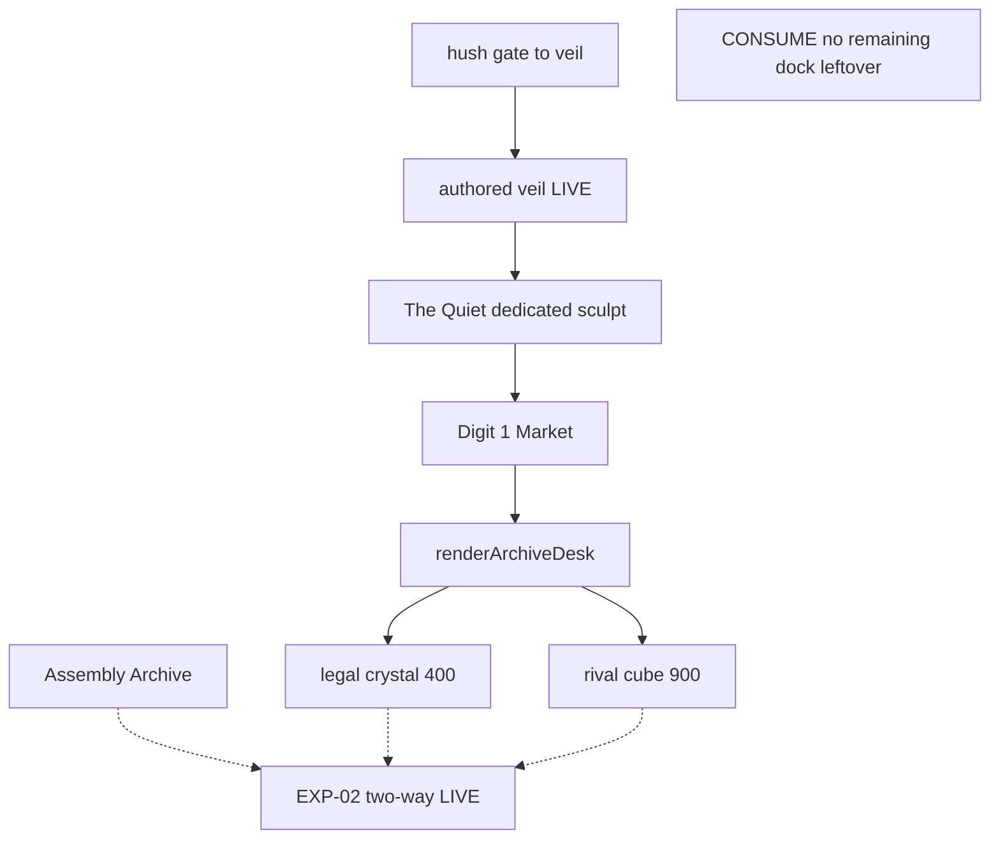

# RIMWARD EXP-04 remaining Unknowables dock / Archive two-way

| Field | Value |
|---|---|
| **Title** | RIMWARD EXP-04 remaining Unknowables dock / Archive two-way |
| **Author** | Wave 121 EXP dock leftover integrator |
| **Date** | 2026-08-25 |
| **Status** | leftover **CONSUME**. Wave 121 markdown only. Named serial: **none**. Name: **no remaining Unknowables dock / Archive two-way leftover.** |
| **Wave** | 121 — no `src/`. Bindings do not change here. |
| **Owner request** | Wishlist Initiative EXP still says “Unknowables dock still waits” (`docs/PLAYER-EXPERIENCE-WISHLIST.md`). Wave 92 briefed presence-first (`docs/UnknowablesDockDesign.md`). Wave 94 owner notes say dock `veil` / The Quiet and Archive 400/900 landed. Census **live code**. Code wins. If the origin dock is live (authored `veil`, station The Quiet, Archive own 400 / rival 900) and remaining EXP-02 two-way desk is not a missing player-facing hole, freeze leftover **CONSUME** and named serial **none**. If a real remaining hole exists, freeze leftover **REAL** and name later serial **PR1** (named only). Do **not** implement `src/`. Do **not** invent UU, a new Digit, a station builder for a second Unknowables dock, or a generated SYSTEM. |
| **Merge law** | [`out/w121/expdock/shared-contract.md`](../out/w121/expdock/shared-contract.md). If this brief and that file conflict, **the contract wins**. |
| **Honor** | HUD-01 empty hub. Digit 0 shipyard. Digit 8/9 stay. `state.js` READ-ONLY later. No new persist key. `innerHTML` forbidden later. Kit mutate omit. Aim-glass gauges stay off. Unknowables still build **no** `DETAIL_STATIONS` hull (D3). Do **not** reverse Wave 42 D3 unless census proves it already reversed — census shows dedicated builder instead. Cite, do **not** edit: wishlist, `PROGRESS.md`, `docs/UnknowablesDockDesign.md`, `docs/ExpDataTradeDesign.md`, `docs/OwnerDecisions*.md` (Wave 82/93/94), `docs/Nav07ChartLabelDesign.md`, Nav/Hud/Ctl leftover docs. Do **not** write `docs/OwnerDecisionsWave121.md`. Do **not** steal `out/w121/chartlabel/**`, `out/w121/hudrest/**`, `out/w120/**`, `out/w92/unk/**` (read ok). Do **not** steal `src/**`. |

**Verifier record:**

| Note | Path |
|---|---|
| Inventory (code wins; Wave 121 census) | [`out/w121/expdock/current-exp-dock-inventory.md`](../out/w121/expdock/current-exp-dock-inventory.md) |
| Merge law | [`out/w121/expdock/shared-contract.md`](../out/w121/expdock/shared-contract.md) |
| Wave 121 security review | [`out/w121/expdock/security-review.md`](../out/w121/expdock/security-review.md) |
| Wave 121 design-doc review | [`out/w121/expdock/code-review.md`](../out/w121/expdock/code-review.md) |
| Wave 121 UI audit | [`out/w121/expdock/ui-audit.md`](../out/w121/expdock/ui-audit.md) |
| Wave 121 notes | [`out/w121/expdock/notes.md`](../out/w121/expdock/notes.md) |

Siblings chart-label / HUD rest / toast / overlay / Nav leftover docs, wishlist, `PROGRESS.md`, Wave 82/93/94 owner files, EXP brief, and Unknowables Wave 92 brief are **other workers**. **Do not edit** those paths. **Do not write** `src/`.

**This is not HUD.** **This is not NAV chart-label.** **This is not toast.** **This is not overlay mutex.** Wishlist “Unknowables dock still waits” is **stale vs code**. Origin dock and EXP-02 two-way at The Quiet are **already live**.

---

## Overview

Wave 82 waited an Unknowables origin Archive. Wave 92 picked hush presence `th_veil` first. Wave 93 kept dock Wait. Wave 94 **un-waited**: authored `veil`, station **The Quiet**, dedicated builder, Archive own crystal **400** / rival cube **900**.

Census (code wins): `AUTHORED_SYSTEMS.veil` flies `unknowables`. The Quiet docks. `archiveDeskAllowed('unknowables')` is true because `UNKNOWABLES_STATION_PATH`. Market pane files legal crystals at 400 UU and rival cubes at 900 UU. Hostile Unknowables standing refuses. Captured own crystals refuse at origin. Assembly Archive is unchanged. EXP-02 two-way is not a missing player-facing hole.

This leftover is **CONSUME**. Name: **no remaining Unknowables dock / Archive two-way leftover.** Do **not** freeze a dock serial. Wishlist still **says** the dock waits; live `veil` **ships** it.

This brief is the integrator document. Wave 121 this worker lands markdown only. Bindings do not change here.

HUD-01 empty aim glass stays empty. `state.js` stays READ-ONLY. No new persist key. Digit 0 stays shipyard. Digit 8/9 stay. Do not invent UU. Do not reverse D3. Do not steal chart-label. Aim-glass gauges stay off.

Wave 121 deputize (recorded here and in the contract; owner may override after playtest): **do not invent Unknowables dock work**. Fail closed to today’s `veil` / The Quiet / Archive desk. Never freeze the sim.

If census had proved no live dock, Archive missing at veil, rival cubes not bought/sold at The Quiet, own crystals missing, or EXP-02 two-way still dead at Unknowables, this pack would freeze **REAL** and name serial **PR1**. Census did not.

---

## Background & Motivation

### Current state (inventory)

Source of truth: [`out/w121/expdock/current-exp-dock-inventory.md`](../out/w121/expdock/current-exp-dock-inventory.md). Code wins.

| Surface | Today | Cite |
|---|---|---|
| Origin system | `veil` / The Veil / `unknowables` / band 3 | `authored-systems.js` **234–252** |
| Station | The Quiet | **243** |
| Gates | hush ↔ veil | hush **175**; veil **245** |
| Presence landmark | `th_veil` anomaly on hush (not the dock) | **189** |
| Clues on veil | `[]`; hush still 2; authored total 6 | **254**; hush **191–194** |
| Cast | empty traders/pirates/patrols/ace | **251** |
| Faction row | `FACTIONS.unknowables` | `state.js` **605** |
| `SYSTEMS` merge | authored ∪ generated | `state.js` **583** |
| Chart id | `veil` in `AUTHORED_IDS` | `galaxychart.js` **52** — sibling owns later a11y |
| Generator cluster | **none** | `generate-galaxy.mjs` grep 0 |
| Dedicated hull | `assembleUnknowablesStation`; group `unknowables-station` | `stations/unknowables.js` **13–17** |
| Dispatch | `isUnknowable` → `buildUnknowablesStation` | `station.js` **308–321** |
| `DETAIL_STATIONS` | 10 keys; **no** `unknowables` | `station.js` **567–578** |
| Catalog | `station:unknowables` | `model-catalog.js` **139–145** |
| Archive allow | Unknowables iff builder flag | `station.js` **1210–1214** |
| Own / rival UU | crystal 400 / cube 900 at Unknowables desk | `station.js` **1221–1238**; `data-trade.js` **21–24** |
| Desk chrome | Market pane; confirm papers | `station.js` **1419–1525**, **4784** |
| Assembly prices | cube 400 / crystal 900 | `archiveFilePrice` **187–201** |
| Drop | 0.20 | `data-trade.js` **19** |
| Contacts | Voice-Without dockmaster | `contacts.js` **97**, **114** |
| Yard | `UNKNOWABLES_STOCK = LIVING_STOCK` | `shipyard.js` **29–30**, **61** |
| Digit 0 / 8 / 9 | shipyard / launch / epics | `station.js` **188** |
| Epic | omit | `state.js` **797+**; no `unknowables` key |
| `h()` / XSS | `textContent`; no `innerHTML` | `station.js` **4464–4469** |
| Notice | `aria-live` polite | **6066–6068** |
| Persist pending | session `ui.dataPending` only | **4447**, **6087**, **6107** |
| `WORLD_FIELDS` archive | **none** | `save.js` **77–101** |
| WAVE94 pin | veil + desk allow | `scripts/boot-test.mjs` **20728–20739** |

The player who jumps hush → veil already docks The Quiet. Digit 1 Market already shows Archive. Legal crystals file at 400 UU. Rival cubes file at 900 UU. Wishlist “dock still waits” is **stale vs code**.

### Pain points

- A naive later PR that “adds Unknowables dock” would double `veil`.
- A naive later PR that adds `DETAIL_STATIONS.unknowables` reverses D3 and fights the dedicated module.
- A naive later PR that generates an Unknowables SYSTEM invents a second site and lockstep smash.
- A naive later PR that invents UU fights Wave 82/94 integers.
- A naive later PR that persists `dataPending` into `WORLD_FIELDS` lies after jump.
- A naive later PR that `innerHTML`s lot labels is XSS.
- A naive later PR that steals Digit 0/8/9 smashes shipyard, launch, or epics.
- A naive later PR that treats `archiveFilePrice` Assembly-only as a hole rewrites a live desk helper.
- A naive later PR that edits `galaxychart.js` for this leftover steals chart-label sibling.
- Inventing “CONSUME is boring, add a second dock” invents work the owner forbade.

### Why now (design) / why not now (code)

The owner asked for a leftover census so later serials do **not** invent a second Unknowables dock while chasing a hole Wave 94 already closed. Inventory shows origin dock **LIVE** and EXP-02 two-way **LIVE**. Merge law can exist without touching `src/`. Implementation does **not** wait — it **does not ship**. Wave 121 this worker does not write `src/`.

---

## Goals & Non-Goals

### Goals

1. Document live `veil`, The Quiet, dedicated builder, Archive 400/900, Digit, persist from **live code**.
2. Freeze leftover as **CONSUME** (not REAL). Name **no remaining Unknowables dock / Archive two-way leftover.** Serial **none**.
3. Freeze **reuse** of live dock + Market Archive. No second system. No new persist key.
4. Freeze D3: `DETAIL_STATIONS` stays without `unknowables`.
5. Freeze Wave 82 UU copy. No invented UU. No third SKU.
6. Freeze no new Digit, no `state.js` write, no HUD/NAV steal.
7. Freeze a serial PR plan with **no implementation PR1**.

### Non-goals (locked — do not reopen)

- No `src/` or live bindings in this worker.
- No second Unknowables dock. No generated SYSTEM. No generator cluster.
- No `DETAIL_STATIONS.unknowables`.
- No Digit steal. No Archive Digit.
- No invented UU / drop / standing delta.
- No persist of desk pending.
- No Unknowables epic. No new hush clue.
- No HUD / chart-label / toast / overlay work.
- No rewrite of `docs/UnknowablesDockDesign.md` or `docs/ExpDataTradeDesign.md`.
- No wishlist or `PROGRESS.md` edit.
- Do not write `docs/OwnerDecisionsWave121.md`.
- Do not steal `out/w121/chartlabel/**`, `out/w121/hudrest/**`, `out/w120/**`, `out/w92/unk/**`.
- Do not fix known boot FAILs.

---

## Proposed Design

### 1. Merge resolutions (contract wins)

| Question | Integrator freeze | Why |
|---|---|---|
| Leftover real? | **No. CONSUME.** | Inventory §0: `veil` / The Quiet / Archive 400/900 / two-way LIVE |
| Named PR1? | **None** | CONSUME |
| New persist key? | **No** | `ui.dataPending` session; cargo hangar rows |
| `state.js` write? | **No** | Contract §0.5 |
| `DETAIL_STATIONS.unknowables`? | **No** | D3; dedicated builder LIVE |
| Second dock / generated SYSTEM? | **No** | Wave 94 authored-only |
| Invented UU? | **No** | Copy 400 / 900 |
| New Digit? | **No** | Archive is Market |
| Steal `galaxychart.js`? | **No** | Sibling chart-label |
| Treat `archiveFilePrice` Assembly-only as hole? | **No** | `archivePriceAtDesk` prices Unknowables |
| Fail closed? | no builder → no desk; hostile → No sale | Live |
| Reverse D3? | **No** | Census did not reverse it |

### 2. Current dock motion (do not break)

See inventory §§3–6. Load-bearing loop:

**Today (consume)**

1. Player plots hush → veil (authored gate).
2. Zone/charge jump; dock The Quiet (`U.DOCK_RANGE` live).
3. Digit 1 Market. `renderArchiveDesk` paints when `currentDef.faction === 'unknowables'`.
4. File legal crystal 400 UU, or sell rival cube 900 UU, via confirm papers.
5. Credits + hangar cargo persist. Pending does not.

**This serial must not change** `veil`, builder dispatch, `archiveDeskAllowed`, `archivePriceAtDesk`, Digit map, `WORLD_FIELDS`, `DETAIL_STATIONS`. Additive: **none**.

Digit 0 and `DOCK_KEY_SERVICES` stay. Digit 8/9 stay.

### 3. Deputize table (copy of contract §0.1)

Owner may override after playtest. Do not park. Do not invent work.

| Knob | Value |
|---|---|
| Verdict | **CONSUME** |
| Fail-closed | missing builder → no desk; hostile → No sale; reserved id → drop |
| Additive | **none** |
| Persist | existing hangar cargo + credits |
| UU | own 400 / rival 900 / drop 0.20 |
| D3 | `DETAIL_STATIONS` unchanged |
| Alloc | reuse live Market Archive |
| Missing host | today’s `veil` / The Quiet |

Origin dock already has a live desk (inventory §0). Later serial **does not add a helper**. Do not steal chart-label.

### 4. Neighbours

| Module | EXP dock leftover does | EXP dock leftover does not |
|---|---|---|
| `authored-systems.js` | **none** (CONSUME) | second system row |
| `stations/unknowables.js` | **none** | second sculpt / placeholder origin |
| `station.js` Archive | **none** | new Digit; persist pending |
| `data-trade.js` | **none** | invented UU; third SKU |
| `DETAIL_STATIONS` | unchanged | add `unknowables` |
| `galaxychart.js` | cite `veil` id only | chart-label a11y (sibling) |
| `save.js` | none | new `WORLD_FIELDS` |
| `state.js` | **read-only later** | write |
| Digit 0/8/9 | cite freeze | bind Archive |
| HUD / toast / overlay | none | steal siblings |

### 5. Serial PR plan

Matches contract §3. **Named only. Do not implement in Wave 121.**

| PR | Lands | Does not land |
|---|---|---|
| **PR1 Unknowables dock** | **Does not exist.** Leftover CONSUME | second dock; D3 reverse; generated SYSTEM; persist; invented UU; Digit steal |
| **PR-census (optional skip)** | Re-grep `veil` / The Quiet / `archiveDeskAllowed` / 400/900 | New world field; hub pip; chart-label |

First remaining Unknowables-dock serial is **none**. It must not steal Digit 0/8/9. It must not write `state.js`.

### 6. Picture

Reuse live The Quiet. No new chrome. EXP-02 two-way is the **live Market Archive** at Assembly **and** Unknowables. Not a second Digit. Not a generated home.

No hub child. No extra toast. No `innerHTML`. No persist of papers.

### 7. UI (specified later UI — CONSUME: already live)

See [`out/w121/expdock/ui-audit.md`](../out/w121/expdock/ui-audit.md).

**This wave:** no chrome.

**Later (none):** do not add Archive chrome. Live desk already uses real `<button>`s, `h()` `textContent`, confirm/cancel, `aria-live` polite on `ui.notice`, reduced-motion short copy.

### 8. Events / persist / security

Prefer live `'docked'` / `'undocked'` / `requestAutosave`. No new frozen event. No new `WORLD_FIELDS` key.

Security freeze: `innerHTML` forbidden; proto-safe origin/faction sanitize; no persist of `dataPending`; copy authored UU only.

### 9. Coupling

| Sibling | Boundary |
|---|---|
| Chart-label | owns later `galaxychart.js` a11y. This pack cites `veil` in `AUTHORED_IDS` only |
| HUD rest | not this leftover |
| Wave 92 unk pack | read-only; Wait superseded by Wave 94 |
| EXP brief | Assembly first was then; Unknowables desk now live |
| Wave 94 owner | `veil` / The Quiet / 400/900 bind |

---

## Player outcome (CONSUME; freeze here)

Jump the hush gate to The Veil. Dock The Quiet. Open Market. Archive files a legal crystal at 400 UU. Archive pays 900 UU for an Assembly cube. Hostile Unknowables standing paints `No sale.` Captured Unknowable crystals stay illegal in origin. Assembly still files cubes at 400 and rival crystals at 900.

Digit 0 is still shipyard. Digit 8/9 stay launch / epics. The 80 px hub stays empty. No one sells a second Unknowables dock.

**HUD leftovers** are **not** this work. **Chart-label a11y** is **not** this work. **Wishlist status prose** is **not** this work (other worker).

---

## Risks & Mitigations (frozen; no PR1)

| Risk | Mitigation |
|---|---|
| Later worker invents a second `veil` | Contract §0 / §3 CONSUME; inventory §0 |
| Later worker adds `DETAIL_STATIONS.unknowables` | Contract §0.8 D3 |
| Later worker invents UU | Contract §0.5; Wave 82/94 copy |
| Later worker persists papers | Contract §0.6 session only |
| XSS on lot labels | `innerHTML` forbidden; live 0 |
| Digit theft | Contract §0.3 |
| Chart-label steal | Contract §0.14 |
| Wishlist stale line treated as REAL | Code wins; do not edit wishlist here |

---

## Security (freeze)

- No `innerHTML` later. Live desk `h()` `textContent`.
- No new `WORLD_FIELDS` key. Do not persist `dataPending`.
- Prototype-safe: reserved ids; `Object.hasOwn(FACTIONS)`; `archiveDeskAllowed('__proto__')` false.
- No invented UU.
- Credits debit fail-closed; `dataBusy` re-entry guard already live.

---

## Acceptance (CONSUME)

Verifier accepts this leftover freeze when:

1. Inventory + contract + this brief all say **CONSUME** / serial **none**.
2. Cites match live `veil` / The Quiet / `archiveDeskAllowed('unknowables')` / `archivePriceAtDesk` 400/900.
3. Worker wrote **no** `src/`.
4. Honor files untouched.
5. D3 still: no `DETAIL_STATIONS.unknowables`.
6. Security / code-review / UI audit have no open CRITICAL / HIGH / Blocker / Major in **this markdown pack**.

Re-open only if a later census proves the dock or two-way desk **gone**.

---

## Open questions

None for this leftover. Census closed the dock hole. Owner may still edit wishlist status later (other worker). This pack does **not** edit the wishlist.
