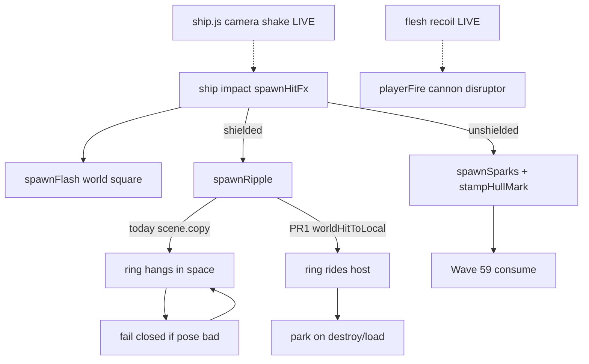

# RIMWARD FX-01 remaining combat punch

| Field | Value |
|---|---|
| **Title** | RIMWARD FX-01 remaining combat punch |
| **Author** | Wave 110 FX-01 integrator |
| **Date** | 2026-08-24 |
| **Status** | first impl Wave 111 PR1 |
| **Wave** | 111 — PR1 hull-local shield ripple. |
| **Owner request** | Remaining FX-01 leftover after Wave 54 first pass and Wave 59 recoil + pooled scorches: weapon effects can still read weak; hits can still lack punch. Recoil and marks are **LIVE** — consume. This leftover is **feel / readability of fire and hits**, not PHY bounce, not NAV, not HUD-01 hub gauges, not new SKUs. |
| **Merge law** | [`out/w110/fx01/shared-contract.md`](../out/w110/fx01/shared-contract.md). If this brief and that file conflict, the contract wins. |
| **Honor** | HUD-01 empty hub. Digit 0 shipyard. Digit 8/9 stay. `state.js` READ-ONLY; later **no** `state.js` write and **no** new persist key. `innerHTML` forbidden later. No punch pip on `.rw-reticle`. Kit mutate omit. Recoil / hull-mark pool 12 consume. FX-02 music/radio stay closed. PHY / NAV / MATCH / hover / AP / PHY-04 / PHY-05 / BIO gait are **other workers**. Do **not** edit sibling Bio/Nav/Msn/Rep/Shp/Tgt/Hud/Owner docs, the wishlist, `PROGRESS.md`, or `docs/Phy05PadHomeDesign.md`. |

**Verifier record:**

| Note | Path |
|---|---|
| Inventory (code wins) | [`out/w110/fx01/current-fx01-inventory.md`](../out/w110/fx01/current-fx01-inventory.md) |
| Merge law | [`out/w110/fx01/shared-contract.md`](../out/w110/fx01/shared-contract.md) |
| Security review | [`out/w110/fx01/security-review.md`](../out/w110/fx01/security-review.md) |
| Design-doc review | [`out/w110/fx01/code-review.md`](../out/w110/fx01/code-review.md) |
| UI audit | [`out/w110/fx01/ui-audit.md`](../out/w110/fx01/ui-audit.md) |
| Probe (Wave 111 PR1) | [`out/w111/fx01/probe.mjs`](../out/w111/fx01/probe.mjs) |
| Security review (Wave 111) | [`out/w111/fx01/security-review.md`](../out/w111/fx01/security-review.md) |
| Code review (Wave 111) | [`out/w111/fx01/code-review.md`](../out/w111/fx01/code-review.md) |
| UI audit (Wave 111) | [`out/w111/fx01/ui-audit.md`](../out/w111/fx01/ui-audit.md) |

Siblings PHY, BIO, NAV, MSN, REP, SHP, TGT, HUD, FX-02/03, wishlist, `PROGRESS.md`, and `docs/OwnerDecisions*.md` are **other workers**. **Do not edit** those paths. Do **not** write `docs/OwnerDecisionsWave110.md`. Do **not** write `src/`. Do **not** steal sibling Wave 110 paths (`src/game/world.js`, `scripts/boot-test.mjs`, `docs/Rep03RemedialDesign.md`, `out/w110/padhome/**`, `out/w110/rep03/**`).

**This is not PHY bounce.** **This is not NAV.** **This is not HUD-01.** **This is not recoil.** **This is not the hull-mark pool.** Wishlist FX-01 acceptance still wants hits that read as punches.

---

## Overview

Wave 54 landed pooled muzzle flashes, family-tinted bolt glow/streak, a **world-space** shield ring, stronger sparks, `playerFire`, restrained camera shake, and combat audio. Wave 59 landed **visible recoil** (cannon/disruptor flesh kick) and a **pool of 12** hull scorches that parent to the unshielded host. WAVE54 / WAVE59 boot pins already lock those surfaces.

Census (code wins): camera shake is **not** missing. Recoil is **not** missing. Marks are **not** missing. Muzzle, bolts, sparks, and FX-02 cues are **not** missing. `spawnRipple` **exists** but sits on the scene at a world point. A moving hull leaves the ring behind. Unshielded hits already ride via `stampHullMark`. Shielded hits do not.

This leftover is **hull-local shield language**, not a second shake, not a hub meter.

This brief is the integrator document for a **later** implementation wave. Wave 110 this worker lands markdown only. Bindings do not change here.

HUD-01 empty aim glass stays empty. `state.js` stays READ-ONLY. No new persist key. Digit 0 stays shipyard. Digit 8/9 stay. Do not invent UU. Do not steal MATCH/hover/AP. Do not reopen music/radio.

Wave 110 deputize (recorded here and in the contract; owner may override after playtest): parent the existing `RIPPLE_POOL` ring to the struck host with `worldHitToLocal`; park on death/load like marks; fail closed to today’s world-space copy; `reducedMotion` keeps the live one-frame snap.

---

## Background & Motivation

### Current state (inventory)

Source of truth: [`out/w110/fx01/current-fx01-inventory.md`](../out/w110/fx01/current-fx01-inventory.md). Code wins over stale PROGRESS “recoil did not ship.”

| Surface | Today | Cite |
|---|---|---|
| Muzzle | pooled glow-dot, FP-safe | `combat.js` 1002–1023 |
| Bolts | glow + streak; `PROJ_RADIUS` 0.4 | 182, 419–548 |
| Shield ripple | **world-space** ring, not parented | 1026–1043, 620–635 |
| Hit XOR | shielded ripple else sparks+mark | 1045–1053 |
| Hull marks | pool 12, host-parented, scene only | `hull-marks.js` 7; `combat.js` 1073–1118 |
| Sparks | 11 chips; `reducedMotion` no emit | 195–199, 954–956 |
| Camera shake | lastEvents; caps 0.35 / 0.12 | `ship.js` 121–137, 1207–1279 |
| Recoil | cannon/disruptor flesh +Z/+Y | `ship.js` 133–137, 1237–1263 |
| Audio | playerHit / playerFire / npcHit / … | `song.js` 45–69 |
| HUD hub | 80 px + RANGE | `hud.css` 184–193; `hud.js` 709–712 |
| Facing flash | `.rw-combat-self` 0.4 s | `hud.js` 1109–1151, 1391–1399 |
| Digit 0 / 8 / 9 | shipyard / launch / Standing | `station.js` 188, 5938–5941, 6073–6077 |
| Persist | no FX key in `WORLD_FIELDS` | `save.js` 76–101 |
| `reducedMotion` | snap FX; zero shake | `ctx.js` 217; `settings.js` 72 |

### Pain points

- A naive later PR that cranks shake or muzzle scale reopens WAVE54 pins and is **not** the absent leftover.
- A naive later PR that rewrites recoil or grows the mark pool reopens WAVE59.
- A naive later PR that stamps scorches through shields breaks Wave 59 “marks when shields are down.”
- A naive later PR that adds a punch pip on the 80 px hub reopens HUD-01.
- A naive later PR that persists marks invents a `WORLD_FIELDS` key the inventory does not need.
- A naive later PR that waits for a free ripple slot would freeze combat — forbidden.
- Putting extra pulse under `reducedMotion` would smash `body.rw-reduced-motion`.
- Stealing Digit 0/8/9 would smash shipyard, launch, Standing, or papers.
- Writing FX fields into `WEAPONS` would violate `state.js` READ-ONLY.
- Reopening music/radio would smash FX-02.
- Landing shake **and** ripple as required PR1 violates the cheaper-ripple rule (and shake is already live).

### Why now (design) / why not now (code)

The owner asked for the FX-01 integrator leftover so later serials can make **shielded hits ride the hull**. Inventory shows shake, recoil, marks, muzzle, bolts, and a world-space ring. Merge law can exist without touching `src/`. Implementation waits so hub theft, Digit theft, `state.js` writes, new persist keys, recoil rewrite, shake retune, and freeze-on-busy-pool are frozen before the first `host.add(ripple)`. Wave 110 this worker does not ship `src/`.

---

## Goals & Non-Goals

### Goals

1. Document live muzzle, bolts, world-space ripple, XOR hit FX, marks, sparks, shake, recoil, audio, HUD/Digit/persist from **live code**.
2. Freeze **reuse** of `RIPPLE_POOL` / `spawnRipple` / `worldHitToLocal`. No third pool.
3. Freeze hull-local parent on **shielded** hits only. Unshielded sparks + stamp stay.
4. Freeze persist: **none**. Scene only, like marks.
5. Freeze recoil / mark pool / shake caps as **consume**.
6. Freeze no new Digit, no `state.js` write, no UU, no punch pip, no toast required.
7. Freeze FX-02 music/radio closed. PHY/NAV/MATCH/hover/AP/pad-home honor.
8. Freeze fail-closed: missing parent helper → world-space ring; **never** freeze sim; **never** zero speed.
9. Freeze `reducedMotion` mute of extra pulse (live snap stays).
10. Freeze a serial PR plan. This wave writes the brief. A later wave ships serially.

### Non-goals (locked — do not reopen)

- No `src/` or live bindings in this worker.
- No recoil rewrite. No mark-pool resize. No marks through shields.
- No required shake retune (LIVE).
- No HUD-01 hub child. No RANGE rewrite. No punch combo meter.
- No new Digit. No toast required.
- No `WEAPONS` extra ids. No invented UU or SKU.
- No persist `world.hullMarks`. No new settings checkbox.
- Do not retune `PROJ_RADIUS` / `SPARKS_PER_BURST` / muzzle `base` as the leftover.
- Do not reopen FX-02 music/radio or FX-03 aftermath.
- Do not steal PHY bounce, NAV, MATCH, hover, AP, PHY-04, PHY-05, BIO gait.
- Do not edit the wishlist, `PROGRESS.md`, Bio*, Nav*, Msn*, Rep*, OwnerDecisions*, `docs/Phy05PadHomeDesign.md`.
- Do not write `docs/OwnerDecisionsWave110.md`.
- Do not fix known boot FAILs.

---

## Proposed Design

### 1. Merge resolutions (contract wins)

| Question | Integrator freeze | Why |
|---|---|---|
| New persist key? | **No** | Marks/ripples are scene only |
| `state.js` write? | **No** | Contract §0.5 |
| Rewrite recoil? | **No** | Wave 59 consume |
| Grow mark pool? | **No** | WAVE59 pin 12 |
| Required PR1 shake? | **No** | Shake LIVE; cheaper leftover is hull-local ripple |
| Third FX pool? | **No** | Reuse `RIPPLE_POOL` |
| Stamp through shields? | **No** | Wave 59 law |
| Fail closed? | World-space ring; never stop | Owner; inventory §10 |
| `reducedMotion`? | Snap one frame; no extra pulse | Live 1921–1965 |
| First-person player host? | World-space or FP-small; no full-size parent | Muzzle glass law 998–1021 |
| HUD / Digit / SKU? | **No** | Frozen |
| First serial steal Digit 0/8/9? | **No** | Contract §0.3 |
| User shader from save? | **No** | Contract §0.4 |

### 2. Current hit motion (do not break bolts / recoil / marks)

See inventory §§2–4. Load-bearing loops:

**Shielded hit (today)**

1. `applyHit` runs. `playerHit` / `npcHit` emit.
2. `spawnFlash` (untextured square, world).
3. `spawnRipple` copies world point onto a **scene** sprite.
4. Player also gets camera shake + song `playerHit` / HUD facing flash.
5. Hull flies on. Ring stays in empty space.

**Unshielded hit (today — consume)**

1. Flash + sparks + `stampHullMark` parented to host.
2. Recycle oldest of 12. Park on kill / load.

**Player fire (today — consume)**

1. Bolt leaves pool → muzzle + `playerFire`.
2. Next frame: recoil flesh kick (cannon/disruptor) + small camera punch.
3. `reducedMotion` / dock / jump zeros kick.

**This serial must not change** `applyHit`, bolt pools, `PROJ_RADIUS`, recoil math, mark pool size, shake caps, song CUES, hub DOM, Digit map. Additive: ripple **parent + park**.

Digit 0 and `DOCK_KEY_SERVICES` stay. Digit 8/9 stay.

### 3. Deputize table (copy of contract §0.1)

Owner may override after playtest. Do not park.

| Knob | Value |
|---|---|
| Fail-closed | world-space ripple if parent helper missing; never `speed = 0` |
| Additive | parent `RIPPLE_POOL` via `worldHitToLocal`; park like marks; **no** full-size parent on first-person player hull |
| XOR | shielded ripple; unshielded sparks+mark unchanged |
| Persist | none |
| Shake / recoil / marks | consume LIVE |
| `reducedMotion` | live snap; no extra pulse |
| Alloc | reuse 16 rings; no per-hit material |
| Missing data | live `position.copy(pos)` |

PHY scrape `bodyHit` still has no `spawnHitFx` (inventory §3). Do not steal PHY.

### 4. Neighbours

| Module | FX-01 remaining does | FX-01 remaining does not |
|---|---|---|
| `combat.js` `spawnRipple` | later PR1 parent + park | new pool; shader from save |
| `combat.js` `spawnHitFx` | pass host into ripple | stamp through shields |
| `hull-marks.js` | **call** `worldHitToLocal` | resize pool |
| `ship.js` shake / recoil | consume | rewrite |
| `song.js` | consume | music / radio |
| `npc.js` death burst | none | FX-03 steal |
| `hud.js` | none | hub child; move facing flash |
| `save.js` | none | new `WORLD_FIELDS` |
| `state.js` | **read WEAPONS / applyHit** | write |
| HUD-01 | none | punch pip |
| Digit 0/8/9 | cite freeze | bind FX |

### 5. Serial PR plan

Matches contract §3. **Named only. Do not implement in Wave 110.**

| PR | Lands | Does not land |
|---|---|---|
| **PR1 hull-local shield ripple** | Parent ring to host; park on destroy/load; reducedMotion snap; fail closed world-space | `state.js`; Digit; new persist key; shake; recoil; mark pool; HUD hub; music |
| **PR2 flash map (optional)** | Shared `glowTex` on `spawnFlash` after playtest | Required with PR1; known boot FAIL fixes |
| **PR3 census (optional skip)** | Re-grep ripple `host`; do not require shake | New world field; hub pip |

First remaining serial is **PR1**. It must not steal Digit 0/8/9. It must not write `state.js`. Do not land shake as required PR1.

### 6. Picture

Reuse live cameras. No new chrome. Punch is a **ring that sticks to the struck hull**, not a HUD label.

No punch pip. RANGE stays TGT-01. Facing-rail flash stays on `.rw-combat-self`. No new toast required (`playerHit` already has audio; hull-strike toast stays PHY).

---

## Player outcome (later serial; freeze here)

Fire a cannon at a pirate **with screens up**. The family-tinted ring sits **on that hull** and rides the turn. It does not hang in the void after the pass.

Fire until screens drop. Sparks and scorches still stamp. Pool 12 still recycles. Kill still parks marks so the wreck stays clean.

Take a hit yourself in chase. The ring can sit on your hull. In first person the ring does **not** fill the glass (world-space or a small snap). Camera still kicks (Wave 54). Recoil still kicks the gun (Wave 59). `reducedMotion` still kills shake, spark emit, and extra ripple pulse. One static ring frame may still show.

The 80 px hub stays empty. Digit 0 is still shipyard. No one sells “punch.”

**Recoil** is **not** this work. **Marks pool** is **not** this work. **Shake** is **not** this work. **FX-02 audio** is **not** this work. **PHY bounce** is **not** this work.

---

## Security

See [`out/w110/fx01/security-review.md`](../out/w110/fx01/security-review.md).

- XSS: no new DOM. `innerHTML` forbidden later.
- No user shaders / GLSL from save.
- Proto: no `for-in` merge from save into sprites.
- Persist: no new key; ripples never serialize.
- No secrets. No Digit theft. No UU.
- Fail-closed never freeze the sim.

---

## Acceptance direction (implementation wave)

1. Shielded `spawnHitFx` parents the ripple to the struck host when pose is finite.
2. Fail closed: bad host / `worldHitToLocal` false → world-space ring as today. Never freeze. Never zero speed. Bolts / recoil / marks still play.
3. Unshielded path unchanged (sparks + stamp). Kill still parks marks and ripples.
4. `reducedMotion` snaps one ripple frame then hides. Shake still zeros.
5. No new persist key. No `WEAPONS` new id. Digit 0 shipyard. Hub 80 px empty of new children.
6. WAVE54 / WAVE59 pins still pass. Optional later pin: ripple parent === host on a shielded hit.
7. No `innerHTML` on paths this serial touches.
8. Known boot FAILs untouched.

---

## Alternatives considered

| Alternative | Why not |
|---|---|
| Required camera-shake PR1 | Already LIVE; owner: cheaper hull-local ripple if both missing — shake is not missing |
| Crank muzzle / glow / `PROJ_RADIUS` | WAVE54 pins; not the absent leftover |
| Rewrite recoil / missile flesh kick | Wave 59 consume |
| Grow mark pool / persist marks | WAVE59 12; scene-only confirmed |
| Stamp through shields | Breaks “wrecks stay clean” / shields-down law |
| New debris mesh per hit | CPU; FX-03 already has death chips |
| Punch pip on hub | HUD-01 |
| Digit / SKU / UU | Owner impersonation |
| Freeze until pool free | Availability bug |
| Music / radio | FX-02 closed |
| `spawnFlash` glowTex as required PR1 | Optional PR2 after playtest |
| User shader | Security freeze |

---

## Regression risks

| Risk | Mitigation |
|---|---|
| Ring leaks on despawn | park like marks (`npcDestroyed` / `playerDestroyed` / `systemLoaded` / orphan) |
| Recoil / marks rewritten | contract §0.8–0.9; WAVE59 pins stay |
| Shake caps drift | WAVE54 pin; not PR1 |
| Hub pip / Digit steal | contract §0.2–0.3 |
| `state.js` / new persist key | contract §0.5–0.6 |
| `reducedMotion` pulse | keep live snap; no extra `@keyframes` |
| Freeze on busy pool | skip ring; never `speed = 0` |
| First-person glass flood | no full-size parent on player host in first person (contract §0.1 / §2) |
| Untextured flash remains | accepted until optional PR2 |
| Sibling `world.js` / boot steal | this pack does not touch those paths |

---

## Ownership

| Object | Writer | Reader |
|---|---|---|
| ripple `host` | later PR1 | tick / reclaim |
| `spawnRipple` | later PR1 | spawnHitFx |
| hull-mark pool | **none** | consume |
| recoil / shake | **none** | consume |
| `state.js` | **none** | WEAPONS / applyHit read |
| HUD / Digit | **none** | — |

---

## Open owner questions

**Deputized this wave** (contract §0.1). Owner may override after playtest. Do not park.

1. Smallest additive = hull-local shield ripple via existing `RIPPLE_POOL` + `worldHitToLocal`. Fail closed = world-space ring.
2. Camera shake and recoil stay LIVE consume. Not rewritten.
3. No new persist key. Scene only.
4. Home: `combat.js`. Not `state.js`. Not a new Digit. Not the hub.
5. Optional PR2 flash map is skippable after playtest.
