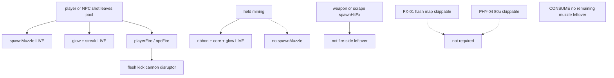

# RIMWARD FX remaining muzzle / bolt / beam

| Field | Value |
|---|---|
| **Title** | RIMWARD FX remaining muzzle / bolt / beam |
| **Author** | Wave 114 FX muzzle integrator |
| **Date** | 2026-08-24 |
| **Status** | leftover **CONSUME**. Wave 114 markdown only. Named serial: **none**. Name: **no remaining FX-01 muzzle leftover.** |
| **Wave** | 114 — no `src/`. Bindings do not change here. |
| **Owner request** | Wave 111 landed FX-01 hull-local **weapon** shield ripple (`docs/Fx01RemainingDesign.md` — **cite, do not rewrite**). Wave 114 sibling scrape punch (`docs/Fx01RemainingScrapeDesign.md` — **cite, do not rewrite**). Census whether fire-side muzzle / bolt / beam readability at the gun still has a leftover after Wave 54 first pass and Wave 59 recoil + pooled scorches. If real, freeze a later serial that can punch fire-side FX without stealing WAVE111 `spawnRipple` parent, without stealing Wave 114 scrape `spawnHitFx`, without retuning IMPACT 8 / 0.35, without a hub pip, without a new Digit, without `state.js` write, without a new persist key, without `innerHTML`, without rewriting recoil/shake/mark pool as the feature, without user shaders from save. If census proves muzzle/bolts already meet the wishlist punch, freeze **CONSUME**. Do not invent work. |
| **Merge law** | [`out/w114/fxmuzzle/shared-contract.md`](../out/w114/fxmuzzle/shared-contract.md). If this brief and that file conflict, **the contract wins**. |
| **Honor** | HUD-01 empty hub. Digit 0 shipyard. Digit 8/9 stay. `state.js` READ-ONLY later. No new persist key. `innerHTML` forbidden later. No punch pip on `.rw-reticle`. Kit mutate omit. Recoil / mark pool 12 / WAVE111 weapon ripple **consume**. Scrape `spawnHitFx` **consume / sibling — do not steal**. PHY-01 bounce **consume**. FX-02 music/radio stay closed. PHY-04 80 u and FX-01 flash map stay **skippable**, not required PR1. Do **not** edit sibling Bio/Nav/Msn/Rep/Phy/Shp/Tgt/Hud/Owner docs, the wishlist, `PROGRESS.md`, `docs/Fx01RemainingDesign.md`, `docs/Fx01RemainingScrapeDesign.md`, `docs/Hud02RemainingMechSilhouettesDesign.md`. Do **not** write `docs/OwnerDecisionsWave114.md`. |

**Verifier record:**

| Note | Path |
|---|---|
| Inventory (code wins) | [`out/w114/fxmuzzle/current-fx-muzzle-inventory.md`](../out/w114/fxmuzzle/current-fx-muzzle-inventory.md) |
| Merge law | [`out/w114/fxmuzzle/shared-contract.md`](../out/w114/fxmuzzle/shared-contract.md) |
| Security review | [`out/w114/fxmuzzle/security-review.md`](../out/w114/fxmuzzle/security-review.md) |
| Design-doc review | [`out/w114/fxmuzzle/code-review.md`](../out/w114/fxmuzzle/code-review.md) |
| UI audit | [`out/w114/fxmuzzle/ui-audit.md`](../out/w114/fxmuzzle/ui-audit.md) |
| Weapon-ripple parent (cite) | [`docs/Fx01RemainingDesign.md`](./Fx01RemainingDesign.md) |
| Scrape punch (cite) | [`docs/Fx01RemainingScrapeDesign.md`](./Fx01RemainingScrapeDesign.md) |

Siblings PHY, BIO, NAV, MSN, REP, SHP, TGT, HUD, FX-02/03, wishlist, `PROGRESS.md`, `docs/Fx01RemainingDesign.md`, `docs/Fx01RemainingScrapeDesign.md`, `docs/Hud02RemainingMechSilhouettesDesign.md`, and `docs/OwnerDecisions*.md` are **other workers**. **Do not edit** those paths. **Do not write** `src/`. **Do not steal** sibling Wave 114 paths `out/w114/hud02mech/**` or `out/w114/fxscrape/**`.

**This is not scrape punch.** **This is not IMPACT retune.** **This is not weapon-ripple rewrite.** **This is not flash map.** **This is not 80 u.** **This is not HUD-01.** **This is not PHY bounce.** Wishlist-grade fire-side punch at the gun is **already live**.

---

## Overview

Wave 54 landed pooled muzzle flashes, family-tinted bolt glow/streak, world-space shield ring, stronger sparks, `playerFire`, restrained camera shake, and combat audio. Wave 55 landed the mining lance (ribbon + core + contact glow). Wave 59 landed visible recoil and a pool of 12 hull scorches. Wave 111 parented shielded **weapon** ripples to the struck host. Wave 114 sibling scrape punch **calls** live `spawnHitFx` on damaging `bodyHit` (census: `combat.js` 1858–1860 — **cite, do not steal**).

Census (code wins): `spawnMuzzle` is **not** missing. Bolts with glow + streak are **not** missing. The mining lance is **not** missing. Recoil, marks, shake, WAVE111 parent, and scrape world FX are **other leftovers**, already consumed or owned by siblings.

This leftover is **CONSUME**. Name: **no remaining FX-01 muzzle leftover.** Do **not** freeze a crank-muzzle serial. Do **not** invent a hitscan combat beam. Wishlist still **lists** stronger muzzle flashes and readable projectiles/beams as the FX-01 stack; Wave 54/55 **shipped** those surfaces; WAVE54 / WAVE55 boot pins **lock** them.

This brief is the integrator document. Wave 114 this worker lands markdown only. Bindings do not change here.

HUD-01 empty aim glass stays empty. `state.js` stays READ-ONLY. No new persist key. Digit 0 stays shipyard. Digit 8/9 stay. Do not invent UU. Do not steal MATCH/hover/AP. Do not reopen music/radio. Do not retune `PHY.IMPACT_MIN_SPEED` 8 or `PHY.IMPACT_SCREEN_PER_U` 0.35.

Wave 114 deputize (recorded here and in the contract; owner may override after playtest): **do not invent fire-side work**. Fail closed to today’s muzzle/bolt. Never freeze the sim.

---

## Background & Motivation

### Current state (inventory)

Source of truth: [`out/w114/fxmuzzle/current-fx-muzzle-inventory.md`](../out/w114/fxmuzzle/current-fx-muzzle-inventory.md). Code wins.

| Surface | Today | Cite |
|---|---|---|
| Muzzle | pooled glow-dot, FP-safe, family tint | `combat.js` 185, 609–624, 1008–1029 |
| Muzzle callers | player gun / missile / turret; NPC bolt / missile | 1233, 1294, 1327, 1387, 1414 |
| Bolts | glow + streak; `PROJ_RADIUS` 0.4 | 187, 426–548, 912–941 |
| Mining lance | ribbon + core + contact glow | 695–759, 1419–1539, 1512–1513 |
| Hit flash (not muzzle) | untextured square; skippable map | 990–1001 |
| WAVE111 ripple | parent to host; FP player world-space | 1050–1106 |
| XOR | shielded ripple else sparks+mark | 1110–1116 |
| Scrape sibling | `spawnHitFx` on damaging `bodyHit` | 1858–1860 |
| IMPACT knobs | min speed **8**; **0.35** / u/s | `physics.js` 11–12 |
| Recoil | LIVE cannon/disruptor | `ship.js` 133–137, 1237–1263 |
| Shake | LIVE including `playerFire` | `ship.js` 121–137, 1203–1279 |
| Audio | `playerFire` / `npcFire` / `playerHit` | `song.js` 51–68 |
| Hub | 80 px + RANGE | `hud.css` 184–193; `hud.js` **726–729** (RANGE pop **1392–1404**) |
| Digit 0 / 8 / 9 | shipyard / launch / Standing | `station.js` 188, 6098–6106 |
| Persist | no FX key in `WORLD_FIELDS` | `save.js` 76–101 |
| `reducedMotion` | snap FX; zero shake | `ctx.js` 217; `settings.js` 72 |

### Pain points

- A naive later PR that cranks muzzle `base`/`grow`, glow, or `PROJ_RADIUS` reopens WAVE54 pins and is **not** a remaining leftover.
- A naive later PR that retunes mining `LANCE_*` as combat punch steals the industrial lance.
- A naive later PR that adds a hitscan combat beam violates the projectile charter (`combat.js` 24–26).
- A naive later PR that maps `glowTex` onto **hit** `spawnFlash` as required PR1 ships skippable flash map, not fire-side.
- A naive later PR that rewrites `spawnRipple` parent reopens Wave 111.
- A naive later PR that edits scrape `spawnHitFx` (1858–1860) steals Wave 114 sibling punch.
- A naive later PR that retunes IMPACT 8 / 0.35 reopens Wave 112 collision feel.
- A naive later PR that adds a punch pip on the 80 px hub reopens HUD-01.
- A naive later PR that persists muzzle sprites invents a `WORLD_FIELDS` key.
- A naive later PR that waits for a free muzzle slot would freeze combat — forbidden.
- Putting extra pulse under `reducedMotion` would smash `body.rw-reduced-motion`.
- Stealing Digit 0/8/9 would smash shipyard, launch, Standing, or papers.
- Writing FX fields into `WEAPONS` would violate `state.js` READ-ONLY.
- Reopening music/radio would smash FX-02.
- Inventing “CONSUME is boring, crank it anyway” invents work the owner forbade.

### Why now (design) / why not now (code)

The owner asked for a fire-side census so later serials do **not** steal scrape, ripple parent, IMPACT, or HUD while chasing a hole that may already be closed. Inventory shows muzzle, bolts, and lance **LIVE**. Merge law can exist without touching `src/`. Implementation does **not** wait — it **does not ship**. Wave 114 this worker does not write `src/`.

---

## Goals & Non-Goals

### Goals

1. Document live muzzle, bolts, mining lance, `spawnFlash` (hit-side), WAVE111 parent, scrape sibling call, shake, recoil, song, HUD, Digit, persist from **live code**.
2. Freeze leftover as **CONSUME** (not REAL). Name **no remaining FX-01 muzzle leftover.**
3. Freeze **reuse** of live `MUZZLE_POOL` / bolt glow / mining lance. No third pool. No crank PR.
4. Freeze persist: **none**. Scene only.
5. Freeze recoil / mark pool / shake / bounce / IMPACT_* / WAVE111 parent / scrape call as **consume**.
6. Freeze no new Digit, no `state.js` write, no UU, no punch pip, no extra toast.
7. Freeze FX-02 music/radio closed. Flash map / 80 u **not** required PR1.
8. Freeze fail-closed: skip muzzle pop if pool busy; keep the bolt; **never** freeze sim; **never** zero speed.
9. Freeze `reducedMotion` mute of extra pulse (live snap stays).
10. Freeze a serial PR plan with **no implementation PR1**.

### Non-goals (locked — do not reopen)

- No `src/` or live bindings in this worker.
- No muzzle / `PROJ_RADIUS` / glow / lance retune as leftover.
- No hitscan combat beam.
- No scrape steal. No collision-proxy change.
- No IMPACT_* / SUN_* retune.
- No recoil rewrite. No mark-pool resize. No shake retune as the leftover.
- No `spawnRipple` parent rewrite.
- No required flash map. No required PHY-04 80 u.
- No HUD-01 hub child. No RANGE rewrite. No fire combo meter.
- No new Digit. No extra toast.
- No `WEAPONS` extra ids. No invented UU or SKU.
- No persist `world.muzzleFx`. No new settings checkbox.
- Do not reopen FX-02 music/radio or FX-03 aftermath.
- Do not steal NAV, MATCH, hover, AP, PHY-04, PHY-05, BIO gait, sun FX.
- Do not edit the wishlist, `PROGRESS.md`, Bio*, Nav*, Msn*, Rep*, Phy*, OwnerDecisions*, `docs/Fx01RemainingDesign.md`, `docs/Fx01RemainingScrapeDesign.md`, `docs/Hud02RemainingMechSilhouettesDesign.md`.
- Do not write `docs/OwnerDecisionsWave114.md`.
- Do not fix known boot FAILs.

---

## Proposed Design

### 1. Merge resolutions (contract wins)

| Question | Integrator freeze | Why |
|---|---|---|
| Leftover real? | **No. CONSUME.** | Inventory §0: `spawnMuzzle` + bolts + lance LIVE |
| New persist key? | **No** | Muzzle/bolts scene only |
| `state.js` write? | **No** | Contract §0.5 |
| Rewrite bounce? | **No** | PHY-01 consume |
| Retune IMPACT_*? | **No** | Wave 112 knobs |
| Rewrite WAVE111 parent? | **No** | Consume |
| Steal scrape `spawnHitFx`? | **No** | Sibling 1858–1860 |
| Grow mark pool? | **No** | WAVE59 pin 12 |
| Required PR1 flash map? | **No** | Skippable; hit-side |
| Required PR1 80 u? | **No** | Skippable |
| Third FX pool? | **No** | Reuse live muzzle/bolts |
| Extra toast? | **No** | No fire toast |
| Fail closed? | Skip pop; never stop | Owner |
| `reducedMotion`? | Live snap; no extra pulse | Live muzzle tick |
| First-person muzzle? | Live small + 2.4 step | 1004–1025 |
| HUD / Digit / SKU? | **No** | Frozen |
| First serial steal Digit 0/8/9? | **No** | Contract §0.3 |
| User shader from save? | **No** | Contract §0.4 |
| Named PR1? | **None** | CONSUME |

### 2. Current fire-side motion (do not break bolts / recoil / lance)

See inventory §§2–4. Load-bearing loops:

**Player fire today (consume)**

1. `playerMuzzleDir` writes `_nose` / `_dir`.
2. Bolt or dart leaves a pool.
3. `spawnMuzzle(_nose, w.family)` — glow-dot, family tint, FP-safe.
4. `playerFire` emit → song bark + next-frame recoil (cannon/disruptor) + small camera punch.
5. `reducedMotion` / dock / jump zeros kick; muzzle snaps one frame.

**NPC fire today (consume)**

1. `spawnNpcShot` / `spawnNpcMissile` occupy pool then `spawnMuzzle`.

**Mining today (consume; not a weapon)**

1. Held lance: ribbon + core + contact glow. **No** `spawnMuzzle`.

**Hit today (not this leftover)**

1. Weapon `spawnHitFx` 1742 / 1799.
2. Scrape sibling `spawnHitFx` 1858–1860.
3. WAVE111 parent on shielded.

**This serial must not change** `applyHit`, bolt pools, `PROJ_RADIUS`, recoil math, mark pool size, shake caps, song CUES, hub DOM, Digit map, `spawnRipple` parent, scrape call. Additive: **none**.

Digit 0 and `DOCK_KEY_SERVICES` stay. Digit 8/9 stay.

### 3. Deputize table (copy of contract §0.1)

Owner may override after playtest. Do not park. Do not invent work.

| Knob | Value |
|---|---|
| Verdict | **CONSUME** |
| Fail-closed | skip muzzle if pool busy; never `speed = 0`; never skip the bolt if already spawned |
| Additive | **none** |
| Persist | none |
| Bounce / IMPACT / shake / recoil / marks / WAVE111 / scrape | consume LIVE |
| `reducedMotion` | live snap; no extra pulse |
| Alloc | reuse live pools |
| Missing host | today’s muzzle/bolt |

Fire-side already has `spawnMuzzle` (inventory §0). Later serial **does not call a new helper**. Do not steal scrape.

### 4. Neighbours

| Module | Muzzle leftover does | Muzzle leftover does not |
|---|---|---|
| `combat.js` `spawnMuzzle` | **none** (CONSUME) | crank scales; new pool |
| `combat.js` bolts | **none** | retune `PROJ_RADIUS` |
| `combat.js` mining lance | **none** | retune `LANCE_*` as combat |
| `combat.js` `spawnRipple` | **none** | rewrite parent |
| `combat.js` scrape `spawnHitFx` | **none** | steal 1858–1860 |
| `ship.js` bounce / recoil | none | steal pose; rewrite kick |
| `physics.js` | read IMPACT/SUN copy | write knobs |
| `hull-marks.js` | none | resize pool |
| `song.js` | consume | music / radio / third cue |
| `hud.js` | none | hub child; extra toast |
| `save.js` | none | new `WORLD_FIELDS` |
| `state.js` | **read WEAPONS** | write |
| HUD-01 | none | punch pip |
| Digit 0/8/9 | cite freeze | bind FX |
| FX-01 flash map | cite skippable | required PR1 |
| PHY-04 80 u | cite skippable | required PR1 |

### 5. Serial PR plan

Matches contract §3. **Named only. Do not implement in Wave 114.**

| PR | Lands | Does not land |
|---|---|---|
| **PR1 fire-side muzzle** | **Does not exist.** Leftover CONSUME | crank; hitscan; Digit; persist; IMPACT; scrape steal; parent rewrite; HUD hub; music; flash map; 80 u |
| **Flash map** | **Not required.** Wave 111 optional stays skippable | Required with a fake muzzle PR1 |
| **PHY-04 80 u** | **Not required.** Stays skippable | Required with a fake muzzle PR1 |
| **PR-census (optional skip)** | Re-grep `spawnMuzzle` + `PROJ_RADIUS = 0.4` + `makeBeamRibbon` | New world field; hub pip |

First remaining fire-side serial is **none**. It must not steal Digit 0/8/9. It must not write `state.js`. Do not land flash map or 80 u as required PR1.

### 6. Picture

Reuse live cameras. No new chrome. Punch at the gun is the **live family-tinted muzzle pop plus a glow-streak bolt** (or the live mining lance). Not a HUD label.

No punch pip. RANGE stays TGT-01. Facing-rail flash stays on `.rw-combat-self`. No new fire toast.

---

## Player outcome (CONSUME; freeze here)

Fire a cannon, disruptor, dart, turret, or psionic shot. A family-tinted glow-dot pops at the nose. In first person the pop steps forward and stays small so the 80 px glass stays readable. A sphere-plus-glow-plus-streak bolt leaves the pool. Recoil still kicks cannon/disruptor flesh. `playerFire` still barks. `reducedMotion` still snaps one muzzle frame and zeros shake.

Hold the mining head. The industrial lance still draws a ribbon, a core, and a contact glow. Mining still does **not** spawn a weapon muzzle.

Ram a station above 8 u/s. That is **scrape**, not this leftover. Sibling already calls `spawnHitFx`. IMPACT 8 / 0.35 stay.

Hit a shielded hull. That is **WAVE111 ripple**, not this leftover.

The 80 px hub stays empty. Digit 0 is still shipyard. No one sells “muzzle punch.”

**Bounce** is **not** this work. **IMPACT knobs** are **not** this work. **Weapon ripple parent** is **not** this work. **Scrape punch** is **not** this work. **Flash map** is **not** this work. **80 u avoid** is **not** this work. **FX-02 audio** is **not** this work.

---

## Security

See [`out/w114/fxmuzzle/security-review.md`](../out/w114/fxmuzzle/security-review.md).

- XSS: no new DOM. `innerHTML` forbidden later. Combat has no `innerHTML` today.
- No user shaders / GLSL from save.
- Proto: no `for-in` merge from save into sprites.
- Persist: no new key; muzzle never serializes.
- No secrets. No Digit theft. No UU.
- Fail-closed never freeze the sim. Busy pool never waits.

---

## Acceptance direction (implementation wave)

There is **no** implementation wave for fire-side muzzle. Acceptance is census-only:

1. `spawnMuzzle` still exists and still fires on live shot paths.
2. Bolts still use `PROJ_RADIUS = 0.4` plus glow plus streak.
3. Mining lance still uses `makeBeamRibbon` + contact `glowTex`. Mining still does not call `spawnMuzzle`.
4. WAVE54 / WAVE55 / WAVE59 / WAVE111 pins still pass. IMPACT 8 / 0.35 unchanged.
5. No new persist key. No `WEAPONS` new id. Digit 0 shipyard. Hub 80 px empty of new children.
6. No `innerHTML` on paths this leftover would have touched.
7. Flash map and 80 u not required. Known boot FAILs untouched.
8. Scrape `spawnHitFx` and WAVE111 parent stay sibling/parent consume.

---

## Alternatives considered

| Alternative | Why not |
|---|---|
| Freeze leftover REAL + crank muzzle PR1 | Census: `spawnMuzzle` + bolts + lance LIVE; WAVE54 pins |
| Required flash-map PR1 | Skippable Wave 111 PR2; **hit-side** square, not muzzle |
| Required 80 u PR1 | PHY-04 skippable; not FX |
| Hitscan combat beam | Charter: weapons are projectiles |
| Retune mining `LANCE_*` | Industrial tool; WAVE55 pins |
| Retune IMPACT 8 / 0.35 | Wave 112 knobs; not gun FX |
| Steal scrape `spawnHitFx` | Sibling leftover |
| Rewrite `spawnRipple` | Wave 111 consume |
| New muzzle FX module | CPU; helper exists |
| Punch pip on hub | HUD-01 |
| Digit / SKU / UU | Owner impersonation / `state.js` |
| Freeze until pool free | Availability bug |
| Music / radio | FX-02 closed |
| User shader | Security freeze |

---

## Regression risks

| Risk | Mitigation |
|---|---|
| Invented crank PR inverts WAVE54 | contract §0.14 / §0.17 / §3 CONSUME |
| Scrape call stolen | §0.12 / §0.22; do not edit `combat.js` |
| WAVE111 parent rewritten | consume; call only (sibling) |
| IMPACT knobs drift | copy live 8 / 0.35; not this leftover |
| Recoil / marks rewritten | §0.8–0.9; WAVE59 pins stay |
| Hub pip / Digit steal | §0.2–0.3 |
| `state.js` / new persist key | §0.5–0.6 |
| `reducedMotion` pulse | live snap; no extra `@keyframes` |
| Freeze on busy pool | skip pop; never `speed = 0` |
| First-person glass flood | live FP small muzzle; do not grow |
| Flash map / 80 u sneak in | contract §0.21 / §3 |
| Sibling docs / `src/` steal | this pack does not touch those paths |

---

## Ownership

| Object | Writer | Reader |
|---|---|---|
| `spawnMuzzle` / bolts / lance | **none** | fire loops |
| scrape `spawnHitFx` | sibling (not this pack) | XOR / parent |
| `spawnRipple` | **none** | call |
| bounce / IMPACT | **none** | consume |
| hull-mark / recoil / shake | **none** | consume |
| `state.js` | **none** | WEAPONS read |
| HUD / Digit | **none** | — |

---

## Open owner questions

**Deputized this wave** (contract §0.1). Owner may override after playtest. Do not park.

1. Leftover is **CONSUME**. Name: **no remaining FX-01 muzzle leftover.** Smallest additive = **none**. Fail closed = today’s muzzle/bolt.
2. Bounce, IMPACT 8 / 0.35, WAVE111 parent, scrape `spawnHitFx`, recoil, marks, shake stay LIVE consume.
3. No new persist key. Scene only.
4. Home: **none**. Not `state.js`. Not a new Digit. Not the hub. Not `ship.js`.
5. Flash map and PHY-04 80 u stay skippable. Not required PR1.
