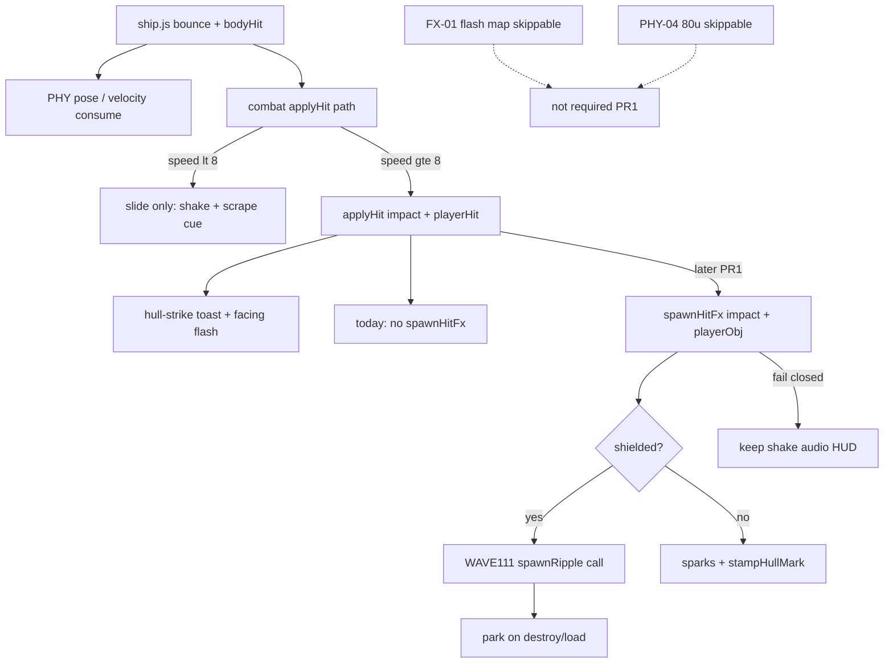

# RIMWARD FX remaining scrape / collision punch

| Field | Value |
|---|---|
| **Title** | RIMWARD FX remaining scrape / collision punch |
| **Author** | Wave 113 FX scrape integrator; Wave 114 PR1 first impl |
| **Date** | 2026-08-24 |
| **Status** | Wave 114 first impl. PR1 scrape `spawnHitFx` on combat damaging `bodyHit` applyHit. |
| **Wave** | 114 — first impl. Wave 113 census below stays historical. |
| **Owner request** | Wave 111 landed FX-01 hull-local **weapon** shield ripple (`docs/Fx01RemainingDesign.md` — **cite, do not rewrite**). Census whether PHY `bodyHit` (player ram / scrape) still has **no** `spawnHitFx`. If real, freeze a later serial that can give rams the same **world punch family** without stealing PHY bounce/damage, without retuning Wave 112 impact knobs, without a hub pip, without a new Digit, without `state.js` write, without a new persist key, without `innerHTML`, without rewriting recoil/shake/mark pool/`spawnRipple` parent as the feature. |
| **Merge law** | [`out/w113/fxscrape/shared-contract.md`](../out/w113/fxscrape/shared-contract.md). If this brief and that file conflict, **the contract wins**. |
| **Honor** | HUD-01 empty hub. Digit 0 shipyard. Digit 8/9 stay. `state.js` READ-ONLY later. No new persist key. `innerHTML` forbidden later. No punch pip on `.rw-reticle`. Kit mutate omit. Recoil / mark pool 12 / WAVE111 weapon ripple **consume**. PHY-01 bounce **consume**. FX-02 music/radio stay closed. PHY-04 80 u and FX-01 flash map stay **skippable**, not required PR1. Do **not** edit sibling Bio/Nav/Msn/Rep/Phy/Shp/Tgt/Hud/Owner docs, the wishlist, `PROGRESS.md`, `docs/Fx01RemainingDesign.md`, `docs/Phy04AvoidDesign.md`, `docs/Phy05PadHomeDesign.md`. Do **not** write `docs/OwnerDecisionsWave113.md`. |

**Verifier record:**

| Note | Path |
|---|---|
| Inventory (code wins) | [`out/w113/fxscrape/current-fx-scrape-inventory.md`](../out/w113/fxscrape/current-fx-scrape-inventory.md) |
| Merge law | [`out/w113/fxscrape/shared-contract.md`](../out/w113/fxscrape/shared-contract.md) |
| Security review | [`out/w113/fxscrape/security-review.md`](../out/w113/fxscrape/security-review.md) |
| Design-doc review | [`out/w113/fxscrape/code-review.md`](../out/w113/fxscrape/code-review.md) |
| UI audit | [`out/w113/fxscrape/ui-audit.md`](../out/w113/fxscrape/ui-audit.md) |
| Weapon-ripple parent (cite) | [`docs/Fx01RemainingDesign.md`](./Fx01RemainingDesign.md) |
| Wave 114 probe | [`out/w114/fxscrape/probe.mjs`](../out/w114/fxscrape/probe.mjs) |
| Wave 114 security review | [`out/w114/fxscrape/security-review.md`](../out/w114/fxscrape/security-review.md) |
| Wave 114 code review | [`out/w114/fxscrape/code-review.md`](../out/w114/fxscrape/code-review.md) |
| Wave 114 UI audit | [`out/w114/fxscrape/ui-audit.md`](../out/w114/fxscrape/ui-audit.md) |

**Wave 114 first impl:** PR1 calls live `spawnHitFx` from the damaging `bodyHit` applyHit path in `combat.js`. Fail closed skip world FX. Inventory tables in this brief stay the Wave 113 pre-PR1 census. Do not read those “no spawnHitFx” rows as live code after this wave.

Siblings PHY, BIO, NAV, MSN, REP, SHP, TGT, HUD, FX-02/03, wishlist, `PROGRESS.md`, `docs/Fx01RemainingDesign.md`, `docs/Phy04AvoidDesign.md`, `docs/Phy05PadHomeDesign.md`, and `docs/OwnerDecisions*.md` are **other workers**. **Do not edit** those paths.

**This is not PHY bounce.** **This is not IMPACT retune.** **This is not weapon-ripple rewrite.** **This is not flash map.** **This is not 80 u.** **This is not HUD-01.** Wave 114 PR1 lands the scrape world punch. Wave 113 census tables below stay pre-PR1.

---

## Overview

Wave 111 parented shielded **weapon** ripples to the struck host. Recoil, marks, shake, and PHY bounce are **LIVE**. Census (code wins): `spawnHitFx` has **two** callers, both bolt/seeker tests. Combat’s same-frame `bodyHit` applyHit path (combat ticks after ship) still has **no** `spawnHitFx`. Player rams already bounce, already peel screen/hull above 8 u/s, already shake, already play `bodyHit` + `playerHit` audio, already toast `'▲ Hull strike.'` when damage > 0. They still leave **no** flash / ring / sparks / scorch on the hull.

This leftover is **real**. Do **not** freeze CONSUME.

This brief is the integrator document for a **later** implementation wave. Wave 113 this worker lands markdown only. Bindings do not change here.

HUD-01 empty aim glass stays empty. `state.js` stays READ-ONLY. No new persist key. Digit 0 stays shipyard. Digit 8/9 stay. Do not invent UU. Do not steal MATCH/hover/AP. Do not reopen music/radio. Do not retune `PHY.IMPACT_MIN_SPEED` 8 or `PHY.IMPACT_SCREEN_PER_U` 0.35.

Wave 113 deputize (recorded here and in the contract; owner may override after playtest): on the existing damaging `bodyHit` applyHit path, pass a finite `playerObj` into live `spawnHitFx` the same way weapon hits do; park on destroy like weapons; `reducedMotion` keeps live snap; fail closed to today’s no-world-FX scrape.

---

## Background & Motivation

### Current state (inventory)

Source of truth: [`out/w113/fxscrape/current-fx-scrape-inventory.md`](../out/w113/fxscrape/current-fx-scrape-inventory.md). Code wins.

| Surface | Today | Cite |
|---|---|---|
| PHY emit | bounce then `bodyHit` `{kind, speed, damage: 0}` | `ship.js` 905–936 |
| Combat scrape | applyHit family `'impact'`; fill `e.damage`; emit `playerHit`; **no** `spawnHitFx` | `combat.js` 1840–1856 |
| Weapon NPC hit | `spawnHitFx(..., s.object)` | 1742 |
| Weapon player hit | `spawnHitFx(..., playerObj)` | 1799 |
| WAVE111 ripple | parent to host; FP player world-space | 1050–1106 |
| XOR | shielded ripple else sparks+mark | 1110–1117 |
| IMPACT knobs | min speed **8**; **0.35** / u/s | `physics.js` 11–12 |
| `RIPPLE_POOL` / marks | 16 / **12** | `combat.js` 186; `hull-marks.js` 7 |
| Shake | LIVE including `bodyHit` | `ship.js` 121–137, 1223–1228 |
| Recoil | LIVE cannon/disruptor | `ship.js` 1237–1263 |
| Audio | `bodyHit` + `playerHit` | `song.js` 51–63 |
| HUD toast | hull-strike if damage > 0 | `hud.js` **608–610**; write `pushToast` **1130–1150** |
| Facing flash | `playerHit` on `.rw-combat-self` | `hud.js` **863**, **1127–1128**, **1167–1169**, **1407–1417** |
| Hub | 80 px + RANGE | `hud.css` 184–193; `hud.js` **726–729** (RANGE pop **1392–1404**) |
| Digit 0 / 8 / 9 | shipyard / launch / Standing | `station.js` 188, 6098–6106 |
| Persist | no FX key in `WORLD_FIELDS` | `save.js` 76–101 |
| `reducedMotion` | snap FX; zero shake | `ctx.js` 217; `settings.js` 72 |

### Pain points

- A naive later PR that retunes IMPACT 8 / 0.35 reopens Wave 112 collision feel.
- A naive later PR that rewrites bounce in `ship.js` steals PHY-01.
- A naive later PR that rewrites `spawnRipple` parent reopens Wave 111.
- A naive later PR that adds a punch pip on the 80 px hub reopens HUD-01.
- A naive later PR that persists marks/ripples invents a `WORLD_FIELDS` key.
- A naive later PR that waits for a free ripple slot would freeze combat — forbidden.
- A naive later PR that toasts again on scrape duplicates `'▲ Hull strike.'`.
- A naive later PR that “consumes” `hud.js` 591–593 edits `worldEvent` copy and can add a second scrape toast. Bind toast to **608–610** + `pushToast` **1130–1150**. Grep `'▲ Hull strike.'`.
- A naive later PR that required flash map or 80 u as PR1 ships the wrong leftover.
- Putting extra pulse under `reducedMotion` would smash `body.rw-reduced-motion`.
- Stealing Digit 0/8/9 would smash shipyard, launch, Standing, or papers.
- Writing `WEAPONS.impact` would violate `state.js` READ-ONLY.
- Reopening music/radio would smash FX-02.
- Calling `spawnHitFx` on every slide (`speed < 8`) would spam rings on parking.

### Why now (design) / why not now (code)

The owner asked for the scrape leftover integrator so later serials can give **rams the same world punch family weapons already have**. Inventory shows bounce, damage, shake, audio, toast, and weapon `spawnHitFx` — scrape FX is the hole. Merge law can exist without touching `src/`. Implementation waits so hub theft, Digit theft, `state.js` writes, IMPACT retune, bounce steal, freeze-on-busy-pool, and skippable-PR theft are frozen before the first scrape `spawnHitFx`. Wave 113 this worker does not ship `src/`.

---

## Goals & Non-Goals

### Goals

1. Document live `bodyHit` emit, combat applyHit, `spawnHitFx` callers, WAVE111 parent, shake, song, HUD, Digit, persist from **live code**.
2. Freeze leftover as **REAL** (not CONSUME).
3. Freeze **reuse** of `spawnHitFx` / `RIPPLE_POOL` / WAVE111 parent. No third pool. Call, do not rewrite parent law.
4. Freeze persist: **none**. Scene only.
5. Freeze recoil / mark pool / shake / bounce / IMPACT_* as **consume**.
6. Freeze no new Digit, no `state.js` write, no UU, no punch pip, no extra toast.
7. Freeze FX-02 music/radio closed. Flash map / 80 u **not** required PR1.
8. Freeze fail-closed: skip world FX; keep shake+audio+HUD+damage; **never** freeze sim; **never** zero speed.
9. Freeze `reducedMotion` mute of extra pulse (live snap stays).
10. Freeze a serial PR plan. This wave writes the brief. A later wave ships serially.

### Non-goals (locked — do not reopen)

- No `src/` or live bindings in this worker.
- No bounce steal. No collision-proxy change.
- No IMPACT_* / SUN_* retune.
- No recoil rewrite. No mark-pool resize. No shake retune as the leftover.
- No `spawnRipple` parent rewrite.
- No required flash map. No required PHY-04 80 u.
- No HUD-01 hub child. No RANGE rewrite. No punch combo meter.
- No new Digit. No extra toast.
- No `WEAPONS.impact`. No invented UU or SKU.
- No persist `world.hullMarks`. No new settings checkbox.
- Do not reopen FX-02 music/radio or FX-03 aftermath.
- Do not steal NAV, MATCH, hover, AP, PHY-04, PHY-05, BIO gait, sun FX.
- Do not edit the wishlist, `PROGRESS.md`, Bio*, Nav*, Msn*, Rep*, Phy*, OwnerDecisions*, `docs/Fx01RemainingDesign.md`, `docs/Phy04AvoidDesign.md`, `docs/Phy05PadHomeDesign.md`.
- Do not write `docs/OwnerDecisionsWave113.md`.
- Do not fix known boot FAILs.

---

## Proposed Design

### 1. Merge resolutions (contract wins)

| Question | Integrator freeze | Why |
|---|---|---|
| Leftover real? | **Yes.** No scrape `spawnHitFx` | Inventory §0, §3, §12 |
| New persist key? | **No** | Marks/ripples scene only |
| `state.js` write? | **No** | Contract §0.5 |
| Rewrite bounce? | **No** | PHY-01 consume |
| Retune IMPACT_*? | **No** | Wave 112 knobs |
| Rewrite WAVE111 parent? | **No** | Call `spawnHitFx` only |
| Grow mark pool? | **No** | WAVE59 pin 12 |
| Required PR1 flash map? | **No** | Skippable |
| Required PR1 80 u? | **No** | Skippable |
| Third FX pool? | **No** | Reuse `spawnHitFx` |
| Extra toast? | **No** | Hull-strike LIVE |
| Fail closed? | Skip FX; never stop | Owner |
| `reducedMotion`? | Live snap; no extra pulse | Live ripple / sparks |
| First-person player host? | WAVE111 world-space | Consume |
| HUD / Digit / SKU? | **No** | Frozen |
| First serial steal Digit 0/8/9? | **No** | Contract §0.3 |
| User shader from save? | **No** | Contract §0.4 |

### 2. Current scrape motion (do not break bounce / damage / weapon FX)

See inventory §§2–7. Load-bearing loops:

**Player ram today**

1. `ship.js` slides the hull and emits `bodyHit` (damage 0) on gap 0.15 s.
2. Combat, same frame, may `applyHit` if speed ≥ 8, gap 0.2 s, kind ≠ `'player'`.
3. Combat fills `e.damage` and emits `playerHit` family `'impact'`.
4. Song plays `bodyHit` (emit) and `playerHit` (combat).
5. HUD toasts hull-strike if damage > 0; facing rail flashes on `playerHit`.
6. Next frame: camera shake from `lastEvents`.
7. **No** `spawnHitFx`. Hull is mute in the world.

**Weapon hit today (consume)**

1. `applyHit` + `spawnHitFx` with host.
2. Shielded: WAVE111 hull-local ring (FP player = world-space).
3. Unshielded: sparks + stamp pool 12.
4. Park on kill / load.

**This serial must not change** bounce math, IMPACT knobs, bolt pools, recoil, mark pool size, shake caps, song CUES, hub DOM, Digit map, `spawnRipple` parent. Additive: **one** `spawnHitFx` call on the damaging scrape path.

Digit 0 and `DOCK_KEY_SERVICES` stay. Digit 8/9 stay.

### 3. Deputize table (copy of contract §0.1)

Owner may override after playtest. Do not park.

| Knob | Value |
|---|---|
| Fail-closed | skip `spawnHitFx` if host/pos bad; never `speed = 0`; never skip `applyHit` |
| Additive | call live `spawnHitFx(pos, 'impact', shielded, playerObj)` on damaging scrape; park like weapons |
| Pos | finite `playerObj.position`; do not extend `bodyHit` as a PHY feature |
| XOR | live `spawnHitFx` |
| Persist | none |
| Bounce / IMPACT / shake / recoil / marks / WAVE111 | consume LIVE |
| `reducedMotion` | live snap; no extra pulse |
| Alloc | reuse live pools |
| Missing host | today’s no-world-FX scrape |

PHY scrape still has no `spawnHitFx` (inventory §3). Later serial **calls** it. Do not steal PHY.

### 4. Neighbours

| Module | Scrape leftover does | Scrape leftover does not |
|---|---|---|
| `combat.js` 1b | later PR1 `spawnHitFx` + park-on-kill | IMPACT retune; sun FX |
| `combat.js` `spawnRipple` | **call** via `spawnHitFx` | rewrite parent |
| `ship.js` bounce / emit | none | steal pose; new event fields required |
| `collision.js` | none | proxy change |
| `physics.js` | read IMPACT/SUN copy | write knobs |
| `hull-marks.js` | **call** via XOR | resize pool |
| `song.js` | consume | music / radio / third cue |
| `hud.js` | none | hub child; extra toast |
| `save.js` | none | new `WORLD_FIELDS` |
| `state.js` | **read applyHit** | write; `WEAPONS.impact` |
| HUD-01 | none | punch pip |
| Digit 0/8/9 | cite freeze | bind FX |
| FX-01 flash map | cite skippable | required PR1 |
| PHY-04 80 u | cite skippable | required PR1 |

### 5. Serial PR plan

Matches contract §3. **Named only. Do not implement in Wave 113.**

| PR | Lands | Does not land |
|---|---|---|
| **PR1 scrape `spawnHitFx`** | Call live XOR on damaging `bodyHit` applyHit; finite host; park; reducedMotion snap; fail closed skip FX | `state.js`; Digit; persist; IMPACT; bounce; parent rewrite; shake; recoil; mark pool; HUD hub; music; flash map; 80 u |
| **Flash map** | **Not required.** Wave 111 optional stays skippable | Required with scrape PR1 |
| **PHY-04 80 u** | **Not required.** Stays skippable | Required with scrape PR1 |
| **PR2 census (optional skip)** | Re-grep scrape loop for `spawnHitFx` | New world field; hub pip |

First remaining serial is **PR1**. It must not steal Digit 0/8/9. It must not write `state.js`. Do not land flash map or 80 u as required PR1.

### 6. Picture

Reuse live cameras. No new chrome. Punch is the **same world family as a weapon hit** on the living hull: flash + ring if screens up, sparks + scorch if down. Not a HUD label.

No punch pip. RANGE stays TGT-01. Facing-rail flash stays on `.rw-combat-self`. Hull-strike toast stays the one PHY toast. No new toast.

---

## Player outcome (later serial; freeze here)

Ram a station or rock **above 8 u/s** with screens up. Bounce still peels you off. Damage still uses 0.35 / u/s. A family-tinted ring (energy fallback) sits on **your** hull and rides the tumble (chase/third). In first person the ring does **not** fill the glass (WAVE111 world-space). Camera still kicks. `bodyHit` grit and `playerHit` thud still play. `'▲ Hull strike.'` still uses the **one** live string (`hud.js` 608–610). Grind refresh extends that same `pushToast` key (`hud.js` 1133–1150). It does **not** add a second scrape toast.

Ram with screens down. Sparks and a scorch stamp. Pool 12 still recycles. Death still parks marks and ripples.

Nudge below 8 u/s. Slide only. No world FX. No hull-strike toast. Small speed shake may still play.

The 80 px hub stays empty. Digit 0 is still shipyard. No one sells “scrape punch.” `reducedMotion` still kills shake, spark emit, and extra ripple pulse. One static ring frame may still show.

**Bounce** is **not** this work. **IMPACT knobs** are **not** this work. **Weapon ripple parent** is **not** this work. **Flash map** is **not** this work. **80 u avoid** is **not** this work. **FX-02 audio** is **not** this work.

---

## Security

See [`out/w113/fxscrape/security-review.md`](../out/w113/fxscrape/security-review.md).

- XSS: no new DOM. `innerHTML` forbidden later.
- No user shaders / GLSL from save.
- Proto: no `for-in` merge from save into sprites.
- Persist: no new key; ripples never serialize.
- No secrets. No Digit theft. No UU.
- Fail-closed never freeze the sim. Busy pool never waits.
- Console-injected `bodyHit` already can applyHit (local client). Later FX must not trust `e.damage` for spawn size; use live speed gate already in the loop.

---

## Acceptance direction (implementation wave)

1. Damaging scrape `applyHit` path calls `spawnHitFx` with finite `playerObj` when pose is finite.
2. Fail closed: bad host / missing mesh / throw → today’s no-world-FX scrape. Never freeze. Never zero speed. Bounce / damage / shake / audio / HUD still play.
3. XOR unchanged. Kill still parks marks and ripples.
4. `reducedMotion` snaps one ripple frame then hides. Shake still zeros. Sparks still gated.
5. No new persist key. No `WEAPONS` new id. Digit 0 shipyard. Hub 80 px empty of new children. No extra toast.
6. WAVE54 / WAVE59 / WAVE111 pins still pass. IMPACT 8 / 0.35 unchanged. Optional later pin: scrape loop contains `spawnHitFx`.
7. No `innerHTML` on paths this serial touches.
8. Flash map and 80 u not required. Known boot FAILs untouched.

---

## Alternatives considered

| Alternative | Why not |
|---|---|
| Freeze CONSUME | Census: no scrape `spawnHitFx` |
| Required flash-map PR1 | Skippable Wave 111 PR2; not the scrape hole |
| Required 80 u PR1 | PHY-04 skippable; not FX |
| Retune IMPACT 8 / 0.35 | Wave 112 knobs; not world FX |
| Rewrite bounce in ship.js | PHY-01 consume |
| New scrape FX pool | CPU; `spawnHitFx` exists |
| Rewrite `spawnRipple` | Wave 111 consume; call it |
| Contact point on `bodyHit` | PHY event rewrite; origin pos is smaller |
| Punch pip on hub | HUD-01 |
| Digit / SKU / UU / `WEAPONS.impact` | Owner impersonation / `state.js` |
| Freeze until pool free | Availability bug |
| Second hull-strike toast | Duplicate |
| Music / radio | FX-02 closed |
| Sun-heat `spawnHitFx` | Not scrape |
| User shader | Security freeze |

---

## Regression risks

| Risk | Mitigation |
|---|---|
| Bounce / damage stolen | contract §0.12–0.13; no `ship.js` write |
| IMPACT knobs drift | copy live 8 / 0.35; not PR1 |
| WAVE111 parent rewritten | call only |
| Recoil / marks rewritten | §0.8–0.9; WAVE59 pins stay |
| Hub pip / Digit steal | §0.2–0.3 |
| `state.js` / new persist key | §0.5–0.6 |
| Toast spam | consume hull-strike; no new toast |
| `reducedMotion` pulse | live snap; no extra `@keyframes` |
| Freeze on busy pool | skip FX; never `speed = 0` |
| First-person glass flood | WAVE111 FP law |
| Slide-only ring spam | only applyHit path (speed ≥ 8) |
| Flash map / 80 u sneak into PR1 | contract §0.21 / §3 |
| Sibling docs / `src/` steal | this pack does not touch those paths |

---

## Ownership

| Object | Writer | Reader |
|---|---|---|
| scrape `spawnHitFx` call | later PR1 | XOR / parent |
| `spawnRipple` | **none** | call |
| bounce / IMPACT | **none** | consume |
| hull-mark / recoil / shake | **none** | consume |
| `state.js` | **none** | applyHit read |
| HUD / Digit | **none** | — |

---

## Open owner questions

**Deputized this wave** (contract §0.1). Owner may override after playtest. Do not park.

1. Leftover is **REAL**. Smallest additive = `spawnHitFx` on existing damaging `bodyHit` applyHit path. Fail closed = skip FX.
2. Bounce, IMPACT 8 / 0.35, WAVE111 parent, recoil, marks, shake stay LIVE consume.
3. No new persist key. Scene only.
4. Home: `combat.js` 1b. Not `state.js`. Not a new Digit. Not the hub. Not `ship.js`.
5. Flash map and PHY-04 80 u stay skippable. Not required PR1.
