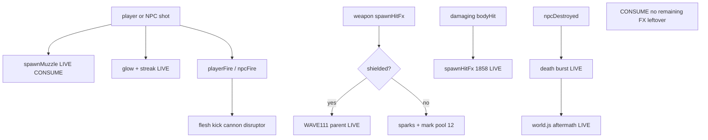

# RIMWARD remaining FX leftover after named FX slices

| Field | Value |
|---|---|
| **Title** | RIMWARD remaining FX leftover after named FX slices |
| **Author** | Wave 123 remaining-FX leftover integrator |
| **Date** | 2026-08-25 |
| **Status** | leftover **CONSUME**. Wave 123 markdown only. Named serial: **none**. Name: **no remaining FX leftover.** |
| **Wave** | 123 — no `src/`. Bindings do not change here. |
| **Owner request** | Census **remaining FX leftover after named FX slices shipped**, from live code. Live FX already shipped FX-01/02/03 first pass (Wave 54); recoil + pooled hull scorches (Wave 59); hull-local shield ripple (Wave 111 `docs/Fx01RemainingDesign.md`); scrape punch `spawnHitFx` on damaging ram (Wave 114 `docs/Fx01RemainingScrapeDesign.md`); muzzle leftover CONSUME (Wave 114 `docs/Fx01RemainingMuzzleDesign.md` — name **no remaining FX-01 muzzle leftover**). Wishlist FX-01 still lists stronger muzzle, readable projectiles/beams, shield ripples, hull sparks, restrained shake, sounds, recoil, persistent marks. Code wins. If remaining leftover is already gone (named slices live; remaining wishlist bullets live or owner-omitted/skippable), freeze leftover **CONSUME** and named serial **none**. Name: **no remaining FX leftover.** If census finds a real remaining player-facing hole that is not a named skippable omit and not the already-CONSUME muzzle leftover, freeze leftover **REAL** and name later serial **PR1** (named only). Do **not** implement `src/`. Do not invent a hub pip, a new Digit, a new persist key, UU, SKU, kit mutate, aim-glass gauges, a hitscan combat beam, user shaders from save, or a second incoming-fire live region unless inventory proves a real hole. Do not steal WAVE111 `spawnRipple` parent. Do not steal scrape `spawnHitFx`. Do not retune IMPACT 8 / 0.35. Do not reopen muzzle CONSUME as REAL. |
| **Merge law** | [`out/w123/fxrest/shared-contract.md`](../out/w123/fxrest/shared-contract.md). If this brief and that file conflict, **the contract wins**. |
| **Honor** | HUD-01 empty 80 px hub. No punch pip on `.rw-reticle`. Aim-glass gauges stay off. Kit mutate omit. Digit 0 shipyard. Digit 8/9 stay. No new Digit. `state.js` READ-ONLY. No new persist key. `innerHTML` forbidden later. Recoil / mark pool 12 / hull-local ripple / scrape / muzzle CONSUME: cite, do not steal. FX-02 music/radio stay closed. PHY-04 80 u skippable. FX-01 flash map skippable. Do not “fix” known boot FAILs (REDMARCH `castMatches` flake). Do **not** write `docs/OwnerDecisionsWave123.md`. Do **not** edit wishlist, `PROGRESS.md`, `docs/Fx01RemainingDesign.md`, `docs/Fx01RemainingScrapeDesign.md`, `docs/Fx01RemainingMuzzleDesign.md`, `docs/OwnerDecisions*`, sibling Wave 123 packs. Do **not** steal `out/w123/phyrest/**`, `out/w123/astrest/**` (read ok). |

**Verifier record:**

| Note | Path |
|---|---|
| Inventory (code wins) | [`out/w123/fxrest/current-fx-remaining-inventory.md`](../out/w123/fxrest/current-fx-remaining-inventory.md) |
| Merge law | [`out/w123/fxrest/shared-contract.md`](../out/w123/fxrest/shared-contract.md) |
| Security review | [`out/w123/fxrest/security-review.md`](../out/w123/fxrest/security-review.md) |
| Design-doc review | [`out/w123/fxrest/code-review.md`](../out/w123/fxrest/code-review.md) |
| UI audit | [`out/w123/fxrest/ui-audit.md`](../out/w123/fxrest/ui-audit.md) |
| Weapon-ripple parent (cite) | [`docs/Fx01RemainingDesign.md`](./Fx01RemainingDesign.md) |
| Scrape punch (cite) | [`docs/Fx01RemainingScrapeDesign.md`](./Fx01RemainingScrapeDesign.md) |
| Muzzle CONSUME (cite) | [`docs/Fx01RemainingMuzzleDesign.md`](./Fx01RemainingMuzzleDesign.md) |

Siblings PHY rest (`out/w123/phyrest/**`), AST rest (`out/w123/astrest/**`), HUD toast, Incoming fire., wishlist, and `PROGRESS.md` are **other workers**. **Do not edit** those paths. **Do not write** `src/`.

**This is not PHY bounce.** **This is not AST.** **This is not HUD toast.** **This is not Incoming fire. toast.** **This is not muzzle PR1.** Remaining FX leftover after named slices is **already gone**.

---

## Overview

Wave 54 shipped FX-01/02/03 first pass: pooled muzzle, family-tinted bolt glow/streak, shield ring, sparks, `playerFire`, restrained shake, combat audio, death burst. Wave 55 shipped the mining lance. Wave 59 shipped visible recoil and a pool of 12 hull scorches. Wave 111 parented shielded weapon ripples to the struck host. Wave 114 scrape punch **calls** live `spawnHitFx` on damaging ram. Wave 114 muzzle leftover is **CONSUME** (name **no remaining FX-01 muzzle leftover**). FX-03 lasting wrecks already live in `world.js`.

Census (code wins): remaining FX leftover after those named slices is **not** missing. A crank-muzzle serial would reopen Wave 114 CONSUME. A hitscan combat beam would smash the projectile charter. A hub punch pip would smash HUD-01. Flash map and PHY-04 80 u stay skippable. Music/radio stay closed.

This leftover is **CONSUME**. Name: **no remaining FX leftover.** Do **not** freeze a remaining-FX serial. Wishlist FX-01 bullets are **stale vs code** (or skippable/closed). Muzzle CONSUME stays CONSUME.

This brief is the integrator document. Wave 123 this worker lands markdown only. Bindings do not change here.

HUD-01 empty aim glass stays empty. `state.js` stays READ-ONLY. No new persist key. Digit 0 stays shipyard. Digit 8/9 stay. Do not invent UU. Do not steal WAVE111 parent. Do not steal scrape. Do not retune IMPACT 8 / 0.35.

Wave 123 deputize (recorded here and in the contract; owner may override after playtest): **do not invent remaining FX work**. Fail closed to today’s named slices. Never freeze the sim. Muzzle CONSUME stays CONSUME.

If census had proved a real remaining hole that is not a named skippable omit and not the already-CONSUME muzzle leftover, this pack would freeze **REAL** and name serial **PR1**. Census did not.

---

## Background & Motivation

### Current state (inventory)

Source of truth: [`out/w123/fxrest/current-fx-remaining-inventory.md`](../out/w123/fxrest/current-fx-remaining-inventory.md). Code wins.

| Surface | Today | Cite |
|---|---|---|
| Muzzle | pooled glow-dot, FP-safe, family tint | `combat.js` **185**, **609–624**, **1008–1029** |
| Bolts | glow + streak; `PROJ_RADIUS` 0.4 | **187**, **426–541** |
| Mining lance | ribbon + core + contact glow | **695–759** |
| WAVE111 ripple | parent to host; FP player world-space | **1050–1106** |
| XOR | shielded ripple else sparks+mark | **1110–1116** |
| Scrape | `spawnHitFx` on damaging `bodyHit` | **1858–1860** |
| Marks | pool **12** | `hull-marks.js` **7** |
| Recoil / shake | LIVE cannon/disruptor; caps 0.35 / 0.12 | `ship.js` **121–137**, **1203–1264** |
| Audio | `playerFire` / `npcFire` / `playerHit` / `bodyHit` | `song.js` **51–69** |
| Death / wreck | burst + `aftermath` meshes | `npc.js` **2340–2341**; `world.js` **1322–1338**, **1890–1908** |
| IMPACT knobs | min speed **8**; **0.35** / u/s | `physics.js` **11–12** |
| Hub | 80 px + RANGE | `hud.css` **184–193**; `hud.js` **781** |
| Digit 0 / 8 / 9 | shipyard / launch / epics | `station.js` **188** |
| Persist | no FX sprite key; `aftermath` already | `save.js` **77–101** |
| `reducedMotion` | snap FX; zero shake | `ctx.js` **217**; `settings.js` **72** |

The player who fires, hits shields, rams above 8 u/s, sees sparks and scorches, hears barks, and finds a wreck already has the FX stack. Wishlist FX-01 bullets are **stale vs code**.

### Pain points

- A naive later PR that “adds remaining FX” would **double-ship** muzzle, ripple, scrape, recoil, or marks.
- A naive later PR that reopens muzzle CONSUME as REAL inverts Wave 114.
- A naive later PR that rewrites `spawnRipple` parent reopens Wave 111.
- A naive later PR that edits scrape `spawnHitFx` (1858–1860) steals Wave 114 punch.
- A naive later PR that retunes IMPACT 8 / 0.35 reopens Wave 112 collision feel.
- A naive later PR that adds a punch pip on the 80 px hub reopens HUD-01.
- A naive later PR that maps `glowTex` onto hit `spawnFlash` as required PR1 ships skippable flash map.
- A naive later PR that invents a hitscan combat beam violates the projectile charter.
- A naive later PR that persists muzzle sprites invents a `WORLD_FIELDS` key.
- `innerHTML` of FX copy is XSS.
- Inventing “CONSUME is boring, add remaining FX anyway” invents work the owner forbade.

### Why now (design) / why not now (code)

The owner asked for a remaining-FX census so later serials do **not** steal WAVE111 parent, scrape, IMPACT, HUD, or muzzle CONSUME while chasing a hole named slices already closed. Inventory shows named slices **LIVE** and **no** second unnamed FX hole. Merge law can exist without touching `src/`. Implementation does **not** wait — it **does not ship**. Wave 123 this worker does not write `src/`.

If census had proved a real remaining hole that is not skippable and not muzzle CONSUME, this pack would freeze **REAL** and name serial **PR1**. Census did not.

---

## Goals & Non-Goals

### Goals

1. Document live muzzle, bolts, lance, WAVE111 parent, scrape call, marks, recoil, shake, song, wreck, HUD, Digit, persist from **live code**.
2. Freeze leftover as **CONSUME** (not REAL). Name **no remaining FX leftover.**
3. Freeze **reuse** of named slices. No third pool. No crank PR.
4. Freeze muzzle leftover as **CONSUME**. Do not reopen as REAL.
5. Freeze WAVE111 parent / scrape `spawnHitFx` / recoil / marks / IMPACT_* as **cite-only consume**.
6. Freeze no new Digit, no `state.js` write, no UU, no punch pip, no extra toast, no second incoming-fire live region.
7. Freeze FX-02 music/radio closed. Flash map / 80 u **not** required PR1.
8. Freeze a serial PR plan with **no implementation PR1**.

### Non-goals (locked — do not reopen)

- No `src/` or live bindings in this worker.
- No muzzle / `PROJ_RADIUS` / glow / lance retune as leftover.
- No hitscan combat beam.
- No scrape steal. No WAVE111 parent rewrite. No IMPACT_* retune.
- No recoil rewrite. No mark-pool resize. No shake retune as the leftover.
- No required flash map. No required PHY-04 80 u.
- No HUD-01 hub child. No RANGE rewrite. No fire combo meter.
- No new Digit. No extra toast. No second incoming-fire live region.
- No `WEAPONS` extra ids. No invented UU or SKU.
- No persist `world.fx`. No new settings checkbox.
- Do not reopen FX-02 music/radio.
- Do not steal PHY bounce, AST, HUD toast, Incoming fire.
- Do not edit the wishlist, `PROGRESS.md`, Fx01 remaining/scrape/muzzle, OwnerDecisions*.
- Do not write `docs/OwnerDecisionsWave123.md`.
- Do not steal `out/w123/phyrest/**`, `out/w123/astrest/**`.
- Do not fix known boot FAILs.

---

## Proposed Design

### 1. Merge resolutions (contract wins)

| Question | Integrator freeze | Why |
|---|---|---|
| Leftover real? | **No. CONSUME.** | Inventory §0: named slices LIVE; no second unnamed hole |
| Named PR1? | **None** | CONSUME |
| Reopen muzzle CONSUME? | **No** | Wave 114; contract §0.8 / §0.21 |
| New persist key? | **No** | Scene FX; `aftermath` already exists |
| `state.js` write? | **No** | Contract §0.5 |
| Steal WAVE111 parent? | **No** | Consume |
| Steal scrape `spawnHitFx`? | **No** | **1858–1860** |
| Retune IMPACT 8 / 0.35? | **No** | Wave 112 knobs |
| Required flash map / 80 u? | **No** | Skippable |
| Hub pip / Digit / hitscan / shaders? | **No** | Frozen |
| Fail closed? | skip pop; never stop | Owner |
| Wishlist FX-01 bullets? | Stale or skippable; code wins | Named slices landed |

### 2. Current FX motion (do not break named slices)

See inventory §§3–8. Load-bearing loop:

**Today (consume)**

1. Player or NPC shot leaves a pool. `spawnMuzzle` pops. Glow-streak bolt flies. Recoil kicks cannon/disruptor. `playerFire` barks.
2. Weapon hit: `spawnHitFx` XOR — shielded WAVE111 parented ripple, else sparks + mark.
3. Damaging ram above 8 u/s: scrape `spawnHitFx` + hull-strike toast + shake + `bodyHit` audio.
4. Kill: death burst then `world.js` wreck aftermath. Marks/ripples park.
5. `reducedMotion` snaps muzzle/ripple one frame and zeros shake.

**This serial must not change** `spawnMuzzle`, `spawnRipple` parent, scrape call, bolt pools, `PROJ_RADIUS`, recoil math, mark pool size, shake caps, song CUES, hub DOM, Digit map, IMPACT_*. Additive: **none**.

Digit 0 and `DOCK_KEY_SERVICES` stay. Digit 8/9 stay.

### 3. Deputize table (copy of contract §0.1)

Owner may override after playtest. Do not park. Do not invent work.

| Knob | Value |
|---|---|
| Verdict | **CONSUME** |
| Fail-closed | skip pop if pool busy; never `speed = 0`; never pause |
| Additive | **none** |
| Persist | none new |
| Muzzle leftover | stays CONSUME |
| WAVE111 / scrape / recoil / marks | consume LIVE |
| Flash map / 80 u | skippable |
| Music / radio | closed |
| Alloc | reuse live pools |
| Missing host | today’s named slices |

Remaining FX already has the full named stack (inventory §0). Later serial **does not add a helper**. Do not steal scrape or WAVE111 parent.

### 4. Neighbours

| Module | Remaining FX leftover does | Remaining FX leftover does not |
|---|---|---|
| `combat.js` `spawnMuzzle` | **none** (CONSUME) | crank; new pool; reopen REAL |
| `combat.js` `spawnRipple` | **none** | rewrite parent |
| `combat.js` scrape `spawnHitFx` | **none** | steal **1858–1860** |
| `ship.js` bounce / recoil | none | steal pose; rewrite kick |
| `physics.js` | read IMPACT copy | write knobs |
| `hull-marks.js` | none | resize pool |
| `song.js` | consume | music / radio / third cue |
| `world.js` wreck | none | second aftermath path |
| `hud.js` | none | hub child; extra toast; second incoming-fire region |
| `save.js` | none | new `WORLD_FIELDS` |
| `state.js` | **read-only later** | write |
| HUD-01 | none | punch pip |
| Digit 0/8/9 | cite freeze | bind FX |
| PHY rest / AST rest | none | steal sibling packs |

### 5. Serial PR plan

Matches contract §3. **Named only. Do not implement in Wave 123.**

| PR | Lands | Does not land |
|---|---|---|
| **PR1 remaining FX** | **Does not exist.** Leftover CONSUME | hub pip; Digit; persist; hitscan; shaders; IMPACT; scrape steal; parent rewrite; muzzle REAL; flash map; 80 u; music; incoming-fire region |
| **PR-census (optional skip)** | Re-grep `spawnMuzzle` + `host.add` + scrape `spawnHitFx` + `HULL_MARK_POOL === 12` | New world field; hub pip |

First remaining FX serial is **none**. It must not steal Digit 0/8/9. It must not write `state.js`.

### 6. Picture

Reuse live cameras. No new chrome. Punch is the **live** muzzle + bolt + WAVE111 ring + scrape flash + recoil + marks + wreck. Not a HUD label.

No punch pip. RANGE stays TGT-01. Facing-rail flash stays on `.rw-combat-self`. No new fire toast.

### 7. UI (specified later UI — CONSUME: already live)

See [`out/w123/fxrest/ui-audit.md`](../out/w123/fxrest/ui-audit.md).

**This wave:** no chrome.

**Later (none):** do not add FX chrome. Live punch is world sprites + flesh recoil + song + hull-strike toast already on scrape. Empty hub stays empty.

### 8. Events / persist / security

Prefer live `'playerFire'` / `'playerHit'` / `'bodyHit'` / `'npcDestroyed'`. No new frozen event. No new `WORLD_FIELDS` key for sprites.

Security freeze: `innerHTML` forbidden; no user shaders from save; proto-safe pose copy; no Digit theft.

### 9. Coupling

| Sibling | Boundary |
|---|---|
| WAVE111 ripple | cite parent; do not steal |
| Scrape punch | cite `spawnHitFx`; do not steal |
| Muzzle CONSUME | cite; do not reopen REAL |
| PHY bounce / IMPACT | consume knobs; do not retune |
| AST | not this leftover |
| HUD toast / Incoming fire. | siblings; no second live region |
| Fx01 remaining / scrape / muzzle briefs | cite only; do not edit |

---

## Player outcome (CONSUME; freeze here)

Fire a cannon, disruptor, dart, turret, or psionic shot. A family-tinted glow-dot pops at the nose. A glow-streak bolt leaves the pool. Recoil still kicks cannon/disruptor flesh. `playerFire` still barks.

Hit a shielded hull. The WAVE111 ring rides the host (first-person player stays world-space). Hit unshielded hull. Sparks plus a scorch from the pool of 12.

Ram a station above 8 u/s. Scrape already calls `spawnHitFx`. IMPACT 8 / 0.35 stay. Hull-strike toast still shows when damage > 0.

Kill a ship. A short death burst plays. `world.js` stages a wreck in `aftermath`. Marks and ripples park.

The 80 px hub stays empty. Digit 0 is still shipyard. No one sells “remaining FX.”

**Bounce** is **not** this work. **IMPACT knobs** are **not** this work. **Weapon ripple parent** is **not** this work. **Scrape punch** is **not** this work. **Muzzle leftover** is **not** this work (already CONSUME). **Flash map** is **not** this work. **80 u avoid** is **not** this work. **FX-02 music/radio** is **not** this work. **Incoming fire. toast** is **not** this work. **Wishlist status prose** is **not** this work (other worker).

---

## Risks & Mitigations (frozen; no PR1)

| Risk | Mitigation |
|---|---|
| Later worker invents remaining FX | Contract §0 / §3 CONSUME; inventory §0 |
| Later worker reopens muzzle as REAL | Contract §0.8 / §0.21; Wave 114 name |
| Later worker steals scrape / WAVE111 parent | Contract §0.8 |
| Later worker retunes IMPACT | Contract §0.12 |
| XSS on FX copy | `innerHTML` forbidden; live 0 |
| Digit / hub theft | Contract §0.2 / §0.3 |
| User shaders from save | Contract §0.4 |
| Sibling PHY/AST steal | Coupling §9 |

---

## Security (freeze)

- No `innerHTML` later. Combat `innerHTML` today: none.
- No user shaders / GLSL from save.
- Proto: no `for-in` merge from save into sprites.
- Persist: no new key; sprites never serialize. Existing `aftermath` stays wreck data.
- No secrets. No Digit theft. No UU.
- Fail-closed never freeze the sim. Busy pool never waits.

---

## Acceptance (CONSUME)

Verifier accepts this leftover freeze when:

1. Inventory + contract + this brief all say **CONSUME** / serial **none**.
2. Cites match live named slices (`spawnMuzzle`, WAVE111 `host.add`, scrape `spawnHitFx` **1858–1860**, `HULL_MARK_POOL === 12`, recoil `playerFire`, death burst / `aftermath`).
3. Worker wrote **no** `src/`.
4. Honor files untouched (wishlist, Fx01 remaining/scrape/muzzle, OwnerDecisions*, sibling packs).
5. Named serial PR1 **does not exist**.
6. Muzzle leftover is **not** reopened as REAL.

---

## Alternatives considered

| Alternative | Why not |
|---|---|
| Freeze leftover REAL + remaining-FX PR1 | Census: named slices LIVE; no second unnamed hole |
| Reopen muzzle CONSUME as REAL | Owner forbade; Wave 114 already closed fire-side |
| Required flash-map PR1 | Skippable; hit-side square, not remaining leftover |
| Required 80 u PR1 | PHY-04 skippable; not FX |
| Hitscan combat beam | Charter: weapons are projectiles |
| Steal scrape / WAVE111 parent | Named slices; do not steal |
| Punch pip on hub | HUD-01 |
| Digit / SKU / UU | Owner impersonation / `state.js` |
| Music / radio | FX-02 closed |
| User shader | Security freeze |

---

## Ownership

| Object | Writer | Reader |
|---|---|---|
| This leftover pack | Wave 123 markdown | integrator |
| `spawnMuzzle` / bolts / lance | **none** (muzzle CONSUME) | fire loops |
| scrape `spawnHitFx` | **none** (Wave 114) | XOR / parent |
| `spawnRipple` | **none** (Wave 111) | call |
| bounce / IMPACT | **none** | consume |
| hull-mark / recoil / shake | **none** | consume |
| `state.js` | **none** | WEAPONS read |
| HUD / Digit | **none** | — |

---

## Open owner questions

**Deputized this wave** (contract §0.1). Owner may override after playtest. Do not park.

1. Leftover is **CONSUME**. Name: **no remaining FX leftover.** Smallest additive = **none**. Fail closed = today’s named slices.
2. Muzzle leftover stays **CONSUME**. Bounce, IMPACT 8 / 0.35, WAVE111 parent, scrape `spawnHitFx`, recoil, marks, shake stay LIVE consume.
3. No new persist key. Scene FX. Existing `aftermath` for wrecks.
4. Home: **none**. Not `state.js`. Not a new Digit. Not the hub.
5. Flash map and PHY-04 80 u stay skippable. Not required PR1.
