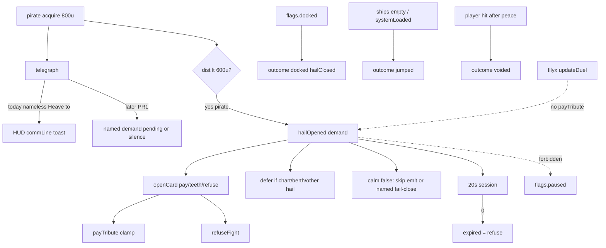

# RIMWARD Hail01 pirate demand lifecycle

| Field | Value |
|---|---|
| **Title** | RIMWARD Hail01 pirate demand lifecycle |
| **Author** | Wave 126 leftover integrator |
| **Date** | 2026-08-25 |
| **Status** | Wave 127 PR1 implemented. Named source, 20 s timer, dock/jump/expire/void outcomes, pirate-vs-player HEAVE-TO suppress. Leftover was **REAL**. Merge law: shared-contract.md wins. |
| **Wave** | 127 — PR1 demand lifecycle. KeyH/J/L/M/P stay. Hail digits 1..n on an open demand card stay hail resolution. |
| **Owner request** | Inbox P1 HAIL/ENCOUNTERS leftover: Give pirate demands a full lifecycle. Census live hail.js / npc.js / hud demand toasts / overlay-policy / jump close. Code wins. If every pirate demand already has named source, timer, card-or-equal, dock/jump-safe close with visible outcome, and no orphan HEAVE-TO toast, freeze **CONSUME** and named serial **none**. Census: **not** live. Freeze leftover **REAL** and name later serial **PR1**. Hail02 is **not** this pack. |
| **Merge law** | [`out/w126/demand/shared-contract.md`](../out/w126/demand/shared-contract.md). If this document and that file conflict, **the contract wins**. |
| **Honor** | HUD-01 empty hub. Aim-glass gauges stay off. Kit mutate omit. Digit 0/8/9 stay. No new Digit. Hail digits 1..n on an OPEN demand card stay hail resolution (CTL-04 / `hailDigitsAllowed` — cite, do not reopen). KeyH/J/L/M/P stay. `innerHTML` forbidden later. Toasts stay `textContent`. HUD-04 8 s identical-key linger — do not reopen toast flood as a new channel; demand copy may use the existing toast API with a stable key. `state.js` READ-ONLY unless census proves a persist key is required (default **none**). Overlay mutex: hail/chart/berth exclusive; hail/chart/berth **never** write `flags.paused` (CTL-02 — **cite this collision**). AI-05 starter grace is who-when; do not retune pirate interest tables. Agent API must not become a cheat pay-tribute. Do **not** steal player-initiated hail miss-feedback (Hail02 sibling). Do **not** steal HUD-06 home marker, CTL-03 PR2, CTL-04 PR2, AI-05 PR2, HUD-04 rewrite, CTL-02 overlay mutex pause. Do **not** edit the wishlist, `PROGRESS.md`, `docs/AgentApiDesign.md`, `docs/Hud06HomeMarkerDesign.md`, `docs/Ctl*.md`, `docs/Nav*.md`, `docs/Hud04ToastFloodDesign.md`, `docs/Ctl02OverlayDesign.md`, or `docs/OwnerDecisions*.md`. |

**Verifier record:**

| Note | Path |
|---|---|
| Inventory (code wins; Wave 126 census) | [`out/w126/demand/current-hail-demand-inventory.md`](../out/w126/demand/current-hail-demand-inventory.md) |
| Merge law | [`out/w126/demand/shared-contract.md`](../out/w126/demand/shared-contract.md) |
| Wave 126 security review | [`out/w126/demand/security-review.md`](../out/w126/demand/security-review.md) |
| Wave 126 design-doc review | [`out/w126/demand/code-review.md`](../out/w126/demand/code-review.md) |
| Wave 126 UI audit | [`out/w126/demand/ui-audit.md`](../out/w126/demand/ui-audit.md) |
| Wave 126 notes | [`out/w126/demand/notes.md`](../out/w126/demand/notes.md) |

Siblings Hail02, Agent API, HUD-06, CTL-02 overlay, HUD-04 toast flood, CTL-03 berthHold, CTL-04 menu digits, AI-05 starter grace, wishlist, and `PROGRESS.md` are **other workers**. **Do not edit** those paths. **Do not** write `src/`. **Do not** steal sibling Wave 126 paths (`out/w126/agentapi/**`, `out/w126/homemarker/**`).

**This is not CTL-02 hail/chart pause.** **This is not HUD-06 station pip.** **This is not Agent API.** **This is not player-H-on-friendly feedback.** Wishlist pirate demand lifecycle is **INBOX**. Census still finds **orphan HEAVE-TO + no timer + jump silent close**.

---

## Overview

Inbox source (`docs/PLAYER-EXPERIENCE-WISHLIST.md` Idea inbox — Playtest capture 2026-08-25 second pass — **cite, do not edit**):

> INBOX (P1, HAIL/ENCOUNTERS): Give pirate demands a full lifecycle. The "HEAVE TO. CARGO OR HULL." toast names no ship, range, deadline, or way to comply; it persisted while docked, reappeared after a gate jump, and expired silently. One demand (Ninth Tooth) opened a proper pay-or-fight card; the Carver Illyx demands never did, and a gate jump closed an open card mid-choice with no resolution. Every demand needs a source, a timer, a compliance path, and a visible outcome. Extends the captured hail-feedback item, which covers player-initiated actions only.

Sibling hail-feedback (`docs/PLAYER-EXPERIENCE-WISHLIST.md` **93–98**) is **Hail02**. Do **not** write Hail02.

Wave 126 this worker lands markdown only. Bindings do not change here.

Census (code wins): Live HEAVE-TO is hunt telegraph `commLine` `'Heave to. Cargo or hull.'` (`npc.js` **1688**), toasted **without** ship name (`hud.js` **568**). Wave 30 demand is a **separate** `hailOpened` with line `'Your cargo or your hull.'` (`npc.js` **2036**) and intents `payTribute` / `showTeeth` / `refuseFight`. HUD does **not** toast `hailOpened`. Demand has **no** deadline. `hail.js` despawn/jump path `closeCard()` **without** `hailClosed` (`hail.js` **497–500**; `jump.js` **121–126**). Dock does not close an open demand. Carver Illyx is `role: 'ace'` / `updateDuel` and **never** emits pirate demand (`world.js` **408–414**; `npc.js` **230–232**). Ninth Tooth is a pirate and **can** open the pay-or-fight card. Leftover is **REAL**.

This leftover is a **named incoming pirate demand lifecycle**: source, session timer, Wave 30 card as compliance, dock/jump/timeout/void outcomes. It is not a new Digit. It is not overlay pause. It is not Illyx tribute. It is not Agent credit cheat.

This document is the integrator for a **later** implementation wave.

HUD-01 empty aim glass stays empty. `state.js` stays READ-ONLY. No new persist key. Digit 0/8/9 stay. KeyH/J/L/M/P stay. Do not invent UU. Do not steal Hail02. Do not claim `hud.js` layout.

Wave 126 deputize (recorded here and in the contract; owner may override after playtest): pirate hunt demand only; **20 s** session timer; dock **closes** with named outcome; jump **resolves** `jumped` before silent card death; Illyx/ace **stay duel** (no `payTribute`); suppress nameless HEAVE-TO as a second unpaid channel; fail-closed finite demand; overlay never paused.

If census had proved source + timer + compliance + dock/jump-safe visible outcome + no orphan HEAVE-TO already live, this pack would freeze **CONSUME** and name serial **none**. Census did not. That CONSUME path is unexpected.

---

## Background & Motivation

### Current state (inventory)

Source of truth: [`out/w126/demand/current-hail-demand-inventory.md`](../out/w126/demand/current-hail-demand-inventory.md). Code wins.

| Surface | Today | Cite |
|---|---|---|
| Pirate telegraph | `'Heave to. Cargo or hull.'` if `!demanding` | `npc.js` **1686–1688** |
| Ace telegraph | `'Run if you like.'` (+ recognition) | `npc.js` **2151–2186** |
| Demand emit | pirate, player target, 600 u, grace, 300 s record cooldown | `npc.js` **2008–2036** |
| Demand line | `'Your cargo or your hull.'` | `npc.js` **2036** |
| Intents | pay / teeth / refuse | `npc.js` **1477–1482**; `hail.js` **39–57** |
| Card header | `HAIL — {speaker}` | `hail.js` **369** |
| HUD `hailOpened` | not toasted | `hud.js` **677–678** |
| HUD `commLine` | text only; drops `from` | `hud.js` **560–568** |
| Toast life / linger | 4 s / 8 s | `hud.js` **64**, **66** |
| Jump close | ships empty → `closeCard` no `hailClosed` | `jump.js` **121–126**; `hail.js` **497–500** |
| Dock | no new demand; open card stays | `npc.js` **1913–1915** |
| Overlay defer | chart/berth only | `overlay-policy.js` **107–116** |
| Other-card steal | `if (open) continue` | `hail.js` **459** |
| Overlay paused write | **never** | `overlay-policy.js` **4** |
| `hailDigitsAllowed` | pause / surface / chart / berth | `overlay-policy.js` **175–185** |
| Illyx | ace duel; no demand block | `world.js` **408–414** |
| `berthHold` | session; not demand close | `overlay-policy.js` **187–204** |
| Starter grace | blocks demand emit | `npc.js` **2023**, **1755** |
| Pay debit | `max(0, credits - (demand ?? 0))` | `hail.js` **253** |

The player who hears HEAVE-TO at 800 u has no ship name, no pay path, and no deadline. The player who gets Ninth Tooth’s card can pay. The player who faces Illyx never gets that card. A gate jump deletes the card with no `hailClosed` and no toast.

### Pain points

- Telegraph toast **impersonates** a demand and then **expires silently**.
- Demand card **is** the compliance path, but only after 600 u, and only for `role === 'pirate'`.
- Jump midpoint empties `ctx.ships` (`jump.js` **126**) **before** hail `update` (`main.js` **122–129**). Hail treats missing ship as a quiet hide.
- Dock leaves `ai.demanding` true (`breakOff` does not clear it) and does not hide the card.
- `if (open) continue` **drops** a demand `hailOpened` when another hail is up.
- NaN cargo units → NaN demand → NaN credits (`state.js` **1134–1136**; `hail.js` **253**).
- A naive later PR that pauses the sim **fights CTL-02**.
- A naive later PR that toasts every `hailOpened` **reopens HUD-04 flood**.
- A naive later PR that adds Agent `payTribute` **cheats credits**.
- A naive later PR that puts `payTribute` on Illyx **steals ace duel**.
- A naive later PR that teaches KeyH miss copy **steals Hail02**.
- A naive later PR that `innerHTML`s `{name}` is XSS.
- Putting a persist demand clock impersonates the owner (god-mode mute / forever parley).

### Why now (design) / why not now (code)

The owner asked for the Hail01 leftover integrator so a later serial can give incoming pirate demands a source, a timer, a compliance path, and a visible close **before** the first hail.js jump-outcome write. Inventory shows two channels (telegraph vs Wave 30 card), Illyx out of the pirate emit, and silent jump/dock. Merge law can exist without touching `src/`. Implementation waits so pause-collision, Agent cheat, Hail02 theft, HUD layout theft, interest retune, and persist clocks are frozen before the first close. Wave 126 this worker does not ship `src/`.

If census had proved the lifecycle already live, this pack would freeze **CONSUME** and name serial **none**. Census did not.

---

## Goals & Non-Goals

### Goals

1. Document live demand emit, telegraph toast, card open conditions (Illyx vs pirate), dock persistence, jump/systemLoaded close, overlay defer, calm, Wave 30 intents, Wave 125 berthHold / starter grace / hail digits from **live code**.
2. Freeze leftover = **incoming pirate demand lifecycle**. Not Hail02. Not overlay pause. Not Agent API.
3. Freeze deputize: timer **20 s**, dock **closes**, jump **resolves**, Illyx **not** tribute. Owner may override after playtest. Do not park.
4. Freeze credits: finite clamp, `demandMin` floor, no NaN wallet, no persist god-mode, overlay not paused.
5. Freeze persist: **none** new. `state.js` READ-ONLY. No UU. No SKU. No new Digit.
6. Freeze HUD-01 empty hub. Digit 0/8/9 stay. KeyH/J/L/M/P stay. Hail digits 1..n stay resolution on an open card.
7. Freeze later copy via `textContent`. `innerHTML` forbidden. Named source + timer + outcome.
8. Freeze a serial PR plan. This wave writes the document. A later wave ships serially.

### Non-goals (locked — do not reopen)

- No `src/` or live bindings in this worker.
- No `flags.paused` write from hail / overlay-policy.
- No Hail02 player-H miss-feedback.
- No HUD-06 home marker. No `hud.js` layout. No HUD-04 slot/z rewrite.
- No Agent `payTribute` off-card. Do not edit `docs/AgentApiDesign.md`.
- No AI-05 pirate interest/spawn retune.
- No Illyx / Vane / Dresk deletion. No ace `payTribute`.
- No CTL-01 KeyJ remap. No `controls.js`.
- No CTL-03 berthHold rewrite.
- No `state.js` write. No WORLD_FIELDS. No new Digit.
- Do not edit the wishlist, `PROGRESS.md`, `docs/Ctl*.md`, `docs/Nav*.md`, `docs/Hud04ToastFloodDesign.md`, `docs/Ctl02OverlayDesign.md`, OwnerDecisions*.
- Do not write `out/w126/demand/verify/**`.
- Do not fix known boot FAILs.
- Do not steal sibling Wave 126 packs.

---

## Proposed Design

### 1. Merge resolutions (contract wins)

| Question | Integrator freeze | Why |
|---|---|---|
| Leftover real? | **Yes** | Inventory §6 |
| CONSUME? | **No**. Serial is **not** none | Census |
| New persist key? | **No** | Contract §0.5–0.6 |
| `state.js` write? | **No** | Contract §0.5 |
| Use `flags.paused`? | **No** | CTL-02 |
| Timer | **20 s** session | Contract §0.1 |
| Dock | close + named `docked` | Inbox persist-at-pad |
| Jump | `jumped` before silent hide | Inbox mid-choice |
| Illyx tribute? | **No** — ace duel | Census role |
| Orphan HEAVE-TO | suppress / replace named | Inbox toast |
| Agent payTribute? | **No** off-card | Contract §0.10 |
| Named PR1? | **PR1** demand lifecycle | REAL leftover |

### 2. Current demand motion (do not break Wave 30 / CTL-02 / HUD-04)

Wave 30 intents and numbering stay. `hailDigitsAllowed` stays hail resolution. Overlay mutex stays: at most one of hail/chart/berth. Incoming hail still defers while chart/berth open. Hail still does not pause. Toast linger 8 s stays. Starter grace still gates **emit**. `gate.js` remains the only `src/` `jumpRequested` writer (NAV-05 — cite, do not claim).

### 3. Deputize table (copy of contract §0.1)

Owner may override after playtest. Do not park.

| Knob | Value |
|---|---|
| Who | pirate hunt demand only |
| Illyx | duel; **no** tribute card |
| Timer | 20 s from emit |
| Dock | close named `docked` |
| Jump | close named `jumped` |
| Expire | named `expired` = refuse |
| HEAVE-TO | not a second unpaid channel |
| Source | speaker in text |
| Overlay | defer card; never `paused`; no demanding-without-surface |
| Credits | finite; demandMin floor |
| Persist | none |
| Copy | `textContent` only |
| Home | `hail.js` + `npc.js`; hud listeners only |

### 4. Neighbours

| Module | This leftover does | This leftover does not |
|---|---|---|
| `hail.js` | later PR1: timer text, dock/jump/despawn outcome, defer-if-busy, clamp debit | pause; Digit map; Hail02 KeyH miss |
| `npc.js` | later PR1: emit clamp; suppress orphan HEAVE-TO; expire/dock/jump clear demanding | interest tables; Illyx tribute; spawn mix |
| `hud.js` | later: `toastForEvent` demand branch / keyed toast | layout; hub; slots; linger window rewrite |
| `overlay-policy.js` | **read** defer / `hailDigitsAllowed` / `berthHeld` | pause write; mutex rewrite |
| `controls.js` | **none** | CTL-04 |
| `agent-api.js` | **none** | hailResolve steal / payTribute cheat |
| `state.js` | none | write |
| `jump.js` | **none** required (hail/npc observe empty ships / `systemLoaded`) | second `jumpRequested` |
| Title / settings | honor ladder | steal Enter / KeyO |

### 5. Serial PR plan

Matches contract §3. **Named only. Do not implement in Wave 126.**

| PR | Lands | Does not land |
|---|---|---|
| **PR1** demand lifecycle | named source; 20 s; Wave 30 card; dock/jump/expire/void outcomes; HEAVE-TO not nameless unpaid; NaN clamp | Illyx tribute; Hail02; Agent payTribute; HUD layout; overlay pause; persist; Digit; `innerHTML`; `controls.js` |
| **PR2 stills (optional)** | playtest stills | required with PR1 |
| **PR3 census (optional skip)** | re-grep nameless Heave to gone as demand | new world field |

First remaining serial is **PR1**. It must not steal Digit 0/8/9. It must not write `state.js`. It must not claim `controls.js` or `agent-api.js`. Do not land overlay pause as required PR1.

### 6. Picture

Reuse the live hail card. No new Digit. No hub pip. A pirate that closes to demand range names itself, names the UU, names the seconds, and offers pay / teeth / refuse. If the player docks, jumps, waits out the clock, or fires, the card **resolves** and a keyed toast says what happened. HEAVE-TO is not a ghost that follows through a pad and a gate. Illyx still duels. Pause is still P. Chart still does not pause.

---

## Player outcome (later serial; freeze here)

A Freehold pirate (Ninth Tooth or equal) hunts you outside the law zone after grace. You see a **named** hail: who, how many UU, how many seconds, and three verbs. Digit 1 pays the **finite** demand (wallet floors at 0). Digit 3 refuses; they fire. If you hide in the pad, the demand **ends** and the toast says it broke because you docked. If you take a gate with the card open, the toast says the demand dropped because you jumped. It does **not** come back as a nameless HEAVE-TO in the next system. If you ignore the clock, they fire and the toast says expired.

Carver Illyx still does **not** open a tribute card. His incoming line is duel telegraph, not `payTribute`.

KeyH on a friendly still does not grow miss-feedback here (Hail02). Agent still cannot debit tribute without the same open card a human uses.

`reducedMotion` is unchanged.

**Hail02** is **not** this work. **HUD-06** is **not** this work. **Agent API** is **not** this work. **CTL-02 pause** is **not** this work.

---

## Security

See [`out/w126/demand/security-review.md`](../out/w126/demand/security-review.md).

- Credits: finite demand; `demandMin` floor; never NaN wallet.
- XSS: no `innerHTML` for name / UU / timer. `textContent` only.
- Persist: no new key. No forever parley / god-mode mute.
- Overlay: never `flags.paused`.
- Agent: no off-card payTribute.
- Fail-closed: never throw; never pause.

---

## Acceptance direction (implementation wave)

1. Every pirate demand emit has a named source on card and on the announce/outcome toast.
2. Every such demand has a visible session timer (deputize 20 s).
3. Compliance stays Wave 30 card intents; `hailDigitsAllowed` still gates Digit 1..n.
4. Dock closes the demand with a named `docked` outcome. Card does not sit on the pad.
5. Jump / empty `ctx.ships` closes with named `jumped` and `hailClosed` (or equal named toast if the hull is already gone). Deferred hail drops.
6. Timer 0 = `expired` = refuse, named toast.
7. Nameless `'Heave to. Cargo or hull.'` is not an unpaid demand channel.
8. Illyx/ace still has no `payTribute` demand.
9. `flags.paused` stays false for hail (unless the player also tapped P).
10. No new `WORLD_FIELDS`. No `innerHTML`. No `controls.js`. No Agent cheat debit. No npc interest retune.
11. HUD-04 linger 8 s unchanged. No extra toast slots. Stable key.
12. Known boot FAILs untouched.

---

## Alternatives considered

| Alternative | Why not |
|---|---|
| Freeze CONSUME / serial none | Census: timer, jump outcome, named HEAVE-TO **not** live |
| Pause sim while demand open | CTL-02 collision |
| Toast every `hailOpened` | HUD-04 flood; salvage/bargain noise |
| Illyx `payTribute` card | Steals ace duel; census: Illyx is not a pirate demand emitter |
| Agent `act payTribute` | Credit cheat |
| Persist demand clock | Hostile forever parley / mute |
| New Digit | Digit map / HUD-01 |
| Hail02 KeyH miss copy | Sibling leftover |
| HUD home pip | HUD-06 |
| `innerHTML` name | XSS |
| Retune interest so demands stop | AI-05 steal; inbox asked lifecycle, not silence |

---

## Regression risks

| Risk | Mitigation |
|---|---|
| Overlay pause regression | overlay-policy still never writes `paused` |
| Toast flood | one stable demand key; do not toast all hailOpened |
| NaN credits | fail-closed finite clamp in emit and payTribute |
| Jump silent close | hail/npc resolve before/as ships empty |
| Dock persist | dock clears demanding + card |
| Illyx tribute creep | contract forbids ace payTribute |
| Agent cheat | do not claim agent-api; hailResolve = live card only |
| Hail02 steal | incoming pirate only |
| Digit 0/8/9 | no new Digit; 1..n stay hail resolve on open card |
| Starter grace mute | do not retune; keep emit gates |
| REDMARCH boot flake | do not “fix” |

---

## Ownership

| Object | Writer | Reader |
|---|---|---|
| Demand emit | later PR1 `npc.js` (live writer stays) | hail.js |
| Demand card / close | later PR1 `hail.js` | player; npc hold release |
| Timer / outcomes | later PR1 hail.js + npc.js | hud toast listener |
| Demand toast | later `hud.js` `toastForEvent` only | player |
| `flags.paused` | **none** (KeyP) | hailDigitsAllowed |
| `controls.js` | **none** (CTL-04) | — |
| `agent-api.js` | **none** | — |
| npc spawn / interest | **none** (AI-05) | — |
| `state.js` | **none** | demandMin / U / ECON read |
| Digit / station | **none** | — |
| HUD layout | **none** (HUD-06 / HUD-01) | — |

---

## Open owner questions

**Deputized this wave** (contract §0.1). Owner may override after playtest. Do not park.

1. Smallest additive = pirate demand source + 20 s timer + Wave 30 card + dock/jump/expire visible outcomes + suppress nameless HEAVE-TO. Do not use KeyP pause.
2. Illyx stays duel. No tribute card on ace.
3. Dock closes. Jump drops. Timer expire = refuse.
4. No new persist key.
5. Home: `hail.js` + `npc.js`. HUD listeners only. Not `controls.js`. Not `agent-api.js`. Not `state.js`.
6. Optional PR2 stills are skippable after playtest.
7. Leftover is **real**. Not CONSUME. Serial is **PR1**, not none.
