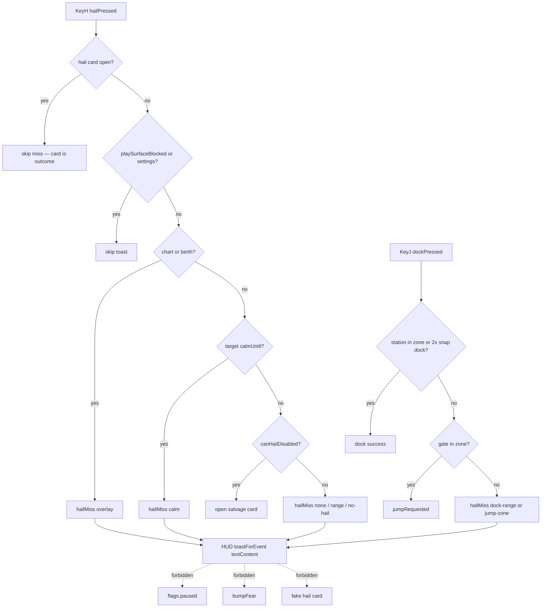

# RIMWARD Hail02 miss-feedback

| Field | Value |
|---|---|
| **Title** | RIMWARD Hail02 miss-feedback |
| **Author** | Wave 128 Hail02 leftover integrator |
| **Date** | 2026-08-26 |
| **Status** | Wave 129 PR1 implemented. Named serial **PR1**. Merge law: shared-contract.md wins. |
| **Wave** | 129 — PR1 miss-feedback (`hail.js` emit + HUD `toastForEvent` listener). KeyH/J/L/M/P stay. Hail digits 1..n on an open hail/demand card stay hail resolution. |
| **Owner request** | Inbox P1 HAIL/CONTEXT leftover: Make contextual actions name their subject, eligibility, and outcome. Census live hail.js player KeyH, HUD toast, overlay-policy, npc Fear, dock/jump KeyJ. Code wins. If player-initiated Hail/dock/jump/salvage already names subject + eligibility + outcome when the action does not open a card (including KeyH on a friendly / out of range / calm / overlay-blocked), freeze **CONSUME** and named serial **none**. Census: **not** live. Freeze leftover **REAL** and name later serial **PR1**. Hail01 demand lifecycle is **not** this pack. |
| **Merge law** | [`out/w128/hailmiss/shared-contract.md`](../out/w128/hailmiss/shared-contract.md). If this document and that file conflict, **the contract wins**. |
| **Honor** | HUD-01 empty 80 px hub. Aim-glass gauges stay off. Kit mutate omit. Digit 0/8/9 stay station. No new Digit. Hail digits 1..n on an OPEN hail/demand card stay hail resolution (CTL-04 / `hailDigitsAllowed` — cite, do not reopen). KeyH hail, KeyJ dock/jump, KeyL berth, KeyM chart, KeyP pause stay. Do not remap. `innerHTML` forbidden later. Toasts stay `textContent`. HUD-04 8 s identical-key linger — miss copy MAY use existing `pushToast` / `toastForEvent` with a **stable key**. Do not invent a second toast stack. `state.js` READ-ONLY. Default persist **none**. No UU. No SKU. No new WORLD_FIELDS. Overlay mutex CTL-02: hail/chart/berth exclusive; hail/chart/berth **never** write `flags.paused`. Hail01 demand lifecycle is live (Wave 127). Cite; do not retune 20 s timer, outcomes, HEAVE-TO suppress, Illyx. AI-05 starter grace is who-when. Do not retune pirate interest. Agent API must not become a cheat hail. Do not add `act({name:'hail'})` that bypasses range/calm. Do not steal HUD-07 layout, HUD-06 home marker, NAV-09 chart zoom. Do not steal dock/jump bind (CTL-01 KeyJ). Dock/jump miss copy is Hail02 **only if** census shows those actions also silent; census **does** — include, keep later write-set tight, do not remap keys. Fail closed: never throw from miss toast; never `innerHTML` a ship name; unknown overlay skip. `reducedMotion`: no new animation. Color is not the only cue (text names ship + reason). Do not “fix” known REDMARCH `castMatches` flake. |

**Verifier record:**

| Note | Path |
|---|---|
| Inventory (code wins; Wave 128 census) | [`out/w128/hailmiss/current-hail02-miss-inventory.md`](../out/w128/hailmiss/current-hail02-miss-inventory.md) |
| Merge law | [`out/w128/hailmiss/shared-contract.md`](../out/w128/hailmiss/shared-contract.md) |
| Wave 128 security review | [`out/w128/hailmiss/security-review.md`](../out/w128/hailmiss/security-review.md) |
| Wave 128 design-doc review | [`out/w128/hailmiss/code-review.md`](../out/w128/hailmiss/code-review.md) |
| Wave 128 UI audit | [`out/w128/hailmiss/ui-audit.md`](../out/w128/hailmiss/ui-audit.md) |
| Wave 128 notes | [`out/w128/hailmiss/notes.md`](../out/w128/hailmiss/notes.md) |

Siblings Hail01, Agent API, HUD-06, HUD-07, NAV-09, CTL-02 overlay, HUD-04 toast flood, CTL-03 berthHold, CTL-04 menu digits, AI-05 starter grace, wishlist, and `PROGRESS.md` are **other workers**. **Do not edit** those paths. **Do not** write `src/`. **Do not** steal sibling Wave 128 paths (`out/w128/deconflict/**`, `out/w128/chartread/**`). **Do not** write `out/w128/hailmiss/verify/**`.

**This is not Hail01 demand timer.** **This is not CTL-02 hail/chart pause.** **This is not HUD-06 station pip.** **This is not HUD-07 deconfliction.** **This is not Agent API.** Wishlist hail-context miss-feedback is **INBOX**. Census still finds **silent KeyH** and **silent KeyJ**.

---

## Overview

Inbox source (`docs/PLAYER-EXPERIENCE-WISHLIST.md` Idea inbox — **93–98** — **cite, do not edit**):

> INBOX (P1, HAIL/CONTEXT): Make contextual actions name their subject, eligibility, and outcome. Pressing H while a friendly ship was selected did not open a visible hail or explain why, while encounter state and Fear changed. Hail, dock, jump, salvage, and similar actions should never appear to affect an unseen or unselected contact; show concise feedback such as `Cinder Halvard — hail out of range (732 u)` or the actual resolved result.

Sibling incoming pirate demand (`docs/Hail01DemandLifecycleDesign.md`) is **Hail01**. Wave 127 PR1 is **live**. Do **not** write Hail01. Hail01 Honor reserved player-initiated miss-feedback as Hail02.

Wave 128 this worker lands markdown only. Bindings do not change here.

Census (code wins): Player KeyH is `hail.js` **652–667**. Gates `playSurfaceBlocked`, `canOpenPlayCard`, `hailCalmOk`. Success is **only** `tryOpenDisabledHail` (disabled hull in 600 u). When `allow` is false, the branch is **silent**. When `allow` is true and salvage cannot open, the branch is **silent**. `npc.js` does **not** read `hailPressed`. `bumpFear` is **not** on the press path. HUD `hailOpened` toasts **demand only** (`hud.js` **682–686**). Context prompt still shows `H — Hail` for live bargain/capitulate locks (`hud.js` **2394–2396`) that player KeyH cannot open. KeyJ dock/jump is silent when not in zone (`station.js` **6321–6330**; `gate.js` **678–679`) except standing `'No passage.'` (`jump.js` **107–110**). Leftover is **REAL**.

This leftover is a **named player-initiated miss toast**: subject, verb, reason, distance if range. It is not a new Digit. It is not overlay pause. It is not a fake hail card. It is not Fear.

This document is the integrator for a **later** implementation wave.

HUD-01 empty aim glass stays empty. `state.js` stays READ-ONLY. No new persist key. Digit 0/8/9 stay. KeyH/J/L/M/P stay. Do not invent UU. Do not steal Hail01. Do not claim `hud.js` layout.

Wave 128 deputize (recorded here and in the contract; owner may override after playtest): existing HUD-04 toast API; stable key **without** distance; copy shape `{name} — hail out of range ({n} u)`; cover no lock / range / overlay / calm / no-hail / salvage vs hail; KeyJ dock/jump miss included; never fake card; never pause; never Fear-as-feedback; fail-closed.

If census had proved named miss already live for KeyH (friendly / range / calm / overlay) and silent dock/jump were already named, this pack would freeze **CONSUME** and name serial **none**. Census did not. That CONSUME path is unexpected.

---

## Background & Motivation

### Current state (inventory)

Source of truth: [`out/w128/hailmiss/current-hail02-miss-inventory.md`](../out/w128/hailmiss/current-hail02-miss-inventory.md). Code wins.

| Surface | Today | Cite |
|---|---|---|
| KeyH pulse | `input.hailPressed` one frame | `controls.js` **327–328**, **425** |
| Player hail | salvage-only; silent miss | `hail.js` **652–667** |
| Salvage gate | disabled, in `ctx.ships`, `<= TARGET_RANGE` | `hail.js` **147–156** |
| Overlay refuse | `allow = false`; no toast | `hail.js` **654–659** |
| Calm refuse | `allow = false`; no toast | `hail.js` **660–663** |
| Callow KeyH | second reader; many silent returns | `world.js` **1220–1245** |
| NPC KeyH | **none** | `npc.js` hailPressed = 0 hits |
| Fear on press | **none** | `hail.js` **172–175** vs **652** |
| HUD `hailOpened` | demand only | `hud.js` **682–686** |
| HUD `commLine` | drops `from` | `hud.js` **565–573** |
| HUD prompt H | dead-in-space **or** live bargain | `hud.js` **2390–2396** |
| Toast life / linger | 4 s / 8 s | `hud.js` **68**, **70** |
| KeyJ dock | snap 2× then dock; far = silent | `station.js` **6321–6330** |
| KeyJ jump | in-zone only; else silent | `gate.js` **678–679** |
| Jump refuse | `'No passage.'` | `jump.js` **107–110** |
| Overlay paused write | **never** | `overlay-policy.js` **4** |
| `hailDigitsAllowed` | pause / surface / chart / berth / settings | `overlay-policy.js` **175–185** |
| Agent `hail` act | unknown / not live | `agent-api.js` **129–150** |
| Hail01 demand | live Wave 127 | `hail.js` `DEMAND_SECONDS`; `npc.js` **1746–1748** |

The player who taps H on Cinder Halvard (live friendly, or out of salvage range) gets **no** named line. The player who taps J away from pad and gate gets **no** named line. The player who sees `H — Hail` on a bargaining lock still cannot open that card with KeyH.

### Pain points

- Silent KeyH impersonates a resolved hail. Parallel NPC hunt can still change Fear, so the press **looks** causal.
- HUD prompt `H — Hail` on live bargain **lies** about player agency (layout steal if rewritten here — toast is the additive).
- Overlay-blocked KeyH is silent; the chart/berth card does not explain the hail refuse.
- Calm refuse is silent; the player does not hear “not now”.
- Salvage out of range is silent; inbox example is exactly this copy.
- Live friendly has **no** player hail intents; salvage API returns null; no `no hail` line.
- KeyJ miss is silent; inbox named dock/jump.
- A naive later PR that pauses the sim **fights CTL-02**.
- A naive later PR that toasts every `hailOpened` **reopens HUD-04 flood** and Hail01 announce.
- A naive later PR that adds Agent `act hail` **cheats range/calm**.
- A naive later PR that `innerHTML`s `{name}` is XSS.
- A persist miss-mute impersonates the owner (god-mode hush).
- Using Fear as “feedback” **is** the playtest bug.

### Why now (design) / why not now (code)

The owner asked for the Hail02 leftover integrator so a later serial can name miss subject / eligibility / outcome **before** the first hail.js miss-toast write. Inventory shows silent KeyH, silent KeyJ, and a lying bargain prompt. Merge law can exist without touching `src/`. Implementation waits so pause-collision, Agent cheat, Hail01 theft, HUD layout theft, interest retune, and persist mutes are frozen before the first toast. Wave 128 this worker does not ship `src/`.

If census had proved the miss already named, this pack would freeze **CONSUME** and name serial **none**. Census did not.

---

## Goals & Non-Goals

### Goals

1. Document live player KeyH, salvage gates, Callow second reader, HUD prompt vs toast, overlay/calm silent refuse, KeyJ dock/jump miss, Fear non-causality, Agent hail absence from **live code**.
2. Freeze leftover = **player-initiated named miss-feedback**. Not Hail01. Not overlay pause. Not Agent API.
3. Freeze deputize: HUD-04 toast; stable key; copy `{name} — verb reason (n u)`; cover listed reasons; KeyJ included. Owner may override after playtest. Do not park.
4. Freeze persist: **none** new. `state.js` READ-ONLY. No UU. No SKU. No new Digit.
5. Freeze HUD-01 empty hub. Digit 0/8/9 stay. KeyH/J/L/M/P stay. Hail digits 1..n stay resolution on an open card.
6. Freeze later copy via `textContent`. `innerHTML` forbidden. Named subject + reason.
7. Freeze a serial PR plan. This wave writes the document. A later wave ships serially.

### Non-goals (locked — do not reopen)

- No `src/` or live bindings in this worker.
- No `flags.paused` write from hail / overlay-policy.
- No Hail01 timer / HEAVE-TO / Illyx / demand outcomes.
- No HUD-06 home marker. No HUD-07 layout. No NAV-09 zoom. No `hud.js` layout. No HUD-04 slot/z rewrite.
- No Agent `act hail` off-gates. Do not edit `docs/AgentApiDesign.md`.
- No AI-05 pirate interest/spawn retune.
- No CTL-01 KeyJ remap. No `controls.js`.
- No CTL-03 berthHold rewrite.
- No `state.js` write. No WORLD_FIELDS. No new Digit.
- No fake hail card. No Fear write as miss.
- Do not edit the wishlist, `PROGRESS.md`, `docs/Ctl*.md`, `docs/Nav*.md`, `docs/Hud0*.md`, OwnerDecisions*.
- Do not write `out/w128/hailmiss/verify/**`.
- Do not fix REDMARCH `castMatches`.
- Do not steal sibling Wave 128 packs.

---

## Proposed Design

### 1. Merge resolutions (contract wins)

| Question | Integrator freeze | Why |
|---|---|---|
| Leftover real? | **Yes** | Inventory §9 |
| CONSUME? | **No**. Serial is **not** none | Census silent KeyH/KeyJ |
| New persist key? | **No** | Contract §0.5 |
| `state.js` write? | **No** | Contract §0.5 |
| Use `flags.paused`? | **No** | CTL-02 |
| Fake card? | **No** | Inbox + honor |
| Fear as feedback? | **No** | Census: KeyH does not write fear |
| Agent `act hail`? | **No** | Contract §0.10 |
| KeyJ miss in Hail02? | **Yes** | Census silent KeyJ |
| Named PR1? | **PR1** miss-feedback | REAL leftover |

### 2. Current miss motion (do not break Hail01 / CTL-02 / HUD-04)

Wave 30 / Hail01 demand card stays. `hailDigitsAllowed` stays hail resolution. Overlay mutex stays: at most one of hail/chart/berth. Incoming hail still defers while chart/berth open. Player KeyH still **refuses** (does not defer) when chart/berth open — later PR1 **names** that refuse. Hail still does not pause. Toast linger 8 s stays. Starter grace still gates **NPC demand emit**, not player miss. Salvage success still opens the live card.

### 3. Deputize table (copy of contract §0.1)

Owner may override after playtest. Do not park.

| Knob | Value |
|---|---|
| Channel | existing HUD-04 toast |
| Key | `warn\|hailmiss\|{verb}\|{reason}\|{keyName}` (no distance; name sanitized for the key only) |
| Copy | `{name} — {verb} {reason} ({n} u)` when range |
| Cover | none / range / overlay / calm / no-hail / salvage vs hail / dock-range / jump-zone |
| Card | **never** fake-open |
| Pause | **never** |
| Fear | **never** as miss |
| Overlay | named refuse; never `paused` |
| Persist | none |
| Home | `hail.js` + HUD listeners only |

### 4. Neighbours

| Module | This leftover does | This leftover does not |
|---|---|---|
| `hail.js` | later PR1: miss emit after gates; KeyJ leftover `dockPressed` miss | pause; Digit map; Hail01 timer; fake card |
| `hud.js` | later: `toastForEvent` miss branch / keyed toast | layout; hub; slots; linger window rewrite; prompt block |
| `overlay-policy.js` | **read** `playSurfaceBlocked` / `canOpenPlayCard` / `hailCalmOk` / `settingsOwnsScreen` | pause write; mutex rewrite |
| `controls.js` | **none** | remap KeyH/J |
| `npc.js` | **none** | interest; demand; HEAVE-TO |
| `station.js` / `gate.js` / `jump.js` | **none** (hail observes leftover `dockPressed`) | snap rewrite; second `jumpRequested` |
| `agent-api.js` | **none** | `act hail` cheat |
| `state.js` | none | write |
| `world.js` Callow | **none** required | vouch cost / range |
| Title / settings | skip miss toast | steal Enter / KeyO |

### 5. Serial PR plan

Matches contract §3. **Named only. Do not implement in Wave 128.**

| PR | Lands | Does not land |
|---|---|---|
| **PR1** miss-feedback | named KeyH miss; salvage vs hail; KeyJ dock/jump miss; HUD listener; stable key; fail-closed | fake card; Fear; overlay pause; Agent hail; Hail01 retune; HUD layout; persist; Digit; `innerHTML`; `controls.js` |
| **PR2 stills (optional)** | playtest stills | required with PR1 |
| **PR3 census (optional skip)** | re-grep silent `allow = false` gone | new world field |

First remaining serial is **PR1**. It must not steal Digit 0/8/9. It must not write `state.js`. It must not claim `controls.js` or `agent-api.js`. Do not land overlay pause as required PR1.

### 6. Picture

Reuse the live toast stack. No new Digit. No hub pip. A player who taps H on a selected friendly hears `{name} — no hail`. A player who taps H on a distant hulk hears `{name} — salvage out of range ({n} u)`. A player who taps H while the chart is open hears `{name} — hail blocked (chart)`. A player who taps J in empty space hears a named dock or jump miss. Nothing opens a fake card. Pause is still P. Fear does not twitch because H missed.

---

## Player outcome (later serial; freeze here)

You lock Cinder Halvard (live, friendly). You tap H. You do **not** get a hail card. You **do** get a toast: `Cinder Halvard — no hail`. Fear does not move because you tapped H. If a pirate is already hunting you, that hunt is a **separate** channel (Hail01 / NPC).

You lock a dead hull at 732 u. You tap H. Toast: `{name} — salvage out of range (732 u)`. You close in to 600 u and tap H again. The salvage card opens. That card **is** the resolved result.

You tap H with the galaxy chart open. Toast names the lock and `hail blocked (chart)`. The chart does not close. The sim does not pause.

You tap J far from pad and gate. Toast names the station or gate and the miss. If you are already in the pad zone, you dock (existing success). If the gate refuses standing, you still see `'No passage.'` — Hail02 does not duplicate that line.

`reducedMotion` is unchanged. Color is not the only cue.

**Hail01** is **not** this work. **HUD-07** is **not** this work. **NAV-09** is **not** this work. **Agent API** is **not** this work. **CTL-02 pause** is **not** this work.

---

## Security

See [`out/w128/hailmiss/security-review.md`](../out/w128/hailmiss/security-review.md).

- XSS: no `innerHTML` for name / reason / distance. `textContent` only. Event fields are primitives (`name`, `verb`, `reason`, `dist`) — **no `ship` object** on the toast event.
- Agent: no off-gate `act hail`.
- Persist: no new key. No god-mode mute.
- Overlay: never `flags.paused`.
- Fail-closed: never throw; never pause; unknown overlay skip.
- Unseen contact: never the subject.

---

## Acceptance direction (implementation wave)

1. KeyH with no salvage/Callow card opens a named miss toast (or skip-list silence: title / settings / already-open card).
2. No lock → `No lock — hail`.
3. Disabled hull out of range → `{name} — salvage out of range ({n} u)` with finite integer u.
4. Live friendly / no player intents → `{name} — no hail`.
5. Chart/berth open → named overlay block. Chart/berth stay open. `flags.paused` stays false unless the player also tapped P.
6. Calm target → `{name} — hail calm`. `calmUntil` unchanged.
7. KeyJ with neither dock nor jump success → named dock or jump miss.
8. Successful salvage / dock / jump / Hail01 demand card: **no** miss toast that frame.
9. No `bumpFear` / `fearChanged` from miss.
10. No new `WORLD_FIELDS`. No `innerHTML`. No `controls.js`. No Agent cheat hail. No npc interest retune. No Hail01 retune.
11. HUD-04 linger 8 s unchanged. No extra toast slots. Stable key without distance.
12. REDMARCH `castMatches` untouched.

---

## Alternatives considered

| Alternative | Why not |
|---|---|
| Freeze CONSUME / serial none | Census: silent KeyH and silent KeyJ **live** |
| Pause sim while explaining miss | CTL-02 collision |
| Open a dummy hail card | Inbox asked concise feedback, not a fake parley |
| Toast every `hailOpened` | HUD-04 flood; Hail01 demand announce already keyed |
| Fear tick as “you tried hail” | **Is** the playtest bug |
| Agent `act hail` | Range/calm cheat |
| Persist miss mute | Hostile god-mode hush |
| New Digit | Digit map / HUD-01 |
| Hail01 copy on player H | Sibling leftover; demand is incoming |
| Rewrite HUD prompt block | HUD-07 / layout steal; toast is additive |
| `innerHTML` name | XSS |
| Remap KeyJ | CTL-01 steal |
| Retune interest so H “does something” | AI-05 steal; inbox asked named miss |

---

## Regression risks

| Risk | Mitigation |
|---|---|
| Overlay pause regression | overlay-policy still never writes `paused` |
| Toast flood | one stable miss key; distance **out** of key; skip if card opened |
| Hail01 announce collision | do not reuse `warn\|demand\|*` keys; do not toast non-demand `hailOpened` as miss |
| Agent cheat hail | do not claim agent-api; no `act hail` |
| Unseen subject | subject = current lock / station / gate dest only |
| XSS name | primitives + `textContent` |
| Digit 0/8/9 | no new Digit; 1..n stay hail resolve on open card |
| Dock snap broken | do not claim `station.js`; miss only if no success |
| Jump refuse double toast | skip if `JUMP_REFUSE_LINE` already this frame |
| Callow vouch blocked | miss only if no card; do not retune Callow |
| REDMARCH boot flake | do not “fix” |

---

## Ownership

| Object | Writer | Reader |
|---|---|---|
| Miss emit | later PR1 `hail.js` | hud toast listener |
| Miss toast | later `hud.js` `toastForEvent` only | player |
| Salvage card | live `hail.js` (unchanged open path) | player |
| Demand card | Hail01 live `hail.js` / `npc.js` | player |
| `flags.paused` | **none** (KeyP) | hailDigitsAllowed |
| `controls.js` | **none** (CTL-01/04) | — |
| `agent-api.js` | **none** | — |
| npc spawn / interest | **none** (AI-05) | — |
| `state.js` | **none** | TARGET_RANGE / DOCK_RANGE read |
| Digit / station | **none** | — |
| HUD layout | **none** (HUD-06 / HUD-07 / HUD-01) | — |

---

## Open owner questions

**Deputized this wave** (contract §0.1). Owner may override after playtest. Do not park.

1. Smallest additive = named HUD-04 miss toast for KeyH (and KeyJ). Do not use KeyP pause. Do not fake a card. Do not write Fear.
2. Live player combat hail (open a bargain card on KeyH) is **out**. PR1 only **names the miss**.
3. HUD bargain prompt `H — Hail` stays until a HUD-07 / owner override. Toast tells the truth.
4. Dock/jump miss **in** PR1 (census silent). Do not remap KeyJ.
5. No new persist key.
6. Home: `hail.js`. HUD listeners only. Not `controls.js`. Not `agent-api.js`. Not `state.js`.
7. Optional PR2 stills are skippable after playtest.
8. Leftover is **real**. Not CONSUME. Serial is **PR1**, not none.

---

## Key Decisions

| Decision | Freeze |
|---|---|
| Leftover | **REAL** |
| Serial | **PR1** (not none) |
| CONSUME | **No** |
| Channel | HUD-04 `toastForEvent` + `textContent` |
| Linger key | `warn\|hailmiss\|{verb}\|{reason}\|{keyName}` |
| Event | primitives only; no `ship` payload |
| Fake card | forbidden |
| Fear write | forbidden |
| Agent hail pulse | forbidden |
| Persist | none |
| KeyJ miss | included |
| Hail01 | cite only |
| HUD layout | not claimed |

---

## PR Plan

See Proposed Design §5 and contract §3. First remaining serial is **PR1**. Optional PR2 stills are skippable. Optional PR3 is a census skip.
