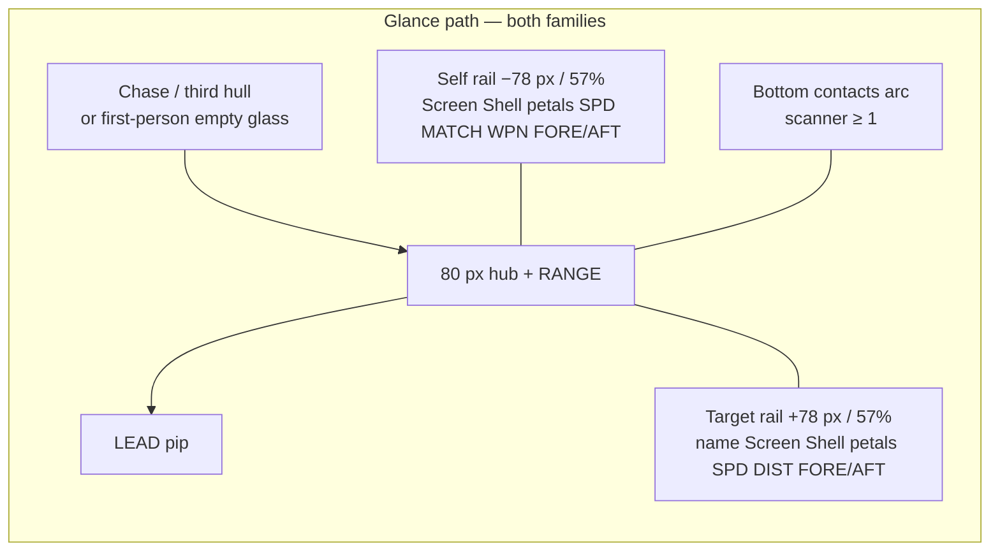
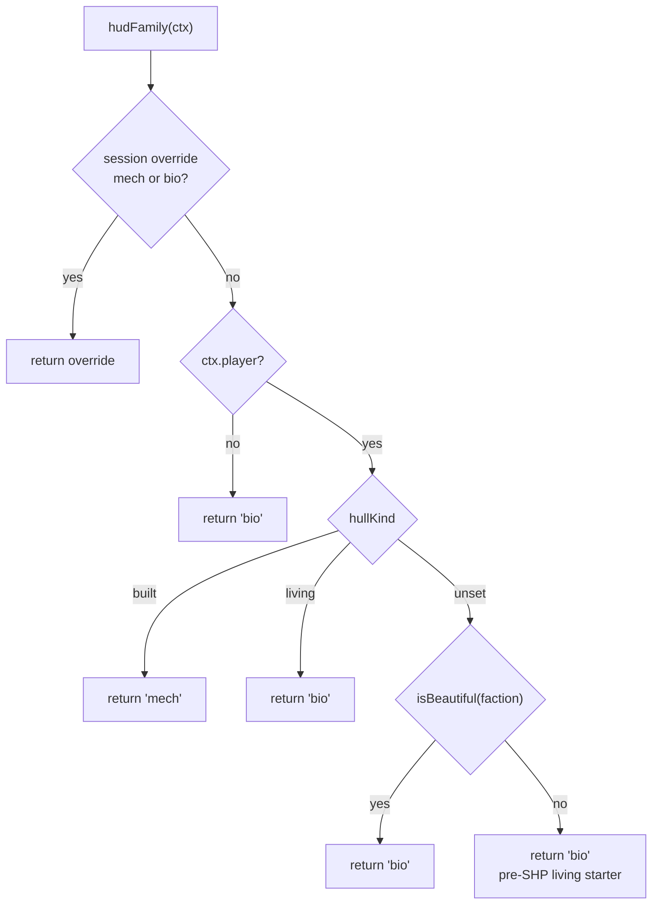
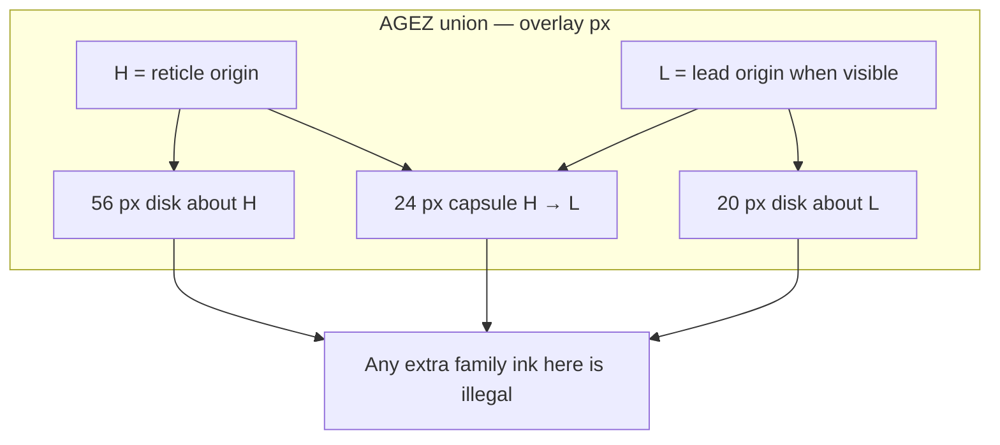
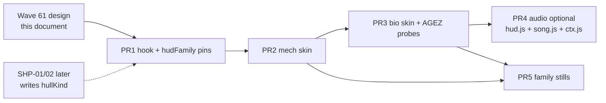

# RIMWARD HUD-02 identities

| Field | Value |
|---|---|
| **Title** | RIMWARD HUD-02 identities |
| **Author** | Wave 61 HUD-02 integrator |
| **Date** | 2026-08-18 |
| **Status** | Accepted. Wave 62 implemented PR1–PR3. Wave 65 shipped PR4 family audio. |
| **Wave** | 61 — design. 62 — hook + mech + bio skins. 65 — family audio (PR4). |
| **Owner request** | Living vs conventional HUD brief. Do not ship skins yet. |
| **Merge law** | [`out/w61/shared-contract.md`](../out/w61/shared-contract.md). If a family brief and that file conflict, the contract wins. |

**Verifier record (CLEAN):** [`out/w61/verify-inventory.txt`](../out/w61/verify-inventory.txt), [`verify-conventional.txt`](../out/w61/verify-conventional.txt), [`verify-living.txt`](../out/w61/verify-living.txt), [`verify-shared.txt`](../out/w61/verify-shared.txt).

---

## Overview

HUD-01 / waves A–F already ship one glance set on one `#hud` tree: mirrored Screen / Shell / hull / SPD rails, empty 80 px hub, RANGE word, MATCH lamp, FORE/AFT, relative lead, edge arrow, and a scanner-gated bottom contacts arc. Wishlist HUD-02 still needs two **identities** of that same HUD: a mechanical skin for built hulls and a living skin for grown hulls. Neither family may hide, delay, or move the glance set. Neither family may win a duel by being easier to read.

This brief is the integrator document for that later implementation wave. It freezes the information contract, the `hudFamily(ctx) → 'mech' | 'bio'` switch, the `#hud[data-family]` CSS architecture, living AGEZ clip rules, mechanical stroke language, HUD-03 mapping, persist rules, and a serial PR plan. Wave 61 lands this markdown only. Skins do not ship here.

---

## Background & Motivation

### Current state

`docs/HudUtilityChangeProposal.md` front matter is `status: IMPLEMENTED`. Waves A–F landed 2026-08-17. The proposal body is frozen design of record; HUD-02 skins remain later.

`docs/PLAYER-EXPERIENCE-WISHLIST.md` HUD initiative: HUD-01 DONE, HUD-02 READY TO DESIGN, HUD-03 existing settings only (no new wave). TGT-01 / TGT-02 are core-ship DONE. TGT-03 is DONE for the scanner-gated bearing arc only. TGT-04 is not this work.

The live overlay is already mixed:

| Already living (do not treat as a new instrument) | Already mechanical |
|---|---|
| `.rw-reticle-pupil` 5×5 `--vein` (`hud.css` 333–343) | Stroke rails, no card fill (`hud.css` 769–779) |
| Three `.rw-reticle-cilia` at 30° / 150° / 270° | Dashed hub `::before`; `.in-range` 2 px solid |
| `.rw-reticle::after` dashed vein ellipse, `rw-iris-spin` 14 s | FORE/AFT fill vs hollow + words |
| `--vein` on Bio panel / hunger / mood | Contact tick / chevron / hollow diamond |
| | Lead ring + `LEAD`; edge-arrow triangle; 10 hull petals |

`@keyframes rw-breathe` exists (`hud.css` 326–329) and **no selector assigns it**. HUD-02 must not treat breathe as a shipped instrument. Living **ship** breath lives in `ship.js`, not in the overlay.

### Pain points

- Wishlist HUD-02: conventional ships need one mechanical family; living ships need tendrils, pulses, organic silhouettes, vein accent, and creature cues. Waves A–F added none of that.
- Today every playable hull is the living mesh in `ship.js` (`createShipState('light')`, default `faction: 'independent'`). There is no conventional player hull. A naive `origin !== 'beautiful'` or `!isBeautiful(faction)` switch would paint the only living starter as mechanical.
- `isBeautiful` in `src/systems/organic.js` 67–69 is `faction === 'beautiful'` — NPC / station / gate art, not a player-hull flag.
- `ctx.world.origin` (`origins.js`) is a start situation. Beautiful origin only sets bond / hunger / cargo. It does not change mesh, faction, or class.
- Implementers cannot restyle in parallel: `hud.js` + `hud.css` are one owner at a time (proposal §7 additive rule; contract §6.3).

### Why now (design) / why not now (code)

The owner asked for the living vs conventional brief. Inventory, family notes, and the shared contract are verified CLEAN. Implementation waits for a later serial wave so SHP, playtest, and art can land against a frozen contract instead of inventing glance rows.

---

## Goals & Non-Goals

### Goals

1. Same shipped glance set, same positions, same data, same 5 Hz cadence, on both families.
2. Hull identity selects family via `hudFamily(ctx)` → `'mech' | 'bio'`. Apply as `#hud.dataset.family`. Do not rebuild nodes.
3. Living paint must not win a duel. Pixel, motion, and reduced-motion parity are acceptance numbers, not taste.
4. Existing HUD-03 `body.rw-*` overrides apply to both families. No new settings keys.
5. World strings stay in `textContent`. No new persist keys. Session-only debug override if any.
6. Living tendrils stay outside AGEZ. First bio wave: **2** rail hairlines per rail (both pseudos) + fail-closed `rw-hair-off`; no extra Bio corners; contacts identity = `stroke-linecap: round` only.
7. This wave writes the brief. A later wave ships skins serially.

### Non-goals (locked — do not reopen)

- No skins in Wave 61.
- No TGT-04 turrets / automated weapons HUD.
- No missiles, aspect lock, lock-box, missile timer, incoming-missile gauge, countermeasures.
- No G / S / E power triad. Plant / Flight / Heat stay `.rw-aux`.
- No four-face shields or F5–F8 transfer. Facing glance only (`fore` / `aft`).
- No tendrils across the aim glass, lead pip, shot path, or chase/third hull.
- No moving glance positions (rails, hub, contacts slot, edge arrow).
- No designer-only instruments that are not in the glance table.
- No FreeSpace green combat default. No CRT grid. No contacts ring around the reticle.
- No first-person-only combat HUD. One overlay, three cameras.
- No HUD-03 audio-alert settings. No free HUD-skin setting.
- No music redesign. Do not retarget whalesong (`ctx.bio.songEvent`) as family chrome.
- No SHP shipyard implementation in the HUD-02 code wave (read hook only).
- No MATCH write of `ctx.input.throttle`. Scanner buys awareness only.
- Do not invent a conventional starter by keying on origin.
- Do not treat unused `rw-breathe` as live.
- Do not treat the dormant target-rail `.rw-match-lamp` as a second MATCH instrument.

---

## Proposed Design

### 1. Information contract (both families)

Source of truth: `src/systems/hud.js` init + 5 Hz text path, `src/ui/hud.css` glance geometry, proposal keep-list. Inventory (`out/w61/current-hud-inventory.md`) names every live selector. Code wins over stale Appendix B.

#### 1.1 Must-show glance set

| Instrument | Where it lives today | Data / rule | Gate |
|---|---|---|---|
| **Screen** | Self `.rw-combat-self` + target `.rw-combat-target` | Outer shield. Thin bar. `makeBar(..., 'SCREEN', 'rw-screen')`. 3 px track. | None. Core ship. |
| **Shell** | Both rails | Inner shield. Thick bar. `makeBar(..., 'SHELL', 'rw-shell')`. 9 px track. | None. |
| **Hull petals + LOW/CRIT** | Both rails | 10 petals (`HULL_PETALS`). `LOW` when frac ≤ 0.5 and > 0.25; `CRIT` when ≤ 0.25; hidden when ok. Color is never the only cue. | None. |
| **SPD** | Both rails | Rounded u/s. Self `ctx.ship.speed`. Target sampled lock speed. | None. |
| **WPN** | Self rail only | `weaponGroup · name`. Group 3 uses `miningLaserFor(ctx.world.miningLaser).name`. | None. |
| **DIST** | Target rail only | Rounded `targetDistNow` + ` u`. | None. Not scanner-gated. |
| **Name** | Target `.rw-combat-name` | `record.name` / `state.name` / `CONTACT`. Q-ship `coverName` until scanner ≥ 2 pierce. | None. |
| **FORE / AFT** | Both rails (`makeFacing`) | Word + fill vs hollow. Self: lock in player forward/rear hemisphere. No lock → both self ends dim. Lock: player in lock forward/rear. `playerHit.fromAft` flashes AFT. | None. |
| **Lead** | `.rw-lead` + `LEAD` | Selected-weapon TOF. `relVel = targetVel − playerVel`. Hide for mining (`wSpeed === 0`) or no live ship lock. Cannon/disruptor on a live on-glass ship always show the mark. If `\|relVel\| ≤ LEAD_MIN_SPEED` (~6), keep the mark on the hull (no TOF offset). Off-glass or `leadProj` off NDC hides it. Not auto-aim. | None. Core (TGT-01). |
| **RANGE** | `.rw-reticle-range` on the hub | Shape + the word `RANGE` when `targetDistNow` is inside selected weapon range. Mining uses installed head range. | None. |
| **MATCH** | **Self** SPD lamp `.rw-match-lamp` only | Visible while `ctx.flags.matchSpeed` and a live ship lock exist. `selfSpeed.set(ctx.ship.speed, !!(ctx.flags.matchSpeed && shipTgt))`. Target rail `tgtSpeed.set(targetSpeedNow)` — no second arg, lamp stays hidden. `ship.js` owns the flag and must not write `ctx.input.throttle`. | None. Core (TGT-02). |
| **Contacts arc** | `.rw-contacts` bottom bearing arc | Thin stroke. Friend/foe by **shape** (tick / chevron / hollow diamond). Not a reticle ring. Hidden while docked. | **Scanner-gated.** `ctx.world.scanner` 0 = no arc. Mk I (`≥ 1`): `U.ENCOUNTER_BUBBLE`, cap 16. Mk II (`≥ 2`): 2× bubble, cap 24, lock closure `«` / `»`. |
| **Edge arrow** | `.rw-edge-arrow` | Off-glass lock pointer. `EDGE_MARGIN = 84`. | None. |
| **Combat fade** | `#hud.in-combat` | `.rw-fade` → **0.14** (Manifest, Controls, Bio, POS). `.rw-aux` → **0.38** (Plant, Flight, Heat). Chart marks → **0.14**. Fade, do not delete. Controls collapse on the **rising edge** of combat to `CONTROLS ▸`; exit does not force-open. | `ctx.flags.combat`. |

Neither family may:

- delay any row behind a skin intro, pulse warmup, or “organism wake”;
- hide Screen / Shell / petals behind a silhouette that lacks the numbers/shapes;
- replace LOW/CRIT, FORE/AFT, RANGE, MATCH, LEAD, DIST, or WPN with icon-only chrome;
- show a fake contacts arc on scanner 0;
- keep Manifest / Controls / Bio / POS / chart marks at career opacity during combat.

#### 1.2 Locked adjacent instruments (stay; restyle stroke vs accent only)

- Thin reticle hub, 80 px empty middle. Living iris = **small** accent (pupil + three cilia). Mech may swap that accent for a thin mechanical tick of the **same bounding box**.
- Target bracket + resolve band words (`DEFIANT` / `SHAKEN` / `BARGAINING` / `CAPITULATE`) + Q-ship pierce + ore `NEEDS` / `.ore-blocked`.
- Context prompt (Dock / Jump / Hail / Target) above the contacts slot.
- Jump charge, arrival banner (off aim column), toasts (off aim column).
- Three cameras, **one** overlay. `C` cycles chase → third → first → chase. First-person recenters the reticle only (`#hud.first-person`). HUD does not read `flags.camera` to swap instruments.

#### 1.3 Glance geometry (do not move)

From `src/ui/hud.css` after waves A–F:

- Rails: `top: 57%`, `left: 50%`. Self `translate(calc(-100% - 78px), 0)`. Target `translate(78px, 0)`.
- Contacts: `left: 50%; bottom: 5.5%; width: min(400px, 46vw); height: 72px`. Not a 22–28% reticle ring.
- Hub: `80px`, `margin: -40px`. Clamp in `hud.js` ~775 keeps the hub on glass (`cx-44`, `cy-44`).
- Aim glass stays empty. No new instrument in the proposal §4 glance table.

HUD-02 may change **stroke language**. HUD-02 may **not** change these positions.

#### 1.4 Cadence (performance contract)

`hud.js` header is law:

- Create every DOM node **once** in `initHud`.
- Per-frame: transforms only (reticle / bracket / lead / edge arrow).
- Text and bar writes: ~5 Hz (`TEXT_UPDATE_INTERVAL = 0.2`) and only on change.
- Family attribute: recompute `hudFamily(ctx)` on that same 5 Hz write-on-change path (see §3.1). Do not add a persist event.
- No per-frame object allocations. No per-frame `getBoundingClientRect` for AGEZ.

A family skin that rebuilds rails, clones a second HUD, or writes text every frame fails this contract.

`rw-hair-off` (living rails) is the one exception to “5 Hz is enough for class toggles”: test it on the **reticle / lead transform path**, write-on-change only, against a **cached** `{ width, height }` rail box (§5.3). `H` can cross a rail between text ticks. Both rails start with `rw-hair-off` in `initHud` and stay hidden until that test first clears.

#### 1.5 Color + shape

Keep `#hud` tokens: `--rw-accent` `#6ff2e0`, `--rw-warn`, `--rw-bad`, `--rw-good`. `--vein` `#5fe08a` stays a Bio / living accent, not a FreeSpace green combat default. HUD-03 body classes continue to override the same tokens. Shape or text must carry every state.

Proposal §6 MATCH row says “Filled SPD tick + MATCH”. Shipped MATCH is **text only** (`hud.css` 219–226; verifier nit). Mech may add a CSS `::before` tick on the **existing** `.rw-match-lamp` node. Do not add a second MATCH node. Do not light the dormant target-rail lamp.



---

### 2. Parity rule

Wishlist HUD-02: both families communicate the same essential information and **neither receives a competitive readability disadvantage**. A living HUD that is prettier but worse in a duel is a failed skin.

#### 2.1 Same data, same time, same place

- Same strings, same numbers, same hide/show gates, same 5 Hz text cadence.
- Same rail offsets, same hub size, same contacts slot, same `EDGE_MARGIN = 84`.
- Same combat fade opacities (0.14 / 0.38).

#### 2.2 Pixel budget into the aim column

**Aim column** = the vertical center strip that holds the hull (chase/third), lead pip, projectile path, and empty hub.

- Family chrome may not grow **toward center** by more than **8 px** versus the other family, measured at 1600×900.
- Rails stay at the 78 px offset. Do not eat the 78 px gap.
- Living iris / mech tick share one box. Do not grow cilia, veins, or ticks across the hub interior.
- Contacts pips stay on the bottom arc. No tendrils from the arc onto the glass.
- No extra widgets (heart-rate, mood orb, ammo flower, GSE, four-face shield) in the glance cluster.

#### 2.3 Motion budget

Living family may pulse **accent only** (proposal: pulse the accent, not the whole arc).

Caps, unless `body.rw-reduced-motion`:

| Motion | Max |
|---|---|
| Translation of any glance glyph | **2 px** |
| Scale of any glance glyph | **1.00–1.04** |
| Opacity wobble of any glance glyph | **±0.08** |
| Loop period | ≥ 1.2 s (no seizure-rate flicker). This floor **includes** the iris pupil. |
| One-shot flashes (hit, range pop, hostile-enter) | already one-shot; do not turn them into loops |

Contacts already use `CONTACT_PULSE = 0.45`. Family skins must not enlarge that pulse or move pips.

Mech: no idle spin, no breathe, no vein pulse. Cancel `rw-iris-spin` on the mech hub.

Bio intensity (living brief §3.5), after the period-floor merge:

| Mode | Tendril opacity | Motion | Pulse amplitude | `--rw-bio-period` |
|---|---|---|---|---|
| Career (`#hud` not `.in-combat`) | 0.45 | Optional 12–18 s dash crawl on rail outer hairlines only | Iris pupil opacity ±0.08 (glance-glyph cap; do not use ±0.12) | Same table as combat: every mood ≥ 1.2 s |
| Combat (`#hud.in-combat`) | 0.32 | **Static** strokes. No crawl. No scale. | Iris pupil opacity ±0.06 | Every mood ≥ 1.2 s. Feral must not beat this floor. |
| Reduced motion | **0** (hairlines hidden) | **No family hairlines. No crawl. No pulse.** | 0 | **0** |

Combat / career mood periods written to `--rw-bio-period` (5 Hz, `last.mood`):

| Mood | Period |
|---|---|
| serene | 4.0 s |
| pained | 2.2 s |
| keen | **1.2 s** (was 1.1) |
| anxious | **1.2 s** (was 0.8) |
| feral | **1.2 s** (was 0.7) |

Do not ship a feral / anxious / keen period below 1.2 s. Reduced motion sets `--rw-bio-period: 0` and hides family hairlines (see §2.4).

New keyframes must live under `#hud` so `body.rw-reduced-motion #hud, body.rw-reduced-motion #hud *` (`hud.css` 974–978) kills them.

#### 2.4 Reduced motion equalizes layout

Under reduced motion, **both families must render the same static layout**.

Hide family hairlines (and any extra ticks that change the instrument box) on **both** families. Mech has no hairlines; bio must not keep career 18 px stems or combat 10 px stems. Also hide mech hub ticks that sit *outside* the shared 80 px ring box if any such ticks exist (first-wave ticks stay on the ring and do not change the box).

Allowed residual difference: static stroke tokens (line cap, dash, a still vein tint on labels).  
Forbidden residual difference: extra nodes, extra width into the 78 px gap, visible hairlines, a larger iris, a different rail order, a delayed fade.

Acceptance: a 1600×900 still of mech + reduced-motion and bio + reduced-motion overlay with an **8 px** tolerance on every glance instrument box. PR3 must prove bio+RM hairlines are `content: none` / not painted.

#### 2.5 Readability checks both families must pass

- Screen vs Shell still read as thin vs thick without color.
- Hull LOW/CRIT still show the word.
- FORE/AFT still show the word plus fill vs hollow.
- Color-blind and high-contrast still apply.
- Bright-sky / star-near frames still keep stroke contrast (existing tokens).

---

### 3. Family switch

#### 3.1 Law function (later implementation — not this wave)

Return tokens stay `'mech' | 'bio'`. Prose may say conventional / living. **Do not use `live` as a dataset token** (conventional-family sketch is superseded).

```js
// src/systems/hud.js (later implementation wave — not this wave)
// import { isBeautiful } from './organic.js';

/** @returns {'mech' | 'bio'} */
export function hudFamily(ctx) {
  const debug = sessionHudFamilyOverride(); // session-only; see Security
  if (debug === 'mech' || debug === 'bio') return debug;

  const p = ctx.player;
  if (!p) return 'bio';

  // SHP hook (field does not exist yet). Explicit hull kind wins.
  if (p.hullKind === 'built') return 'mech';
  if (p.hullKind === 'living') return 'bio';

  // Redundant on purpose; unset kind is always bio.
  // Kept so a Beautiful SHP hull that omits hullKind still documents intent.
  if (isBeautiful(p.faction)) return 'bio';

  // Pre-SHP starter: ship.js always mounts a living mesh.
  return 'bio';
}
```

Apply as `#hud.dataset.family = hudFamily(ctx)` in `initHud` **and** on the **5 Hz write-on-change path**. Compare `last.family`, `last.hullKind`, `last.faction`, and the session override. Write the dataset only when the returned token changes. Do **not** add a persist event to the frozen `ctx.js` comment for this. Berth `restore()` and a later SHP `ctx.player` mutate have no event today (`main.js` 122–127: `initSave` then `initHud`; later `restore()` is UI-driven). A 5 Hz reread is the refresh.

After a 5 Hz write that sets `data-family="bio"`, **leave `rw-hair-off` on both rails** until the next reticle / lead transform-path AGEZ test runs. Do not paint hairlines on the same 5 Hz tick as the family flip. `initHud` also adds `rw-hair-off` on both rails so the live default `bio` is fail-closed before the first transform write.

Do not rebuild nodes. CSS: `#hud[data-family="mech"]` and `#hud[data-family="bio"]`.

HUD must **not** write `hullKind` on this path or any other.

Do **not** key on:

- `ctx.world.origin` (start situation only);
- `isBeautiful(faction)` **alone** (independent starter is living but not Beautiful);
- `ctx.player.classKey` (role/stats; Ace / cutter / light can be either culture);
- `ctx.bio` mood / hunger / bond (career companion, not family);
- `flags.camera`, `flags.combat`, scanner tier;
- target faction (would swap chrome mid-duel);
- a HUD-03 settings checkbox.

HUD must **not** write `hullKind`.

#### 3.2 How the player ship is marked living today

| Signal | Where | What it actually means today | HUD use |
|---|---|---|---|
| Living mesh | `src/systems/ship.js` | Player hull is **always** a grown ship (`makeLivingHull`). `createShipState('light')` only. | Default family is **bio**. |
| `isBeautiful(faction)` | `organic.js` 67–69 | `faction === 'beautiful'`. NPC Beautiful Ones ships and gates. | Use after SHP writes `ctx.player.faction`. **False** on the current starter (`independent`). |
| `ctx.player.faction` | `createShipState` / save restore | Persisted. Default `'independent'`. | SHP writes the shipyard faction here. Beautiful → bio. |
| `ctx.player.classKey` | `'light'` starter | Class is role/stats, not grown vs built. | Do **not** switch on classKey alone. |
| `ctx.world.origin` | `origins.js` / `ORIGINS` / `save.js` `WORLD_FIELDS` | Start situation only. | Do **not** switch on origin. |
| `ctx.bio` | `src/game/bio.js` | Companion mood / hunger / wounds / bond / growth. Always present on the living starter. | Career panel. Not a family switch. |

There is **no conventional player hull** in the tree today. Do not pretend `origin !== 'beautiful'` is a mechanical ship.

#### 3.3 Cases the integrator must honor

| Case | Family | Rationale |
|---|---|---|
| Fresh boot, any origin, current `light` / `independent` hull | `bio` | `ship.js` living mesh. Greenhand text: “a berth, a living ship”. Beautiful origin is the same hull with more bond. |
| Beautiful Ones origin, current hull | `bio` | Origin is flavor + bio start values, not a second hull. |
| Future SHP buy of a Beautiful Ones hull | `bio` | `isBeautiful(player.faction)` or `hullKind === 'living'`. |
| Future SHP buy of an Unknowables hull | `bio` | Owner 2026-08-18: purchased Unknowables hulls are living. SHP **must** set `hullKind: 'living'` (not `'built'`). Unset kind is still `bio`. |
| Future SHP buy of a Freehold / Ledger / other **built** hull | `mech` | SHP must set `hullKind: 'built'` (and faction). |
| Future SHP hull swap back to a living hull | `bio` | Hull decides. Swap is instant on the same `#hud` tree. |
| Living hull with conventional guns (wishlist SHP-03) | `bio` | Weapons do not pick the HUD. WPN still names the installed gun. |
| `body.rw-*` settings | unchanged family | Accessibility is not a skin picker. |

Until SHP exists, `hudFamily` returns `'bio'` in live play. Both skins must still be implementable and screenshotable via the session debug override.



#### 3.4 SHP hook (design only — SHP is not this wave)

When SHP-01 / SHP-02 mounts a purchased hull, write:

- `ctx.player.faction` — already persisted through `save.js` restore.
- `ctx.player.classKey` — already persisted.
- `ctx.player.hullKind = 'living' | 'built'` — **new field, SHP-owned**. Unknowables purchased hulls take `'living'`. Built Freehold / Ledger / other plated hulls take `'built'`. Unset `hullKind` stays `bio` for every faction.

Player is not a `WORLD_FIELDS` whitelist. `snapshot()` writes `player: ctx.player` wholesale (`save.js` ~170). `restore()` does `Object.assign(ctx.player, snap.player)` (~359). `sanitizeRestored` only heals NaN numeric vitals; it does **not** drop unknown keys. Extra player keys **keep** across save/load today.

A HUD write of `hullKind` would persist in `rimward-save-v1` with no `living`|`built` allowlist. A hand-edited `hullKind: 'built'` on the living starter would stick.

The SHP persist wave must copy `hullKind` on purpose and allowlist `living`|`built` only (same class of heal as `scanner` 0/1/2). Anything else: delete the key so `hudFamily` falls through. Do not add a `settings.js` key. Do not add a `WORLD_FIELDS` HUD key.

---

### 4. Conventional (mech) family

Intent: FreeSpace **rules**, not 1998 CRT green chrome (`docs/space-sim-hud-styles-research-2026-08-17.md`). Combat default stays `--rw-accent` cyan.

Reference still: `out/hud-research/fs1-training-reticle.jpg` — large thin ring, empty middle. Reject that still’s aspect-lock diamond and missile timer.

#### 4.1 Visual language

- 1 px edges on glass. No card fill, no blur, no box-shadow on rails (already Wave A).
- Hub ring: keep 1 px dashed out of range; 2 px solid in range (`.in-range`).
- Bar tracks: 1 px `border`, `background: transparent` or near-void, `border-radius: 0`.
- Screen stays **thin**. Shell stays **thick**. That pair is the shield cue, not color alone.
- No glow bloom on mech fills. Drop `box-shadow` on `.rw-petal.on` and `.rw-lead-ring` under the mech hook.
- Everything combat-near is **square**. Lock diamond may stay 45° (it is already a square).
- Type: keep `'Cascadia Mono', Consolas, 'Courier New', monospace`. Keep `--rw-text-scale`. Mech may tighten label tracking to `0.14em` and values to `0.04em`. Do not change words.
- Words that must remain: SCREEN, SHELL, HULL, LOW, CRIT, SPD, MATCH, WPN, DIST, RANGE, LEAD, FORE, AFT, and resolve-band labels.
- `--vein` must not appear under `[data-family="mech"]` combat chrome. Do not introduce `--rw-fs-green`.

#### 4.2 Hub ticks (replace living iris)

Replace the living iris. Sit **on the 80 px ring**. Do not occupy the inner glass.

- Outer ring = existing `::before` (keep).
- Accent = 8 short ticks at 45°, each 1×5 px, seated on the stroke (outer ~2 px of the 80 px box).
- Optional 4 longer cardinals (N/E/S/W) at 7 px if 8 equal ticks under-read. Never more than 12 ticks.
- Inner keep-out: **56 px diameter** (12 px inset from the 80 px box). No fill, no numeral, no second circle, no pip ring.
- In-range: cardinals go 2 px / solid (pair with existing 2 px ring + `RANGE` word).

**Prefer zero new nodes:** restyle `.rw-reticle::after` from the dashed vein blob into a masked tick ring (`repeating-conic-gradient` + radial mask). Hide pupil and cilia with `display: none`.

If CSS ticks fail in a supported browser, add at most 8 `span.rw-reticle-tick` children of `.rw-reticle`, created **once** in `initHud`. Hidden unless `data-family="mech"`. Never place marks inside the 56 px keep-out.

On `#hud[data-family="mech"]`:

1. `.rw-reticle-pupil { display: none; }`
2. `.rw-reticle-cilia { display: none; }`
3. `.rw-reticle::after` — cancel `rw-iris-spin`, cancel organic radii, retarget as tick mask (or `content: none` if ticks are extra spans).
4. Do **not** leave `--vein` marks on the hub.
5. Do **not** keep cilia and also draw ticks.

Swap is CSS + one attribute. Do not destroy and rebuild the reticle node.

#### 4.3 Rails, facing, contacts, lead

- Hull: 10 rectangular ticks, 6×12 px, 2 px gap, `border-radius: 0`, `transform: none` (drop shipped `skewX(-6deg)` on `.rw-petal`, `hud.css` 135–142). There is **no** scale transform on current petals; do not invent a “scale cap” to remove. On = filled. Off = hollow. Keep `.h-warn` / `.h-crit` + LOW / CRIT.
- Facing: hard plate silhouette in the existing 22×10 box. Square the body. Keep FORE/AFT words + fill vs hollow. Color-blind inset ring stays (`hud.css` 307–315). Do not draw a four-face shield ship.
- Contacts: keep three shapes. Civilian 2×8 square tick. Hostile sharper 90° chevron. Lock 1 px cyan hollow diamond, no fill. `.is-far` 0.28 stays. Mk II `«` / `»` stay next to the pip, not on the hub. Arc stroke stays 1.25 px, no fill, no CRT grid.
- Lead: keep 28 px box. Prefer a thin circle so it does not look like a second lock diamond. Keep the `LEAD` word. Drop the 8 px glow. Do not park extra chrome between lead and hub.

#### 4.4 Mech motion

| Motion | Mech family | `body.rw-reduced-motion` |
|---|---|---|
| `rw-iris-spin` | **Off** (accent replaced) | Already `animation: none !important` |
| `rw-breathe` | Do not attach | Frozen |
| Bar width | Keep or 0.12 s linear | Snaps |
| RANGE enter | Optional 0.2 s one-shot on **rising** `.in-range`. No loop | Solid ring + RANGE word |
| FORE / AFT flash | Keep one-shot. Square wash | Existing 1 px red outline |
| Hostile enter | Prefer 0.2 s opacity flash (scale fights the lock diamond rotate) | Existing `animation: none` |
| Hull CRIT | Keep blink **or** freeze ticks and rely on CRIT text. Prefer keep for parity | Frozen; CRIT word stays |
| MATCH lamp | Instant. No pulse | Instant |

No per-frame class chatter. Rising-edge only, same style as `last.inRange` (`hud.js` 901–904).

---

### 5. Living (bio) family

Intent: short tendrils on **allowed** hosts, quiet biological pulses, organic facing silhouettes, organic contact pips that still encode friend/foe by **shape**, vein as a **secondary** accent. Bind only to fields already on `ctx.bio` and to shipped HUD values. Do not invent trauma / pulse-rate / oxygen stats.

#### 5.1 AGEZ — Aim Glass Exclusion Zone

All family paint is forbidden inside AGEZ. Verify with pixels, not taste.

Coordinate frame: **overlay space** on `#hud`, not raw viewport center.

- Hub origin `H` = current transform origin of `.rw-reticle` (chase/third: screen center + clamped `reticleScreen`; first-person: screen center).
- Lead origin `L` = current transform origin of `.rw-lead` when that node is visible.
- Rails stay CSS-anchored at `left: 50%; top: 57%` and do **not** follow the reticle. Do not assume the hub sits between the rails.

| Zone | Geometry | Why |
|---|---|---|
| Hub disk | Circle, center `H`, radius **56 px** (40 px hub + 16 px buffer) | Tendrils must not enter the 80 px hub or the ring around it. |
| Hub interior exception | Only the shipped iris: 5 px pupil at `H`, 16×16 crosshair, three 1×7 px cilia on the **ring**, dashed `::after` with `inset: 28px`. Career may add +1 px **width** on existing cilia. Combat adds nothing to cilia length. | Accent may stay. It may not grow into a cage. |
| Shot corridor | Capsule: **24 px** radius around the segment `H`→`L`. If lead is hidden, drop the capsule. The hub disk still applies. | Bolts and the pip stay clear. |
| Lead keep-out | Circle, center `L`, radius **20 px** (28 px lead box + 6 px). Ignore when lead is hidden. | Organic skin must not dress the pip. |
| Hull keep-out | Do not attach family strokes to the reticle, lead, bracket, jump card, or any full-screen overlay. Do not grow hairlines into the 78 px CSS-center gap. That gap is **not** AGEZ. AGEZ follows `H` / `L`. | Hull and bolts live in the gap; the hub can leave it. |

**Hard clip rule:** a family stroke is illegal if any pixel of its ink intersects the hub disk, the shot corridor, or the lead keep-out.

**Parenting is not a clip.** At 1600×900 the self rail is about x=502–722; `H` at (600, 513) is legal and sits **on** that rail. The 78 px CSS-center gap does not keep ink out of the 56 px disk about `H`.



#### 5.2 Allowed attach sites (first wave)

Do **not** set `overflow: hidden` on `.rw-combat-rail`. That clip would hide MATCH / LOW / labels.

Rail hairlines attach to the **top and bottom edges** of the rail box and grow along that edge (horizontal), or at most 10/18 px **outward** from the top/bottom. They must not enter the 78 px CSS-center gap. They must inset **52 px** from the outer edge (self: left / label side; target: right / label side). Ban a full-width un-inset `::before` / `::after` on the rail box.

**First-wave count is 2 hairlines per rail**, not 4. Use both existing pseudos (`::before` top, `::after` bottom). Set `content: ''`. Do not add extra markup. A later wave that wants four stems must add two init-once nodes and say so; that is not this wave.

| Host | Attach | Combat max | Career max | Count |
|---|---|---|---|---|
| `.rw-combat-self` | Top + bottom edges; grow up/down, not toward the hub gap | 10 px (`#hud.in-combat`) | 18 px | **2** (`::before` + `::after`) |
| `.rw-combat-target` | Same | 10 px (`#hud.in-combat`) | 18 px | **2** (`::before` + `::after`) |
| `.rw-facing-sil` | `clip-path` restyle of the existing 22×10 box only. No extra tendril stroke | 0 | 0 | 0 |
| `.rw-bio` | Existing panel + vein tokens only. **No extra corner strokes.** Combat fade 0.14 does not make extra pixels legal | 0 | 0 | 0 |
| `.rw-contacts` | Existing Wave F stroke only. Identity = `stroke-linecap: round` (~1 px). **No extra 8–12 px tangent at `u = ±1`** | 0 | 0 | 0 |
| Hub | **No new tendrils.** Iris only | 0 | 0 (width +1 px only) | 3 existing cilia |

Banned hosts: `.rw-reticle` (except the iris accent), `.rw-lead`, `.rw-target`, `.rw-crosshair`, `.rw-jump`, `.rw-prompt`, `.rw-toasts`, `.rw-banner`, `.rw-edge-arrow`, `#hud` root, `document.body`.

#### 5.3 Fail-closed AGEZ hide (`rw-hair-off`)

Static CSS on the rails cannot track `H`. Implement a hide. Do not ship an extra SVG tendril layer in the first wave.

**Hairline box** (overlay px, per rail). Do **not** call `getBoundingClientRect` on the reticle / lead path. Rail height is content-sized (bars, name, `--rw-text-scale` 1.5) and is **not** a CSS constant. Cache **`{ width, height }`** (or the overlay box) per rail.

Compute the box from known CSS anchors plus that cache:

1. Viewport `vw` / `vh` already used by the reticle writer.
2. Rail top = `0.57 * vh` (`top: 57%`). Horizontal anchor = `0.5 * vw` (`left: 50%`).
3. Self left edge ≈ `0.5 * vw - 78 - rail.width`. Target left edge ≈ `0.5 * vw + 78`.
4. Cache `{ width, height }` from **one** layout read in `initHud` (legal). Re-measure on a `window.resize` listener **registered in `initHud`**. Optionally re-measure **once** on the 5 Hz path when `--rw-text-scale` or the target name changes. **Do not edit `main.js`.** The existing `main.js` 130–134 listener only updates the WebGL camera and `renderer` size; it does not call HUD.
5. Expand top and bottom by the current max length (10 px combat, 18 px career) using cached `height`.
6. Inset the **outer** edge by 52 px (self `left += 52`; target `right -= 52`).
7. Do not expand toward the 78 px CSS-center gap.

**Forbid** a layout read every frame. Per-frame `getBoundingClientRect` stays banned.

**Hit test** (true → hide):

- `dist(H, hairBox) < 56` (point-to-AABB; 0 if `H` is inside the box), or
- lead visible and `dist(L, hairBox) < 20`, or
- lead visible and the 24 px capsule `H`→`L` intersects `hairBox`, or
- `H` is missing (fail closed).

**Action:** toggle class `rw-hair-off` on that rail only, write-on-change.

**Fail-closed start (required):**

1. `initHud` adds `rw-hair-off` on **both** `.rw-combat-self` and `.rw-combat-target`.
2. Keep the class on until the **first** transform-path AGEZ test **clears** that rail (hit test false).
3. After a 5 Hz family write to `bio`, leave `rw-hair-off` on until that transform-path test runs. Do not clear it from the 5 Hz writer.

```css
#hud[data-family='bio'] .rw-combat-rail.rw-hair-off::before,
#hud[data-family='bio'] .rw-combat-rail.rw-hair-off::after {
  content: none;
  visibility: hidden;
}
```

Fail closed: no hairline. Do not clip the rail itself.

**When to test:** same path as the reticle / lead transform writes. Toggle the class only when the boolean flips. A 5 Hz-only test is not enough. Use the cached `{ width, height }` box; do not measure the rail every frame.

| Host | First wave | Why |
|---|---|---|
| Rails | Extra hairlines **plus** `rw-hair-off` | `H` can sit on a rail (example (600, 513) on self). |
| Facing | No extra strokes (`clip-path` only) | Same 22×10 pixels as today. Safe. No hide. |
| Bio | **No extra corner / edge strokes** | Sample legal `H` (1556, 856) is **on** that panel. Career 16 px corners would lie in the 56 px disk. |
| Contacts | **No extra end length.** `stroke-linecap: round` only | Arc ends ≈ (710, 785) and (890, 785) at 1600×900 sit inside the legal `H` box. |

If a later change adds extra px on Bio or contacts, that host **must** use the same hit test and fail closed. Do not hide the shipped Wave F arc or the Bio glance (mood / HUNGER / WOUNDS) — hide only family extras.

#### 5.4 Pulse / biological signs

| Signal | Bind | Organic expression | Never |
|---|---|---|---|
| Mood | `ctx.bio.mood` | Iris pupil opacity period. **Combat and career:** serene 4.0 s, pained 2.2 s, keen **1.2 s**, anxious **1.2 s**, feral **1.2 s**. Set `--rw-bio-period` on `#hud` from the 5 Hz writer (`last.mood` already exists). Under `body.rw-reduced-motion`, period is **0**. Do not ship a mood faster than 1.2 s. | Recolor rails. Do not add a sixth mood. |
| Hunger | `ctx.bio.hunger` | Bio HUNGER track only (already vein fill) | Combat rails |
| Wounds | `ctx.bio.wounds` | Existing HUD `.hurt` when `wounds > 0.35`. Family may add a one-shot 0.4 s ember outline on **self hull petals** on the `.hurt` rising edge only. `src/game/bio.js` 126–130: healthy if `wounds < 0.3` (and hunger < 0.7); `pained` if `wounds >= 0.6`. Those drive mood, not this outline. | New wound number on the rail |
| Screen / Shell | existing bar `%` | Optional 1 px vein hairline **inside** the existing bar track, width = same `%` | Pulse the whole rail |
| Hull | existing petals + LOW/CRIT | Petal tips may be slightly more teardrop (still 8×13, filled vs hollow) | Extra petal count |
| Bond / growth | — | No extra Bio edge ink | New “BOND” / “GROWTH” glance |

Do not read private `src/game/bio.js` module locals (`trauma`, `feralUntil` at lines 55–57). They are not on `ctx`.

#### 5.5 Organic facing and contact pips

Keep the 22×10 `.rw-facing-sil` box and the words FORE / AFT. Living: manta / teardrop outline via CSS `clip-path` on `.rw-facing-nose` / `.rw-facing-body`. Zero new nodes. Lit = filled nacre/vein wash. Dim = 1 px outline. Keep `.is-flash` 0.4 s. Color-blind: fill vs hollow + the word.

Keep `contactKind()` kinds: `civ` | `hostile` | `lock`.

| Kind | Today | Living family | Must keep |
|---|---|---|---|
| civ | 2×8 tick | Vein tick, slightly bowed (still a vertical tick, 2×8) | Tick, not a chevron |
| hostile | 8 px amber triangle | Organic chevron, same metrics (`border-left/right: 4px`, `border-bottom: 8px`) | Pointed 3-side mark |
| lock | 8×8 hollow diamond | Same diamond. Corners may round by **1 px** only | Rotated square, hollow |

Keep `is-aft`, `is-far`, `is-enter` (0.45 s). Closure glyphs stay text. Do not put pips on the hub.

#### 5.6 Responsive color (bio)

**May tint:** iris pupil / cilia / dashed `::after`; Bio title, hunger fill, mood label; family hairlines on rail top/bottom (when not `rw-hair-off`); facing `clip-path` outline; contacts `stroke-linecap` only — `--vein` at ≤ 0.45 alpha. Mood may shift **iris glow only** along a short vein→ember mix for `pained` / `feral`.

**Must not tint:** Screen / Shell / SPD / WPN / DIST tokens (keep cyan / wake blue); lead ring, RANGE word, MATCH lamp, edge arrow; hostile pip fill stays `--rw-warn`; civ stays `--dim`; lock stroke stays `--rw-accent`.

`body.rw-colorblind #hud[data-family='bio'] { --vein: var(--rw-good); }` so vein does not collide with amber/red. `body.rw-contrast`: hairline alpha ≥ 0.7, no blur. Tendril px lengths do **not** scale with `--rw-text-scale` (fixed geometry vs AGEZ).

---

### 6. DOM / CSS architecture

#### 6.1 Chosen: one tree, two `data-family` skins

- Keep the single `#hud` root `initHud` already owns.
- Set `data-family="mech"` or `data-family="bio"` on `#hud` (not on `document.body`).
- Body stays for HUD-03: `rw-colorblind`, `rw-contrast`, `rw-reduced-motion`.
- CSS selectors: `#hud[data-family="bio"] .rw-reticle-cilia { … }` etc.
- Init-once nodes stay. Skins are CSS + tiny class toggles already used (`in-range`, `is-lit`, `h-warn`) plus `rw-hair-off` on bio rails.

**Forbid** a second parallel HUD DOM (`#hud-mech` + `#hud-bio`, or a living overlay sibling). That breaks the performance contract and doubles Playwright pins.

Do **not** add `body.rw-hud-bio` / `body.rw-hud-mech` as a player toggle. A body class leaks organic rules onto Hail, the galaxy chart, and title. `body.rw-*` is the HUD-03 accessibility namespace.

#### 6.2 Suggested selectors (no new markup on the recommended path)

```css
/* mech — suppress iris, square chrome */
#hud[data-family="mech"] .rw-reticle-pupil,
#hud[data-family="mech"] .rw-reticle-cilia { display: none; }

#hud[data-family="mech"] .rw-reticle::after {
  animation: none;
  border: none;
  /* tick ring via masked conic gradient; inner 56px fully transparent */
}

#hud[data-family="mech"] .rw-petal {
  border-radius: 0;
  transform: none;
  width: 6px;
  height: 12px;
}

#hud[data-family="mech"] .rw-petal.on { box-shadow: none; }
#hud[data-family="mech"] .rw-lead-ring { box-shadow: none; border-width: 1px; }

/* bio — 2 hairlines per rail (both pseudos). Career 18 px. Combat 10 px. */
#hud[data-family='bio'] .rw-combat-self::before,
#hud[data-family='bio'] .rw-combat-self::after,
#hud[data-family='bio'] .rw-combat-target::before,
#hud[data-family='bio'] .rw-combat-target::after {
  content: '';
  position: absolute;
  pointer-events: none;
  height: 18px;
  width: auto;
}
#hud[data-family='bio'] .rw-combat-self::before {
  left: 52px; right: 0; top: -18px;
}
#hud[data-family='bio'] .rw-combat-self::after {
  left: 52px; right: 0; bottom: -18px; top: auto;
}
#hud[data-family='bio'] .rw-combat-target::before {
  left: 0; right: 52px; top: -18px;
}
#hud[data-family='bio'] .rw-combat-target::after {
  left: 0; right: 52px; bottom: -18px; top: auto;
}
#hud[data-family='bio'].in-combat .rw-combat-self::before,
#hud[data-family='bio'].in-combat .rw-combat-self::after {
  top: -10px; height: 10px;
}
#hud[data-family='bio'].in-combat .rw-combat-self::after,
#hud[data-family='bio'].in-combat .rw-combat-target::after {
  top: auto; bottom: -10px; height: 10px;
}
#hud[data-family='bio'].in-combat .rw-combat-target::before {
  top: -10px; height: 10px;
}
#hud[data-family='bio'] .rw-combat-rail.rw-hair-off::before,
#hud[data-family='bio'] .rw-combat-rail.rw-hair-off::after,
body.rw-reduced-motion #hud[data-family='bio'] .rw-combat-rail::before,
body.rw-reduced-motion #hud[data-family='bio'] .rw-combat-rail::after,
body.rw-reduced-motion #hud[data-family='mech'] .rw-combat-rail::before,
body.rw-reduced-motion #hud[data-family='mech'] .rw-combat-rail::after {
  content: none;
  visibility: hidden;
}
#hud[data-family='bio'] .rw-contacts-stroke { stroke-linecap: round; }
/* .rw-bio: no extra corner/edge ::before. Existing panel only. */
#hud[data-family='bio'].in-combat .rw-combat-self::before,
#hud[data-family='bio'].in-combat .rw-combat-self::after,
#hud[data-family='bio'].in-combat .rw-combat-target::before,
#hud[data-family='bio'].in-combat .rw-combat-target::after {
  animation: none;
  opacity: 0.32;
}
body.rw-colorblind #hud[data-family='bio'] { --vein: var(--rw-good); }
body.rw-reduced-motion #hud[data-family='bio'] .rw-reticle-pupil { animation: none; }
```

Do **not** use `innerHTML` to inject SVG. If an implementer needs a path, use `createElementNS` once in `initHud` (same pattern as `contactsSvg`).

#### 6.3 Parallel-safety (implementers)

`hud.js` + `hud.css` are **not** parallel-safe. One implementation owner at a time. Do not land family CSS in a PR that another worker is restyling rails. Optional family audio (PR4) writes `hud.js` + `song.js` + the `ctx.js` comment **after** both skins. Avoid `settings.js`.

---

### 7. HUD-03 mapping

Existing client settings stay the only overrides. Waves A–F added no new HUD-03 options. HUD-02 first implementation adds none.

`src/systems/settings.js` is the only writer of `ctx.settings`. `apply()` (66–70) toggles `body.rw-colorblind`, `body.rw-contrast`, `body.rw-reduced-motion`, and sets `--rw-text-scale` on `#hud`. Persisted key remains `rimward-settings-v1`.

| Setting | Owner | Apply path | Both families |
|---|---|---|---|
| Color-blind | `ctx.settings.colorblind` | `body.rw-colorblind` | Same token remap. Shape/text still required. |
| High contrast | `ctx.settings.highContrast` | `body.rw-contrast` | Same stroke boost. Rails stay unfilled. |
| Reduced motion | `ctx.settings.reducedMotion` | `body.rw-reduced-motion` | §2.4 equal static layout. Hide family hairlines on both families. `--rw-bio-period: 0`. Silence family pulses and any family audio loops. |
| Text scale | `ctx.settings.textScale` `0.85\|1\|1.2\|1.5` | `--rw-text-scale` on `#hud` | Same scale. Family chrome must not clip XL. |
| Mute | `ctx.settings.muted` | `song.js` gain 0 | Mutes family cues too. |
| Master volume | `ctx.settings.masterVolume` 0..1 | `song.js` | Family cues ride this bus. |
| Hints | `ctx.settings.hints` | `onboarding.js` | Unchanged. Not a HUD family. |

**Prefer no `settings.js` write** in the HUD-02 implementation wave. Do not add HUD-03 audio-alert toggles. Wishlist “optional audio alerts” stays unscoped.

---

### 8. Audio policy

FX-02 (Wave 54, `song.js`) already prioritizes **weapon, impact, engine, and warning** over music, radio, and station ambience.

HUD-02 family cues:

- Optional, last implementation slice.
- Secondary to `playerFire`, `npcFire`, `playerHit`, `npcHit`, `bodyHit`, engine/burner, `shieldDown`, `engineOut`.
- Short ticks or a quiet living click. No new music bed. No `songShift`. Do not redesign whalesong.
- Bio family must not drown FX-02 with heartbeat / tendril rustle.
- Mech family must not add a second engine loop.
- `muted` and `masterVolume` already exist. Use them. No new volume slider.
- Reduced motion: no looping family cue. One-shot combat warnings that already exist may stay.

Whalesong (`ctx.bio.songEvent`) is the companion voice, not a HUD-02 instrument.

`song.js` consumes `ctx.lastEvents` via `CUES[typ]`. There is no `playCue()` export. Unlock on first key / pointer. Failure-safe.

**Merge resolution (contract wins over family audio sketches):**

- First audio PR, if scheduled (after PR2+PR3, not Wave 61): **new quiet family ticks only**, gain ≤ 0.08, duration ≤ 0.35 s, rising-edge `ctx.emit` from `hud.js`. `song.js` only adds `CUES` rows. Write-set is `hud.js` + `song.js` + `ctx.js` comment.
- Do **not** retarget existing FX-02 rows (`playerFire`, `playerHit`, `npcHit`, combat bed) as family identity in the first audio PR. Living-family §8.1 “organic variant of the same event key” is deferred and must stay quieter than those FX-02 cues if a later owner reopens it.
- New `ctx.emit` types are **frozen** in the `ctx.js` header comment (lines 188–210). Any new type must add a matching comment line in the same change.
- Do not emit from the 5 Hz text path on unchanged values. Never emit per frame.
- Gate new types at the emit site when `reducedMotion` is on. Do not add a HUD-03 “audio alerts” checkbox.
- Family is mech → mech tick types may emit. Family is bio → mech types stay silent, and vice versa.
- Reject: `bioMoodSting`, `tendrilWhoosh`, `heartbeatLoop`, anything that plays every frame or every mood tick.

Draft NEW types (later, optional — not identity-critical):

| Type | Family | When | Notes |
|---|---|---|---|
| `hudMechRange` | mech | Rising `.in-range` | One click. Not a loop. |
| `hudMechMatch` | mech | Rising MATCH lamp | Lamp on only. |
| `hudMechContact` | mech | Hostile pip `.is-enter` | Throttle with existing `seenHostiles`. |
| `hostileEnter` | bio | First hostile id enters the arc | Max 1 / 0.5 s. No fire if scanner < 1. |
| `hullBand` | bio | Self hull band steps to warn or crit | Max 1 / 2 s. Does not replace LOW/CRIT text. |

---

## API / Interface Changes

No public API change in Wave 61.

Later implementation wave:

| Surface | Change |
|---|---|
| `src/systems/hud.js` | Export `hudFamily(ctx)`. Set `#hud.dataset.family` in `initHud` and on the 5 Hz write-on-change path. Session debug reader. Optional: 8 tick spans once if CSS ticks fail. Add `rw-hair-off` on both rails in `initHud`. Cache `{ width, height }` at init; re-measure on an `initHud` resize listener (and optionally once on 5 Hz when text-scale or target name changes). AGEZ test on the reticle/lead path against that cache. After a 5 Hz write to `bio`, leave `rw-hair-off` on until that test runs. PR4 (optional, after skins): rising-edge `ctx.emit` for family audio. **Do not write `ctx.input.throttle`. Do not write `hullKind`. Do not edit `main.js`.** |
| `src/ui/hud.css` | `#hud[data-family="mech"]` and `#hud[data-family="bio"]` restyles. No rail move. No hub grow. |
| `src/systems/song.js` | **PR4 only** (depends on PR2+PR3): add NEW `CUES` rows. No new export. Read `document.getElementById('hud')?.dataset.family` once per cue. |
| `src/core/ctx.js` | **PR4 only:** document new event types in the frozen comment. No new persist event for family refresh. |
| `src/systems/settings.js` | **No change.** |
| `src/systems/organic.js` | **Read** `isBeautiful`. Do not change it. |
| `src/systems/ship.js` / bio meshes | **No change** from HUD-02. |
| `src/game/save.js` | **No HUD-02 change.** SHP later allowlists `hullKind`. |

```js
// Later — session debug only. Not a settings key. Not written from the O panel.
function sessionHudFamilyOverride() {
  try {
    const v = sessionStorage.getItem('rw-hud-family');
    if (v === 'mech' || v === 'bio') return v;
  } catch (_) { /* private / blocked storage */ }
  return null;
}
```

Allowed alternative: a query parsed at boot and stored in a module `let`. Forbidden: persisting that override, writing it from the O panel, or letting a save file set it.

---

## Data Model Changes

**HUD-02 adds no persist keys.**

| Field | Owner | Persist today | HUD-02 rule |
|---|---|---|---|
| `ctx.player.hullKind` | SHP (future) | Extra player keys **keep** via `Object.assign` (`save.js` 359). `sanitizeRestored` does not drop unknown keys. | HUD **reads** if present. HUD **never writes**. SHP must allowlist `'living' \| 'built'` and delete anything else. |
| `ctx.player.faction` | SHP / create | Already persisted | Beautiful → bio after hullKind miss. |
| `ctx.settings.*` | `settings.js` | `rimward-settings-v1` | No new field. |
| `ctx.world.*` | `WORLD_FIELDS` | Whitelist | No HUD family key. |
| `sessionStorage['rw-hud-family']` | Debug only | Session | `mech` \| `bio`. Does not survive a documented “no session” boot path. |

---

## Alternatives Considered

### Switch rule

**Alt S1 — Origin proxy (rejected as default).**  
`origin === 'beautiful' ? 'bio' : 'mech'`. Cheap before SHP, but it lies: greenhand already flies a living ship, and a later SHP Beautiful hull on a ledger-debt save would keep a mechanical HUD. Origin is a start situation, not a hull id.

**Alt S2 — `isBeautiful(player.faction)` only (rejected as sole test).**  
True after SHP writes `faction: 'beautiful'`. False on today’s starter (`independent`), which is still a living mesh. Would ship a mechanical HUD on the only playable living hull.

**Chosen:** hull kind + Beautiful faction + living-starter default (`hudFamily` in §3.1).

### Skin architecture

**Alt A1 — Body class `rw-hud-bio` / `rw-hud-mech`.**  
Works, but collides with HUD-03 `rw-*` accessibility classes and leaks onto Hail / galaxy chart / title. Rejected vs `#hud[data-family]`.

**Alt A2 — Two parallel HUD trees.**  
Forbidden. Doubles nodes, breaks 5 Hz write-on-change caches, risks one family hiding a readout, doubles Playwright pins.

**Alt A3 — Swap stylesheets.**  
Forbidden as the only mechanism. Reload/restyle races and loses init-once identity.

**Chosen:** one tree, two `data-family` skins.

### Living tendril implementation

**Alt A — CSS-only skin (recommended).**  
Restyle existing nodes with `::before` / `::after`, `clip-path`, `stroke-linecap`, and token tweaks. Rail hairlines + `rw-hair-off`. Bio corners = 0 extra. Contacts ends = round cap only.  
Pros: zero new DOM, reduced-motion is free, hide is a class toggle.  
Cons: tendril shapes are simple hairlines; rail hairlines go away while `H` overlaps that rail.

**Alt B — Extra SVG tendril layer.**  
Sibling `svg.rw-hud-tendrils` with ≤ 6 paths. Prettier vines. Paths can wander into AGEZ unless a clipPath copies AGEZ every frame. Clip failure covers the shot. `innerHTML` risk if paths are string-built from world data. A static viewport clip does **not** track `H`.

**Chosen:** Alt A + §5.3 hide. Do not ship Alt B in the first living-family wave. If a later wave still wants vines, it must subtract a 56 px circle about `H` plus the shot corridor, `createElementNS` once, attributes only, no `innerHTML`. Failure mode is “no tendril layer,” not “unclipped layer.”

### Free HUD-skin setting

**Rejected.** Wishlist HUD-02 is ship identity. HUD-03 already owns scale, contrast, color-blind, reduced motion, mute, volume. A living ship must not run a mechanical HUD because the player prefers the look. Owner 2026-08-18: no HUD-03 free skin override. Do not add a settings checkbox in the first skin wave or later unless the owner reopens this.

---

## Security & Privacy Considerations

See also `out/w61/shared-security.md` and the family security briefs.

| Risk | Severity | Mitigation |
|---|---|---|
| HTML injection via NPC names, cover names, comm lines, toasts, ore / commodity / system names | **High** | `el()` already uses `textContent`. Keep that. No `innerHTML` / `insertAdjacentHTML` / `document.write` of world or save strings. |
| SVG `d` interpolation from world strings | **High** | `createElementNS` + numeric path data from local geometry (`contactsArcPath` pattern). Never interpolate ship names, hail text, or system ids into `d` or markup. |
| Prototype-key lookups (`SYSTEMS[e.to]`, `FACTIONS[key]`, `BAND_LABEL[band]`) turned into `className` / HTML | **Medium** | Contact class stays `'rw-contact-pip is-' + kind` where `kind` is enum only. Bio mood class stays authored mood enum. |
| Family CSS interpolated from faction or player names | **Medium** | Authored CSS only, keyed on `data-family`. |
| New `localStorage` keys / `rimward-settings-v1` HUD-skin field | **Medium** | Forbidden. Family is derived. |
| HUD writes `hullKind` → persists unsanitized in `rimward-save-v1` | **Medium** | HUD never writes `hullKind`. SHP allowlists `living`\|`built`. |
| Session debug override persisted or written from O panel | **Low** | Session-only. Pin the helper, not a real disk key, on a “no session” boot path. |
| Q-ship `coverName` used as a reason for HTML | **Medium** | Remains a mask in `textContent`. |
| Logging `ctx.bio`, settings, or cue names with player identifiers | **Low** | Do not. |
| Second `AudioContext` / cue from rAF | **Low** | Reuse `song.js` master. Honor mute / masterVolume. |

Threat model: this is a local browser game. The practical threat is XSS through world strings and persist-key smuggling of `hullKind` / a HUD-skin setting. Fail closed on both.

---

## Observability

No production metrics stack exists. Acceptance is Playwright stills + boot pins (later implementation wave).

| Signal | How |
|---|---|
| Family attribute | `#hud[data-family]` is `bio` or `mech`. Log only in debug builds if needed. |
| Hairline hide | `rw-hair-off` class on the rail. Probe stills at H=(600,513), contacts ends, Bio corner. Do not ship a debug AGEZ outline. |
| Cadence | Existing write-on-change caches. No new per-frame logs. |
| Audio | Existing `song.js` failure-safe path. Muted = silent. |
| Alerting | None. Failed pins fail CI. |

Implementation-wave stills (1600×900, chase, same lock, both families):

- `hud-02-bio-chase.png` / `hud-02-mech-chase.png` — Screen, Shell, petals+LOW/CRIT, SPD, WPN, DIST, name, FORE/AFT, lead, RANGE, MATCH all present.
- `hud-02-bio-scanner0.png` / `hud-02-mech-scanner0.png` — no contacts arc.
- `hud-02-bio-mki-aft.png` / `hud-02-mech-mki-aft.png` — aft hostile on bottom arc.
- `hud-02-*-combat-fade.png` — Manifest/Bio/POS at 0.14.
- `hud-02-*-colorblind.png` / `hud-02-*-contrast.png` / `hud-02-*-reduced-motion.png` — HUD-03 still applies; reduced-motion pair matches layout.
- `hud-02-*-xl.png` — text scale 1.5 does not clip rails into the hub.

Boot pins (`scripts/boot-test.mjs`, extend the HUD-01 / wave B–F block ~11273+):

**PR1 hook pins** (`scripts/boot-test.mjs`):

- `#hud[data-family]` is `bio` or `mech`.
- Still exactly one `.rw-combat-self`, one `.rw-combat-target`, one `.rw-contacts`.
- Scanner 0 hides the arc; Mk I shows it.
- `hudFamily` with `{ player: { faction: 'independent' } }` → `bio` (live starter).
- `hudFamily` with `{ player: { faction: 'beautiful' } }` → `bio`.
- `hudFamily` with `{ player: { hullKind: 'built', faction: 'freehold' } }` → `mech`.
- After `initHud`, restore a player blob with `hullKind: 'built'` and require `#hud[data-family="mech"]` on the next 5 Hz tick. Boot order today is `initSave` then `initHud` (`main.js` 122–127); this pin covers a later berth `restore()`.
- Override in `sessionStorage` does not survive a documented “no session” boot path.

**PR3 AGEZ class probes** (no shipped debug outline):

- `H` over the self rail (600, 513) → `rw-hair-off` on that rail.
- `H` on a contacts end (710, 785) or Bio (1556, 856) → **no extra** family ink in the 56 px disk.
- `body.rw-reduced-motion` → both families hide family hairlines; overlay stills within 8 px.
- Node count == current + 0 on the recommended Alt A path (or +8 tick spans only if CSS ticks fail, and only when those spans exist).

**PR5** keeps the 1600×900 family stills listed above.

---

## Rollout Plan

Wave 61: this document only. Do not schedule or land the PRs below in Wave 61.

Later implementation:

1. **Feature flag:** session debug override only. Live default stays `bio` until SHP writes `hullKind: 'built'`. No `settings.js` checkbox.
2. **Staged rollout:** PR1 hook (zero visual delta + `hudFamily` pins) → PR2 mech skin → PR3 bio skin + AGEZ probes → optional PR4 audio (`hud.js` + `song.js` + `ctx.js` comment) → PR5 stills.
3. **Rollback:** revert the CSS attribute rules; leave `hudFamily` + `data-family="bio"` if the hook is already live. Removing `data-family` must not break HUD-01. Revert PR4 as one unit (`hud.js` emits + `song.js` rows + `ctx.js` comment).
4. **SHP coupling:** Owner 2026-08-18: **ship skins early.** Implement PR1–PR3 without waiting for SHP. Live play stays `bio` until SHP writes `hullKind: 'built'`. Mech is debug/screenshot only until then. SHP later writes `hullKind` + `faction` so live play can show `mech`.



PR2 → PR3 is serial. `hud.js` + `hud.css` are not parallel-safe. Do not draw PR2 and PR3 as peers.

---

## Open Questions (resolved 2026-08-18)

Owner answers are **final**. Keep the questions visible. Do not reopen them in code.

1. **Ship HUD-02 skins before SHP hull swap?**  
   **Resolved (2026-08-18): ship skins early.** Implement PR1–PR3 without waiting for SHP. Mech is debug/screenshot only until SHP writes `hullKind: 'built'`. Live default stays `bio`.

2. **Unknowables (and any later grown-but-not-Beautiful hull) — `bio` or `mech`?**  
   **Resolved (2026-08-18): living (`bio`).** SHP must set `hullKind: 'living'` (not `'built'`) for Unknowables purchased hulls. Unset `hullKind` remains `bio` for every faction (independent, Unknowables, Beautiful). Do not treat Unknowables as a silent mech default.

3. **HUD-03 free skin override later?**  
   **Resolved (2026-08-18): no.** Hull decides. Do not add a settings checkbox in the first skin wave or later unless the owner reopens this.

---

## References

- [`out/w61/shared-contract.md`](../out/w61/shared-contract.md) — merge law
- [`out/w61/current-hud-inventory.md`](../out/w61/current-hud-inventory.md)
- [`out/w61/conventional-family.md`](../out/w61/conventional-family.md)
- [`out/w61/living-family.md`](../out/w61/living-family.md)
- [`out/w61/verify-inventory.txt`](../out/w61/verify-inventory.txt), [`verify-conventional.txt`](../out/w61/verify-conventional.txt), [`verify-living.txt`](../out/w61/verify-living.txt), [`verify-shared.txt`](../out/w61/verify-shared.txt)
- [`docs/PLAYER-EXPERIENCE-WISHLIST.md`](PLAYER-EXPERIENCE-WISHLIST.md) — HUD-02 / HUD-03 / TGT locked notes
- [`docs/HudUtilityChangeProposal.md`](HudUtilityChangeProposal.md) — IMPLEMENTED A–F; Later — HUD-02
- [`docs/space-sim-hud-styles-research-2026-08-17.md`](space-sim-hud-styles-research-2026-08-17.md)
- `src/systems/hud.js` — header, `initHud`, lead (`849–874`), MATCH (`1174`), contacts (`932–933`)
- `src/ui/hud.css` — tokens, hub / iris, rails 57% / ±78 px, contacts, `body.rw-*`
- `src/game/save.js` — `snapshot` player wholesale (~170); `Object.assign(ctx.player, snap.player)` (~359)
- `src/systems/organic.js` — `isBeautiful`
- `src/game/bio.js` — mood / wounds bands; `trauma` / `feralUntil` stay module locals
- `src/systems/settings.js` — `apply()` body classes
- `src/systems/song.js` — `CUES` / mute / masterVolume
- `src/systems/ship.js` — living mesh; MATCH never writes `ctx.input.throttle`
- `src/main.js` — `initSave` then `initHud` (122–127) only. The 130–134 resize listener is camera / renderer, not HUD. HUD-02 must not edit `main.js`.

---

## Key Decisions

| Topic | Decision | Rationale |
|---|---|---|
| Switch key | Hull, not origin, not class, not bio mood | `origins.js` adjusts start conditions only. `ship.js` is a living mesh. `classKey` is a stats row. Wishlist HUD-02 is conventional **ships** vs living **ships**. |
| Pre-SHP default | `bio` | Only mounted player hull is living. `isBeautiful(player.faction)` is false (`independent`) and must not flip the starter to mech. |
| Beautiful origin | Still `bio`, no special case | Origin does not change hull. Effects are bond / hunger / cargo. |
| Conventional starter | Not invented here | No built player mesh exists. Do not fake one with origin. |
| Dataset tokens | `'mech' \| 'bio'` only | Shared-contract law. Conventional-family `live` sketch is superseded. |
| Reader name | `hudFamily(ctx)` | Shared-contract law. Conventional-family `hullIsConventional` sketch is superseded. |
| Skin setting | None | Hull decides. Owner 2026-08-18: no HUD-03 free skin override unless the owner reopens this. |
| Ship skins vs SHP (Q1) | Ship PR1–PR3 early | Live default stays `bio`. Mech is debug/screenshot only until SHP writes `hullKind: 'built'`. |
| Unknowables purchased hull (Q2) | `hullKind: 'living'` → `bio` | Unset kind remains `bio` for every faction. Not a silent mech default. |
| DOM | One tree, `#hud[data-family]` | Honors init-once / 5 Hz contract. Body classes stay HUD-03. |
| Living tendrils | AGEZ 56 / 24 / 20; rails + `rw-hair-off`; first wave no extra Bio corners, no extra arc tangents; 52 px label inset; facing `clip-path` only | Parenting and “bottom of the screen” are not keep-outs. Verified CLEAN against (600,513), (710,785), (1556,856). |
| Iris | Small accent both families; mech replaces with ticks in the same box | Proposal §6. Empty 80 px middle stays. |
| MATCH lamp | Self text lamp; optional CSS tick on that node; target lamp stays dormant | Inventory + verifier nit. Proposal “filled SPD tick” is a restyle, not a new instrument. |
| Lead | Hide mining or no live lock; `\|relVel\| ≤ ~6` keeps mark on hull | Shipped `hud.js` 849–874. Not the stale Appendix B formula. |
| Audio | Optional last PR, under FX-02 | Wishlist creature cues; proposal forbade organic audio in A–F, not forever. Mute already exists. No music change. Do not retarget FX-02 weapon/impact rows in the first audio PR. |
| Tendrils across glass | Forbidden | Proposal HUD-02 + this non-goals list. |
| Glance positions | Frozen | HUD-01 / waves A–F closeout. |
| New persist keys | None for HUD-02 | Family is derived. Debug is session-only. `hullKind` waits for SHP. HUD never writes it. Restore already keeps extra player keys. |
| HUD-03 options | None new | Existing `settings.js` / `body.rw-*` only. |
| Parallelism | `hud.js` + `hud.css` not parallel-safe | One owner. Serial PRs. |
| Family refresh | Recompute `hudFamily` on the 5 Hz write-on-change path | No hull-swap event exists. Do not add a persist event. HUD never writes `hullKind`. Pin restore-after-`initHud`. |
| Mood pulse period | Every live mood ≥ 1.2 s; reduced-motion period **0** | §2.3 loop floor includes the iris. Feral / anxious / keen must not beat the seizure-rate floor. |
| Reduced-motion hairlines | Hide family hairlines on **both** families | Same static layout, 8 px overlay tolerance. Extra rail chrome is not an allowed residual. |
| First-wave hairline count | **2** per rail (`::before` + `::after`) | Two pseudos, no extra markup. Combat 10 px / career 18 px in CSS. |
| AGEZ box method | Cached `{ width, height }` + 57% / ±78 px anchors | One layout read in `initHud`. Re-measure on an `initHud` resize listener. Optional one 5 Hz read when text-scale or target name changes. No `main.js` edit. No per-frame `getBoundingClientRect`. |
| Fail-closed hairlines | `rw-hair-off` on both rails in `initHud`; stay on until first transform-path clear | First bio paint and 5 Hz flip to `bio` must not flash hairlines while `H` sits on a rail. |
| PR4 write-set | `hud.js` emits + `song.js` `CUES` + `ctx.js` comment | `song.js` cannot emit. Depends on PR2+PR3. Not Wave 61. |
| Wave 61 | Markdown only | Owner: design the living vs conventional brief. Do not ship skins. |

### Merge resolutions (family notes → this brief)

| Conflict | Winner | Note |
|---|---|---|
| Conventional `data-family="live"` | Shared: `'bio'` | Tokens stay `'mech' \| 'bio'`. |
| Conventional `hullIsConventional` | Shared: `hudFamily` | Function in §3.1. |
| Conventional MATCH “filled SPD tick” as if shipped | Inventory / verifier | Text lamp today; CSS tick on the same node is allowed later. |
| Living re-voice of `playerFire` / `playerHit` / combat bed | Shared §5 | Family audio is quieter than FX-02. First audio PR is new quiet ticks only. |
| Living NEW `hostileEnter` / `hullBand` vs mech `hudMech*` | Both kept as **optional later** types | Must join the `ctx.js` frozen comment. Not identity-critical. |
| Unused `rw-breathe` | Inventory | Do not treat as a shipped instrument. |

### Risks

| Risk | Severity | Mitigation |
|---|---|---|
| Living chrome covers the shot at chase `H` on the self rail | **High** | AGEZ + `rw-hair-off` fail-closed (`initHud` start + 5 Hz flip stays hidden until AGEZ clear). Pin (600, 513). |
| Extra Bio / contacts length at legal `H` on those hosts | **High** | First wave extra length = 0. Verifier CLEAN. |
| Mech ticks enter the 56 px hub keep-out | **High** | Masked conic + radial keep-out, or 8 spans on the ring only. |
| Dual HUD trees drift glance data | **High** | Forbidden. One tree. |
| `hudFamily` keyed on origin / `isBeautiful` alone | **High** | Function in §3.1. Pins for independent + Beautiful + `hullKind: 'built'`. |
| HUD writes `hullKind` | **Medium** | Explicit forbid. SHP allowlist later. |
| Parallel PRs on `hud.css` | **Medium** | Serial plan. One owner. |
| Family audio fights FX-02 | **Medium** | Last PR, gain cap, do not retarget weapon/impact CUES first. |
| Reduced-motion families diverge layout | **Medium** | Hide hairlines on both families. 8 px overlay stills required. |
| SHP sets Unknowables `hullKind: 'built'` | **Medium** | Owner 2026-08-18 requires `'living'`. SHP allowlist must not invent a mech default for that faction. |

---

## PR Plan

**Not Wave 61.** Do not schedule or land these PRs in this design wave.

`hud.js` and `hud.css` are shared. Land **serially**. One owner. They are **not** parallel-safe for implementers.

| PR | Title | Files / components | Depends on | Description |
|---|---|---|---|---|
| **PR1** | HUD-02 family hook | `src/systems/hud.js` only if possible. Tiny `hud.css` attribute comment OK. **No `settings.js`.** | Waves A–F (already in tree) | Add `hudFamily(ctx)`, set `#hud[data-family]` in `initHud` **and** on the 5 Hz write-on-change path, session debug override. **Zero visual delta** at default (`bio`). **Land `hudFamily` / `data-family` pins here** (independent → `bio`, Beautiful → `bio`, `hullKind: 'built'` → `mech`, restore-after-`initHud` → `mech`). Override flips the attribute without new nodes. |
| **PR2** | HUD-02 conventional skin | `src/ui/hud.css`, maybe small class names in `hud.js` (8 tick spans only if CSS ticks fail) | PR1 | Mechanical stroke language. Same boxes. Hide pupil/cilia. Hub ticks on the ring, 56 px keep-out. Glance overlay ≤ 8 px vs current. All §1.1 instruments visible. Serial before PR3. |
| **PR3** | HUD-02 living skin | `src/ui/hud.css`, `hud.js` class toggles (`rw-hair-off`, `--rw-bio-period`, cached `{ width, height }`, `initHud` resize listener). **No `main.js`.** | **PR2** (serial; one owner on `hud.css`) | Living accent (pulse accent only, mood period ≥ 1.2 s). **2** rail hairlines + fail-closed hide (`rw-hair-off` in `initHud`; stay on until first AGEZ clear). No extra Bio corners. Contacts `stroke-linecap: round` only. Iris stays small. **AGEZ class probes land here** (`H=(600,513)`, contacts ends, Bio corner). Reduced-motion hides hairlines; 8 px layout match vs mech+RM. |
| **PR4** | HUD-02 family audio (optional) | `src/systems/hud.js` (rising-edge emit, write-on-change) + `src/systems/song.js` (`CUES`) + `src/core/ctx.js` frozen-event comment | **PR2 + PR3.** FX-02 already shipped. **Not Wave 61.** | Quiet family ticks under FX-02. Mute / masterVolume / reduced-motion honor. No music change. Do not retarget `playerFire` / `playerHit` as identity. Weapons still louder. `song.js` alone cannot emit. |
| **PR5** | HUD-02 family stills | `scripts/boot-test.mjs` (stills only if not already in PR2/PR3), stills under `out/hud-research/` | PR2 + PR3 | Playwright 1600×900 family stills (chase, scanner 0, Mk I aft, combat fade, color-blind, contrast, reduced-motion, XL). Hook pins already landed in PR1. AGEZ probes already landed in PR3. |

Prefer **no `settings.js` write**. If a reviewer demands a visible debug toggle, it is a session flag printed in an existing overlay, not a persisted checkbox.

SHP-01/02 (later, other initiative): write `player.hullKind` + `player.faction`. Unknowables purchased hulls take `hullKind: 'living'`. Built plated hulls take `'built'`. Then PR1’s function can return `'mech'` in live play. HUD PRs do **not** wait on SHP (owner 2026-08-18). Live default stays bio until a `'built'` hook is written.

### Implementation-wave write-set (reminder)

| File | Allowed later | Forbidden later |
|---|---|---|
| `src/ui/hud.css` | `[data-family]` restyles | Rail move, hub grow, CRT green default, tendrils on glass |
| `src/systems/hud.js` | `hudFamily`, 5 Hz dataset refresh, `rw-hair-off` in `initHud`, cached `{ width, height }`, `initHud` resize listener, optional ticks; PR4 rising-edge emits | `input.throttle`, `hullKind` write, `innerHTML`, second tree, per-frame layout reads, `main.js` edits |
| `src/systems/song.js` | NEW `CUES` rows only if PR4 is scheduled (with `hud.js` + `ctx.js`) | New export, second AudioContext, music bed, emit without `hud.js` |
| `src/core/ctx.js` | Frozen-event comment with PR4 | New persist fields or a family-swap event |
| `src/systems/settings.js` | None | `FIELDS.hudSkin`, audio-alert checkbox |
| `src/game/save.js` | None in HUD-02 | HUD `WORLD_FIELDS` |
| `src/systems/ship.js` / `organic.js` / bio meshes | Read only | Family switch writes |
| `src/main.js` | None | Do not hook HUD resize here. Register the listener in `initHud`. |

### Integrator checklist (implementation wave)

- [x] Family notes keep every §1.1 instrument in the same place. (Wave 62)
- [x] No tendrils on glass. No GSE. No four-face shields. No missiles. No TGT-04.
- [x] Parity numbers in §2 used as acceptance, not vibes.
- [x] Switch is `hudFamily(ctx)` as specified. Owner Q1–Q3 (2026-08-18) are closed: ship skins early; Unknowables purchased hulls are `living`/`bio`; no HUD-03 skin checkbox.
- [x] No `settings.js` HUD-skin checkbox.
- [x] One `#hud` tree.
- [x] World strings → `textContent`.
- [x] Wave 61 markdown; Wave 62 shipped PR1–PR3. PR4 audio still open.
