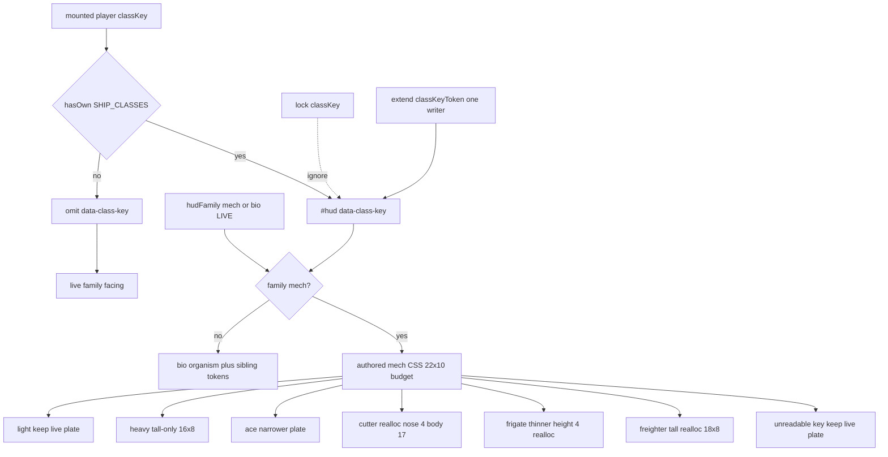

# RIMWARD HUD-02 remaining plated / mech class silhouettes

| Field | Value |
|---|---|
| **Title** | RIMWARD HUD-02 remaining plated / mech class silhouettes |
| **Author** | Wave 113 HUD-02 mech leftover integrator |
| **Date** | 2026-08-24 |
| **Status** | Wave 114 first impl (PR1 plated facing class tokens) |
| **Wave** | 114 — first impl. Extend `classKeyToken` for mech; authored mech class CSS in 22×10. Wave 113 remains the pre-PR1 census. |
| **Owner request** | Remaining HUD-02 leftover after Wave 62 skins, Wave 65 family audio, SHP plated remount, and Wave 111 living leftover: living vs conventional identities already ship; plated 3D class meshes already remount. Census whether the live HUD still draws **one generic mechanical plate** for every plated class (`light`/`heavy`/`ace`/`cutter`/`frigate`/`freighter` with `hullKind:'built'`). If real, freeze a later serial that can **hint class on existing mech facing chrome** without a new aim-glass gauge, without stealing HUD-01 empty 80 px hub, without a new Digit, without `state.js` write, without a new persist key, without `innerHTML`, without rewriting `hudFamily`, without adding bio tokens (that is the sibling). |
| **Merge law** | [`out/w113/hud02mech/shared-contract.md`](../out/w113/hud02mech/shared-contract.md). If this document and that file conflict, the contract wins. |
| **Honor** | HUD-01 empty hub. Digit 0 shipyard. Digit 8/9 stay. `hudFamily` mech\|bio. `#hud[data-family]`. Class is **inside mech**, not a third family (`out/w61/shared-contract.md` §3.2). `state.js` READ-ONLY; later **no** `state.js` write and **no** new persist key. `innerHTML` forbidden later. No class pip on `.rw-reticle`. Kit mutate omit. HUD-03 free skin override stays closed. Aim-glass gauges stay off. Wave 62 skins + Wave 65 audio consume. Living bio tokens are **other worker**. Do **not** edit sibling Bio/Nav/Msn/Rep/Phy/Shp/Tgt/Owner docs, the wishlist, `PROGRESS.md`, `docs/Hud02IdentitiesDesign.md`, `docs/Hud02RemainingSilhouettesDesign.md`, `docs/Hud03AlertsDesign.md`, or `docs/HudUtilityChangeProposal.md`. |

**Verifier record:**

| Note | Path |
|---|---|
| Inventory (code wins; Wave 113 census) | [`out/w113/hud02mech/current-hud02-mech-silhouette-inventory.md`](../out/w113/hud02mech/current-hud02-mech-silhouette-inventory.md) |
| Merge law | [`out/w113/hud02mech/shared-contract.md`](../out/w113/hud02mech/shared-contract.md) |
| Wave 114 probe | [`out/w114/hud02mech/probe.mjs`](../out/w114/hud02mech/probe.mjs) |
| Wave 114 security review | [`out/w114/hud02mech/security-review.md`](../out/w114/hud02mech/security-review.md) |
| Wave 114 code review | [`out/w114/hud02mech/code-review.md`](../out/w114/hud02mech/code-review.md) |
| Wave 114 UI audit | [`out/w114/hud02mech/ui-audit.md`](../out/w114/hud02mech/ui-audit.md) |
| Wave 113 security review | [`out/w113/hud02mech/security-review.md`](../out/w113/hud02mech/security-review.md) |
| Wave 113 design-doc review | [`out/w113/hud02mech/code-review.md`](../out/w113/hud02mech/code-review.md) |
| Wave 113 UI audit | [`out/w113/hud02mech/ui-audit.md`](../out/w113/hud02mech/ui-audit.md) |

Siblings BIO, NAV, MSN, REP, PHY, SHP, TGT, FX, living HUD-02, wishlist, `PROGRESS.md`, frozen `docs/Hud02IdentitiesDesign.md`, frozen `docs/Hud02RemainingSilhouettesDesign.md`, and `docs/OwnerDecisions*.md` are **other workers**. **Do not edit** those paths. Do **not** write `docs/OwnerDecisionsWave113.md`. Do **not** write `src/`. Do **not** steal sibling Wave 113 paths (`out/w113/hud02/**`, `out/w113/fxscrape/**`).

**This is not a third HUD family.** **This is not HUD-01.** **This is not HUD-03.** **This is not the living class leftover.** Wishlist HUD-02 living vs conventional identities already shipped. Census still finds **one generic mechanical plate**.

---

## Overview

Wave 62 landed `hudFamily(ctx) → 'mech' | 'bio'`, `#hud[data-family]`, a mechanical plate facing, and one living organism facing. Wave 65 landed quiet family ticks. WAVE62 / WAVE65 boot pins already lock those surfaces. Frozen `docs/Hud02IdentitiesDesign.md` is the Wave 61/62 record — **cite, do not rewrite**. Frozen `docs/Hud02RemainingSilhouettesDesign.md` is the Wave 111 living leftover — **cite, do not rewrite**.

SHP plated remount already builds `buildPlayerPlatedMesh(classKey, faction)` for six built classes. Player `makeLivingHull` remains the living 3D quality bar (other). Living sibling PR1 **does** read `classKey` for **bio** chrome (`classKeyToken`, `hud.js` 101–108). The **mech** overlay still does **not** restyle by class: token omits when family is not bio, and no mech `[data-class-key]` CSS exists.

Census (code wins): family skins are **not** missing. Family audio is **not** missing. Living class tokens on bio chrome are **LIVE** (sibling). Class-specific **mech** HUD silhouettes **are** missing. `.rw-facing-sil` under `#hud[data-family="mech"]` is one 22×10 triangle + square for every plated class. Live fill uses 21 of 22 px.

This leftover is **class identity on existing mech facing chrome**, not a hub gauge, not a new Digit, not a family rewrite, not bio tokens.

This document is the integrator for a **later** implementation wave. Wave 113 this worker lands markdown only. Bindings do not change here.

HUD-01 empty aim glass stays empty. `state.js` stays READ-ONLY. No new persist key. Digit 0 stays shipyard. Digit 8/9 stay. Do not invent UU. Do not reopen HUD-03 skin override. Do not reopen kit mutate. Aim-glass gauges stay off.

Wave 113 deputize (recorded here and in the contract; owner may override after playtest): allowlisted `#hud[data-family="mech"][data-class-key]` plus authored CSS tokens on existing `.rw-facing-sil` plate (triangle + square), keyed off live mounted `classKey`. **Visual** restyle applies **only when family is mech**. Fail closed: unknown key omits the attribute and keeps live **family** facing. Family not mech: do not apply mech class CSS; do not paint the mechanical plate; do not delete an allowlisted attribute. Extend sibling `classKeyToken` (one writer). No new DOM on `.rw-reticle`. No `innerHTML`. No persist. No sil grow.

---

## Background & Motivation

### Current state (inventory)

Source of truth: [`out/w113/hud02mech/current-hud02-mech-silhouette-inventory.md`](../out/w113/hud02mech/current-hud02-mech-silhouette-inventory.md). Code wins over Wave 61 “mechanical facing” copy that already shipped **one** plate.

| Surface | Today | Cite |
|---|---|---|
| Family switch | `hudFamily` mech\|bio; hullKind / Beautiful / default bio | `hud.js` 81–89 |
| `#hud[data-family]` | init + 5 Hz | 1100, 1748 |
| Sibling class write | `classKeyToken` bio-only; `applyClassKeyAttr` | 101–115, 1101, 1757–1758 |
| Facing DOM | nose + body spans, FORE/AFT words | 354–361, 864, 875 |
| Mech facing | one plate triangle + square; 21/22 px | `hud.css` 1262–1284 |
| Bio facing | generic organism + sibling class tokens LIVE | 1503–1526; **1538–1617** |
| Hub | 80 px + RANGE | `hud.css` 184–193; `hud.js` 726–729 |
| Family audio | five CUES | `song.js` 114–130 |
| Class keys | six | `state.js` 37–44 |
| Player plated 3D | `buildPlayerPlatedMesh(classKey, faction)` | `npc.js` 182–185; `ship.js` 467–483 |
| Hangar persist | `classKey` on row | `save.js` 93–94; `hangar.js` 40–42 |
| Digit 0 / 8 / 9 | shipyard / launch / Standing | `station.js` 188, 5964–5965, 6101 |
| Session override | `rw-hud-family` mech\|bio only | `hud.js` 92–97 |
| `innerHTML` | none in `hud.js` | — |
| `#hud[data-class-key]` | bio LIVE; mech ABSENT | leftover = mech CSS |

### Pain points

- A naive later PR that adds a class pip on the 80 px hub reopens HUD-01.
- A naive later PR that switches `hudFamily` on `classKey` inverts Wave 61 §3.2 (class is role, not grown vs built).
- A naive later PR that `innerHTML`s an SVG from `classKey` is XSS.
- A naive later PR that persists `world.hudClass` invents a `WORLD_FIELDS` key hangar does not need.
- A naive later PR that restyles facing from the **lock** classKey invents a TGT instrument and can fight Q-ship cover.
- A naive later PR that photocopies Earth tanks / jet fighters onto 22 px glyphs ships a zoo.
- A naive later PR that clones plated GLBs into the overlay smashes the performance contract.
- Putting a class Digit or SKU impersonates the owner.
- Reopening HUD-03 “HUD style” reopens an owner-closed product question.
- Landing per-class audio reopens Wave 65 consume.
- Authoring bio clip-path here steals the sibling living leftover.
- Deleting `data-class-key` whenever family is not mech fights sibling living PR1.

### Why now (design) / why not now (code)

The owner asked for the HUD-02 **mech** leftover integrator so later serials can **hint plated class** on chrome that already exists. Inventory shows two families, one mech plate, six plated 3D class meshes. Merge law can exist without touching `src/`. Implementation waits so hub theft, Digit theft, `state.js` writes, new persist keys, family rewrite, innerHTML, lock-class leaks, and sibling bio theft are frozen before the first mech `[data-class-key]` rule. Wave 113 this worker does not ship `src/`.

If census had proved six HUD plated class silhouettes already, this pack would freeze **CONSUME** and name “no remaining HUD-02 mech silhouette leftover.” Census did not.

---

## Goals & Non-Goals

### Goals

1. Document live family switch, facing DOM/CSS, Digit/hub/persist, plated 3D vs overlay from **live code**.
2. Freeze leftover = **class hint on existing mech facing / plate chrome**. Not a new family.
3. Freeze allowlisted `data-class-key` from mounted player `classKey` via **extend** of live `classKeyToken`. Mech CSS applies **only when family is mech**. Fail closed = live **family** facing.
4. Freeze persist: **none** new. Hangar already has `classKey`.
5. Freeze Wave 62 family skins + Wave 65 audio as **consume**.
6. Freeze no new Digit, no `state.js` write, no UU, no hub child, no innerHTML, no aim-glass gauge.
7. Freeze HUD-03 skin override closed. Kit mutate omit.
8. Freeze lock classKey ignored. Player mounted key only.
9. Freeze 22×10 box / numeric reallocation budget / AGEZ / reducedMotion / duel parity. Never grow sil.
10. Freeze a serial PR plan. This wave writes the document. A later wave ships serially.
11. Freeze sibling bio tokens as consume. Do not specify bio clip-path.

### Non-goals (locked — do not reopen)

- No `src/` or live bindings in this worker.
- No `hudFamily` rewrite. No third family token.
- No HUD-01 hub child. No RANGE rewrite. No class combo meter.
- No new Digit. No toast required.
- No `SHIP_CLASSES` extra keys. No invented UU or SKU.
- No persist `world.hudClass`. No session class picker. No `hudSkin` setting.
- Do not clone plated GLBs or `makeLivingHull` onto HUD.
- Do not reopen Wave 65 audio or FX-02 music/radio.
- Do not steal BIO-07 bake, BIO-06 Hz, PHY, NAV, MATCH, hover, AP.
- Do not edit the wishlist, `PROGRESS.md`, `docs/Hud02IdentitiesDesign.md`, `docs/Hud02RemainingSilhouettesDesign.md`, Bio*, Nav*, Msn*, Rep*, OwnerDecisions*.
- Do not write `docs/OwnerDecisionsWave113.md`.
- Do not fix known boot FAILs.
- Do not author bio clip-path.

---

## Proposed Design

### 1. Merge resolutions (contract wins)

| Question | Integrator freeze | Why |
|---|---|---|
| Leftover real? | **Yes** — one generic mech plate | Inventory §11 |
| CONSUME? | **No** | Census |
| New persist key? | **No** | Hangar already has classKey |
| `state.js` write? | **No** | Contract §0.5 |
| Rewrite `hudFamily`? | **No** | Wave 62 consume |
| Hub class pip? | **No** | HUD-01 |
| `innerHTML` / SVG? | **No** | XSS |
| Lock classKey? | **No** | TGT / Q-ship |
| Fail closed? | Live **family** facing; no mech plate on bio | Owner; contract §0.12 |
| `reducedMotion`? | Static plate; no new loops | Live 1185–1188 |
| HUD / Digit / SKU? | **No** | Frozen |
| First serial steal Digit 0/8/9? | **No** | Contract §0.3 |
| Session class override? | **No** PR1 | Contract §0.6 |
| Per-class audio? | **No** | Wave 65 consume |
| HUD-03 skin picker? | **No** | Owner closed |
| Bio clip-path? | **No** — consume sibling | Contract §0.21 |
| Delete sibling attribute on bio? | **No** | Contract §0.12 |

### 2. Current facing paint (do not break FORE/AFT / family skins)

See inventory §§1–3. Load-bearing loops:

**Today (every plated class)**

1. `hudFamily` writes `data-family="mech"`.
2. CSS paints **one** triangle nose + square body in 22×10.
3. FORE/AFT words + fill vs hollow still carry facing.
4. Hangar `classKey` may be ace/cutter/heavy/… Sibling `classKeyToken` **omits** the attribute on mech, so the plate never changes.

**Today (living hull)**

1. `data-family="bio"`.
2. Generic organism, plus sibling class tokens when `data-class-key` is allowlisted (`hud.css` 1538–1617). **LIVE. Consume.** Do not paint the mech plate.

**This serial must not change** family switch, glance positions, RANGE, MATCH, Digit map, CUES, hub DOM. Additive: allowlisted attribute + authored **mech** CSS inside the sil box.

Digit 0 and `DOCK_KEY_SERVICES` stay. Digit 8/9 stay.

### 3. Deputize table (copy of contract §0.1)

Owner may override after playtest. Do not park.

| Knob | Value |
|---|---|
| Fail-closed | omit `data-class-key` if key not allowlisted → live **family** facing. Family not mech: no mech class CSS; do not paint the mech plate; do not delete allowlisted attribute. Never throw. Never `innerHTML` |
| Additive | extend `classKeyToken` (one writer) + CSS in 22×10 **under mech** per contract §0.14 budget; light plated may keep live plate |
| Family | consume Wave 62; class is **inside mech** |
| Persist | none new |
| Audio | consume Wave 65 |
| `reducedMotion` | static plate; no extra pulse |
| Alloc | no new nodes; existing 5 Hz `applyClassKeyAttr` |
| Missing data | live family facing |
| Sibling | consume LIVE `classKeyToken`; do not author bio clip-path |

Hint language (playtest may retune **px inside the budget**; **not** Earth tanks / wet-navy capitals). Copy of contract §0.14:

| `classKey` | Hint inside 22×10 (mech only) | Numeric freeze |
|---|---|---|
| `light` | Keep live generic plate | nose 5 / body 5,2,16×6 |
| `heavy` | Taller square in the same box | nose 5 / body 5,1,16×8; **no extra width** |
| `ace` | Narrower plate; sharper triangle | nose 4 / body 4,3,14×4 |
| `cutter` | Reallocated plate (shrink nose, body takes spare px) | nose 4 / body 4,2,17×6; `left+width=21` |
| `frigate` | Thinner plate; reallocated, not a capital photocopy | nose 3 / body 3,3,18×4; `left+width=21` |
| `freighter` | Tall **and** realloc (second axis vs heavy) | nose 3 / body 3,1,18×8; `left+width=21`; `top+height=9` |

If a key cannot read at 1600×900, omit **that** key’s mech CSS. Keep the live generic plate for that key. Never change sil `width`/`height`/`flex-basis`.

Bio family: this leftover does **not** add living class glyphs. Consume sibling / later living PR1.

### 4. Neighbours

| Module | This leftover does | This leftover does not |
|---|---|---|
| `hud.js` | later PR1 **extend** `classKeyToken` (one writer) | rewrite `hudFamily`; hub child; innerHTML; second writer |
| `hud.css` | authored `[data-class-key]` under **mech** inside §0.14 | grow sil box; AGEZ ink; new keyframes; bio clip-path |
| `state.js` | **read** `SHIP_CLASSES` allowlist | write |
| `hangar.js` / `save.js` | read mounted classKey | new WORLD_FIELDS |
| `song.js` | consume | new CUES |
| `ship.js` / `npc.js` plated mesh | honor 3D bar | clone onto HUD |
| `station.js` | cite Digit freeze | bind class Digit |
| Living leftover | consume sibling | edit `docs/Hud02RemainingSilhouettesDesign.md` |

### 5. Serial PR plan

Matches contract §3. **Named only. Do not implement in Wave 113.**

| PR | Lands | Does not land |
|---|---|---|
| **PR1 plated facing class tokens** | Extend `classKeyToken` for mech; mech CSS in 22×10 **§0.14 budget**; fail closed live family facing | `state.js`; Digit; persist key; hub; innerHTML; audio; family rewrite; bio tokens; sil grow |
| **PR2 plated class stills (optional)** | Six-key stills + optional WAVE pin after playtest | Required with PR1; boot FAIL fixes |
| **PR3 census (optional skip)** | Re-grep mech `[data-class-key]` selectors | New world field; hub pip |

First remaining serial is **PR1**. It must not steal Digit 0/8/9. It must not write `state.js`. Do not land a hub pip as required PR1.

### 6. Picture

Reuse live cameras. No new chrome. Class identity is a **22 px facing hint**, not a HUD label, not a 3D clone.

No class pip. RANGE stays TGT-01. FORE/AFT words stay. Family skins stay. No new toast required. Not a zoo of Earth tanks.

---

## Player outcome (later serial; freeze here)

Mount a plated **light**. Facing glyph looks like today (triangle + square). Digit 0 is still shipyard.

Buy and mount a plated **heavy**. The same FORE/AFT row now hints a taller plate (16×8) in the 22×10 box. Screen / Shell / petals / SPD do not move. The 80 px hub stays empty. Bio organism does not appear (hull is still built).

Mount a plated **freighter**. The plate is tall **and** realloc (18×8, nose 3). It does not match heavy. Color does not carry the class.

Mount plated **ace / cutter / frigate**. Each plated class reads as a **different** static plate in that box. Cutter and frigate look longer only because the nose shrinks and the body takes the spare pixels. The sil stays 22×10. Still one mechanical lineage, not a zoo of Earth tanks or wet-navy capitals.

Mount a **living** hull. Bio organism stays. Sibling class tokens stay. This leftover does **not** restyle it and does **not** paint a mechanical plate.

Unknown or hostile save `classKey`. Overlay keeps live **family** facing. Game still flies.

`reducedMotion` still kills iris / hair / flash loops. Class plate stays static.

**Family skins** are **not** this work. **Family audio** is **not** this work. **Living class tokens** are **not** this work. **Plated GLB bake** is **not** this work.

---

## Security

See [`out/w113/hud02mech/security-review.md`](../out/w113/hud02mech/security-review.md).

- XSS: no new DOM on the hub. `innerHTML` forbidden later. Do not interpolate `classKey` into HTML or CSS text.
- Proto: allowlist `hasOwn` `SHIP_CLASSES` before `dataset.classKey`. Unknown omit.
- Persist: no new key; hangar already holds classKey.
- No secrets. No Digit theft. No UU.
- Fail-closed never freeze the sim.
- Ignore lock classKey (cover / TGT).
- Do not delete sibling bio `data-class-key` on an allowlisted key.

---

## Acceptance direction (implementation wave)

1. Extend live `classKeyToken` so allowlisted mounted `classKey` sets `#hud[data-class-key]` on mech **and** bio. One writer. Unknown omits the attribute. Mech CSS matches only `#hud[data-family="mech"][data-class-key]`.
2. Fail closed: live **family** facing still paints. Never throw. Never `innerHTML`. Never zero speed. Never paint the mech plate on bio. Never delete an allowlisted attribute on bio.
3. Mech CSS variants stay inside 22×10 per §0.14 (`left+width ≤ 22`). FORE/AFT words remain. Hub gains **no** child. Sil size does not change.
4. `hudFamily` still mech|bio. WAVE62 / WAVE65 pins still pass.
5. No new persist key. Digit 0 shipyard. Digit 8/9 stay.
6. Lock / target classKey does not drive the glyph.
7. `reducedMotion` adds no facing loop.
8. Known boot FAILs untouched.
9. Bio clip-path untouched. Consume sibling / later living PR1.

---

## Alternatives considered

| Alternative | Why not |
|---|---|
| Freeze CONSUME | Census: one generic mech plate remains |
| Third family token | Wave 62 already splits mech/bio |
| Switch family on classKey | w61 §3.2; ace can be living or built |
| Class pip on hub / RANGE | HUD-01 / TGT-01 |
| Digit / SKU / UU | Owner impersonation |
| `innerHTML` SVG from key | XSS |
| Persist `world.hudClass` | Hangar already has classKey |
| Session class picker | HUD-03-like; owner closed free skin |
| Lock-class facing | New TGT instrument; Q-ship cover |
| Clone plated GLB / `makeLivingHull` | Perf |
| Per-class audio | Wave 65 consume |
| Earth tank / fighter glyphs | Zoo law |
| Grow sil box | AGEZ / duel parity |
| “Longer” overflow past 22 px | Live plate already fills 21 px |
| Collide `heavy` and `freighter` | Split on a second in-box axis (§0.14) |
| Gold / grey fill as class cue | Geometry only |
| Force mech plate onto bio | Sibling living tokens |
| HUD-03 `hudSkin` | Owner closed |
| Author bio clip-path here | Sibling leftover |

---

## Regression risks

| Risk | Mitigation |
|---|---|
| Hub pip / Digit steal | contract §0.2–0.3 |
| `state.js` / new persist key | contract §0.5–0.6 |
| Family switch invert | consume WAVE62; do not read classKey in `hudFamily` |
| XSS via classKey | allowlist; authored CSS only |
| Proto `__proto__` key | `hasOwn` SHIP_CLASSES; omit |
| Lock class leak | player mounted key only |
| `reducedMotion` pulse | no new facing keyframes |
| Duel disadvantage | same glance set; plate inside 22×10 |
| WAVE62/65 pin invert | honor; optional new pin only |
| Sibling living steal | contract §0.12, §0.21; extend one writer; do not delete on bio |
| 22 px overflow | contract §0.14 numeric budget; unreadable key omit CSS |
| Heavy/freighter same plate | heavy 16×8; freighter realloc 18×8; uniqueness invariant |
| Zoo glyphs | hint table; plate metrics; not photocopies |
| Class-only remount ignored | live `applyClassKeyAttr` already 5 Hz; extend family gate |

---

## Ownership

| Object | Writer | Reader |
|---|---|---|
| `data-class-key` | extend live `classKeyToken` (one writer) | `hud.css` mech selectors |
| Mech facing variants | later PR1 | overlay |
| Bio facing variants | **none** | consume sibling |
| `hudFamily` | **none** | consume |
| Family CUES | **none** | consume |
| `state.js` | **none** | SHIP_CLASSES read |
| Hangar classKey | **none** | HUD read |
| HUD / Digit | **none** new | — |

---

## Open owner questions

**Deputized this wave** (contract §0.1). Owner may override after playtest. Do not park.

1. Smallest additive = extend `classKeyToken` + CSS tokens on existing mech facing plate inside the 22×10 budget. Fail closed = live **family** facing.
2. Family skins and family audio stay LIVE consume. Not rewritten.
3. No new persist key. Hangar classKey is enough.
4. Home: `hud.js` + `hud.css`. Not `state.js`. Not a new Digit. Not the hub.
5. Optional PR2 stills are skippable after playtest.
6. Leftover is **real**. Not CONSUME.
7. Living bio tokens stay sibling. Consume sibling / later living PR1.
