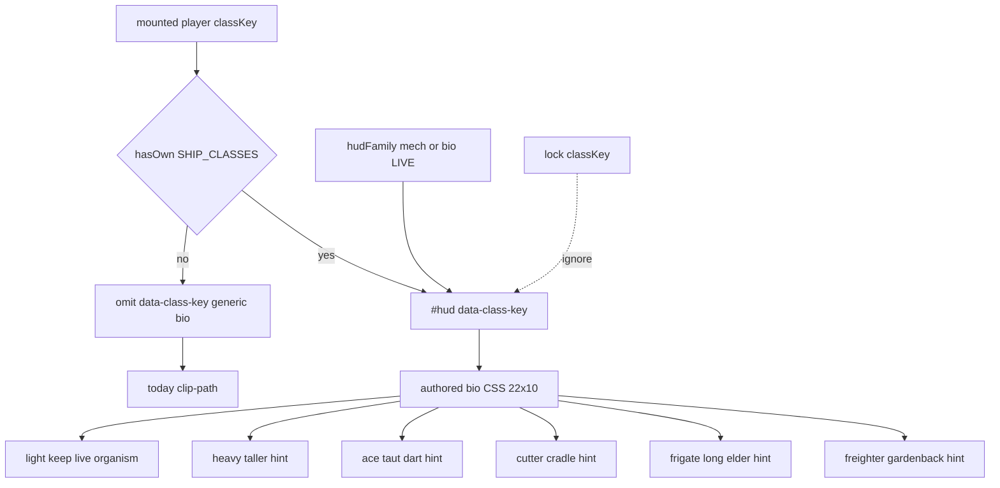

# RIMWARD HUD-02 remaining living class silhouettes

| Field | Value |
|---|---|
| **Title** | RIMWARD HUD-02 remaining living class silhouettes |
| **Author** | Wave 111 HUD-02 integrator; Wave 113 PR1 impl |
| **Date** | 2026-08-24 |
| **Status** | Wave 113 first impl — PR1 living facing class tokens |
| **Wave** | 111 — markdown + merge law. 113 — first impl (`hud.js` / `hud.css` allowlisted `#hud[data-class-key]`, authored bio CSS in 22×10, 5 Hz write-on-change). |
| **Owner request** | Remaining HUD-02 leftover after Wave 62 skins, Wave 65 family audio, and Wave 106 BIO-07 class bodies: living vs conventional identities already ship; BIO-07 gave Beautiful NPC six class bodies. Census whether the live HUD still draws **one generic living facing silhouette / rail chrome** for every living class. If real, freeze a later serial that can **hint class identity on existing HUD-02 living chrome** without a new aim-glass gauge, without stealing HUD-01 empty 80 px hub, without a new Digit, without `state.js` write, without a new persist key, without `innerHTML`. |
| **Merge law** | [`out/w111/hud02/shared-contract.md`](../out/w111/hud02/shared-contract.md). If this document and that file conflict, the contract wins. |
| **Honor** | HUD-01 empty hub. Digit 0 shipyard. Digit 8/9 stay. `hudFamily` mech\|bio. `#hud[data-family]`. `state.js` READ-ONLY; later **no** `state.js` write and **no** new persist key. `innerHTML` forbidden later. No class pip on `.rw-reticle`. Kit mutate omit. HUD-03 free skin override stays closed. Aim-glass gauges stay off. Wave 62 skins + Wave 65 audio consume. BIO-07 bake / `makeLivingHull` are **other**. Do **not** edit sibling Bio/Nav/Msn/Rep/Phy/Shp/Tgt/Owner docs, the wishlist, `PROGRESS.md`, `docs/Hud02IdentitiesDesign.md`, `docs/Hud03AlertsDesign.md`, or `docs/HudUtilityChangeProposal.md`. |

**Verifier record:**

| Note | Path |
|---|---|
| Inventory (Wave 111 census; code wins at that date) | [`out/w111/hud02/current-hud02-silhouette-inventory.md`](../out/w111/hud02/current-hud02-silhouette-inventory.md) |
| Merge law | [`out/w111/hud02/shared-contract.md`](../out/w111/hud02/shared-contract.md) |
| Wave 111 security review | [`out/w111/hud02/security-review.md`](../out/w111/hud02/security-review.md) |
| Wave 111 design-doc review | [`out/w111/hud02/code-review.md`](../out/w111/hud02/code-review.md) |
| Wave 111 UI audit | [`out/w111/hud02/ui-audit.md`](../out/w111/hud02/ui-audit.md) |
| Wave 113 probe | [`out/w113/hud02/probe.mjs`](../out/w113/hud02/probe.mjs) |
| Wave 113 security review | [`out/w113/hud02/security-review.md`](../out/w113/hud02/security-review.md) |
| Wave 113 code review | [`out/w113/hud02/code-review.md`](../out/w113/hud02/code-review.md) |
| Wave 113 UI audit | [`out/w113/hud02/ui-audit.md`](../out/w113/hud02/ui-audit.md) |
| Wave 113 notes | [`out/w113/hud02/notes.md`](../out/w113/hud02/notes.md) |

Siblings BIO, NAV, MSN, REP, PHY, SHP, TGT, FX, wishlist, `PROGRESS.md`, frozen `docs/Hud02IdentitiesDesign.md`, and `docs/OwnerDecisions*.md` are **other workers**. **Do not edit** those paths. Do **not** write `docs/OwnerDecisionsWave111.md`. Wave 111 did **not** write `src/`. Wave 113 PR1 may write `src/systems/hud.js`, `src/ui/hud.css`, and append WAVE113 pins to `scripts/boot-test.mjs` only. Do **not** steal sibling Wave 111 paths (`src/systems/station.js`, `src/systems/combat.js`, `docs/Rep03RemedialDesign.md`, `docs/Fx01RemainingDesign.md`, `out/w111/rep03/**`, `out/w111/fx01/**`).

**This is not a third HUD family.** **This is not HUD-01.** **This is not HUD-03.** **This is not BIO-07 bake.** Wishlist HUD-02 living vs conventional identities already shipped.

Wave 113 landed **PR1 living facing class tokens** (allowlisted `#hud[data-class-key]`, authored bio CSS inside 22×10, 5 Hz write-on-change, fail closed generic bio). The Wave 111 inventory below is the census **before** that landing. Do not rewrite it as if PR1 already existed in Wave 111.

---

## Overview

Wave 62 landed `hudFamily(ctx) → 'mech' | 'bio'`, `#hud[data-family]`, a mechanical plate facing, and one living organism facing. Wave 65 landed quiet family ticks. WAVE62 / WAVE65 boot pins already lock those surfaces. Frozen `docs/Hud02IdentitiesDesign.md` is the Wave 61/62 record — **cite, do not rewrite**.

Wave 106 BIO-07 gave Beautiful class bodies six marine plans (light wayfinder, heavy shieldback, ace squid, cutter shark, frigate octopus, freighter gardenback). Player `makeLivingHull` remains the 3D quality bar and already applies a modest cutter/heavy rest scale. The overlay does not read `classKey`.

Census (code wins): family skins are **not** missing. Family audio is **not** missing. Class-specific HUD silhouettes **are** missing. `.rw-facing-sil` is one 22×10 bio clip-path for every living class.

This leftover is **class identity on existing living chrome**, not a hub gauge, not a new Digit, not a family rewrite.

This document is the integrator for a **later** implementation wave. Wave 111 this worker lands markdown only. Bindings do not change here.

HUD-01 empty aim glass stays empty. `state.js` stays READ-ONLY. No new persist key. Digit 0 stays shipyard. Digit 8/9 stay. Do not invent UU. Do not reopen HUD-03 skin override. Do not reopen kit mutate. Aim-glass gauges stay off.

Wave 111 deputize (recorded here and in the contract; owner may override after playtest): allowlisted `#hud[data-class-key]` plus authored CSS tokens on existing `.rw-facing-sil` / bio chrome, keyed off live mounted `classKey`; fail closed keep today’s generic living chrome; no new DOM on `.rw-reticle`; no `innerHTML`; no persist.

---

## Background & Motivation

### Current state (inventory)

Source of truth: [`out/w111/hud02/current-hud02-silhouette-inventory.md`](../out/w111/hud02/current-hud02-silhouette-inventory.md). Code wins over Wave 61 “organic facing silhouettes” copy that already shipped **one** bio glyph.

| Surface | Today | Cite |
|---|---|---|
| Family switch | `hudFamily` mech\|bio; hullKind / Beautiful / default bio | `hud.js` 81–89 |
| `#hud[data-family]` | init + 5 Hz; **no classKey** | 1083, 1719–1737 |
| Facing DOM | nose + body spans, FORE/AFT words | 337–344, 847, 858 |
| Bio facing | one ellipse + one organism polygon | `hud.css` 1503–1526 |
| Mech facing | one plate triangle + square | 1262–1284 |
| Hub | 80 px + RANGE | `hud.css` 184–193; `hud.js` 709–712 |
| Family audio | five CUES | `song.js` 114–130 |
| Class keys | six | `state.js` 37–44 |
| Player 3D | `makeLivingHull`; modest cutter/heavy sil | `ship.js` 264–268, 280–339 |
| Hangar persist | `classKey` on row | `save.js` 94; `hangar.js` 40–42 |
| Digit 0 / 8 / 9 | shipyard / launch / Standing | `station.js` 188, 5963–5966, 6101 |
| Session override | `rw-hud-family` mech\|bio only | `hud.js` 92–97 |
| `innerHTML` | none in `hud.js` | — |

### Pain points

- A naive later PR that adds a species pip on the 80 px hub reopens HUD-01.
- A naive later PR that switches `hudFamily` on `classKey` inverts Wave 61 §3.2 (class is role, not grown vs built).
- A naive later PR that `innerHTML`s an SVG from `classKey` is XSS.
- A naive later PR that persists `world.hudClass` invents a `WORLD_FIELDS` key hangar does not need.
- A naive later PR that restyles facing from the **lock** classKey invents a TGT instrument and can fight Q-ship cover.
- A naive later PR that photocopies Earth sharks/squid onto 22 px glyphs ships a zoo (BIO-07 law).
- A naive later PR that clones `makeLivingHull` or NPC GLBs into the overlay smashes the performance contract and BIO-07 preserve.
- Putting a class Digit or SKU impersonates the owner.
- Reopening HUD-03 “HUD style” reopens an owner-closed product question.
- Landing per-class audio reopens Wave 65 consume.

### Why now (design) / why not now (code)

The owner asked for the HUD-02 integrator leftover so later serials can **hint living class** on chrome that already exists. Inventory shows two families, one bio glyph, six 3D class bodies. Merge law can exist without touching `src/`. Implementation waits so hub theft, Digit theft, `state.js` writes, new persist keys, family rewrite, innerHTML, and lock-class leaks are frozen before the first `dataset.classKey`. Wave 111 this worker does not ship `src/`.

If census had proved six HUD class silhouettes already, this pack would freeze **CONSUME** and name “no remaining HUD-02 silhouette leftover.” Census did not.

---

## Goals & Non-Goals

### Goals

1. Document live family switch, facing DOM/CSS, Digit/hub/persist, BIO-07 3D vs overlay from **live code**.
2. Freeze leftover = **class hint on existing bio facing / rail chrome**. Not a new family.
3. Freeze allowlisted `data-class-key` from mounted player `classKey`. Fail closed generic bio.
4. Freeze persist: **none** new. Hangar already has `classKey`.
5. Freeze Wave 62 family skins + Wave 65 audio as **consume**.
6. Freeze no new Digit, no `state.js` write, no UU, no hub child, no innerHTML, no aim-glass gauge.
7. Freeze HUD-03 skin override closed. Kit mutate omit.
8. Freeze lock classKey ignored. Player mounted key only.
9. Freeze 22×10 box / AGEZ / reducedMotion / duel parity.
10. Freeze a serial PR plan. This wave writes the document. A later wave ships serially.

### Non-goals (locked — do not reopen)

- No `src/` or live bindings in this worker.
- No `hudFamily` rewrite. No third family token.
- No HUD-01 hub child. No RANGE rewrite. No class combo meter.
- No new Digit. No toast required.
- No `SHIP_CLASSES` extra keys. No invented UU or SKU.
- No persist `world.hudClass`. No session class picker. No `hudSkin` setting.
- Do not clone `makeLivingHull` or NPC GLBs onto HUD.
- Do not reopen Wave 65 audio or FX-02 music/radio.
- Do not steal BIO-07 bake, BIO-06 Hz, PHY, NAV, MATCH, hover, AP.
- Do not edit the wishlist, `PROGRESS.md`, `docs/Hud02IdentitiesDesign.md`, Bio*, Nav*, Msn*, Rep*, OwnerDecisions*.
- Do not write `docs/OwnerDecisionsWave111.md`.
- Do not fix known boot FAILs.

---

## Proposed Design

### 1. Merge resolutions (contract wins)

| Question | Integrator freeze | Why |
|---|---|---|
| Leftover real? | **Yes** — one generic bio glyph | Inventory §11 |
| CONSUME? | **No** | Census |
| New persist key? | **No** | Hangar already has classKey |
| `state.js` write? | **No** | Contract §0.5 |
| Rewrite `hudFamily`? | **No** | Wave 62 consume |
| Hub species pip? | **No** | HUD-01 |
| `innerHTML` / SVG? | **No** | XSS |
| Lock classKey? | **No** | TGT / Q-ship |
| Fail closed? | Generic live bio chrome | Owner; inventory §9 |
| `reducedMotion`? | Static clip; no new loops | Live 1185–1188 |
| HUD / Digit / SKU? | **No** | Frozen |
| First serial steal Digit 0/8/9? | **No** | Contract §0.3 |
| Session class override? | **No** PR1 | Contract §0.6 |
| Per-class audio? | **No** | Wave 65 consume |
| HUD-03 skin picker? | **No** | Owner closed |

### 2. Current facing paint (do not break FORE/AFT / family skins)

See inventory §§1–3. Load-bearing loops:

**Today (every living class)**

1. `hudFamily` writes `data-family="bio"`.
2. CSS paints **one** organism nose + body in 22×10.
3. FORE/AFT words + fill vs hollow still carry facing.
4. Hangar `classKey` may be ace/cutter/heavy/… HUD never looks.

**Today (built hull)**

1. `data-family="mech"`.
2. One plate glyph. Not this leftover.

**This serial must not change** family switch, glance positions, RANGE, MATCH, Digit map, CUES, hub DOM. Additive: allowlisted attribute + authored CSS inside the sil box.

Digit 0 and `DOCK_KEY_SERVICES` stay. Digit 8/9 stay.

### 3. Deputize table (copy of contract §0.1)

Owner may override after playtest. Do not park.

| Knob | Value |
|---|---|
| Fail-closed | omit `data-class-key`; keep generic bio; never throw; never `innerHTML` |
| Additive | allowlisted `data-class-key` + CSS in 22×10; light may keep live glyph |
| Family | consume Wave 62; class is **inside bio** |
| Persist | none new |
| Audio | consume Wave 65 |
| `reducedMotion` | static clip; no extra pulse |
| Alloc | no new nodes; 5 Hz write-on-change |
| Missing data | live generic bio |

Hint language (playtest may retune clip-path; **not** Earth toys):

| `classKey` | Hint inside 22×10 (bio only) |
|---|---|
| `light` | Keep live generic organism (wayfinder identity) |
| `heavy` | Taller denser body in the same box |
| `ace` | Narrower taut dart |
| `cutter` | Slightly longer ventral-cradle body (no teeth) |
| `frigate` | Longer thinner elder |
| `freighter` | Bulkier gardenback mass |

Mech family: PR1 does **not** add plated class glyphs.

### 4. Neighbours

| Module | This leftover does | This leftover does not |
|---|---|---|
| `hud.js` | later PR1 5 Hz `dataset.classKey` | rewrite `hudFamily`; hub child; innerHTML |
| `hud.css` | authored `[data-class-key]` under bio | grow sil box; AGEZ ink; new keyframes |
| `state.js` | **read** `SHIP_CLASSES` allowlist | write |
| `hangar.js` / `save.js` | read mounted classKey | new WORLD_FIELDS |
| `song.js` | consume | new CUES |
| `ship.js` `makeLivingHull` | honor 3D bar | clone onto HUD |
| `station.js` | cite Digit freeze | bind class Digit |
| BIO-07 builders | none | bake / GLB |

### 5. Serial PR plan

Matches contract §3. **Named only. Do not implement in Wave 111.**

| PR | Lands | Does not land |
|---|---|---|
| **PR1 living facing class tokens** | Allowlisted `data-class-key`; bio CSS in 22×10; fail closed generic bio | `state.js`; Digit; persist key; hub; innerHTML; audio; family rewrite |
| **PR2 class stills (optional)** | Six-key stills + optional WAVE pin after playtest | Required with PR1; boot FAIL fixes |
| **PR3 census (optional skip)** | Re-grep attribute + selectors | New world field; hub pip |

First remaining serial is **PR1**. It must not steal Digit 0/8/9. It must not write `state.js`. Do not land a hub pip as required PR1.

### 6. Picture

Reuse live cameras. No new chrome. Class identity is a **22 px facing hint**, not a HUD label, not a 3D clone.

No class pip. RANGE stays TGT-01. FORE/AFT words stay. Family skins stay. No new toast required.

---

## Player outcome (later serial; freeze here)

Mount a living **light**. Facing glyph looks like today (wayfinder / generic organism). Digit 0 is still shipyard.

Buy and mount a living **heavy**. The same FORE/AFT row now hints a taller shieldback mass in the 22×10 box. Screen / Shell / petals / SPD do not move. The 80 px hub stays empty. Mech plate does not appear (hull is still living).

Mount **ace / cutter / frigate / freighter**. Each living class reads as a **different** static clip in that box, still one Beautiful lineage, not a zoo of Earth animals.

Mount a **built** hull. Mech plate stays. Class tokens do not restyle the plate in PR1.

Unknown or hostile save `classKey`. Overlay keeps today’s generic living chrome. Game still flies.

`reducedMotion` still kills iris / hair / flash loops. Class clip stays static.

**Family skins** are **not** this work. **Family audio** is **not** this work. **BIO-07 bake** is **not** this work. **`makeLivingHull`** is **not** this work.

---

## Security

See [`out/w111/hud02/security-review.md`](../out/w111/hud02/security-review.md).

- XSS: no new DOM on the hub. `innerHTML` forbidden later. Do not interpolate `classKey` into HTML or CSS text.
- Proto: allowlist `hasOwn` `SHIP_CLASSES` before `dataset.classKey`. Unknown omit.
- Persist: no new key; hangar already holds classKey.
- No secrets. No Digit theft. No UU.
- Fail-closed never freeze the sim.
- Ignore lock classKey (cover / TGT).

---

## Acceptance direction (implementation wave)

1. Allowlisted mounted `classKey` sets `#hud[data-class-key]` on 5 Hz write-on-change. Unknown omits the attribute.
2. Fail closed: generic live bio clip still paints. Never throw. Never `innerHTML`. Never zero speed.
3. Bio CSS variants stay inside 22×10. FORE/AFT words remain. Hub gains **no** child.
4. `hudFamily` still mech|bio. WAVE62 / WAVE65 pins still pass.
5. No new persist key. Digit 0 shipyard. Digit 8/9 stay.
6. Lock / target classKey does not drive the glyph.
7. `reducedMotion` adds no facing loop.
8. Known boot FAILs untouched.

---

## Alternatives considered

| Alternative | Why not |
|---|---|
| Freeze CONSUME | Census: one generic bio glyph remains |
| Third family token | Wave 62 already splits mech/bio |
| Switch family on classKey | w61 §3.2; ace can be living or built |
| Species pip on hub / RANGE | HUD-01 / TGT-01 |
| Digit / SKU / UU | Owner impersonation |
| `innerHTML` SVG from key | XSS |
| Persist `world.hudClass` | Hangar already has classKey |
| Session class picker | HUD-03-like; owner closed free skin |
| Lock-class facing | New TGT instrument; Q-ship cover |
| Clone `makeLivingHull` / GLB | Perf; BIO-07 preserve |
| Per-class audio | Wave 65 consume |
| Earth animal glyphs | BIO-07 zoo law |
| Grow sil box | AGEZ / duel parity |
| HUD-03 `hudSkin` | Owner closed |

---

## Regression risks

| Risk | Mitigation |
|---|---|
| Hub pip / Digit steal | contract §0.2–0.3 |
| `state.js` / new persist key | contract §0.5–0.6 |
| Family switch invert | consume WAVE62; do not read classKey in `hudFamily` |
| XSS via classKey | allowlist; authored CSS only |
| Proto `__proto__` key | `hasOwn` SHIP_CLASSES; omit |
| Lock class leak | player mounted key only |
| `reducedMotion` pulse | no new facing keyframes |
| Duel disadvantage | same glance set; clip inside 22×10 |
| WAVE62/65 pin invert | honor; optional new pin only |
| Sibling station / combat steal | this pack does not touch those paths |
| Zoo glyphs | hint table; not photocopies |

---

## Ownership

| Object | Writer | Reader |
|---|---|---|
| `data-class-key` | later PR1 | `hud.css` |
| Bio facing variants | later PR1 | overlay |
| `hudFamily` | **none** | consume |
| Family CUES | **none** | consume |
| `state.js` | **none** | SHIP_CLASSES read |
| Hangar classKey | **none** | HUD read |
| HUD / Digit | **none** new | — |

---

## Open owner questions

**Deputized this wave** (contract §0.1). Owner may override after playtest. Do not park.

1. Smallest additive = allowlisted `data-class-key` + CSS tokens on existing living facing / bio chrome. Fail closed = today’s generic living chrome.
2. Family skins and family audio stay LIVE consume. Not rewritten.
3. No new persist key. Hangar classKey is enough.
4. Home: `hud.js` + `hud.css`. Not `state.js`. Not a new Digit. Not the hub.
5. Optional PR2 stills are skippable after playtest.
6. Leftover is **real**. Not CONSUME.
