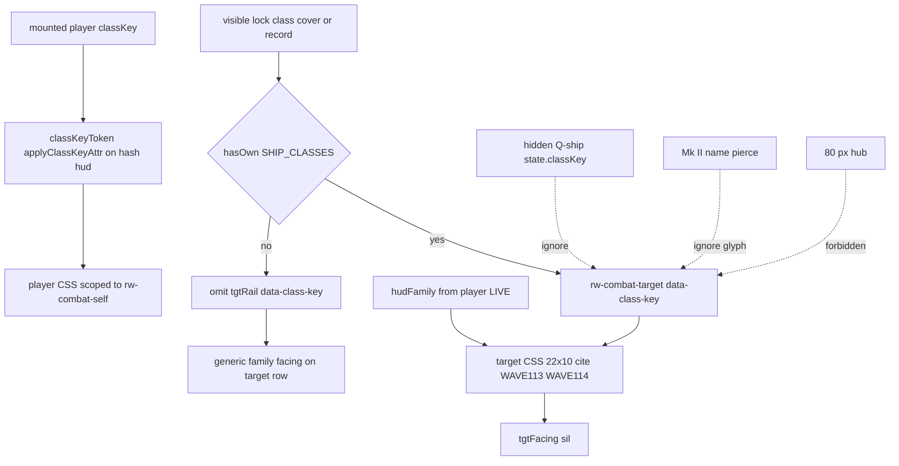

# RIMWARD HUD-02 remaining TARGET class silhouettes

| Field | Value |
|---|---|
| **Title** | RIMWARD HUD-02 remaining TARGET class silhouettes |
| **Author** | Wave 115 HUD-02 target leftover integrator |
| **Date** | 2026-08-24 |
| **Status** | Implemented Wave 116. |
| **Wave** | 115 — markdown + merge law. Later serial **PR1 target facing class tokens** (named only). |
| **Owner request** | Remaining HUD-02 leftover after Wave 62 skins, Wave 65 family audio, Wave 113 living **player** facing tokens, and Wave 114 plated **player** facing tokens. Live `classKeyToken` reads `ctx.player.classKey` only. `#hud[data-class-key]` therefore restyles both `selfFacing` and `tgtFacing` from the **player** class. Target rail already has `makeFacing(tgtRail)`. Census whether lock / target class still lacks its own facing token. If real, freeze a later serial that can **hint lock/target class on existing target facing chrome** without a hub pip, without stealing HUD-01 empty 80 px hub, without a new Digit, without `state.js` write, without a new persist key, without `innerHTML`, without rewriting `hudFamily`, without stealing WAVE113/114 player tokens. |
| **Merge law** | [`out/w115/hud02tgt/shared-contract.md`](../out/w115/hud02tgt/shared-contract.md). If this document and that file conflict, the contract wins. |
| **Honor** | HUD-01 empty hub. Digit 0 shipyard. Digit 8/9 stay. KeyT/KeyV/KeyK/KeyX stay. `hudFamily` mech\|bio from **player** hullKind. `#hud[data-family]`. Class is **inside** family, not a third family. `state.js` READ-ONLY; later **no** `state.js` write and **no** new persist key. `innerHTML` forbidden later. No class pip on `.rw-reticle`. Kit mutate omit. HUD-03 free skin override stays closed. Aim-glass gauges stay off. Wave 62 skins + Wave 65 audio consume. Wave 112 live knobs consume (`docs/OwnerDecisionsWave112.md` — **cite, do not edit**). WAVE113 bio CSS and WAVE114 mech CSS remain **player** facing — **cite, do not steal as this leftover**. Do **not** edit sibling Bio/Nav/Msn/Rep/Phy/Shp/Tgt/Owner docs, the wishlist, `PROGRESS.md`, `docs/Hud02IdentitiesDesign.md`, `docs/Hud02RemainingSilhouettesDesign.md`, `docs/Hud02RemainingMechSilhouettesDesign.md`, `docs/Hud03AlertsDesign.md`, or `docs/Fx01*.md`. |

**Verifier record:**

| Note | Path |
|---|---|
| Inventory (code wins; Wave 115 census) | [`out/w115/hud02tgt/current-hud02-target-silhouette-inventory.md`](../out/w115/hud02tgt/current-hud02-target-silhouette-inventory.md) |
| Merge law | [`out/w115/hud02tgt/shared-contract.md`](../out/w115/hud02tgt/shared-contract.md) |
| Wave 115 security review | [`out/w115/hud02tgt/security-review.md`](../out/w115/hud02tgt/security-review.md) |
| Wave 115 design-doc review | [`out/w115/hud02tgt/code-review.md`](../out/w115/hud02tgt/code-review.md) |
| Wave 115 UI audit | [`out/w115/hud02tgt/ui-audit.md`](../out/w115/hud02tgt/ui-audit.md) |
| Wave 115 notes | [`out/w115/hud02tgt/notes.md`](../out/w115/hud02tgt/notes.md) |
| Wave 116 probe | [`out/w116/hud02tgt/probe.mjs`](../out/w116/hud02tgt/probe.mjs) |
| Wave 116 notes | [`out/w116/hud02tgt/notes.md`](../out/w116/hud02tgt/notes.md) |
| Wave 116 security review | [`out/w116/hud02tgt/security-review.md`](../out/w116/hud02tgt/security-review.md) |
| Wave 116 code review | [`out/w116/hud02tgt/code-review.md`](../out/w116/hud02tgt/code-review.md) |
| Wave 116 UI audit | [`out/w116/hud02tgt/ui-audit.md`](../out/w116/hud02tgt/ui-audit.md) |

Siblings BIO, NAV, MSN, REP, PHY, SHP, TGT, FX, living HUD-02, plated HUD-02, wishlist, `PROGRESS.md`, frozen `docs/Hud02IdentitiesDesign.md`, frozen `docs/Hud02RemainingSilhouettesDesign.md`, frozen `docs/Hud02RemainingMechSilhouettesDesign.md`, and `docs/OwnerDecisions*.md` are **other workers**. **Do not edit** those paths. Do **not** write `docs/OwnerDecisionsWave115.md`. Do **not** write `src/`. Do **not** steal sibling Wave 115 paths (`out/w115/hud03vis/**`, `out/w115/shp/**`).

**This is not a third HUD family.** **This is not HUD-01.** **This is not HUD-03.** **This is not WAVE113 / WAVE114 player tokens.** Wishlist HUD-02 living vs conventional identities already shipped. Player class tokens already shipped. Census still finds **no target class token**.

---

## Overview

Wave 62 landed `hudFamily(ctx) → 'mech' | 'bio'`, `#hud[data-family]`, a mechanical plate facing, and one living organism facing. Wave 65 landed quiet family ticks. WAVE62 / WAVE65 boot pins already lock those surfaces. Frozen `docs/Hud02IdentitiesDesign.md` is the Wave 61/62 record — **cite, do not rewrite**. Frozen `docs/Hud02RemainingSilhouettesDesign.md` is the Wave 111/113 living **player** leftover — **cite, do not rewrite**. Frozen `docs/Hud02RemainingMechSilhouettesDesign.md` is the Wave 113/114 plated **player** leftover — **cite, do not rewrite**.

Wave 113 landed living **player** facing class tokens. Wave 114 landed plated **player** facing class tokens. Live `classKeyToken` (`hud.js` 101–108) reads **`ctx.player.classKey` only**. `#hud[data-class-key]` therefore restyles **both** `selfFacing` (`hud.js` 864) and `tgtFacing` (`hud.js` 875) from the **player** class. Target rail already has `makeFacing(tgtRail)`. FORE/AFT on the lock already works.

Census (code wins): family skins are **not** missing. Family audio is **not** missing. Player class tokens are **LIVE**. Target FORE/AFT is **LIVE**. Class-specific **target** HUD silhouettes **are** missing. There is no `.rw-combat-target[data-class-key]`. Player class CSS is unscoped, so the target glyph currently **lies**: it shows the player class, not the lock class.

This leftover is **class identity on existing target facing chrome**, not a hub gauge, not a new Digit, not a family rewrite, not a steal of WAVE113/114 player art.

This document is the integrator for a **later** implementation wave. Wave 115 this worker lands markdown only. Bindings do not change here.

HUD-01 empty aim glass stays empty. `state.js` stays READ-ONLY. No new persist key. Digit 0 stays shipyard. Digit 8/9 stay. KeyT/KeyV/KeyK/KeyX stay. Do not invent UU. Do not reopen HUD-03 skin override. Do not reopen kit mutate. Aim-glass gauges stay off.

Wave 115 deputize (recorded here and in the contract; owner may override after playtest): allowlisted `data-class-key` on **`.rw-combat-target` only**, plus authored CSS on existing `tgtFacing` sil, keyed off **visible lock class** (cover class on unrevealed Q-ships). Narrow player `#hud[data-class-key]` selectors to **`.rw-combat-self`** so player tokens stop leaking onto the target row. Fail closed: missing / unknown / proto lock class omits the rail attribute and keeps live **generic family facing on the target row**. Family chrome stays **player** `hudFamily`. Never put lock class on `#hud`. No new DOM on `.rw-reticle`. No `innerHTML`. No persist. No sil grow.

If census had proved a target-scoped class token already, this pack would freeze **CONSUME** and name serial **none**. Census did not.

---

## Background & Motivation

### Current state (inventory)

Source of truth: [`out/w115/hud02tgt/current-hud02-target-silhouette-inventory.md`](../out/w115/hud02tgt/current-hud02-target-silhouette-inventory.md). Code wins.

| Surface | Today | Cite |
|---|---|---|
| Family switch | `hudFamily` mech\|bio from **player** hullKind | `hud.js` 81–89 |
| `#hud[data-family]` | init + 5 Hz | 1100, 1748 |
| Player class write | `classKeyToken` **player** only; `applyClassKeyAttr` on `#hud` | 101–115, 1101, 1758 |
| Facing DOM | two copies: self **864**, target **875** | 354–361 |
| Target rail | `.rw-combat-target`; hide unless live ship lock | 873–886, 1253–1268 |
| Target FORE/AFT | live from lock quaternion | 1407–1426 |
| Player mech class CSS | unscoped; leaks onto `tgtFacing` | `hud.css` 1286–1336 |
| Player bio class CSS | unscoped; leaks onto `tgtFacing` | `hud.css` 1590–1669 |
| Target class CSS | **ABSENT** | leftover |
| Hub | 80 px + RANGE | `hud.css` 184–193; `hud.js` 726–729 |
| Family audio | five CUES | `song.js` 115–130 |
| Class keys | six | `state.js` 37–44 |
| Q-ship visual class | `coverClass` / `visualClassFor` | `npc.js` 276–277; `traffic-feel.js` 114–121 |
| Rail name cover | Mk II may unmask **name** | `hud.js` 2068–2071 |
| Hangar persist | player `classKey` on row | `save.js` 93–94; `hangar.js` 40–42 |
| Digit 0 / 8 / 9 | shipyard / launch / Standing | `station.js` 188, 5963–5966, 6100–6105 |
| Keys | KeyT/V/K/X stay | `controls.js` 44, 268, 280–290 |
| Session override | `rw-hud-family` mech\|bio only | `hud.js` 92–97 |
| `innerHTML` | none in `hud.js` | — |

### Pain points

- A naive later PR that adds a class pip on the 80 px hub reopens HUD-01.
- A naive later PR that writes lock class onto `#hud[data-class-key]` restyles **player** facing and mixes lock vs mount.
- A naive later PR that treats the current leak (player tokens on `tgtFacing`) as CONSUME ships a lying glyph.
- A naive later PR that reads hidden Q-ship `state.classKey` leaks cover (combat.js already refuses that for proxies).
- A naive later PR that unmasks class on Mk II name pierce leaks cutter identity while the mesh is still a cover freighter.
- A naive later PR that switches `hudFamily` on lock classKey inverts Wave 61 §3.2 and fights player family chrome.
- A naive later PR that `innerHTML`s an SVG from lock classKey is XSS.
- A naive later PR that persists `world.tgtClass` invents a `WORLD_FIELDS` key.
- A naive later PR that steals WAVE113 clip-path or WAVE114 plate tuples as “new art” rewrites player leftovers.
- Putting a class Digit or SKU impersonates the owner.
- Reopening HUD-03 “HUD style” reopens an owner-closed product question.
- Remapping KeyT / KeyV / KeyK / KeyX steals TGT-05 / MATCH.

### Why now (design) / why not now (code)

The owner asked for the HUD-02 **target** leftover integrator so later serials can **hint lock class** on chrome that already exists. Inventory shows two player-class leftover landings, one target FORE/AFT row, and **no** target class token. Merge law can exist without touching `src/`. Implementation waits so hub theft, Digit theft, `state.js` writes, new persist keys, family rewrite, innerHTML, Q-ship leaks, and player-token theft are frozen before the first `.rw-combat-target[data-class-key]`. Wave 115 this worker does not ship `src/`.

If census had proved a scoped target class token already, this pack would freeze **CONSUME** and name serial **none**. Census did not.

---

## Goals & Non-Goals

### Goals

1. Document live family switch, two facing copies, player class writer, Digit/hub/persist, lock class sources from **live code**.
2. Freeze leftover = **class hint on existing target facing chrome**. Not a new family. Not player tokens.
3. Freeze allowlisted `data-class-key` on `.rw-combat-target` from **visible lock class**. Fail closed = generic **family** facing on the **target** row.
4. Freeze player tokens scoped to `.rw-combat-self` (leak close). Do not put lock class on `#hud`.
5. Freeze persist: **none** new.
6. Freeze Wave 62 family skins + Wave 65 audio as **consume**.
7. Freeze Wave 112 knobs as **consume**.
8. Freeze no new Digit, no `state.js` write, no UU, no hub child, no innerHTML, no aim-glass gauge.
9. Freeze HUD-03 skin override closed. Kit mutate omit. KeyT/V/K/X stay.
10. Freeze Q-ship: cover / visual class; never hidden `state.classKey`; Mk II name pierce does not unmask the glyph.
11. Freeze 22×10 box / WAVE113–114 metrics by cite / AGEZ / reducedMotion / duel parity.
12. Freeze a serial PR plan. This wave writes the document. A later wave ships serially.

### Non-goals (locked — do not reopen)

- No `src/` or live bindings in this worker.
- No `hudFamily` rewrite. No third family token. No lock-family attribute.
- No HUD-01 hub child. No RANGE rewrite. No class combo meter.
- No new Digit. No toast required. No Key remap.
- No `SHIP_CLASSES` extra keys. No invented UU or SKU.
- No persist `world.hudClass` / `world.tgtClass`. No session class picker. No `hudSkin` setting.
- Do not clone GLBs or `makeLivingHull` onto HUD.
- Do not reopen Wave 65 audio or FX-02 music/radio.
- Do not steal WAVE113 bio CSS or WAVE114 mech CSS as the feature.
- Do not edit the wishlist, `PROGRESS.md`, `docs/Hud02IdentitiesDesign.md`, `docs/Hud02RemainingSilhouettesDesign.md`, `docs/Hud02RemainingMechSilhouettesDesign.md`, Bio*, Nav*, Msn*, Rep*, Tgt*, OwnerDecisions*.
- Do not write `docs/OwnerDecisionsWave115.md`.
- Do not fix known boot FAILs.
- Do not steal `out/w115/hud03vis/**` or `out/w115/shp/**`.

---

## Proposed Design

### 1. Merge resolutions (contract wins)

| Question | Integrator freeze | Why |
|---|---|---|
| Leftover real? | **Yes** — no target class token; player CSS leaks onto tgt | Inventory §11 |
| CONSUME? | **No**. Serial is **not** none | Census |
| New persist key? | **No** | Contract §0.6 |
| `state.js` write? | **No** | Contract §0.5 |
| Rewrite `hudFamily`? | **No** | Wave 62 consume; family from **player** |
| Hub class pip? | **No** | HUD-01 |
| `innerHTML` / SVG? | **No** | XSS |
| Lock class on `#hud`? | **No** | Mixes player vs lock |
| Fail closed? | Generic **family** facing on the **target** row | Owner; contract §0.12 |
| Q-ship glyph? | Visual / cover class | `npc.js` 276–277 |
| Mk II unmask glyph? | **No** | Mesh still cover |
| `reducedMotion`? | Static sil; no new loops | Live 1183–1188 |
| HUD / Digit / SKU? | **No** | Frozen |
| First serial steal Digit 0/8/9? | **No** | Contract §0.3 |
| Session class override? | **No** PR1 | Contract §0.6 |
| Per-class audio? | **No** | Wave 65 consume |
| HUD-03 skin picker? | **No** | Owner closed |
| Steal WAVE113/114 art? | **No** — cite metrics; scope player to self | Contract §0.21 |

### 2. Current facing paint (do not break FORE/AFT / family skins)

See inventory §§1–4. Load-bearing loops:

**Today (every lock)**

1. `hudFamily` writes `data-family` from the **player**.
2. `classKeyToken` writes `#hud[data-class-key]` from the **player**.
3. CSS paints **player** class (or generic family) on **both** rails.
4. `tgtFacing.set` still carries lock FORE/AFT.
5. Lock `classKey` / `coverClass` never reaches the overlay glyph.

**This serial must not change** family switch, glance positions, RANGE, MATCH, Digit map, CUES, hub DOM, KeyT/V/K/X, player token metrics. Additive: rail attribute + scoped CSS + player selector narrow.

Digit 0 and `DOCK_KEY_SERVICES` stay. Digit 8/9 stay.

### 3. Deputize table (copy of contract §0.1)

Owner may override after playtest. Do not park.

| Knob | Value |
|---|---|
| Fail-closed | omit `tgtRail` `data-class-key`; keep generic **family** facing on the **target** row; never throw; never `innerHTML`; never freeze the sim |
| Additive | 1) narrow player CSS to `.rw-combat-self` 2) allowlisted `data-class-key` on `.rw-combat-target` 3) target CSS cites WAVE113/114 22×10 metrics 4) light may keep generic |
| Family | consume Wave 62; **player** hullKind; class **inside** family |
| Persist | none new |
| Audio | consume Wave 65 |
| `reducedMotion` | static sil; no extra pulse |
| Alloc | no new nodes; write-on-change rail attr |
| Missing data | generic family facing on the target row |
| Q-ship | visual / cover class; never hidden `state.classKey` |
| Sibling player tokens | consume; scope to self; do not rewrite clip-path / plate art |

Hint language: **cite** WAVE113 living table and WAVE114 plated table. Do not invent a third zoo. Playtest may retune px only inside those leftover budgets.

### 4. Neighbours

| Module | This leftover does | This leftover does not |
|---|---|---|
| `hud.js` | later PR1 rail writer + hide omit | rewrite `hudFamily`; hub child; innerHTML; second `#hud` writer |
| `hud.css` | scope player to `.rw-combat-self`; target selectors cite live metrics | grow sil box; AGEZ ink; new keyframes; new clip-path art |
| `state.js` | **read** `SHIP_CLASSES` allowlist | write |
| `hangar.js` / `save.js` | none | new WORLD_FIELDS |
| `song.js` | consume | new CUES |
| `npc.js` / `traffic-feel.js` | **read** visual class / coverClass | write records; reveal Q-ship |
| `station.js` | cite Digit freeze | bind class Digit |
| `controls.js` | KeyT/V/K/X stay | remap |
| Living / mech leftovers | consume / cite | edit those docs |

### 5. Serial PR plan

Matches contract §3. **Named only. Do not implement in Wave 115.**

| PR | Lands | Does not land |
|---|---|---|
| **PR1 target facing class tokens** | Narrow player CSS to `.rw-combat-self`; `data-class-key` on `.rw-combat-target`; visible lock class; cite 22×10 metrics; fail closed generic family facing on the target row | `state.js`; Digit; persist key; hub; innerHTML; audio; family rewrite; lock on `#hud`; player art rewrite |
| **PR2 target class stills (optional)** | Mismatch stills + optional WAVE pin after playtest | Required with PR1; boot FAIL fixes |
| **PR3 census (optional skip)** | Re-grep target attribute + self-only player selectors | New world field; hub pip |

First remaining serial is **PR1**. It must not steal Digit 0/8/9. It must not write `state.js`. Do not land a hub pip as required PR1.

### 6. Picture

Reuse live cameras. No new chrome. Target class identity is a **22 px facing hint on the lock row**, not a HUD label, not a 3D clone, not a hub pip.

No class pip. RANGE stays TGT-01. FORE/AFT words stay. Family skins stay. Player tokens stay on the self row. No new toast required.

---

## Player outcome (later serial; freeze here)

Mount a plated **heavy**. Self FORE/AFT row still hints the WAVE114 heavy plate. Digit 0 is still shipyard.

Lock a plated **ace**. The **target** FORE/AFT row now hints the ace plate inside 22×10. Self row stays heavy. Screen / Shell / petals / SPD do not move. The 80 px hub stays empty.

Lock a living **freighter** while you fly a bio hull. Target row hints the WAVE113 freighter clip **inside player bio family language**. It does not switch the HUD to a third family.

Lock nothing / rock / station. Target rail hides. No class pip appears on the hub.

Lock an unrevealed Q-ship. Target glyph follows **cover** class (usually freighter). Hidden cutter stats do not paint. Mk II may unmask the **name**; the glyph stays cover until reveal.

Unknown or proto lock `classKey`. Target row keeps generic **family** facing. Game still flies.

`reducedMotion` still kills iris / hair / flash loops. Class sil stays static.

**Family skins** are **not** this work. **Family audio** is **not** this work. **WAVE113 / WAVE114 player tokens** are **not** this work (consume + scope). **BIO-07 bake** is **not** this work.

---

## Security

See [`out/w115/hud02tgt/security-review.md`](../out/w115/hud02tgt/security-review.md).

- XSS: no new DOM on the hub. `innerHTML` forbidden later. Do not interpolate lock `classKey` into HTML or CSS text.
- Proto: allowlist `hasOwn` `SHIP_CLASSES` before `tgtRail.dataset.classKey`. Unknown omit.
- Persist: no new key.
- Q-ship: visual / cover class only. Never hidden `state.classKey`. Mk II name pierce does not unmask the glyph.
- No secrets. No Digit theft. No UU.
- Fail-closed never freeze the sim.
- Do not put lock class on `#hud` (player vs lock mix).

---

## Acceptance direction (implementation wave)

1. Player `#hud[data-class-key]` CSS matches **`.rw-combat-self` only**. WAVE113 / WAVE114 metrics unchanged.
2. Allowlisted **visible** lock class sets `.rw-combat-target[data-class-key]` write-on-change. Unknown omits. Hide rail omits immediately.
3. Fail closed: generic live **family** facing still paints on the **target** row. Never throw. Never `innerHTML`. Never zero speed.
4. Target CSS variants stay inside 22×10 and **cite** live player metrics. FORE/AFT words remain. Hub gains **no** child.
5. `hudFamily` still mech|bio from **player**. WAVE62 / WAVE65 / WAVE113 / WAVE114 pins still pass (player pins may need selector-text updates if they grep unscoped CSS; that is PR1 pin hygiene, not a leftover rewrite).
6. No new persist key. Digit 0 shipyard. Digit 8/9 stay. KeyT/V/K/X stay.
7. Lock class does not write `#hud`. Player class does not restyle `tgtFacing` after PR1.
8. Unrevealed Q-ship uses cover class. Mk II does not unmask the glyph.
9. `reducedMotion` adds no facing loop.
10. Known boot FAILs untouched.

---

## Alternatives considered

| Alternative | Why not |
|---|---|
| Freeze CONSUME / serial none | Census: no target class token; player leak is not lock class |
| Put lock class on `#hud` | Restyles player facing; mixes mount vs lock |
| Third family token / lock `data-family` | Wave 62 already splits mech/bio from **player** |
| Switch family on lock classKey | w61 §3.2 |
| Class pip on hub / RANGE | HUD-01 / TGT-01 |
| Digit / SKU / UU | Owner impersonation |
| `innerHTML` SVG from key | XSS |
| Persist `world.tgtClass` | No hangar analog; forbidden |
| Session class picker | HUD-03-like; owner closed free skin |
| Hidden Q-ship `state.classKey` | Cover leak |
| Mk II unmask glyph | Mesh still cover |
| Clone GLB / `makeLivingHull` | Perf |
| Per-class audio | Wave 65 consume |
| Steal WAVE113/114 as the feature | Those remain player facing |
| Grow sil box | AGEZ / duel parity |
| HUD-03 `hudSkin` | Owner closed |
| Remap KeyT/V/K/X | TGT-05 / MATCH stay |

---

## Regression risks

| Risk | Mitigation |
|---|---|
| Hub pip / Digit steal | contract §0.2–0.3 |
| `state.js` / new persist key | contract §0.5–0.6 |
| Family switch invert | consume WAVE62; family from player only |
| XSS via classKey | allowlist; authored CSS only |
| Proto `__proto__` key | `hasOwn` SHIP_CLASSES; omit |
| Q-ship cover leak | visual / cover class; no Mk II glyph unmask |
| Player vs lock mix | lock attr on `.rw-combat-target` only; player CSS → `.rw-combat-self` |
| `reducedMotion` pulse | no new facing keyframes |
| Duel disadvantage | same glance set; clip inside 22×10 |
| WAVE62/65/113/114 pin invert | honor; optional new pin only |
| Sibling player steal | contract §0.21; cite metrics; do not rewrite art |
| 22 px overflow | cite WAVE114 §0.14 / WAVE113 box |
| Zoo glyphs | cite hint tables; not photocopies |

---

## Ownership

| Object | Writer | Reader |
|---|---|---|
| `#hud` `data-class-key` | **none new** (live player writer) | `hud.css` self selectors after PR1 |
| `.rw-combat-target` `data-class-key` | later PR1 rail writer | `hud.css` target selectors |
| Target facing variants | later PR1 | overlay target row |
| Player facing variants | **none** (consume WAVE113/114; PR1 scope only) | overlay self row |
| `hudFamily` | **none** | consume |
| Family CUES | **none** | consume |
| `state.js` | **none** | SHIP_CLASSES read |
| Hangar classKey | **none** | player HUD read |
| HUD / Digit | **none** new | — |

---

## Open owner questions

**Deputized this wave** (contract §0.1). Owner may override after playtest. Do not park.

1. Smallest additive = rail `data-class-key` on `.rw-combat-target` + player CSS scoped to `.rw-combat-self` + cite live 22×10 metrics. Fail closed = generic **family** facing on the **target** row.
2. Family skins and family audio stay LIVE consume. Not rewritten.
3. No new persist key.
4. Home: `hud.js` + `hud.css`. Not `state.js`. Not a new Digit. Not the hub. Not `#hud` lock write.
5. Optional PR2 stills are skippable after playtest.
6. Leftover is **real**. Not CONSUME. Serial is **PR1 target facing class tokens**, not none.
7. WAVE113 / WAVE114 stay player facing. Consume + scope. Do not steal as this leftover.
8. Q-ship glyph follows visual / cover class. Mk II name pierce does not unmask the glyph.
