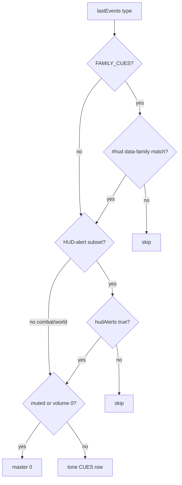

# RIMWARD HUD-03 remaining optional audio alerts

| Field | Value |
|---|---|
| **Title** | RIMWARD HUD-03 remaining optional audio alerts |
| **Author** | Wave 103 HUD-03 first impl |
| **Date** | 2026-08-23 |
| **Status** | first impl |
| **Wave** | 103 — KeyO `hudAlerts` checkbox + `song.js` gate landed (PR1–PR4). |
| **Owner request** | Remaining HUD-03 after scale / contrast / color-blind / reduced-motion: **optional audio alerts** for **both HUD families**, **without** a new aim-glass gauge, **without** stealing HUD-01 empty 80 px hub, **without** a new Digit, **without** stealing KeyT/KeyV/KeyK/KeyX, **without** a second Incoming toast string, and **without** inventing UU / a SKU unless inventory proves reuse is a lie. |
| **Merge law** | [`out/w102/hud03/shared-contract.md`](../out/w102/hud03/shared-contract.md). If this brief and that file conflict, the contract wins. |
| **Honor** | HUD-01 empty hub. HUD-02 identities (HUD never writes `hullKind`). Live KeyO settings (`colorblind`, `highContrast`, `reducedMotion`, `textScale`, `muted`, `masterVolume`, `hints`). Live Wave 65 family `CUES`. Live WAVE98 `Incoming fire.` / `Incoming dart.`. Live `npcFire` / `npcFireMissile`. Digit 0/8/9 stay. KeyT / KeyV / KeyK / KeyX stay. KeyO stays settings. **Do not edit** those docs. Code wins where the wishlist still lists scale/contrast/color-blind/reduced-motion as if missing. |

**Verifier record:**

| Note | Path |
|---|---|
| Inventory (code wins) | [`out/w102/hud03/current-hud03-inventory.md`](../out/w102/hud03/current-hud03-inventory.md) |
| Merge law | [`out/w102/hud03/shared-contract.md`](../out/w102/hud03/shared-contract.md) |
| Security review | [`out/w102/hud03/security-review.md`](../out/w102/hud03/security-review.md) |
| Design-doc review | [`out/w102/hud03/code-review.md`](../out/w102/hud03/code-review.md) |
| UI audit | [`out/w102/hud03/ui-audit.md`](../out/w102/hud03/ui-audit.md) |
| Wave 103 first impl notes | [`out/w103/hud03/`](../out/w103/hud03/) |

Siblings TGT-03 CLOS (`docs/Tgt03ClosureDesign.md`, `hud.js`) and BIO-02 career (`docs/Bio02CareerDesign.md`, `shipyard-desk.js`) are **other Wave 102 workers**. **Do not edit** those paths, `docs/Tgt03AwarenessDesign.md`, `docs/Tgt03RadarDesign.md`, `docs/Tgt03SubsystemDesign.md`, `docs/OwnerDecisions*.md`, `docs/Tgt05*.md`, `docs/Nav*.md`, `docs/NpcMissilesDesign.md`, `docs/Hud02IdentitiesDesign.md`, `docs/Bio*.md`, `docs/Shp*.md`, the wishlist, or `PROGRESS.md`. Those sibling files need not exist for this brief to stand.

Wave 103 first impl: `hudAlerts` default false on `rimward-settings-v1`; KeyO copy **HUD audio alerts**; `song.js` gates the HUD-alert subset; Incoming copy frozen; WAVE103 boot pins. Prefer no `hud.js` edit (none made).

---

## Overview

HUD-03 visual a11y already ships on the KeyO panel: text scale, high contrast, color-blind palette, reduced motion (`settings.js` / `body.rw-*` / `--rw-text-scale`). Mute-all and master volume already silence **every** `song.js` path. Wave 65 already shipped family ticks (`hudMechRange`, `hudMechMatch`, `hudMechContact`, `hostileEnter`, `hullBand`) plus `reticleLock`.

Wishlist leftover still names **optional audio alerts**. Live code has **no** `hudAlerts` (or alias) field. Family ticks play whenever the player is unmuted. That is not an opt-in HUD-03 control. Mute-all is not that control: mute also kills whalesong and combat bark.

This brief is the integrator document. Wave 102 was markdown only. Wave 103 first impl landed the serial in `ctx.js` / `settings.js` / `song.js` plus WAVE103 boot pins. Merge law still wins.

HUD-01 empty aim glass stays empty. No alert gauge. `state.js` stays READ-ONLY. No new SKU. No new `localStorage` key. A bool **may** join `rimward-settings-v1`. Digit 0 stays shipyard. Digit 8/9 stay launch/epics at dock and launcher/turret papers in outfitting. KeyT / KeyV / KeyK / KeyX stay. KeyO stays settings. Do not invent UU. Do not rewrite `Incoming fire.` / `Incoming dart.`.

Wave 102 deputize (recorded here and in the contract; owner may override after playtest): optional alerts are a **settings** checkbox `hudAlerts`, default **off**; fail-closed when muted; reuse live `CUES` rows; no new Digit; no persist beyond the existing settings blob; later gate prefers `song.js` so this serial does not fight the CLOS sibling on `hud.js`.

---

## Background & Motivation

### Current state (inventory)

Source of truth: [`out/w102/hud03/current-hud03-inventory.md`](../out/w102/hud03/current-hud03-inventory.md). Code wins over stale wishlist HUD-03 as if visual a11y were missing.

| Surface | Today | Cite |
|---|---|---|
| Storage | `rimward-settings-v1` | `settings.js` 23 |
| `FIELDS` | colorblind, highContrast, reducedMotion, muted, hints, textScale, masterVolume | `settings.js` 28–36 |
| `hudAlerts` | **absent** | grep 0 |
| Defaults | mute `false`, volume `1` | `ctx.js` 214–221 |
| Checkboxes | Colorblind / High contrast / Reduced motion / Mute all / Hints | `settings.js` 38–44 |
| Scale | S M L XL → `--rw-text-scale` | `settings.js` 24–25, 70, 139–175 |
| Body classes | `rw-colorblind` / `rw-contrast` / `rw-reduced-motion` | `settings.js` 67–69 |
| KeyO / Escape | toggle / close | `settings.js` 225–231 |
| Panel DOM | `createElement` + text; `innerHTML` 0 | `settings.js` 87–207 |
| Mute math | master gain 0 if muted | `song.js` 451–453 |
| Family `CUES` | five HUD-02 ticks + `reticleLock` | `song.js` 114–120 |
| `FAMILY_CUES` | mech vs bio dataset | `song.js` 124–130, 425–427 |
| Family emit | `emitFamilyTick` skips reducedMotion | `hud.js` 1073–1076 |
| Incoming toast | `Incoming fire.` / `Incoming dart.` | `npc-fire-toast.js` 8–9; `hud.js` 571–576 |
| Incoming tone | `npcFire` / `npcFireMissile` | `song.js` 68–69, 423 |
| Empty hub | 80 px | `hud.css` 184–191; `hud.js` 1198 |
| HUD family | reads `hullKind`; never writes | `hud.js` 80–87 |
| Digit 0 | shipyard | `station.js` 185, 6023–6025 |
| Digit 8/9 dock | launch / epics | `station.js` 185, 6027–6028 |
| Digit 8/9 outfit | papers | `station.js` 6100–6102 |
| KeyT/V/X/K | cycle / lock / MATCH / engine | `controls.js` 44, 268–289 |
| `WORLD_FIELDS` alerts key | **none** | `save.js` 76–101 |
| `TRACKED` KeyO | **no** | `controls.js` 41–48 |

The player who opens KeyO already sets scale, contrast, color-blind, reduced motion, and mute-all. Family ticks already chirp on RANGE / MATCH / contact / hull without a HUD-03 opt-in. Incoming already toasts WAVE98 copy and already barks `npcFire`. Wishlist “optional audio alerts” as a **checkbox** is absent. It is not a missing hub disc.

### Pain points

- A naive later PR that “adds mute” would double the mute checkbox.
- A naive later PR that “adds Incoming fire.” audio copy would smash WAVE98 toast law.
- A second `CUES` row on `npcFire` would double-bark combat shots.
- Putting an alert meter on the 80 px hub would reopen HUD-01 / HUD-02 and collide with RANGE.
- Stealing KeyT / KeyV / KeyK / KeyX / Digit 0/8/9 would smash cycle, lock, engine-select, MATCH, shipyard, launch, epics, or arms papers.
- Inventing a klaxon SKU and UU would impersonate the owner. Inventory proves mute and family `CUES` already exist.
- Playing HUD ticks while muted would lie.
- A new `localStorage` key beside `rimward-settings-v1` would split client a11y.
- A `WORLD_FIELDS` last-alert stamp would lie after jump.
- Gating combat `playerHit` / whalesong on `hudAlerts` would steal mute-all’s job.
- Default-on without a checkbox would leave HUD-03 leftover unclosed.
- Default-off **does** opt-in Wave 65 family ticks; the brief must say that so playtest can flip the default.
- `innerHTML` of a ship name on the checkbox would XSS the panel.
- Editing `hud.js` in the same wave as CLOS would collide with the sibling.

### Why now (design) / why not now (code)

The owner asked for an integrator brief so a later serial can land optional HUD alerts without a new glass gauge. Inventory shows visual HUD-03 **live**, mute **live**, family `CUES` **live**, checkbox **absent**. Merge law can exist without touching `src/`. Implementation waits so hub theft, Digit theft, Incoming copy smash, persist collision, and invented UU are frozen before the first checkbox lands. Wave 102 does not ship `src/`.

---

## Goals & Non-Goals

### Goals

1. Document live settings, mute/volume, family `CUES`, Incoming toast+tone, Digit 0/8/9, persist, KeyO/KeyT/KeyV/KeyK/KeyX, and empty hub from **live code**.
2. Freeze **reuse** of the KeyO panel as the picture. Distinct from mute-all, from combat `npcFire`, and from the 80 px hub.
3. Freeze a `hudAlerts` bool on the existing settings blob. No SKU. No extra Digit. No new `localStorage` key. No `WORLD_FIELDS`.
4. Freeze fail-closed: muted / volume 0 / no AudioContext → silent. `hudAlerts` cannot bypass mute.
5. Freeze cue reuse: family ticks + `reticleLock` are the HUD-alert subset. Incoming **reuses** `npcFire` / `npcFireMissile`. No second toast string.
6. Freeze `innerHTML` = 0, `textContent` / `createTextNode` / `el()` only.
7. Freeze a serial PR plan. This wave writes the brief. A later wave ships serially.

### Non-goals (locked — do not reopen)

- No `src/` or live bindings in Wave 102.
- No aim-glass alert gauge / pip / lock box / RANGE rewrite.
- No improved lead (TGT-01 DONE). No MATCH rewrite (TGT-02 DONE).
- No incoming-missile **gauge**. NPC missiles stay toast + existing `npcFireMissile`.
- No redesign of `Incoming dart.` or `Incoming fire.`
- No TGT-03 radar / awareness / subsystem / CLOS rewrite. Do not edit `hud.js` this pack.
- No KeyT / KeyV / KeyK / KeyX steal. No cone rewrite. No Digit 0/8/9 steal. No extra alerts Digit. No KeyO steal.
- No power ledger / aim-glass pip (Wave 93/94 out).
- No BIO-05. No BIO-02 career (sibling). No NPC turrets vsNPC. No NPC missile Q1/Q2 reopen.
- No UU or standing deltas. No `state.js` weapon retune. No minted SKU.
- Do not edit the wishlist, `PROGRESS.md`, `docs/Hud02IdentitiesDesign.md`, `docs/Tgt03*.md`, or sibling design files.
- Do not write `docs/OwnerDecisionsWave102.md`.
- Do not fix known boot FAILs.

---

## Proposed Design

### 1. Merge resolutions (contract wins)

| Question | Integrator freeze | Why |
|---|---|---|
| New persist-world key? | **No** | Client a11y; inventory: settings blob is enough |
| New `localStorage` key? | **No** | Keep `rimward-settings-v1` |
| New settings bool? | **Yes, `hudAlerts`** | Fits live `FIELDS` pattern |
| Default? | **`false`** | Optional. Owner may set `true` after playtest |
| Mute bypass? | **No** | `song.js` 452 already zeros master |
| New SKU / `state.js` write? | **No** | Client checkbox |
| Extra Digit / TRACKED key? | **No** | Setting, not a mode |
| Picture? | KeyO checkbox | Owner deputize; inventory §3 |
| Hub pip / lock box / gauge? | **No** | HUD-01 empty 80 px |
| Label? | `HUD audio alerts` | Authored; matches panel style |
| Checkbox cluster? | After reduced motion, before mute | HUD-03 a11y then mute-all |
| Cue set? | Reuse `FAMILY_CUES` + `reticleLock` | Inventory §5 |
| Incoming new `CUES` key? | **No** | `npcFire` / `npcFireMissile` exist |
| Incoming toast rewrite? | **No** | WAVE98 freeze |
| New `ctx.emit` type? | **No** | Types already listed (`ctx.js` 249–254) |
| Gate in `hud.js` this serial? | **Prefer `song.js`** | CLOS sibling owns `hud.js` |
| Combat bark gated by `hudAlerts`? | **No** | Mute-all’s job |
| Whalesong gated by `hudAlerts`? | **No** | Mute-all’s job |
| SPD / CLOS / DIST? | **Out** | Sibling / live rail |
| Names on checkbox? | **No** | Authored label only |
| `innerHTML`? | **No** | `createTextNode` / `textContent` |
| New `@keyframes`? | **No** | reduced-motion already kills HUD anim |
| HUD-01 hub? | Closed | Empty 80 px |
| Digit 0 / 8 / 9? | Untouched | Shipyard / launch+epics / papers |
| KeyT / KeyV / KeyK / KeyX / KeyO? | Untouched | Cycle / lock / engine / MATCH / settings |
| Write `hullKind`? | **No** | HUD-02 |
| UU / standing? | **No** | Do not invent |
| WAVE4 / WAVE26 / WAVE35? | Do not “fix” | Orchestrator law |

### 2. Player outcome (later serial)

Press **O**. The settings dialog already lists color-blind, high contrast, reduced motion, mute-all, hints, text size, and master volume. Later, a **HUD audio alerts** checkbox sits in that list (after reduced motion, before mute). Default **off**. When on, RANGE/MATCH/contact/hostile/hull/lock ticks reuse the Wave 65 synths. When off, those ticks stay quiet. Mute-all still silences whalesong, combat bark, **and** HUD ticks. Incoming fire./Incoming dart. toasts do not change. The aim glass stays empty. No new Digit. No buy.

### 3. Picture

See contract §1.1–§2.

Reuse live `CHECKBOXES` loop. Do not put a speaker icon on `.rw-reticle`. Do not bind Digit 0.

Later impl must keep load on `Object.keys(FIELDS)` (`settings.js` 55–56).

### 4. Surfaces stay distinct

| Job | Control | Gate |
|---|---|---|
| All audio | `muted` / `masterVolume` | `song.js` 451–453 |
| HUD family ticks | `hudAlerts` + family dataset | later `song.js` + live `FAMILY_CUES` |
| Lock tick | `hudAlerts` | `reticleLock` cue |
| Incoming vs player | toast copy + combat `npcFire*` | WAVE98; mute only |
| Visual a11y | existing HUD-03 checkboxes | `body.rw-*` |

Do not merge mute-all into HUD alerts.

### 5. Security / emit / persist

See contract §5.

No `WORLD_FIELDS` key. No new `ctx.emit` type. No `innerHTML`. No proto merge. No names from blobs on the checkbox. HUD must not write `ctx.world.contacts`. `state.js` unread-for-write.

### 6. Closed HUD / lock / digits

- Do not write `ctx.targets.current` except via existing KeyT/KeyV.
- Do not change HUD-01 rails into a hub card.
- Digit 0 shipyard. Digit 8/9 papers and dock services stay. Weapon 1–5 stay.
- Cone 12 px stays.
- KeyO stays the settings toggle.

---

## Ownership (later impl)

See contract §7.

`settings.js` owns the checkbox. `ctx.js` owns the default. `song.js` owns the playback gate. Prefer **no** `hud.js` edit so PR2 does not fight CLOS. `state.js` / `save.js` / `hangar.js` / `station.js` / `reticle-aim.js` / `controls.js` / `shipyard-desk.js` stay untouched. HUD still **reads** `hullKind` only.

CLOS sibling owns tgt-rail CLOS. Career sibling owns the shipyard desk. This serial does not wait on those files.

---

## Serial PR plan (later wave — named only)

Do **not** land these in Wave 102. See contract §8.

Name: **HUD-03 remaining optional audio-alerts serial**.

1. **PR1** `hudAlerts` field + KeyO checkbox + `FIELDS` persist (no UI chrome on glass).
2. **PR2** `song.js` gate on the HUD-alert subset; mute still wins.
3. **PR3** Incoming freeze: no second toast; no new incoming `CUES` key.
4. **PR4** Boot: hub empty; Digit 0/8/9; mute silences opted-in ticks; visual HUD-03 unchanged.

---

## Open questions

**Wave 102 deputize** (copy live numbers; owner may override after playtest). Do **not** park the later serial.

1. New bool? **`hudAlerts`** on the existing settings blob.
2. Default? **`false`**. Owner may set `true` to copy live Wave 65 family-audio-on.
3. Mute? Fail-closed. Copy live `song.js` 451–453.
4. Cues? Reuse family ticks + `reticleLock`. Incoming reuses `npcFire` / `npcFireMissile`.
5. Picture? KeyO checkbox `HUD audio alerts`.
6. `hud.js`? Prefer no this serial.
7. Non-goals Digit/hub/SKU/Incoming copy? Closed.

Do not treat hub gauge, Digit theft, `innerHTML`, new persist-world key, Key steal, Incoming rewrite, or UU invention as open.

---

## Risks (wishlist regressions)

| Risk | Freeze |
|---|---|
| Hub alert / RANGE collision | Hub stays empty of new children |
| Second mute checkbox | Mute-all stays the silence aid |
| Family ticks always-on leftover | Checkbox is the remaining HUD-03 option |
| Default-off surprises Wave 65 | Deputize false; owner may flip |
| Incoming copy smash | Strings frozen |
| Double `npcFire` bark | No new incoming `CUES` key |
| Contacts / CLOS class steal | Out of this serial |
| KeyT/KeyV/KeyK steal | Untouched |
| Digit 0/8/9 steal | Untouched |
| Invented SKU / UU | Fail-closed; none |
| Persist smash | No new WORLD_FIELDS; same settings key |
| XSS names | Authored checkbox + authored CUES keys |
| Play while muted | Master gain 0 still wins |
| WAVE4 / ferry / haul boot | Do not touch |

---

## Architecture / ctx ownership

See contract §7.

| Field | Owner | This serial |
|---|---|---|
| `ctx.settings.*` existing | `settings.js` | Untouched except add `hudAlerts` |
| `ctx.settings.hudAlerts` | `settings.js` | **Add** (later) |
| `ctx.settings.muted` | `settings.js` | Read in song (already) |
| `ctx.player.hullKind` | SHP / save | HUD **read** only |
| `ctx.lastEvents` | emitters + main.js | Read in song (already) |
| New `ctx.emit` type | — | **Forbidden** |
| New `WORLD_FIELDS` | — | **Forbidden** |

---

## Security

See contract §5 and [`out/w102/hud03/security-review.md`](../out/w102/hud03/security-review.md).

Threats this brief freezes: `innerHTML`, persist-world key, Digit theft, proto merge, interpolating `record` into the checkbox, indexing `CUES` from a blob string, writing `hullKind` or `world.contacts`, playing audio while muted.

---

## Acceptance (later impl)

Testable later; not this wave.

1. Hub 80 px still empty of an alerts child. No alert node inside `.rw-reticle`.
2. KeyO still opens SETTINGS. New checkbox **HUD audio alerts** exists. Default off on a wiped `rimward-settings-v1`.
3. Visual HUD-03 (scale / contrast / color-blind / reduced-motion) still apply via `body.rw-*` / `--rw-text-scale`.
4. `hudAlerts` false: family ticks + `reticleLock` silent. Combat `npcFire` / `playerHit` / whalesong still play if unmuted.
5. `hudAlerts` true + muted: **all** silent, including family ticks.
6. Incoming toasts still exact `Incoming fire.` / `Incoming dart.`. No second toast string. No `incomingFire` CUES key.
7. KeyV cone stays 12 px. KeyT still cycles. KeyK still engine-select. Digit 0/8/9 unchanged. KeyO still settings.
8. No innerHTML. No new `WORLD_FIELDS` key. No new `localStorage` key. HUD does not write `hullKind`.
9. Reduced motion: live family-emit skip stays; no new HUD-alert `@keyframes`.

---

## Alternatives

| Alternative | Verdict |
|---|---|
| Treat mute-all as HUD-03 optional alerts | **Reject.** Mute kills whalesong |
| Hub speaker / RANGE dual-use | **Reject.** HUD-01 empty 80 px |
| New incoming toast string | **Reject.** WAVE98 freeze |
| New `incomingFire` CUES on `npcFire` | **Reject.** Double-bark |
| Gate combat bark on `hudAlerts` | **Reject.** Steals mute-all |
| Klaxon SKU + UU | **Reject.** Client checkbox; reuse is not a lie |
| Extra Digit / Key | **Reject.** Setting |
| New localStorage key | **Reject.** Blob already exists |
| Default true (copy live family-on) | **Owner override after playtest.** Deputize is false |
| Edit `hud.js` emit sites this serial | **Reject unless CLOS sibling is done.** Prefer `song.js` |

---

## Observability

No new `ctx.emit`. Later pins cover: `FIELDS` restore of `hudAlerts`; proto blob ignored; muted AND `hudAlerts` true → master 0; subset skip when false. Do not log ship names. Do not log credits.

---

## Rollout

Wave 102: this markdown pack only. Later named serial (contract §8) lands `src/` in order PR1→PR4. Do not bundle with TGT-03 CLOS or career BIO-02. Do not start Vite in the design wave.

---

## References

- [`out/w102/hud03/shared-contract.md`](../out/w102/hud03/shared-contract.md)
- [`out/w102/hud03/current-hud03-inventory.md`](../out/w102/hud03/current-hud03-inventory.md)
- [`docs/Hud02IdentitiesDesign.md`](Hud02IdentitiesDesign.md) (family audio Wave 65; HUD never writes `hullKind`; do not edit)
- [`docs/Tgt03AwarenessDesign.md`](Tgt03AwarenessDesign.md) (`Incoming fire.`; do not edit)
- [`docs/Tgt03ClosureDesign.md`](Tgt03ClosureDesign.md) (sibling; do not edit)
- [`docs/Bio02CareerDesign.md`](Bio02CareerDesign.md) (sibling; do not edit)
