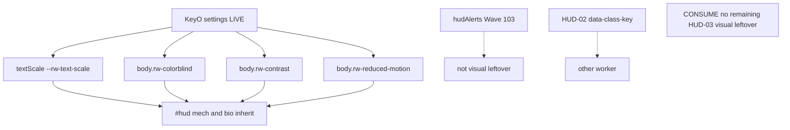

# RIMWARD HUD-03 remaining visual accessibility

| Field | Value |
|---|---|
| **Title** | RIMWARD HUD-03 remaining visual accessibility |
| **Author** | Wave 115 HUD-03 visual leftover integrator |
| **Date** | 2026-08-24 |
| **Status** | leftover **CONSUME**. Wave 115 markdown only. Named serial: **none**. Name: **no remaining HUD-03 visual leftover.** |
| **Wave** | 115 — no `src/`. Bindings do not change here. |
| **Owner request** | Wishlist HUD-03 still says “visual settings remain” while also listing scale / contrast / color-blind / reduced-motion as required. Wave 103 already shipped optional **audio** alerts (`docs/Hud03AlertsDesign.md` — **cite, do not rewrite**). KeyO already has `textScale`, `highContrast`, `colorblind`, `reducedMotion`, `muted`, `masterVolume`, `hints`, `hudAlerts`. Census live `settings.js` / `ctx.js` / `hud.css` / `body.rw-*`. If visual a11y already meets the wishlist for **both HUD families**, freeze **CONSUME**. Name: **no remaining HUD-03 visual leftover.** Do not invent a new KeyO row, a new Digit, a hub gauge, a third HUD family, or a free skin override (closed). If census finds a **real** remaining visual hole that is not already live and is not HUD-02 class tokens (other worker), freeze a later serial. Do not invent work. |
| **Merge law** | [`out/w115/hud03vis/shared-contract.md`](../out/w115/hud03vis/shared-contract.md). If this brief and that file conflict, **the contract wins**. |
| **Honor** | HUD-01 empty 80 px hub. Digit 0 shipyard. Digit 8/9 stay. KeyO stays settings. `state.js` READ-ONLY later. No new persist key. Prefer existing `rimward-settings-v1` if any later bool (none expected on CONSUME). `innerHTML` forbidden later. Kit mutate omit. Aim-glass gauges stay off. HUD-03 free skin override stays **closed**. Wave 62 family skins consume. Wave 65 audio consume. Wave 103 `hudAlerts` consume. HUD-02 player class tokens are **other workers**. Wave 112 live knobs consume. Do **not** write `docs/OwnerDecisionsWave115.md`. Do **not** edit wishlist, `PROGRESS.md`, sibling Hud02/Hud03Alerts/Bio/Nav/Msn/Rep/Phy/Shp/Tgt/Owner docs. Do **not** steal `out/w115/hud02tgt/**` or `out/w115/shp/**`. |

**Verifier record:**

| Note | Path |
|---|---|
| Inventory (code wins) | [`out/w115/hud03vis/current-hud03-visual-inventory.md`](../out/w115/hud03vis/current-hud03-visual-inventory.md) |
| Merge law | [`out/w115/hud03vis/shared-contract.md`](../out/w115/hud03vis/shared-contract.md) |
| Security review | [`out/w115/hud03vis/security-review.md`](../out/w115/hud03vis/security-review.md) |
| Design-doc review | [`out/w115/hud03vis/code-review.md`](../out/w115/hud03vis/code-review.md) |
| UI audit | [`out/w115/hud03vis/ui-audit.md`](../out/w115/hud03vis/ui-audit.md) |
| Audio leftover (cite) | [`docs/Hud03AlertsDesign.md`](./Hud03AlertsDesign.md) |

Siblings HUD-02 class tokens (`out/w115/hud02tgt/**`), SHP (`out/w115/shp/**`), HUD-03 audio (`docs/Hud03AlertsDesign.md`), Bio/Nav/Msn/Rep/Phy/Shp/Tgt/Owner docs, wishlist, and `PROGRESS.md` are **other workers**. **Do not edit** those paths. **Do not write** `src/`.

**This is not HUD-03 audio.** **This is not HUD-02 class tokens.** **This is not HUD-01.** **This is not a free skin.** Wishlist-grade visual a11y on both HUD families is **already live**.

---

## Overview

KeyO already stores and applies HUD-03 visual aids: text scale, high contrast, color-blind palette, reduced motion (`settings.js` / `ctx.js` / `body.rw-*` / `--rw-text-scale`). Those body classes are **not** family-gated. Mech and bio inherit the same `#hud` tokens. Family CSS adds extras (bio `--vein` remap, motion freezes) on top. Wave 103 already shipped optional audio alerts (`hudAlerts`). Mute and master volume already sit on the same panel.

Census (code wins): the four visual wishlist bullets are **not** missing. A fifth visual checkbox would **double-paint**. A free skin picker reopens an owner-closed product question. HUD-02 `data-class-key` is **not** HUD-03.

This leftover is **CONSUME**. Name: **no remaining HUD-03 visual leftover.** Do **not** freeze a visual-a11y serial. Wishlist still **lists** scale / contrast / color-blind / reduced-motion; live KeyO **ships** them; `body.rw-*` **applies** them to both HUD families.

This brief is the integrator document. Wave 115 this worker lands markdown only. Bindings do not change here.

HUD-01 empty aim glass stays empty. `state.js` stays READ-ONLY. No new persist key. Digit 0 stays shipyard. Digit 8/9 stay. Do not invent UU. Do not reopen HUD-03 skin override. Do not steal class tokens. Aim-glass gauges stay off.

Wave 115 deputize (recorded here and in the contract; owner may override after playtest): **do not invent visual HUD-03 work**. Fail closed to today’s KeyO + `body.rw-*`. Never freeze the sim.

---

## Background & Motivation

### Current state (inventory)

Source of truth: [`out/w115/hud03vis/current-hud03-visual-inventory.md`](../out/w115/hud03vis/current-hud03-visual-inventory.md). Code wins.

| Surface | Today | Cite |
|---|---|---|
| Storage | `rimward-settings-v1` | `settings.js` 24 |
| `FIELDS` | colorblind, highContrast, reducedMotion, muted, hudAlerts, hints, textScale, masterVolume | `settings.js` 29–38 |
| Defaults | scale `1`; visual bools `false`; hints `true`; volume `1` | `ctx.js` 215–222 |
| Checkboxes | Colorblind / High contrast / Reduced motion / HUD audio alerts / Mute all / Hints | `settings.js` 40–46 |
| Scale | S M L XL → `--rw-text-scale` | `settings.js` 25–26, 73, 142–177 |
| Body classes | `rw-colorblind` / `rw-contrast` / `rw-reduced-motion` | `settings.js` 70–72 |
| `#hud` Okabe-Ito | accent/warn/bad/good remap | `hud.css` 1145–1151 |
| `#hud` contrast | brighter `--white`, opaque `--panel` | `hud.css` 1153–1181 |
| `#hud` reduced motion | animation/transition none | `hud.css` 1183–1189 |
| Both families inherit | `body.rw-* #hud` not family-gated | `hud.css` 1145–1189 |
| Bio extras | `--vein` remap; hair contrast; pupil freeze | `hud.css` 1736–1755 |
| Mech extras | RANGE pop freeze | `hud.css` 1241–1243 |
| Hair hide both | reduced-motion rail `::before/after` | `hud.css` 1535–1541 |
| Family apply | `dataset.family` | `hud.js` 80–89, 1100 |
| Tick skip | `emitFamilyTick` if reducedMotion | `hud.js` 1105–1107 |
| Class tokens | sibling HUD-02 | `hud.js` 100–115 |
| Audio leftover | `hudAlerts` LIVE | `settings.js` 34, 44; `song.js` 132–140, 437 |
| Mute math | master gain 0 if muted | `song.js` 463 |
| Empty hub | 80 px | `hud.css` 184–193 |
| Digit 0 / 8 / 9 | shipyard / launch / epics | `station.js` 188, 6098–6106 |
| Persist world | no visual a11y key | `save.js` 76–101 |
| KeyO | settings; not `TRACKED` | `settings.js` 230; `controls.js` 41–48 |

The player who opens KeyO already sets scale, contrast, color-blind, and reduced motion. Those settings already paint **both** HUD families. Optional audio alerts already have a checkbox. Wishlist “visual settings remain” is **stale vs code**.

### Pain points

- A naive later PR that “adds scale” would double the TEXT SIZE row.
- A naive later PR that “adds contrast / color-blind / reduced motion” would double live checkboxes.
- A naive later PR that “adds HUD audio alerts” as visual leftover rewrites Wave 103 (`docs/Hud03AlertsDesign.md`).
- A naive later PR that adds a per-family palette picker invents a third HUD family or a free skin.
- A naive later PR that puts a scale pip on the 80 px hub reopens HUD-01.
- A naive later PR that steals Digit 0/8/9 smashes shipyard, launch, epics, or papers.
- A naive later PR that persists visual flags into `WORLD_FIELDS` lies after jump.
- A naive later PR that treats HUD-02 `data-class-key` as HUD-03 steals sibling tokens.
- A naive later PR that scales station overlays or the galaxy chart as HUD-03 leftover invents work the wishlist did not name as this hole.
- Inventing “CONSUME is boring, add another slider” invents work the owner forbade.

### Why now (design) / why not now (code)

The owner asked for a visual leftover census so later serials do **not** steal HUD-02 tokens, KeyO, or Wave 103 audio while chasing a hole that may already be closed. Inventory shows the four visual aids **LIVE** on both families. Merge law can exist without touching `src/`. Implementation does **not** wait — it **does not ship**. Wave 115 this worker does not write `src/`.

---

## Goals & Non-Goals

### Goals

1. Document live KeyO visual fields, `body.rw-*`, `--rw-text-scale`, both HUD families, hub, Digit, persist from **live code**.
2. Freeze leftover as **CONSUME** (not REAL). Name **no remaining HUD-03 visual leftover.**
3. Freeze **reuse** of live KeyO + body classes. No second control. No new persist key.
4. Freeze Wave 103 audio as **cite-only consume**.
5. Freeze HUD-02 class tokens as **sibling — do not steal**.
6. Freeze no new Digit, no `state.js` write, no UU, no hub pip, no free skin.
7. Freeze a serial PR plan with **no implementation PR1**.

### Non-goals (locked — do not reopen)

- No `src/` or live bindings in this worker.
- No second scale / contrast / color-blind / reduced-motion control.
- No per-family visual checkboxes.
- No HUD-03 free skin override.
- No HUD-02 class-token steal (`hud.js` / `hud.css` `data-class-key`).
- No rewrite of `docs/Hud03AlertsDesign.md` or second `hudAlerts`.
- No HUD-01 hub child. No RANGE rewrite.
- No new Digit. No extra toast.
- No `WORLD_FIELDS` visual key. No new `localStorage` key.
- Do not treat galaxy chart / station overlay / KeyO panel font as HUD-03 leftover.
- Do not reopen Wave 112 IMPACT knobs.
- Do not edit the wishlist, `PROGRESS.md`, sibling Hud02/Hud03Alerts/Bio/Nav/Msn/Rep/Phy/Shp/Tgt/Owner docs.
- Do not write `docs/OwnerDecisionsWave115.md`.
- Do not steal `out/w115/hud02tgt/**` or `out/w115/shp/**`.
- Do not fix known boot FAILs.

---

## Proposed Design

### 1. Merge resolutions (contract wins)

| Question | Integrator freeze | Why |
|---|---|---|
| Leftover real? | **No. CONSUME.** | Inventory §0: four visual FIELDS + `body.rw-*` LIVE on both families |
| New persist key? | **No** | Already on `rimward-settings-v1` |
| `state.js` write? | **No** | Contract §0.5 |
| New KeyO row? | **No** | Would double-paint |
| Per-family visual picker? | **No** | Body classes already global |
| Free skin override? | **No** | Owner closed |
| Steal HUD-02 class tokens? | **No** | Sibling |
| Rewrite `hudAlerts`? | **No** | Wave 103; cite only |
| Hub gauge? | **No** | HUD-01 empty hub |
| Extra toast? | **No** | No visual toast |
| Fail closed? | defaults on corrupt JSON | Live load |
| Named PR1? | **None** | CONSUME |

### 2. Current visual motion (do not break KeyO / families)

See inventory §§3–4. Load-bearing loop:

**Today (consume)**

1. KeyO opens the settings dialog (`settings.js` 228–234).
2. Player sets color-blind / contrast / reduced motion / TEXT SIZE.
3. `apply()` toggles `body.rw-*` and sets `#hud --rw-text-scale`.
4. Persist writes the same `rimward-settings-v1` blob.
5. Mech and bio HUD inherit `#hud` tokens. Family CSS extras still honor reduced motion and color-blind.

**This serial must not change** `FIELDS`, `CHECKBOXES`, `apply()`, `hudFamily`, hub DOM, Digit map, `hudAlerts`, class-key attrs. Additive: **none**.

Digit 0 and `DOCK_KEY_SERVICES` stay. Digit 8/9 stay.

### 3. Deputize table (copy of contract §0.1)

Owner may override after playtest. Do not park. Do not invent work.

| Knob | Value |
|---|---|
| Verdict | **CONSUME** |
| Fail-closed | corrupt JSON → defaults; storage denied → session-only |
| Additive | **none** |
| Persist | existing `rimward-settings-v1` |
| `hudAlerts` / mute / volume | consume LIVE (audio) |
| HUD-02 class tokens | sibling — do not steal |
| Alloc | reuse live KeyO DOM |
| Missing host | today’s `body.rw-*` |

Visual HUD-03 already has four live fields (inventory §0). Later serial **does not add a helper**. Do not steal HUD-02 tokens.

### 4. Neighbours

| Module | Visual leftover does | Visual leftover does not |
|---|---|---|
| `settings.js` | **none** (CONSUME) | second FIELDS row |
| `ctx.js` | **none** | new default key |
| `hud.css` `body.rw-*` | **none** | per-family second palette |
| `hud.js` family | none | write `hullKind`; steal class-key |
| `song.js` | cite `hudAlerts` | rewrite audio |
| `save.js` | none | new `WORLD_FIELDS` |
| `state.js` | **read-only later** | write |
| HUD-01 | none | a11y pip |
| Digit 0/8/9 | cite freeze | bind settings |
| HUD-02 tokens | cite sibling | steal `out/w115/hud02tgt/**` |

### 5. Serial PR plan

Matches contract §3. **Named only. Do not implement in Wave 115.**

| PR | Lands | Does not land |
|---|---|---|
| **PR1 visual HUD-03** | **Does not exist.** Leftover CONSUME | second KeyO row; hub; Digit; persist; free skin; class-token steal; audio rewrite |
| **PR-census (optional skip)** | Re-grep `FIELDS` vs wishlist HUD-03 list | New world field; hub pip |

First remaining visual HUD-03 serial is **none**. It must not steal Digit 0/8/9. It must not write `state.js`.

### 6. Picture

Reuse live KeyO. No new chrome. Visual a11y is the **live TEXT SIZE row plus three checkboxes**, applied through **body classes and `--rw-text-scale`** to **both** HUD families. Not a hub label.

No a11y pip. RANGE stays TGT-01. No new toast. No free skin.

---

## Player outcome (CONSUME; freeze here)

Open KeyO. Set TEXT SIZE S/M/L/XL. HUD readouts on mech and bio grow or shrink via `--rw-text-scale`. Check **High contrast HUD**. Panels go darker and text goes brighter on both families. Check **Colorblind-safe palette**. `#hud` tokens switch to Okabe-Ito; bio vein remaps to good. Check **Reduced motion**. HUD animation and transition stop. Family ticks skip emit. Combat-rail hair hides. Bio pupil does not pulse.

HUD audio alerts stay the Wave 103 checkbox. Mute still silences every `song.js` path. The 80 px hub stays empty. Digit 0 is still shipyard. No one sells “HUD contrast.”

**HUD-02 class tokens** are **not** this work. **Optional audio alerts** are **not** this work. **Free HUD style** is **not** this work. **Wave 112 knobs** are **not** this work.

---

## Risks & Mitigations (frozen; no PR1)

| Risk | Mitigation |
|---|---|
| Later worker invents a fifth visual checkbox | Contract §0 / §2 CONSUME; inventory §5 |
| Later worker steals class tokens | Contract §0.9; sibling `out/w115/hud02tgt/**` |
| Later worker reopens free skin | Contract §0.10 |
| Later worker rewrites `hudAlerts` | Cite `docs/Hud03AlertsDesign.md` only |
| Hub theft | Contract §0.2 |
| Persist split | Contract §0.6 existing key only |
| XSS on settings labels | `innerHTML` forbidden; live 0 |

---

## Open questions

None for this leftover. Census closed the visual hole. Owner may still edit wishlist status later (other worker). This pack does **not** edit the wishlist.
