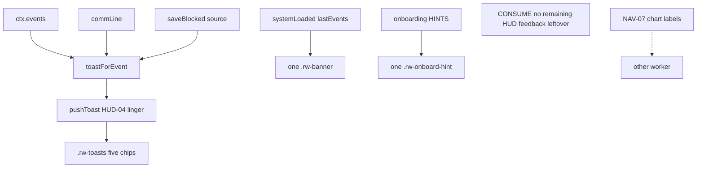

# RIMWARD HUD remaining player-facing feedback

| Field | Value |
|---|---|
| **Title** | RIMWARD HUD remaining player-facing feedback |
| **Author** | Wave 121 HUD remaining-feedback leftover integrator |
| **Date** | 2026-08-25 |
| **Status** | leftover **CONSUME**. Wave 121 markdown only. Named serial: **none**. Name: **no remaining HUD feedback leftover.** |
| **Wave** | 121 — no `src/`. Bindings do not change here. |
| **Owner request** | Census **remaining HUD player-facing feedback leftover after HUD-04**, from live code. Wave 120 landed HUD-04 toast-flood (`docs/Hud04ToastFloodDesign.md`) — 8 s identical-key window, five-row linger, expire `aria-hidden`, AUTOSAVE HELD vs SAVE BLOCKED. **Cite, do not reopen.** Idea inbox is empty except NAV-07 chart-label (other worker). HUD-03 visual leftover is already CONSUME. If remaining HUD-04-class leftover is **already gone** (toasts linger; banner/commLine/onboarding are not a flood leftover; no second unnamed toast channel), freeze **CONSUME** and named serial **none**. If census finds a **real** remaining hole that is not toast-flood and not chart-label, freeze leftover **REAL** and name later serial **PR1** (named only). Do **not** implement `src/`. Do not invent a sixth toast slot, a new Digit, a hub child, or a second live region unless the inventory proves a real hole. |
| **Merge law** | [`out/w121/hudrest/shared-contract.md`](../out/w121/hudrest/shared-contract.md). If this brief and that file conflict, **the contract wins**. |
| **Honor** | HUD-01 empty 80 px hub. Digit 0 shipyard. Digit 8/9 stay. KeyO stays settings. `state.js` READ-ONLY later. No new persist key. `innerHTML` forbidden later. Kit mutate omit. Aim-glass gauges stay off. Overlay mutex cite-only. Wave 120 toast PR1 cite-only — do not retune linger 8 s or AUTOSAVE HELD copy. HUD-03 visual CONSUME. HUD-02 class tokens sibling. NAV-07 chart-label sibling. Do **not** write `docs/OwnerDecisionsWave121.md`. Do **not** edit wishlist, `PROGRESS.md`, `docs/Hud04ToastFloodDesign.md`, `docs/Hud03RemainingVisualDesign.md`, `docs/Hud03AlertsDesign.md`, `docs/Hud02*`, `docs/Nav07ChartLabelDesign.md`, Nav/Ctl leftover docs, `docs/OwnerDecisions*.md`. Do **not** steal `out/w121/chartlabel/**`, `out/w121/expdock/**`, `out/w120/toast/**`, `out/w118/toast/**`. |

**Verifier record:**

| Note | Path |
|---|---|
| Inventory (code wins) | [`out/w121/hudrest/current-hud-feedback-inventory.md`](../out/w121/hudrest/current-hud-feedback-inventory.md) |
| Merge law | [`out/w121/hudrest/shared-contract.md`](../out/w121/hudrest/shared-contract.md) |
| Security review | [`out/w121/hudrest/security-review.md`](../out/w121/hudrest/security-review.md) |
| Design-doc review | [`out/w121/hudrest/code-review.md`](../out/w121/hudrest/code-review.md) |
| UI audit | [`out/w121/hudrest/ui-audit.md`](../out/w121/hudrest/ui-audit.md) |
| HUD-04 toast (cite) | [`docs/Hud04ToastFloodDesign.md`](./Hud04ToastFloodDesign.md) |
| HUD-03 visual (cite) | [`docs/Hud03RemainingVisualDesign.md`](./Hud03RemainingVisualDesign.md) |

Siblings HUD-04 toast (`out/w120/toast/**`, `out/w118/toast/**`), NAV-07 chart-label (`out/w121/chartlabel/**`), overlay/CTL-02, HUD-02 class tokens, HUD-03 visual/audio, wishlist, and `PROGRESS.md` are **other workers**. **Do not edit** those paths. **Do not write** `src/`.

**This is not HUD-04 toast-flood.** **This is not NAV-07 chart-label.** **This is not CTL-02 overlay.** **This is not HUD-03 visual.** **This is not HUD-02 class tokens.** Remaining HUD-04-class feedback leftover is **already gone**.

---

## Overview

Wave 120 already shipped the HUD-04 toast channel: 8 s identical-key window, five-row linger independent of chips, expire `aria-hidden`, AUTOSAVE HELD vs SAVE BLOCKED. `commLine` already rides that same `pushToast`. Arrival banner is one 4 s system-name card. Onboarding is one persist-once teaching line behind KeyO `hints`. Grep finds **no** second `.rw-toast` allocator.

Census (code wins): remaining HUD player-facing feedback leftover after HUD-04 is **not** missing. A sixth toast slot would **double-paint**. A new live region on the hint would fight HUD-04’s “no second live region” freeze. A banner-into-toast fold steals arrival chrome. Retuning linger 8 s reopens HUD-04.

This leftover is **CONSUME**. Name: **no remaining HUD feedback leftover.** Do **not** freeze a remaining-feedback serial. Wishlist FEEDBACK inbox is **DONE**; live toast **ships** the window; banner/hint **are not flood channels**.

This brief is the integrator document. Wave 121 this worker lands markdown only. Bindings do not change here.

HUD-01 empty aim glass stays empty. `state.js` stays READ-ONLY. No new persist key. Digit 0 stays shipyard. Digit 8/9 stay. Do not invent UU. Do not steal overlay mutex. Do not steal chart labels. Aim-glass gauges stay off.

Wave 121 deputize (recorded here and in the contract; owner may override after playtest): **do not invent remaining HUD feedback work**. Fail closed to today’s toast + banner + hint. Never freeze the sim.

---

## Background & Motivation

### Current state (inventory)

Source of truth: [`out/w121/hudrest/current-hud-feedback-inventory.md`](../out/w121/hudrest/current-hud-feedback-inventory.md). Code wins.

| Surface | Today | Cite |
|---|---|---|
| Lifetime / slots / window | 4 s / 5 / 8 s | `hud.js` 64–66 |
| Linger | 5-row `{ key, lastShown }`, not chip-tied | `hud.js` 530–555 |
| Stack a11y | `role=status` `aria-live=polite`; expire `aria-hidden` | `hud.js` 846–847, 851–852, 1209, 1243 |
| Place | top-right, off aim column | `hud.css` 635–646 |
| Hide | `:not(.show) { visibility: hidden }` | `hud.css` 734 |
| `commLine` | `toastForEvent` → `pushToast` | `hud.js` 560–568, 1234–1235 |
| `saveBlocked` autosave | `▲ AUTOSAVE HELD — hostiles near` | `hud.js` 597–598 |
| `saveBlocked` berth | `▲ SAVE BLOCKED — ` + reason | `hud.js` 600 |
| Autosave emit | `source: 'autosave'` | `save.js` 1040 |
| Berth emit | `source: 'berth'` | `save.js` 1422, 1428, 1535, 1540 |
| Arrival banner | one node, 4 s, `textContent` | `hud.js` 858–863, 1247–1265 |
| Onboarding | one hint, 8 s, persist `seen` | `onboarding.js` 29, 36–68, 104 |
| Hint toggle | KeyO `hints` | `settings.js` 46 |
| Second toast allocator | **none** | grep `pushToast` / `.rw-toast` |
| `aria-live=assertive` | **none** under `src/` | grep |
| Empty hub | 80 px | `hud.css` 184–193 |
| Digit 0 / 8 / 9 | shipyard / launch / epics | `station.js` 188, 6035–6036 |
| Persist world | onboarding `seen` already; **no** toast key | `save.js` 76–84 |
| Overlay / chart labels | siblings | do not claim |

The player who flies a pirate bubble already sees **one** AUTOSAVE HELD chip for 8 s of identical retries. Distinct berth SAVE BLOCKED still shows. Identical comm copy updates in place or stays quiet after expire. Arrival still names the system once. A new pilot still gets one hint at a time.

### Pain points

- A naive later PR that “adds remaining HUD feedback” would add a **sixth** toast slot.
- A naive later PR that “fixes banner/hint a11y” as this leftover would add a **second** live region HUD-04 forbade.
- A naive later PR that retunes linger 8 s or AUTOSAVE HELD **reopens HUD-04**.
- A naive later PR that folds banner into toasts steals arrival chrome and mixes jump names with comm spam.
- A naive later PR that raises toast z fights overlay mutex (hail 40 / berth 60).
- A naive later PR that adds a hail toast on defer fights overlay contract.
- A naive later PR that persists linger into `WORLD_FIELDS` lies after load.
- Putting a new Digit or hub pip impersonates the owner.
- Stealing chart labels impersonates NAV-07.
- `innerHTML` of `e.text` / `e.reason` is XSS.
- Inventing “CONSUME is boring, add another channel” invents work the owner forbade.

### Why now (design) / why not now (code)

The owner asked for a remaining-feedback census so later serials do **not** steal HUD-04, NAV-07, overlay, or KeyO while chasing a hole that may already be closed. Inventory shows toast flood **LIVE-FIXED**, banner/hint **not flood**, and **no** second toast allocator. Merge law can exist without touching `src/`. Implementation does **not** wait — it **does not ship**. Wave 121 this worker does not write `src/`.

If census had proved a real remaining hole that is not toast-flood and not chart-label, this pack would freeze **REAL** and name serial **PR1**. Census did not.

---

## Goals & Non-Goals

### Goals

1. Document live toast linger, banner, `commLine`, onboarding, other `aria-live` regions, and save emits from **live code**.
2. Freeze leftover as **CONSUME** (not REAL). Name **no remaining HUD feedback leftover.**
3. Freeze **reuse** of live HUD-04 toast channel + one banner + one hint. No sixth slot. No new persist key.
4. Freeze HUD-04 as **cite-only consume**. Do not retune 8 s or AUTOSAVE HELD.
5. Freeze NAV-07 chart-label, CTL-02 overlay, HUD-02 tokens, HUD-03 visual/audio as **sibling — do not steal**.
6. Freeze no new Digit, no `state.js` write, no UU, no hub pip, no second live region, no `assertive`.
7. Freeze a serial PR plan with **no implementation PR1**.

### Non-goals (locked — do not reopen)

- No `src/` or live bindings in this worker.
- No sixth toast slot. No linger retune. No AUTOSAVE HELD rewrite.
- No banner fold-in. No hint `aria-live` add as leftover.
- No NAV-07 `galaxychart.js`. No dest `<select>`.
- No CTL-02 overlay mutex. No hail.js. No toast z raise. No hail toasts.
- No HUD-02 class-token steal. No HUD-03 KeyO visual rewrite. No second `hudAlerts`.
- No HUD-01 hub child. No RANGE rewrite.
- No new Digit. No extra toast.
- No `WORLD_FIELDS` toast key. No new `localStorage` key.
- Do not pause the sim.
- Do not edit the wishlist, `PROGRESS.md`, sibling Hud/Nav/Ctl/Owner docs.
- Do not write `docs/OwnerDecisionsWave121.md`.
- Do not steal `out/w121/chartlabel/**`, `out/w121/expdock/**`, `out/w120/toast/**`, `out/w118/toast/**`.
- Do not fix known boot FAILs.

---

## Proposed Design

### 1. Merge resolutions (contract wins)

| Question | Integrator freeze | Why |
|---|---|---|
| Leftover real? | **No. CONSUME.** | Inventory §0.1: linger LIVE; banner/hint not flood; no second toast allocator |
| New persist key? | **No** | Linger session-only; onboarding `seen` already persists |
| `state.js` write? | **No** | Contract §0.5 |
| Sixth toast slot? | **No** | Would double-paint HUD-04 |
| Second live region? | **No** | HUD-04 freeze; banner already polite |
| `aria-live` assertive? | **No** | Keep polite |
| Retune 8 s / AUTOSAVE HELD? | **No** | HUD-04 landed |
| Steal chart labels? | **No** | NAV-07 sibling |
| Overlay / hail toast / toast z | Call out only | Sibling |
| Hub gauge? | **No** | HUD-01 empty hub |
| Fail closed? | skip unknown; never pause | Live toast + contract |
| Named PR1? | **None** | CONSUME |

### 2. Current feedback motion (do not break HUD-04 / Wave 6 / WAVE98)

`frameLines` still skips same-frame clue/`commLine` pairs. Incoming `Incoming fire.` / `Incoming dart.` stay 2.5 s in `npc-fire-toast.js`. Sun heat stays 2.5 s. Toast nodes stay five, `textContent`, polite live region. Place stays top-right. Overlay cards still paint above `#hud`. Banner still names the system for 4 s. Hints still fire once.

**This serial must not change** linger constants, `saveBlocked` copy, banner DOM, hint table, hub DOM, Digit map, `hudAlerts`, class-key attrs. Additive: **none**.

Digit 0 and `DOCK_KEY_SERVICES` stay. Digit 8/9 stay.

### 3. Deputize table (copy of contract §0.1)

Owner may override after playtest. Do not park. Do not invent work.

| Knob | Value |
|---|---|
| Verdict | **CONSUME** |
| Fail-closed | unknown event skip; never pause; never throw |
| Additive | **none** |
| Persist | none new |
| HUD-04 toast | consume LIVE; do not retune |
| Banner / hint | consume LIVE; not flood leftover |
| NAV-07 / overlay / HUD-02 / HUD-03 | sibling — do not steal |
| Alloc | reuse live toast / banner / hint DOM |
| Missing host | today’s channels |

Remaining HUD feedback already has toast linger + one banner + one hint (inventory §0.1). Later serial **does not add a helper**. Do not steal HUD-04 or NAV-07.

### 4. Neighbours

| Module | Remaining feedback does | Remaining feedback does not |
|---|---|---|
| `hud.js` toast | **none** (CONSUME) | sixth slot; linger retune |
| `hud.js` banner | **none** | fold into toast; extra region |
| `onboarding.js` | **none** | hint `aria-live`; second stack |
| `save.js` emit | none | WORLD_FIELDS; death; retry cadence; berth panel |
| `hail.js` | none | mutex; hail toasts |
| `galaxychart.js` | none | labels; `showApLive` |
| `overlay-policy.js` | none | sibling |
| `hud.css` | none | toast z; hub; geometry |
| `state.js` | **read-only later** | write |
| HUD-01 | none | feedback pip |
| Digit 0/8/9 | cite freeze | bind feedback |
| HUD-04 | cite landed | steal `out/w120/toast/**` |

### 5. Serial PR plan

Matches contract §3. **Named only. Do not implement in Wave 121.**

| PR | Lands | Does not land |
|---|---|---|
| **PR1 remaining HUD feedback** | **Does not exist.** Leftover CONSUME | sixth slot; second live region; linger retune; overlay; chart labels; Digit; persist; hub; `innerHTML`; `aria-live` assertive |
| **PR-census (optional skip)** | Re-grep linger + `source: 'autosave'` + unique `pushToast` + one banner + one hint | New world field; hub pip |

First remaining HUD feedback serial is **none**. It must not steal Digit 0/8/9. It must not write `state.js`.

### 6. Picture

Reuse live `.rw-toasts` five chips, one `.rw-banner`, one `.rw-onboard-hint`. No new chrome. Player in a fight still sees **one** AUTOSAVE HELD. Arrival still names the system. A new pilot still sees one teaching line. Hail/chart/berth stacking is **overlay**. Chart labels are **NAV-07**.

No hub pip. Digit 0 stays shipyard. Toast z stays with `#hud`.

---

## Player outcome (CONSUME; freeze here)

Fly into a pirate bubble. Background autosave refuses. One warn line: **AUTOSAVE HELD — hostiles near**. Identical retries stay quiet for 8 s. Open Berth Records (L) and press SAVE. A **different** line: **SAVE BLOCKED** plus the berth reason.

Jump. One arrival banner names the system for about 4 s. It does **not** stack with five toast chips as a second flood ring.

A new save still shows onboarding hints **one at a time**, or none if KeyO Hints is off.

Hail, Galaxy Chart, and Berth stacking is **not** this work. Chart labels are **not** this work. Pause is still P. Settings is still O.

**HUD-04 toast-flood** is **not** this work (already landed). **NAV-07 chart-label** is **not** this work. **CTL-02 overlay-priority** is **not** this work. **HUD-02 class tokens** are **not** this work. **HUD-03 visual** is **not** this work.

---

## Security

See [`out/w121/hudrest/security-review.md`](../out/w121/hudrest/security-review.md).

- XSS: no `innerHTML` for toast / banner / hint / `e.reason` / `e.text`. `textContent` only.
- Proto: authored `source` tokens (`autosave` / `berth`). Never `for-in` a save blob into copy.
- Persist: no new key. Linger clocks die with the session.
- Privileged copy: do not toast storage keys, snapshot JSON, or credit ledgers.
- Fail-closed never freeze the sim.
- Overlay: do not raise toast z.
- Live region: do not add `assertive`. Do not add a second region as leftover. Toast expire already sets `aria-hidden`.

---

## Acceptance direction (no implementation wave)

1. Census holds: linger 8 s, five chips, expire `aria-hidden`, AUTOSAVE HELD vs SAVE BLOCKED **live**.
2. `commLine` still uses `pushToast` only.
3. Banner is still one node. Onboarding is still one node.
4. No named PR1. No `src/` from this pack.
5. `.rw-toasts` z-index unchanged. No hail toast added.
6. KeyO / Digit 0/8/9 / empty hub untouched.
7. Known boot FAILs untouched.

---

## Alternatives considered

| Alternative | Why not |
|---|---|
| Freeze REAL / serial PR1 | Census: HUD-04-class flood is gone; banner/hint are not flood; no second toast channel |
| Add slots (6–10) | Inbox asked dedupe so **new** info can show; HUD-04 already froze 5 |
| Add hint `aria-live` as leftover | Invents a live region HUD-04 forbade; not a flood hole |
| Banner expire `aria-hidden` named serial | One-shot 4 s arrival; not toast-flood; do not invent |
| Raise toast z over hail/berth | Steals overlay sibling |
| Hail toast on overlay defer | Overlay contract forbids |
| Pause sim while stacked | Freeze-the-sim |
| Retune linger / AUTOSAVE HELD | Reopens HUD-04 |
| Persist last toast keys | Hostile save could mute warns forever |
| `innerHTML` rich toasts | XSS |
| Digit / hub pip | HUD-01 / station |

---

## Risks & Mitigations (frozen; no PR1)

| Risk | Mitigation |
|---|---|
| Later worker invents a sixth slot | Contract §0 / §2 CONSUME; inventory §0.1 |
| Later worker retunes HUD-04 | Contract §0.3 cite-only |
| Later worker adds hint `aria-live` | Contract §0.11 |
| Later worker steals chart labels | Contract §0.9; sibling `out/w121/chartlabel/**` |
| Later worker raises toast z | Contract §0.8 |
| Hub theft | Contract §0.2 |
| Persist split | Contract §0.6 none new |
| XSS on event text | `innerHTML` forbidden; live 0 on this path |

---

## Ownership

| Object | Writer | Reader |
|---|---|---|
| This leftover pack | Wave 121 markdown | integrator |
| `pushToast` / linger / AUTOSAVE HELD | **none** (HUD-04 landed) | player |
| Banner / onboarding | **none** (CONSUME) | player |
| Chart labels | **none** (NAV-07) | — |
| Overlay helper | **none** (CTL-02) | — |
| `state.js` | **none** | — |
| Digit / station | **none** | — |

---

## Open questions

None for this leftover. Census closed the remaining-feedback hole. Owner may still edit wishlist status later (other worker). This pack does **not** edit the wishlist.
