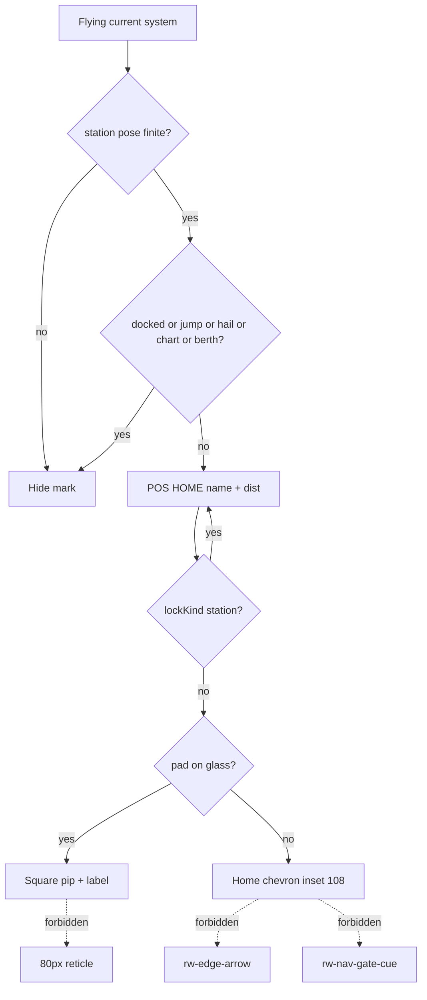

# RIMWARD HUD-06 remaining persistent home-station marker

| Field | Value |
|---|---|
| **Title** | RIMWARD HUD-06 remaining persistent home-station marker |
| **Author** | Wave 126 HUD-06 leftover integrator |
| **Date** | 2026-08-25 |
| **Status** | Wave 127 PR1 implemented. POS HOME + square pip + chevron at inset 108. Leftover was **REAL**. Merge law: shared-contract.md wins. |
| **Wave** | 127 — PR1 in `hud.js` + `hud.css` only. |
| **Owner request** | Inbox P1 HUD/NAV leftover: Add a persistent home-station marker with distance. Census live HUD POS, target edge arrow, scanner arc, station position, dock prompt. Code wins. If a persistent station (or selected POI) marker already shows bearing + distance on and off screen, freeze CONSUME and named serial **none**. Census: **not** live. Freeze leftover **REAL** and name later serial **PR1**. |
| **Merge law** | [`out/w126/homemarker/shared-contract.md`](../out/w126/homemarker/shared-contract.md). If this document and that file conflict, **the contract wins**. |
| **Honor** | HUD-01 empty hub. Aim-glass gauges stay off. Kit mutate omit. Digit 0/8/9 stay. No new Digit. `innerHTML` forbidden later. Marker copy via `textContent`. `state.js` READ-ONLY. No new persist key. `reducedMotion`: no pulse. Color is not the only cue (distance text). Do **not** steal NAV-02 next-gate readout. Do **not** steal TGT-01/02/03 target bracket / amber edge arrow. Do **not** steal Agent API watch badge (PR5). Do **not** claim hail.js. Do **not** steal HUD-03 alerts or HUD-04 toast flood. Do **not** park. Do **not** put a gauge in the HUD-01 empty 80 px aim glass. Do **not** edit the wishlist, `PROGRESS.md`, `docs/AgentApiDesign.md`, `docs/Hail01DemandLifecycleDesign.md`, `docs/Ctl*.md`, `docs/Nav*.md`, `docs/Hud01*`–`Hud05*`, `docs/Tgt*.md`, or `docs/OwnerDecisions*.md`. Do **not** write `docs/OwnerDecisionsWave126.md`. |

**Verifier record:**

| Note | Path |
|---|---|
| Inventory (code wins; Wave 126 census) | [`out/w126/homemarker/current-hud06-home-marker-inventory.md`](../out/w126/homemarker/current-hud06-home-marker-inventory.md) |
| Merge law | [`out/w126/homemarker/shared-contract.md`](../out/w126/homemarker/shared-contract.md) |
| Wave 126 security review | [`out/w126/homemarker/security-review.md`](../out/w126/homemarker/security-review.md) |
| Wave 126 design-doc review | [`out/w126/homemarker/code-review.md`](../out/w126/homemarker/code-review.md) |
| Wave 126 UI audit | [`out/w126/homemarker/ui-audit.md`](../out/w126/homemarker/ui-audit.md) |
| Wave 126 notes | [`out/w126/homemarker/notes.md`](../out/w126/homemarker/notes.md) |

Siblings Agent API, hail-demand, NAV-02/07, TGT, HUD-03/04, Wave 125 overlays, wishlist, `PROGRESS.md`, and `docs/OwnerDecisions*.md` are **other workers**. **Do not edit** those paths. Do **not** write `src/`. Do **not** steal sibling Wave 126 paths.

**This is not NAV-02 next-gate cue.** **This is not TGT edge arrow.** **This is not Agent API watch badge.** **This is not hail demand.** Wishlist home-station marker is **INBOX** (Wave 126 brief). Census still finds **POS XYZ only**.

---

## Overview

Inbox source (`docs/PLAYER-EXPERIENCE-WISHLIST.md` Idea inbox — Playtest capture 2026-08-25 second pass; **cite, do not edit**):

> INBOX (P1, HUD/NAV): Add a persistent home-station marker with distance. Nothing on the HUD points to the station once it leaves the screen; a drift to 8,900 u out left only raw POS coordinates as a navigation aid. Threats get an edge arrow; the station does not. Mark the home station (or a selected point of interest) with bearing and distance.

Wave 126 this worker lands markdown only. Bindings do not change here.

Census (code wins): TGT off-screen arrow is live (`hud.js` **816**, **1415–1433**) for `ctx.targets.current` only. Scanner arc is ships (**876**, **1494–1498**). POS is system name + ship XYZ (**1028–1031**, **1974–1986**). Chartmarks are mystery landmarks (**824–841**, **1648–1688**). NAV-02 gate cue + GATE dist are the plotted hop (**818–822**, **1008–1026**, **1718–1752**). Station world pose is `ctx.station.position` (`station.js` **4394–4411**, **6304–6319**). Dock prompt `J` / `Dock` only inside `U.DOCK_RANGE` 45 (`state.js` **30**; `hud.js` **2169–2170**). No `.rw-home-mark`. No POS `HOME` row. Selected POI picker **absent**. Leftover is **REAL**.

This leftover is a **session HUD cue** to the **current system's pad**. It is not a new Digit. It is not a lock. It is not a gate ring.

This document is the integrator for a **later** implementation wave.

HUD-01 empty aim glass stays empty. `state.js` stays READ-ONLY. No new persist key. Digit 0/8/9 stay. Do not invent UU. Do not steal Digit 0/8/9. Do not steal NAV-02 / TGT / Agent API / hail.

Wave 126 deputize (recorded here and in the contract; owner may override after playtest): **current-system station first**. Selected POI **omit** (not the same cheap path). On-glass **square pip**; off-glass **home chevron** at inset **108** (TGT/NAV-02 keep 84). Distance in **u** / **k** like chartmarks. POS row `HOME` always carries text. Hide docked, jump, hail, chart, berth. No pulse. Hide on-glass when the lock is already the station.

If census had proved persistent bearing + distance already live, this pack would freeze **CONSUME** and name serial **none**. Census did not. That CONSUME path is unexpected.

---

## Background & Motivation

### Current state (inventory)

Source of truth: [`out/w126/homemarker/current-hud06-home-marker-inventory.md`](../out/w126/homemarker/current-hud06-home-marker-inventory.md). Code wins.

| Surface | Today | Cite |
|---|---|---|
| POS | system + `X Y Z` | `hud.js` **1028–1031**, **1974–1986** |
| TGT edge arrow | amber; current lock; inset 84 | **70**, **816**, **1415–1433**; `hud.css` **576–594** |
| Scanner arc | ships; scanner-gated | **876**, **1494–1498** |
| Chartmarks | unvisited charted landmarks | **824–841**, **1648–1688**, **1847–1858** |
| NAV-02 cue | `rw-nav-gate-cue` + GATE dist | **818–822**, **1718–1752**, **2033–2034** |
| Station pose | stable Vector3; HUD may hold ref | `station.js` **4394–4411** |
| Dock zone | `dist <= 45` → `inZone`; HUD `J Dock` | **6308–6319**; `hud.js` **2169–2170** |
| Station lock | KeyV materialize; bracket `name` + `dist u` | `reticle-aim.js` **283–286**; `hud.js` **2073–2075** |
| `HOME` / `rw-home-mark` | **absent** | grep 0 |
| `innerHTML` in hud.js | **none** | grep 0 |

The player who drifts 8,900 u from the pad has XYZ and nothing that points home unless they still have the station locked.

### Pain points

- Threats keep an edge arrow. The pad does not.
- Dock `J` is a 45 u bubble. It does not help at 8,900 u.
- Reusing the amber TGT arrow would look like the pad is a hostile lock.
- Reusing NAV-02 gate ticks would steal the next-hop identity.
- Putting a compass in the 80 px hub would reopen HUD-01.
- A selected-POI picker is a second feature (UI + session target). Chartmarks already mark mystery landmarks.
- `innerHTML` of `ctx.station.name` is XSS.
- A persist key for “home” impersonates the owner and is unnecessary (`ctx.station` already rebuilds).
- Projecting NPC positions would leak hidden AI.

### Why now (design) / why not now (code)

The owner asked for the HUD-06 leftover integrator so a later serial can paint a pad cue **without** stealing lock/gate chrome **before** the first home DOM node. Inventory shows the projection math already exists (chartmarks / TGT / NAV-02) and the pad pose is already on `ctx.station`. Merge law can exist without touching `src/`. Implementation waits so hub occupancy, TGT/NAV steal, persist, Digit theft, hail stacking, and Agent API badge collision are frozen before the first node. Wave 126 this worker does not ship `src/`.

If census had proved the marker already live, this pack would freeze **CONSUME** and name serial **none**. Census did not.

---

## Goals & Non-Goals

### Goals

1. Document live POS, TGT edge arrow, scanner arc, station pose, dock prompt from **live code**.
2. Freeze leftover = **current-system station pip + off-screen home chevron + POS HOME distance**. Not a lock. Not a gate.
3. Freeze deputize: home station first; selected POI omit. Do not park.
4. Freeze HUD-01 empty hub. Digit 0/8/9 stay. Write-set `hud.js` + `hud.css` only.
5. Freeze persist: **none** new. `state.js` READ-ONLY.
6. Freeze later copy via `textContent`. `innerHTML` forbidden.
7. Freeze accessibility: distance text; no pulse on `reducedMotion`; color is not the only cue.
8. Freeze a serial PR plan. This wave writes the document. A later wave ships serially.

### Non-goals (locked — do not reopen)

- No `src/` or live bindings in this worker.
- No NAV-02 `gateCue` / GATE row / `world.nav` rewrite.
- No TGT `edgeArrow` reuse. No contacts-arc station pip. No `targets.current` write.
- No selected POI picker.
- No Agent API badge. No hail.js. No HUD-03/04 retune.
- No HUD-01 hub child. No new Digit. No toast.
- No `state.js` write. No WORLD_FIELDS.
- No `galaxychart.js` / `nav.js` / `controls.js` / `station.js` writes.
- Do not edit the wishlist, `PROGRESS.md`, honor docs, OwnerDecisions*.
- Do not write `docs/OwnerDecisionsWave126.md`.
- Do not fix known boot FAILs.
- Do not steal sibling Wave 126 packs.

---

## Proposed Design

### 1. Merge resolutions (contract wins)

| Question | Integrator freeze | Why |
|---|---|---|
| Leftover real? | **Yes** — no persistent pad cue | Inventory §1 |
| CONSUME? | **No**. Serial is **not** none | Census |
| New persist key? | **No** | Contract §0.5 |
| `state.js` write? | **No** | Contract §0.4 |
| Marker kind | current-system `ctx.station` | cheap; pose live |
| Selected POI | **omit** | not same path |
| On-glass | new `.rw-home-mark` pip | not TGT/NAV-02 |
| Off-screen | new chevron, inset **108** | not amber arrow |
| Distance | chartmark `u`/`k` + POS `HOME` | text cue |
| Hide | docked, jump, hail, chart, berth | overlays / pad screen |
| Named PR1? | **PR1** home marker | REAL leftover |

### 2. Current HUD motion (do not break HUD-01 / NAV-02 / TGT)

Reticle hub stays 80 px empty of extras. Amber arrow stays the lock. Gate ticks stay the route. Scanner arc stays ships. Chartmarks stay landmarks. POS keeps XYZ. Home is a **fourth identity**: square beacon + `HOME` text.

### 3. Deputize table (copy of contract §0.1)

Owner may override after playtest. Do not park.

| Knob | Value |
|---|---|
| Kind | current-system station |
| POI picker | omit |
| On-screen | square pip + label |
| Off-screen | home chevron, inset 108 |
| Dist | `Nu` / `N.Nk` |
| POS | `HOME` row |
| Hide | docked, jumping, hailOpen, chartOpen, berthOpen |
| Lock station | hide on-glass; keep POS HOME |
| `reducedMotion` | show; no pulse |
| Copy | `textContent` + `stripHudText` |
| Fail-closed | hide; never throw |
| Persist | none |
| Home | `hud.js` + `hud.css` |

### 4. Neighbours

| Module | This leftover does | This leftover does not |
|---|---|---|
| `hud.js` | later PR1: nodes, project, POS HOME, hide | hub child; toast; Digit |
| `hud.css` | later PR1: `.rw-home-mark` | restyle TGT/NAV-02 |
| `station.js` | **read** pose / name / inZone | mesh, dock math, overlay |
| `nav-guidance.js` | optional `formatNavDist` **call** | file edit; GATE chrome |
| `nav.js` | none | plot / AP |
| `galaxychart.js` | none | NAV-07 labels |
| `reticle-aim.js` | none | KeyV cone |
| `hail.js` | read `hailOpen` hide | demand copy |
| `agent-api.js` | none | PR5 badge |
| `state.js` | none | WORLD_FIELDS |
| `controls.js` | none | keys |

### 5. Serial PR plan

Matches contract §3. **Named only. Do not implement in Wave 126.**

| PR | Lands | Does not land |
|---|---|---|
| **PR1** home marker | pip, chevron 108, POS HOME, hide rules, `textContent` | TGT/NAV steal; POI picker; persist; Digit; `innerHTML`; hub; hail.js; agent-api; `nav.js`; `galaxychart.js`; `station.js` write |
| **PR2 stills (optional)** | 8,900 u stills; hail/dock hide | Required with PR1 |
| **PR3 census (optional skip)** | grep no `edgeArrow` reuse; no new persist | POI |

First remaining serial is **PR1**. It must not steal Digit 0/8/9. It must not write `state.js`. It must not claim `nav.js` / `galaxychart.js`.

### 6. Picture

Reuse live HUD root. No new Digit. No hub pip. Player flies out. POS grows a `HOME` line with pad name and distance. A square beacon sits on the pad when it is on glass. When the pad leaves glass, a **non-amber** home chevron sits on the edge at 108 px inset and still names distance on POS. Dock, jump, hail, chart, and berth hide it. If the player KeyV-locks the station, TGT keeps the bracket; the extra pip goes away so two chromes do not stack.

---

## Player outcome (later serial; freeze here)

Leave the pad and drift. POS still shows XYZ. A new **HOME** line names the station and the range (`8900u` or `8.9k`). A square mark sits on the pad. Turn away. An edge chevron points back. It is not the threat triangle. It is not the gate ticks.

Approach to 45 u. `J Dock` still appears. The home mark may remain until dock. Dock: mark hides (station screen owns the view). Hail / chart / berth: mark hides so it does not paint on those cards.

Lock the station with KeyV: bracket shows name + dist; home pip hides; POS HOME stays.

`reducedMotion` does not pulse the mark.

**NAV-02 GATE** is **not** this work. **TGT arrows** are **not** this work. **Agent API badge** is **not** this work. **Hail demand** is **not** this work.

---

## Security

See [`out/w126/homemarker/security-review.md`](../out/w126/homemarker/security-review.md).

- XSS: no `innerHTML` for name / dist. `textContent` + `stripHudText`.
- Persist: no new key. Hostile save cannot spoof a home POI.
- Leak: project **only** `ctx.station.position`. Never NPC / unspawned banks.
- Proto: authored class names only.
- Fail-closed: missing pose hides. Never throw.

---

## Acceptance direction (implementation wave)

1. While flying with a live pad pose and no hail/chart/berth/dock/jump, POS shows `HOME` + distance text.
2. On-glass: square pip at the pad. Off-glass: home chevron at inset 108. Not amber TGT. Not gate ticks. Not the 80 px hub.
3. Distance uses `u` / `k` like chartmarks. GATE row unchanged.
4. Docked, jumping, hailOpen, chartOpen, berthOpen → hidden.
5. Station lock → on-glass home hidden; POS HOME remains.
6. `reducedMotion` → no pulse.
7. Color is not the only cue.
8. `innerHTML` still 0 in `hud.js`. No new `WORLD_FIELDS`. No `state.js` write.
9. Write-set is `hud.js` + `hud.css` only.
10. Known boot FAILs untouched.

---

## Alternatives considered

| Alternative | Why not |
|---|---|
| Freeze CONSUME / serial none | Census: persistent pad cue **not** live |
| Reuse TGT `rw-edge-arrow` | Station looks like a threat / steals lock |
| Reuse NAV-02 gate cue / GATE row | Steals next-hop |
| Station tick on scanner arc | TGT-03 ships; HUD-01 bottom |
| Compass inside 80 px hub | HUD-01 |
| Selected POI picker | Extra UI; chartmarks exist; omit |
| Persist home id | Unnecessary; `ctx.station` rebuilds; spoof |
| `innerHTML` name | XSS |
| Claim `station.js` / `nav.js` / chart | Write-set freeze |
| Pulse the pip | `reducedMotion` + noise |

---

## Regression risks

| Risk | Mitigation |
|---|---|
| Double chrome with station lock | Hide on-glass when `lockKind === 'station'` |
| Overlap TGT/NAV-02 edge | Inset 108; distinct glyph |
| Hub occupancy | Forbidden |
| GATE dist stolen | Separate POS HOME |
| Hail card clutter | Hide on `hailOpen` |
| XSS name | `stripHudText` + `textContent` |
| Persist spoof | No new key |
| NPC leak | Station pose only |
| Digit 0/8/9 | no new Digit |
| REDMARCH boot flake | do not “fix” |

---

## Ownership

| Object | Writer | Reader |
|---|---|---|
| `.rw-home-mark` | later PR1 `hud.js` / `hud.css` | player |
| POS HOME | later PR1 `hud.js` `textContent` | player |
| `ctx.station.position` | **none** (`station.js`) | HUD |
| `edgeArrow` / `gateCue` | **none** | — |
| `targets.current` | **none** | hide-on-lock |
| `state.js` | **none** | — |
| Digit / toast / badge | **none** | — |

---

## Open owner questions

**Deputized this wave** (contract §0.1). Owner may override after playtest. Do not park.

1. Smallest additive = current-system station pip + chevron + POS HOME. No POI picker.
2. Hide under dock/jump/hail/chart/berth.
3. No new persist key.
4. Home: `hud.js` + `hud.css` only.
5. Optional PR2 stills are skippable after playtest.
6. Leftover is **real**. Not CONSUME. Serial is **PR1**, not none.
