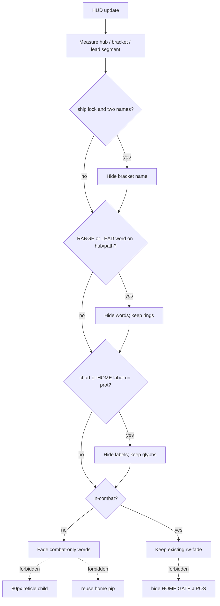

# RIMWARD HUD-07 leftover dynamic deconfliction

| Field | Value |
|---|---|
| **Title** | RIMWARD HUD-07 leftover dynamic deconfliction |
| **Author** | Wave 128 HUD-07 leftover integrator |
| **Date** | 2026-08-26 |
| **Status** | leftover **REAL**. Wave 129 **PR1 implemented** (`src/systems/hud.js` + `src/ui/hud.css`). Merge law: shared-contract.md wins. |
| **Wave** | 129 PR1 — yield + quieter cruise. Bindings unchanged. |
| **Owner request** | Inbox P1 HUD leftover: Add dynamic deconfliction and a quieter exploration layout for the central HUD. Census live HUD. Code wins. If the central sight picture already deconflicts (reticle / player silhouette / selected target / projectile path protected; lower-priority cards/labels/cues/banners collapse or relocate on collision; exploration layout quieter than combat), freeze leftover **CONSUME** and named serial **none**. Name: **no HUD-07 leftover.** Census: **not** live. Freeze leftover **REAL** and name later serial **PR1**. |
| **Merge law** | [`out/w128/deconflict/shared-contract.md`](../out/w128/deconflict/shared-contract.md). If this document and that file conflict, **the contract wins**. |
| **Honor** | HUD-01 empty **80 px hub**. Aim-glass gauges stay off. Kit mutate omit. Digit 0/8/9 stay. No new Digit. KeyH/J/L/M/P stay. `innerHTML` forbidden later. Copy via `textContent`. `state.js` READ-ONLY. No persist key. No UU. No SKU. HUD-04 8 s linger stays. Do not reopen toast flood. HUD-06 POS HOME + square pip + chevron inset **108** — cite; do not retune; do not steal the pip. TGT bracket + amber edge arrow inset **84** — cite; do not steal. NAV-02 gate cue inset **84** — cite; do not steal. `.in-combat` collapse already exists — census it; do not blindly duplicate. Color is not the only cue. `reducedMotion`: no new pulse. Fail closed: never throw from HUD update; zero extra per-frame DOM alloc; hide-not-delete. Do not “fix” REDMARCH `castMatches`. Later write-set if REAL: **`src/systems/hud.js` + `src/ui/hud.css` only**. Do not claim hail.js, galaxychart.js, controls.js, npc.js. This is **not** HUD-05 remaining-feedback CONSUME. This is **not** HUD-06. This is **not** HUD-01 empty hub occupancy. This is **not** HUD-03. This is **not** HUD-04 rewrite. Do **not** edit the wishlist, `PROGRESS.md`, `docs/Hud01*`–`Hud06*`, `docs/Hud04ToastFloodDesign.md`, `docs/Hud05RemainingFeedbackDesign.md`, `docs/Hail01*`, `docs/Hail02MissFeedbackDesign.md`, `docs/Nav09ChartReadabilityDesign.md`, `docs/AgentApiDesign.md`, `docs/Ctl*.md`, `docs/Nav*.md`, `docs/Tgt*.md`, or `docs/OwnerDecisions*.md`. |

**Verifier record:**

| Note | Path |
|---|---|
| Inventory (code wins; Wave 128 census) | [`out/w128/deconflict/current-hud07-deconflict-inventory.md`](../out/w128/deconflict/current-hud07-deconflict-inventory.md) |
| Merge law | [`out/w128/deconflict/shared-contract.md`](../out/w128/deconflict/shared-contract.md) |
| Wave 128 security review | [`out/w128/deconflict/security-review.md`](../out/w128/deconflict/security-review.md) |
| Wave 128 design-doc review | [`out/w128/deconflict/code-review.md`](../out/w128/deconflict/code-review.md) |
| Wave 128 UI audit | [`out/w128/deconflict/ui-audit.md`](../out/w128/deconflict/ui-audit.md) |
| Wave 128 notes | [`out/w128/deconflict/notes.md`](../out/w128/deconflict/notes.md) |

Siblings Hail02, NAV-09, HUD-05 CONSUME, HUD-06 PR1 (already live), Agent API, CTL, wishlist, and `PROGRESS.md` are **other workers**. **Do not edit** those paths. **Do not** write `src/`. **Do not** steal sibling Wave 128 paths (`out/w128/hailmiss/**`, `out/w128/chartread/**`).

**This is not HUD-05 remaining-feedback.** **This is not HUD-06 home marker.** **This is not HUD-01 empty hub.** **This is not HUD-03 alerts.** **This is not HUD-04 toast flood.** Wishlist central-HUD deconfliction is **INBOX**. Census still finds **no collision yield** and **loud cruise combat chips**.

---

## Overview

Inbox source (`docs/PLAYER-EXPERIENCE-WISHLIST.md` Idea inbox — **100–105** — **cite, do not edit**):

> INBOX (P1, HUD): Add dynamic deconfliction and a quieter exploration layout for the central HUD. In live targeting, player and target cards, duplicated target labels, range/lead cues, bright suns, stations/gates, and narrative banners can stack across the same central sight picture. Protect the reticle, ship silhouette, selected target, and projectile path; collapse or relocate lower-priority data when those regions collide.

Wave 128 this worker lands markdown only. Bindings do not change here.

Census (code wins): Bio AGEZ hides **rail hair** vs reticle + lead segment (`hud.js` **209–221**, **1545–1561**) only. `.in-combat` fades career chrome (`.rw-fade` **0.14**), aux **0.38**, chartmarks and home marks **0.14**. Banner and toasts sit **top-right**, off the aim column (`hud.js` **769–773**; `hud.css` **690–701**). NAV-02 cue hides on-glass. HUD-06 pip hides when the lock is the station. Combat rails at **57% vh ± 78 px** stay **fully opaque in cruise and in combat**. Ship lock paints **two names** (`.rw-target-name` + `.rw-combat-name`, **2322** vs **2349**). `RANGE` / `LEAD` words sit on the aim column. Chartmark and home **labels** can land on the hub and the lock. There is **no** general collision loop. Exploration is **not** quieter than combat for combat-only chips. Leftover is **REAL**.

This leftover is **one layout policy** on the live `#hud` tree. It is not a new Digit. It is not a second HUD. It is not a hub gadget.

This document is the integrator for a **later** implementation wave.

HUD-01 empty aim glass stays empty. `state.js` stays READ-ONLY. No new persist key. Digit 0/8/9 stay. KeyH/J/L/M/P stay. Do not invent UU. Do not steal HUD-06 pip, TGT arrow, NAV-02 cue, or HUD-04 channel.

Wave 128 deputize (recorded here and in the contract; owner may override after playtest): protect four regions; yield duplicate names and RANGE/LEAD **words** plus chartmark/home **labels** on collision; exploration fades those combat-only words; never hide HOME / NAV-02 / dock J / POS as the only nav; hide-not-delete; no hub child; no third live region.

If census had proved the four regions already protected and cruise already quieter, this pack would freeze **CONSUME** and name serial **none**. Census did not. That CONSUME path is unexpected.

---

## Background & Motivation

### Current state (inventory)

Source of truth: [`out/w128/deconflict/current-hud07-deconflict-inventory.md`](../out/w128/deconflict/current-hud07-deconflict-inventory.md). Code wins.

| Surface | Today | Cite |
|---|---|---|
| 80 px hub | empty of extras; clamp on glass | `hud.css` **183–193**; `hud.js` **1400** |
| RANGE word | child of reticle; `.in-range` | `hud.js` **861**, **1564–1576**; `hud.css` **207–220** |
| Player card | `.rw-combat-self` always on | `hud.js` **1006–1014**; `hud.css` **941–956** |
| Target card | `.rw-combat-target`; hide if no ship lock | `hud.js` **1016–1029**, **1423–1428** |
| Duplicate name | bracket + rail | **2322**, **2349** |
| Lead | ring + `LEAD` word | **893–895**, **1494–1520** |
| TGT arrow | amber; inset 84 | **74**, **896**, **1521–1541** |
| NAV-02 cue | off-glass only; inset 84 | **1836–1859** |
| HUD-06 home | pip + chevron 108 + POS HOME | **75**, **903–909**, **2181–2196** |
| Chartmarks | project + edge 84; fade in combat | **1755–1795**; `hud.css` **632** |
| Banner | top-right 96/14 | `hud.js` **769–773** |
| Toasts | top-right; 4 s / 5 / 8 s linger | **68–70**; `hud.css` **690–701** |
| Prompt | bottom 20% center; `J Dock` | `hud.css` **798–802**; `hud.js` **2375–2379** |
| `.in-combat` | fade career; not rails | `hud.css` **89**, **999**; `hud.js` **2027–2031** |
| AGEZ | bio hair vs hub + lead segment | `hud.js` **209–221**, **1545–1561** |
| Suns | 3D + toast only | **661–664** |
| `innerHTML` | **none** | grep 0 |
| Collision loop | **absent** | grep `deconflict` / overlap 0 in `hud.js` |

The player who locks a ship in chase sees two names, RANGE under the hub, LEAD on the pip, DIST on the rail, chartmark labels, and a home pip label on the same glass. The player who cruises still sees a full combat self rail and RANGE/LEAD words if a lock remains.

### Pain points

- Cards sit on the hull / shot column at 57% vh. Stroke-only background helped; **text did not yield**.
- Duplicate lock name is two reads of one fact.
- RANGE word + DIST + bracket `· N u` are three range reads.
- Chartmarks and HOME labels can cover the hub and the lock. Combat only **dims** them (0.14), still on-glass.
- Exploration is loud: combat chips stay full. Wishlist wants cruise quieter, with HOME / GATE / J / POS remaining.
- A naive hub gadget reopens HUD-01.
- A naive second HUD skin doubles CSS and breaks one-policy.
- A naive third `aria-live` fights HUD-04.
- A naive `innerHTML` of lock names is XSS. Rail path already skips `stripHudText` (`2349`).
- A persist “HUD layout” key impersonates the owner.
- Stealing HUD-06 pip or TGT arrow as a yield toy destroys neighbor identity.

### Why now (design) / why not now (code)

The owner asked for the HUD-07 leftover integrator so a later serial can yield words/labels **before** the first extra hub child. Inventory shows AGEZ math and `.in-combat` already exist to **reuse**, not duplicate blindly. Merge law can exist without touching `src/`. Implementation waits so hub occupancy, HUD-06 inset, toast channel, Digit theft, and persist clocks stay frozen. Wave 128 this worker does not ship `src/`.

If census had proved deconfliction already live, this pack would freeze **CONSUME** and name serial **none**. Census did not.

---

## Goals & Non-Goals

### Goals

1. Document live HUD nodes, seats, `.in-combat` fade, AGEZ, duplicate names, RANGE/LEAD, HOME/NAV-02/TGT, banner/toasts from **live code**.
2. Freeze leftover = **dynamic yield on the four protected regions + quieter cruise for combat-only chips**. Not HUD-05. Not HUD-06. Not toast flood.
3. Freeze deputize: four regions; collapse duplicate name / RANGE word / LEAD word / overlapping labels; exploration quieter; do not hide HOME / NAV-02 / dock J / POS. Owner may override after playtest. Do not park.
4. Freeze HUD-01 empty hub. Digit 0/8/9 stay. KeyH/J/L/M/P stay. Write-set `hud.js` + `hud.css` only.
5. Freeze persist: **none** new. `state.js` READ-ONLY.
6. Freeze later copy via `textContent` + `stripHudText`. `innerHTML` forbidden.
7. Freeze accessibility: color is not the only cue; no new pulse; no third live region.
8. Freeze a serial PR plan. This wave writes the document. A later wave ships serially.

### Non-goals (locked — do not reopen)

- No `src/` or live bindings in this worker.
- No HUD-01 hub child. No aim-glass gauges. No kit mutate.
- No HUD-05 remaining-feedback reopen. No HUD-04 linger retune. No HUD-03 alerts.
- No HUD-06 inset **108** retune. No pip steal. No selected-POI picker.
- No TGT arrow / NAV-02 cue rewrite.
- No hail.js / galaxychart.js / controls.js / npc.js.
- No sun HUD callout.
- No second HUD tree. No new Digit. No toast. No persist.
- No `state.js` write. No WORLD_FIELDS.
- Do not edit the wishlist, `PROGRESS.md`, honor docs, OwnerDecisions*.
- Do not write `out/w128/deconflict/verify/**`.
- Do not fix known boot FAILs.
- Do not steal sibling Wave 128 Hail02 / NAV-09 packs.

---

## Proposed Design

### 1. Merge resolutions (contract wins)

| Question | Integrator freeze | Why |
|---|---|---|
| Leftover real? | **Yes** | Inventory §6 |
| CONSUME? | **No**. Serial is **not** none | Census |
| Name “no HUD-07 leftover”? | **Forbidden** | hole live |
| New persist key? | **No** | Contract §0.4 |
| `state.js` write? | **No** | Contract §0.4 |
| Hub child? | **No** | HUD-01 |
| Two HUDs? | **No** — one `#hud.in-combat` policy | Contract §0.16 |
| Protected | reticle, silhouette proxy, bracket, path | deputize |
| Yield | dup name, RANGE/LEAD **words**, chart/home **labels** | smallest additive |
| Keep | HOME pip, GATE cue, TGT arrow, dock J, POS, banner seat | neighbors |
| Named PR1? | **PR1** deconflict | REAL leftover |

### 2. Current HUD motion (do not break HUD-01 / HUD-06 / NAV-02 / TGT / HUD-04)

Reticle hub stays 80 px empty of extras. Amber arrow stays the lock. Gate ticks stay the route. Home pip stays the pad (inset 108). Toasts stay top-right with 8 s linger. AGEZ hair stays for bio. Deconflict **adds yield**, it does not replace those identities.

### 3. Deputize table (copy of contract §0.1)

Owner may override after playtest. Do not park.

| Knob | Value |
|---|---|
| Protect | hub 80, silhouette proxy, bracket box, reticle→lead segment |
| Dup name | hide `.rw-target-name` when rail name shows |
| RANGE word | hide on collision or in cruise when DIST exists; keep ring |
| LEAD word | hide on collision or in cruise; keep ring |
| Chart / HOME labels | hide label on collision; keep glyph / pip / POS HOME |
| Rails | opacity yield if they cover path; never delete |
| Prompt / GATE / HOME pip / TGT arrow | do not steal; do not hide as only nav |
| Exploration | quieter combat-only words; one `#hud` |
| Combat | existing `.rw-fade` / aux / chart / home dim |
| `reducedMotion` | no new pulse |
| Copy | `textContent` + `stripHudText` |
| Fail-closed | skip yield; never throw |
| Persist | none |
| Home | `hud.js` + `hud.css` |

### 4. Neighbours

| Module | This leftover does | This leftover does not |
|---|---|---|
| `hud.js` | later PR1: yield classes, word/label hide, cruise policy, reuse AGEZ math | hub child; toast; Digit; delete pools |
| `hud.css` | later PR1: yield opacity; `#hud:not(.in-combat)` combat-chip quiet | restyle TGT/NAV-02/HOME glyphs; linger |
| HUD-06 | **read** pip/chevron/POS HOME; may hide **label** | retune 108; steal pip |
| TGT | **read** bracket / arrow 84 | restyle arrow |
| NAV-02 | **read** cue 84 / GATE | hide as layout toy |
| HUD-04/05 | **read** toast stack | new channel; third live region |
| `hail.js` | none | demand copy |
| `galaxychart.js` | none | NAV-09 zoom |
| `controls.js` | none | keys |
| `npc.js` | none | AI |
| `state.js` | none | WORLD_FIELDS |

### 5. Serial PR plan

Matches contract §3. **Named only. Do not implement in Wave 128.**

| PR | Lands | Does not land |
|---|---|---|
| **PR1** deconflict + quieter cruise | yield duplicate name / RANGE+LEAD words / overlapping labels; cruise fade of those words; hide-not-delete; `stripHudText` if names move | hub child; HOME 108 retune; TGT/NAV steal; toast; persist; Digit; `innerHTML`; hail.js; galaxychart.js; controls.js; npc.js; POI; sun pip |
| **PR2 stills (optional)** | lock still + cruise still | Required with PR1 |
| **PR3 census (optional skip)** | grep no hub child; no new persist; no third `aria-live` | — |

First remaining serial is **PR1**. It must not steal Digit 0/8/9. It must not write `state.js`. It must not claim hail/chart/controls/npc.

### 6. Picture

Reuse live HUD root. No new Digit. No hub gadget. Player cruises: combat-only words fade; POS HOME, GATE, and dock J stay. Player locks a ship: one name on the rail, bracket keeps corners + band + dist; RANGE is a ring not a stacked word if DIST is up; LEAD is a ring; chartmark labels yield if they sit on the hub. Combat still dims career chrome via existing `.in-combat`. Bio hair AGEZ stays.

---

## Player outcome (later serial; freeze here)

Cruise with no fight. The self rail still names hull and speed. RANGE and LEAD **words** stay quiet. HOME, GATE, and `J Dock` still read. Chartmarks do not plaster the hub.

Lock a ship. One name. Bracket corners stay. Lead ring stays. The shot path is not covered by a second name plate or a RANGE sticker on the iris.

Enter combat. Career chrome still fades (existing rule). Rails stay readable. Duplicate words still yield if they sit on the hub.

`reducedMotion` does not pulse yield.

**HUD-06 HOME** is **not** this work except label yield. **TGT arrows** are **not** this work. **NAV-02 GATE** is **not** this work. **Toasts** are **not** this work. **Hail02 / NAV-09** are **not** this work.

---

## Security

See [`out/w128/deconflict/security-review.md`](../out/w128/deconflict/security-review.md).

- XSS: no `innerHTML` for names. `textContent` + `stripHudText` (including rail name if PR1 writes it).
- Persist: no new key.
- Live region: no third `aria-live`.
- Leak: do not project hidden AI as a new pip (no POI picker).
- Fail-closed: skip yield; never throw.

---

## Acceptance direction (implementation wave)

1. With a centered ship lock, `.rw-target-name` and `.rw-combat-name` do not both show the same string on the aim column.
2. When rail DIST (or bracket meta dist) is visible, the `RANGE` **word** does not sit under the hub; `.in-range` ring may stay.
3. `LEAD` **word** yields on hub/bracket/path collision; lead **ring** stays.
4. Chartmark and HOME **labels** yield on hub/bracket/path collision; diamonds / pip / POS HOME stay.
5. Not `.in-combat`: those combat-only **words** are quieter; HOME / NAV-02 / dock J / POS stay.
6. `.in-combat`: existing fade numbers stay; do not hide HOME/GATE/J/POS as a second fade.
7. 80 px hub has no new child. No compass/PPI/deconflict widget.
8. HUD-06 chevron inset remains **108**. TGT/NAV-02 remain **84**.
9. `reducedMotion` → no new pulse. Color is not the only cue.
10. `innerHTML` still 0 in `hud.js`. No new `WORLD_FIELDS`. No `state.js` write. No third `aria-live`.
11. Write-set is `hud.js` + `hud.css` only. Pools hide-not-delete. Update never throws.
12. Known boot FAILs untouched.

---

## Alternatives considered

| Alternative | Why not |
|---|---|
| Freeze CONSUME / serial none / “no HUD-07 leftover” | Census: collision + quiet cruise **not** live |
| Hub compass / PPI / deconflict widget | HUD-01 |
| Two HUD trees (explore vs combat) | One policy; duplicate CSS |
| Blind extra `.in-combat` fade on HOME | Steals HUD-06 / nav |
| Reuse TGT arrow or HOME pip as yield sprite | Steals identity |
| Fold banner into toasts | HUD-04/05 freeze |
| Third live region announcing yield | Fights HUD-04 |
| Sun HUD callout | No live sun node; 3D + toast enough |
| Selected POI picker | HUD-06 omitted; not this leftover |
| Persist layout prefs | Unnecessary; spoof |
| `innerHTML` names | XSS |
| Claim hail.js / chart / controls / npc | Write-set freeze |
| Delete pooled labels | Pool discipline |

---

## Regression risks

| Risk | Mitigation |
|---|---|
| Hub occupancy | Forbidden |
| HOME 108 / TGT 84 / NAV 84 drift | Cite; do not retune |
| Hide HOME in cruise | Forbidden §0.16 |
| Toast flood / third live region | Forbidden |
| Duplicate `.in-combat` opacity stack to 0 | Reuse existing numbers; yield classes separate |
| Bio AGEZ broken | Reuse math; do not remove `rw-hair-off` |
| XSS rail name | `stripHudText` if PR1 writes names |
| Per-frame alloc | Scratch boxes at init |
| Throw in update | fail-closed skip |
| Digit 0/8/9 | no new Digit |
| REDMARCH boot flake | do not “fix” |

---

## Ownership

| Object | Writer | Reader |
|---|---|---|
| Yield classes / word+label hide | later PR1 `hud.js` / `hud.css` | player |
| `#hud:not(.in-combat)` quiet words | later PR1 `hud.css` | player |
| AGEZ hair | **none** (keep) | bio |
| HOME pip / chevron 108 | **none** (HUD-06) | label yield |
| `edgeArrow` / `gateCue` | **none** | — |
| Toasts / linger 8 s | **none** | — |
| `state.js` | **none** | — |
| Digit / hail / chart | **none** | — |

---

## Open owner questions

**Deputized this wave** (contract §0.1). Owner may override after playtest. Do not park.

1. Smallest additive = yield duplicate name + RANGE/LEAD words + overlapping labels; quieter cruise for those words. No hub gadget. No POI picker.
2. Do not hide HOME / NAV-02 / dock J / POS.
3. No new persist key.
4. Home: `hud.js` + `hud.css` only.
5. Optional PR2 stills are skippable after playtest.
6. Leftover is **real**. Not CONSUME. Serial is **PR1**, not none.

---

## Key Decisions

1. Leftover **REAL**. Serial **PR1**. Not “no HUD-07 leftover.”
2. Contract wins vs this document.
3. Four protected regions. Lower-priority **words and labels** yield first.
4. One HUD, two moods via `#hud.in-combat`.
5. Neighbors (HUD-01/04/05/06, TGT 84, NAV-02 84) stay.

---

## PR Plan

See Proposed Design §5 and contract §3. Wave 129 lands **PR1** in `hud.js` + `hud.css`.
