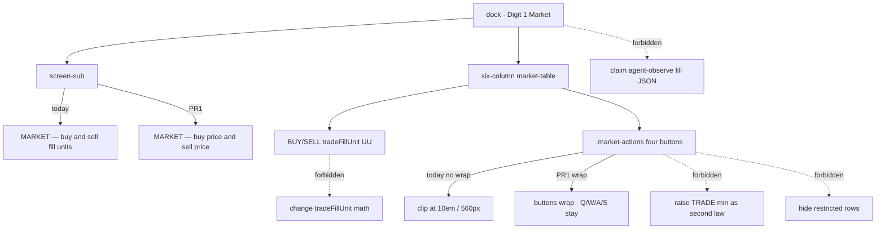

# RIMWARD Mkt01 MARKET desk layout

| Field | Value |
|---|---|
| **Title** | RIMWARD Mkt01 MARKET desk layout |
| **Author** | Wave 139 Mkt01 leftover integrator |
| **Date** | 2026-08-27 |
| **Status** | Implemented Wave 140 PR1. |
| **Wave** | 139 — leftover census + brief. No `src/`. KeyH/J/L/M/P stay. KeyD strafe. Digit 0/8/9 stay. Digit 1 stays Market. Q/W/A/S stay market trade. |
| **Owner request** | Inbox P3 MARKET/UI leftover: TRADE overflow at 560 px + player-word subtitle. Census live MARKET pane in `station.js` (subtitle, grid, Q/W/A/S, `tradeFillUnit` cells, `h()` `textContent`) and `.market-*` in `screens.css`. Code wins. If TRADE already wraps/fits at the live panel minimum **and** the subtitle already uses player words (buy price / sell price, not “fill units”), freeze leftover **CONSUME** and named serial **none**. Name: **no remaining Mkt01 desk-layout leftover.** Census: overflow **does** exist; jargon subtitle **does** exist. Freeze leftover **REAL** and name later serial **PR1**. Combine both inbox items into **one** pack. Agent market-fill observe JSON is **not** this pack. Agent badge is **not** this pack. |
| **Merge law** | [`out/w139/mktdesk/shared-contract.md`](../out/w139/mktdesk/shared-contract.md). If this document and that file conflict, **the contract wins**. |
| **Honor** | HUD-01 empty 80 px hub. Aim-glass gauges stay off. Kit mutate omit. Digit 0/8/9 stay station. Digit 1 stays Market. No new Digit. KeyH hail, KeyJ dock/jump, KeyL berth, KeyM chart, KeyP pause stay. KeyD strafe. Market Q/W/A/S stay. Do not remap. CTL-02 never writes `flags.paused`. CTL-03/04 not this pack. CTL-04 menu digits cite only — do not steal PR2 `fireHeld`. `innerHTML` forbidden later. MARKET rows stay `textContent`. `state.js` READ-ONLY. Default persist **none**. No UU. No SKU. No new WORLD_FIELDS. Do not retune prices. Do not change `tradeFillUnit` math. Do not hide illegal rows. Do not steal Agent market-fill observe JSON. Color is not the only cue. `reducedMotion`: no new animation that ignores it. Fail closed: never throw from market pane paint; unknown commodity skip; missing COMMODITIES name → key text, not crash. Do not steal optional PR2s Hail01 / HUD-06 / Hail02 / HUD-07 / NAV-09 / NAV-10 governor / TGT-07 stills / MSN-04 other families / CTL-03 / AI-05 / CTL-04 or Agent pad 2B or in-repo LLM. Do not steal sibling Wave 139 packs. Do not pause. Do not teleport. Prototype-safe: authored literals only. |

**Verifier record:**

| Note | Path |
|---|---|
| Inventory (code wins; Wave 139 census) | [`out/w139/mktdesk/current-market-desk-layout-inventory.md`](../out/w139/mktdesk/current-market-desk-layout-inventory.md) |
| Merge law | [`out/w139/mktdesk/shared-contract.md`](../out/w139/mktdesk/shared-contract.md) |
| Wave 139 security review | [`out/w139/mktdesk/security-review.md`](../out/w139/mktdesk/security-review.md) |
| Wave 139 design-doc review | [`out/w139/mktdesk/code-review.md`](../out/w139/mktdesk/code-review.md) |
| Wave 139 UI audit | [`out/w139/mktdesk/ui-audit.md`](../out/w139/mktdesk/ui-audit.md) |
| Wave 139 notes | [`out/w139/mktdesk/notes.md`](../out/w139/mktdesk/notes.md) |

Siblings Agent market fill, Agent badge layout, archive desk, seed papers, wishlist, and `PROGRESS.md` are **other workers**. **Do not edit** those paths. **Do not** steal sibling Wave 139 paths. **Do not** write `out/w139/mktdesk/verify/**`.

**This is not Agent observe fill.** **This is not Agent badge.** **This is not price retune.** **This is not locker hide.** **This is not pad 2B.** Wishlist TRADE overflow + subtitle jargon are **INBOX**. Census still finds **no wrap** and **fill units**.

---

## Overview

Inbox source (`docs/PLAYER-EXPERIENCE-WISHLIST.md` Playtest capture 2026-08-27 Claude Fable — **318–323** — **cite, do not edit**):

> INBOX (P3, MARKET/UI): Six-column market TRADE buttons can overflow at the 560 px panel minimum. Wrap `.market-actions` or raise the TRADE min track. Keep Q/W/A/S. Cite `out/orch-fable/t3/ui-audit.md`.
>
> INBOX (P3, MARKET/UI): Subtitle `MARKET — buy and sell fill units` is honest but uses helper jargon. Prefer player words such as buy price and sell price. Cite `out/orch-fable/t3/ui-audit.md`.

Fable audit is **evidence**, not live truth. Code wins.

BUY and SELL cells **already** show qty-1 UU from `tradeFillUnit`. Keyboard Q/W/A/S **already** trades. The hole is **layout + wording**: four TRADE buttons do not wrap in a 10em track at 560 px, and the subtitle names the helper (“fill units”) instead of buy price / sell price.

Wave 139 this worker lands markdown only. Bindings do not change here.

Census (code wins): subtitle `'MARKET — buy and sell fill units'` (`station.js` **4830**). Six-column grid last track `minmax(10em, 1.7fr)` (`screens.css` **181**). `.market-actions { display: flex; gap: 6px; }` **no wrap** (**215–218**). Four `+1`/`+5`/`−1`/`−5` buttons (**4853–4856**). Panel `min-width: 560px`, `overflow-y: auto` only (**28–31**). `h()` `textContent` (**4544–4548**). Leftover is **REAL**.

This leftover is a **named desk-layout pack**: wrap TRADE actions; player-word subtitle. It is not a price rewrite. It is not observe JSON. It is not a new Digit.

This document is the integrator for a **later** implementation wave.

HUD-01 empty aim glass stays empty. `state.js` stays READ-ONLY. No new persist key. Digit 0/8/9 stay. Digit 1 stays Market. KeyH/J/L/M/P stay. Q/W/A/S stay. Do not invent UU. Do not steal Agent fill or Agent badge.

Wave 139 deputize (recorded here and in the contract; owner may override after playtest): **wrap** `.market-actions`; do **not** raise the TRADE min track as a competing law; subtitle `'MARKET — buy price and sell price'`; fail-closed skip; keep Q/W/A/S; keep `tradeFillUnit` math.

If census had proved wrap/fit **and** player-word subtitle already live, this pack would freeze **CONSUME** and name serial **none**. Census did not. That CONSUME path is unexpected.

---

## Background & Motivation

### Current state (inventory)

Source of truth: [`out/w139/mktdesk/current-market-desk-layout-inventory.md`](../out/w139/mktdesk/current-market-desk-layout-inventory.md). Code wins.

| Surface | Today | Cite |
|---|---|---|
| Subtitle | `MARKET — buy and sell fill units` | `station.js` **4830** |
| Heads | COMMODITY / STATUS / BUY / SELL / HOLD / TRADE | **4833–4838** |
| Fills | `tradeFillUnit` BUY and SELL | **4692–4714**, **4842–4847** |
| TRADE buttons | `+1` `+5` `−1` `−5` no wrap | **4853–4856**; CSS **215–218** |
| TRADE min | `minmax(10em, 1.7fr)` | `screens.css` **181** |
| Panel | `min-width: 560px`; `overflow-y: auto` | **28–31** |
| Legend | Q/W buy 1/5 · A/S sell 1/5 | `station.js` **4859**, **6296–6300** |
| Paint | `h()` `textContent` | **4544–4548** |
| Illegal | `'trade refused'` visible | **4850–4851** |
| Digit 1 | Market | **189**, **6124–6126** |
| Observe market | `posted`, not fill | `agent-observe.js` **258–275** — cite only |

The player who docks, taps Digit 1, and shrinks the station panel to its 560 px floor can lose a clean mouse TRADE row. The keyboard still buys. The subtitle still says fill units.

### Pain points

- Six columns + nowrap fills + 10em TRADE + four padded buttons + no wrap = overflow at the live minimum. Inbox is the expected path, not a rare DPI.
- “Fill units” teaches the helper name, not buy price / sell price.
- A naive later PR that **raises TRADE min and wraps** as two required laws fights itself.
- A naive later PR that raises TRADE min only still overflows the 516 px content box.
- A naive later PR that drops `min-width: 560px` steals every station pane, not only Market.
- A naive later PR that uses `overflow-x: auto` as the only fit hides the hole behind a scrollbar.
- A naive later PR that `innerHTML`s commodity names is XSS.
- A naive later PR that writes `flags.paused` **steals** CTL-02.
- A naive later PR that adds fill fields to `marketBlock` **steals** the Agent fill sibling.
- A naive later PR that hides restricted rows “to save width” **steals** locker honesty.
- A naive later PR that retunes `tradeFillUnit` “to shorten `184 UU`” **steals** econ.
- A naive later PR that color-tints BUY/SELL without words fails color-not-only (optional later, not PR1).

### Why now (design) / why not now (code)

The owner asked for the Mkt01 leftover integrator so a later serial can wrap TRADE and speak player words **before** the first CSS fight. Inventory shows jargon subtitle and no wrap. Merge law can exist without touching `src/`. Implementation waits so observe-JSON theft, price retune, min-track raise, panel-min drop, and Digit remap are frozen before the first stylesheet edit. Wave 139 this worker does not ship `src/`.

If census had proved fit **and** player words already live, this pack would freeze **CONSUME** and name serial **none**. Census did not.

---

## Goals & Non-Goals

### Goals

1. Document live MARKET subtitle, six-column grid, `.market-actions`, panel min, Q/W/A/S, `tradeFillUnit` cells, `h()` `textContent` from **live code**.
2. Freeze leftover = **desk layout**. Not Agent fill JSON. Not badge. Not econ.
3. Freeze deputize: wrap `.market-actions`; subtitle buy price / sell price; fail-closed skip. Owner may override after playtest. Do not park.
4. Freeze persist: **none** new. `state.js` READ-ONLY. No UU. No SKU. No new Digit.
5. Freeze HUD-01 empty hub. Digit 0/8/9 stay. Digit 1 stays Market. KeyH/J/L/M/P stay. Q/W/A/S stay.
6. Freeze later copy via `textContent`. `innerHTML` forbidden. Color is not the only cue.
7. Freeze a serial PR plan. This wave writes the document. A later wave ships serially.

### Non-goals (locked — do not reopen)

- No `src/` or live bindings in this worker.
- No `flags.paused` write. CTL-03/04 not this pack. No `fireHeld`.
- No `tradeFillUnit` / `tryTrade` / book-price retune.
- No hide illegal rows. No locker rewrite.
- No Agent `marketBlock` fill fields. No `agent-api.js`. No `agent-observe.js`.
- No Agent badge offset / z-index.
- No raise TRADE min track **as required PR1** (wrap is the law).
- No drop panel `min-width`. No `overflow-x` as the only fit.
- No HUD layout. No overlay-policy rewrite.
- Do not edit the wishlist, `PROGRESS.md`, OwnerDecisions*.
- Do not write `out/w139/mktdesk/verify/**`.
- Do not write sibling Wave 139 Agent fill / Agent badge paths.
- Do not steal optional PR2s, Agent pad 2B, or in-repo LLM.
- Do not start Vite or Chrome.

---

## Proposed Design

### 1. Merge resolutions (contract wins)

| Question | Integrator freeze | Why |
|---|---|---|
| Leftover real? | **Yes** | Inventory §7 |
| CONSUME? | **No**. Serial is **not** none | Overflow live; jargon subtitle live |
| Layout law | **Wrap** `.market-actions` | Smaller than raise-min; fits 560 px |
| Raise TRADE min? | **No** as competing law | Would grow six-min sum |
| New persist key? | **No** | Contract §0.5 |
| `state.js` write? | **No** | Prefer no retune |
| Observe fill JSON? | **No** | Sibling pack |
| Hide illegal? | **No** | Honor |
| Named PR1? | **PR1** wrap + player subtitle + skip | REAL leftover |

### 2. Current MARKET motion (do not break Q/W/A/S / Digit 1 / fills)

Live BUY/SELL UU, keyboard trade, and locker refusal stay. PR1 only wraps TRADE and rewords the subtitle.

### 3. Deputize table (copy of contract §0.1)

Owner may override after playtest. Do not park.

| Knob | Value |
|---|---|
| Layout | `flex-wrap: wrap` on `.market-actions` |
| TRADE min track | unchanged `minmax(10em, 1.7fr)` |
| Panel min | unchanged `560px` |
| Subtitle | `MARKET — buy price and sell price` |
| Q/W/A/S | kept |
| Digit 1 | Market |
| Fills | `tradeFillUnit` unchanged |
| Illegal rows | visible; `trade refused` |
| Paint | `textContent`; skip unknown; name fallback = key |
| Observe JSON | not this pack |
| Persist | none new |
| Fail-closed | never throw |

### 4. Neighbours

| Module | This leftover does | This leftover does not |
|---|---|---|
| `screens.css` | later PR1: wrap `.market-actions` | raise TRADE min; drop panel min; HUD tokens; badge |
| `station.js` | later PR1: subtitle + row skip | `tradeFillUnit` math; Digit map; Q/W/A/S remap; hide rows; seed; archive |
| `state.js` | none | prices / COMMODITIES write |
| `agent-observe.js` | **none** | fill JSON |
| `agent-api.js` | **none** | trade act rewrite |
| `overlay-policy.js` | cite only | pause write |
| `hud.js` | none | hub / gauges |

### 5. Serial PR plan

Matches contract §3. **Named only. Do not implement in Wave 139.**

| PR | Lands | Does not land |
|---|---|---|
| **PR1** desk layout | wrap; player subtitle; skip; `textContent`; Q/W/A/S | raise-min second law; observe fill; price retune; hide restricted; `innerHTML`; Digit; pause; `state.js` |
| **PR2 stills (optional skip)** | 560 px wrap + subtitle words | required with PR1 |
| **PR3 table / tint (optional skip)** | owner-asked only | required with PR1 |

First remaining serial is **PR1**. It must not steal Digit 0/8/9. It must not write `state.js`. It must not claim `agent-observe.js` or `agent-api.js`. Do not land TRADE min raise as required PR1.

### 6. Picture

Reuse the live MARKET pane. No new Digit. No hub pip. A player who docks, taps 1, and uses the 560 px panel still sees four TRADE hits (wrapped if needed). The subtitle reads buy price and sell price. BUY and SELL still show the same UU as +1/−1. Q still buys 1. Restricted still shows.

---

## Player outcome (later serial; freeze here)

You dock. You tap Digit 1. You see `MARKET — BUY PRICE AND SELL PRICE` (`.screen-sub` uppercase). You see BUY and SELL UU. You click `+1` at the panel minimum; the button is on the row (wrap if the track is tight). You tap Q; you still buy 1. You tap W/A/S; 5 / sell 1 / sell 5 still work. A closed locker still says trade refused.

You do **not** get a new observe field. You do **not** get new prices. You do **not** lose Digit 0/8/9.

**Agent fill JSON** is **not** this work. **Agent badge** is **not** this work. **Pad 2B** is **not** this work.

---

## Security

See [`out/w139/mktdesk/security-review.md`](../out/w139/mktdesk/security-review.md).

- XSS: no `innerHTML` for commodity name / UU / subtitle. `textContent` only.
- Prototype keys: skip unless `Object.hasOwn(COMMODITIES, key)`.
- Agent: no observe fill claim; no off-desk trade pulse.
- Persist: no new key.
- Fail-closed: never throw on unknown commodity; skip rather than blank overlay; never write `paused`.

---

## Acceptance direction (implementation wave)

1. At `.screen-panel` `min-width: 560px`, MARKET TRADE `+1`/`+5`/`−1`/`−5` remain reachable (`.market-actions` wraps). TRADE min track stays `minmax(10em, 1.7fr)`.
2. Subtitle is `MARKET — buy price and sell price` via `h()` `textContent`. No “fill units”.
3. Q/W/A/S still buy 1 / buy 5 / sell 1 / sell 5. ArrowUp/Down still select. Digit 1 still Market.
4. BUY/SELL still `tradeFillUnit` qty-1 UU. Math unchanged.
5. Restricted closed rows still visible with `trade refused`.
6. Unknown commodity key skipped. Missing name paints the key. `renderMarket` does not throw.
7. No `innerHTML`. No `state.js` write. No Agent observe fill. No new Digit. No `flags.paused`. No HUD-01 pip.
8. `reducedMotion`: no new animation. Color is not the only cue.
9. REDMARCH `castMatches` untouched.

---

## Alternatives considered

| Alternative | Why not |
|---|---|
| Freeze CONSUME / serial none | Wrap/fit **and** player words both missing |
| Raise TRADE min track | Grows six-min sum; still overflows 516 px content unless panel min grows |
| Wrap **and** raise min as two laws | Competing; owner said pick one |
| Drop panel `min-width` | Steals every station pane |
| `overflow-x: auto` only | Hides overflow; mouse still hunts a clipped row |
| Put Q/W/A/S in TRADE head | Fable: wrapping head; legend already exists |
| Hide restricted rows | Locker honesty |
| Retune prices / shorter UU | Econ steal |
| Agent observe fill as this pack | Sibling Wave 139 |
| `innerHTML` names | XSS |
| Color-only BUY vs SELL | a11y; optional PR3 |
| Real `<table>` as required PR1 | Predates leftover; optional PR3 |
| Pause while “layout” | CTL-02 |

---

## Regression risks

| Risk | Mitigation |
|---|---|
| Wrap stacks buttons too tall | gap 6 px; 11 rows already scroll `overflow-y` |
| Subtitle still long under 0.22em tracking | player words required; length similar; do not keep jargon |
| Skip hides a live legal row | only unknown / non-object keys |
| `tradeFillUnit` drift | do not edit the helper |
| Digit 1 seed papers broken | do not touch seed arm |
| Q steals flight roll while docked | live overlay already eats Q; keep |
| XSS name | `textContent`; hasOwn COMMODITIES |
| Observe fill sneak | do not claim `agent-observe.js` |
| Digit 0/8/9 | no new Digit |
| `reducedMotion` | no new animation |
| REDMARCH boot flake | do not “fix” |

---

## Ownership

| Object | Writer | Reader |
|---|---|---|
| `.market-actions` wrap | later PR1 `screens.css` | MARKET pane |
| Subtitle string | later PR1 `renderMarket` | player |
| Row skip / name fallback | later PR1 `renderMarket` loop | overlay |
| `tradeFillUnit` | **none** (live) | pane + `tryTrade` |
| Digit map | **none** | dock |
| `flags.paused` | **none** (KeyP) | overlay-policy |
| `agent-observe.js` | **none** | sibling fill pack |
| `state.js` | **none** | `COMMODITIES` read |
| HUD layout | **none** (HUD-01) | — |

---

## Open owner questions (non-blocking)

1. Confirm wrap (not raise TRADE min) after 560 px playtest? Default: **wrap**.
2. Subtitle exact `'MARKET — buy price and sell price'` vs shorter `'MARKET — buy and sell price'`? Default: **buy price and sell price** (inbox + acceptance).
3. Optional PR3 table semantics / BUY-SELL token tint? Default: **skip** unless a11y pass owns them.
