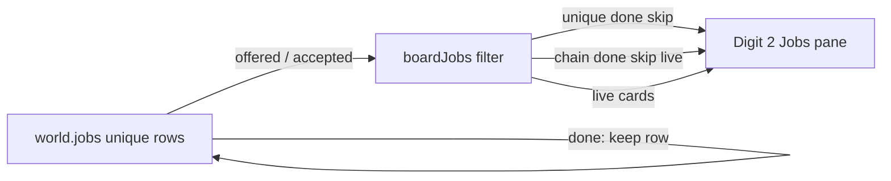

# RIMWARD MSN-03 remaining unique DONE rows

| Field | Value |
|---|---|
| **Title** | RIMWARD MSN-03 remaining unique DONE rows |
| **Author** | Wave 103 MSN-03 unique-DONE integrator |
| **Date** | 2026-08-23 |
| **Status** | Wave 104 PR1 hide landed; merge law still wins |
| **Wave** | 104 PR1 — unique DONE skip in `boardJobs`. Persist keep, uniqueRetry source, and boot pins stay as Wave 103 freeze. |
| **Owner request** | Unique DONE rows remain until a later serial. Chains already hide `kind === 'chain' && state === 'done'`. This leftover hides unique-four DONE on the Jobs board **without** deleting persist rows, **without** a memorial pane, **without** a new Digit, **without** HUD quest chrome, and **without** inventing UU / SKUs. |
| **Merge law** | [`out/w103/msn03/shared-contract.md`](../out/w103/msn03/shared-contract.md). If this brief and that file conflict, the contract wins. |
| **Honor** | Digit 2 Jobs. Digit 0 shipyard. Digit 8/9 stay. HUD-01 empty hub. No quest widget on aim glass. Digit 9 is Standing, not a quest log. No `innerHTML`. No new `WORLD_FIELDS` key. `state.js` READ-ONLY. Unique four already persist in `jobs`. Sentinel `state: 'done'` already exists. `uniqueJobId` stays `Object.hasOwn`. Do not drop unique four from persist. Do not reopen chain splice / dart-auto grants / family caps. HUD never writes `hullKind`. **Do not edit** those docs. Code wins. |

**Verifier record:**

| Note | Path |
|---|---|
| Inventory (code wins) | [`out/w103/msn03/current-msn03-unique-inventory.md`](../out/w103/msn03/current-msn03-unique-inventory.md) |
| Merge law | [`out/w103/msn03/shared-contract.md`](../out/w103/msn03/shared-contract.md) |
| Security review | [`out/w103/msn03/security-review.md`](../out/w103/msn03/security-review.md) |
| Design-doc review | [`out/w103/msn03/code-review.md`](../out/w103/msn03/code-review.md) |
| UI audit | [`out/w103/msn03/ui-audit.md`](../out/w103/msn03/ui-audit.md) |

Siblings HUD-03 alerts (`docs/Hud03AlertsDesign.md`), REP-05, TGT, BIO, NAV, SHP, HUD-02, `docs/Msn03ChainsDesign.md`, wishlist, `PROGRESS.md`, and `docs/OwnerDecisions*.md` are **other workers**. **Do not edit** those paths, `src/systems/station.js`, `src/game/save.js`, or `src/game/jobs-chains.js`. Those sibling files need not exist for this brief to stand.

---

## Overview

MSN-03 chains already hide finished chain cards (`boardJobs` skips `kind === 'chain' && state === 'done'`). The unique four still sit on every Jobs board after `completeJob` stamps `done`. Ace and patrol show a `DONE` line. Haul and ferry also show a live **uniqueRetry** Accept on DONE.

Persist already keeps those four rows so `ensureJobs` does not re-seed `makeJobs` while the array is non-empty. The leftover is **board clutter**, not a missing save key.

This brief is the integrator document for a **later** implementation wave. Wave 103 lands this markdown only. Bindings do not change here.

HUD-01 empty aim glass stays empty. No quest widget. `state.js` stays READ-ONLY. No new SKU. No new persist key. Digit 0 stays shipyard. Digit 2 stays Jobs. Digit 8/9 stay launch / Standing. Do not invent UU.

Wave 103 deputize (recorded here and in the contract; owner may override after playtest): hide unique DONE on Digit 2 the **same way** chain `done` is hidden; keep the persist row so they do not re-post; do not add a memorial pane; do not add a Digit. uniqueRetry becomes unreachable because the DONE card is off the board. Leave uniqueRetry source in place. Do not splice.

---

## Background & Motivation

### Current state (inventory)

Source of truth: [`out/w103/msn03/current-msn03-unique-inventory.md`](../out/w103/msn03/current-msn03-unique-inventory.md). Code wins over stale Wave 70/81 line numbers.

| Surface | Today | Cite |
|---|---|---|
| Unique map | four ids | `save.js` 152–157 |
| `uniqueJobId` | `Object.hasOwn` | `save.js` 289–291 |
| `JOB_STATES` | includes `done` | `save.js` 151 |
| Persist | `WORLD_FIELDS` `'jobs'` only | `save.js` 79 |
| Drop unique | never | `save.js` 806–831 |
| Seed | `makeJobs` / `ensureJobs` | `station.js` 2074–2112 |
| Complete | `done`; no splice | `station.js` 3707–3720 |
| Chain hide | skip chain `done` | `station.js` 3616 |
| Unique hide | **none** | `boardJobs` 3603–3628 |
| uniqueRetry | DONE haul/ferry Accept | `station.js` 5206–5208, 4687–4692 |
| Digit accept | `offered` only | `station.js` 6082–6084 |
| Digit 2 / 0 | Jobs / shipyard | `station.js` 185, 6023–6028 |
| `innerHTML` | **none** in `station.js` | grep 0 |
| `h()` | `textContent` | `station.js` 4350–4354 |
| Unique SKU | **none** on unique complete | vs `grantChainSku` 3481 |
| Chain SKU | dart/auto if `canSeat` | `jobs-chains.js` 27–33 |
| Empty hub | 80 px | `hud.css` 184–189 |
| HUD `hullKind` | read only | `hud.js` 80–87 |

Ace default bounty **2500**. Patrol **300** UU + Freehold **+5**. Ferry **350**. Haul seed reward **0** (dest quote). Do not invent replacements.

### Pain points

- Four finished unique cards ride every dock’s Jobs board. Chain DONE already hid; unique DONE did not.
- A naive later PR that **splices** unique DONE would empty the array after four completes and `ensureJobs` would **re-post** offered uniques.
- A naive later PR that **deletes** unique ids from persist would smash boot pins and the sanitize unique allowlist.
- uniqueRetry lets haul/ferry pay again from a DONE card (mouse only). Digit 1–9 cannot uniqueRetry. MsnMissionsDesign said one-shot; live code contradicts for those two ids.
- A memorial Digit or HUD quest log would steal Digit 9 Standing or HUD-01 empty hub.

### Why now (design) / why not now (code)

`docs/Msn03ChainsDesign.md` named this leftover. Inventory and merge law exist. Implementation waits for a later serial so hide-on-board lands against a frozen persist-keep contract instead of a drive-by splice. Sibling Wave 103 workers own other packs; this brief does **not** wait on their files. Do **not** write `src/` in Wave 103.

---

## Goals & Non-Goals

### Goals

1. Document live unique four, `uniqueJobId`, board hide vs chain hide, uniqueRetry, persist sanitize, Digit 2, and unique reward integers from **live code**.
2. Freeze hide unique `done` in `boardJobs` (exact four ids), persist-keep, no memorial, no new Digit.
3. Freeze uniqueRetry as a live leftover that hide makes unreachable without WAVE26/WAVE35 “fixes.”
4. Freeze XSS / proto ids / persist smash / Digit theft / `innerHTML` law.
5. Freeze a serial PR plan: `boardJobs` hide → boot pins. Named only.
6. This wave writes the brief. A later wave ships serially.

### Non-goals (locked — do not reopen)

- No impl in Wave 103. No `src/` edits. No `scripts/` / `public/` / `package.json` / Vite.
- No HUD-01 hub widget. No HUD-03 sibling edit. No Digit 9 quest log.
- No new `localStorage` key. Autosave stays `rimward-save-v1`.
- No `world.uniqueDone` / `world.memorial`. No new `WORLD_FIELDS`.
- No `state.js` write. No new SKU. No invented UU or standing deltas.
- Do not migrate or rename `bounty-ace` / `patrol-lane` / `haul-provisions` / `ferry-consignment`.
- Do not reopen chain step splice, last-step dart/auto grants, or renewable family caps.
- Do not drop unique four from persist. Hide ≠ delete.
- Do not “fix” WAVE4 fence, WAVE26 ferry/haul, or WAVE35 haul boot FAILs.
- Do not edit the wishlist, `PROGRESS.md`, sibling briefs, or `docs/OwnerDecisions*.md`. Do not write `docs/OwnerDecisionsWave103.md`.

---

## Proposed Design

### 1. Merge resolutions (contract wins)

| Question | Integrator freeze | Why |
|---|---|---|
| New persist key? | **No** | Unique four already in `jobs`. Contract §0.5 |
| Splice unique DONE? | **No** | `ensureJobs` reseeds empty arrays. Contract §0.6 |
| Hide unique DONE? | **Yes**, exact four ids | Mirror chain skip. Contract §1 |
| Memorial pane / Digit? | **No** | Digit 2/0/8/9 freeze. Contract §0.2 |
| uniqueRetry? | Unreachable after hide; source stays | Deputize. Contract §0.1, §4 |
| `innerHTML`? | **No** | Live `h()` is `textContent`. Contract §0.8 |
| SKU / UU? | Unique integers stay | Contract §0.9 |
| `state.js` | READ-ONLY | Contract §0.4 |
| UI | Jobs pane, Digit 2 only | Contract §3 |
| `uniqueJobId` | stays `Object.hasOwn` | Contract §0.7 |

### 2. Current board (do not break)

See inventory §§2–4. The load-bearing loop is:

1. `initStation` → `ensureJobs` → `makeJobs` if empty (unique four).
2. Each Jobs render: refresh ace, sync overlays / families / chains.
3. `boardJobs` hides foreign offered families/overlays and **chain done**. Unique DONE still flow out.
4. `completeJob` marks unique `done` and banks dockmaster trust. Overlay bounty also banks fence favor.
5. uniqueRetry paints Accept on DONE haul/ferry.

**This serial must not change step 1’s four ids, unique haul/ferry quote stamps, Wave 35 haul dest bind, overlay cap/ids, chain splice, or shipped family kinds.** Hide is additive in step 3.

Digit 2 and `DOCK_KEY_SERVICES` stay. Digit 0 stays shipyard. Digit 9 Standing stays.



### 3. Hide rule (later PR1)

In `boardJobs`, after or beside the chain skip (`station.js` 3616):

```
if (j.state === 'done' && (
  j.id === 'bounty-ace' || j.id === 'patrol-lane'
  || j.id === 'haul-provisions' || j.id === 'ferry-consignment'
)) continue;
```

Exact strings. No `in` operator. No user-string index into `UNIQUE_JOB_KIND` unless `uniqueJobId` is exported as `Object.hasOwn`.

Do **not** hide:

- unique `offered` / `accepted`
- overlay pirate / recovery
- renewable families
- live chain steps

### 4. Persist keep

Sanitize already refuses to drop `uniqueJobId` rows (`save.js` 806–831). Later impl **defaults to no `save.js` write**. Hide is UI filter only.

If a later owner deletes unique DONE from the array, `ensureJobs` reseeds offered uniques. That is why hide ≠ delete.

### 5. uniqueRetry (deputize)

Live contradiction: haul/ferry DONE still Accept (`station.js` 5206–5208). Ferry DONE accept resets persist (`4687–4692`). Ace/patrol do not retry.

Deputize: hide makes uniqueRetry unreachable. Leave the Accept branch in `renderJobs` (dead for hidden cards). Do not rewrite `acceptJob` this serial. WAVE26 assigns `state = 'offered'` before Digit 2, so quote tests still see Accept.

Owner may restore retry after playtest. Until then, unique four play as one-shot **on the board**, matching ace/patrol and MsnMissionsDesign one-shot copy.

### 6. UI

Stay inside `renderJobs`. No new Digit. No HUD glance. No Digit 9 unique log.

- Offered/accepted unique cards unchanged (quotes, ace hunt line, Accept).
- DONE unique cards vanish from `boardJobs`, so the `DONE` line (`station.js` 5303`) no longer paints for those four.
- No memorial list of finished unique titles.
- No empty-state string in first impl. Family sync still fills home docks. Header stays `JOBS BOARD — ${station} postings`.
- `reducedMotion`: no extra animation.
- Mouse Accept still works for offered cards past index 8. Digit 1–9 still offered-only.

### 7. Rewards / SKUs / standing

Do not invent. Live integers stay (inventory §3). Unique complete does not seat `dart` / `auto`. Wave 82 chain grants stay on chain last step only. Patrol still writes live Freehold **+5**. Do not copy that onto unique hide. Do not write `job.faction`.

### 8. Serial PR plan

Matches contract §6. **Named only. Do not implement in Wave 103.**

| PR | Lands | Does not land |
|---|---|---|
| **PR1 `boardJobs` hide** | unique four + `done` skip; chain hide stays | splice, persist delete, uniqueRetry rewrite, SKU, Digit, HUD, `state.js` |
| **PR2 boot pins** | unique four still in `world.jobs` when done; Digit 2 Jobs; Digit 0 shipyard; WAVE26/WAVE35 still pass; no `innerHTML`; no new `WORLD_FIELDS` | wishlist / PROGRESS / OwnerDecisions |

No `src/` scheduled this wave.

### 9. Coupling

| Neighbour | Coupling | Law |
|---|---|---|
| Chains | Shared `boardJobs` | Chain done hide stays. Do not reopen splice / grants |
| Families | Shared pane | Do not hide offered families. Caps stay |
| Overlay pirates | Same pane | Cap 2 stays |
| Unique ace / Named Guns | Same pane | Ids untouched; DONE hidden |
| EPICS / Digit 9 | Standing bag | No unique log there |
| Hangar | `grantChainSku` | Unique four do not grant |
| HUD-01 / HUD-03 | Glass | No quest widget |
| WAVE26 / WAVE35 | Boot pins | Do not “fix” |
| `save.js` unique map | Allowlist | `Object.hasOwn` stays |

---

## Regression risks

| Risk | Mitigation |
|---|---|
| Unique four vanish on restore | Do not splice; sanitize never drops `uniqueJobId` |
| `ensureJobs` re-posts offered uniques | Keep DONE rows in the array |
| WAVE26 Accept missing | Tests re-offer ferry before Digit 2 |
| WAVE35 dest bind broken | Do not touch haul complete |
| Chain done shows again | Do not edit the chain skip except to add unique skip beside it |
| Digit theft | Digit 2 Jobs / 0 shipyard freeze |
| XSS titles | `textContent` only |
| `__proto__` job id | Live token `RESERVED_IDS` |
| SKU mint on unique | Unique complete does not call `grantChainSku` |
| HUD hub quest | Forbidden |
| uniqueRetry still clickable | Hide removes the card |
| Cap smash | No cap change |

---

## Ownership

| Object | Writer | Reader |
|---|---|---|
| `ctx.world.jobs` unique rows | station `completeJob` / `makeJobs`; save sanitize | `boardJobs` |
| Board filter | later `boardJobs` | `renderJobs` |
| Chain rows | `jobs-chains.js` / station | `boardJobs` (done already hidden) |
| Digit 2 | `DOCK_KEY_SERVICES` | dock keydown |
| `state.js` | serial data owner only | **feature PRs read-only** |
| HUD hub | HUD-01 closed | **this serial does not write** |

`station.js` still must not touch `ctx.input` beyond the dock overlay.

---

## Acceptance direction (implementation wave)

1. After unique ace/patrol/haul/ferry `completeJob`, Digit 2 does **not** show those four cards. Persist still has the four ids with `state: 'done'`.
2. Restore does **not** re-offer unique four while those DONE rows exist.
3. Chain `done` stays hidden. Live chain steps still show.
4. Offered/accepted unique cards still show and still Accept.
5. Overlay pirate cap 2 and family 2-slot boards unchanged.
6. Digit 2 is Jobs. Digit 0 is shipyard. Digit 9 is Standing. No new Digit.
7. No `innerHTML`. No new `WORLD_FIELDS`. No unique dart/auto grant.
8. WAVE26 ferry/haul quote path still finds Accept after the test sets `state = 'offered'`.
9. `__proto__` job ids still drop. Unique four still keep.
10. HUD 80 px hub has no quest widget. HUD does not write `hullKind`.

---

## Open owner questions

Defaults in the contract **stand**. None of them block impl.

No blocking owner question. A later owner may restore uniqueRetry for haul/ferry, add a memorial line, or export `uniqueJobId` — until then, implement hide + persist-keep. Do not invent UU, a memorial Digit, or a persist key while waiting.

**Closed Wave 82 chain SKUs** stay on chains. Do not reopen here.

**Standing deputize:** Wave 100 rule. Picks live in contract §0.1. Do not write `docs/OwnerDecisionsWave103.md`.
