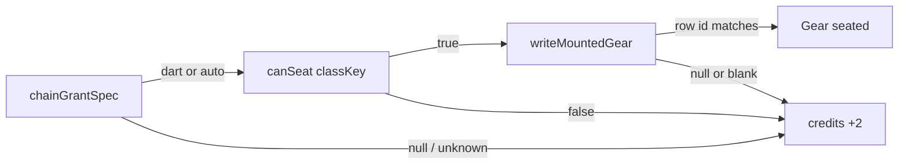

# RIMWARD MSN-03 remaining unique SKU grants

| Field | Value |
|---|---|
| **Title** | RIMWARD MSN-03 remaining unique SKU grants |
| **Author** | Wave 108 MSN-03 unique-SKU integrator |
| **Date** | 2026-08-24 |
| **Status** | first-impl Wave 109 |
| **Wave** | 109 — serial PR1–PR4. Veridian `auto`, Hollow `dart`, fail-closed +2 UU, Digit 2 hint. |
| **Owner request** | Remaining MSN-03 unique-equipment leftover: last-step grants for remaining employers. Live freeze already seats Freehold `dart` and Red Ledger `auto`. Veridian null; Hollow null (Wave 82 credits +2 only). Wishlist MSN-03: rare/unique equipment from authored faction chains, not the procedural pool. Chains shipped Wave 83. Unique DONE hide shipped Wave 104. Not a new Digit. Not a new persist key. |
| **Merge law** | [`out/w108/msn03sku/shared-contract.md`](../out/w108/msn03sku/shared-contract.md). If this brief and that file conflict, the contract wins. |
| **Honor** | HUD-01 empty hub. No quest widget. Digit 2 stays Jobs. Digit 0 shipyard. Digit 8/9 stay. `state.js` READ-ONLY later. No new class keys. No new Digit. No `innerHTML`. No new `WORLD_FIELDS` key unless inventory proves persist cannot hold the grant (it already can via hangar flat keys). Fail-closed: unknown employer → credits +2 only. `canSeat` false → credits +2 only. Do not mint a hull. Do not ignore `writeMountedGear`. BIO-02 kit mutate omit. BIO-05 graft closed. Do not grant graft / living hull / scanner / mining head. Do not reopen chain splice, unique four, family caps, dart/auto shop prices. HUD never writes `hullKind`. Gilded is not an employer. **Do not edit** sibling Msn/Bio/Rep/Shp/Hud/Owner docs or the wishlist. |

**Verifier record:**

| Note | Path |
|---|---|
| Inventory (code wins) | [`out/w108/msn03sku/current-msn03sku-inventory.md`](../out/w108/msn03sku/current-msn03sku-inventory.md) |
| Merge law | [`out/w108/msn03sku/shared-contract.md`](../out/w108/msn03sku/shared-contract.md) |
| Wave 109 probe | [`out/w109/msn03sku/probe.mjs`](../out/w109/msn03sku/probe.mjs) |
| Wave 109 notes | [`out/w109/msn03sku/notes.md`](../out/w109/msn03sku/notes.md) |
| Security review | [`out/w109/msn03sku/security-review.md`](../out/w109/msn03sku/security-review.md) |
| Code review | [`out/w109/msn03sku/code-review.md`](../out/w109/msn03sku/code-review.md) |
| UI audit | [`out/w109/msn03sku/ui-audit.md`](../out/w109/msn03sku/ui-audit.md) |

Siblings `docs/Msn03ChainsDesign.md`, `docs/Msn03UniqueDoneDesign.md`, `docs/Msn02*`, `docs/Bio*`, `docs/Rep*`, `docs/Shp*`, `docs/OwnerDecisions*`, wishlist, and `PROGRESS.md` are **other workers**. **Do not edit** those paths. Those sibling files need not exist for this brief to stand. Do **not** write `docs/OwnerDecisionsWave108.md`.

**This is not chain splice.** **This is not unique DONE hide.** **This is not a new SKU catalog row.** Wishlist MSN-03 still says unique equipment comes from authored faction chains.

---

## Overview

Four authored chains already run on Digit 2. Last step already pays `payQuoted` and employer standing +2. Freehold last-step seats `dart` when `canSeat`. Red Ledger last-step seats `auto` when `canSeat`. Veridian and Hollow last-step grant **null**. Wave 82 named those two SKUs and left the Combine and the Reach as credits-only because the owner had not named remaining grants.

Live catalog still has **two** player SKUs: `dart` (Dart rack) and `auto` (Auto turret). Hangar already persists launcher / ammo / turret on the mounted row. Light starters cannot seat either hardpoint. `grantChainSku` already fail-closes `canSeat` false to “no gear line.” It does **not** add 2 UU.

This leftover is **last-step grants for the remaining employers**. It is not a new Digit. It is not a new persist key. It is not unique-four complete. It does not mint a hull.

This brief is the integrator document for a **later** implementation wave. Wave 108 this worker lands markdown only. Bindings do not change here.

HUD-01 empty aim glass stays empty. No quest widget. `state.js` stays READ-ONLY. Digit 0 stays shipyard. Digit 2 stays Jobs. Digit 8/9 stay launch / Standing. Do not invent UU tables. Do not invent a third SKU id.

Wave 108 deputize (recorded here and in the contract; owner may override after playtest): Veridian seats `auto`; Hollow seats `dart`; `canSeat` false or unknown employer → **credits +2 UU**; write through `writeMountedGear`; verify the seated id; empty dart rack matches live Freehold (no `missileAmmo` in the grant patch).

---

## Background & Motivation

### Current state (inventory)

Source of truth: [`out/w108/msn03sku/current-msn03sku-inventory.md`](../out/w108/msn03sku/current-msn03sku-inventory.md). Code wins over stale Wave 81 line numbers.

| Surface | Today | Cite |
|---|---|---|
| Employers | four: freehold redledger veridian hollow | `jobs-chains.js` 9 |
| Gilded | **not** an employer | `jobs-chains.js` 9 vs `state.js` 600 |
| `CHAIN_GRANT` | dart / auto / **null** / **null** | `jobs-chains.js` 28–33 |
| `chainGrantSpec` | `Object.hasOwn`; may return `null` | `jobs-chains.js` 79–82 |
| Last-step | `finishChainStep` → `grantChainSku` | `station.js` 3494–3526 |
| Fail UU | **none** | grep `credits += 2` 0 |
| Write verify | **none** | `station.js` 3499–3502 |
| Dart grant patch | `{ launcher: spec.id }` no ammo | `station.js` 3499 |
| Shop dart | `{ launcher, missileAmmo: ammoMax }` cost 6500 | `station.js` 1775–1779; `weapon-fit.js` 37–39 |
| Shop auto | `{ turret }` cost 4200 | `station.js` 1822; `weapon-fit.js` 49 |
| `canSeat` light | missile 0 turret 0 | `state.js` 67; `weapon-fit.js` 56–61 |
| Persist | hangar + launcher / missileAmmo / turret | `save.js` 94–96 |
| Unique four SKU | **none** | unique complete ≠ `grantChainSku` |
| Unique DONE hide | **live** | `station.js` 3631–3634 |
| Chain done hide | **live** | `station.js` 3629 |
| Digit 2 / 0 / 8 / 9 | Jobs / shipyard / launch / Standing | `station.js` 188, 5904, 6039–6046 |
| Empty hub | 80 px + RANGE | `hud.css` 184–193; `hud.js` 709–712 |
| HUD `hullKind` | read only | `hud.js` 86–87 |
| `innerHTML` | **none** in `station.js` | grep 0 |
| Last-step Jobs copy | UU only; no catalog name | `station.js` 5208–5215 |

Live SKU ids: **`dart`**, **`auto`**. Reuse is true. A third id would impersonate the owner.

### Pain points

- Two of four authored chains pay paper UU and standing, then give **no** unique kit. Wishlist MSN-03 asked for equipment from those chains.
- A naive later PR that invents `veridian-lance` / `hollow-seeker` would smash SHP-03 catalog freeze and shop Digit 8/9 papers.
- A naive later PR that seats dart/auto on **light** without `canSeat` would no-op or need a hull mint (SHP closed).
- A naive later PR that copies shop **6500 / 4200** onto last-step pay would steal outfitter prices.
- A naive later PR that writes `world.chainSku` would add a persist key hangar already holds.
- A naive later PR that grants scanner / mining / graft would reopen BIO-02 / BIO-05 / Digit 0.
- A memorial Digit or HUD quest pip would steal Digit 9 or HUD-01.
- Wave 82 “credits +2” is **not** live. Light Freehold last-step today is silent fail besides `payQuoted`.
- Live `grantChainSku` can emit `Gear seated.` after a blank write.

### Why now (design) / why not now (code)

The owner asked for the remaining unique-SKU leftover so later serials can name Veridian/Hollow without a new Digit, without a new persist key, and without a third SKU id. Inventory shows two live ids, two null grants, hangar mirrors already on `WORLD_FIELDS`, and `canSeat` already protecting light starters. Merge law can exist without touching `src/`. Implementation waits so SKU injection, Digit theft, `state.js` writes, hull mint, and shop-price steal are frozen before the first `CHAIN_GRANT` row changes. Wave 108 this worker does not ship `src/`.

---

## Goals & Non-Goals

### Goals

1. Document live `CHAIN_GRANT`, `chainGrantSpec`, `grantChainSku`, seating, hangar persist, Digit 2, and dart/auto catalog from **live code**.
2. Freeze remaining employers: named last-step **or** explicit keep-credits-only. Deputize: Veridian `auto`, Hollow `dart`.
3. Freeze fail-closed credits **+2 UU** when spec null, unknown employer, `canSeat` false, or write blank. Do not mint a hull. Do not ignore `writeMountedGear`.
4. Freeze no third SKU id. Shop costs stay shop costs. Dart grant patch matches live Freehold (no ammo fill in remaining-only).
5. Freeze no new persist key, no new Digit, no `state.js` write, no `innerHTML`, no HUD hub child.
6. Freeze BIO-02 / BIO-05 omit: no graft / living hull / scanner / mining head.
7. Freeze unique four and chain splice closed. Unique complete still does not call `grantChainSku`.
8. Freeze a serial PR plan. This wave writes the brief. A later wave ships serially. First remaining serial does not steal Digit 0/8/9 and does not write `state.js`.

### Non-goals (locked — do not reopen)

- No `src/` or live bindings in this worker.
- No new launcher/turret id. No UU price table. No standing delta change (`MINING_REP` stays 2).
- No Gilded chain. No fifth `EMPLOYER_KEYS` row.
- No chain step splice change. No unique four hide/reseed change. No family cap change.
- No dart/auto **shop** price change. No Digit 8/9 papers rewrite except Jobs copy in PR3.
- No `world.chains`. No `world.chainSku`. No new `WORLD_FIELDS`.
- No HUD-01 hub widget. No Digit 9 quest log. No memorial pane.
- No hull mint. No remount-on-grant. No `SHIP_CLASSES` extra fields.
- Do not grant graft / scanner / mining / concealed / cargo racks.
- Do not call `grantChainSku` from unique complete.
- Do not fill Freehold dart ammo in a remaining-only patch.
- Do not edit the wishlist, `PROGRESS.md`, sibling briefs, or `docs/OwnerDecisions*.md`.
- Do not write `docs/OwnerDecisionsWave108.md`.
- Do not fix known boot FAILs.

---

## Proposed Design

### 1. Merge resolutions (contract wins)

| Question | Integrator freeze | Why |
|---|---|---|
| New persist key? | **No** | Hangar + launcher/turret mirrors. Contract §0.7 |
| `state.js` write? | **No** | Contract §0.6 |
| Third SKU id? | **No** | Reuse is true. Contract §0.12 |
| Veridian last-step? | **`auto`** when `canSeat` | Deputize. Contract §0.1 |
| Hollow last-step? | **`dart`** when `canSeat` | Deputize. Contract §0.1 |
| Keep-credits-only both? | **No** — seating does not smash light | `MOUNT_TABLE` light 0/0. Contract §0.1 |
| Fail-closed UU? | **+2** when grant false | Wave 82 words. Contract §0.1, §0.9 |
| Shop cost as pay? | **Forbidden** | Contract §0.11 |
| Hull mint? | **Forbidden** | Contract §0.9 |
| `innerHTML`? | **No** | Contract §0.4 |
| UI | Jobs pane, Digit 2 only | Contract §0.3, §0.1 copy |
| Gilded employer? | **No** | Contract §0.13 |
| Unique four grant? | **No** | Contract §0.11 |

### 2. Current last-step (do not break)

See inventory §§1–2. The load-bearing loop is:

1. `syncChainJobs` posts step 1 at authored origin when standing gate holds.
2. Accept stamps origin `payQuoted` from `PATROL_REWARD` 300.
3. Steps 1–2: file/dock, standing +2, splice, push next.
4. Step 3: pay `payQuoted`, `grantChainSku`, `completeJob` done, hide on board.

**This serial must not change steps 1–3’s ids, splice, standing, unique four, family caps, or shop prices.** Remaining grants are additive: fill two `null` rows; fail-closed +2 UU; verify write; Jobs hint line.

Digit 2 and `DOCK_KEY_SERVICES` stay. Digit 0 stays shipyard. Digit 9 Standing stays.



### 3. Remaining grants (later PR1)

In `CHAIN_GRANT` (`jobs-chains.js` 28–33), replace Veridian/Hollow **null** with the deputize freeze:

```
veridian: Object.freeze({ id: 'auto', seat: 'turret', slot: 'turret' }),
hollow: Object.freeze({ id: 'dart', seat: 'missile', slot: 'launcher' }),
```

Keep Freehold `dart` and Red Ledger `auto`. Do not add `gilded`. `chainGrantSpec` stays `Object.hasOwn`. Unknown key still returns **null**.

Why these SKUs (deputize; owner may swap after playtest):

- Catalog has two ids. Wishlist wants kit from **each** authored chain, not a silent Combine/Reach.
- Veridian dest2 is Freehold (already `dart`). Combine identity is hulks/refinery/audited pay (`state.js` 828–841). **Auto turret** is the other live kit.
- Hollow dest2 is Redmarch (already `auto`). Reach identity is Quiet Beacon / rim hush (`state.js` 843–856). **Dart rack** is the other live kit.
- Light starters: `canSeat` false → +2 UU. No hull smash. Combat remounts (heavy/ace/frigate) receive kit.

Keep-credits-only would be the pick **only** if seating smashed light starters. Inventory proves it does not.

### 4. Fail-closed +2 UU (later PR2)

Wave 82 said “credits +2 only.” Live code does not add 2 UU. Later last-step:

- `grantChainSku` returns boolean only. It does **not** write credits.
- `finishChainStep` last-step (`parsed.step === 3` only): if grant false → `ctx.world.credits += 2` when credits is a finite number.
- Unparsed / proto chain ids already splice with **no** pay (`station.js` 4197–4201). Do not add +2 UU there.
- Integer **2**. Not shop cost. Not a second `MINING_REP` write (standing +2 already ran).
- Do not add +2 when grant **succeeds**.
- After `writeMountedGear`, verify seated id. Blank write is a fail, not `Gear seated.`

This apply to **all four** employers in the same function. Light Freehold last-step then gets the named consolation. That is the Wave 82 else-clause. It is not a Digit steal.

### 5. Persist

Sanitize already heals hangar launcher/turret. Later impl **defaults to no `save.js` write**. Grant is a hangar field write at complete time, then existing autosave.

If a later owner adds `world.chainGranted`, that is a new `WORLD_FIELDS` key this contract **forbids**.

### 6. UI (Jobs pane only)

Stay inside `renderJobs`. No new Digit. No HUD glance. No Digit 9 SKU log. No hub child.

- Offered/accepted chain cards keep UU quote from live lines (`station.js` 5208–5215).
- Last-step with non-null spec: one extra `textContent` line. Catalog **name** only (`Dart rack` / `Auto turret`). Never print 6500 or 4200.
- Hint must say the hull may refuse: `if this hull has a hardpoint.`
- `commLine`: keep `Gear seated.` on success; fail suffix ` Compact thanks +2 UU.`
- No memorial list of finished grants.
- `reducedMotion`: no extra animation.
- Mouse Accept still works past index 8. Digit 1–9 still offered-only.

### 7. Rewards / SKUs / standing

| Knob | Law |
|---|---|
| Last-step UU | live `payQuoted` |
| Employer standing | live +2 |
| Target standing | 0 |
| Shop dart/auto | 6500 / 4200 **unchanged** |
| Consolation | +2 UU iff grant false |
| Unique four rewards | live integers; no SKU |

Do not invent kill UU, spy expose, or war target-rep.

### 8. Serial PR plan

Matches contract §3. **Named only. Do not implement in Wave 108.**

| PR | Lands | Does not land |
|---|---|---|
| **PR1 `CHAIN_GRANT`** | Veridian `auto`; Hollow `dart`; Freehold/Ledger keep | `state.js`; Digit 0/8/9; UI; shop prices |
| **PR2 grant + fail UU** | `canSeat`; `writeMountedGear`; verify; +2 UU; commLine | hull mint; graft/scanner/mining; unique four |
| **PR3 Digit 2 copy** | catalog name hint; `textContent` | HUD; Digit 9; `innerHTML`; shop cost on card |
| **PR4 boot pins** | light +2; seated heavy/ace/frigate; proto drop; unique four still no grant | WAVE26/WAVE35; Digit 0 |

PR1 is the first remaining serial. Home: `src/game/jobs-chains.js`. Must not steal Digit 0/8/9. Must not write `state.js`.

---

## Security (later impl)

See [`out/w108/msn03sku/security-review.md`](../out/w108/msn03sku/security-review.md). Non-negotiable:

- Employer from `parseChainId` allowlist only. No `job.faction` / `job.sku` write source.
- SKU id from frozen `CHAIN_GRANT`, then `isLauncherId` / `isTurretId`.
- `writeMountedGear` patch: only `launcher` or only `turret`.
- No `innerHTML`. No proto ids. No stuffed launcher fields from the blob.
- Credits +2 uses integer 2, not a blob cost.

---

## Acceptance (later impl)

1. Veridian step 3 on a hull with turret hardpoint seats `auto`. Light starter does not. Light starter gains **2** UU extra.
2. Hollow step 3 on a hull with missile hardpoint seats `dart` (empty rack, live Freehold shape). Light starter does not; +2 UU extra.
3. Freehold/Ledger grants unchanged. Shop prices unchanged.
4. Unique four complete still does not seat gear.
5. Digit 2 only. Digit 0/8/9 untouched. Empty hub untouched. `git` later: no `state.js` write in PR1.
6. `chain-__proto__-1` still sanitizes out. Unknown employer does not mint hull.

---

## Risks

- Empty Hollow dart rack feels unfinished vs shop fill. Accept: match live Freehold. Owner may later fill `ammoMax` for **every** dart grant.
- Two factions share each SKU. Accept: catalog has two ids. Do not invent a third.
- +2 UU is small vs 300 paper pay. Accept: Wave 82 consolation, not a second bounty.
- Owner may want both remaining credits-only after playtest. Contract allows revert. Do not park now.

---

## Open questions (owner after playtest — do not block)

1. Swap Veridian/Hollow SKUs?
2. Fill `ammoMax` 8 on **all** dart grants including Freehold?
3. Revert Veridian/Hollow to credits-only?

Until then, implement the deputize freeze. Do not park.
