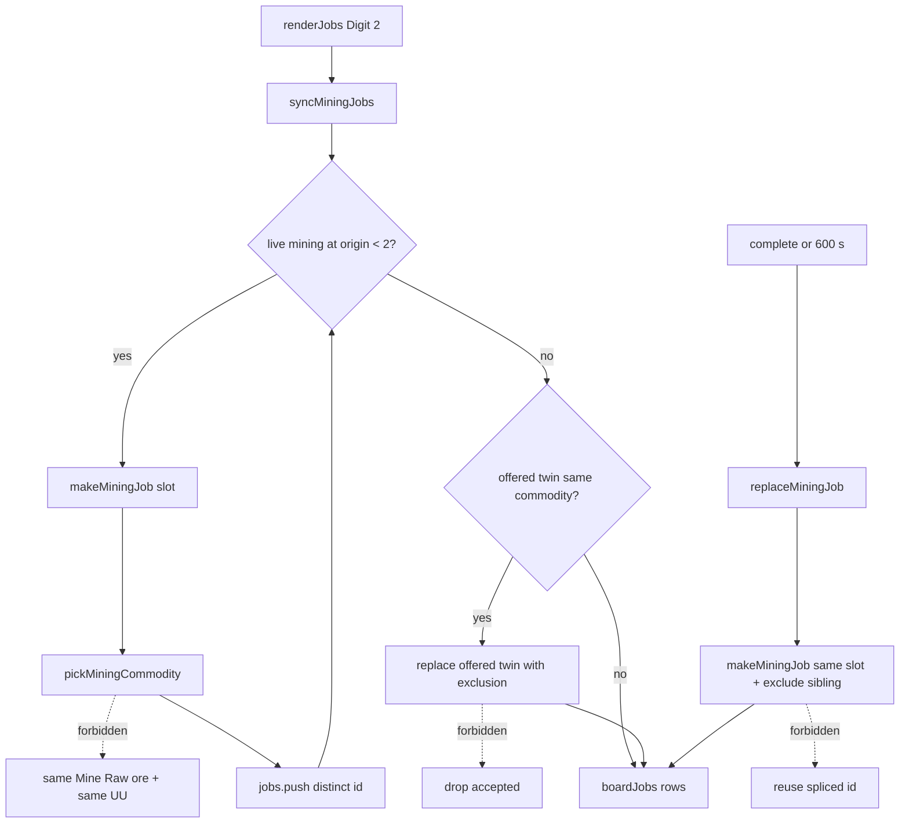

# RIMWARD Msn04 job-posting identity

| Field | Value |
|---|---|
| **Title** | RIMWARD Msn04 job-posting identity |
| **Author** | Wave 130 Msn04 leftover integrator |
| **Date** | 2026-08-26 |
| **Status** | Wave 130 leftover integrator. Named serial **PR1**. Merge law: shared-contract.md wins. |
| **Wave** | 130 — leftover census + merge law. KeyH/J/L/M/P stay. Digit 2 stays Jobs. |
| **Owner request** | Inbox P2 MSN leftover: Deduplicate procedural job postings. Census live mining two-slot fill. Code wins. If the live board already forbids two offered mining (or other renewable) cards with the same player-visible identity (commodity + need + reward + origin) at once, freeze leftover **CONSUME** and named serial **none**. Census: **not** live. Freeze leftover **REAL** and name later serial **PR1**. Unique-four replacement is **not** this pack. Ore-scanner guidance is **not** this pack. |
| **Merge law** | [`out/w130/jobdedup/shared-contract.md`](../out/w130/jobdedup/shared-contract.md). If this document and that file conflict, **the contract wins**. |
| **Honor** | HUD-01 empty 80 px hub. Aim-glass gauges stay off. Kit mutate omit. Digit 0/8/9 stay station. Digit 2 stays Jobs. No new Digit. KeyH hail, KeyJ dock/jump, KeyL berth, KeyM chart, KeyP pause stay. Do not remap. `innerHTML` forbidden later. Jobs rows stay `textContent`. `state.js` READ-ONLY. Default persist **none**. No UU. No SKU. No new WORLD_FIELDS. Overlay mutex CTL-02: hail/chart/berth exclusive; hail/chart/berth **never** write `flags.paused` — **cite only**. Do not retune mining pay. Do not hide unique four. Do not merge ids. Do not add ore-scanner filter (inbox P2 MSN/AST). Do not steal AST-02. Do not steal NAV-10 or TGT-07. Agent API must not become a job-accept cheat. Fail closed: unknown commodity does not throw; sanitize still caps length. Do not “fix” known REDMARCH `castMatches` flake. |

**Verifier record:**

| Note | Path |
|---|---|
| Inventory (code wins; Wave 130 census) | [`out/w130/jobdedup/current-msn04-job-dedup-inventory.md`](../out/w130/jobdedup/current-msn04-job-dedup-inventory.md) |
| Merge law | [`out/w130/jobdedup/shared-contract.md`](../out/w130/jobdedup/shared-contract.md) |
| Wave 130 security review | [`out/w130/jobdedup/security-review.md`](../out/w130/jobdedup/security-review.md) |
| Wave 130 design-doc review | [`out/w130/jobdedup/code-review.md`](../out/w130/jobdedup/code-review.md) |
| Wave 130 UI audit | [`out/w130/jobdedup/ui-audit.md`](../out/w130/jobdedup/ui-audit.md) |
| Wave 130 notes | [`out/w130/jobdedup/notes.md`](../out/w130/jobdedup/notes.md) |

Siblings MSN-01 mining, MSN-02 families, Msn03 unique-done / unique-SKU / chains, Agent API, NAV-10, TGT-07, inbox MSN/AST ore guidance, wishlist, and `PROGRESS.md` are **other workers**. **Do not edit** those paths. **Do not** write `src/`. **Do not** steal sibling Wave 130 paths. **Do not** write `out/w130/jobdedup/verify/**`.

**This is not mining ore-type guidance.** **This is not AST-02.** **This is not unique-four replacement.** **This is not NAV-10.** **This is not TGT-07.** Wishlist job-board twins is **INBOX**. Census still finds **independent mining picks**.

---

## Overview

Inbox source (`docs/PLAYER-EXPERIENCE-WISHLIST.md` Playtest capture 2026-08-25 second pass — **184–186** — **cite, do not edit**):

> INBOX (P2, MSN): Deduplicate procedural job postings. The Freehold board showed two identical "Mine Raw ore, 784 UU" postings as jobs 8 and 9. MSN-01 covers replacement of completed jobs, not duplicate generation.

MSN-01 (`docs/MsnMissionsDesign.md`) already splices a completed mining card and posts a replacement. That path is **live**. The inbox hole is **duplicate generation**: two live cards that the player cannot tell apart.

Wave 130 this worker lands markdown only. Bindings do not change here.

Census (code wins): Mining uses two slots per system (`station.js` **225**). `pickMiningCommodity` rolls `MINING_ORE_KEYS` independently (**2238–2242**). Live table is **two** hardness-1 keys: `rawOre` and `livingRock`. `syncMiningJobs` fills by **count**, not commodity (**2293–2314**). `nextMiningId` only uniquifies `mine-<sys>-<n>` (**2244–2263**). Jobs pane Digit 2 paints `Mine ${oreName}` and `pays ${est} UU` (**5150–5156**, **5242–5251**). Book raw ore **140** × need **4** × margin **1.4** = **784** UU. Sanitize extra-mining is same origin+**slot**, not same commodity (`save.js` **606–635**). Leftover is **REAL**.

This leftover is a **named mining identity uniqueness**: slot 1 must not copy slot 0’s live commodity (offered or accepted). It is not a scanner. It is not unique-four work. It is not a pay retune.

This document is the integrator for a **later** implementation wave.

HUD-01 empty aim glass stays empty. `state.js` stays READ-ONLY. No new persist key. Digit 0/8/9 stay. Digit 2 stays Jobs. KeyH/J/L/M/P stay. Do not invent UU. Do not steal NAV-10 or TGT-07.

Wave 130 deputize (recorded here and in the contract; owner may override after playtest): when filling slot 1, exclude the other live mining commodity at that origin; omit the second card if the ore table is too small; heal offered twins on sync; do not merge ids; do not hide unique four; do not change pay; PR1 mining-only.

If census had proved two offered mining cards could not share commodity+need+reward+origin, this pack would freeze **CONSUME** and name serial **none**. Census did not. That CONSUME path is unexpected.

---

## Background & Motivation

### Current state (inventory)

Source of truth: [`out/w130/jobdedup/current-msn04-job-dedup-inventory.md`](../out/w130/jobdedup/current-msn04-job-dedup-inventory.md). Code wins.

| Surface | Today | Cite |
|---|---|---|
| Mining slots | 2 per system | `station.js` **225** |
| Ore table | `rawOre`, `livingRock` | **249–252**; `state.js` **387–409** |
| Pick | independent `Math.random` | `station.js` **2238–2242** |
| Id | `mine-<sys>-<n>` monotonic | **2244–2263** |
| Fill | count to 2; slot 0 then 1 | **2293–2314** |
| Replace | splice + new card same slot | **2332–2343**, **3932–3977** |
| Need / margin | 4 / 1.4 | **210**, **204** |
| Raw ore 784 UU | `4 * 140 * 1.4` | `state.js` **354** |
| Digit 2 Jobs | `DOCK_KEY_SERVICES[1]` | `station.js` **188**, **6169–6176** |
| Row paint | `h()` `textContent`; `i + 1` | **4464–4468**, **5214** |
| Sanitize extra | same origin+slot | `save.js` **606–635** |
| Unique four | four fixed ids; `ensureJobs` empty only | `station.js` **2098–2136** |
| Agent accept | unknown | `agent-api.js` **150** |

The player who opens Jobs at Freehold can see two rows `8. Mine Raw ore` and `9. Mine Raw ore` with the same 784 UU. Ids differ. Copy does not.

### Pain points

- Twin mining rows impersonate one contract. Digit accept on 8 vs 9 is a coin flip with the same payload.
- Player can accept **both** and double the same ore delivery (two `need` 4 / two `payQuoted`). That is a pay-duplication hole adjacent to the UI hole.
- MSN-01 replacement does not exclude the remaining live commodity, so expire/complete can mint a twin of the surviving slot.
- Sanitize will **persist** the twins (different ids, different slots).
- A naive later PR that merges ids **breaks** accept/replace and Digit index.
- A naive later PR that hides unique four **steals** Msn03 / boot pins.
- A naive later PR that retunes 784 UU **steals** the pay formula.
- A naive later PR that adds an ore filter on the scanner **steals** inbox P2 MSN/AST.
- A naive later PR that `innerHTML`s ore names is XSS.
- A naive later PR that adds Agent `acceptJob` **cheats** the dock Digit path.
- Trade / passenger / explore can also twin; widening PR1 without playtest **steals** optional PR2s.

### Why now (design) / why not now (code)

The owner asked for the Msn04 leftover integrator so a later serial can stop identical mining rows **before** the first `station.js` pick rewrite. Inventory shows independent rolls and count-based fill. Merge law can exist without touching `src/`. Implementation waits so pay retune, unique-four theft, scanner theft, Agent cheat, persist flags, and family-wide rewrites are frozen before the first exclusion set. Wave 130 this worker does not ship `src/`.

If census had proved identity uniqueness already live, this pack would freeze **CONSUME** and name serial **none**. Census did not.

---

## Goals & Non-Goals

### Goals

1. Document live mining pick, two-slot fill, replace, Digit 2 paint, sanitize extras, and other-family twin risk from **live code**.
2. Freeze leftover = **mining identity uniqueness**. Not scanner. Not unique-four. Not AST-02.
3. Freeze deputize: exclude sibling live commodity; omit if table too small; offered-twin heal; mining-only PR1. Owner may override after playtest. Do not park.
4. Freeze persist: **none** new. `state.js` READ-ONLY. No UU. No SKU. No new Digit.
5. Freeze HUD-01 empty hub. Digit 0/8/9 stay. Digit 2 stays Jobs. KeyH/J/L/M/P stay.
6. Freeze later copy via `textContent`. `innerHTML` forbidden.
7. Freeze a serial PR plan. This wave writes the document. A later wave ships serially.

### Non-goals (locked — do not reopen)

- No `src/` or live bindings in this worker.
- No `flags.paused` write.
- No ore-scanner filter / lock-card ore marker (inbox P2 MSN/AST).
- No AST-02 rich-region find.
- No unique-four replacement or `DONE` splice (Msn03).
- No mining pay / need / deadline retune.
- No `state.js` write. No WORLD_FIELDS. No new Digit.
- No Agent job-accept pulse. Do not edit `docs/AgentApiDesign.md`.
- No NAV-10. No TGT-07. No HUD layout. No overlay-policy rewrite.
- Do not edit the wishlist, `PROGRESS.md`, `docs/Msn0*.md` siblings, OwnerDecisions*.
- Do not write `out/w130/jobdedup/verify/**`.
- Do not fix REDMARCH `castMatches`.
- Do not steal sibling Wave 130 packs.
- Do not require trade/passenger/explore dedup in PR1.

---

## Proposed Design

### 1. Merge resolutions (contract wins)

| Question | Integrator freeze | Why |
|---|---|---|
| Leftover real? | **Yes** | Inventory §9 |
| CONSUME? | **No**. Serial is **not** none | Census independent pick + count fill |
| New persist key? | **No** | Contract §0.5 |
| `state.js` write? | **No** | Contract §0.5 |
| Change pay formula? | **No** | Honor |
| Merge mining ids? | **No** | Contract §0.19 |
| Hide unique four? | **No** | MSN-01 / boot pins |
| Ore scanner? | **No** | Other inbox item |
| PR1 family? | **Mining only** | Playtest hole |
| Omit second card if table size 1? | **Yes** | Fail closed |
| Agent `acceptJob`? | **No** | Contract §0.10 |
| Named PR1? | **PR1** mining identity | REAL leftover |

### 2. Current mint motion (do not break MSN-01 / unique four / Digit 2)

Wave 71 mining slots stay 2. `ensureJobs` still seeds unique four only when the array is empty. `renderJobs` still syncs all families then paints `boardJobs`. Complete/expire still `replaceMiningJob`. Digit 2 still opens Jobs. Digit n still accepts `boardJobs[n-1]`.

### 3. Deputize table (copy of contract §0.1)

Owner may override after playtest. Do not park.

| Knob | Value |
|---|---|
| Identity | commodity at origin (need and pay follow) |
| Slot 1 | exclude slot 0 live commodity (offered or accepted) |
| Exhausted table | omit card |
| Existing offered twins | remint offered (prefer slot 1) on sync |
| Accepted twins | leave until complete/expire |
| Ids | monotonic `nextMiningId`; never merge |
| Pay | unchanged |
| Families | mining only in PR1 |
| Persist | none new |
| Fail-closed | never throw; omit rather than twin |

### 4. Neighbours

| Module | This leftover does | This leftover does not |
|---|---|---|
| `station.js` mining helpers | later PR1: exclude/omit/heal offered twins | unique four; trade/passenger/explore in PR1; Digit map; pay |
| `save.js` | **none** required (cap stays) | WORLD_FIELDS; extra-commodity drop that can eat accepted |
| `state.js` | none | write `ORE_TYPES` / prices |
| `agent-api.js` | **none** | `act` accept cheat |
| `overlay-policy.js` | **cite only** | pause write |
| `hud.js` | **none** | hub / gauges / toast flood |
| `combat.js` / `asteroids.js` | **none** | ore filter / AST-02 |
| `controls.js` | **none** | remap KeyH/J/L/M/P |

### 5. Serial PR plan

Matches contract §3. **Named only. Do not implement in Wave 130.**

| PR | Lands | Does not land |
|---|---|---|
| **PR1** mining identity | exclude used commodity; omit if exhausted; offered-twin heal; replace path; fail-closed | pay retune; unique four; scanner; other families; Agent; persist; Digit; `innerHTML`; `state.js` |
| **PR2 other families (optional skip)** | trade / passenger / explore if owner asks | required with PR1 |
| **PR3 stills (optional skip)** | two distinct mining rows | required with PR1 |

First remaining serial is **PR1**. It must not steal Digit 0/8/9. It must not write `state.js`. It must not claim `agent-api.js`. Do not land scanner guidance as required PR1.

### 6. Picture

Reuse the live Jobs pane. No new Digit. No hub pip. A player who opens Jobs at Freehold sees at most one `Mine Raw ore` among the two mining slots. The other slot is `Mine Living rock` (live table) or is **absent** if the table cannot supply a second key. Completing one card posts a replacement that is not a copy of the remaining live commodity. Nothing merges ids. Unique four stay. Pause is still P.

---

## Player outcome (later serial; freeze here)

You dock Freehold. You tap Digit 2. You see two mining rows. They do **not** share the same ore name and the same UU. Jobs 8 and 9 (or wherever `boardJobs` lands them) are distinguishable in text.

If the ore table later shrinks to one legal key, you see **one** mining card, not two identical cards.

You accept the Raw ore card. The other live mining card is not Raw ore. When the Raw ore card completes, the replacement is not Raw ore while Living rock is still live.

You do **not** get a scanner ore filter. You do **not** lose the unique four. Pay math is the same.

**MSN/AST ore guidance** is **not** this work. **AST-02** is **not** this work. **NAV-10** is **not** this work. **TGT-07** is **not** this work. **Agent API** is **not** this work.

---

## Security

See [`out/w130/jobdedup/security-review.md`](../out/w130/jobdedup/security-review.md).

- XSS: no `innerHTML` for title / ore name / UU. `textContent` only.
- Pay duplication: two identical offered mining cards can both be accepted today; PR1 identity uniqueness closes the mint. Do not add a second pay path.
- Persist: no new key. Sanitize still caps length. Do not drop accepted jobs to heal twins.
- Prototype ids: keep hyphen-token allowlist. Never assign `jobs[__proto__]`.
- Agent: no off-desk `acceptJob`.
- Fail-closed: never throw on unknown commodity; omit rather than infinite reroll.

---

## Acceptance direction (implementation wave)

1. Two live mining cards at one origin never share `commodity` after `syncMiningJobs` / `replaceMiningJob`, except two **accepted** same-commodity cards already in flight (leave them).
2. First paint at an empty origin: slot 0 any legal ore; slot 1 a **different** legal ore, or omitted.
3. Offered twin already in the array: next Jobs render remints the offered twin (prefer slot 1).
4. Unique four still present. Digit 2 still Jobs. Digit n still accepts by board index.
5. Pay formula unchanged. 784 UU may still appear on **one** Raw ore card when prices match book.
6. No new `WORLD_FIELDS`. No `innerHTML`. No `controls.js`. No Agent cheat accept. No scanner filter. No AST-02. No unique-four splice.
7. Unknown commodity does not throw. Sanitize cap unchanged.
8. REDMARCH `castMatches` untouched.

---

## Alternatives considered

| Alternative | Why not |
|---|---|
| Freeze CONSUME / serial none | Census: independent pick **live**; twins expected at table size 2 |
| Merge two slots into one id | Breaks replace, Digit index, persist tokens |
| Hide unique four to make room | Boot pins / Msn03 steal |
| Change pay so twins “look different” | Inbox asked generation uniqueness, not a fake UU |
| Ore scanner / field marker | Other inbox item (P2 MSN/AST) |
| Sanitize-drop extra commodity | Can delete honest offered/accepted if written badly; cap path is length, not identity |
| Dedup all families in PR1 | Playtest hole is mining; passenger twins are authored; optional PR2 |
| Force two cards when table size 1 | Recreates the inbox hole |
| Agent accept | Dock/Digit cheat |
| Persist “no twins” flag | Hostile god-mode board mute |
| New Digit | Digit map / HUD-01 |
| `innerHTML` ore name | XSS |

---

## Regression risks

| Risk | Mitigation |
|---|---|
| Infinite reroll | bounded attempts; then omit |
| Empty board mining | omit is legal; cap 2 is max not min when table exhausted |
| Unique four missing | do not touch `makeJobs` / `uniqueFourId` |
| Pay change | do not edit `miningPayBase` / `HAUL_MARGIN` / prices |
| Double pay on complete | keep live `state = 'failed'` first (`station.js` **3960–3961**) |
| Sanitize shrink | do not rewrite cap; do not drop accepted |
| Twin heal drops accepted | heal **offered** only |
| Agent cheat | do not claim agent-api |
| XSS name | `textContent` / `h()` |
| Digit 0/8/9 | no new Digit; Digit 2 stays Jobs |
| Scanner scope creep | other inbox item |
| REDMARCH boot flake | do not “fix” |

---

## Ownership

| Object | Writer | Reader |
|---|---|---|
| Mining pick / fill / replace | later PR1 `station.js` mining helpers | Jobs pane |
| Jobs row paint | live `renderJobs` `h()` (unchanged channel) | player |
| Unique four | **none** (`makeJobs` live) | player |
| `world.jobs` sanitize | **none** required | save restore |
| `flags.paused` | **none** (KeyP) | overlay-policy |
| `controls.js` | **none** | — |
| `agent-api.js` | **none** | — |
| `state.js` | **none** | `COMMODITIES` / `ORE_TYPES` read |
| Scanner / asteroids | **none** (MSN/AST inbox) | — |
| HUD layout | **none** (HUD-01) | — |

---

## Open owner questions (non-blocking)

1. Should optional PR2 cover **passenger** (always-identical authored twins) or leave them as two seats on the same run? Default: skip until playtest.
2. Should two **accepted** same-commodity mining cards (pre-PR1 saves) be left until delivery, as frozen? Default: **yes**.
3. If `livingRock` is later removed from hardness-1, omit slot 1 rather than expand the mining table? Default: **omit**. Do not write `state.js`.
