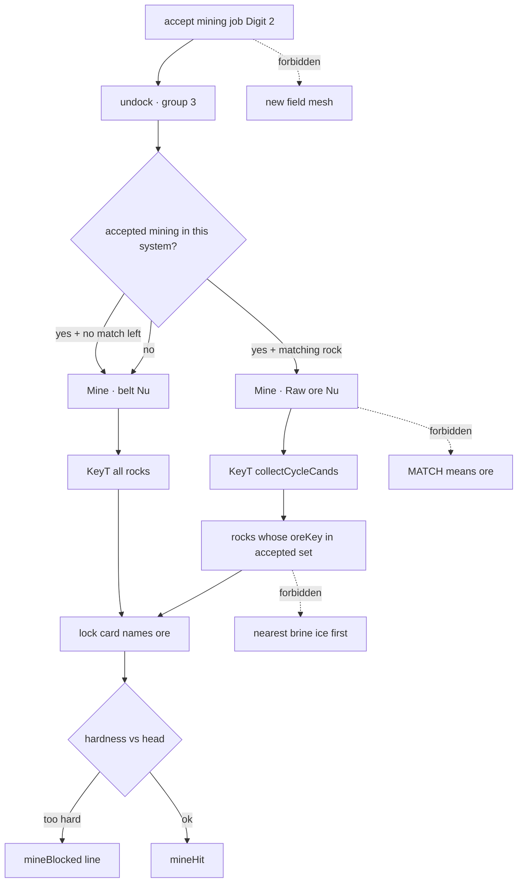

# RIMWARD Msn05 ore-type guidance

| Field | Value |
|---|---|
| **Title** | RIMWARD Msn05 ore-type guidance |
| **Author** | Wave 137 Msn05 leftover integrator |
| **Date** | 2026-08-26 |
| **Status** | Implemented Wave 138 PR1. Merge law: shared-contract.md wins. |
| **Wave** | 137 — leftover census + brief. No `src/`. KeyH/J/L/M/P stay. KeyD strafe. KeyT stays TGT-07. Digit 2 stays Jobs. |
| **Owner request** | Inbox P2 MSN/AST leftover: Give mining contracts ore-type guidance. Census live mining job copy, lock card, refusal toast, group-3 cue, KeyT rock cycle. Code wins. If a mining job already names a specific ore **and** the player can find matching rocks without a lock-one-at-a-time hunt (filter, marker, or equivalent live), freeze leftover **CONSUME** and named serial **none**. Name: **no remaining MSN-05 leftover.** Census: job **does** name the ore; find-without-lock **does not**. Freeze leftover **REAL** and name later serial **PR1**. MSN-04 mining identity is **not** this pack. AST-02 belt find is **not** this pack. MATCH lamp is **not** this pack. |
| **Merge law** | [`out/w137/oreguide/shared-contract.md`](../out/w137/oreguide/shared-contract.md). If this document and that file conflict, **the contract wins**. |
| **Honor** | HUD-01 empty 80 px hub. Aim-glass gauges stay off. Kit mutate omit. Digit 0/8/9 stay station. Digit 2 stays Jobs. No new Digit. KeyH hail, KeyJ dock/jump, KeyL berth, KeyM chart, KeyP pause stay. KeyD strafe. KeyT targeting stays TGT-07. Do not remap. MATCH lamp stays MATCH. Do not reuse MATCH for ore type. CTL-02 never writes `flags.paused`. CTL-03/04 not this pack. `innerHTML` forbidden later. Jobs rows stay `textContent`. `state.js` READ-ONLY later unless a tiny authored table is required; prefer no retune. Default persist **none**. No UU. No SKU. No new WORLD_FIELDS. Do not retune mining pay. Do not hide unique four. Do not merge ids. Do not steal AST-02. Do not steal NAV-11 or Agent evade. Agent API must not become a lock-by-ore cheat. Fail closed: unknown oreKey → generic copy, not crash; never throw from job board / lock. `reducedMotion`: no new animation that ignores it. Color is not the only cue (name the ore in text). Do not “fix” known REDMARCH `castMatches` flake. Do not steal optional Wave 136 OPEN PR2s or Agent pad 2B or in-repo LLM. Do not pause. Do not teleport. Prototype-safe: authored literals only. |

**Verifier record:**

| Note | Path |
|---|---|
| Inventory (code wins; Wave 137 census) | [`out/w137/oreguide/current-msn05-ore-guidance-inventory.md`](../out/w137/oreguide/current-msn05-ore-guidance-inventory.md) |
| Merge law | [`out/w137/oreguide/shared-contract.md`](../out/w137/oreguide/shared-contract.md) |
| Wave 137 security review | [`out/w137/oreguide/security-review.md`](../out/w137/oreguide/security-review.md) |
| Wave 137 design-doc review | [`out/w137/oreguide/code-review.md`](../out/w137/oreguide/code-review.md) |
| Wave 137 UI audit | [`out/w137/oreguide/ui-audit.md`](../out/w137/oreguide/ui-audit.md) |
| Wave 137 notes | [`out/w137/oreguide/notes.md`](../out/w137/oreguide/notes.md) |

**Implemented (Wave 138 PR1):** accepted mining key set, group-3 T-cycle filter, named cue, fallback when no matching rock remains. The freeze below still binds.

Siblings MSN-04 job identity, MSN-01 mining, MSN-02 families, Msn03 unique-done / unique-SKU / chains, AST-02/03, Agent API, NAV-11, Agent evade, MATCH, automine, wishlist, and `PROGRESS.md` are **other workers**. **Do not edit** those paths. **Do not** steal sibling Wave 137 paths. **Do not** write `out/w137/oreguide/verify/**`.

**This is not MSN-04 mining identity.** **This is not AST-02.** **This is not MATCH.** **This is not automine.** **This is not Agent pad 2B.** Wishlist contract-to-rock match is **INBOX**. Census still finds **unfiltered KeyT rocks** and **`Mine · belt` cue**.

---

## Overview

Inbox source (`docs/PLAYER-EXPERIENCE-WISHLIST.md` Playtest capture 2026-08-25 second pass — **201–206** — **cite, do not edit**):

> INBOX (P2, MSN/AST): Give mining contracts ore-type guidance. The contract asks for Raw ore, but a rock reveals its type only after a lock, one rock at a time (nearest rock was brine ice; next lock slag iron at 434 u). The refusal toast and lock card are good. Add an ore filter to the scanner or attach a field marker to the contract. AST-02 covers finding rich regions, not matching a rock to a contract.

The contract **already** asks for a named ore (`Mine Raw ore`). AST-02 **already** finds the belt. The hole is **match**: KeyT and the belt cue do not know the accepted commodity. Type waits for a lock.

Wave 137 this worker lands markdown only. Bindings do not change here.

Census (code wins): Mining cards mint `commodity` from hardness-1 keys and paint `Mine ${oreName}` (`station.js` **2324**, **5239–5245**). Band 0 fields still spawn brine ice and slag iron (`state.js` **549**; `asteroids.js` **1698–1701**). Group-3 `collectCycleCands` pushes **every** in-range rock (`controls.js` **140–146**). Cue is `Mine · belt ${n}u` (`hud.js` **2616**). Lock card names the ore **after** lock (**2489–2511**). `mineBlocked` toast uses authored `blockedLine` (**660–664**). No field marker. Leftover is **REAL**.

This leftover is a **named contract-to-rock match**: with an accepted mining job in this system, group-3 T-cycle prefers matching rocks and the cue names that ore. It is not a new marker mesh. It is not MSN-04 remint. It is not a MATCH rewrite.

This document is the integrator for a **later** implementation wave.

HUD-01 empty aim glass stays empty. `state.js` stays READ-ONLY. No new persist key. Digit 0/8/9 stay. Digit 2 stays Jobs. KeyH/J/L/M/P stay. KeyT stays TGT-07. MATCH stays MATCH. Do not invent UU. Do not steal NAV-11 or Agent evade.

Wave 137 deputize (recorded here and in the contract; owner may override after playtest): filter group-3 KeyT rocks to accepted mining commodities; name the nearest match on the existing cue slot; fall back to live belt/cycle when no match remains; do not add a field marker; do not retune band weights.

If census had proved named jobs **and** a live filter/marker/equivalent, this pack would freeze **CONSUME** and name serial **none**. Census did not. That CONSUME path is unexpected.

---

## Background & Motivation

### Current state (inventory)

Source of truth: [`out/w137/oreguide/current-msn05-ore-guidance-inventory.md`](../out/w137/oreguide/current-msn05-ore-guidance-inventory.md). Code wins.

| Surface | Today | Cite |
|---|---|---|
| Mining job names ore | `Mine Raw ore` / `Mine Living rock` | `station.js` **2324**, **5244** |
| MSN-04 uniqueness | exclude sibling commodity; omit; heal offered | **2239–2394** |
| Field mix | band weights include H2+ ores | `state.js` **548–554** |
| Rock row | `commodity` / `oreKey` / `hardness` | `asteroids.js` **1898–1906** |
| KeyT rocks | all in-range when group 3 | `controls.js` **140–146** |
| Cue | `Mine · belt Nu` any work-sector rock | `hud.js` **545–584**, **2611–2617** |
| Lock card | ore name after lock | `hud.js` **2489–2511** |
| Refusal | `mineBlocked` | `combat.js` **1573–1584**; `hud.js` **660–664** |
| AST-02 find | `Belt lies …` + work sector | `jump.js` **49–59** |
| MATCH | SPD lamp word | `hud.js` **389** |
| Marker | none | census |
| Digit 2 Jobs | `DOCK_KEY_SERVICES[1]` | `station.js` **189** |

The player who accepts Raw ore, arms group 3, and taps T can lock brine ice, then slag iron at 434 u, then maybe raw ore. The card was already honest. The field targeting was not.

### Pain points

- Named contract + mixed field + unfiltered KeyT = lock-one-at-a-time hunt. Inbox sequence is the expected path, not a rare seed.
- `Mine · belt` teaches region (AST-02), not commodity.
- A naive later PR that paints ore on every unlocked rock **steals** lock-card meaning and floods the HUD.
- A naive later PR that adds a field-marker mesh **invents** a world object type the honor forbade preferring.
- A naive later PR that retunes `ORE_BAND_WEIGHTS` so band 0 is 100% raw ore **steals** terrain and still fails Living rock contracts.
- A naive later PR that reuses MATCH as “ore match” **steals** the speed lamp.
- A naive later PR that remints mining cards **steals** MSN-04.
- A naive later PR that `innerHTML`s ore names is XSS.
- A naive later PR that Agent-locks the nearest `rawOre` by id **cheats** range.
- A naive later PR that writes `flags.paused` **steals** CTL-02.
- Automine still needs a lock; wiring it as guidance **steals** KeyN.

### Why now (design) / why not now (code)

The owner asked for the Msn05 leftover integrator so a later serial can stop the wrong-rock hunt **before** the first `controls.js` filter. Inventory shows named jobs and unfiltered cycle. Merge law can exist without touching `src/`. Implementation waits so marker meshes, MATCH reuse, band retune, MSN-04 theft, Agent cheat, persist flags, and contacts-arc rocks are frozen before the first key-set scan. Wave 137 this worker does not ship `src/`.

If census had proved filter or marker already live, this pack would freeze **CONSUME** and name serial **none**. Census did not.

---

## Goals & Non-Goals

### Goals

1. Document live mining copy, field mix, KeyT rock cycle, group-3 cue, lock card, refusal toast, AST-02 find, MATCH, Agent observe `need`/`commodity` from **live code**.
2. Freeze leftover = **contract-to-rock match guidance**. Not MSN-04 twins. Not AST-02. Not MATCH.
3. Freeze deputize: accepted-job key set; group-3 T-filter; named cue; fallback; no field marker. Owner may override after playtest. Do not park.
4. Freeze persist: **none** new. `state.js` READ-ONLY. No UU. No SKU. No new Digit.
5. Freeze HUD-01 empty hub. Digit 0/8/9 stay. Digit 2 stays Jobs. KeyH/J/L/M/P stay. KeyT stays TGT-07. MATCH stays MATCH.
6. Freeze later copy via `textContent`. `innerHTML` forbidden. Name the ore in text.
7. Freeze a serial PR plan. This wave writes the document. A later wave ships serially.

### Non-goals (locked — do not reopen)

- No `src/` or live bindings in this worker.
- No `flags.paused` write. CTL-03/04 not this pack.
- No MSN-04 remint / unique-four splice.
- No AST-02 belt rewrite / `fieldOre` identity change.
- No MATCH lamp reuse or copy change.
- No automine. No KeyV remap.
- No field-marker mesh / chart ore pip / hub PPI.
- No `ORE_BAND_WEIGHTS` retune. No mining pay / need / deadline retune.
- No `state.js` write. No WORLD_FIELDS. No new Digit.
- No Agent lock-by-ore pulse. Do not edit `docs/AgentApiDesign.md`.
- No NAV-11. No Agent evade. No HUD layout. No overlay-policy rewrite.
- Do not edit the wishlist, `PROGRESS.md`, `docs/Msn0*.md` siblings, OwnerDecisions*.
- Do not write `out/w137/oreguide/verify/**`.
- Do not write sibling `out/w137/routepersist/**` or `out/w137/evade/**`.
- Do not fix REDMARCH `castMatches`.
- Do not steal optional Wave 136 OPEN PR2s, Agent pad 2B, or in-repo LLM.

---

## Proposed Design

### 1. Merge resolutions (contract wins)

| Question | Integrator freeze | Why |
|---|---|---|
| Leftover real? | **Yes** | Inventory §9 |
| CONSUME? | **No**. Serial is **not** none | Named job live; filter/marker **not** live |
| New persist key? | **No** | Contract §0.5 |
| `state.js` write? | **No** | Prefer no retune |
| Field marker mesh? | **No** | Smaller freeze: HUD/cycle |
| Reuse MATCH? | **No** | Honor |
| Change pay / MSN-04? | **No** | Honor |
| Filter offered jobs? | **No** | Player is not on the contract yet |
| Filter KeyV? | **No** in PR1 | Inbox hunt is T + unnamed cue |
| Agent `lockOre`? | **No** | Contract §0.10 |
| Named PR1? | **PR1** T-filter + named cue | REAL leftover |

### 2. Current find motion (do not break AST-02 / TGT-07 / lock card)

Wave 69 belt cue stays the no-contract find-aid. Wave 136 mining identity stays. TGT-07 hostiles-first stays. Lock card still names ore after lock. `mineBlocked` still toasts.

### 3. Deputize table (copy of contract §0.1)

Owner may override after playtest. Do not park.

| Knob | Value |
|---|---|
| Gate | accepted mining; origin own `SYSTEMS` key === current system |
| Key set | union of authored commodities on those jobs |
| T-cycle rocks | match set when any matching `ore > 0` exists in the field |
| Ships / hostiles | unchanged TGT-07 |
| Cue | `Mine · {oreName} {n}u` to nearest match |
| Fallback | live `belt` + all-rock cycle if no match remains |
| Lock / toast | unchanged |
| Marker | none |
| MATCH | MATCH |
| Persist | none new |
| Fail-closed | never throw; unknown key skip; generic `'ore'` |

### 4. Neighbours

| Module | This leftover does | This leftover does not |
|---|---|---|
| `controls.js` | later PR1: group-3 rock filter in collect | remap KeyT; TGT-07 order; KeyV; KeyN automine |
| `hud.js` | later PR1: named cue + match-gated range | lock-card rewrite; toast rewrite; hub; MATCH word; contacts rocks |
| `station.js` | **none** (mint stays MSN-04) | Digit map; pay; unique four |
| `asteroids.js` | **none** | work sector; spawn; `id === i` |
| `state.js` | none | write weights / ORE_TYPES |
| `save.js` | **none** | WORLD_FIELDS |
| `agent-api.js` | **none** | lock-by-ore; observe rewrite |
| `overlay-policy.js` | **cite only** | pause write |
| `combat.js` | **none** | hardness gate |
| `jump.js` | **none** | arrival line |

### 5. Serial PR plan

Matches contract §3. **Named only. Do not implement in Wave 137.**

| PR | Lands | Does not land |
|---|---|---|
| **PR1** contract-to-rock match | key set; T-filter; named cue; fallback; fail-closed | marker; MATCH; band retune; MSN-04; Agent; persist; Digit; `innerHTML`; `state.js`; contacts rocks |
| **PR2 stills (optional skip)** | accepted Raw ore, cue names it, first T is rawOre | required with PR1 |
| **PR3 KeyV (optional skip)** | only if owner asks | required with PR1 |

First remaining serial is **PR1**. It must not steal Digit 0/8/9. It must not write `state.js`. It must not claim `agent-api.js`. Do not land a field marker as required PR1.

### 6. Picture

Reuse the live group-3 cue slot and KeyT collect. No new Digit. No hub pip. A player who accepts Raw ore at Freehold, undocks, and arms group 3 reads `Mine · Raw ore` plus a range. The first T-lock that is a rock is raw ore (or a ship / hostile per TGT-07), not brine ice, while any raw-ore rock still exists. Wrong rocks remain lockable under the reticle. MATCH still means match-speed. Unique four stay. Pause is still P.

---

## Player outcome (later serial; freeze here)

You dock Freehold. You tap Digit 2. You accept `Mine Raw ore`. You undock. You arm group 3.

You see `Mine · Raw ore` and a finite u, not only `Mine · belt`. You tap T. The first rock lock is Raw ore when a raw-ore rock still exists. The lock card still names the ore. If you beam a hard rock under the glass, the refusal toast still speaks.

If Living rock is the accepted card, the cue names Living rock. If both mining cards are accepted, T includes both keys and the cue names the **nearest** matching ore.

If the field holds no matching units left, the live belt cue and all-rock cycle return. You are not frozen.

You do **not** get a new marker mesh. You do **not** lose unique four. MATCH still reads MATCH. Pay math is the same.

**MSN-04 identity** is **not** this work. **AST-02** is **not** this work. **NAV-11** is **not** this work. **Agent evade** is **not** this work. **Agent API** is **not** this work.

---

## Security

See [`out/w137/oreguide/security-review.md`](../out/w137/oreguide/security-review.md).

- XSS: no `innerHTML` for ore name / range / job title. `textContent` only.
- Prototype keys: filter set from authored `ORE_TYPES` ∩ `COMMODITIES` only. Save `commodity` that is `__proto__` is skipped.
- Agent: no off-range `lockOre`. Live `acceptJob` stays desk Digit 2.
- Persist: no new key. Do not store a mute flag.
- Fail-closed: never throw on unknown oreKey; fallback rather than empty freeze; never write `paused`.

---

## Acceptance direction (implementation wave)

1. With one accepted `rawOre` mining job at the current origin, group-3 KeyT rock cands are `rawOre` while any `rawOre` rock with `ore > 0` exists in `asteroids.list`.
2. Empty-lock group-3 cue is `Mine · Raw ore ${n}u` toward the nearest matching rock (work-sector pass first, same as live `beltMineDist`).
3. No accepted mining job: cue and cycle match **today**.
4. No matching rock left: cue and cycle match **today**.
5. Two accepted mining jobs: union of keys; cue names nearest match’s ore.
6. Unique four still present. Digit 2 still Jobs. Digit n still accepts by board index.
7. Lock card and `mineBlocked` copy unchanged. MATCH word unchanged. TGT-07 hostiles-first unchanged.
8. No new `WORLD_FIELDS`. No `innerHTML`. No `state.js` write. No Agent lock-by-ore. No field marker. No AST-02 rewrite. No unique-four splice. No MSN-04 remint.
9. Unknown oreKey does not throw. Sanitize cap unchanged.
10. REDMARCH `castMatches` untouched.

---

## Alternatives considered

| Alternative | Why not |
|---|---|
| Freeze CONSUME / serial none | Job title names ore, but KeyT/cue do not match. Inbox hunt still live |
| Field-marker mesh / chart pip | New world object type; honor prefers HUD/filter; HUD-01 / HUD-07 steal |
| Paint ore on every unlocked rock | Lock card becomes noise; CPU; innerHTML risk |
| Retune `ORE_BAND_WEIGHTS` to all rawOre | Terrain steal; Living rock contracts still fail; `state.js` write |
| Reuse MATCH lamp as ore-match | MATCH is speed-hold |
| MSN-04 remint / hide unique four | Wrong leftover |
| Contacts-arc rocks as “scanner filter” | Arc is ships; HUD-07 / Wave F steal |
| Filter offered jobs | Player has not taken the contract |
| Force KeyV to skip wrong rocks | Inbox hunt is T-cycle; keep glass honest in PR1 |
| Agent lock nearest matching id | Range cheat |
| Persist “filter on” flag | Hostile god-mode mute |
| New Digit | Digit map / HUD-01 |
| `innerHTML` ore name | XSS |
| Pause while “searching” | CTL-02 |

---

## Regression risks

| Risk | Mitigation |
|---|---|
| T-cycle empty of rocks while match exists at 800 u | allowed; cue still names range; do not fall back to brine ice |
| Living rock rare → no in-range match | cue still points at the distant match; T may only cycle ships until close |
| No match left in field | fallback to live belt + all-rock |
| Hostiles-first broken | filter rocks only; `isCycleHostile` unchanged |
| Cue lies `Raw ore` at a brine ice range | match-gate `beltMineDist` in the same PR |
| XSS name | `textContent`; hasOwn COMMODITIES |
| Prototype commodity | skip reserved / unknown |
| Digit 0/8/9 | no new Digit; Digit 2 stays Jobs |
| MATCH scope creep | word stays MATCH |
| MSN-04 / AST-02 | do not claim those writers |
| REDMARCH boot flake | do not “fix” |
| `reducedMotion` | no new animation |

---

## Ownership

| Object | Writer | Reader |
|---|---|---|
| Group-3 rock cycle filter | later PR1 `controls.js` `collectCycleCands` | KeyT / agentSelectTarget cand list |
| Group-3 named cue | later PR1 `hud.js` cue + `beltMineDist` | player |
| Jobs row paint | live `renderJobs` `h()` (unchanged) | player |
| Lock card / toast | live `hud.js` (unchanged) | player |
| Mining mint | **none** (MSN-04 live) | Jobs pane |
| `fieldOre` / belts | **none** (AST) | asteroids |
| `flags.paused` | **none** (KeyP) | overlay-policy |
| `agent-api.js` | **none** | — |
| `state.js` | **none** | `COMMODITIES` / `ORE_TYPES` read |
| HUD layout | **none** (HUD-01) | — |

---

## Open owner questions (non-blocking)

1. Should optional PR3 also skip wrong rocks under KeyV, or keep the glass free? Default: **keep KeyV free**.
2. When two mining contracts are accepted, should the cue pin one commodity (slot 0) instead of naming the nearest match? Default: **nearest match’s name**.
3. If `livingRock` is accepted and none remains in the field, fallback to all-rock is frozen. Confirm vs a dedicated empty line (`Mine · Living rock gone`). Default: **fallback to live belt cue** (honest, no new copy channel).
