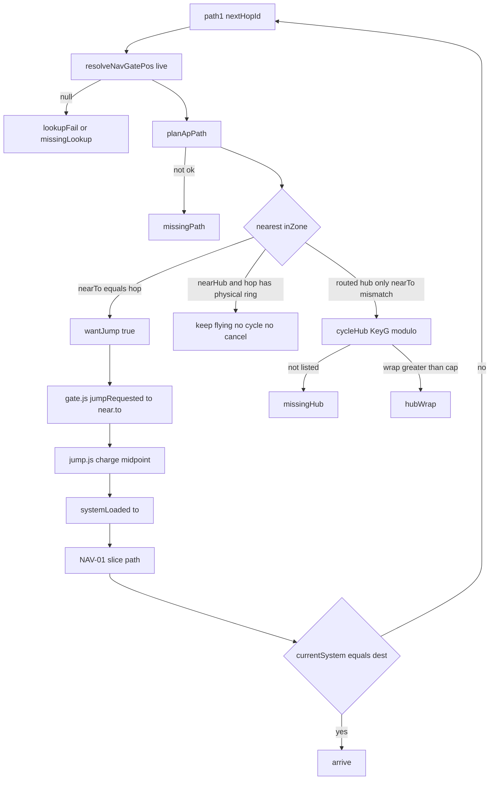

# RIMWARD NAV-05 remaining autopilot gate handoff

| Field | Value |
|---|---|
| **Title** | RIMWARD NAV-05 remaining autopilot gate handoff |
| **Author** | Wave 116 leftover integrator; Wave 117 PR1 implementer |
| **Date** | 2026-08-24 |
| **Status** | Wave 117 **PR1 autopilot gate handoff** landed. Merge law still `out/w116/nav05/shared-contract.md` (contract wins). |
| **Wave** | 117 — PR1 src + WAVE117 live `systemLoaded` pin. |
| **Owner request** | Inbox P0 NAV: Autopilot can reach the plotted gate's activation zone and then cancel with "next gate is missing" instead of jumping; make the gate handoff reliable, retain enough reason detail to diagnose lookup/path/hub failures separately, and verify a live plotted route through `systemLoaded` rather than only checking steering commands. (`docs/PLAYER-EXPERIENCE-WISHLIST.md` Idea inbox — **cite, do not edit**). |
| **Merge law** | [`out/w116/nav05/shared-contract.md`](../out/w116/nav05/shared-contract.md). If this document and that file conflict, the contract wins. |
| **Honor** | HUD-01 empty hub. Digit 0–9 stay. KeyM stays. KeyV stays. Do not steal Digit 0/8/9. `state.js` READ-ONLY; later **no** `state.js` write and **no** new persist key. `world.nav` stays one record. Next hop stays `path[1]`. Restore still `autopilot: false`. `innerHTML` forbidden later. `gate.js` sole `jumpRequested` writer. No teleport. No skip zone. No skip charge. MATCH refuse consume. PHY-02 bias consume. Not a planner. NAV-01/02/03/04 briefs cite only. `out/w84/nav03/**` frozen. Do **not** edit the wishlist, `PROGRESS.md`, sibling HUD/CTL Wave 116 paths, or `docs/OwnerDecisions*.md`. Do **not** write `docs/OwnerDecisionsWave116.md`. Do not reopen HUD-03, kit mutate, aim-glass, UU, SKU. |

**Verifier record:**

| Note | Path |
|---|---|
| Inventory (code wins; Wave 116 census) | [`out/w116/nav05/current-nav05-handoff-inventory.md`](../out/w116/nav05/current-nav05-handoff-inventory.md) |
| Merge law | [`out/w116/nav05/shared-contract.md`](../out/w116/nav05/shared-contract.md) |
| Wave 116 security review | [`out/w116/nav05/security-review.md`](../out/w116/nav05/security-review.md) |
| Wave 116 design-doc review | [`out/w116/nav05/code-review.md`](../out/w116/nav05/code-review.md) |
| Wave 116 UI audit | [`out/w116/nav05/ui-audit.md`](../out/w116/nav05/ui-audit.md) |
| Wave 116 notes | [`out/w116/nav05/notes.md`](../out/w116/nav05/notes.md) |
| Wave 117 PR1 inventory | [`out/w117/nav05/inventory.md`](../out/w117/nav05/inventory.md) |
| Wave 117 PR1 notes | [`out/w117/nav05/notes.md`](../out/w117/nav05/notes.md) |
| Wave 117 security review | [`out/w117/nav05/security-review.md`](../out/w117/nav05/security-review.md) |
| Wave 117 code review | [`out/w117/nav05/code-review.md`](../out/w117/nav05/code-review.md) |
| Wave 117 UI audit | [`out/w117/nav05/ui-audit.md`](../out/w117/nav05/ui-audit.md) |

Siblings HUD-02 (PR1 silhouettes), CTL-01 (dock bind), wishlist, `PROGRESS.md`, frozen NAV-01..04 docs, frozen `out/w84/nav03/**`, and `docs/OwnerDecisions*.md` are **other workers**. **Do not edit** those paths. Do **not** write `src/`. Do **not** steal sibling Wave 116 paths (`out/w116/hud02tgt/**`, `out/w116/ctl01/**`). Later impl **must not claim** `hud.js` / `hud.css` / `controls.js`. Later PR1 **may write** `src/systems/galaxychart.js` **only** so existing `#rw-galaxy-ap-live` `showApLive(apLine(reason))` on fly `disengage` while the chart is open (including chart Cancel). Do **not** close the chart on engage.

**This is not a new jump path.** **This is not MATCH.** **This is not PHY-02.** **This is not CTL-01.** **This is not NAV-04 hover.** Wishlist NAV-01/02/03/04 already shipped. Census still finds **collapsed missing-gate English**, **hub-nearest cancel in a valid zone**, and **no live multi-hop `systemLoaded` pin**.

---

## Overview

Wave 85 landed NAV-01 persist, NAV-02 guidance, and NAV-03 autopilot (`src/game/autopilot.js`, `gate.js` `apJump`, chart Autopilot, in-flight chip). Wave 88 landed `planApPath` geometry. Wave 96 landed NAV-04 hover. Frozen `docs/Nav03AutopilotDesign.md` is the Wave 84 record — **cite, do not rewrite**. Frozen `out/w84/nav03/**` stays frozen.

Live `AP_LINES.missingHop` and `AP_LINES.missingGate` use the **same** English after refused/cancelled (`autopilot.js` 27, 30). Fly lookup fail, `planApPath` fail, hub not-listed, and hub wrap all `disengage('missingGate')`. WAVE85 zone pin **teleports** into a gate and greps `jumpRequested`. WAVE88 asserts `yaw`/`throttle`/`wantJump` **without leaving the system**. There is **no** WAVE87 string in `scripts/boot-test.mjs`.

Census (code wins): sole emit is **LIVE**. MATCH refuse is **LIVE**. PHY-02 bias is **LIVE**. Restore force-false is **LIVE**. Chart button + chip are **LIVE**. **Handoff in an overlapping hub zone is not proven.** **Reason tokens are not distinct.** **Live multi-hop `systemLoaded` verification is missing.**

This leftover is **reliable gate handoff + diagnosable cancel lines + a live route pin**, not a teleport, not a planner, not a D-key remap.

This document is the integrator for a **later** implementation wave. Wave 116 this worker lands markdown only. Bindings do not change here.

HUD-01 empty aim glass stays empty. `state.js` stays READ-ONLY. No new persist key. Digit 0–9 stay. KeyM stays. KeyV stays. `gate.js` stays the only `jumpRequested` writer.

Wave 116 deputize (recorded here and in the contract; owner may override after playtest): do not cancel when the nearest assembly is a hub that does not list the hop while a **physical ring** for `path[1]` exists; cycle/wrap only for hub-only hops; split English for lookup vs path vs hub vs missing-hop vs missing-gate vs arrive; later verify a plotted multi-hop through `systemLoaded` / `currentSystem`. Fail closed: no emit, keep route, never freeze the sim.

If census had proved handoff already reliable **and** lines already distinct **and** a live `systemLoaded` route pin, this pack would freeze **CONSUME** and name serial **none**. Census did not.

---

## Background & Motivation

### Current state (inventory)

Source of truth: [`out/w116/nav05/current-nav05-handoff-inventory.md`](../out/w116/nav05/current-nav05-handoff-inventory.md). Code wins.

| Surface | Today | Cite |
|---|---|---|
| Command computer | `autopilot.js`; no mesh; no `jumpRequested` | header 1–4 |
| Next hop | `path[1]` | 101–106 |
| `wantJump` | `inZone && !docked && nearTo === hop` | 317 |
| `cycleHub` | nearest hub, hop not current spoke | 319–350 |
| Lookup | `resolveNavGatePos` → live assemblies | `nav-guidance.js` 89–97 |
| Path fail | `planApPath` `!ok` → `missingGate` | `autopilot.js` 263–266 |
| English | `missingHop` / `missingGate` same clause | 27, 30 |
| Arrive | `systemLoaded` + dest === here | 372–377 |
| Sole emit | `gate.js` `apJump` + `dockPressed` | 643–649 |
| Charge / swap | `jump.js` midpoint `systemLoaded` | 165 |
| Persist | `world.nav` + `autopilot: false` heal | `nav.js` 48–55; `save.js` 99–100 |
| Chart Autopilot | button + `apLine` live region | `galaxychart.js` 150, 619–634 |
| In-flight chip | dest / next / rem / Cancel | `hud.js` 1012–1020 |
| MATCH | refuse consume | `autopilot.js` 174; `ship.js` 742 |
| PHY-02 | `applyAvoidBias` consume | 275 |
| Tick order | gate → AP → jump → nav | `main.js` 111–123 |
| WAVE85 AP pins | grep + teleport zone + fake arrive | `boot-test.mjs` 19539–19870 |
| WAVE88 | steer math; ship stays | 19873–20043 |
| WAVE87 boot string | **ABSENT** | — |

### Pain points

- A naive later PR that emits `jumpRequested` from `autopilot.js` double-emits and fights `gate.js`.
- A naive later PR that sets `wantJump` from distance-to-hop alone jumps the **nearest** spoke whose `to` happens to match after a hub cycle, or fails emit while cancelling.
- A naive later PR that teleports or skips `JUMP.chargeTime` reopens NAV-03 no-teleport law.
- A naive later PR that keeps one toast (`next gate is missing`) makes the next bug undiagnosable.
- A naive later PR that verifies only `ctx.autopilot.yaw/throttle` ships a ship that never leaves the system.
- A naive later PR that requires `dockPressed` fights CTL-01 and binds AP to KeyD.
- A naive later PR that writes `hud.js` / `controls.js` steals HUD-02 / CTL-01.
- A naive later PR that leaves fly cancel only on HUD toasts hides lookup vs path vs hub under the open KeyM overlay (`#hud` z-index 10 vs chart z-index 30).
- A naive later PR that cancels because `nearTo` lags one frame aborts a valid zone.
- Putting a Digit or SKU impersonates the owner.
- Restoring `autopilot: true` from a stuffed save reopens WAVE85 healer.

### Why now (design) / why not now (code)

The owner asked for the NAV-05 **handoff** leftover integrator so later serials can finish the inbox P0 without collapsing failures or skipping `jump.js`. Inventory shows live AP, live sole emit, live MATCH, and **collapsed cancel + unproven overlap handoff + steer-only pins**. Merge law can exist without touching `src/`. Implementation waits so teleport, double-emit, Digit theft, `state.js` writes, new persist keys, MATCH edits, planner scope, and HUD/CTL theft are frozen before the first token split. Wave 116 this worker does not ship `src/`.

If census had proved distinct lines, a live multi-hop `systemLoaded` pin, and no zone-cancel path, this pack would freeze **CONSUME** and name serial **none**. Census did not.

---

## Goals & Non-Goals

### Goals

1. Document live `wantJump`, `apJump`, `resolveNavGatePos`, `planApPath`, `systemLoaded` arrive, persist, chart, chip, and boot pins from **live code**.
2. Freeze leftover = **reliable handoff in the routed zone** + **distinct reason English** + **live `systemLoaded` route proof**. Not a planner. Not MATCH.
3. Freeze `gate.js` as the only `jumpRequested` writer. No teleport. No skip zone. No skip charge.
4. Freeze `world.nav` one record. Next hop `path[1]`. Restore `autopilot: false`.
5. Freeze MATCH refuse consume. PHY-02 bias consume.
6. Freeze Digit / KeyM / KeyV / HUD-01 hub / `innerHTML` / `state.js` READ-ONLY.
7. Freeze English split table (lookup vs path vs hub vs hop vs gate vs arrive). Do not park.
8. Freeze later verification: live plotted multi-hop asserts `systemLoaded` / `currentSystem`, not only steer commands.
9. Freeze AP jump independent of KeyD (`apJump` OR `dockPressed`).
10. Freeze later write-set: `autopilot.js` ± `gate.js` predicate/cycle hygiene ± `boot-test.mjs` ± `galaxychart.js` **only** for `#rw-galaxy-ap-live` fly-cancel `showApLive`. **Not** `hud.js` / `hud.css` / `controls.js`.
11. Freeze a serial PR plan. This wave writes the document. A later wave ships serially.
12. Freeze chart-open fly cancel: existing `#rw-galaxy-ap-live` paints `apLine(reason)` while `chartOpen`. Chip dest/next/rem stays. Chart stays open on engage. HUD toast-under-overlay is **not** leftover law.

### Non-goals (locked — do not reopen)

- No `src/` or live bindings in this worker.
- No second jump emitter. No teleport. No skip `JUMP.zone` / `JUMP.chargeTime`.
- No MATCH rewrite. No PHY-02 rewrite. No navmesh. No NPC `planApPath`.
- No new Digit. No KeyM/KeyV remap. No HUD-01 hub child.
- No `state.js` write. No new `WORLD_FIELDS` key. No `hopIndex`.
- No `innerHTML`. No UU. No SKU. No HUD-03. No kit mutate. No aim-glass.
- Do not edit the wishlist, `PROGRESS.md`, `docs/Nav01RouteDesign.md`, `docs/Nav02GuidanceDesign.md`, `docs/Nav03AutopilotDesign.md`, `docs/Nav04HoverDesign.md`, `out/w84/nav03/**`.
- Do not write `docs/OwnerDecisionsWave116.md`.
- Do not fix known boot FAILs.
- Do not steal `out/w116/hud02tgt/**` or `out/w116/ctl01/**`.
- Do not claim `hud.js` / `hud.css` / `controls.js` for later NAV-05 impl.
- Do not close the chart on engage (P2 inbox waits). Do not put a reason paragraph on the chip. Do not treat HUD toast-under-overlay as NAV-03 leftover law.

---

## Proposed Design

### 1. Merge resolutions (contract wins)

| Question | Integrator freeze | Why |
|---|---|---|
| Leftover real? | **Yes** — collapsed English; hub-nearest cancel; no live `systemLoaded` multi-hop pin | Inventory §12 |
| CONSUME? | **No**. Serial is **not** none | Census |
| New persist key? | **No** | Contract §0.5 |
| `state.js` write? | **No** | Contract §0.5 |
| Second `jumpRequested` writer? | **No** | Contract §0.2 |
| Teleport / skip charge / skip zone? | **No** | Contract §0.2 |
| MATCH / PHY-02? | **Consume** | Contract §0.6–0.7 |
| `innerHTML`? | **No** | Contract §0.4 |
| Digit / KeyM / KeyV / hub? | **Stay** | Contract §0.3 |
| First serial steal Digit 0/8/9? | **No** | Contract §0.3 |
| Claim HUD/CTL files? | **No** | Contract §0.12 |
| Claim `galaxychart.js`? | **Yes — live-region paint only** | Contract §0.15 |
| Close chart on engage? | **No** — P2 inbox waits | Contract §0.15 |
| Chart-open fly cancel surface? | Existing `#rw-galaxy-ap-live` `showApLive(apLine(reason))` | Contract §0.15 |
| English split? | **Yes** — deputize table | Contract §0.1 |
| Live `systemLoaded` pin? | **Required to close** | Contract §0.9 / §3 PR3 |
| CTL-01 D key? | AP jump independent | Contract §0.11 |

### 2. Current handoff paint (do not break sole emit / MATCH / restore)

See inventory §§1–10. Load-bearing loops:

**Today (every AP frame after controls)**

1. Gate publishes nearest `inZone` / `nearTo`, then maybe emits if **previous** `wantJump` and `near.to === path[1]`.
2. AP aims at `resolveNavGatePos(path[1])`.
3. If lookup / path / hub-not-listed / wrap fail → **`missingGate`** toast (same English as refuse `missingHop`).
4. Else `wantJump` if nearest `nearTo === hop`.
5. `ship.js` consumes yaw/pitch/throttle. MATCH ignored while AP on.
6. `jump.js` charges and swaps at midpoint; `systemLoaded`; NAV-01 slices path.
7. Next AP frame: arrive or new hop.

**This serial must not change** sole emit, `to: near.to`, MATCH refuse, restore false, PHY-02 export, Digit map, KeyM/KeyV, chip home, `innerHTML` ban. Additive: hub-cycle gate + distinct tokens + live route pin.

### 3. Deputize table (copy of contract §0.1)

Owner may override after playtest. Do not park.

| Knob | Value |
|---|---|
| Emit | `gate.js` only; `to: near.to`; `apJump` requires `near.to === path[1]` |
| `wantJump` | `inZone && !docked && nearTo === hop` (nearest identity) |
| Wrong nearest hub | If a physical hop ring exists: **no cancel, no cycle** |
| Hub cycle | Only hub-only routed hop; wrap → `hubWrap` |
| English | Split table below |
| Persist | none new |
| MATCH / PHY-02 | consume |
| Fail-closed | no emit; keep route; never throw; never teleport |
| Verify | live multi-hop `systemLoaded` sequence |

### 4. English split (deputize exact strings)

| Token | Deputize English |
|---|---|
| `missingHop` | Autopilot refused — next hop is not on the route. |
| `missingLookup` | Autopilot refused — next gate is not in this system. |
| `lookupFail` | Autopilot cancelled — next gate is not in this system. |
| `missingPath` | Autopilot cancelled — approach path failed. |
| `missingHub` | Autopilot cancelled — hub does not list the next hop. |
| `hubWrap` | Autopilot cancelled — hub spoke cycle failed. |
| `missingGate` | Autopilot cancelled — next gate is missing. |
| `arrive` | Arrived — autopilot off. |

Live `missingHop` / `missingGate` both say “next gate is missing” today. **Forbidden** after PR1.

Chip dest / next / rem **does not** grow a reason paragraph (would need `hud.js`). Chart `apLine` + `commLine` carry the new strings. Chart-open fly cancel (lookup/path/hub/wrap/gate/arrive/cancel) also paints existing `#rw-galaxy-ap-live` via `showApLive(apLine(reason))` while `chartOpen`, including chart Cancel. Keep prefix split for `missingLookup` / `lookupFail`. Keep sentence-case `AP_LINES`. Do not flip chart Autopilot dim to `disabled`. Hub jargon (`hubWrap` “spoke cycle”) may stay.

### 5. Neighbours

| Module | This leftover does | This leftover does not |
|---|---|---|
| `autopilot.js` | PR1 handoff + tokens | emit jump; teleport; MATCH change |
| `gate.js` | optional cycle/predicate hygiene; still sole emit | second emitter; skip zone |
| `jump.js` | consume charge / `systemLoaded` | skip midpoint |
| `nav-guidance.js` | consume `resolveNavGatePos` | authored ghost fallback |
| `ap-path.js` | consume math; map `!ok` to `missingPath` | new planner |
| `nav.js` / `save.js` | consume one `world.nav` | new key |
| `ship.js` | consume cmd / MATCH ignore | rewrite |
| `hud.js` / `hud.css` | **none** | chip rewrite; toast z-index; overlay restyle |
| `galaxychart.js` | PR1 existing `#rw-galaxy-ap-live` `showApLive` on fly `disengage` while `chartOpen` (incl. chart Cancel) | close-on-engage; layout rewrite |
| `controls.js` | **none** | KeyD / KeyM / KeyV |
| `state.js` | **read** `JUMP.zone` | write |
| `npc.js` | consume `applyAvoidBias` | `planApPath` |

### 6. Serial PR plan

Matches contract §3. **Named only. Do not implement in Wave 116.**

| PR | Lands | Does not land |
|---|---|---|
| **PR1 autopilot gate handoff** | Wrong-hub no-cancel; hub-only cycle; split `AP_LINES`; sole emit stays; `galaxychart.js` `showApLive(apLine(reason))` on fly `disengage` while chart open (incl. chart Cancel) | `state.js`; Digit; persist; teleport; MATCH; planner; `hud.js`/`hud.css`/`controls.js`; close-chart-on-engage; chart layout |
| **PR2 reason lines (optional)** | Playtest retune of `AP_LINES`. Hub jargon may stay | Chip layout; HUD-03; close-chart-on-engage |
| **PR3 live route pin** | Multi-hop `systemLoaded` / `currentSystem` assert. Required to close leftover unless PR1 already lands it | Steer-only as the only proof; known boot FAIL fixes |

First remaining serial is **PR1**. It must not steal Digit 0/8/9. It must not write `state.js`. It must not claim `hud.js` / `hud.css` / `controls.js`. It **may write** `galaxychart.js` **only** for `#rw-galaxy-ap-live` fly-cancel paint.

### 7. Picture

Reuse live charge overlay, chip dest/next/rem, and existing `#rw-galaxy-ap-live`. No new chrome. No reason paragraph on the chip. Player hears **distinct** cancel lines. With the KeyM chart still open, the sighted player reads those lines on `#rw-galaxy-ap-live` (z-index 30), not under the overlay on HUD toasts. Autopilot that reaches the routed ring **jumps** (after one-frame `wantJump` + `near.to === hop`), it does not toast “next gate is missing.”

No hub pip. RANGE stays TGT-01. Chart Autopilot stays. Chart stays open on engage. Cancel stays on the chip.

---

## Player outcome (later serial; freeze here)

Plot a two-or-more hop route on the KeyM chart. Click Autopilot. MATCH still refuses if MATCH is on. The chart **stays open** (this leftover does not steal P2 “close chart on AP”).

The ship flies to the **routed** gate. If a hub sits nearer but the hop is a **physical ring**, Autopilot keeps flying to the ring. It does **not** cancel with “next gate is missing.”

When the nearest assembly `to` equals `path[1]` and the ship is in `JUMP.zone`, the **same** charge overlay as a D-key jump runs. Autopilot does not need KeyD. After midpoint the banner/`systemLoaded` path matches the new system. Autopilot picks up the next hop or arrives.

If lookup fails, the line says the gate is **not in this system**. If path math fails, the line says **approach path failed**. If a routed hub will not list the hop, the line says **hub**. If spoke cycle wraps out, the line says **spoke cycle**. If `path[1]` is gone, the line says **next gate is missing**. Arrival still says **Arrived — autopilot off.**

While the chart is open, those fly-cancel lines (and chart Cancel) paint existing `#rw-galaxy-ap-live` via `showApLive(apLine(reason))`. HUD `commLine` toasts stay under the overlay; that is **not** leftover law and is **not** NAV-03 consume for this English table. Chip dest / next / rem does not grow a reason paragraph.

Restore still leaves the stick in the player’s hands with the plot intact.

`reducedMotion` still kills overlay animation already owned by gate/HUD. This leftover adds **no** new motion.

**NAV-01 persist** is **not** this work. **NAV-02 markers** are **not** this work. **NAV-04 hover** is **not** this work. **MATCH** is **not** this work. **PHY-02** is **not** this work. **CTL-01 dock bind** is **not** this work.

---

## Security

See [`out/w116/nav05/security-review.md`](../out/w116/nav05/security-review.md).

- Jump stuffing: `to` stays `near.to`. Never emit `path[1]` from AP.
- Proto ids: reserved hop → lookup null → `missingLookup` / `lookupFail`. No `for-in` onto the channel.
- Teleport: forbidden. Charge and zone stay.
- Persist tamper: `sanitizeNav` still forces `autopilot: false`. No new key.
- XSS: `innerHTML` forbidden. Lines are frozen literals, not save strings. Chart live paints `apLine(reason)` via `textContent`, never the raw hop id.
- Fail-closed never freeze the sim.

---

## Acceptance direction (implementation wave)

1. `gate.js` is still the only `jumpRequested` emitter. Payload `to: near.to`. AP has no emit.
2. Ship in overlapping hub + hop-ring zone does **not** cancel with missing-gate/hub solely because the hub is nearer.
3. `wantJump` still requires `nearTo === hop`. No distance-only jump. No skip zone/charge.
4. Distinct `AP_LINES` per contract table. `missingHop` and `missingGate` no longer share “next gate is missing.”
5. Live plotted multi-hop asserts `systemLoaded` `to` and `world.currentSystem` sequence. Steer-only is not enough.
6. WAVE85 / WAVE88 pins still pass. Known boot FAILs untouched.
7. No new persist key. Digit 0–9 stay. KeyM/KeyV stay. MATCH still refuses. PHY-02 still consumed.
8. AP jump still works with `dockPressed` false.
9. Later write-set does not include `hud.js` / `hud.css` / `controls.js`. Later write-set **does** include `galaxychart.js` **only** for `#rw-galaxy-ap-live` fly-cancel `showApLive` while `chartOpen` (incl. chart Cancel).
10. `innerHTML` still absent on AP/chart/HUD paths this leftover touches (it still claims none of HUD; chart live uses `textContent`).
11. Chart stays open on engage. Chip dest/next/rem unchanged. No reason paragraph on the chip.

---

## Alternatives considered

| Alternative | Why not |
|---|---|
| Freeze CONSUME / serial none | Census: collapse + unproven overlap cancel + no live route pin |
| Emit from `autopilot.js` | Double-emit; NAV-03 sole-site law |
| `wantJump` from distance to hop | False jump / wrong spoke |
| Teleport into ring / skip charge | Wishlist regression; NAV-03 freeze |
| Keep one toast | Next bug undiagnosable |
| Verify only steer | Ship may never leave the system |
| Require KeyD for AP jump | Fights CTL-01 |
| New persist `hopIndex` | NAV-01 one record |
| Chip reason text | Would claim `hud.js` |
| Close chart on engage | P2 inbox waits; do not steal this leftover |
| Raise HUD toast z-index | Would claim `hud.js` / `hud.css`; leftover paint is `#rw-galaxy-ap-live` |
| Treat toast-under-overlay as NAV-03 law | Designer Major: leftover **is** the distinct fly-cancel lines |
| Planner / navmesh | PHY-02 consume; CPU |
| MATCH cancel instead of refuse | NAV-03 consume |

---

## Regression risks (wishlist rule 4)

| Risk | Mitigation |
|---|---|
| False jump at the wrong hub spoke | Emit still `near.to === path[1]`; no distance-only `wantJump` |
| Double-emit `jumpRequested` | Sole writer `gate.js`; AP grep stays clean (WAVE85 `jumpOnlyGate`) |
| Cancelling a valid zone because `nearTo` lags one frame behind `wantJump` | No cancel on one-frame empty/wrong `nearTo` while `inZone` and lookup still resolves; still no emit unless `near.to === nextHop` |
| Collapsing all failures into one toast | English split table; `BREAK_LINE` grows tokens |
| Chart-open fly cancel hidden under overlay | PR1 `galaxychart.js` `showApLive(apLine(reason))` while `chartOpen`; do not steal `hud.js` |
| Verifying only steer commands while the ship never leaves the system | PR3 live `systemLoaded` sequence |
| Fighting CTL-01 (`dockPressed` vs `wantJump`) | `apJump` OR `dockPressed`; AP must not require D |
| Digit / hub / Key steal | Contract §0.3 |
| Persist `autopilot: true` round-trip | Consume WAVE85 healer |
| Proto dest on emit | `to: near.to` + `beginJump` `hasOwn` SYSTEMS |
| HUD/CTL file steal | Contract §0.12 |

---

## Ownership

| Object | Writer | Reader |
|---|---|---|
| `jumpRequested` | **none new** (`gate.js`) | `jump.js` |
| `wantJump` / `cycleHub` | later PR1 `autopilot.js` | `gate.js` |
| `AP_LINES` | later PR1 | `apLine` / chart / commLine |
| `#rw-galaxy-ap-live` fly cancel | later PR1 `galaxychart.js` | sighted player while `chartOpen` |
| `world.nav` bag | **none** | NAV-01 consume |
| `world.currentSystem` | **none** (`jump.js`) | arrive |
| MATCH / PHY-02 | **none** | consume |
| Digit / KeyM / KeyV | **none** | consume |
| `hud.js` / `hud.css` / `controls.js` | **none** | chip dest/next/rem / D stay |

---

## Open owner questions

**Deputized this wave** (contract §0.1). Owner may override after playtest. Do not park.

1. Smallest additive = wrong-hub no-cancel + hub-only cycle + split `AP_LINES` + live `systemLoaded` pin. Fail closed = no emit, keep route.
2. MATCH and PHY-02 stay LIVE consume.
3. No new persist key. Next hop stays `path[1]`.
4. Home: `autopilot.js` (and optional `gate.js` hygiene + `boot-test.mjs` + `galaxychart.js` live-region paint only). Not `state.js`. Not HUD/CTL files. Not a new Digit. Not close-chart-on-engage.
5. PR2 copy retune is skippable after playtest. PR3 pin is required to close leftover unless PR1 lands it.
6. Leftover is **real**. Not CONSUME. Serial is **PR1 autopilot gate handoff**, not none.
7. NAV-01..04 stay cited, not rewritten. Wave 84 nav03 pack stays frozen.
8. AP jump stays independent of KeyD.
