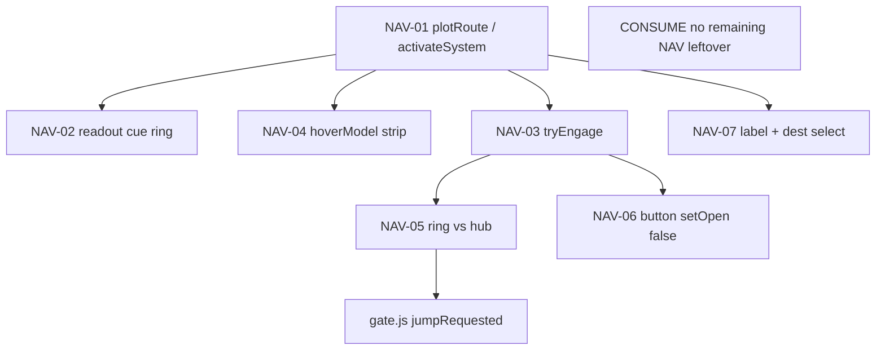

# RIMWARD remaining NAV leftover after NAV-07

| Field | Value |
|---|---|
| **Title** | RIMWARD remaining NAV leftover after NAV-07 |
| **Author** | Wave 122 remaining-NAV leftover integrator |
| **Date** | 2026-08-25 |
| **Status** | leftover **CONSUME**. Wave 122 markdown only. Named serial: **none**. Name: **no remaining NAV leftover.** |
| **Wave** | 122 — no `src/`. Bindings do not change here. |
| **Owner request** | Census **remaining NAV leftover after Wave 121 NAV-07 chart-label PR1**, from live code. NAV-01..07 already shipped (plot, guidance, AP, hover, handoff, chart-close, chart-label). Wishlist NAV-03 still says “Remaining zone handoff leftover: Wave 116 brief; impl later.” That line is **stale if Wave 117 landed**. Code wins. If remaining leftover is **already gone** and there is no second unnamed NAV hole, freeze leftover **CONSUME** and named serial **none**. If census finds a **real** remaining hole that is not NAV-01..07 already shipped, freeze leftover **REAL** and name later serial **PR1** (named only). Do **not** implement `src/`. Do not invent teleport, persist-resume flying AP, a hub PPI, a new Digit, a new persist key, UU, SKU, kit mutate, or aim-glass gauges unless inventory proves a real hole. |
| **Merge law** | [`out/w122/navrest/shared-contract.md`](../out/w122/navrest/shared-contract.md). If this brief and that file conflict, **the contract wins**. |
| **Honor** | HUD-01 empty 80 px hub. Aim-glass gauges stay off. Kit mutate omit. Digit 0 shipyard. Digit 8/9 stay. KeyM stays. KeyJ dock/jump cite-only. `state.js` READ-ONLY later. No new persist key. `innerHTML` forbidden later. Overlay mutex / hail / `showApLive` / Autopilot button close: cite, do not steal. PHY-04 80 u skippable. Power ledger out. Do not “fix” known boot FAILs (REDMARCH `castMatches` flake; WAVE26 closed Wave 119). Do **not** write `docs/OwnerDecisionsWave122.md`. Do **not** edit wishlist, `PROGRESS.md`, `docs/Nav01*`–`docs/Nav07*`, `docs/Ctl*`, `docs/Hud*`, `docs/Tgt*`, `docs/Rep*`, `docs/OwnerDecisions*`. Do **not** steal `out/w122/tgtrest/**`, `out/w122/represt/**`, `out/w121/**`, `out/w120/**`, `out/w117/**` (read ok). |

**Verifier record:**

| Note | Path |
|---|---|
| Inventory (code wins) | [`out/w122/navrest/current-nav-remaining-inventory.md`](../out/w122/navrest/current-nav-remaining-inventory.md) |
| Merge law | [`out/w122/navrest/shared-contract.md`](../out/w122/navrest/shared-contract.md) |
| Security review | [`out/w122/navrest/security-review.md`](../out/w122/navrest/security-review.md) |
| Design-doc review | [`out/w122/navrest/code-review.md`](../out/w122/navrest/code-review.md) |
| UI audit | [`out/w122/navrest/ui-audit.md`](../out/w122/navrest/ui-audit.md) |
| NAV-01 plot (cite) | [`docs/Nav01RouteDesign.md`](./Nav01RouteDesign.md) |
| NAV-02 guidance (cite) | [`docs/Nav02GuidanceDesign.md`](./Nav02GuidanceDesign.md) |
| NAV-03 AP (cite) | [`docs/Nav03AutopilotDesign.md`](./Nav03AutopilotDesign.md) |
| NAV-04 hover (cite) | [`docs/Nav04HoverDesign.md`](./Nav04HoverDesign.md) |
| NAV-05 handoff (cite) | [`docs/Nav05HandoffDesign.md`](./Nav05HandoffDesign.md) |
| NAV-06 chart-close (cite) | [`docs/Nav06ChartCloseDesign.md`](./Nav06ChartCloseDesign.md) |
| NAV-07 chart-label (cite) | [`docs/Nav07ChartLabelDesign.md`](./Nav07ChartLabelDesign.md) |

Siblings TGT rest (`out/w122/tgtrest/**`), REP rest (`out/w122/represt/**`), overlay/CTL-02, HUD toast, KeyJ, wishlist, and `PROGRESS.md` are **other workers**. **Do not edit** those paths. **Do not write** `src/`.

**This is not overlay mutex.** **This is not hail.** **This is not toast.** **This is not KeyJ.** **This is not a hub PPI.** Remaining NAV leftover after NAV-07 is **already gone**.

---

## Overview

Wave 85 shipped NAV-01 plot persist + chart click, NAV-02 readout/cue/ring, NAV-03 Autopilot. Wave 96 shipped NAV-04 hover. Wave 117 shipped NAV-05 handoff (nearer hub does not cancel a physical ring; split `AP_LINES`; `gate.js` sole emit; `#rw-galaxy-ap-live` on fly cancel while chart open; chart does not close on **direct** engage). Wave 120 shipped NAV-06 Autopilot **button** success `setOpen(false)` + blur / prefer HUD Cancel. Wave 121 shipped NAV-07 labels sharing `activateSystem`, dest `<select id="rw-galaxy-dest">`, KeyM close skipping `isTypingFocus()`.

Census (code wins): remaining NAV leftover after NAV-07 is **not** missing. A teleport would cheat travel. Persist-resume flying AP would grab the stick after load (NAV-03 already forbids). A hub PPI would fight TGT contacts. A dest-select hover leftover would invent NAV-04 keyboard inspect that live hover already covers on pointer. Treating wishlist “impl later” as REAL would double-ship Wave 117.

This leftover is **CONSUME**. Name: **no remaining NAV leftover.** Do **not** freeze a remaining-NAV serial. Wishlist NAV-03 handoff sentence is **stale vs code**.

This brief is the integrator document. Wave 122 this worker lands markdown only. Bindings do not change here.

HUD-01 empty aim glass stays empty. `state.js` stays READ-ONLY. No new persist key. Digit 0 stays shipyard. Digit 8/9 stay. KeyM stays. Do not invent UU. Do not steal overlay mutex. Do not steal hail. Aim-glass gauges stay off.

Wave 122 deputize (recorded here and in the contract; owner may override after playtest): **do not invent remaining NAV work**. Fail closed to today’s plot + guidance + AP + hover + handoff + button close + labels. Never freeze the sim.

If census had proved a real remaining hole that is not NAV-01..07 already shipped, this pack would freeze **REAL** and name serial **PR1**. Census did not.

---

## Background & Motivation

### Current state (inventory)

Source of truth: [`out/w122/navrest/current-nav-remaining-inventory.md`](../out/w122/navrest/current-nav-remaining-inventory.md). Code wins.

| Surface | Today | Cite |
|---|---|---|
| Persist | one `nav` on `WORLD_FIELDS`; restore `sanitizeNav` | `save.js` **100–101**, **976**, **1240** |
| Write bag | dest/path/remaining/status; `autopilot: false` | `nav.js` **48–55** |
| Plot / click | `activateSystem` current clear else plot | `galaxychart.js` **726–732**, **748–751** |
| Guidance | NEXT/DEST/JUMPS/GATE + cue + ring | `hud.js` **1008–1026**, **818–822**; `nav-guidance.js` |
| MATCH | refuse consume | `autopilot.js` **22**, **184** |
| Cancel dest | `disengage` flying flag only | **191–196** |
| Hover | `hoverModel` strip; no plot | `chart-hover.js` **28**; `galaxychart.js` **374–387**, **754–758** |
| Handoff | ring vs hub; split `AP_LINES`; sole emit | `autopilot.js` **21–38**, **335–337**; `gate.js` **501–505**, **672–678** |
| Button close | Autopilot success `setOpen(false)` | `galaxychart.js` **704–706** |
| Direct engage | `tryEngage` does not close | `autopilot.js` **209–223** |
| Labels | `data-system-id`; CSS pointer-events all | `galaxychart.js` **340–350**; `hud.css` **2165–2171** |
| Dest list | `#rw-galaxy-dest` | `galaxychart.js` **194–230** |
| KeyM typing | `isTypingFocus` skip | **764–779**; `overlay-policy.js` **72–80** |
| Empty hub | 80 px | `hud.css` **184–193** |
| Digit 0 / 8 / 9 | shipyard / launch / epics | `station.js` **188** |
| WAVE85 / WAVE117 pins | persist, chart, guidance, AP, handoff, button close folded | `boot-test.mjs` **18828+**, **23439+** |
| Overlay / hail / toast | siblings | do not claim |

The player who plots a dest, flies with readout + cue, clicks Autopilot, rides a physical ring past a nearer hub, cancels without losing dest, restores without resuming fly, hovers a system, engages from the Autopilot **button** (chart closes), or plots from a label / dest `<select>` already has the NAV stack. Wishlist “handoff leftover … impl later” is **stale vs code**.

### Pain points

- A naive later PR that “adds remaining NAV” would **double-ship** plot, AP, or labels.
- A naive later PR that teleports `currentSystem = dest` cheats zone/charge.
- A naive later PR that persist-resumes `autopilot: true` grabs the stick after load.
- A naive later PR that treats wishlist NAV-03 “impl later” as REAL **reopens NAV-05**.
- A naive later PR that adds a hub PPI fights TGT contacts and HUD-01.
- A naive later PR that rewrites `showApLive` or overlay mutex steals siblings.
- A naive later PR that inverts button `setOpen(false)` reopens NAV-06.
- A naive later PR that grows HIT discs over Autopilot / Close fights NAV-07 freeze.
- `innerHTML` of system names is XSS.
- Inventing “CONSUME is boring, add teleport / dest-hover leftover” invents work the owner forbade.

### Why now (design) / why not now (code)

The owner asked for a remaining-NAV census so later serials do **not** steal NAV-01..07, overlay, KeyJ, or HUD while chasing a hole Wave 117/120/121 already closed. Inventory shows NAV-01..07 **LIVE** and **no** second unnamed NAV hole. Merge law can exist without touching `src/`. Implementation does **not** wait — it **does not ship**. Wave 122 this worker does not write `src/`.

If census had proved a real remaining hole that is not NAV-01..07, this pack would freeze **REAL** and name serial **PR1**. Census did not.

---

## Goals & Non-Goals

### Goals

1. Document live plot, guidance, AP, hover, handoff, button close, labels, dest list, persist, and jump emit from **live code**.
2. Freeze leftover as **CONSUME** (not REAL). Name **no remaining NAV leftover.**
3. Freeze **reuse** of live NAV-01..07. No teleport. No new persist key.
4. Freeze NAV-05/06/07 as **cite-only consume**. Do not retune `AP_LINES`, button close, or dest `<select>`.
5. Freeze overlay mutex, hail, toast, KeyJ, TGT, REP as **sibling — do not steal**.
6. Freeze no new Digit, no `state.js` write, no UU, no hub PPI, no aim-glass gauges.
7. Freeze a serial PR plan with **no implementation PR1**.

### Non-goals (locked — do not reopen)

- No `src/` or live bindings in this worker.
- No teleport. No persist-resume flying AP. No hub PPI.
- No dest-select hover leftover. No HIT disc grow. No SVG roving tabindex leftover.
- No NAV-05 `showApLive` rewrite. No invert of button `setOpen(false)`.
- No overlay mutex. No hail.js. No toast. No KeyJ remap.
- No HUD-01 hub child. No RANGE rewrite. No Digit steal.
- No `WORLD_FIELDS` second nav key. No `ctx.autopilot` persist.
- Do not pause the sim.
- Do not edit the wishlist, `PROGRESS.md`, sibling Nav/Hud/Ctl/Owner docs.
- Do not write `docs/OwnerDecisionsWave122.md`.
- Do not steal `out/w122/tgtrest/**`, `out/w122/represt/**`, `out/w121/**`.
- Do not fix known boot FAILs.

---

## Proposed Design

### 1. Merge resolutions (contract wins)

| Question | Integrator freeze | Why |
|---|---|---|
| Leftover real? | **No. CONSUME.** | Inventory §0: NAV-01..07 LIVE; no second unnamed hole |
| Named PR1? | **None** | CONSUME |
| New persist key? | **No** | `nav` already on `WORLD_FIELDS`; AP false on restore |
| `state.js` write? | **No** | Contract §0.5 |
| Teleport? | **No** | Forbidden; jump is zone+emit |
| Persist-resume AP? | **No** | `sanitizeNav` always false |
| Hub PPI? | **No** | TGT/HUD-01 |
| Dest-select hover leftover? | **No** | NAV-04 pointer inspect LIVE |
| Steal overlay / hail / `showApLive`? | **No** | Cite only |
| Invert button close? | **No** | NAV-06 landed |
| Fail closed? | MATCH refuse; no zone → no emit; never pause | Live |
| Wishlist “impl later”? | Stale; code wins | Wave 117 landed |

### 2. Current NAV motion (do not break)

See inventory §§3–9. Load-bearing loop:

**Today (consume)**

1. Player opens Galaxy Chart (KeyM). Overlay mutex may refuse (`canOpenPlayCard`).
2. Click disc **or** label **or** dest `<select>` plots (`activateSystem`). Hover inspects only.
3. HUD NEXT/DEST/JUMPS/GATE + off-glass cue + in-world ring follow `path[1]`.
4. Autopilot **button** engages, closes chart, blurs, prefers HUD Cancel. Direct `tryEngage` does not close.
5. MATCH refuses. Cancel keeps dest. Restore does not resume flying.
6. Ship aims at live ring; nearer hub does not cancel a physical ring; `gate.js` emits `{ to: near.to }` in zone.
7. Fly cancel while chart open paints `#rw-galaxy-ap-live`.

**This serial must not change** `world.nav`, `sanitizeNav`, `activateSystem`, `AP_LINES`, `lookupLiveNavHopKind`, Autopilot button `setOpen(false)`, dest `<select>`, Digit map, empty hub. Additive: **none**.

Digit 0 and `DOCK_KEY_SERVICES` stay. Digit 8/9 stay.

### 3. Deputize table (copy of contract §0.1)

Owner may override after playtest. Do not park. Do not invent work.

| Knob | Value |
|---|---|
| Verdict | **CONSUME** |
| Fail-closed | MATCH / no dest refuse; no zone → no emit; never pause |
| Additive | **none** |
| Persist | existing `world.nav`; AP false on restore |
| Jump | `gate.js` only; `near.to` |
| Button close | consume LIVE; do not invert |
| Labels / dest | consume LIVE; do not retune |
| Overlay / hail / toast / KeyJ | sibling — do not steal |
| Alloc | reuse live chart + HUD readout + AP chip |
| Missing host | today’s NAV-01..07 |

Remaining NAV already has the full stack (inventory §0). Later serial **does not add a helper**. Do not steal overlay or TGT.

### 4. Neighbours

| Module | Remaining NAV leftover does | Remaining NAV leftover does not |
|---|---|---|
| `galaxychart.js` | **none** (CONSUME) | dest hover leftover; HIT grow; overlay z |
| `autopilot.js` | **none** | teleport; persist-resume; MATCH rewrite |
| `gate.js` | **none** | second emit path |
| `hud.js` | **none** | hub pip; MATCH steal beyond cite |
| `nav.js` / `save.js` | none | new `WORLD_FIELDS` key |
| `overlay-policy.js` | cite `isTypingFocus` | rewrite mutex |
| `controls.js` | none | KeyJ remap |
| `state.js` | **read-only later** | write |
| HUD-01 | none | gauge / PPI |
| Digit 0/8/9 | cite freeze | bind NAV |
| TGT / REP / toast | none | steal sibling packs |

### 5. Serial PR plan

Matches contract §3. **Named only. Do not implement in Wave 122.**

| PR | Lands | Does not land |
|---|---|---|
| **PR1 remaining NAV** | **Does not exist.** Leftover CONSUME | teleport; persist-resume AP; hub PPI; dest-hover leftover; overlay; Digit; persist; hub; `innerHTML` |
| **PR-census (optional skip)** | Re-grep `activateSystem` + `#rw-galaxy-dest` + `lookupLiveNavHopKind` + button `setOpen(false)` + `sanitizeNav` AP false | New world field; hub pip; boot-log invention |

First remaining NAV serial is **none**. It must not steal Digit 0/8/9. It must not write `state.js`.

### 6. Picture

Reuse live Galaxy Chart + HUD readout + AP chip. No new chrome. Player plots, flies, Autopilots, hovers, and labels already work. Hail/chart/berth stacking is **overlay**. Toasts are **HUD-04**. KeyJ is **CTL-01**.

No hub pip. Digit 0 stays shipyard. Chart z stays with overlay contract.

### 7. UI (specified later UI — CONSUME: already live)

See [`out/w122/navrest/ui-audit.md`](../out/w122/navrest/ui-audit.md).

**This wave:** no chrome.

**Later (none):** do not add NAV chrome. Live chart already uses real `<button>`s, dest `<select>` with visible `<label>`, `textContent`, `#rw-galaxy-ap-live` polite, HUD Cancel, KeyM/Escape.

### 8. Events / persist / security

Prefer live `'navRoute'` / `'autopilotEngaged'` / `'autopilotDisengaged'` / `'jumpRequested'`. No new frozen event. No new `WORLD_FIELDS` key.

Security freeze: `innerHTML` forbidden; proto-safe `sanitizeSystemId`; restore AP false; sole emit `near.to`.

### 9. Coupling

| Sibling | Boundary |
|---|---|
| Overlay / hail | mutex `canOpenPlayCard`; do not steal |
| Toast | HUD-04 linger; do not steal |
| KeyJ | CTL-01; do not remap |
| TGT rest | contacts / lock arrow; do not reuse `.rw-nav-gate-cue` |
| REP rest | standing on hover already `standingRead`; do not steal |
| Nav01–07 briefs | cite only; do not edit |

---

## Player outcome (CONSUME; freeze here)

Open the Galaxy Chart. Click a **name** or pick Destination. A route paints. Close the map. NEXT / DEST / JUMPS stay. Off-glass cue points at the routed gate.

Click Autopilot. MATCH refuses if MATCH is on. On success the **button** closes the chart and HUD Cancel is the stop. Direct code engage still leaves the chart open. Cancel keeps the dest. Restore never resumes flying.

Fly a plotted ring while a hub is nearer: Autopilot does **not** cancel as “next gate is missing.” Jump still needs the zone. Arrival turns AP off.

Hover still inspects. Labels still plot. KeyM in the dest list does not close the chart. Escape does.

**Overlay mutex** is **not** this work. **Toast flood** is **not** this work. **KeyJ** is **not** this work. **TGT radar** is **not** this work. **Wishlist status prose** is **not** this work (other worker).

---

## Risks & Mitigations (frozen; no PR1)

| Risk | Mitigation |
|---|---|
| Later worker invents remaining NAV | Contract §0 / §3 CONSUME; inventory §0 |
| Later worker teleports dest | Contract §0.8 / §0.14 |
| Later worker persist-resumes AP | Contract §0.6; `sanitizeNav` |
| Later worker treats wishlist “impl later” as REAL | Code wins; do not edit wishlist here |
| XSS on system names | `innerHTML` forbidden; live 0 |
| Digit / hub theft | Contract §0.2 / §0.3 |
| Overlay / hail / `showApLive` steal | Contract §0.9 |
| Sibling TGT/REP steal | Coupling §9 |

---

## Security (freeze)

- No `innerHTML` later. Live chart `textContent`.
- No new `WORLD_FIELDS` key. Do not persist `ctx.autopilot`.
- Prototype-safe: `sanitizeSystemId`; reserved ids; dest options `Object.hasOwn`.
- Jump emit stays `near.to` in `gate.js` only.
- Fail-closed never freeze the sim.

---

## Acceptance (CONSUME)

Verifier accepts this leftover freeze when:

1. Inventory + contract + this brief all say **CONSUME** / serial **none**.
2. Cites match live NAV-01..07 (`activateSystem`, `#rw-galaxy-dest`, `lookupLiveNavHopKind`, Autopilot button `setOpen(false)`, `sanitizeNav` AP false).
3. Worker wrote **no** `src/`.
4. Honor files untouched.
5. Named serial PR1 **does not exist**.
