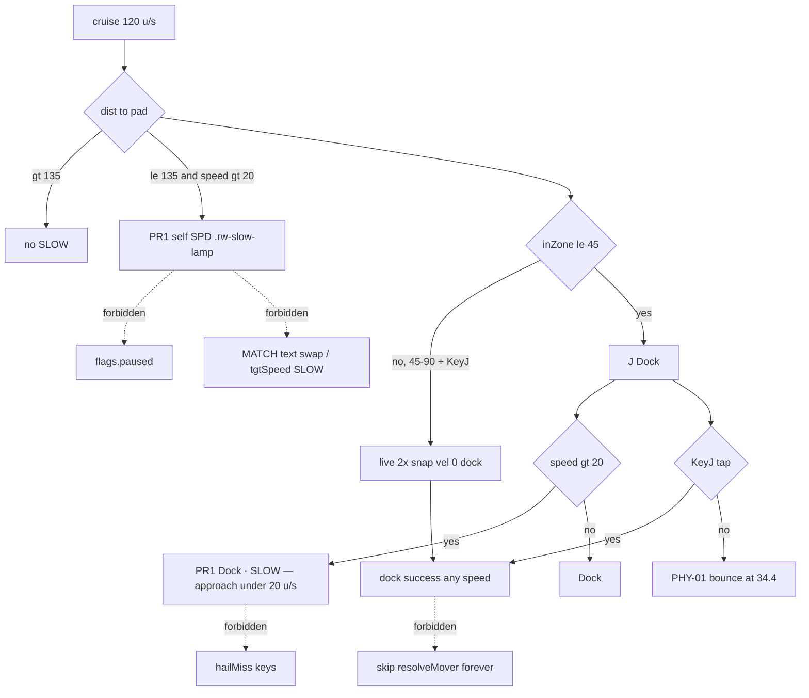

# RIMWARD NAV-10 docking approach assistance

| Field | Value |
|---|---|
| **Title** | RIMWARD NAV-10 docking approach assistance |
| **Author** | Wave 130 NAV-10 leftover integrator |
| **Date** | 2026-08-26 |
| **Status** | leftover **REAL**. Wave 136 PR1 implemented. Named serial **PR1**. Not CONSUME. Merge law: shared-contract.md wins. |
| **Wave** | 136 — PR1 HUD approach-speed cue. KeyJ stays dock/jump (CTL-01). KeyD stays strafe. |
| **Owner request** | Inbox P2 NAV/DOCKING leftover: Add docking approach assistance. Census live J prompt, snap, PHY bounce, HUD, NAV-03, Hail02 miss. Code wins. If a named approach-speed cue **and** a brake/governor that prevents cruise-speed bounce-into-pad already live, freeze leftover **CONSUME** and named serial **none**. Census: **not** live. Freeze leftover **REAL** and name later serial **PR1**. |
| **Merge law** | [`out/w130/dockapproach/shared-contract.md`](../out/w130/dockapproach/shared-contract.md). If this document and that file conflict, **the contract wins**. |
| **Honor** | HUD-01 empty 80 px hub. Aim-glass gauges stay off. Kit mutate omit. Digit 0/8/9 stay. No new Digit. KeyH/J/L/M/P stay. CTL-02 hail/chart/berth never write `flags.paused`. CTL-03 berthHold is not this pack. AI-05 starter grace is not this pack. CTL-04 menu digits are not this pack. NAV-03/05/06/07/09 cite only. PHY-01 bounce stays the collision law. Do not invent a third helm. Do not invent teleport beyond the existing 2× snap. Do not pause. Do not remap keys. `state.js` READ-ONLY later. No new WORLD_FIELDS. No UU. No SKU. `innerHTML` forbidden later. `reducedMotion`: no new animation that ignores it. Color is not the only cue. Do not “fix” known REDMARCH `castMatches` flake. Do not steal sibling Wave 130 packs (TGT-07, MSN-04). Do not steal Agent API PR2, Hail01/Hail02/HUD-06/HUD-07/NAV-09/CTL-03/AI-05/CTL-04 optional PR2s. |

**Verifier record:**

| Note | Path |
|---|---|
| Inventory (code wins; Wave 130 census) | [`out/w130/dockapproach/current-nav10-dock-approach-inventory.md`](../out/w130/dockapproach/current-nav10-dock-approach-inventory.md) |
| Merge law | [`out/w130/dockapproach/shared-contract.md`](../out/w130/dockapproach/shared-contract.md) |
| Wave 130 security review | [`out/w130/dockapproach/security-review.md`](../out/w130/dockapproach/security-review.md) |
| Wave 130 design-doc review | [`out/w130/dockapproach/code-review.md`](../out/w130/dockapproach/code-review.md) |
| Wave 130 UI audit | [`out/w130/dockapproach/ui-audit.md`](../out/w130/dockapproach/ui-audit.md) |
| Wave 130 notes | [`out/w130/dockapproach/notes.md`](../out/w130/dockapproach/notes.md) |

Siblings TGT-07, MSN-04, Hail02, HUD-06, HUD-07, NAV-03/09, PHY-01, Agent API, CTL-01/02/03/04, AI-05, wishlist, and `PROGRESS.md` are **other workers**. **Do not edit** those paths. **Do not** write `src/`. **Do not** steal sibling Wave 130 paths. **Do not** write `out/w130/dockapproach/verify/**`.

**This is not NAV-03 Autopilot.** **This is not PHY-01 bounce.** **This is not HUD-06 HOME.** **This is not Hail02 miss.** **This is not CTL-03 berthHold.** Wishlist docking approach assistance is **INBOX**. Census still finds **`J — Dock` with no speed cue and no approach governor**.

---

## Overview

Inbox source (`docs/PLAYER-EXPERIENCE-WISHLIST.md` Playtest capture 2026-08-25 second pass — **cite, do not edit**):

> INBOX (P2, NAV/DOCKING): Add docking approach assistance. The J prompt appears, but there is no approach-speed cue or brake assist, so a cruise-speed approach ends in a bounce off the station hull. A "SLOW — approach under 20 u/s" cue or an approach governor on J would close the loop. NAV-03 covers system-to-system autopilot only.

Wave 130 this worker lands markdown only. Bindings do not change here.

Census (code wins): HUD paints `J` / `Dock` only when `ctx.station.inZone && !docked` (`hud.js` **2535–2536**). `inZone` is `dist <= U.DOCK_RANGE` **45** (`state.js` **30**; `station.js` **6318–6319**). KeyJ is a one-frame `dockPressed` (`controls.js` **330–331**, **426**). Snap at 2× range zeros velocity then docks (`station.js` **6323–6330**). In-zone dock has **no** speed gate. PHY bounce still runs when not `dockPressed` / docked / jumping (`ship.js` **907–939**). Station cylinder 32 + player 2.4 = **34.4** u (`physics.js` **7–8**). SPD uses shared `makeSpeed()` for **self and target** rails (`hud.js` **378–401**, **1089**, **1101**, **2243–2244**, **2524**). One lamp node is MATCH (`hud.css` **222–229**). No `SLOW` node. NAV-03 AP is gate-to-gate (`gate.js` **671–679**). Hail02 names **out-of-range** KeyJ only (`hail.js` **369**; `hud.js` **808**). Leftover is **REAL**.

This leftover is a **named HUD speed cue** on pad approach. It is not a new Digit. It is not pad Autopilot. It is not a bounce rewrite. It is not KeyJ hold.

This document is the integrator for a **later** implementation wave.

HUD-01 empty aim glass stays empty. `state.js` stays READ-ONLY. No new persist key. Digit 0/8/9 stay. KeyH/J/L/M/P stay. Do not invent UU. Do not steal PHY / NAV-03 / HUD-06 / Hail02.

Wave 130 deputize (recorded here and in the contract; owner may override after playtest): **HUD cue**, not J-held governor. In-zone prompt addendum `Dock · SLOW — approach under 20 u/s`. Distinct **self-SPD** `.rw-slow-lamp` from 3 × `DOCK_RANGE`. MATCH `textContent` stays `MATCH`. Do not pass SLOW into `tgtSpeed.set`. `textContent`. No pause. No teleport past 2× snap. Do not grow the 80 px hub.

If census had proved a named approach-speed cue **and** a governor that prevents cruise bounce-into-pad already live, this pack would freeze **CONSUME** and name serial **none**. Census did not. That CONSUME path is unexpected.

---

## Background & Motivation

### Current state (inventory)

Source of truth: [`out/w130/dockapproach/current-nav10-dock-approach-inventory.md`](../out/w130/dockapproach/current-nav10-dock-approach-inventory.md). Code wins.

| Surface | Today | Cite |
|---|---|---|
| Dock range | 45 u | `state.js` **30** |
| KeyJ pulse | `dockPressed` one frame | `controls.js` **330–331**, **426** |
| Snap 2× then dock | pose + vel 0, then `dock()` | `station.js` **6321–6330** |
| In-zone dock speed gate | **none** | `station.js` **6329**; `dock()` **6099–6125** |
| J prompt | `'Dock'` only | `hud.js` **2535–2536** |
| SPD factory | shared `makeSpeed()`; MATCH only | `hud.js` **378–401** |
| Self SPD | `selfSpeed.set(speed, matchOn)` | `hud.js` **1089**, **2243–2244** |
| Target SPD | `tgtSpeed.set(targetSpeedNow)` | `hud.js` **1101**, **2524** |
| MATCH CSS | `.rw-match-lamp` text `MATCH` | `hud.css` **222–229** |
| SLOW copy | **absent** | grep |
| Bounce / slide | PHY-01 | `ship.js` **907–939**; `physics.js` **7–14** |
| Hail02 dock miss | out of range | `hail.js` **369**; `hud.js` **808** |
| NAV-03 AP | gate-to-gate | `gate.js` **671–679** |
| HUD-06 HOME | pip + chevron 108 | `hud.js` **75**, **981–987** |
| Overlay paused write | **never** | `overlay-policy.js` **4** |
| Agent `dock` act | **not live** | `agent-api.js` **129–150** |
| Light cruise / creep | 120 / 30 u/s | `state.js` **38** |

The player who sees `J — Dock` at cruise has ~**0.088** s before the D5 skin. SPD shows `120`. Nothing says SLOW. PHY bounces if they do not tap J.

### Pain points

- J prompt appears with **no** speed teaching. Cruise into the pad **looks** like the game refused dock; it is PHY-01.
- A naive MATCH-text swap or shared `makeSpeed` SLOW puts pad cue on the **target** rail and steals Wave D.
- In-zone-only text is **late**: stopTime is 2 s; the prompt band is 10.6 u.
- Inbox 20 u/s is **below** live creep 30. A naive `state.js` creep retune is forbidden.
- A naive J-**hold** governor remaps CTL-01 (KeyJ is tap).
- A naive pad Autopilot steals NAV-03.
- A naive bounce-off steals PHY-01 and is a god-mode ram.
- A naive Agent `act dock` cheats range.
- A naive toast SLOW reopens HUD-04 and fights Hail02 keys.
- A persist “no bounce on approach” is a hostile save cheat.
- `innerHTML` of station / copy is XSS.

### Why now (design) / why not now (code)

The owner asked for the NAV-10 leftover integrator so a later serial can name SLOW **before** the first HUD write. Inventory shows J prompt, snap, bounce, no cue, no governor. Merge law can exist without touching `src/`. Implementation waits so bounce theft, pad AP, KeyJ hold, Agent dock, persist mute, and hub pips are frozen. Wave 130 this worker does not ship `src/`.

If census had proved cue **and** governor live, this pack would freeze **CONSUME** and name serial **none**. Census did not.

---

## Goals & Non-Goals

### Goals

1. Document live KeyJ, snap, in-zone dock, J prompt, SPD, PHY bounce window, NAV-03, Hail02 miss, HUD-06, Agent dock absence from **live code**.
2. Freeze leftover = **named HUD approach-speed cue**. Not pad AP. Not bounce rewrite. Not Hail02.
3. Freeze deputize: HUD prompt addendum + **self-only** `.rw-slow-lamp`; threshold 20; cue band 3 × `DOCK_RANGE`; MATCH node untouched; no target-rail SLOW. Owner may override after playtest. Do not park.
4. Freeze persist: **none** new. `state.js` READ-ONLY. No UU. No SKU. No new Digit.
5. Freeze HUD-01 empty hub. Digit 0/8/9 stay. KeyH/J/L/M/P stay.
6. Freeze later copy via `textContent`. `innerHTML` forbidden. Color is not the only cue.
7. Freeze a serial PR plan. This wave writes the document. A later wave ships serially.

### Non-goals (locked — do not reopen)

- No `src/` or live bindings in this worker.
- No `flags.paused` write.
- No PHY-01 `resolveMover` rewrite. No IMPACT retune.
- No NAV-03 pad fly. No NAV-05/06/07/09 steal.
- No HUD-06 HOME retune. No HUD-07 layout. No HUD-04 toast as SLOW.
- No Hail02 miss rewrite. No Agent `act dock`.
- No CTL-01 KeyJ remap / hold. No `controls.js`.
- No CTL-03 berthHold rewrite. No AI-05. No CTL-04 digits.
- No `state.js` write. No WORLD_FIELDS. No new Digit. No creep retune.
- No teleport past 2× snap. No third helm.
- Do not edit the wishlist, `PROGRESS.md`, sibling docs.
- Do not write `out/w130/dockapproach/verify/**`.
- Do not fix REDMARCH `castMatches`.
- Do not steal sibling Wave 130 packs.

---

## Proposed Design

### 1. Merge resolutions (contract wins)

| Question | Integrator freeze | Why |
|---|---|---|
| Leftover real? | **Yes** | Inventory §11 |
| CONSUME? | **No**. Serial is **not** none | No named cue; no governor |
| New persist key? | **No** | Contract §0.5 |
| `state.js` write? | **No** | Honor |
| Use `flags.paused`? | **No** | CTL-02 |
| PHY bounce rewrite? | **No** | PHY-01 |
| Pad Autopilot? | **No** | NAV-03 |
| KeyJ hold? | **No** | CTL-01 tap |
| Agent `act dock`? | **No** | Contract §0.12 |
| Deputize | **HUD cue** | Smaller than governor |
| Named PR1? | **PR1** approach cue | REAL leftover |

### 2. Current approach motion (do not break snap / bounce / AP)

Live: player flies; SPD counts; HOME pip points; at 45 u `J — Dock`; KeyJ in 45–90 snaps and docks; KeyJ ≤ 45 docks at any speed; miss > 90 is Hail02; hull at 34.4 bounces if they do not dock.

### 3. Deputize table (copy of contract §0.1)

Owner may override after playtest. Do not park.

| Knob | Value |
|---|---|
| Channel | context prompt copy + **self** `.rw-slow-lamp` |
| In-zone verb | `Dock · SLOW — approach under 20 u/s` when speed > 20 |
| Lamp band | `dist <= 3 × DOCK_RANGE` and speed > 20 |
| MATCH | `textContent` stays `MATCH`; independent hide |
| Target SPD | no SLOW node; `set(speed)` only |
| Hub | 80 px unchanged |
| Governor | **not PR1** (optional skippable PR2 tap-clamp) |
| Card / pause / Fear | never |
| Persist | none |
| Home | `hud.js` + `hud.css` only |

### 4. Neighbours

| Module | This leftover does | This leftover does not |
|---|---|---|
| `hud.js` | later PR1: prompt verb + **self** `.rw-slow-lamp` | hub; HOME pip; toast stack; Hail02 keys; MATCH node; `tgtSpeed` |
| `hud.css` | later: `.rw-slow-lamp` visibility | color-only cue; aim-glass gauge; `.rw-match-lamp` rewrite |
| `controls.js` | **none** | remap KeyJ/D |
| `station.js` | none in PR1 | snap rewrite; dock() overlay |
| `ship.js` / `collision.js` | **none** | bounce law |
| `hail.js` | **none** | miss reasons |
| `autopilot.js` / `gate.js` | **none** | pad AP; `wantJump` |
| `agent-api.js` | **none** | `act dock` cheat |
| `state.js` | none | write; creep 30 |
| Overlay / berth | **none** | `paused`; `berthHold` |

### 5. Serial PR plan

Matches contract §3. **Named only. Do not implement in Wave 130.**

| PR | Lands | Does not land |
|---|---|---|
| **PR1** approach cue | SLOW prompt + self `.rw-slow-lamp`; MATCH unchanged; no `tgtSpeed` SLOW; `textContent`; fail-closed | hold KeyJ; PHY rewrite; pad AP; Agent dock; MATCH reuse; hub grow; persist; Digit; `innerHTML` |
| **PR2 stills (optional)** | playtest stills | required with PR1 |
| **PR2 governor (optional skip)** | KeyJ **tap** in-zone clamp then dock | hold-to-approach; bounce-off |
| **PR3 census (optional skip)** | re-grep SLOW copy live | new world field |

First remaining serial is **PR1**. It must not steal Digit 0/8/9. It must not write `state.js`. It must not claim `controls.js` or `agent-api.js`.

### 6. Picture

Reuse the live prompt and **self** SPD rail. Add a second lamp node. Do not reuse MATCH. Do not put SLOW on the target glance. No new Digit. No hub pip. A player who aims the pad at cruise sees `SLOW` on **self** SPD before the J prompt, then `J — Dock · SLOW — approach under 20 u/s` in zone. MATCH still reads MATCH when match-speed is on. Double-tap F still full-stops. Tap J still docks. Bounce still happens if they ram and do not dock. Pause is still P.

---

## Player outcome (later serial; freeze here)

You fly at 120 u/s toward Freehold Landing. Before the J prompt, **self** SPD shows a `SLOW` lamp in text (not color only). MATCH stays `MATCH` if you hold a lock. The target SPD number does **not** say SLOW. You enter 45 u. You see `J — Dock · SLOW — approach under 20 u/s`. You double-tap F. Speed drops. The SLOW clause and self lamp hide. You tap J. You dock. The 2× snap still works if you tap J between 45 and 90. The 80 px hub stays empty.

If you ignore SLOW and do not tap J, PHY-01 still bounces the hull. That is not a bug in this leftover.

`reducedMotion` adds no pulse. Color is not the only cue.

**NAV-03** is **not** this work. **HUD-06** is **not** this work. **Hail02** is **not** this work. **PHY-01** is **not** this work. **Agent API** is **not** this work.

---

## Security

See [`out/w130/dockapproach/security-review.md`](../out/w130/dockapproach/security-review.md).

- XSS: no `innerHTML` for cue. Authored literals + `textContent`.
- Agent: no off-gate `act dock`.
- Persist: no new key. No bounce-off mute.
- Overlay: never `flags.paused`.
- Teleport: no snap past 2×.
- Fail-closed: never throw; never pause; missing pose skip extra SLOW.

---

## Acceptance direction (implementation wave)

1. In-zone, speed > 20, finite: prompt verb contains authored `SLOW — approach under 20 u/s`. Key still `J`.
2. In-zone, speed ≤ 20: prompt stays `Dock`.
3. Approach band `dist <= 3 × DOCK_RANGE`, speed > 20, not docked/jumping/held: **self** SPD shows a distinct `.rw-slow-lamp` with text `SLOW`. MATCH copy unchanged. Target `tgtSpeed.set` is not passed SLOW.
4. Jump prompt (`gate.inZone && !station.inZone`) is **not** replaced by SLOW.
5. Docked / jumping / berthHold: no SLOW.
6. Non-finite speed/dist: omit SLOW; do not throw.
7. Successful dock: SLOW hides. 2× snap unchanged.
8. PHY bounce still applies when the player does not dock.
9. No new `WORLD_FIELDS`. No `innerHTML`. No `controls.js`. No Agent cheat dock. No NAV-03 pad fly.
10. HUD-01 hub empty (80 px unchanged). HUD-06 inset 108 unchanged. HUD-04 slots unchanged.
11. MATCH `textContent` stays `MATCH`. No SLOW on `tgtSpeed`. SLOW hide is independent of MATCH.
12. `reducedMotion`: no new animation.
13. REDMARCH `castMatches` untouched.

---

## Alternatives considered

| Alternative | Why not |
|---|---|
| Freeze CONSUME / serial none | Census: no named cue; no governor |
| J-held governor as PR1 | Remaps KeyJ tap → hold (CTL-01) |
| In-zone prompt only | ~0.088 s at cruise; cannot brake |
| Pad Autopilot | NAV-03 steal; third helm |
| Skip bounce in `inZone` | PHY-01 god-mode ram |
| Snap beyond 2× | Forbidden teleport |
| Toast SLOW | HUD-04 / Hail02 |
| Retune creep to 20 | `state.js` write |
| Agent `act dock` far away | Range cheat |
| Persist mute | Hostile hush |
| New Digit / hub pip | Digit map / HUD-01 |
| Color-only lamp | a11y honor |
| Swap MATCH text to SLOW | Steals Wave D; shared `makeSpeed` also feeds `tgtSpeed` |
| SLOW on target SPD | Pad cue on the lock glance |

---

## Regression risks

| Risk | Mitigation |
|---|---|
| Jump prompt stolen | Hide **self** SLOW lamp when jump owns verb |
| MATCH stolen / target SLOW | Distinct `.rw-slow-lamp` on self only; MATCH text stays `MATCH` |
| HOME pip move | do not claim HUD-06 |
| Toast flood | no toast channel |
| KeyJ hold | PR1 forbids |
| Bounce-off | do not claim collision |
| Creep vs 20 | warn only; fullStop already live |
| Agent dock | do not claim agent-api |
| Overlay pause | never write `paused` |
| XSS | authored literals + `textContent` |
| Digit 0/8/9 | no new Digit |
| REDMARCH boot flake | do not “fix” |

---

## Ownership

| Object | Writer | Reader |
|---|---|---|
| SLOW prompt / self `.rw-slow-lamp` | later PR1 `hud.js` / `hud.css` | player |
| MATCH lamp | **none** (Wave D) | player |
| Target SPD | **none** | player |
| Dock snap / `dock()` | live `station.js` | player |
| Bounce | live `ship.js` / `collision.js` | PHY-01 |
| Hail02 miss | live `hail.js` | player |
| `flags.paused` | **none** (KeyP) | overlay |
| `controls.js` | **none** (CTL-01) | — |
| `agent-api.js` | **none** | — |
| Autopilot | **none** (NAV-03) | — |
| `state.js` | **none** | `U.DOCK_RANGE` read |
| HUD-06 HOME | **none** | — |

---

## Open owner questions

**Deputized this wave** (contract §0.1). Owner may override after playtest. Do not park.

1. Smallest additive = HUD cue (prompt + **self** `.rw-slow-lamp`). Do not reuse MATCH. Do not write target SPD. Do not use KeyJ hold. Do not rewrite bounce.
2. Cue threshold stays inbox **20** even though light creep is **30**. Full-stop is the way under 20.
3. Cue band **3 × DOCK_RANGE** so the lamp is not only the 0.088 s in-zone window.
4. Optional PR2 tap-clamp governor is skippable.
5. No new persist key.
6. Home: `hud.js` + `hud.css`. Not `controls.js`. Not `agent-api.js`. Not `state.js`. Not `hail.js`.
7. Leftover is **real**. Not CONSUME. Serial is **PR1**, not none.

---

## Key Decisions

| Decision | Freeze |
|---|---|
| Leftover | **REAL** |
| Serial | **PR1** (not none) |
| CONSUME | **No** |
| Deputize | HUD cue (not J-held governor) |
| Channel | prompt `textContent` + self `.rw-slow-lamp` |
| MATCH / target SPD | MATCH copy frozen; no `tgtSpeed` SLOW |
| Threshold | 20 u/s (inbox) |
| Lamp band | 3 × `U.DOCK_RANGE` |
| PHY bounce | stays |
| Snap | 2× stays |
| Agent dock | forbidden |
| Persist | none |
| KeyJ | tap stays |

---

## PR Plan

See Proposed Design §5 and contract §3. First remaining serial is **PR1**. Optional PR2 stills and optional PR2 governor are skippable.
