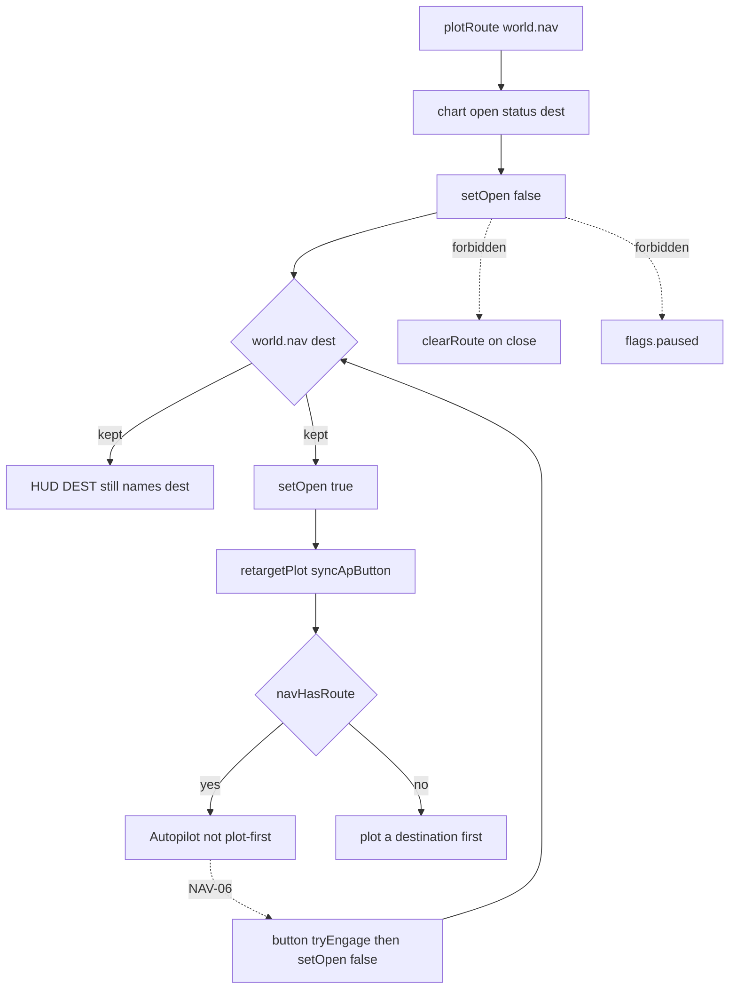

# RIMWARD NAV-11 chart-close dest keep

| Field | Value |
|---|---|
| **Title** | RIMWARD NAV-11 chart-close dest keep |
| **Author** | Wave 137 NAV-11 leftover integrator |
| **Date** | 2026-08-26 |
| **Status** | leftover **CONSUME**. Wave 137 markdown only. Named serial: **none**. Name: **no remaining NAV-11 leftover.** |
| **Wave** | 137 — no `src/`. Bindings do not change here. |
| **Owner request** | Inbox P2 NAV leftover: Keep a plotted route when the chart closes. Census live `setOpen`, close button, `activateSystem`, `plotRoute`/`clearRoute`, dest `<select>`, AP button copy, `world.nav`, save `nav`, Autopilot dest refuse, NAV-06 close-on-AP, Agent plot/clear/engage. Code wins. If plotted dest survives chart close **and** the Autopilot button still names that dest without a fresh plot, freeze leftover **CONSUME** and named serial **none**. Name: **no remaining NAV-11 leftover.** If census finds the live hole (chart close / reopen drops dest, AP button says plot-first, or `world.nav` is idle after close), freeze leftover **REAL** and name later serial **PR1**. |
| **Merge law** | [`out/w137/routepersist/shared-contract.md`](../out/w137/routepersist/shared-contract.md). If this document and that file conflict, **the contract wins**. |
| **Honor** | HUD-01 empty 80 px hub. Aim-glass gauges stay off. Kit mutate omit. Digit 0/8/9 stay. No new Digit. KeyH/J/L/M/P stay. KeyD strafe. CTL-02 hail/chart/berth never write `flags.paused`. CTL-03 berthHold is not this pack. NAV-03/05/06/07/09/10 cite only. Do not steal their PR2s. `state.js` READ-ONLY later. No UU. No SKU. `innerHTML` forbidden later. `reducedMotion`: no new animation that ignores it. Color is not the only cue. Do not “fix” known REDMARCH `castMatches` flake. Do not steal sibling Wave 137 packs (MSN-05 ore guidance, Agent evade). Do not steal optional PR2s: Hail01 / HUD-06 / Hail02 / HUD-07 / NAV-09 / NAV-10 governor / TGT-07 stills / MSN-04 other families / CTL-03 / AI-05 / CTL-04 / Agent API in-repo LLM / pad 2B. Do not pause. Do not teleport. Do not remap keys. Prototype-safe: authored literals only. Never for-in into world. Fail closed: never throw from chart close/open; missing nav bag → idle, not crash. |

**Verifier record:**

| Note | Path |
|---|---|
| Inventory (code wins; Wave 137 census) | [`out/w137/routepersist/current-nav11-route-persist-inventory.md`](../out/w137/routepersist/current-nav11-route-persist-inventory.md) |
| Merge law | [`out/w137/routepersist/shared-contract.md`](../out/w137/routepersist/shared-contract.md) |
| Wave 137 security review | [`out/w137/routepersist/security-review.md`](../out/w137/routepersist/security-review.md) |
| Wave 137 design-doc review | [`out/w137/routepersist/code-review.md`](../out/w137/routepersist/code-review.md) |
| Wave 137 UI audit | [`out/w137/routepersist/ui-audit.md`](../out/w137/routepersist/ui-audit.md) |
| Wave 137 notes | [`out/w137/routepersist/notes.md`](../out/w137/routepersist/notes.md) |

Siblings MSN-05 ore guidance, Agent evade, Hail01, HUD-06, Hail02, HUD-07, NAV-09, NAV-10, TGT-07, MSN-04, CTL-03, AI-05, CTL-04, Agent API, pad 2B, wishlist, and `PROGRESS.md` are **other workers**. **Do not edit** those paths. **Do not** write `src/`. **Do not** steal sibling Wave 137 paths. **Do not** write `out/w137/routepersist/verify/**`.

**This is not NAV-03 Autopilot fly.** **This is not NAV-06 auto-close-on-AP.** **This is not NAV-09 zoom/filter.** **This is not NAV-10 SLOW cue.** **This is not Agent pad 2B.** Wishlist chart-close dest keep is **INBOX**. Census finds dest **already kept**.

---

## Overview

Inbox source (`docs/PLAYER-EXPERIENCE-WISHLIST.md` Playtest capture 2026-08-25 second pass — **cite, do not edit**):

> INBOX (P2, NAV): Keep a plotted route when the chart closes. A plotted "Veridian Reach · 1 jump" route was gone after closing and reopening the chart without engaging, and the Autopilot button read "plot a destination first". A plotted route should persist until cleared or replaced.

Wave 137 this worker lands markdown only. Bindings do not change here.

Census (code wins): `nav.js` owns `world.nav` (**4–6**). `plotRoute` writes dest/path/remaining/status with `autopilot: false` (**48–55**, **279–300**). `clearRoute` deletes the bag (**271–275**). Galaxy Chart `setOpen(false)` hides the overlay, resets zoom/pan, clears hover, and blurs (**935–962**). It does **not** call `clearRoute`. Close button (**1197**), KeyM, Escape, docked auto-close, and NAV-06 Autopilot-button success (**1167–1168**) all use that same `setOpen(false)`. `update()` always `retargetPlot` + `syncApButton` from the live bag (**1375–1376**), chart closed or not. Plot-first aria is only when `!navHasRoute` (**1129–1134**). `save.js` already persists `'nav'` (**107–108**). Restore omit is idle (**1205–1206**); keep heals AP false (`sanitizeNav`). Leftover is **CONSUME**.

This leftover is **chart-close dest keep**. It is not a new Digit. It is not pad Autopilot. It is not zoom/filter. It is not SLOW.

This document is the integrator. Because leftover is CONSUME, a later implementation wave **does not ship** dest-keep `src/`.

HUD-01 empty aim glass stays empty. `state.js` stays READ-ONLY. No new persist key. Digit 0/8/9 stay. KeyH/J/L/M/P stay. KeyD stays strafe. Do not invent UU. Do not steal NAV-03/06/09/10.

Wave 137 deputize (recorded here and in the contract; owner may override after playtest): **CONSUME**. Do not invent dest-keep work. If a later true dest-drop census re-opens REAL, deputize **UI re-sync on reopen**, not a new WORLD_FIELD. Do not park.

If census had found close/reopen dropping dest, AP plot-first, or idle `world.nav` after close, this pack would freeze **REAL** and name serial **PR1**. Census did not. That REAL path is unexpected.

---

## Background & Motivation

### Current state (inventory)

Source of truth: [`out/w137/routepersist/current-nav11-route-persist-inventory.md`](../out/w137/routepersist/current-nav11-route-persist-inventory.md). Code wins.

| Surface | Today | Cite |
|---|---|---|
| Bag owner | `world.nav` | `nav.js` **4–6** |
| Write | dest/path/remaining/status; AP false | `nav.js` **48–55** |
| Plot / clear | `plotRoute` / `clearRoute` | `nav.js` **271–300** |
| Chart click | `activateSystem` | `galaxychart.js` **1188–1194** |
| Dest list | `#rw-galaxy-dest` | **276–278**, **1204–1208** |
| Status | `{name} · {n} jump(s)` | **1060–1063** |
| `setOpen` close | hide; `resetView`; `clearHover`; blur | **935–962** |
| Close button | `setOpen(false)` | **1197** |
| Per-frame paint | `retargetPlot` + `syncApButton` | **1375–1376** |
| AP plot-first | `!navHasRoute` only | **1129–1134** |
| AP engage dest | `noDest` refuse | `autopilot.js` **24**, **184–188**, **218–223** |
| NAV-06 | button success `setOpen(false)` | `galaxychart.js` **1167–1168** |
| Persist | `WORLD_FIELDS` `'nav'` | `save.js` **107–108** |
| Restore omit | delete bag | `save.js` **1205–1206** |
| Overlay pause | **never** | `overlay-policy.js` **4** |
| Agent plot/clear/engage | live acts | `agent-api.js` **206–223**, **317–326** (cite only) |
| Veridian example | name + 1-jump from Freehold | `authored-systems.js` **44**, **61–63** |

The player who plots Veridian Reach, closes the chart without Autopilot, and reopens already has dest + path + status + dest `<select>` + Autopilot ready (not plot-first). HUD DEST still names the dest while the map is closed (`hud.js` **2394–2434**).

### Pain points

- A naive later PR that “keeps dest on close” would **double-ship** NAV-01 persist.
- A naive later PR that adds a second WORLD_FIELD fights `save.js` `'nav'` and restore omit.
- A naive later PR that skips `setOpen(false)` on Autopilot **steals NAV-06**.
- A naive later PR that flies the dest from close **steals NAV-03**.
- A naive later PR that keeps zoom/filter across close **steals NAV-09** (view reset is session).
- A naive later PR that writes `flags.paused` on close fights CTL-02.
- A naive later PR that claims `agent-api.js` steals pad 2B / Agent API.
- `innerHTML` of system names is XSS.
- Treating the 2026-08-25 playtest as live against Wave 85+ `world.nav` invents REAL work the census forbids.

### Why now (design) / why not now (code)

The owner asked for the NAV-11 leftover integrator so a later serial does **not** add a dest bag that already exists. Inventory shows close does not idle `world.nav` and AP is not plot-first after a live plot. Merge law can exist without touching `src/`. Implementation does **not** wait — it **does not ship**. Wave 137 this worker does not write `src/`.

If census had proved dest drop on close, this pack would freeze **REAL** and name serial **PR1**. Census did not.

---

## Goals & Non-Goals

### Goals

1. Document live `setOpen`, close button, plot/clear, dest `<select>`, AP copy, `world.nav`, save `nav`, Autopilot dest refuse, NAV-06 close, Agent plot/clear/engage from **live code**.
2. Freeze leftover as **CONSUME** (not REAL). Name **no remaining NAV-11 leftover.**
3. Freeze **reuse** of live `world.nav`. No new persist key.
4. Freeze NAV-03/05/06/07/09/10 as **cite-only**. Do not invert button close.
5. Freeze overlay mutex, Agent API, pad 2B, ore guidance, evade as **sibling — do not steal**.
6. Freeze no new Digit, no `state.js` write, no UU, no third helm, no pause, no teleport.
7. Freeze a serial PR plan with **no implementation PR1**.
8. Freeze fail-closed: never throw from close/open; missing bag idle.

### Non-goals (locked — do not reopen)

- No `src/` or live bindings in this worker.
- No `flags.paused` write.
- No NAV-03 pad/system fly rewrite. No NAV-06 invert. No NAV-09 zoom persist. No NAV-10 SLOW.
- No Agent `agent-api.js` claim. No pad 2B.
- No new WORLD_FIELDS. No `state.js` write. No new Digit.
- No teleport. No third helm. No key remap.
- Do not edit the wishlist, `PROGRESS.md`, sibling docs.
- Do not write `out/w137/routepersist/verify/**`.
- Do not fix REDMARCH `castMatches`.
- Do not steal sibling Wave 137 packs.

---

## Proposed Design

### 1. Merge resolutions (contract wins)

| Question | Integrator freeze | Why |
|---|---|---|
| Leftover real? | **No** | Inventory §0 / §10 |
| CONSUME? | **Yes**. Serial **none** | Dest survives; AP not plot-first |
| New persist key? | **No** | `'nav'` already live |
| `state.js` write? | **No** | Honor |
| Use `flags.paused`? | **No** | CTL-02 |
| Clear dest on close? | **No** | That **is** the named hole |
| Invert NAV-06 close? | **No** | Cite only |
| Agent API write-set? | **No** | Cite only |
| Deputize | **CONSUME**; later REAL → UI re-sync | Smaller than new WORLD_FIELD |
| Named PR1? | **none** | CONSUME leftover |

### 2. Current chart-close dest motion (do not break persist / NAV-06)

Live: player plots; `world.nav` holds dest; close hides chart; bag stays; reopen paints bag; AP ready if dest+path; Clear or replace drops dest; Autopilot **button** success closes chart and keeps dest (NAV-06 + NAV-01).

### 3. Deputize table (copy of contract §0.1)

Owner may override after playtest. Do not park.

| Knob | Value |
|---|---|
| Leftover | **CONSUME** |
| Serial | **none** |
| Channel | existing `world.nav` |
| Close | must not `clearRoute` (already) |
| Reopen | per-frame retarget (already) |
| New WORLD_FIELD | **no** |
| If later REAL | `setOpen(true)` `retargetPlot(true)` + `syncApButton` only |
| Card / pause / Fear | never |
| Home | none this wave |

### 4. Neighbours

| Module | This leftover does | This leftover does not |
|---|---|---|
| `galaxychart.js` | census `setOpen` / AP / dest | NAV-06 invert; NAV-09 zoom persist; `innerHTML` |
| `nav.js` | census owner of `world.nav` | new bag shape; teleport |
| `save.js` | census `'nav'` | new WORLD_FIELD |
| `autopilot.js` | census `noDest` | fly rewrite |
| `agent-api.js` | cite plot/clear/engage | claim file; pad 2B |
| `state.js` | none | write |
| Overlay | none | `paused`; `berthHold` |
| HUD | census DEST readout | NAV-10 SLOW; hub pip |

### 5. Serial PR plan

Matches contract §3. **Named only. Do not implement in Wave 137.**

| PR | Lands | Does not land |
|---|---|---|
| **none** | no `src/` | dest-keep feature; persist key; Digit |
| **PR1 UI re-sync (only if later census REAL)** | reopen force retarget | new WORLD_FIELD; close-clears; NAV-03/06 steal |
| **PR2 census (optional skip)** | re-grep `setOpen` vs `clearRoute` | new world field |

First remaining serial is **none**.

### 6. Picture

Reuse live Galaxy Chart. Plot Veridian Reach. Status reads `Veridian Reach · 1 jump`. Close with × or KeyM. `world.nav` stays. HUD DEST still names Veridian Reach. Reopen. Dest list still Veridian Reach. Autopilot is Autopilot, not plot-first. Clear still clears. Replace still replaces. Autopilot button success still closes the map (NAV-06) and still keeps dest. Pause is still P.

---

## Player outcome (later serial; freeze here)

There is **no** later dest-keep serial while CONSUME stands.

You plot Veridian Reach from Freehold (1 jump). You close the chart without Autopilot. You reopen. The route is still there. Autopilot does not tell you to plot first.

`reducedMotion` adds no pulse. Color is not the only dest cue (name + jump count in text).

**NAV-03** is **not** this work. **NAV-06** is **not** this work. **NAV-09** is **not** this work. **NAV-10** is **not** this work. **Agent API** is **not** this work.

---

## Security

See [`out/w137/routepersist/security-review.md`](../out/w137/routepersist/security-review.md).

- XSS: no `innerHTML` for dest names. Authored / `sanitizeSystemId` + `textContent`.
- Agent: cite only; no new acts.
- Persist: no new key. Restore still `autopilot: false`.
- Overlay: never `flags.paused`.
- Teleport: no `currentSystem` write from chart close.
- Fail-closed: never throw from close/open; missing bag idle.

---

## Acceptance direction (implementation wave)

CONSUME: no dest-keep PR to accept. Live already:

1. After `plotRoute` to a charted dest, `world.nav.dest` is that id and status is `plotted` or `blocked`.
2. `setOpen(false)` does not `clearRoute` / `dropNav`.
3. Reopen without a second plot: dest `<select>` still that id (plotted/blocked); status still names dest + jumps when plotted.
4. Autopilot button aria is **not** plot-first while `navHasRoute`.
5. Clear / plot-here / Agent `clearRoute` still idle the bag.
6. Restore omit nav is idle. Restore keep does not resume flying AP.
7. NAV-06 button success still `setOpen(false)` and still keeps dest.
8. No new `WORLD_FIELDS`. No `innerHTML`. No `flags.paused` from chart.
9. HUD-01 hub empty. Digit 0/8/9 unchanged. Keys unchanged.
10. REDMARCH `castMatches` untouched.

If a later REAL PR1 UI re-sync ships: `setOpen(true)` must force retarget + AP sync; must not throw; missing bag idle.

---

## Alternatives considered

| Alternative | Why not |
|---|---|
| Freeze REAL / serial PR1 | Census: dest survives; AP not plot-first |
| New WORLD_FIELD `chartDest` | `world.nav` already exists |
| `clearRoute` on close then replot | That **is** the inbox hole |
| Keep chart open to “keep dest” | Steals NAV-06; dest already persists |
| Persist `flags.chartOpen` | Session flag; not dest |
| Persist-resume `autopilot: true` | NAV-03 forbid |
| Agent-only dest keep | Human chart already keeps |
| Dest name on AP button chrome | Steals NAV-03/05 copy; dest already named on status/select/HUD |
| Pause on close | CTL-02 |
| Teleport to dest on plot | Forbidden |

---

## Regression risks

| Risk | Mitigation |
|---|---|
| Later worker treats wishlist INBOX as REAL | Contract CONSUME; code wins |
| New persist key | Forbidden |
| NAV-06 invert | Cite only |
| Close throws | Live try/catch; freeze never-throw |
| XSS dest name | `textContent` + sanitize |
| Digit 0/8/9 | no new Digit |
| REDMARCH boot flake | do not “fix” |
| Sibling ore / evade steal | write-set none |

---

## Ownership

| Object | Writer | Reader |
|---|---|---|
| `world.nav` dest/path | live `nav.js` `plotRoute` / `clearRoute` | chart, AP, HUD, save |
| `flags.chartOpen` | live `galaxychart.js` `setOpen` | overlay, AP steer latch |
| AP button copy | live `syncApButton` | player |
| `flags.paused` | **none** (KeyP) | overlay |
| `agent-api.js` | **none** (cite) | — |
| Autopilot fly | **none** (NAV-03) | — |
| `state.js` | **none** | SYSTEM names |
| NAV-06 close | live AP **button** | player |

---

## Open owner questions

**Deputized this wave** (contract §0.1). Owner may override after playtest. Do not park.

1. Leftover is **CONSUME**. Serial is **none**, not PR1.
2. Do not add a persist key. `world.nav` is enough.
3. If playtest still *sees* dest gone while the bag is live, later REAL is UI re-sync on reopen only.
4. Do not invert NAV-06. Do not fly on close.
5. Home: none this wave. Later REAL home is `galaxychart.js` `setOpen(true)` only.

---

## Key Decisions

| Decision | Freeze |
|---|---|
| Leftover | **CONSUME** |
| Serial | **none** (not PR1) |
| REAL | **No** |
| Deputize | do not invent dest-keep; later REAL = UI re-sync |
| Channel | existing `world.nav` |
| New persist | no |
| Close | must not clear dest (already) |
| NAV-06 | stays |
| Agent API | cite only |
| Keys | unchanged |

---

## PR Plan

See Proposed Design §5 and contract §3. First remaining serial is **none**. Optional later PR1 UI re-sync exists **only** after a true dest-drop census.
