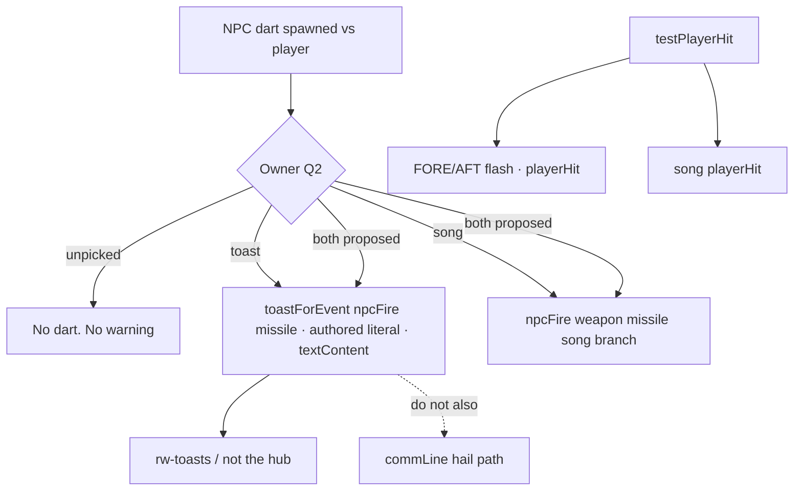
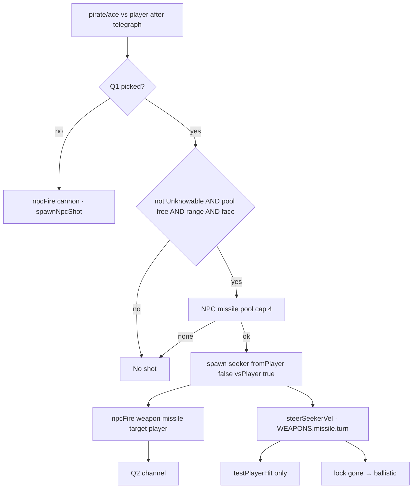
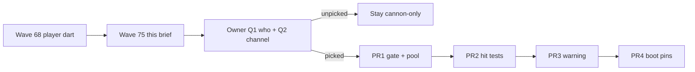

# RIMWARD NPC missiles and incoming warning

| Field | Value |
|---|---|
| **Title** | RIMWARD NPC missiles and incoming warning |
| **Author** | Wave 75 NPC-missiles integrator |
| **Date** | 2026-08-20 |
| **Status** | Wave 83 impl. |
| **Wave** | 75 — design. Q1/Q2 closed Wave 82. Later — impl. |
| **Owner request** | Integrator brief so some NPCs may fire darts and warn the player **without** a new aim-glass gauge. Do not ship `src/` here. |
| **Merge law** | [`out/w75/npc-missiles/shared-contract.md`](../out/w75/npc-missiles/shared-contract.md). If this brief and that file conflict, the contract wins. |

**Historical note:** [`docs/Shp03WeaponsDesign.md`](Shp03WeaponsDesign.md) is the Wave 67/68 **player weapons** record. Its non-goals still say no NPC missiles in the first impl, so the “no incoming gauge” decision would not lie. That freeze applied to Wave 68. **This document supersedes that freeze for a later implementation wave only**, the same way SHP-03 superseded ShpDesign’s no-missiles freeze. Do **not** edit `docs/Shp03WeaponsDesign.md`. Do not treat Wave 68 as incomplete.

**Verifier record (this wave):**

| Note | Path |
|---|---|
| Inventory (code wins) | [`out/w75/npc-missiles/current-npc-missiles-inventory.md`](../out/w75/npc-missiles/current-npc-missiles-inventory.md) |
| Merge law | [`out/w75/npc-missiles/shared-contract.md`](../out/w75/npc-missiles/shared-contract.md) |
| Security review | [`out/w75/npc-missiles/security-review.md`](../out/w75/npc-missiles/security-review.md) |
| Design-doc review | [`out/w75/npc-missiles/code-review.md`](../out/w75/npc-missiles/code-review.md) |

---

## Overview

The player already seats a dart rack (group 4, pool 8, hangar ammo). NPCs still fire cannon only. HUD-01 / HUD-02 already reject a lock box and an incoming gauge on the aim glass. TGT-03 still names missile warnings.

This brief is the integrator document for a **later** implementation wave that may let **some** NPCs fire darts and warn the player on an **existing** off-column channel. Wave 75 lands this markdown only. NPC missiles do not ship here.

**Closed Wave 82** — [`docs/OwnerDecisionsWave82.md`](OwnerDecisionsWave82.md). Q1 = `pirate` + `ace`. Q2 = toast + song, no `commLine`. Cadence = one dart after hunt telegraph, then cannon. Pool 4. `vsPlayer` only. Impl is a later serial (not Wave 82). Until that serial, live NPCs stay cannon-only.

HUD-02 stays closed. Digit 0 stays Shipyard. Digit 8/9 stay player launcher / turret papers. `state.js` stays READ-ONLY. Power ledger stays out. Chaff stays out. NPC `auto` turret stays out.

---

## Background & Motivation

### Current state (inventory)

Source of truth: [`out/w75/npc-missiles/current-npc-missiles-inventory.md`](../out/w75/npc-missiles/current-npc-missiles-inventory.md). Code wins over stale comments.

| Surface | Today | Cite |
|---|---|---|
| Player dart | `WEAPONS.missile` + `LAUNCHER_IDS.dart`. Group 4. Seeker + ballistic. Pool 8. Spend ammo on spawn only. | `state.js` 109–114; `weapon-fit.js` 33–44; `combat.js` 165, 199–224, 515–545, 1117–1175 |
| Unknowables | Non-beam miss. Dart is not a beam. Skip in `testNpcHits`. | `state.js` 167–171; `combat.js` 1458–1459 |
| Missile tick | Always `testNpcHits`. Never `testPlayerHit` (player-only darts). | `combat.js` 1722–1738 |
| NPC fire | `npcFire` cannon only. `spawnNpcShot` → 64-bolt pool, ±2°, no seeker. | `npc.js` 1509–1512, 1869–1872; `combat.js` 1230–1250, 1665–1679 |
| Turret `auto` | Player only. NPC still auto-fires cannon. | `combat.js` 1699–1702; `weapon-fit.js` 46–54 |
| HUD WPN 4 | `4 · Dart rack · N` or `4 · —`. `textContent`. | `hud.js` 186–214, 728–730, 1511–1512 |
| `playerFire` | Real spawn only, including `'missile'` | `combat.js` 38–39, 1172; `ctx.js` 219 |
| Empty hub | 80 px. No lock box. | `hud.js` 1004; HUD-01 / HUD-02 |
| FORE/AFT | Flash on `playerHit` (`fromAft`). | `hud.js` 308–336, 942–945, 1156–1175 |
| Toasts / banner | Off aim column. `commLine` prints `text`, not `from`. `npcFire` does not toast. | `hud.js` 397–408, 650–666, 507–508 |
| `commLine` | `say` emits `{ text, from: live.state.name }` | `npc.js` 319–320; `ctx.js` 207 |
| Song | `npcFire` thin bark (no weapon branch). `playerHit` thud. Volley cap 8. | `song.js` 51–68, 131–133 |
| PHY avoid | Lookahead bias. Not dart dodge. No chaff. | `physics.js` 19–20; `npc.js` 587–635 |
| AI hunt | Traders/miners never. Patrols need player scratch or standing. Pirates/aces hunt. `lastAttacker` instance-only. | `npc.js` 226, 1028–1073, 1554–1588 |
| `state.js` WEAPONS | cannon, disruptor, mining, missile, turret | `state.js` 7–9, 96–119 |
| Hangar | Flat `launcher` / `missileAmmo` / `turret`. NPC rows do not exist. | `hangar.js` 53–56, 219–231, 516–529 |

### Pain points

- TGT-03 remaining names missile warnings. HUD-01 / HUD-02 already closed the gauge. Wave 68 therefore forbade NPC missiles so the glass would not lie.
- `spawnNpcShot('missile')` today would spawn a **ballistic** bolt in the gun pool with **no seeker**. A naive `weapon: 'missile'` emit would lie twice: no turn, and it could starve cannon.
- Missile tick never `testPlayerHit`. An NPC dart that reused that loop would pass through the player.
- Wave 57 live split (`combat.js` 1716–1718): NPC-vs-player bolts **do** `testPlayerHit`; NPC-vs-NPC bolts never do. A pirate-vs-trader dart that also tested the player would bruise the hull and could mis-scratch patrols (`lastAttacker`). The header at 35–36 is stale.
- `npcFire` song is a cannon bark. A dart that reuses the type without a branch would lie in the ear.
- There is no live personality/job gate that already means “fires darts.” Inventing a percent would be fanfic.

### Why now (design) / why not now (code)

The owner asked for the integrator brief after the player dart shipped. Inventory and merge law can exist without reopening HUD-02. Implementation waits for owner Q1 (who) and Q2 (toast vs cue), then a serial PR train against this contract.

---

## Goals & Non-Goals

### Goals

1. Inventory of player dart, NPC cannon, HUD glance, events, PHY, AI, hangar — cited from live code.
2. Freeze merge law: no aim-glass gauge; warning on existing off-column channels; reuse dart math; smaller NPC pool.
3. Freeze a fail-closed who-fires subset (proposed pirates + aces) with **default off**.
4. Freeze Unknowables beam-only (player and NPC).
5. Freeze Wave 57 hit-test split for seekers.
6. Freeze zero-alloc pool drop, no chaff, no NPC `auto` turret, no power ledger, `state.js` READ-ONLY, Digit 0/8/9 untouched, `textContent` only.
7. Freeze a serial PR plan. This wave writes markdown only.
8. Name coupling vs SHP-03, HUD-01/02, TGT-05, PHY, AI-04, Unknowables, BIO HUD family.

### Non-goals (locked — do not reopen)

- No `src/` in Wave 75.
- No incoming-missile gauge, lock box, aspect ring, or new `#hud` glance node.
- No chaff SKU. No second player launcher. No NPC player-style `auto` turret. No power ledger.
- No Digit 0 / 8 / 9 edits. No hangar key for NPC racks.
- No `state.js` feature write. No invented fire percent.
- Do not edit `docs/Shp03WeaponsDesign.md`, the wishlist, or `PROGRESS.md`.
- Do not write `out/w75/msn02/` or `out/w75/bio03/`.
- Do not implement NPC missiles in this wave.

---

## Proposed Design

### 1. Merge resolutions (contract wins)

| Question | Integrator freeze | Why |
|---|---|---|
| Incoming gauge / lock box / aspect ring / new glance node? | **Off.** | HUD-01 / HUD-02 closed. Frozen 1. |
| Warning channel? | Existing off-column only. Proposed: **one** HUD toast on missile `npcFire` + song branch. No parallel `commLine` for the same spawn. FORE/AFT stays hit-only. Owner Q2. Default: **no NPC missiles**. | Inventory: toasts off column; `npcFire` does not toast; FORE/AFT is impact. Double toast would flood slots. |
| New ctx event? | Prefer reuse `npcFire { weapon:'missile', target }`. Cap **one** new type, only if reuse would lie. | Frozen event list. |
| Second player launcher SKU? | **No.** Reuse `dart` / `WEAPONS.missile`. | Inventory: one `LAUNCHER_IDS` row. |
| NPC pool? | Separate, smaller. Suggested cap **4**. Drop when exhausted. | Zero-alloc; do not starve player 8. |
| Who fires? | Proposed `pirate` + `ace`. Not trader, miner, patrol (default), Unknowable, Beautiful-as-faction. Owner Q1. Default: **nobody**. | Live `mayHuntPlayer` / `isCivilianRole`. |
| Fire percent? | **Do not invent.** Cadence unset → cannon only. | No live dart dice. |
| Unknowables? | Darts miss. NPCs never fire darts. | Wave 9 / SHP-03 / `applyHit`. |
| Hit test vs player? | `testPlayerHit` only when `vsPlayer`. NPC-vs-NPC: `testNpcHits` only. | Wave 57. |
| First slice vs-NPC darts? | **Out.** Player target only until a later addendum. | Keeps lastAttacker small. |
| Chaff? | **Out.** Warning is the counterplay. | Player has none. |
| NPC `auto` turret? | **Out.** | SHP-03. |
| Power ledger? | **Out.** | SHP-03 Frozen 9. |
| `state.js` / Digit 0/8/9? | READ-ONLY / untouched. | Header + dock law. |
| XSS? | `textContent`. Authored toast literals. No names in HTML. | Prototype-safe. |

### 2. Player outcome (after a later impl, if Q1/Q2 picked)

A pirate or Named Gun that already hunts the player may throw a slow seeker. The glass does not grow a gauge. The player gets an off-column word and/or a song sting, then dodges with the same flight they use against cannon. Unknowable fields still ignore the dart. Traders and miners still mind their work.

If the owner never picks Q1/Q2, this outcome does not ship. Cannon-only NPCs remain honest with the empty hub.

### 3. HUD — closed glass, open off-column

Do not add a child under `#hud` for inbound count. Do not restyle the edge arrow into a missile wedge. Do not paint an aspect diamond in the 80 px hub (`hud.js` 1004).

Living family stays `hudFamily` → `bio` on living hulls (`hud.js` 65–74). Weapons still do not write `hullKind`.

### 4. NPC dart family

Grounded in live combat: dodgeable projectile, capped seeker, pooled mesh, no hitscan (`combat.js` 19–21, 199–224).

#### 4.1 Catalog reuse

First NPC slice uses **`WEAPONS.missile` as shipped** (damage 22, speed 260, range 720, turn 0.85). Not persist. Not a new hangar id.

A damage/ROF fork needs a dedicated `state.js` PR **before** fire. Default: no fork.

Do not add `LAUNCHER_IDS.npcDart`. Do not spend `ctx.world.missileAmmo`.

#### 4.2 Spawn (must not use `spawnNpcShot`)

`spawnNpcShot` (`combat.js` 1230–1250) writes the 64-bolt pool and never sets `lock`. Forbidden for darts.

NPC spawn must:

1. Allocate from the **NPC** missile pool (suggested 4).
2. `fromPlayer = false`, `shooter = live`, `vsPlayer = (aim === player)`.
3. `lock` = player object (first slice) or live ship (later).
4. Drop when the pool is busy. No heat. No hangar write.
5. Emit `npcFire` with `weapon: 'missile'` and **explicit** `target`. First slice: ace vs player copies `target: 'player'`. **Missing-target-means-player is forbidden for missiles** (`combat.js` 1672–1675 is cannon-only). Ace cannon may omit `target` (`npc.js` 1872); darts must not. If a missile emit lacks `target`, drop the shot. Do not aim the player.

Reuse `steerSeekerVel`. Module scratch already exists (`combat.js` 160–162).

#### 4.3 Hit tests

Live bolt split is `combat.js` 1716–1718: `(fromPlayer || !vsPlayer) ? testNpcHits : testPlayerHit`.

| Shot | Hit test |
|---|---|
| Player shot | `testNpcHits` |
| NPC vs player (`vsPlayer`) | `testPlayerHit` |
| NPC vs NPC | `testNpcHits`. **Never** `testPlayerHit` |

The file header at `combat.js` 35–36 (“Player-aimed bolts use testPlayerHit only; ship-aimed bolts use testNpcHits and never testPlayerHit”) is **stale**. Do not treat it as law. Wave 57 lastAttacker / no player bruise from ship-vs-ship lives in the 1716–1718 split, not that sentence.

Missile tick today always `testNpcHits` (`combat.js` 1738) because only the player fires darts. Later NPC dart tick uses the **same split as bolts**:

- **NPC dart vs player:** `vsPlayer === true` → `testPlayerHit` (`combat.js` 1566–1582). True radius `PLAYER_HIT_RADIUS` 2.4, no padding. Facet from shooter vs player nose. `applyHit` on `ctx.player`. Emit `playerHit { damage, family, fromAft }`. This **is** a player-target shot.
- **NPC dart vs NPC:** `vsPlayer === false` → `testNpcHits` only. Skip shooter. Skip Unknowables (do not consume). Stamp `lastAttacker` to `p.shooter` or `'npc'`, **never** `'player'`. **Never** `testPlayerHit`.
- **Player dart:** unchanged. `testNpcHits` only (`combat.js` 1738).

Do not call `testPlayerHit` unless `vsPlayer` is true.

First impl: emit missile `npcFire` only with **explicit** `target: 'player'`. Ace vs player copies that field. Do **not** omit `target`. Do **not** use missing-target-means-player. Ship-vs-ship darts wait.

#### 4.4 Who fires

Live role gate (`npc.js` 1061–1073), not a new personality dice.

| Role | Cannon today | Dart (this brief) |
|---|---|---|
| `trader` | never hunts | **never** |
| `miner` | never hunts | **never** |
| `patrol` | if player scratch or standing ≤ −10 | **off** (fail closed) |
| `pirate` | interest roll / scratch | **proposed on** vs player |
| `ace` (incl. Named Guns) | duel | **proposed on** vs player |
| Unknowable any role | beam-only fiction | **never** |
| Beautiful faction | no special hunt | **no grant**; only if pirate/ace and Q1 on |

Telegraph before first shot stays. Darts do not break demand-hold weapons-cold (`npc.js` 1508).

**Q1 blocks impl.** Unpicked → no missile `npcFire`.

### 5. Incoming warning

TGT-03 “missile warnings” are satisfied **off the glass**, or not at all.

**Proposed (Q2):**

1. On successful NPC dart spawn vs player: **one** HUD toast via `toastForEvent('npcFire')` when `weapon === 'missile'` and `target === 'player'`. Copy is an authored constant (example: `Incoming dart.`). Throttle so a volley does not fill five slots (reuse toast `key` or a 2.5 s gap like `sunHeat`).
2. Do **not** also `say()` / `commLine` for that spawn. Hail stays voice. Two toasts for one dart would lie about urgency and can overwrite `TOAST_SLOTS` 5 (`hud.js` 52, 656).
3. Song: branch `npcFire` when `weapon === 'missile'` to a distinct short sting. Keep the volley cap (`song.js` 131–133) so dart stings cannot stack on cannon barks without bound.
4. FORE/AFT: **hit-only** (`playerHit`). Do not flash inbound unless the owner reopens glance-without-node.

HUD must use `textContent` (`hud.js` 924). Must not print `e.from`, `e.ship.state.name`, or any record name.

**Q2 blocks impl.** Unpicked → no darts (so the missing warning does not lie).

Reuse `npcFire` so a new frozen type is unnecessary. Add one new type only if the impl owner rejects a `weapon` branch in toast/song **and** also rejects `commLine`. Payload then: `{ vsPlayer: true }` only — no name strings.

### 6. Counterplay

No chaff. PHY avoid does not see seekers (`npc.js` 587–635). Player counterplay is:

- the warning (new);
- flight / afterburner already shipped;
- the dart’s slow speed and capped turn (already authored for the player rack).

Do not add Digit equipment. Do not add a scanner-tier gate that reopens TGT-03 as a glass instrument.

### 7. Architecture (ctx ownership)

| Channel | Writer | Reader |
|---|---|---|
| `npcFire` | `npc.js` | combat spawn; song; optional HUD toast branch |
| missile pool NPC | `combat.js` | combat only |
| `playerHit` | `combat.js` `testPlayerHit` | HUD FORE/AFT, song |
| `commLine` | `npc.js` (if used for warn) | HUD toast (`text` only) |
| `world.launcher` / `missileAmmo` | hangar / player combat | player fire / HUD — **NPC must not write** |
| `hullKind` / HUD family | SHP / save | HUD read |
| Digit 0/8/9 | station / shipyard | closed |

Combat may write NPC pool slots. Combat may not spend player ammo for NPC shots.

`ctx.js` comment: document `npcFire.weapon` `'cannon' \| 'missile'` when PR1/PR3 land. Default: no new event type.

---

## API / Interface Changes

No public API change in Wave 75.

Later implementation wave (after Q1/Q2):

| Surface | Change |
|---|---|
| `src/game/state.js` | **No write** unless a dedicated catalog fork PR is scheduled first. Default: none. |
| `src/systems/npc.js` | Gate + `npcFire` `{ weapon:'missile', target:'player' }` for the subset. Unknowable skip. Telegraph honored. |
| `src/systems/combat.js` | NPC missile pool. Spawn ≠ `spawnNpcShot`. Missile tick `vsPlayer` split. |
| `src/systems/hud.js` | Optional toast branch. **No new nodes.** `textContent`. |
| `src/systems/song.js` | `npcFire` weapon branch. |
| `src/core/ctx.js` | Comment: `npcFire` weapon. Event list unchanged by default. |
| `src/game/hangar.js` / `weapon-fit.js` | **No change.** |
| `src/systems/station.js` | **No Digit change.** |
| `scripts/boot-test.mjs` | Pins: HUD tree, Unknowable miss, lastAttacker, pool drop. |

---

## Data Model Changes

Wave 75 adds **no** persist keys.

Later: **none** required. NPC darts are instance combat. Do not park NPC ammo on records.

| Field | Owner | Persist | Rule |
|---|---|---|---|
| Player `launcher` / `missileAmmo` | SHP-03 | Hangar row | Unchanged |
| NPC pool slots | combat | **No** | Cap 4 suggested |
| `input.weaponGroup` | controls | **No** | NPCs ignore |
| `ai.lastAttacker` | combat stamp | **No** | Wave 57 law |
| `sessionStorage` dart debug | forbidden as save | Session only if ever added | Never hangar |

---

## Alternatives Considered

### Gauge

**Alt G1 — Hub lamp while a seeker exists.**  
Rejected. HUD-01 empty hub. HUD-02 non-goal. Would reopen Wave 68’s reason for no NPC missiles.

**Alt G2 — Contacts-arc pip restyle for inbound.**  
Rejected as a **glance change**. TGT-03 remaining is not a license to paint the glass. The arc is scanner-gated and friend/foe, not a missile timer.

**Chosen:** off-column toast and/or song. FORE/AFT stays impact-only unless owner reopens.

### SKU

**Alt S1 — `LAUNCHER_IDS.npcDart` + hangar-like ammo on records.**  
Rejected. Not a player SKU. Persist would reopen sanitize for every NPC record.

**Alt S2 — New `WEAPONS.npcMissile` in the same feature PR.**  
Rejected. `state.js` READ-ONLY. Default reuse `WEAPONS.missile`. Fork only in a dedicated catalog PR.

**Chosen:** reuse seeker math, smaller pool.

### Who fires

**Alt W1 — Every hull that can cannon.**  
Rejected. Widens AI-04. Traders/miners must stay civilian. Patrols already have a narrow player-hunt gate; darts on every scratched patrol is a later owner call (default off).

**Alt W2 — Random percent on personality.**  
Rejected. Personality is resolve (`npc.js` 1256–1261). No live dart dice. Unset cadence → off.

**Chosen:** proposed pirates + aces vs player. Default nobody until Q1.

### Hit test

**Alt H1 — Missile tick always `testNpcHits` + `testPlayerHit`.**  
Rejected. Wave 57: ship-vs-ship must not hit the player. Double test would let friendly-fire darts clip the hull.

**Chosen:** same split as live bolts (`combat.js` 1716–1718): `vsPlayer` → `testPlayerHit`; else `testNpcHits`. Never `testPlayerHit` on NPC-vs-NPC. Not the stale header at 35–36.

---

## Security & Privacy Considerations

See [`out/w75/npc-missiles/security-review.md`](../out/w75/npc-missiles/security-review.md).

| Risk | Severity | Mitigation |
|---|---|---|
| XSS via attacker name in toast | **High** | Authored literals. `textContent`. Do not print `from` / `state.name` |
| `innerHTML` of comm copy | **High** | Forbidden. Live HUD already `textContent` (`hud.js` 924) |
| `spawnNpcShot('missile')` ballistic lie + bolt-pool starve | **Medium** | Separate NPC seeker pool. Explicit spawn path |
| Ship-vs-ship dart `testPlayerHit` | **Medium** | `vsPlayer` split. First slice player-target only |
| Unknowable dart damage / Unknowable NPC darts | **Medium** | `applyHit` + emit gate |
| Prototype payload | **Low** | No persist. Object refs in `npcFire.ship` already live; do not index by name strings |
| `sessionStorage` debug as save | **Low** | Forbidden |

Threat model: local browser game. Fail closed on role, faction, pool, and hit-test split.

---

## Observability

No production metrics stack. Acceptance is Playwright / boot pins in the impl wave.

| Signal | How |
|---|---|
| HUD tree | `initHud` child count / no new class for inbound gauge |
| Unknowables | Dart vs Unknowable hull: no hull delta; NPC Unknowable never emits missile `npcFire` |
| Wave 57 | NPC dart vs NPC: player hull unchanged; `lastAttacker !== 'player'` |
| Pool | 9th NPC dart dropped; player pool 8 still fires |
| XSS | Toast node `textContent` equals authored literal |
| Default off | Unpicked Q1: zero missile `npcFire` |

---

## Rollout Plan

Wave 75: this document only.

Later implementation is **serial**. Do not start PR1 until Q1 is picked. Do not start PR3 until Q2 is picked. Unpicked → NPC missiles stay off.

| PR | Owner files | What | Touches `state.js`? |
|---|---|---|---|
| **PR0** | boot pins / comments | Inventory pins. Record Q1/Q2. | No |
| **PR1** | `npc.js`, `combat.js` | Fire gate + NPC pool + spawn ≠ `spawnNpcShot` | No |
| **PR2** | `combat.js` | Missile tick `vsPlayer` split. Unknowable skip. lastAttacker | No |
| **PR3** | `hud.js` and/or `song.js`, `ctx.js` comment | Warning channel. Cap one new event if reuse lies | No |
| **PR4** | `scripts/boot-test.mjs` | HUD / miss / lastAttacker / pool / textContent pins | No |

Do not parallel-edit `hud.js` glance layout with a HUD-03 wave. Do not open Digit 8/9.

Rollback: revert the failed PR. Player dart and hangar keys stay.

---

## Open questions (block impl only)

| ID | Question | Proposed | Default until picked |
|---|---|---|---|
| **Q1** | Who fires darts? | `pirate` + `ace` vs player. Not trader/miner/patrol. Not Unknowable. No Beautiful faction grant. | **No NPC missiles** |
| **Q2** | Cue vs toast? | One HUD toast from missile `npcFire` (authored literal) + song branch. No parallel `commLine`. FORE/AFT hit-only. | **No NPC missiles** (so a missing warning cannot lie) |

Cadence mix (cannon vs dart ROF), ship-vs-ship darts, patrol darts, and a `state.js` damage fork are **not** asked here. They stay later. Unset → off / reuse / out.

---

## Coupling

| Brief | Coupling |
|---|---|
| SHP-03 / Wave 68 | Player dart shipped. This brief supersedes “no NPC missiles” **for a later impl only**. Do not edit `docs/Shp03WeaponsDesign.md`. Digit 8/9 and `LAUNCHER_IDS.dart` stay. |
| HUD-01 / HUD-02 | Empty hub, no lock box, no incoming gauge, toasts/banner off aim column. Living family skins stay. |
| TGT-03 remaining | Missile warnings = off-column channel, not a sensor SKU on glass. |
| TGT-05 | Player seeker lock remains `ctx.targets.current`. NPC dart lock is the aim object. No new player lock box. |
| PHY | Avoid is lookahead, not chaff, not seeker bodies. |
| AI-04 | Do not widen who hunts. Darts ride existing pirate/ace (proposed). |
| Unknowables | Beam-only. Darts miss. NPCs do not fire darts. |
| BIO living HUD | No new glance node. `hudFamily` still follows `hullKind`. Abominations (later) must not sneak Beautiful-faction darts. |
