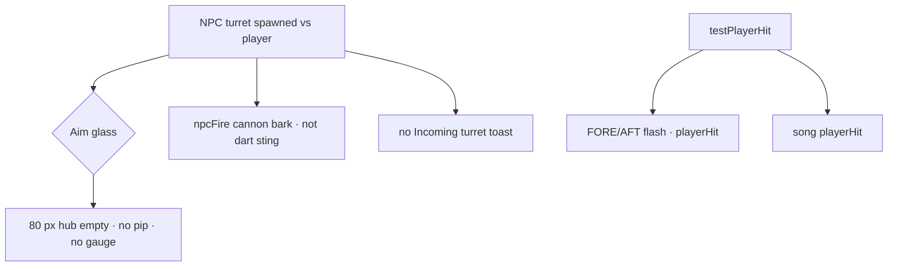
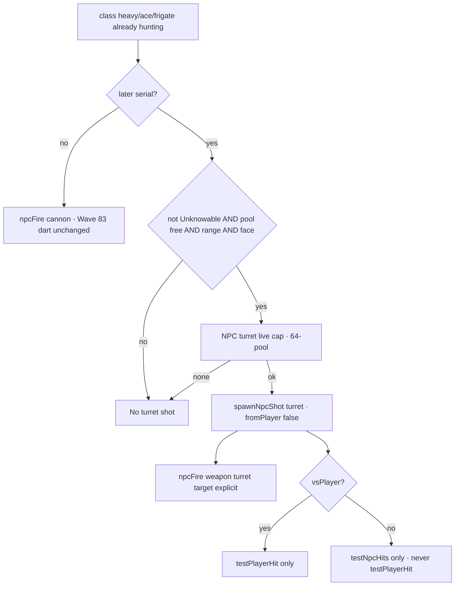

# RIMWARD NPC turrets

| Field | Value |
|---|---|
| **Title** | RIMWARD NPC turrets |
| **Author** | Wave 97 NPC-turrets integrator; Wave 98 owner close; Wave 99 vsPlayer; Wave 101 vsNPC deputize |
| **Date** | 2026-08-23 |
| **Status** | Wave 101 vs already-hostile NPC (deputize). Q1 stays closed as Wave 98. Do not reopen Q1. Q2 “later” is ON via [`docs/OwnerDecisionsWave101.md`](OwnerDecisionsWave101.md). |
| **Wave** | 101 — vsNPC against Wave 98 merge law + Wave 99 vsPlayer. |
| **Owner request** | Player auto-turret SKU `auto` exists (Wave 68). Wishlist TGT-04 says NPC turrets later. Integrator brief so some NPCs may fire a player-style `auto` bolt **without** a new aim-glass gauge. Do not ship `src/` here. Do not treat Wave 68 or Wave 83 as incomplete. Wave 98 binds Q1/Q2. |
| **Owner line** | [`docs/OwnerDecisionsWave98.md`](OwnerDecisionsWave98.md). Binding. |
| **Merge law** | [`out/w98/turrets/shared-contract.md`](../out/w98/turrets/shared-contract.md). If this brief and that file conflict, the contract wins. Wave 97 pack: [`out/w97/turrets/shared-contract.md`](../out/w97/turrets/shared-contract.md) (superseded on Q1/Q2). |

**Historical note:** [`docs/NpcMissilesDesign.md`](NpcMissilesDesign.md) is the Wave 75/83 **NPC darts** record. Its freeze still says no NPC player-style `auto` turret, so the empty hub would not lie. That freeze applied to the dart serial. **This document supersedes that freeze for a later implementation wave only**, the same way `docs/NpcMissilesDesign.md` superseded `docs/Shp03WeaponsDesign.md` for NPC darts. Do **not** edit `docs/NpcMissilesDesign.md` or `docs/Shp03WeaponsDesign.md`. Do not treat Wave 68 or Wave 83 as incomplete.

**Verifier record:**

| Note | Path |
|---|---|
| Owner close | [`docs/OwnerDecisionsWave98.md`](OwnerDecisionsWave98.md) |
| Inventory (code wins, Wave 98 re-grep) | [`out/w98/turrets/current-npc-turrets-inventory.md`](../out/w98/turrets/current-npc-turrets-inventory.md) |
| Inventory (Wave 97) | [`out/w97/turrets/current-npc-turrets-inventory.md`](../out/w97/turrets/current-npc-turrets-inventory.md) |
| Merge law | [`out/w98/turrets/shared-contract.md`](../out/w98/turrets/shared-contract.md) |
| Wave 99 first impl scratch | [`out/w99/turrets/`](../out/w99/turrets/) |
| Wave 101 vsNPC deputize | [`docs/OwnerDecisionsWave101.md`](OwnerDecisionsWave101.md) / [`out/w101/turrets/`](../out/w101/turrets/) |
| Security review | [`out/w98/turrets/security-review.md`](../out/w98/turrets/security-review.md) |
| Design-doc review | [`out/w98/turrets/code-review.md`](../out/w98/turrets/code-review.md) |
| UI audit | [`out/w98/turrets/ui-audit.md`](../out/w98/turrets/ui-audit.md) |

Siblings TGT-03 remaining and radar are **other Wave 98 workers**. **Do not edit** `docs/Tgt*.md`, `docs/Bio*.md`, `docs/Nav*.md`, `docs/Hud*.md`, `docs/Shp*.md`, the wishlist, or `PROGRESS.md`. Do not write `out/w98/tgt03/**` or `out/w98/radar/**`.

---

## Overview

The player already seats SKU `auto` (Digit 9, hangar `turret`, combat `tryPlayerTurret`). NPCs still auto-fire **cannon**, plus Wave 83 **darts** for pirate+ace vs the player. That cannon loop is not a seated `auto` turret. HUD-01 / HUD-02 already reject a lock box and an incoming gauge on the aim glass.

This brief is the integrator document for a **later** implementation wave that may let **some** NPCs fire a `WEAPONS.turret` energy bolt on an existing `npcFire` channel. Wave 97 landed the inventory. Wave 98 **closes Q1/Q2** on paper. NPC turrets do not ship here. Live `src/` still has zero turret `npcFire`. That is correct. Do not rewrite this inventory as if fire shipped.

HUD-02 stays closed. Digit 0 stays Shipyard. Digit 8/9 stay player launcher / turret papers. `state.js` stays READ-ONLY this wave; later impl defaults to no `state.js` write. Power ledger stays out. Chaff stays out. NPC missiles Q1/Q2 stay closed.

---

## Background & Motivation

### Current state (inventory)

Source of truth: [`out/w98/turrets/current-npc-turrets-inventory.md`](../out/w98/turrets/current-npc-turrets-inventory.md) (Wave 98 re-grep). Code wins over stale comments. Wave 97 pack: [`out/w97/turrets/current-npc-turrets-inventory.md`](../out/w97/turrets/current-npc-turrets-inventory.md).

| Surface | Today | Cite |
|---|---|---|
| Player `auto` | `WEAPONS.turret` + `TURRET_IDS.auto`. Not a group. Forward cone. Pool sub-cap 2. Shared heat. | `state.js` 135–138; `weapon-fit.js` 46–54; `combat.js` 174, 1253–1296, 1831–1834 |
| Seat table | light/cutter/freighter turret **0**. heavy **2**. ace **1**. frigate **4**. | `state.js` 66–72 |
| NPC fire | Cannon + Wave 83 dart (`pirate`/`ace` vsPlayer). No `weapon: 'turret'`. | `npc.js` 44–45, 1093–1100, 1543–1548, 1919–1923 |
| `spawnNpcShot` | Energy 64-pool, ±2°. Refuses missile/psionic. **Would accept `turret`.** Live NPCs do not emit it. | `combat.js` 1298–1320 |
| Hit split | NPC-vs-player `testPlayerHit`; else `testNpcHits`. Never bruise the player from NPC-vs-NPC. | `combat.js` 1848–1851, 1674–1691 |
| Unknowables | Non-beam miss. Turret is not a beam. | `state.js` 197–199, 135–138; `combat.js` 1543–1544 |
| HUD WPN | Groups 1–5 `textContent`. Turret is **not** on the rail. | `hud.js` 210–229, 837–838 |
| Empty hub | 80 px. No lock box. | `hud.js` 1185 |
| FORE/AFT | Flash on `playerHit` (`fromAft`). | `hud.js` 323–349, 1122–1124 |
| Dart toast | `Incoming dart.` on missile `npcFire` vs player only. | `hud.js` 61–62, 567–571 |
| Song | `npcFire` bark; missile sting. Volley cap 8. | `song.js` 68–69, 132–134, 423 |
| PHY avoid | Lookahead bias. Not turret dodge. No chaff. | `physics.js` 19–20; `npc.js` 597–616 |
| AI hunt | Traders/miners never. Patrols need player scratch or standing. Pirates/aces hunt. | `npc.js` 1079–1091 |
| Hangar | Flat `turret` on the **player** row. NPC records are not hangar rows. | `hangar.js` 61–64, 233; `npc.js` 37–39 |
| Digit 0 / 8 / 9 | Shipyard; player dart papers; player `auto` papers. | `station.js` 186, 1684–1689, 5917–5922, 5424–5448 |
| `state.js` WEAPONS | cannon, disruptor, mining, missile, turret, psionic | `state.js` 116–145 |
| Persist | `WORLD_FIELDS` includes player `turret` mirror. No NPC rack key. | `save.js` 96 |

### Pain points

- Wishlist TGT-04 first impl is DONE for the player (`auto`). “NPC turrets later” is still open. HUD-01 already closed the glass, so an NPC hose must not grow a gauge.
- `docs/NpcMissilesDesign.md` froze NPC `auto` out so the dart serial would not sneak a second weapon family. That freeze is honest for Wave 83. It is **not** a forever ban.
- Naive `npcFire { weapon: 'turret' }` today would spawn via `spawnNpcShot` **without** a live cap split, and ace cannon’s omitted `target` would let a turret bolt default at the player (`combat.js` 1787–1791). That would lie about who was aimed and could starve the player `TURRET_LIVE_CAP` counter (`combat.js` 1245–1250).
- A pirate-vs-trader turret bolt that also `testPlayerHit` would bruise the hull and could mis-scratch patrols (`lastAttacker`).
- Patrols already fly `heavy` (turret 2). Pirates typically fly `cutter` (turret 0). Inventing a fire percent, or gifting cutters a turret, would be fanfic.

### Why now (design) / why not now (code)

The owner asked for the integrator brief after player `auto` and NPC darts shipped. Wave 98 closed Q1/Q2. Implementation still waits for a later serial PR train against [`out/w98/turrets/shared-contract.md`](../out/w98/turrets/shared-contract.md). Live `src/` still has zero turret emit.

---

## Goals & Non-Goals

### Goals

1. Inventory of player `auto`, NPC cannon/darts, HUD glance, events, PHY, AI, hangar — cited from live code.
2. Freeze merge law: no aim-glass gauge; reuse `WEAPONS.turret` + 64-pool energy path; separate NPC live cap; fail-closed who.
3. Freeze a fail-closed who-fires subset. Wave 98 **closes** Q1: class-gated `heavy` / `ace` / `frigate` **and** already-hostile. Default-off is **replaced**. Impl still later.
4. Freeze Unknowables beam-only (player and NPC). Turret bolts miss.
5. Freeze Wave 57 hit-test split. vsPlayer vs vsNPC must not collapse.
6. Freeze zero-alloc pool drop, no chaff, no power ledger, `state.js` READ-ONLY this wave, Digit 0/8/9 player-only, `textContent` only.
7. Freeze a serial PR plan. This wave writes markdown only.
8. Name coupling vs SHP-03, HUD-01/02, NPC missiles (closed), TGT-03 / BIO-05 siblings, AI-04, Unknowables.

### Non-goals (locked — do not reopen)

- No `src/` in Wave 97 or Wave 98.
- No incoming turret gauge, lock box, aim-glass pip, or new `#hud` glance node.
- No chaff SKU. No second player turret SKU. No power ledger.
- No Digit 0 / 8 / 9 edits. No hangar key for NPC racks.
- No `state.js` feature write this wave. Later impl defaults to no write. No invented fire percent, UU, or standing delta.
- Do not edit `docs/NpcMissilesDesign.md`, `docs/Shp03WeaponsDesign.md`, the wishlist, or `PROGRESS.md`.
- Do not write `out/w98/tgt03/` or `out/w98/radar/`.
- Do not reopen NPC missiles Q1/Q2. Do not implement NPC turrets in this wave.
- Do not “fix” WAVE4 fence, WAVE26 ferry/haul, WAVE35 haul boot FAILs.

---

## Proposed Design

### 1. Merge resolutions (contract wins)

| Question | Integrator freeze | Why |
|---|---|---|
| Incoming gauge / lock box / turret pip / new glance node? | **Off.** | HUD-01 / HUD-02 closed. Frozen 1. |
| `reducedMotion` hides bolts? | **No.** Bolts still tick. Sparks may snap. | Combat, not decoration. |
| Warning channel? | **None new.** FORE/AFT hit-only. Song reuses cannon bark. No turret toast (do not steal `Incoming dart.`). | Inventory: cannon has no toast; dart toast is missile-only. |
| New ctx event? | Prefer reuse `npcFire { weapon:'turret', target }`. Cap **one** new type, only if reuse would lie. | Frozen event list. |
| Second player turret SKU? | **No.** Reuse `auto` / `WEAPONS.turret`. | Inventory: one `TURRET_IDS` row. |
| NPC pool? | Same 64-bolt energy pool. **Separate** live cap so player `TURRET_LIVE_CAP` 2 does not starve. Drop when exhausted. | Zero-alloc; `countLiveTurretBolts` has no `fromPlayer` filter today. |
| Who fires? | **Closed Wave 98:** class-gated `heavy` / `ace` / `frigate` + already-hostile (AI-04). Not trader, miner, cutter-pirate, Unknowable, Beautiful-as-faction. Seat 0 never. Later serial implements. Live emit still none. | `MOUNT_TABLE` + `mayHuntPlayer`. Owner: `docs/OwnerDecisionsWave98.md`. |
| vsPlayer vs vsNPC? | **Closed Wave 98:** first slice **vsPlayer only**. Explicit `target: 'player'`. Missing target **drops**. vs already-hostile NPC later. | Wave 57. |
| Fire percent? | **Do not invent.** Cadence proposed (independent clock, 0.5× player turret ROF as a starting pin), **not shipped**. Unset → off. | No live turret dice. |
| Unknowables? | Bolts miss. NPCs never fire turrets. | Wave 9 / `applyHit`. |
| Hit test vs player? | `testPlayerHit` only when `vsPlayer`. NPC-vs-NPC: `testNpcHits` only. | Wave 57. |
| Missing `target`? | **Drop.** Ace cannon omit is not copied. | `combat.js` 1787–1791 is cannon-only law. |
| Chaff? | **Out.** Flight is the counterplay. | Player has none. |
| Power ledger? | **Out.** | SHP-03 Frozen 9. |
| `state.js` / Digit 0/8/9? | READ-ONLY / untouched. Later impl default no `state.js` write. | Header + dock law. |
| Hangar / persist? | Player/flat only. No NPC rack key. No new `WORLD_FIELDS`. | Inventory §6. |
| XSS? | `textContent` / `h()` / `el()`. No `innerHTML`. No names in HTML. | Prototype-safe. |

### 2. Player outcome (after a later impl, if Q1/Q2 picked)

A heavy patrol that already hunts the player, a Named Gun, or a frigate may add a small forward energy hose on top of cannon. The glass does not grow a gauge. Hits still FORE/AFT flash. Unknowable fields still ignore the bolt. Traders and miners still mind their work. The player’s seated `auto` still fires from Digit 9 papers. NPC fire does not bolt a free turret into the hangar.

Wave 98 picked Q1/Q2. The outcome still does not ship until a later serial. Cannon (and Wave 83 darts) remain honest with the empty hub until then.

### 3. HUD — closed glass

Do not add a child under `#hud` for inbound turret count. Do not restyle the edge arrow. Do not paint a turret diamond in the 80 px hub (`hud.js` 1185). Do not add WPN copy for NPC or player turret as a sixth Digit. Do not hide turret bolts under `reducedMotion` (combat, not decoration).

Living family stays `hudFamily` on living hulls. Weapons still do not write `hullKind`.

### 4. NPC turret family

Grounded in live combat: dodgeable projectile, pooled mesh, no hitscan (`combat.js` 19–21, 902–931). Family `energy`, same cyan as cannon.

#### 4.1 Catalog reuse

First NPC slice uses **`WEAPONS.turret` as shipped**. Not persist. Not a new hangar id.

A damage/ROF fork needs a dedicated `state.js` PR **before** fire. Default: no fork. If reuse were a lie, the new key would be **owner-open** with **no invented numbers**. Inventory proves reuse is **not** a lie.

Do not add `TURRET_IDS.npcAuto`. Do not write `ctx.world.turret`. Do not spend `missileAmmo`.

#### 4.2 Spawn (`spawnNpcShot` is allowed)

Darts must not use `spawnNpcShot`. Turret **may**: family `energy`, no seeker (`combat.js` 1298–1320).

NPC spawn must:

1. Allocate from the 64-bolt pool under an **NPC** turret live cap (do not share unfiltered `countLiveTurretBolts`). Proposed pin: **4** live NPC turret bolts.
2. `fromPlayer = false`, `shooter = live`, `vsPlayer = (target === 'player')`.
3. Always set `npcFire.target`. First slice: `'player'`. Missing target → drop. Do not aim the player.
4. Drop when the cap is busy. No player heat. No hangar write.
5. Keep ±2° AIM_ERROR (NPC honesty). Do not copy player turret’s exact aim.

#### 4.3 Hit tests

Live bolt split is `combat.js` 1848–1851.

| Shot | Hit test |
|---|---|
| Player turret | `testNpcHits` |
| NPC vs player (`vsPlayer`) | `testPlayerHit` |
| NPC vs NPC | `testNpcHits`. **Never** `testPlayerHit` |

First impl: emit turret `npcFire` only with **explicit** `target: 'player'`. Q2 closed: vs already-hostile NPC later.

#### 4.4 Who fires

Live class + role gates, not a new personality dice.

| Class / role | Cannon today | Turret (this brief) |
|---|---|---|
| freighter `trader` | never hunts | **never** (seat 0) |
| light/cutter `miner` | never hunts | **never** (seat 0) |
| cutter `pirate` | interest / scratch | **never** on cutter (seat 0) |
| heavy `patrol` | if player scratch or standing ≤ −10 | **on** vs player after later serial, while hunting |
| ace (incl. Named Guns) | duel | **on** vs player after later serial |
| frigate | class exists | **on** if already hostile after later serial |
| Unknowable any | beam-only fiction | **never** |
| Beautiful faction | no special hunt | **no grant** |

Telegraph before first shot stays. Turret does not break demand-hold weapons-cold (`npc.js` 1526–1539).

**Q1/Q2 closed Wave 98.** Later serial implements the named gate. Wave 98 does not emit. Live `src/` still has zero turret `npcFire`. That is correct.

### 5. Counterplay

No chaff. PHY avoid does not see turret bolts as dodge bodies. Player counterplay is flight already shipped, plus FORE/AFT on **hit**.

Do not add Digit equipment. Do not add a scanner-tier glass instrument (TGT-03 is a sibling).

### 6. Architecture (ctx ownership)

| Channel | Writer | Reader |
|---|---|---|
| `npcFire` turret | `npc.js` (later) | combat spawn; song cannon bark |
| 64-pool NPC turret slots | `combat.js` | combat only |
| `playerHit` | `combat.js` `testPlayerHit` | HUD FORE/AFT, song |
| `world.turret` / hangar `turret` | hangar / Digit 9 | player `tryPlayerTurret` — **NPC must not write** |
| `hullKind` / HUD family | SHP / save | HUD read |
| Digit 0/8/9 | station / shipyard | closed |

Combat may occupy NPC turret bolt slots. Combat may not seat `auto` on the player hangar for an NPC.

---

## Player outcome

**Already live (do not re-stage):** Buy `auto` at Outfitting Digit 9 on a hull with a turret hardpoint. Confirm papers. The yard seats the SKU on the hangar row. In flight the gun ticks on its own at nearest forward hostiles. Heat is shared. WPN rail still names groups 1–5 only. Wave 83 pirates/aces may still throw one dart with toast `Incoming dart.`

**Later serial (Q1/Q2 closed Wave 98):** Some already-hostile combat hulls with turret mounts may hose the player with a small energy bolt. No new glass widget. No free player ammo. Wave 98 does not ship that hose.

---

## Security & Privacy Considerations

See [`out/w97/turrets/security-review.md`](../out/w97/turrets/security-review.md).

| Risk | Severity | Mitigation |
|---|---|---|
| XSS via attacker name in a new toast | **High** | **No turret toast.** If a later owner adds copy, authored literals + `textContent` only |
| `innerHTML` of combat / desk copy | **High** | Forbidden. Live HUD `el()` / station `h()` |
| Ace omit-`target` aims extra turret DPS at the player | **High** | Missing turret target **drops** |
| Shared `countLiveTurretBolts` starves player `auto` | **Medium** | Split NPC cap by `fromPlayer` |
| Ship-vs-ship turret `testPlayerHit` | **Medium** | `vsPlayer` split |
| Unknowable turret damage / Unknowable NPC turrets | **Medium** | `applyHit` + emit gate |
| Hangar / persist smuggle of NPC racks | **Medium** | No new key; NPC records are not hangar rows |
| Prototype payload / `for-in` merge | **Low** | Own-key patch; reserved ids |
| `sessionStorage` debug as save | **Low** | Forbidden |

Threat model: local browser game. Fail closed on class, role, faction, pool, and hit-test split.

---

## Acceptance (later impl, if Q1/Q2 picked)

Wave 97 / Wave 98 accept **markdown only**. Later serial:

- Until the serial: zero turret `npcFire`. Player `auto` still fires. That is correct.
- Closed class gate: cutter pirate never emits turret. Heavy patrol emits only while already hunting the player. Ace / frigate may emit vs player while already hostile.
- Missing `target` on turret emit: no bolt.
- NPC turret vs player: `playerHit` + FORE/AFT. HUD tree child count unchanged. No new glance class.
- NPC turret vs NPC: player hull unchanged; `lastAttacker !== 'player'`.
- Unknowable hull: no hull delta; Unknowable NPC never emits turret `npcFire`.
- Dry NPC turret cap: drop; player `TURRET_LIVE_CAP` 2 still fires.
- Digit 0 still shipyard. Digit 8/9 still player papers. Hangar `turret` unchanged by NPC fire.
- No `innerHTML`. Toast (if any later) `textContent` equals an authored literal.
- Wave 83 dart toast + song unchanged.

---

## Open questions

| ID | Question | Wave 98 |
|---|---|---|
| **Q1** | Who fires NPC turret? | **Closed.** Class-gated `heavy` / `ace` / `frigate` + already-hostile (AI-04 `mayHuntPlayer`). Not trader, miner, cutter-pirate, Unknowable, Beautiful-as-faction. Seat 0 never. See [`docs/OwnerDecisionsWave98.md`](OwnerDecisionsWave98.md). |
| **Q2** | vsPlayer only, or also vs already-hostile NPC? | **Closed Wave 98** first slice vsPlayer. **Wave 101 deputize ON** vs already-hostile NPC. Same class gate. Missing target **drops**. Do not reopen Q1. |
| Cadence | Independent ROF mix vs cannon? | **Named pin, not a dice.** Later impl: `1 / (WEAPONS.turret.rof * 0.5)`. No fire percent. Live `src/` has no turret clock until serial. |

Do not invent UU, drop rates, or standing deltas. Do not write TGT-03 `Incoming fire.` (sibling).

---

## Serial PR plan (later impl wave — not Wave 97 / Wave 98)

| PR | Lands | Does not land |
|---|---|---|
| **PR0 catalog** | **Skipped** unless owner opens a `WEAPONS` fork | Invented damage/ROF |
| **PR1 gate + emit** | `npc.js` Q1/Q2 gate, explicit `target`, Unknowable skip, independent clock | Hunt widen, fire percent, Digit 8/9 |
| **PR2 spawn + cap** | combat turret branch, drop on missing target, NPC live cap split, `vsPlayer` flag | New pool geometry, player heat, hangar write |
| **PR3 pins** | Boot pins: HUD tree, Unknowable miss, Wave 57, pool drop, Digit 0/8/9 | Wishlist / `PROGRESS.md` |

Wave 97 / Wave 98 do not schedule these into `src/`. Q1/Q2 are closed. A later serial may run PR1 → PR2 → PR3 against [`out/w98/turrets/shared-contract.md`](../out/w98/turrets/shared-contract.md).

---

## Alternatives Considered

### Gauge

**Alt G1 — Hub lamp while an NPC turret bolt exists.**  
Rejected. HUD-01 empty hub.

**Alt G2 — Toast `Incoming turret.`**  
Rejected. Cannon has no toast. Would compete with `Incoming dart.` and lie that turret is a seeker.

**Chosen:** no new glance. FORE/AFT on hit. Song cannon bark.

### SKU

**Alt S1 — Hangar-like `turret` on NPC records.**  
Rejected. Persist would reopen sanitize for every NPC record.

**Alt S2 — New `WEAPONS.npcTurret` in the same feature PR.**  
Rejected. `state.js` READ-ONLY. Default reuse `WEAPONS.turret`. Fork only in a dedicated catalog PR with owner numbers.

**Chosen:** reuse turret math, separate live cap.

### Who fires

**Alt W1 — Every hull that can cannon.**  
Rejected. Widens AI-04. Cutters have turret 0. Traders/miners must stay civilian.

**Alt W2 — Random percent on personality.**  
Rejected. No live turret dice. Unset cadence → off.

**Chosen:** class-gated combat hulls with mounts. Wave 98 closed Q1. Later serial implements.

### Hit test

**Alt H1 — Always `testNpcHits` + `testPlayerHit`.**  
Rejected. Wave 57: ship-vs-ship must not hit the player.

**Chosen:** same split as live bolts (`combat.js` 1848–1851).

---

## Observability

No production metrics stack. Acceptance is Playwright / boot pins in the impl wave.

| Signal | How |
|---|---|
| HUD tree | `initHud` child count / no new class for inbound gauge |
| Unknowables | Turret vs Unknowable hull: no hull delta; NPC Unknowable never emits turret `npcFire` |
| Wave 57 | NPC turret vs NPC: player hull unchanged; `lastAttacker !== 'player'` |
| Pool | NPC turret cap drop; player cap 2 still fires |
| Hangar | `ctx.world.turret` unchanged after NPC fire |
| Named gate, no emit yet | Until later serial: zero turret `npcFire` (correct) |

---

## Rollout Plan

Wave 97: markdown only (`docs/NpcTurretsDesign.md`, `out/w97/turrets/**`).

Wave 98: owner close (`docs/OwnerDecisionsWave98.md`, status bump, `out/w98/turrets/**`). Still no `src/`.

Later: PR1 → PR2 → PR3 against [`out/w98/turrets/shared-contract.md`](../out/w98/turrets/shared-contract.md). Contract wins if this brief and that file conflict.
