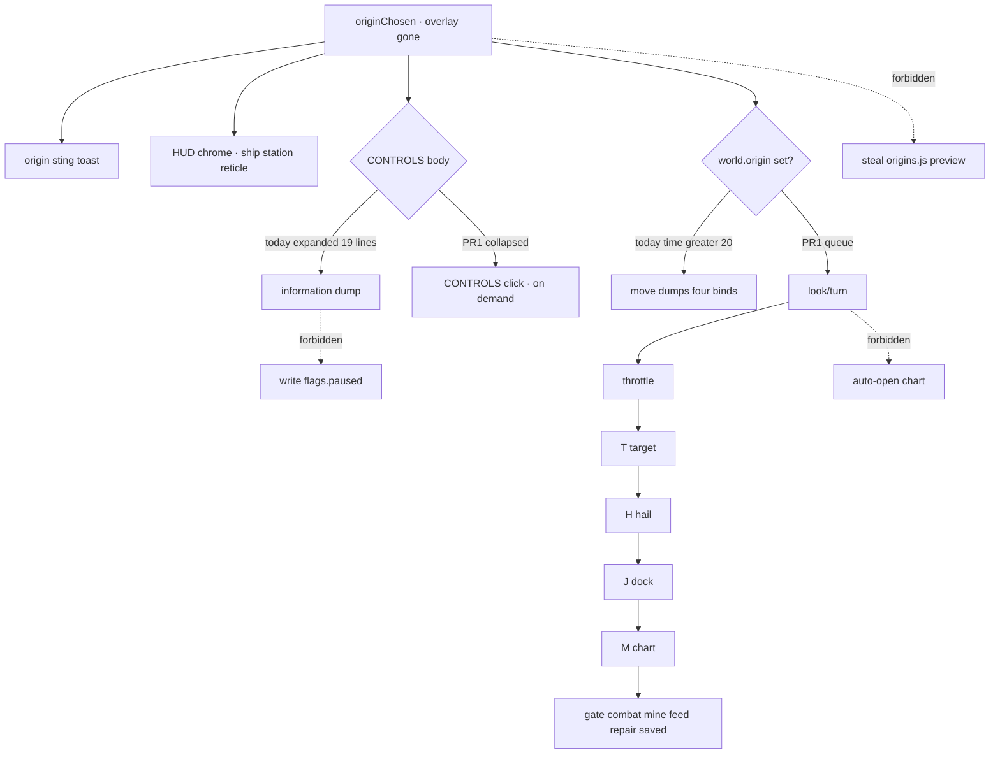

# RIMWARD Onb01 first-minute flight lesson

| Field | Value |
|---|---|
| **Title** | RIMWARD Onb01 first-minute flight lesson |
| **Author** | Wave 141 Onb01 leftover integrator |
| **Date** | 2026-08-27 |
| **Status** | Implemented Wave 142 PR1. Merge law: `out/w142/onb01/shared-contract.md` wins. |
| **Wave** | 142 — PR1 first-minute flight lesson + on-demand encyclopedia. KeyH/J/L/M/P stay. KeyD strafe. Digit 0/8/9 stay. Origin Digit1–5 stay origin until pick. |
| **Owner request** | Inbox P2 ONBOARDING leftover: replace the first-minute information dump with a short contextual flight lesson. Census live `onboarding.js` HINTS, HUD CONTROLS encyclopedia, origin overlay / `originChosen`. Code wins. If a sequential one-at-a-time lesson already exists after origin pick **and** the full control reference is already on-demand (not dumped), freeze leftover **CONSUME** and named serial **none**. Name: **no remaining Onb01 leftover.** Census: encyclopedia **does** dump expanded; sequential look/throttle/target/hail/dock/chart **does not**. Freeze leftover **REAL** and name later serial **PR1**. Origin mechanical preview is **not** this pack (Org01). Pause menu is **not** this pack (Ctl05). AI-05 grace is **not** this pack. CTL-04 menu digits are **not** this pack. |
| **Merge law** | [`out/w142/onb01/shared-contract.md`](../out/w142/onb01/shared-contract.md). If this document and that file conflict, **the contract wins**. |
| **Honor** | HUD-01 empty 80 px hub. Aim-glass gauges stay off. Kit mutate omit. Digit 0/8/9 stay. Origin Digit1–5 stay origin until pick. No new Digit. KeyH hail, KeyJ dock/jump, KeyL berth, KeyM chart, KeyP pause stay. KeyD strafe. Do not remap. CTL-02 never writes `flags.paused`. Onb01 never writes `flags.paused`. CTL-03/04 not this pack. CTL-04 menu digits cite only. `innerHTML` forbidden later. Hints and encyclopedia stay `textContent`. `state.js` READ-ONLY. Default persist **reuse** `ctx.world.onboarding.seen`. No UU. No SKU. No new WORLD_FIELDS. Do not teleport. Do not pause-from-this-pack. Do not auto-open hail/chart/berth/pause. Color is not the only cue. `reducedMotion`: no new animation that ignores it. **One** `.rw-onboard-hint` node: later mint tokens in `hud.css` (text scale, contrast, reduced-motion). Do not put it in the 80 px reticle. Do not add a second list. Same node: `role="status"`, `aria-live="polite"`, `aria-atomic="true"`; `pointer-events: none`; not a modal. CONTROLS `aria-expanded` from the collapse flag on **init, click, and combat collapse**. Fail closed: never throw from hint paint; unknown hint id skip. Do not steal optional PR2s Hail01 / HUD-06 / Hail02 / HUD-07 / NAV-09 / NAV-10 governor / TGT-07 stills / MSN-04 other families / CTL-03 / AI-05 / CTL-04 or Agent pad 2B or in-repo LLM. NAV-11 serial none. Do not steal sibling Wave 141 Org01 / Ctl05. Do not pause. Prototype-safe: authored literals only. |

**Wave 142 PR1 impl:** CONTROLS starts collapsed (`CONTROLS ▸`); after authored `world.origin`, HINTS teaches look → throttle → target → hail → dock → chart one at a time; id `move` is retired; one `.rw-onboard-hint` node is a polite live region; `hud.css` tokens cover scale / contrast / reduced-motion; WAVE6 first card is `look`.

**Verifier record:**

| Note | Path |
|---|---|
| Inventory (code wins; Wave 141 census) | [`out/w141/onb01/current-onb01-flight-lesson-inventory.md`](../out/w141/onb01/current-onb01-flight-lesson-inventory.md) |
| Merge law | [`out/w141/onb01/shared-contract.md`](../out/w141/onb01/shared-contract.md) |
| Wave 141 security review | [`out/w141/onb01/security-review.md`](../out/w141/onb01/security-review.md) |
| Wave 141 design-doc review | [`out/w141/onb01/code-review.md`](../out/w141/onb01/code-review.md) |
| Wave 141 UI audit | [`out/w141/onb01/ui-audit.md`](../out/w141/onb01/ui-audit.md) |
| Wave 141 notes | [`out/w141/onb01/notes.md`](../out/w141/onb01/notes.md) |

Siblings Org01 origin preview, Ctl05 pause menu, wishlist, and `PROGRESS.md` are **other workers**. **Do not edit** those paths. **Do not** steal sibling Wave 141 paths. **Do not** write `out/w141/onb01/verify/**`.

**This is not origin mechanical preview.** **This is not pause menu.** **This is not AI-05 grace.** **This is not CTL-04 menu digits.** Wishlist first-minute dump is **INBOX**. Census still finds **expanded encyclopedia** and **no sequential flight lesson**.

---

## Overview

Inbox source (`docs/PLAYER-EXPERIENCE-WISHLIST.md` Playtest capture 2026-08-25 — **96–101** — **cite, do not edit**):

> INBOX (P2, ONBOARDING): Replace the first-minute information dump with a short contextual flight lesson. Immediately after the permanent origin pick, the expanded controls encyclopedia and several simultaneous narrative lines compete with the ship, station, targets, and reticle. Teach look/turn, throttle, target, hail, dock, and chart one at a time, then leave the full control reference available on demand.

One-at-a-time **hints already exist**. An on-demand **toggle already exists**. The hole is **timing + dump**: encyclopedia starts open; first hint waits 20 s and still packs four binds; hail/chart/look never get their own step after pick.

Wave 141 this worker lands markdown only. Bindings do not change here.

Census (code wins): 19-line CONTROLS list, `controlsCollapsed = false` (`hud.js` **1276–1295**; `controls.js` **590–608**). `originChosen` toast (`hud.js` **662–663**). HINTS `move` at `world.time > 20` (`onboarding.js` **37–39**). Eight hints, 8 s dismiss, docked/jumping/`settings.hints` suppression (**29**, **113–134**). Park ~73 u vs dock 45 u (`origins.js` **46**; `state.js` **30**). Leftover is **REAL**.

This leftover is a **named first-minute lesson pack**: collapse the encyclopedia; sequence six authored steps on the live hint rail. It is not a new overlay. It is not a pause rewrite. It is not origin preview.

This document is the integrator for a **later** implementation wave.

HUD-01 empty aim glass stays empty. `state.js` stays READ-ONLY. Reuse `world.onboarding.seen`. Digit 0/8/9 stay. Origin Digit1–5 stay origin until pick. KeyH/J/L/M/P stay. Do not invent UU. Do not steal Org01 or Ctl05.

Wave 141 deputize (recorded here and in the contract; owner may override after playtest): start CONTROLS collapsed; after `world.origin` is set, teach look/turn → throttle → target → hail → dock → chart one at a time; retire `move`; keep the other contextual hints; fail-closed skip; never pause. Keep **one** `.rw-onboard-hint` node. Later mint: `hud.css` tokens + polite live region on that node; `aria-expanded` on init, click, and combat collapse. Designer pass (`out/w141/designer/onb01-ui-audit.md`) is evidence for those two a11y holes. Code still wins on leftover **REAL**.

If census had proved sequential post-pick lesson **and** on-demand encyclopedia already live, this pack would freeze **CONSUME** and name serial **none**. Census did not. That CONSUME path is unexpected.

---

## Background & Motivation

### Current state (inventory)

Source of truth: [`out/w141/onb01/current-onb01-flight-lesson-inventory.md`](../out/w141/onb01/current-onb01-flight-lesson-inventory.md). Code wins.

| Surface | Today | Cite |
|---|---|---|
| HINTS | 8 rows; one visible | `onboarding.js` **36–68**, **137–153** |
| First hint | `move` at `time > 20`; four binds | **37–39** |
| Dismiss | 8 s or any key | **29**, **107–108** |
| Mute | `settings.hints` | **113**; `ctx.js` **248** |
| Persist | `world.onboarding.seen` | **104**; `save.js` **90–91** |
| Encyclopedia | 19 lines, **expanded** | `controls.js` **590–608**; `hud.js` **1290** |
| Combat | collapses CONTROLS | `hud.js` **2246–2249** |
| Origin toast | `✦ ` + line | `hud.js` **662–663** |
| Origin overlay | pause; Digit1–5; z 60 | `origins.js` **100–160** |
| Park | ~73 u from station | `origins.js` **46** |
| Dock zone | 45 u | `state.js` **30** |

The player who picks an origin, watches the overlay lift, and tries to fly sees a 19-line manual, a sting that repeats the origin sentence, and the full HUD over the ship, station, and reticle. Twenty seconds later another line dumps throttle, mouse, drift, and burn together.

### Pain points

- Expanded encyclopedia at overlay-up **is** the dump. Toggle exists but default is open.
- `originChosen` toast + encyclopedia + HUD chrome are **simultaneous**.
- `move` is not a lesson. It is a delayed second dump.
- No hail-only, chart, or look/turn step after pick.
- `dock` waits for 45 u while park is ~73 u, so J is not taught at pick.
- A naive later PR that **pauses** for a tutorial **steals** CTL-02 / KeyP / Ctl05.
- A naive later PR that **auto-opens** chart or hail to teach M/H **steals** overlay mutex and Hail02.
- A naive later PR that edits `origins.js` overlay **steals** Org01.
- A naive later PR that lists binds in the pause banner **steals** Ctl05.
- A naive later PR that `innerHTML`s hint text is XSS.
- A naive later PR that adds `WORLD_FIELDS` `flightLesson` duplicates `seen`.
- A naive later PR that remaps Digit or KeyH/J/M **breaks** Honor.
- A naive later PR that ignores `reducedMotion` with a scripted camera lesson **fails** a11y.
- A naive later PR that throws in `when()` blanks the hint rail.

### Why now (design) / why not now (code)

The owner asked for the Onb01 leftover integrator so a later serial can stop the first-minute dump **before** the first HINTS rewrite. Inventory shows expanded encyclopedia and no post-pick sequence. Merge law can exist without touching `src/`. Implementation waits so pause theft, Org01 `origins.js` fights, Ctl05 encyclopedia move, new persist keys, and Digit remap are frozen before the first table edit. Wave 141 this worker does not ship `src/`.

If census had proved lesson + on-demand encyclopedia already live, this pack would freeze **CONSUME** and name serial **none**. Census did not.

---

## Goals & Non-Goals

### Goals

1. Document live HINTS, encyclopedia, origin toast, park vs dock, persist, mute from **live code**.
2. Freeze leftover = **first-minute flight lesson + on-demand encyclopedia**. Not Org01. Not Ctl05. Not AI-05. Not CTL-04.
3. Freeze deputize: collapse CONTROLS; six-step origin-gated lesson; retire `move`; keep contextual six; fail-closed skip; tokenized one hint node + polite live region; `aria-expanded` on init/click/combat. Owner may override after playtest. Do not park.
4. Freeze persist: **reuse** `ctx.world.onboarding.seen`. `state.js` READ-ONLY. No UU. No SKU. No new Digit. No new WORLD_FIELDS.
5. Freeze HUD-01 empty hub. Digit 0/8/9 stay. Origin Digit1–5 stay origin until pick. KeyH/J/L/M/P stay. KeyD stays strafe.
6. Freeze later copy via `textContent`. `innerHTML` forbidden. Color is not the only cue. One hint node uses `hud.css` tokens and a polite live region.
7. Freeze a serial PR plan. This wave writes the document. A later wave ships serially.

### Non-goals (locked — do not reopen)

- No `src/` or live bindings in this worker.
- No `flags.paused` write. CTL-03/04 not this pack. No `fireHeld`.
- No `origins.js` overlay / mechanical preview (Org01).
- No pause-menu encyclopedia (Ctl05).
- No AI-05 `jumpGraceUntil` / npc retune.
- No auto-open hail / chart / berth / settings.
- No teleport to pad. No dock-range retune.
- No `state.js` write. No WORLD_FIELDS. No new Digit.
- No HUD-01 hub child. No aim-glass gauges.
- Do not edit the wishlist, `PROGRESS.md`, OwnerDecisions*.
- Do not write `out/w141/onb01/verify/**`.
- Do not write sibling `out/w141/org01/**` or `out/w141/pause/**`.
- Do not steal optional PR2s, Agent pad 2B, or in-repo LLM.
- Do not start Vite or Chrome.

---

## Proposed Design

### 1. Merge resolutions (contract wins)

| Question | Integrator freeze | Why |
|---|---|---|
| Leftover real? | **Yes** | Inventory §9 |
| CONSUME? | **No**. Serial is **not** none | Dump live; sequence **not** live |
| New persist key? | **No** — reuse `seen` | Contract §0.5 |
| `state.js` write? | **No** | Prefer no retune |
| Claim `origins.js`? | **No** | Org01 sibling |
| Claim pause / Ctl05? | **No** | Honor |
| Auto-open chart/hail? | **No** | Overlay mutex |
| Named PR1? | **PR1** collapse + six-step lesson + hint tokens + live region | REAL leftover |
| Second hint node / hub child? | **No** | Honor HUD-01 |
| Hint off `#hud` tokens? | **No** — later `hud.css` + optional `#hud` reparent | Designer Major |

### 2. Current first-minute motion (do not break keys / origin / HUD-01)

Live origin overlay, Digit1–5 until pick, `originChosen` toast, hop grace stamp, and HUD chrome stay. PR1 only collapses CONTROLS by default and sequences the hint rail.

### 3. Deputize table (copy of contract §0.1)

Owner may override after playtest. Do not park.

| Knob | Value |
|---|---|
| Encyclopedia | collapsed at HUD init; toggle on demand |
| `aria-expanded` | from collapse flag on **init, click, and combat collapse** |
| Lesson gate | authored `world.origin` set |
| Order | look → throttle → target → hail → dock → chart |
| `move` | retired |
| `dock` | reused as lesson step 5 |
| Kept | gate, combat, mine, feed, repair, saved |
| Hint node | **one** `.rw-onboard-hint`; not the 80 px reticle; no second list |
| Hint chrome | `hud.css` tokens (scale, contrast, reduced-motion). Drop hardcoded inline cyan/size |
| Live region | same node: `role="status"` `aria-live="polite"` `aria-atomic="true"`; not a modal |
| Dismiss | 8 s or keydown |
| Mute | `settings.hints` |
| Persist | `seen` only |
| Fail-closed | never throw; unknown id skip |
| Pause | never from this pack |
| `origins.js` | not claimed |

### 4. Neighbours

| Module | This leftover does | This leftover does not |
|---|---|---|
| `onboarding.js` | later PR1: HINTS sequence + skip; live-region attrs on the existing node; drop inline color/size | pause; innerHTML; new module; second hint node |
| `hud.js` | later PR1: default collapse; `aria-expanded` on init/click/combat; reparent existing `.rw-onboard-hint` onto `#hud` (not the reticle) if the node is still on `body` | HUD-01 hub child; HUD-06 pip; HUD-07 stills; toast-flood rewrite; second list |
| `hud.css` | later PR1: `.rw-onboard-hint` tokens (scale, contrast, reduced-motion). Class `collapsed` already live | new animation; aim-glass gauges |
| `controls.js` | none (19 lines stay for on-demand) | remap keys |
| `origins.js` | **none** | overlay preview (Org01) |
| `state.js` | none | ORIGINS / U / JUMP write |
| `save.js` | none default | new WORLD_FIELDS |
| `overlay-policy.js` | cite only | pause write |
| `main.js` | none | KeyP (Ctl05) |
| WAVE6 harness | later retarget with PR1 | this wave |

---

## Later PR plan (serial)

See contract §3. First remaining serial is **PR1**.

| PR | Lands | Does not land |
|---|---|---|
| **PR1** | collapse + six-step lesson + retire `move` + fail-closed + WAVE6 retarget + hint tokens in `hud.css` + polite live region on the same node + `aria-expanded` on init/click/combat | Org01, Ctl05, pause, new fields, auto-open overlays, second hint node, hub child |
| **PR2 stills** | optional playtest still | required with PR1 |
| **PR3** | none here | Ctl05 pause help is a **sibling** |

---

## Fail-closed

- Never throw from hint `update` / `show` / `when`.
- Unknown hint id → skip.
- `seen` not an array → treat empty; do not crash.
- Authored ids only (`Object.hasOwn` against the HINTS id set).
- `textContent` only.
- Missing origin / unknown origin id → **no** lesson (fail closed, not a dump).
- `settings.hints === false` still hides immediately.
- Docked / jumping still suppress.

---

## Verification direction (later impl; not this wave)

Domain for **this** wave: **data**. Verifier reads the brief + inventory + contract. Confirms leftover **REAL** vs live cites. Confirms no `src/` edits. Confirms Honor.

Later PR1 (not this worker):

1. Fresh boot, pick origin. CONTROLS body hidden. Toggle shows `CONTROLS ▸`.
2. First hint is look/turn only. No 19-line dump. No four-bind `move` line.
3. Dismiss (key or 8 s) → throttle only → target → hail → dock → chart.
4. Click CONTROLS → 19 lines appear. Click again → hide.
5. KeyH hail, KeyJ dock/jump, KeyM chart, KeyP pause, KeyD strafe unchanged.
6. Digit1–5 were origin until pick; after pick they are weapon groups in flight (CTL-04 dock skip stays).
7. Hub empty. No pause from the lesson. `hints` off hides the rail.
8. Restore with `seen` already holding lesson ids: no re-dump.
9. Hint chip uses HUD text scale / contrast / reduced-motion. One node. `role="status"` polite live region. CONTROLS `aria-expanded` matches collapse after init, click, and combat.

Do **not** start Vite or Chrome in Wave 141 this worker.
