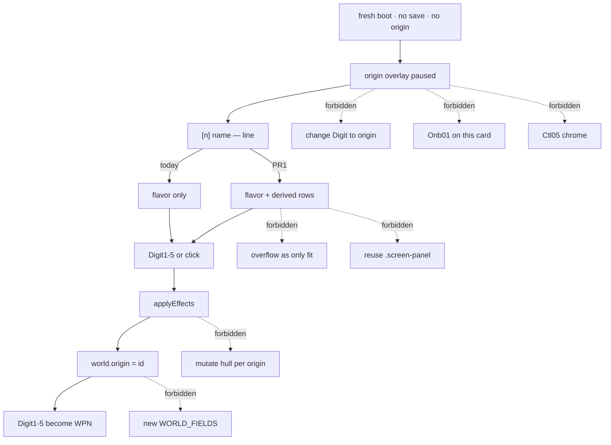

# RIMWARD Org01 origin consequence preview

| Field | Value |
|---|---|
| **Title** | RIMWARD Org01 origin consequence preview |
| **Author** | Wave 141 Org01 leftover integrator |
| **Date** | 2026-08-27 |
| **Status** | Implemented Wave 142 PR1. Merge law: shared-contract.md wins. |
| **Wave** | 142 — PR1 origin consequence preview in `origins.js`. KeyH/J/L/M/P stay. KeyD strafe. Digit 0/8/9 stay station after pick. Digit1–5 stay origin until pick. |
| **Owner request** | Inbox P2 ORIGINS leftover: Preview gameplay consequences of each permanent origin before confirmation. Census live overlay in `origins.js` (Digit1–5 / click, `applyEffects`, `ORIGINS` in `state.js`). Code wins. If the overlay already previews hull/equipment, money/debt, faction standings, immediate danger, and recommended experience **before** confirm, freeze leftover **CONSUME** and named serial **none**. Name: **no remaining Org01 leftover.** Census: flavor **does** exist; mechanical preview **does not**. Freeze leftover **REAL** and name later serial **PR1**. This is **not** Onb01 flight lesson. This is **not** Ctl05 pause. This is **not** origin-arc creditor calls. This is **not** AI-05 grace. |
| **Merge law** | [`out/w142/org01/shared-contract.md`](../out/w142/org01/shared-contract.md). If this document and that file conflict, **the contract wins**. |
| **Honor** | HUD-01 empty 80 px hub. Aim-glass gauges stay off. Kit mutate omit. Digit 0/8/9 stay station after pick. Digit1–5 stay origin until pick. No new Digit. Do not change which Digit picks which origin. KeyH hail, KeyJ dock/jump, KeyL berth, KeyM chart, KeyP pause stay. KeyD strafe. Do not remap. CTL-02 hail/chart/berth never write `flags.paused`. Origin overlay **keeps** its live pause. CTL-03/04 not this pack. `innerHTML` forbidden later. Overlay paint stays `textContent`. `state.js` READ-ONLY later unless a tiny authored preview table is required; prefer derive from existing `ORIGINS` effects. Default persist **none**. Choice still writes `ctx.world.origin`. No UU invent. No SKU. No new WORLD_FIELDS. Do not teleport beyond live `startSystem`. Do not steal Onb01 / Ctl05 / creditor arcs / AI-05. Color is not the only cue. `reducedMotion`: no new animation that ignores it. Fail closed: unknown origin id skip; never throw from overlay paint; missing effect field → omit that row, not crash. Layout: **compact sublines first** so five Digit rows plus preview stay in view at the live overlay size; `overflow-y` is backup only on a dedicated origin list region. Do **not** steal station `.screen-panel` or pause-menu classes. Do not steal optional PR2s Hail01 / HUD-06 / Hail02 / HUD-07 / NAV-09 / NAV-10 governor / TGT-07 stills / MSN-04 other families / CTL-03 / AI-05 / CTL-04 or Agent pad 2B or in-repo LLM. NAV-11 serial none. Do not pause beyond live origin overlay. Prototype-safe: authored literals only. |

**Impl note (Wave 142 PR1):** Overlay rows keep `[n] name — line` and add derived compact `textContent` sublines (hull / money / standings / danger / experience) before one-press Digit/click confirm. Authored id list lives in `origins.js`. `state.js` stays read-only. Dedicated `.rw-origin-*` compact type + backup list overflow.

**Verifier record:**

| Note | Path |
|---|---|
| Inventory (code wins; Wave 141 census) | [`out/w141/org01/current-org01-origin-preview-inventory.md`](../out/w141/org01/current-org01-origin-preview-inventory.md) |
| Merge law | [`out/w141/org01/shared-contract.md`](../out/w141/org01/shared-contract.md) |
| Wave 141 security review | [`out/w141/org01/security-review.md`](../out/w141/org01/security-review.md) |
| Wave 141 design-doc review | [`out/w141/org01/code-review.md`](../out/w141/org01/code-review.md) |
| Wave 141 UI audit | [`out/w141/org01/ui-audit.md`](../out/w141/org01/ui-audit.md) |
| Wave 141 notes | [`out/w141/org01/notes.md`](../out/w141/org01/notes.md) |

Siblings Onb01 flight lesson, Ctl05 pause menu, wishlist, and `PROGRESS.md` are **other workers**. **Do not edit** those paths. **Do not** steal sibling Wave 141 paths. **Do not** write `out/w141/org01/verify/**`.

**This is not the first-minute flight lesson (Onb01).** **This is not pause menu (Ctl05).** **This is not origin-arc creditor calls.** **This is not AI-05 grace.** Wishlist origin preview is **INBOX**. Census still finds **flavor-only rows**.

---

## Overview

Inbox source (`docs/PLAYER-EXPERIENCE-WISHLIST.md` Playtest capture 2026-08-25 — **126–130** — **cite, do not edit**):

> INBOX (P2, ORIGINS): Preview the gameplay consequences of each permanent origin before confirmation: starting hull and equipment, money/debt, faction standings, immediate danger, and recommended experience. The current prose establishes flavor well but does not support an informed permanent choice.

Flavor `name` + `line` **already** paint. Permanence footer **already** paints. Digit1–5 / click **already** confirm. The hole is **informed choice**: consequences apply in `applyEffects` **after** the press. The overlay does not show them first.

Wave 141 this worker lands markdown only. Bindings do not change here.

Census (code wins): row `` `[${i + 1}] ${name} — ${line}` `` (`origins.js` **141**). Footer permanence (**150**). `ORIGINS` effects in `state.js` **742–768**. `applyEffects` **52–85** writes credits, fear, reputation, bio, cargo, clues, startSystem. No hull field. No experience field. No overlay preview rows. Leftover is **REAL**.

This leftover is a **named overlay-preview pack**: derive consequence rows from live `ORIGINS.effects` + live defaults; paint them with `textContent` before confirm. It is not a Digit remap. It is not a kit mutate. It is not a new persist key.

This document is the integrator for a **later** implementation wave.

HUD-01 empty aim glass stays empty. `state.js` stays READ-ONLY. No new persist key. Digit 0/8/9 stay after pick. Digit1–5 stay origin until pick. KeyH/J/L/M/P stay. Do not invent UU. Do not steal Onb01, Ctl05, creditor arcs, or AI-05.

Wave 141 deputize (recorded here and in the contract; owner may override after playtest): keep one-press confirm; paint derived hull/equipment, money/debt, standings, danger, and experience **on each row** as **compact sublines**; overflow-y is backup only; fail-closed skip; do not add a `state.js` preview table. Do not steal `.screen-panel`.

If census had proved all five consequence kinds already live before confirm, this pack would freeze **CONSUME** and name serial **none**. Census did not. That CONSUME path is unexpected.

---

## Background & Motivation

### Current state (inventory)

Source of truth: [`out/w141/org01/current-org01-origin-preview-inventory.md`](../out/w141/org01/current-org01-origin-preview-inventory.md). Code wins.

| Surface | Today | Cite |
|---|---|---|
| Overlay row | `[n] name — line` | `origins.js` **141** |
| Footer | permanent choice | **150** |
| Confirm | Digit1–5 or click | **144**, **153–157** |
| Apply | after confirm | **52–85**, **127** |
| Credits default | 350 UU | `ctx.js` **174** |
| Hull | light 100, hold 20, Mk I | `state.js` **38**, **83–88**; `ship.js` **631** |
| `ORIGINS` | five authored ids | `state.js` **742–768** |
| Persist | `ctx.world.origin` | `origins.js` **128**; `save.js` **91** |
| Creditor arc | shipped, time-based | `world.js` **1008–1026** |
| Onboarding | after origins | `main.js` **138–139** |
| Digit WPN skip | while `paused` | `controls.js` **117** |

The player who boots, reads five flavor lines, and taps 2 learns the Ledger owns the papers. The player does **not** see −1150 UU, Stranger / Known ranks, or Experienced before that tap. The choice is already permanent.

### Pain points

- Flavor + permanence without numbers = uninformed permanent pick. Inbox is the expected path, not a rare seed.
- `applyEffects` is honest **after** the fact. The overlay is not.
- A naive later PR that **kit-mutates** hull per origin steals SHP / hangar and invents UU.
- A naive later PR that **writes `ORIGINS.preview` in `state.js`** duplicates effects and drifts.
- A naive later PR that adds a **second confirm** screen fights the live Digit1–5 contract.
- A naive later PR that **remaps Digit2** away from Ledger Debt steals wave-6 order and boot tests.
- A naive later PR that **delays the overlay** for a flight lesson steals Onb01 **and** wave-6 “origin first”.
- A naive later PR that **rewrites creditor calls** as overlay copy steals the shipped arc.
- A naive later PR that **retunes AI-05 grace** as “danger” steals AI-05.
- A naive later PR that `innerHTML`s `line` / clue text is XSS.
- A naive later PR that writes a persist “skipPreview” **mutes** the leftover.
- A naive later PR that color-tints Marked red without words fails color-not-only.
- A naive later PR that leaves Digit listener after pick **steals** WPN groups.
- A naive later PR that **only** adds `overflow-y: auto` on an unfocusable card hides Digit4–5 from keyboard users (mouse-only informed choice).
- A naive later PR that **reuses `.screen-panel`** steals station / pause chrome.

### Why now (design) / why not now (code)

The owner asked for the Org01 leftover integrator so a later serial can show consequences **before** the first `choose`. Inventory shows flavor-only rows. Merge law can exist without touching `src/`. Implementation waits so Digit remap, kit mutate, `state.js` preview tables, Onb01 delay, creditor rewrite, AI-05 retune, persist flags, and `innerHTML` are frozen before the first overlay edit. Wave 141 this worker does not ship `src/`.

If census had proved mechanical preview already live, this pack would freeze **CONSUME** and name serial **none**. Census did not.

---

## Goals & Non-Goals

### Goals

1. Document live overlay copy, Digit1–5 map, `applyEffects` fields, `ORIGINS` table, defaults, persist, neighbours from **live code**.
2. Freeze leftover = **consequence preview before confirm**. Not Onb01. Not Ctl05. Not creditor-call rewrite. Not AI-05.
3. Freeze deputize: derived labeled rows; one-press confirm; fail-closed skip. Owner may override after playtest. Do not park.
4. Freeze persist: **none** new. `state.js` READ-ONLY. `ctx.world.origin` write stays. No UU. No SKU. No new Digit. No WORLD_FIELDS.
5. Freeze HUD-01 empty hub. Digit 0/8/9 stay after pick. Digit1–5 stay origin until pick. KeyH/J/L/M/P stay. KeyD strafe.
6. Freeze later copy via `textContent`. `innerHTML` forbidden. Color is not the only cue.
7. Freeze a serial PR plan. This wave writes the document. A later wave ships serially.

### Non-goals (locked — do not reopen)

- No `src/` or live bindings in this worker.
- No Digit remap. No change which Digit is which origin.
- No kit mutate. No hull / miningLaser / scanner rewrite per origin.
- No `state.js` `preview:` table in PR1. No `ORIGIN_ARCS` retune. No `JUMP.graceSeconds` retune. No `STARTER_GRACE_SECONDS` retune.
- No two-step confirm as required PR1.
- No Onb01 flight copy on the origin card. No delay of overlay.
- No Ctl05 pause-menu chrome. Origin pause stays the live overlay pause.
- No station `.screen-panel` / `.screen-btn` reuse. Overflow-y is **not** the primary fit.
- No HUD layout. No overlay-policy rewrite for hail/chart/berth.
- Do not edit the wishlist, `PROGRESS.md`, OwnerDecisions*, sibling Wave 141 docs.
- Do not write `out/w141/org01/verify/**`.
- Do not write sibling `out/w141/onb01/**` or `out/w141/pause/**`.
- Do not steal optional PR2s, Agent pad 2B, or in-repo LLM.
- Do not start Vite or Chrome.

---

## Proposed Design

### 1. Merge resolutions (contract wins)

| Question | Integrator freeze | Why |
|---|---|---|
| Leftover real? | **Yes** | Inventory §5–§7 |
| CONSUME? | **No**. Serial is **not** none | Flavor live; mechanical preview **not** live |
| New persist key? | **No** | Contract §0.5 |
| `state.js` write? | **No** | Prefer derive |
| Two-step confirm? | **No** as required PR1 | Digit1–5 already confirm |
| Kit mutate? | **No** | Honor; effects have no hull |
| Creditor rewrite? | **No** | Already shipped |
| AI-05 retune? | **No** | Sibling leftover |
| Named PR1? | **PR1** derived rows + skip | REAL leftover |
| Layout law | **Compact sublines first**; overflow backup | Keyboard Digit path; designer Major |

### 2. Current origin motion (do not break Digit map / applyEffects / persist)

Live Digit1–5, click, `applyEffects`, `ctx.world.origin`, hop-grace stamp, and listener-remove stay. PR1 only paints derived rows before that press.

### 3. Deputize table (copy of contract §0.1)

Owner may override after playtest. Do not park.

| Knob | Value |
|---|---|
| Confirm | one Digit or click; no second screen |
| Hull | shared `Hull light 100 · Mining laser Mk I · hold 20 · no launcher · no turret` |
| Money | derive from 350 + `setCredits` / `addCredits` |
| Ledger money | `Money −1150 UU (debt)` |
| Standings | even, or name + signed delta + `rankFor` |
| Danger | start system + fear + debt words + bio/cargo/clue parts when present |
| Experience | `New player` / `New player — living-ship care` / `Experienced` |
| Digit map | 1 greenhand … 5 drifter (authored list in `origins.js`, same order) |
| Paint | `textContent`; skip unknown; omit missing effect; Digit `hasOwn` |
| Layout | compact ≈10 px sublines first; wrap; Digit labels stay |
| Overflow | backup on dedicated origin list only; not `.screen-panel` |
| Persist | none new |
| `state.js` | read-only |
| Fail-closed | never throw; skip does not reindex Digits; omit `fear 0` when no `setFear` |

Full five-origin literals: contract §0.1 deputized preview table.

### 4. Neighbours

| Module | This leftover does | This leftover does not |
|---|---|---|
| `origins.js` | later PR1: derived rows + skip | Digit remap; `applyEffects` vocab change; keep-listener |
| `screens.css` | optional dedicated `.rw-origin-*` compact + backup list overflow | HUD tokens; `.screen-panel`; pause `.screen-btn` |
| `state.js` | **none** (read `ORIGINS`) | preview table; effect retune |
| `world.js` | **none** | creditor tick |
| `npc.js` | **none** | AI-05 grace |
| `onboarding.js` | **none** | flight lesson |
| `save.js` | **none** | WORLD_FIELDS |
| `controls.js` | **none** | WPN Digit after pick |
| `hud.js` | **none** | toast / hub |
| `agent-api.js` | **none** | new act |
| `overlay-policy.js` | cite only | hail pause write |

### 5. Serial PR plan

Matches contract §3. **Named only. Do not implement in Wave 141.**

| PR | Lands | Does not land |
|---|---|---|
| **PR1** origin preview | derived rows; compact sublines first; backup list overflow; authored id order; skip; `textContent`; Digit map kept | `state.js`; kit mutate; two-step; Onb01; Ctl05; AI-05; creditor rewrite; `innerHTML`; pause steal; `.screen-panel` steal; overflow-only; HUD-01 |
| **PR2 stills (optional skip)** | overlay still with five kinds visible; Digit1 Greenhand; after pick Digit1 WPN | required with PR1 |
| **PR3 two-step confirm (optional skip)** | owner-asked only | required with PR1 |

First remaining serial is **PR1**. It must not steal Digit 0/8/9 after pick. It must not write `state.js`. It must not claim `onboarding.js` or pause chrome.

### 6. Picture

Reuse the live origin card. No new Digit. No hub pip. A player who starts a new game sees five origins. Each origin shows hull, money, standings, danger, and experience **before** a Digit. Digit 2 is still Ledger Debt. After pick, Digit 2 is still weapon group 2.

---

## Player outcome (later serial; freeze here)

You start a new game. You see `RIMWARD — WHO ARE YOU?`. You see `[2] LEDGER DEBT` and the flavor line. You also see compact sublines: `Money −1150 UU (debt)`, Red Ledger Stranger and Freehold Known, start Freehold Drift, in debt, and `Experienced`. You see Digit5 Drifter on the same card without a mouse scroll as the primary path. You have not pressed 2 yet.

You press 2. Effects apply as today. `ctx.world.origin` is `ledgerDebt`. The overlay closes. Digit 2 is weapon group 2.

You do **not** get a new hull class. You do **not** get a new persist key. You do **not** lose Digit 0/8/9 after pick.

**Onb01** is **not** this work. **Ctl05** is **not** this work. **Pad 2B** is **not** this work.

---

## Security

See [`out/w141/org01/security-review.md`](../out/w141/org01/security-review.md).

- XSS: no `innerHTML` for name / line / preview. `textContent` only.
- Prototype keys: skip unless `Object.hasOwn(ORIGINS, id)`.
- Persist: no new key. Do not mute preview with a save flag.
- Fail-closed: never throw on unknown origin; omit missing effect; never steal Digit after pick.
- Agent: live `chooseOrigin` stays; do not add a silent apply.

---

## Acceptance direction (implementation wave)

1. Fresh boot overlay shows, for **each** of the five authored origins, hull/equipment, money/debt, faction standings, immediate danger, and recommended experience **before** Digit or click. Compact sublines keep those five Digit rows in view at the live 620 px / 92vw card **without** mouse-only scroll as the primary path. Overflow-y on a dedicated origin list is backup only.
2. Copy matches the deputized table (or owner override) via `textContent`. No `innerHTML`.
3. Digit1 is still Greenhand. Digit5 is still Drifter. After pick, Digit1–5 are weapon groups. Digit 0/8/9 stay station after pick.
4. `applyEffects` results still match live effects. Credits math 350 / −1150 / 600 unchanged. Hull stays light 100.
5. Unknown origin id skipped. Missing effect part omitted. Overlay paint does not throw.
6. No `state.js` write. No new WORLD_FIELDS. No Agent observe rewrite. No new Digit. Origin pause stays live overlay pause.
7. `reducedMotion`: no new animation. Color is not the only cue.
8. REDMARCH `castMatches` untouched.
9. Onb01 / Ctl05 / AI-05 / creditor tick untouched.

---

## Alternatives considered

| Alternative | Why not |
|---|---|
| Freeze CONSUME / serial none | Flavor is not mechanical preview |
| `state.js` `preview:` table | Duplicates effects; honor prefers derive |
| Two-step confirm as PR1 | Digit1–5 already confirm; extra mode |
| Kit-mutate hull per origin | Effects have no hull; SHP steal |
| Delay overlay for flight lesson | Steals Onb01; breaks origin-first |
| Paste `ORIGIN_ARCS.callLines` on Ledger | Creditor arc already shipped; time-based |
| Show AI-05 extra seconds as danger | Steals AI-05 |
| Color-only Marked / debt | a11y |
| `innerHTML` flavor | XSS |
| Persist skipPreview | Mute leftover |
| Keep Digit listener after pick | Steals WPN |
| Teleport preview camera | Honor; Drifter already has `startSystem` |
| Overflow-y as the only fit | Keyboard Digit users never get a scroll path on an unfocusable card |
| Reuse `.screen-panel` / pause `.screen-btn` | Steals station / Ctl05 chrome |

---

## Regression risks

| Risk | Mitigation |
|---|---|
| Card taller than viewport | compact ≈10 px sublines first; overflow-y **backup** on dedicated origin list; title + footer stay; no animation; no `.screen-panel` |
| Preview lies vs `applyEffects` | derive from same `effects` object; do not invent UU |
| Shared hull looks like “no difference” | still required; money/standings/danger differ |
| Digit remap | freeze map; boot tests Digit1 greenhand Digit5 drifter |
| Listener leak | keep `removeEventListener` on choose |
| XSS line / clue | `textContent`; hasOwn ORIGINS / COMMODITIES / SYSTEMS |
| Onb01 file fight | this pack does not claim `onboarding.js` |
| Both packs later touch `origins.js` | notes: parent sequences impl wave |
| `reducedMotion` | no new animation |
| REDMARCH boot flake | do not “fix” |

---

## Ownership

| Object | Writer | Reader |
|---|---|---|
| Overlay preview rows | later PR1 `origins.js` | player before pick |
| Optional dedicated origin CSS | later PR1 `screens.css` `.rw-origin-*` | overlay compact + backup list |
| `ORIGINS.effects` | **none** (live) | derive + `applyEffects` |
| `ctx.world.origin` | live `choose` (unchanged) | save / arcs |
| Digit1–5 until pick | live `onKey` | player |
| Digit1–5 after pick | live `controls.js` | WPN |
| `flags.paused` | live origin overlay | sim |
| `onboarding.js` | **none** | Onb01 |
| `world.js` originArc | **none** | creditor |
| HUD layout | **none** (HUD-01) | — |

---

## Open owner questions (non-blocking)

1. Confirm one-press (preview on the list) vs optional PR3 two-step? Default: **one-press**.
2. Confirm experience words (`New player` / `New player — living-ship care` / `Experienced`) after playtest? Default: **those three**, derived, no new UU.
3. Confirm Beautiful cargo sits on the hull/equipment line vs a cargo danger part? Default: **equipment/cargo line** as deputized.
