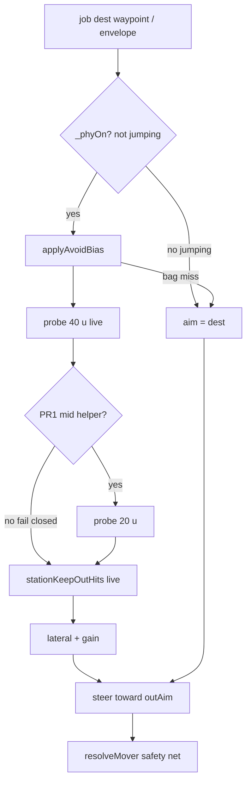

# RIMWARD PHY-04 remaining NPC avoid

| Field | Value |
|---|---|
| **Title** | RIMWARD PHY-04 remaining NPC avoid |
| **Author** | Wave 108 PHY-04 integrator |
| **Date** | 2026-08-24 |
| **Status** | first-impl Wave 109 |
| **Wave** | 109 — PR1 two-sample + PR2 frame hold + PR4 pins. PR3 far 80 u skipped. |
| **Owner request** | Remaining PHY-02 leftover after Wave 53/58: NPC avoid is still a lookahead bias, not full path planning. Traffic should complete routes without routine collisions, using steering that is more than a lateral lookahead bias — **without** a navmesh, **without** a new Digit, **without** HUD chrome, **without** persist. |
| **Merge law** | [`out/w108/phy04/shared-contract.md`](../out/w108/phy04/shared-contract.md). If this brief and that file conflict, the contract wins. |
| **Honor** | HUD-01 empty hub. Digit 0 shipyard. Digit 8/9 stay. `state.js` READ-ONLY; later **no** `state.js` write and **no** new persist key. Avoid is live steering. `innerHTML` forbidden later. No new DOM. PHY-01 bounce stays. PHY-03 sun radii stay. Autopilot / NAV-03/04 stay other workers. FLT stays. BIO-06/08 motion, BIO-07 meshes, kit mutate omit. Do **not** edit sibling Bio/Nav/Msn/Rep/Shp/Tgt/Owner docs or the wishlist. |

**Verifier record:**

| Note | Path |
|---|---|
| Inventory (code wins) | [`out/w108/phy04/current-phy04-inventory.md`](../out/w108/phy04/current-phy04-inventory.md) |
| Merge law | [`out/w108/phy04/shared-contract.md`](../out/w108/phy04/shared-contract.md) |
| Security review | [`out/w108/phy04/security-review.md`](../out/w108/phy04/security-review.md) |
| Design-doc review | [`out/w108/phy04/code-review.md`](../out/w108/phy04/code-review.md) |
| UI audit | [`out/w108/phy04/ui-audit.md`](../out/w108/phy04/ui-audit.md) |
| Wave 109 probe | [`out/w109/phy04/probe.mjs`](../out/w109/phy04/probe.mjs) |
| Wave 109 notes | [`out/w109/phy04/notes.md`](../out/w109/phy04/notes.md) |
| Wave 109 security | [`out/w109/phy04/security-review.md`](../out/w109/phy04/security-review.md) |
| Wave 109 code review | [`out/w109/phy04/code-review.md`](../out/w109/phy04/code-review.md) |
| Wave 109 UI audit | [`out/w109/phy04/ui-audit.md`](../out/w109/phy04/ui-audit.md) |

Siblings PHY-01, PHY-03, FLT, NAV-03/04, BIO-06/07/08, HUD, TGT, SHP, wishlist, `PROGRESS.md`, and `docs/OwnerDecisions*.md` are **other workers**. **Do not edit** those paths. Do **not** write `docs/OwnerDecisionsWave108.md`.

**This is not PHY-01** (bounce/slide). **This is not PHY-03** (sun heat/kill). **This is not a navmesh.** Wishlist PHY-02 acceptance still says NPC traffic completes representative routes without routine collisions; collision stays the safety net.

---

## Overview

Wave 53 landed solid volumes, NPC lookahead, and star heat. Wave 58 landed gate **torus** collision, trader/miner **station holds**, and stronger station/gate avoid (cylinder path keep-out, nearest-ring lateral, inside-XZ eject). Live PHY-02 is still **one probe 40 u ahead** plus a lateral aim offset (`applyAvoidBias`). Wishlist status is explicit: not full path planning.

The leftover is **avoid quality**, not a missing Digit and not a missing HUD. Traffic still meets the safety net on chords the 40 u point never samples (asteroids, hulls, sun, thin gate tube). A planner rewrite would smash CPU, AP ownership, and fail-closed flight.

This brief is the integrator document for a **later** implementation wave. Wave 108 this worker lands markdown only. Bindings do not change here.

HUD-01 empty aim glass stays empty. `state.js` stays READ-ONLY. No persist key. Digit 0 stays shipyard. Digit 8/9 stay. Do not invent UU. Do not replace bounce. Do not retune lethal sun radii. Do not steal MATCH/hover.

Wave 108 deputize (recorded here and in the contract; owner may override after playtest): keep live lookahead as fail-closed; smallest additive steer is a **two-sample** bias (40 u + mid 20 u) on the existing bag; optional live hold retarget when the dest punches the D5 cylinder; no A*; never freeze NPCs.

---

## Background & Motivation

### Current state (inventory)

Source of truth: [`out/w108/phy04/current-phy04-inventory.md`](../out/w108/phy04/current-phy04-inventory.md). Code wins over stale Wave 53 “gates have no volume” comments.

| Surface | Today | Cite |
|---|---|---|
| PHY table | `AVOID_LOOKAHEAD` 40, `AVOID_GAIN` 1.4, gate bore/tube, sun mults | `physics.js` 6–23 |
| Body bag | station, gates, hub lantern, rocks, ships, player; sun appended NPC-only | `collision.js` 345–455; `npc.js` 660–682 |
| Player bounce | `resolveMover` after integrate; **sun stripped**; no lookahead | `ship.js` 904–936 |
| NPC bounce | `bounceLive` → `resolveMover` skip self | `npc.js` 685–730, 2337 |
| Lookahead | **one** heading probe 40 u; lateral offset | `npc.js` 59–60, 603–658 |
| Station keep-out | hull + probe + XZ **path** | `npc.js` 537–561 |
| Gate avoid | torus probe; nearest ring lateral | `npc.js` 471–487, 643–645 |
| Player AP | `planApPath` then `applyAvoidBias`; **skips gates** | `autopilot.js` 247–275; `npc.js` 425–428 |
| Trader/miner holds | authored outside D5; `healPadHome` | `traffic-feel.js` 71–107; `world.js` 98–102, 702–726 |
| Patrol home | **pad center** `station.clone()` | `world.js` 374–381 |
| Empty hub | 80 px + RANGE | `hud.css` 184–193; `hud.js` 709–712 |
| Digit 0 / 8 / 9 | shipyard / launch / epics | `station.js` 188, 6041–6046 |
| Avoid persist | **none** | `save.js` `WORLD_FIELDS` 76–101 |
| Second sample | **absent** | inventory §12 |

Player station/gate: Wave 58 **collision** landed. Manual FLT does not tunnel the D5 cylinder or gate tube at cruise (~2 u/frame vs r 32 / tube 2.2). This leftover stays **NPC**.

### Pain points

- A naive later PR that builds a navmesh or per-NPC A* grid would smash the zero-alloc tick and the CPU freeze.
- A naive later PR that imports `planApPath` into `steerLive` would steal NAV hover/detour/MATCH and run 8 detour iters on every trader.
- A naive later PR that only cranks `AVOID_LOOKAHEAD` still misses the mid-chord and yanks combat envelopes.
- A naive later PR that stops the ship until clear would freeze traffic when the bag is empty or during jump — forbidden fail-open.
- Putting an avoid pip on the 80 px hub would reopen HUD-01.
- Stealing Digit 0/8/9 would smash shipyard, launch, Standing, or papers.
- Writing avoid into `SHIP_CLASSES` would violate `state.js` READ-ONLY.
- Persisting detours would invent a world field for live steering and fight `healPadHome`.
- Inventing UU / a “navigator” SKU would impersonate the owner.
- Replacing bounce would remove the safety net the wishlist still wants.
- Retuning sun lethal radii would reopen PHY-03.
- Adding player FLT lookahead would steal the stick.
- Rewriting gate torus from scratch would reopen Wave 58.

### Why now (design) / why not now (code)

The owner asked for the PHY-04 integrator leftover so later serials can make traffic **read as path** without becoming a nav project. Inventory shows one probe, a station path test, a shipped torus, authored holds, and bounce as net. Merge law can exist without touching `src/`. Implementation waits so hub theft, Digit theft, `state.js` writes, persist keys, navmesh, AP steal, and freeze-in-place are frozen before the first extra sample. Wave 108 this worker does not ship `src/`.

---

## Goals & Non-Goals

### Goals

1. Document live lookahead, station keep-out, gate torus, holds, bounce, player collision vs AP skip, HUD/Digit/persist from **live code**.
2. Freeze **lookahead as fail-closed**. Keep 40 / 1.4 unless the owner overrides after playtest.
3. Freeze the **smallest additive steer**: two-sample bias (40 u + mid 20 u) on the existing bag. Reads as path. Is not a planner.
4. Freeze optional **live hold retarget** when dest punches D5. No route persist write.
5. Freeze no navmesh, no A*, no extra bag alloc per NPC, no `planApPath` in NPC tick.
6. Freeze no new persist key, no new Digit, no `state.js` write, no UU, no avoid pip.
7. Freeze PHY-01 bounce honor and PHY-03 sun-radius honor.
8. Freeze fail-closed: missing avoid data → live dest/bias; **never** freeze hulls.
9. Freeze a serial PR plan. This wave writes the brief. A later wave ships serially.

### Non-goals (locked — do not reopen)

- No `src/` or live bindings in this worker.
- No navmesh / flow field / grid search.
- No PHY-01 bounce replace. No PHY-03 radius retune.
- No player FLT lookahead. No MATCH/hover/AP reopen.
- No aim-glass avoid pip / RANGE rewrite.
- No new Digit. No toast required.
- No `SHIP_CLASSES` extra fields. No invented UU or standing deltas.
- No persist `world.avoid`. No settings checkbox for avoid.
- Do not retune `AVOID_LOOKAHEAD` / `AVOID_GAIN` as the leftover.
- Do not rewrite Wave 58 torus or trader/miner authored holds.
- Do not edit the wishlist, `PROGRESS.md`, Bio*, Nav*, Msn*, Rep*, OwnerDecisions*.
- Do not write `docs/OwnerDecisionsWave108.md`.
- Do not fix known boot FAILs.

---

## Proposed Design

### 1. Merge resolutions (contract wins)

| Question | Integrator freeze | Why |
|---|---|---|
| New persist key? | **No** | Live steering. Inventory: none needed |
| `state.js` write? | **No** | Contract §0.5 |
| Navmesh / A*? | **Forbidden** | CPU freeze |
| Import `planApPath`? | **No** | NAV ownership |
| Player FLT avoid? | **No** | Collision already landed |
| Replace bounce? | **No** | PHY-01 net |
| Retune sun radii? | **No** | PHY-03 |
| Fail closed? | Live single probe; never stop | Owner; inventory §10 |
| Smallest additive? | Mid sample 20 u | Contract §0.1 |
| Hold reuse? | Frame aim only | No persist |
| Gate torus? | Consume Wave 58 | Already shipped |
| HUD / Digit / SKU? | **No** | Frozen |
| First serial steal Digit 0/8/9? | **No** | Contract §0.3 |

### 2. Current motion (do not break bounce / envelopes)

See inventory §§2–5. Load-bearing loops:

**NPC traffic**

1. Once per tick: `collectBodies` + `appendSunBody` if not jumping.
2. Job writes a dest (waypoint, hold, envelope).
3. `steerLive` → `applyAvoidBias` (40 u lateral) → rotate toward biased aim → advance −Z.
4. `bounceLive` slides if overlapping.

**Player**

1. Stick integrates velocity (FLT).
2. `resolveMover` vs station/gate/rocks/ships. Sun is heat, not a wall.
3. AP (other worker) plans a path, then reuses `applyAvoidBias` and **skips gates**.

**This serial must not change** restitution, slide friction, sun lethal/heat, player radius, gate bore/tube, combat skip-target, player-gate skip. Additive: one mid probe in `applyAvoidBias`; optional frame hold aim.

Digit 0 and `DOCK_KEY_SERVICES` stay. Digit 8/9 stay.

Live: `_phyOn = !ctx.gate.jumping` (`npc.js` 2261). `steerLive` calls `applyAvoidBias` only when `_phyOn` is true (`npc.js` 749). Jump / `!_phyOn` keeps dest.

### 3. Deputize table (copy of contract §0.1)

Owner may override after playtest. Do not park.

| Knob | Value |
|---|---|
| Fail-closed sample | live 40 u heading probe |
| Additive sample | t = 0.5 (20 u) for non-station kinds |
| Optional far | 80 u, PR3 only after playtest |
| Lookahead / gain | **40 / 1.4** unchanged |
| Station | keep live path keep-out; PR2 may frame-retarget hold |
| Gate torus | consume; extra mid sample allowed |
| Max extra probes | 1 in PR1; 2 if PR3 |
| Alloc | module scratch only |
| Missing data | dest unchanged; never `speed = 0` |

Combat still skips the current target. Avoid still only **offsets** the job aim.

### 4. Neighbours

| Module | PHY-04 does | PHY-04 does not |
|---|---|---|
| `npc.js` `applyAvoidBias` | later PR1 mid sample | planner; freeze hull |
| `npc.js` `bounceLive` | honor | replace |
| `collision.js` | consume bag / torus / cylinder | new body kinds |
| `physics.js` | honor 40 / 1.4 / sun mults | retune as the feature |
| `traffic-feel.js` | PR2 may **call** hold | rewrite pad table |
| `world.js` routes | consume holds / `healPadHome` | persist detours |
| `autopilot.js` / `ap-path.js` | keep export + player-gate skip | import into NPC |
| `ship.js` FLT | none | player lookahead |
| `combat.js` sun | none | heat/kill retune |
| `state.js` | **read cruise** | write |
| HUD-01 | none | hub pip |
| Digit 0/8/9 | cite freeze | bind avoid |

### 5. Serial PR plan

Matches contract §3. **Named only. Do not implement in Wave 108.**

| PR | Lands | Does not land |
|---|---|---|
| **PR1 two-sample** | Mid probe in `applyAvoidBias`; scratch only; keep export | `state.js`; Digit; persist; navmesh; `planApPath`; FLT |
| **PR2 live hold** | Frame hold aim when dest punches D5 | Route persist; AI job rewrite |
| **PR3 far sample** | Optional 80 u if playtest still collides | Third sample; gain crank; sun retune |
| **PR4 pins** | Source/kernel pins; no persist key; no hub child | Boot FAIL fixes; wishlist rewrite |

First remaining serial is **PR1**. It must not steal Digit 0/8/9. It must not write `state.js`.

### 6. Picture

Reuse live cameras. No new chrome. Traffic readability is **hulls that go around**, not a HUD label.

No avoid pip. RANGE stays TGT-01. No toast required (hull strike / STAR HEAT already exist when damage/heat fires).

---

## Player outcome (later serial; freeze here)

Watch a **freighter** fly hold → gate. It does not treat the D5 cylinder as a tunnel. If the 40 u point misses a rock that sits on the chord, the **mid sample** still biases the nose. Bounce still catches a ram.

Watch a **miner** home. It still docks at a hold (dist < 28), not the pad. Avoid does not park it.

Watch a **patrol** whose authored home is still the pad. Live keep-out plus optional frame hold aim keep the hull out of the cylinder. The save still has pad-center `route[0]` until some other AI serial rewrites authorship.

Fight a pirate. Telegraph and gun-pass still point at you. Avoid does not steer off the current target. You can still be rammed; that is the net.

Fly the stick yourself. No new pip. Stations and gates still bounce. The star still heats, then kills, at the **same** radii. Autopilot still threads the bore.

The 80 px hub stays empty. Digit 0 is still shipyard. No one sells “avoid.”

**PHY-01** (solid bounce) is **not** this work. **PHY-03** (sun) is **not** this work. **NAV-03** (autopilot) is **not** this work.

---

## Security

See [`out/w108/phy04/security-review.md`](../out/w108/phy04/security-review.md).

- XSS: no new DOM. `innerHTML` forbidden later.
- Proto: no avoid persist blob; no `for-in` merge from save.
- Persist: no new key.
- No secrets. No Digit theft. No UU.

---

## Acceptance direction (implementation wave)

1. Representative trader/miner legs complete without routine station/gate/asteroid/sun bounces. Occasional bounce still allowed.
2. Fail closed: missing mid helper → live 40 u bias. Missing bag / jump → dest unchanged. Never freeze.
3. `AVOID_LOOKAHEAD` 40 and `AVOID_GAIN` 1.4 unchanged (boot pin) unless owner overrides.
4. PHY-01 bounce still fires on ram. PHY-03 heat/kill radii unchanged.
5. Player FLT unchanged. Player AP still skips gate bodies.
6. No avoid persist key. No `SHIP_CLASSES` new field. Digit 0 shipyard. Hub 80 px empty of new children.
7. No navmesh. No per-NPC grid. No extra bag alloc per NPC.
8. Combat skip-target stays. Avoid remains an offset.
9. No `innerHTML` on paths this serial touches.
10. Gate torus and authored trader/miner holds unchanged as data.

---

## Alternatives considered

| Alternative | Why not |
|---|---|
| Navmesh / A* per NPC | CPU freeze; alloc; not the leftover |
| Import `planApPath` | Steals NAV; 8 detour iters on traffic |
| Crank lookahead / gain | Still a bias; envelope yank |
| Stop until clear | Freezes on empty bag / jump |
| Player FLT lookahead | Stick steal; collision already landed |
| Persist detour WPs | Save smash; fights `healPadHome` |
| Avoid pip / Digit / SKU | HUD-01 / Digit / owner impersonation |
| Replace bounce | Removes safety net |
| Retune sun lethal | PHY-03 |
| Rewrite torus | Wave 58 shipped |
| Rewrite patrol persist now | AI authorship; PR2 is frame-only |
| Third sample in PR1 | Over-budget; PR3 optional |

---

## Regression risks

| Risk | Mitigation |
|---|---|
| Combat yanks off target | `skipAvoidBody` honor; avoid is offset only |
| AP no longer threads gates | player-gate skip stays |
| Freighters still ram rocks | PR1 mid sample; bounce remains |
| Jump freeze | `!_phyOn` dest unchanged |
| Navmesh sneaks in | contract §0.15; PR4 grep |
| `state.js` write / persist key | contract §0.5–0.6 |
| Hub pip / Digit steal | contract §0.2–0.3 |
| Sun radius retune | contract §0.9 |
| Extra alloc per NPC | module scratch only |
| Player FLT change | no `applyAvoidBias` in `ship.js` |
| Envelope 80/140/160 reopen | do not touch envelope constants |

---

## Ownership

| Object | Writer | Reader |
|---|---|---|
| `applyAvoidBias` | later PR1 | `steerLive`, AP |
| `PHY.AVOID_*` | **none** (honor) | npc, pins |
| `resolveMover` | **none** | npc, ship |
| hold helpers | PR2 may call | world.js remains route owner |
| `planApPath` | **none** | autopilot |
| `state.js` | **none** | cruise read |
| HUD / Digit | **none** | — |

---

## Open owner questions

**Deputized this wave** (contract §0.1). Owner may override after playtest. Do not park.

1. Smallest additive = two-sample lookahead (40 + 20). Fail closed = live single probe.
2. PR2 frame hold retarget for dest-through-station. No persist.
3. PR3 far 80 u only if playtest still collides.
4. Home: `npc.js` `applyAvoidBias`. Not `state.js`. Not a new Digit.
5. Player leftover closed: FLT collision sufficient; NPC-only serial.
