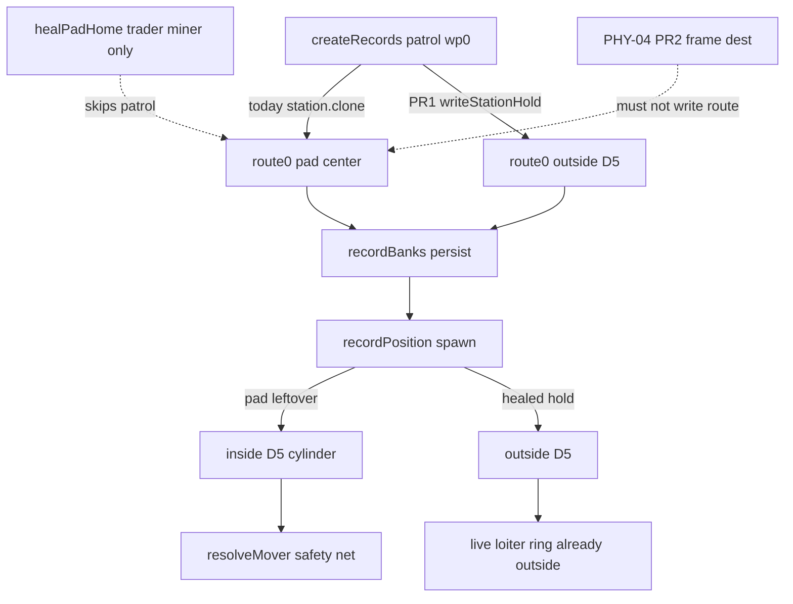

# RIMWARD PHY-05 remaining pad-home

| Field | Value |
|---|---|
| **Title** | RIMWARD PHY-05 remaining pad-home |
| **Author** | Wave 109 PHY-05 integrator |
| **Date** | 2026-08-24 |
| **Status** | Wave 110 first impl of PR1 persist heal + PR2 pins |
| **Wave** | 110 — patrol authored + persist hold (PR1+PR2). |
| **Owner request** | Remaining PHY/AI leftover after PHY-04 first impl: patrol (and any other NPC) **authored pad-center home** still persists in `record.route[0]`. Wave 58 gave trader/miner authored holds. PHY-04 PR2 is **frame-only** retarget and must **not** write `record.route`. Wishlist PHY-02 / AI-01 still want traffic that does not treat the station cylinder as a tunnel, including after save/load. |
| **Merge law** | [`out/w109/padhome/shared-contract.md`](../out/w109/padhome/shared-contract.md). If this brief and that file conflict, the contract wins. |
| **Honor** | HUD-01 empty hub. Digit 0 shipyard. Digit 8/9 stay. `state.js` READ-ONLY; later **no** `state.js` write and **no** new persist key (rewrite lives on existing `record.route`). `innerHTML` forbidden later. No new DOM. No pad-home pip. No toast required. PHY-01 bounce stays. PHY-03 sun radii stay. PHY-04 two-sample / frame retarget is a **sibling** — do not change `applyAvoidBias` here. Autopilot / NAV stay other workers. FLT stays. BIO-06/08 motion, kit mutate omit. Do **not** edit sibling Bio/Nav/Msn/Rep/Shp/Tgt/Hud/Owner docs, the wishlist, or `docs/Phy04AvoidDesign.md`. |

**Verifier record:**

| Note | Path |
|---|---|
| Inventory (code wins) | [`out/w109/padhome/current-phy05-inventory.md`](../out/w109/padhome/current-phy05-inventory.md) |
| Merge law | [`out/w109/padhome/shared-contract.md`](../out/w109/padhome/shared-contract.md) |
| Security review | [`out/w109/padhome/security-review.md`](../out/w109/padhome/security-review.md) |
| Design-doc review | [`out/w109/padhome/code-review.md`](../out/w109/padhome/code-review.md) |
| UI audit | [`out/w109/padhome/ui-audit.md`](../out/w109/padhome/ui-audit.md) |

Siblings PHY-01, PHY-03, PHY-04, FLT, NAV-03/04, BIO-06/07/08, HUD, TGT, SHP, wishlist, `PROGRESS.md`, and `docs/OwnerDecisions*.md` are **other workers**. **Do not edit** those paths. Do **not** write `docs/OwnerDecisionsWave109.md`.

**This is not PHY-01** (bounce/slide). **This is not PHY-03** (sun heat/kill). **This is not PHY-04** (lookahead / frame dest). **This is not a navmesh.** Wishlist PHY-02 / AI-01 acceptance still says traffic must not tunnel the station; collision stays the safety net.

---

## Overview

Wave 58 landed trader/miner **station holds** outside the D5 cylinder. Wave 59 landed `healPadHome` so **old saved** trader/miner `route[0]` on the pad is rewritten. Patrol author is still `station.clone()`. `healPadHome` still returns immediately unless `role` is `trader` or `miner`. Wave 59 `out/w59/routes/verifier.mjs` even pins `leave.patrol.pad`.

PHY-04 (sibling) may later bias a live aim around the cylinder **this frame**. It must **not** write `record.route`. After save/load, `traffic.js` still instantiates at `recordPosition`. For a patrol that just undocked (`leg=0`, `legT=0`) or sits on the first metres of station→gate, that point **is the pad**. `spawnBlocked` is hull-vs-hull, not station keep-out. The hull appears **inside** D5. Bounce is the net. That still reads as a tunnel.

This leftover is **authorship / persist heal**, not lookahead.

This brief is the integrator document for a **later** implementation wave. Wave 109 this worker lands markdown only. Bindings do not change here.

HUD-01 empty aim glass stays empty. `state.js` stays READ-ONLY. No new persist key. Digit 0 stays shipyard. Digit 8/9 stay. Do not invent UU. Do not replace bounce. Do not retune lethal sun radii. Do not steal MATCH/hover. Do not import `planApPath`. Do not add a third hold helper.

Wave 109 deputize (recorded here and in the contract; owner may override after playtest): heal patrol (and any remaining pad-center homes) to a hold **outside D5**, matching trader/miner hold law; reuse `writeStationHold` / `healPadHome`; extend `holdClassFor` so heavy patrols are not given a light hold; persist rewrite on existing `record.route` only.

---

## Background & Motivation

### Current state (inventory)

Source of truth: [`out/w109/padhome/current-phy05-inventory.md`](../out/w109/padhome/current-phy05-inventory.md). Code wins over stale `plainRoute` “gate for patrols” comments.

| Surface | Today | Cite |
|---|---|---|
| Trader wp0 | freighter hold outside D5 | `world.js` 98–102, 106–118 |
| Miner wp0 | light/cutter hold | `world.js` 398–399 |
| Patrol wp0 | **pad `station.clone()`** | `world.js` 374–381 |
| Other `station.clone()` in `src/` | **none** | grep |
| `healPadHome` | trader/miner only; hypot ≤ 0.5 | `world.js` 702–726 |
| `holdClassFor` | trader freighter; else light/cutter else **light** | `world.js` 668–673 |
| Patrol class | `heavy` (hull r 8.5) | `world.js` 378; `ship-scale.js` 131 |
| Rebuild / tick heal | trader/miner | `world.js` 455–456, 831–833 |
| `recordPosition` spawn | docked / wp0 / lerp | `world.js` 629–643; `traffic.js` 105 |
| Patrol live dest | **loiter ring 80–150**, not route | `npc.js` 210–214, 257–258, 1275–1286 |
| `writeStationHold` | persist-safe plain xyz | `traffic-feel.js` 71–102 |
| `minerHoldFromStation` | live scratch only | `npc.js` 900–922 |
| Empty hub | 80 px + RANGE | `hud.css` 184–193; `hud.js` 709–712 |
| Digit 0 / 8 / 9 | shipyard / launch / epics | `station.js` 188, 6041–6046 |
| Persist | `recordBanks` / `records` only | `save.js` `WORLD_FIELDS` 76–101 |
| PHY-04 route write | **forbidden** (frame only) | `out/w108/phy04/shared-contract.md` PR2 |

Player station/gate: Wave 58 **collision** landed. This leftover stays **NPC persist**.

### Pain points

- A naive later PR that only frame-retargets dest (PHY-04 PR2) leaves save/load spawn on the pad.
- A naive later PR that adds `world.holds` invents a `WORLD_FIELDS` key the inventory does not need.
- A naive later PR that only adds `role === 'patrol'` to `healPadHome` still uses `holdClassFor` → **`'light'`** for a **heavy** hull. The hold sits too close.
- A naive later PR that imports `planApPath` or builds a navmesh would smash CPU and NAV ownership.
- A naive later PR that stops the ship until a hold exists would freeze traffic when the helper is missing — forbidden.
- Putting a pad-home pip on the 80 px hub would reopen HUD-01.
- Stealing Digit 0/8/9 would smash shipyard, launch, Standing, or papers.
- Writing holds into `SHIP_CLASSES` would violate `state.js` READ-ONLY.
- Changing `applyAvoidBias` would steal the PHY-04 sibling.
- Inventing UU / a “docking ring” SKU would impersonate the owner.
- Rewriting pirate/ace homes would smash bounty lanes that never used the pad.
- Keeping `out/w58` `src.patrolCenter` forever would block the heal.

### Why now (design) / why not now (code)

The owner asked for the PHY-05 integrator leftover so later serials can heal patrol homes **in the save**, not only this frame. Inventory shows one `station.clone()`, a role-gated healer, a live loiter ring already outside D5, and spawn from `recordPosition`. Merge law can exist without touching `src/`. Implementation waits so hub theft, Digit theft, `state.js` writes, new persist keys, navmesh, AP steal, PHY-04 steal, light-hold-for-heavy, and freeze-in-place are frozen before the first `route[0]` rewrite. Wave 109 this worker does not ship `src/`.

---

## Goals & Non-Goals

### Goals

1. Document live patrol pad home, `healPadHome` role gate, hold helpers, `recordPosition` spawn, live loiter dest, HUD/Digit/persist from **live code**.
2. Freeze **reuse** of `writeStationHold` / `healPadHome`. No third helper.
3. Freeze **holdClassFor** so patrol `heavy` is not a light hold.
4. Freeze persist rewrite on existing `record.route[0]` only. No new `WORLD_FIELDS`.
5. Freeze no navmesh, no A*, no `planApPath` in NPC, no `applyAvoidBias` edit.
6. Freeze no new Digit, no `state.js` write, no UU, no pad-home pip, no toast required.
7. Freeze PHY-01 bounce honor, PHY-03 sun-radius honor, PHY-04 sibling honor.
8. Freeze fail-closed: missing hold helper → live dest; **never** freeze hulls; **never** zero speed.
9. Freeze a serial PR plan. This wave writes the brief. A later wave ships serially.

### Non-goals (locked — do not reopen)

- No `src/` or live bindings in this worker.
- No navmesh / flow field / grid search.
- No PHY-01 bounce replace. No PHY-03 radius retune. No PHY-04 `applyAvoidBias` change.
- No player FLT lookahead. No MATCH/hover/AP reopen.
- No aim-glass pad-home pip / RANGE rewrite.
- No new Digit. No toast required.
- No `SHIP_CLASSES` extra fields. No invented UU or standing deltas.
- No persist `world.padHome`. No settings checkbox.
- Do not rewrite Wave 58 trader/miner holds.
- Do not heal pirate/ace routes.
- Do not retune loiter ring as the leftover.
- Do not edit the wishlist, `PROGRESS.md`, Bio*, Nav*, Msn*, Rep*, OwnerDecisions*, `docs/Phy04AvoidDesign.md`.
- Do not write `docs/OwnerDecisionsWave109.md`.
- Do not fix known boot FAILs.

---

## Proposed Design

### 1. Merge resolutions (contract wins)

| Question | Integrator freeze | Why |
|---|---|---|
| New persist key? | **No** | Inventory: `record.route` already serializes |
| `state.js` write? | **No** | Contract §0.5 |
| Navmesh / A* / `planApPath`? | **Forbidden** | CPU / NAV |
| Change `applyAvoidBias`? | **No** | PHY-04 sibling |
| PHY-04 PR2 write route? | **No** | Frame-only |
| Third hold helper? | **No** | Reuse Wave 59 |
| Persist `minerHoldFromStation`? | **No** | Live scratch |
| Replace bounce? | **No** | PHY-01 net |
| Retune sun radii? | **No** | PHY-03 |
| Fail closed? | Live dest; never stop | Owner; inventory §10 |
| Hold class for patrol? | known `classKey` else `'heavy'` | Inventory: light is wrong |
| HUD / Digit / SKU? | **No** | Frozen |
| First serial steal Digit 0/8/9? | **No** | Contract §0.3 |

### 2. Current motion (do not break bounce / envelopes)

See inventory §§2–5. Load-bearing loops:

**Abstract patrol**

1. `createRecords` writes pad `route[0]`.
2. `tickBank` advances legs. At home (`leg==0`, `legT<=0`) patrol **docks**.
3. Undock → `enroute` at **pad**.
4. `recordPosition` at low `legT` is **inside D5**.
5. `traffic.js` spawns there. Bounce / keep-out fight the cylinder.

**Live patrol**

1. `makeAi` mode **loiter**. Ring 80–150 around station — already outside D5.
2. `tickPatrolJob` may hunt. Hunt dest is a hull, not the pad.
3. `steerLive` → PHY-04 sibling may later bias. **Does not rewrite route.**

**Trader/miner (already healed)**

1. Author hold. `healPadHome` on rebuild/tick. Spawn at hold.

**This serial must not change** restitution, slide friction, sun lethal/heat, player radius, gate bore/tube, combat skip-target, player-gate skip, `applyAvoidBias`. Additive: patrol author + heal + `holdClassFor` + callers.

Digit 0 and `DOCK_KEY_SERVICES` stay. Digit 8/9 stay.

### 3. Deputize table (copy of contract §0.1)

Owner may override after playtest. Do not park.

| Knob | Value |
|---|---|
| Fail-closed | live dest; rec unchanged if helper missing |
| Additive | author hold + `healPadHome` patrol + `holdClassFor` heavy + rebuild/tick call |
| Hold class | patrol known `classKey` else `'heavy'`; trader stays `'freighter'` |
| fromPos | `route[1]` / primary gate / +X (live `holdFromPos`) |
| Shape | keep 3 WPs; rewrite wp0 only |
| Persist | existing `record.route` only |
| PHY-04 | do not touch `applyAvoidBias` |
| Alloc | no extra bag; O(1) heal on existing loops |
| Missing data | dest unchanged; never `speed = 0` |

Combat / hunt dest is not a pad heal. Avoid still only **offsets** job aim (PHY-04).

### 4. Neighbours

| Module | PHY-05 does | PHY-05 does not |
|---|---|---|
| `world.js` `createRecords` | later PR1 patrol hold | pirate/ace rewrite |
| `world.js` `healPadHome` | add patrol; fix `holdClassFor` | new helper name |
| `world.js` tick/rebuild | call heal for patrol | new galaxy cadence |
| `traffic-feel.js` | **call** `writeStationHold` | rewrite pad table |
| `npc.js` loiter / hunt | consume | change ring as the fix |
| `npc.js` `applyAvoidBias` | **none** | PHY-04 sibling |
| `npc.js` `minerHoldFromStation` | none persist | third helper |
| `autopilot.js` / `ap-path.js` | none | import into NPC |
| `ship.js` FLT | none | player lookahead |
| `save.js` | consume `record.route` | new `WORLD_FIELDS` |
| `state.js` | **read SYSTEMS / cruise** | write |
| HUD-01 | none | hub pip |
| Digit 0/8/9 | cite freeze | bind pad-home |

### 5. Serial PR plan

Matches contract §3. **Named only. Do not implement in Wave 109.**

| PR | Lands | Does not land |
|---|---|---|
| **PR1 persist heal** | Patrol author hold; `healPadHome` + `holdClassFor` + rebuild/tick; plain wp0 | `state.js`; Digit; new persist key; navmesh; `planApPath`; `applyAvoidBias`; FLT |
| **PR2 pins** | Invert `out/w58/routes` `src.patrolCenter` and `out/w59/routes` `leave.patrol.pad`; optional WAVE boot pin that patrol wp0 is off pad; grep no new key; no hub child | Known boot FAIL fixes (WAVE4/26/35); wishlist rewrite |
| **PR3 census (optional)** | Re-grep `station.clone()` after playtest | New world field; loiter retune |

First remaining serial is **PR1**. It must not steal Digit 0/8/9. It must not write `state.js`.

### 6. Picture

Reuse live cameras. No new chrome. Traffic readability is **hulls that do not spawn inside the station**, not a HUD label.

No pad-home pip. RANGE stays TGT-01. No toast required (hull strike / STAR HEAT already exist when damage/heat fires).

---

## Player outcome (later serial; freeze here)

Watch a **freighter**. It still homes to a hold, not the pad. This serial does not reopen that.

Watch a **miner**. Same.

Watch a **patrol** after a save/load near the station. It no longer pops out of the D5 core. Abstract home is a hold outside the cylinder. Live loiter ring stays a ring. Bounce still catches a ram.

Fight a pirate. Patrol hunt dest is still a hull. Heal does not steal the gun-pass.

Fly the stick yourself. No new pip. Stations and gates still bounce. The star still heats, then kills, at the **same** radii. Autopilot still threads the bore.

The 80 px hub stays empty. Digit 0 is still shipyard. No one sells “holds.”

**PHY-01** (solid bounce) is **not** this work. **PHY-03** (sun) is **not** this work. **PHY-04** (lookahead) is **not** this work. **NAV-03** (autopilot) is **not** this work.

---

## Security

See [`out/w109/padhome/security-review.md`](../out/w109/padhome/security-review.md).

- XSS: no new DOM. `innerHTML` forbidden later.
- Proto: rewrite is a new `{x,y,z}`; no `for-in` merge from save; `Object.hasOwn` on `SYSTEMS`.
- Persist: no new key; `route[0]` numbers only.
- No secrets. No Digit theft. No UU.
- Fail-closed never freeze hulls.

---

## Acceptance direction (implementation wave)

1. New and healed patrol `route[0]` sits outside D5 by heavy hull + pad (same law as trader/miner).
2. Fail closed: missing hold helper → live dest. Never freeze. Never zero speed. NaN / bad system no-throw.
3. After save/load, spawn at undock / low `legT` is outside the cylinder. Occasional bounce still allowed.
4. PHY-01 bounce still fires on ram. PHY-03 heat/kill radii unchanged. PHY-04 `applyAvoidBias` unchanged.
5. Player FLT unchanged. Player AP still skips gate bodies.
6. No new persist key. No `SHIP_CLASSES` new field. Digit 0 shipyard. Hub 80 px empty of new children.
7. No navmesh. No per-NPC grid. No third hold helper.
8. Pirate/ace homes unchanged. Trader/miner holds unchanged as law.
9. No `innerHTML` on paths this serial touches.
10. `out/w58` / `out/w59` leftover pins invert in PR2. Known boot FAILs untouched.

---

## Alternatives considered

| Alternative | Why not |
|---|---|
| Navmesh / A* per NPC | CPU freeze; not the leftover |
| Import `planApPath` | Steals NAV |
| PHY-04 frame retarget only | Does not survive save/load spawn |
| New `WORLD_FIELDS` key | Inventory: route arrays already persist |
| Third hold helper | Wave 59 already heals pad homes |
| Persist `minerHoldFromStation` | Live scratch; not JSON-plain author |
| Add patrol to heal but keep `holdClassFor` light | Heavy hull hold too close |
| Stop until hold exists | Freezes on missing helper |
| Pad-home pip / Digit / SKU | HUD-01 / Digit / owner impersonation |
| Replace bounce | Removes safety net |
| Retune sun lethal | PHY-03 |
| Change `applyAvoidBias` | PHY-04 sibling |
| Heal pirate/ace | They do not author pad |
| Retune loiter ring | Live dest already outside; leftover is persist |
| Keep `out/w58` patrolCenter pin | Encodes the bug |

---

## Regression risks

| Risk | Mitigation |
|---|---|
| Light hold for heavy patrol | contract `holdClassFor` deputize |
| PHY-04 stolen | no `applyAvoidBias` in this serial |
| AP no longer threads gates | no AP edit |
| Jump freeze | fail-closed live dest; never `speed=0` |
| Navmesh sneaks in | contract §0.10 / §0.15; PR2 grep |
| `state.js` write / new persist key | contract §0.5–0.6 |
| Hub pip / Digit steal | contract §0.2–0.3 |
| Proto merge from save wp | new `{x,y,z}` assign; no `for-in` |
| `out/w58` `src.patrolCenter` fail | PR2 invert leftover pins only; WAVE58 **boot** does not grep the clone |
| Pirate/ace lane smash | do not heal those roles |
| Envelope 80/140/160 reopen | do not touch envelope constants |
| Trader/miner hold law reopen | consume; do not rewrite math |

---

## Ownership

| Object | Writer | Reader |
|---|---|---|
| patrol `route[0]` | later PR1 | `recordPosition`, save |
| `healPadHome` / `holdClassFor` | later PR1 | tick/rebuild/normalize |
| `writeStationHold` | **none** (call) | world.js |
| `applyAvoidBias` | **none** (PHY-04) | steerLive, AP |
| `planApPath` | **none** | autopilot |
| `state.js` | **none** | SYSTEMS / cruise read |
| HUD / Digit | **none** | — |

---

## Open owner questions

**Deputized this wave** (contract §0.1). Owner may override after playtest. Do not park.

1. Smallest additive = patrol author + persist heal via existing helpers. Fail closed = live dest.
2. `holdClassFor` uses known `classKey` for patrol, else `'heavy'`. Trader stays freighter.
3. No new persist key. Existing `record.route` only.
4. Home: `world.js`. Not `state.js`. Not a new Digit. Not `applyAvoidBias`.
5. PHY-04 leftover stays sibling; this leftover is persist.
