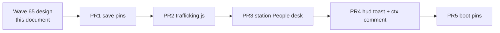

# RIMWARD POD-02 trafficking and Gilded sale

| Field | Value |
|---|---|
| **Title** | RIMWARD POD-02 trafficking and Gilded sale |
| **Author** | Wave 65 POD-02 integrator |
| **Date** | 2026-08-19 |
| **Status** | Implemented. Wave 66 serial first slice (PR1–PR5). |
| **Wave** | 66 — People-desk sale + confirm + toast (design in Wave 65). |
| **Owner request** | Trafficking / Gilded sale design brief. Do not ship sale, events, or `src/` in this wave. |
| **Merge law** | [`out/w65/pod/shared-contract.md`](../out/w65/pod/shared-contract.md). If this brief and that file conflict, the contract wins. |

**Verifier record:**

| Note | Path |
|---|---|
| Inventory (code wins) | [`out/w65/pod/current-pod-inventory.md`](../out/w65/pod/current-pod-inventory.md) |
| Merge law | [`out/w65/pod/shared-contract.md`](../out/w65/pod/shared-contract.md) |
| Security review | [`out/w65/pod/security-review.md`](../out/w65/pod/security-review.md) |
| Design-doc review | [`out/w65/pod/code-review.md`](../out/w65/pod/code-review.md) |

---

## Overview

Wave 60 shipped scoop, spawn, matching-faction Return, and provenance on cargo rows. The market cannot list or sell survivors. `priceOf('survivor')` is 0 on a live market table. Wishlist POD-02 still needs a Gilded sale that is possible and costly. Tone and consequence were not frozen, so the desk did not ship.

This brief is the integrator document for that later implementation wave. It freezes tone, the buyer (Gilded only), the People surface (Digit 7), list prices, reputation and fear deltas, confirm-before-credit, persist (no new `WORLD_FIELDS`), XSS, fail-closed Unknowables, and a serial PR plan. Wave 65 lands this markdown only. Trafficking does not ship here.

SHP already owns Digit 0 Shipyard. HUD-02 is closed. Do not reopen either.

---

## Background & Motivation

### Current state (inventory)

Source of truth for “survivors today”: [`out/w65/pod/current-pod-inventory.md`](../out/w65/pod/current-pod-inventory.md). Code wins over stale comments.

| Surface | Today | Cite |
|---|---|---|
| Cargo row | `{ commodity: 'survivor', units, faction, source, name? }`. `source` is `playerKill` \| `other`. | `pods.js` 19–21, 454–464, 536–542 |
| Scoop merge | Stack only on matching faction+source. Proto / empty faction drop. | `pods.js` 466–513 |
| Spawn | One crew pod per hull. Unknowables skip. `player` last attacker → `playerKill`. | `npc.js` 1308–1336, 2134–2135 |
| Return | Matching-faction People + dock home. `other` +4, `playerKill` +1. | `station.js` 998–1022, 1976–2208; `state.js` 267–272 |
| Market | `COMMODITY_KEYS` only. `tryTrade` refuses `survivor`. `removeCargo('survivor')` no-op. | `station.js` 1600–1604, 1035–1036, 1674 |
| `priceOf('survivor')` | Not a `COMMODITIES` key → `prices[key] ?? 0` → **0** on a live table. | `station.js` 1045–1048; `state.js` 286–300 |
| Persist | Provenance on cargo. Name cap 40. No survivor world field. | `save.js` 73–92, 130–158 |
| Events | `survivorRescued` listed. HUD home toast. No `survivorSold`. | `ctx.js` 213; `hud.js` 409–416 |
| Dock digits | Ten keys. 1–9 Market…Standing. **0** Shipyard. | `station.js` 119, 2262–2269 |

### Pain points

- Wishlist POD-02: recovered people can be sold to the Gilded Chain. Wave 60 froze **no sale**.
- Tone was undefined. A Market A/S row would read as a commodity joke and could complete on one key.
- `priceOf` / `cargoValue` can be non-zero if a save stuffs `prices.survivor`. The live path is 0; the impl must pin 0.
- `addCargo('survivor')` writes a faction-less row (`station.js` 1024–1027). A sale verb must not use that helper.
- Unknowables cannot spawn, but `sanitizeFaction` will keep a hand-edited `unknowables` row. Sale must fail closed.

### Why now (design) / why not now (code)

The owner asked for the trafficking brief after Wave 60 provenance. Inventory and merge law exist. Implementation waits for a later serial wave so People, persist pins, and HUD toast land against frozen tone and numbers.

---

## Goals & Non-Goals

### Goals

1. Gilded docks can buy eligible survivor cargo through a dedicated People verb. The act is costly in standing and fear.
2. Copy is spare, recorded-state, `textContent` only. No gore theater. No comedy desk.
3. Digits 1–9 and Digit 0 stay. Sale folds into People. Confirm required.
4. Return remains on matching-faction home / People, including at Gilded and at every non-Gilded home.
5. Market still cannot list or sell people. `priceOf('survivor')` stays 0.
6. Persist stays on cargo rows + optional milestone id `peopleTrafficked`. No new `WORLD_FIELDS`.
7. This wave writes the brief. A later wave ships serially.

### Non-goals (locked — do not reopen)

- No impl in Wave 65. No emit of `survivorSold` here.
- No new `COMMODITIES` row. No Market people row. No `buy`/`sell` of survivors.
- No new `DOCK_KEY_SERVICES` key. No eleventh dock service.
- No HUD-02 work. No shipyard work. No missiles.
- No scoop / spawn / merge / `RESCUE` number change.
- No automatic sale on dock.
- No slave desk on Independent, Hollow, Beautiful Ones, or any non-Gilded flag.
- No sale of Unknowables survivors.
- No `state.js` feature edit unless a later serial owner must land a tiny table. Prefer `src/game/trafficking.js`.
- No new `settings.js` key.
- No `world.peopleTrafficked` count field.
- Do not edit the wishlist or `PROGRESS.md`.

---

## Proposed Design

### 1. Merge resolutions (contract wins)

| Question | Integrator freeze | Why |
|---|---|---|
| Who buys? | `faction === 'gilded'` only | Contract §1.1. Wishlist names Gilded. Not a universal black market. |
| Where? | People Digit 7, **level 2 only**. Gate `ui.level === 2 && ui.service === 'people'`. Not inside `renderRescue`. | Contract §1.2. Home shares `renderRescue` (`station.js` 2208). |
| Gilded victims at a Gilded dock? | **Both** Return and Offer, as separate lots | Contract §1.3. Rescue path stays. The Chain may still take Chain-born people. |
| UU by source? | `other` **160**, `playerKill` **240** | Contract §2. Authored table, not save. |
| Victim rep? | `other` **0**, `playerKill` **−8** | Wishlist + nearby `RESCUE` (+4 / +1). |
| Gilded rep? | **+2** per unit sold | Supplier goodwill. Not stuffed into `survivorSold.repDelta`. |
| Fear? | `other` **+1**, `playerKill` **+2**, **per confirmed lot** (not per unit) | Below ransom 3 and `killedSurrendered` 8. |
| Unknowables? | No sale | Wave 60 spawn skip; save can still carry the key. |
| Milestone? | `peopleTrafficked` first Confirm only. Witness-rule safe. | Rides `world.milestones`. |
| Settings? | `reducedMotion` shortens copy. No new key. | `settings.js` 28–36. |

---

### 2. Tone

Trafficking is a recorded dock act. The player can do it. The world marks it. The desk does not wink.

**Voice (match station `textContent`):** short sentences, no slang joke, no gore, no irony button. Rescue already speaks this way (`They walk the deck as neighbors.` / `You brought them home.`).

**Forbidden in UI:** slave, meat, stock, bargain, special, debug, :) , ellipsis jokes, body-horror.

**Allowed nouns:** transfer, desk, hold, the Chain, recovered, your kill, UU.

**HUD class:** `warn`, not `good`. This is not a rescue toast.

---

### 3. Dock UI

Shipped (`station.js` 119):

```js
export const DOCK_KEY_SERVICES = Object.freeze([
  'market', 'jobs', 'bar', 'feed', 'repair', 'outfitting', 'people', 'launch', 'epics', 'shipyard',
]);
```

| Index | Digit | Key | Label | This work |
|---|---|---|---|---|
| 0–5 | 1–6 | market…outfitting | unchanged | no sale chrome |
| 6 | **7** | `people` | People | **Sale block lives here** (Gilded + eligible cargo) |
| 7–8 | 8–9 | launch, epics | unchanged | — |
| 9 | **0** | `shipyard` | Shipyard | do not touch |

People level-2 today: `renderRescue` then contacts. No Digit handler (`station.js` 2289–2313).

`renderRescue` is **shared**. People calls it (`station.js` 1997). Level-1 dock home also calls it (`station.js` 2208). Offer must not ride that helper.

**Later implementation — additive inside `renderPeople` only. Do not put sale chrome in `renderRescue`.**

1. Keep `renderRescue` as shipped (Return + “some aboard belong with…”). Home and People both keep using it.
2. Add a new helper (name e.g. `renderTrafficDesk`). Call it from `renderPeople` **after** `renderRescue`. Do **not** call it from the level-1 branch.
3. Gate the helper fail-closed: render Offer / Confirm only when `ui.level === 2 && ui.service === 'people'` (true today whenever `renderPeople` runs; `RENDERERS.people` is the level-2 people pane). If the gate is false, return with no transfer nodes.
4. Inside the gate: if `currentDef.faction === 'gilded'` and `trafficLots(ctx).length > 0`, append the transfer block.
5. Level-1 dock home keeps Return only. No Offer. No Confirm. Do not open People automatically on dock.

#### 3.1 Lots

A **lot** is one `(faction, source)` pair of eligible units (contract §3). Mixed holds show one Offer row per lot. Confirm sells that lot only.

At a Gilded dock with Gilded + Freehold cargo: Return (Gilded) stays; Offer rows exist for Gilded lots **and** Freehold lots.

#### 3.2 Confirm flow (no single digit)

Copy yard papers (`shipyard-desk.js` 123–131, 198–219):

```
[Offer to the Chain]  →  arm ui.trafficPending = { faction, source }
[Confirm transfer]    →  applySurvivorSale (only debit)
[Esc — Cancel]        →  clear pending
```

- Digits do **not** debit. Digit 0 on People does **not** open Shipyard and does **not** confirm. Bar / feed / repair complete on one Digit — **do not** copy that onto People sale.
- Return stays one-click (`applySurvivorRescue`). It does not arm `trafficPending`.
- Recompute count, UU, and eligibility at Confirm time.
- If the lot is gone (Return, other consume): refuse, clear pending, no UU.
- `requestAutosave` after a successful debit (same gates as other desk spends).
- Clear pending on undock and on Back to level 1.

Session field `ui.trafficPending` is RAM only. Do not persist it.

---

### 4. Frozen copy

Use `FACTIONS[faction].name` for display. Never print a raw id. Never print unsanitized `row.name` in the first slice (count + faction + source is enough). If a later owner adds names, they are `textContent` after `sanitizeSurvivorName`.

`reduced` = `ctx.settings?.reducedMotion === true`.

| Slot | Full | Reduced |
|---|---|---|
| Block note | `The Chain keeps a transfer desk. They pay for people still in the hold.` | `Transfer desk.` |
| Lot line | `{n} {FactionName} · {recovered\|your kill} · {unitPrice} UU each` | `{n} · {unitPrice} UU` |
| Arm button | `Offer to the Chain` | `Offer` |
| Confirm meta | `{n} · {total} UU · Confirm transfer` | `{total} UU · Confirm` |
| Confirm button | `Confirm transfer` | `Confirm transfer` (same — the verb is the control) |
| Cancel | `Esc — Cancel` | `Esc — Cancel` |
| Success notice | `The Chain takes them. {n} transferred. {total} UU.` | `Transferred. {total} UU.` |
| Empty / vanished | `They are no longer in the hold.` | `They are no longer in the hold.` |
| Ineligible only | `The desk will not take them.` | `The desk will not take them.` |
| First milestone line | `The Chain recorded a transfer.` | `The Chain recorded a transfer.` |
| HUD toast | `■ The Chain took one.` / `■ The Chain took {n}.` | same (already short) |

Market refuse line stays: `This dock does not trade in people.`

---

### 5. Apply path

New module `src/game/trafficking.js` (named now, written in the impl wave).

Export:

- `TRAFFIC_LIST_UU`, `TRAFFIC_REP`, `TRAFFIC_FEAR` (contract §2)
- `isTrafficEligible(row, cap)`
- `trafficLots(ctx)` → `[{ faction, source, units, unitPrice, total }]`
- `applySurvivorSale(ctx, faction, source)` → payload or `null`

`applySurvivorSale` (single mutator):

1. Buyer must be the **current dock** faction `gilded` at Confirm time. Pass the live dock faction in; do not trust a button attribute or the armed snapshot for the buyer.
2. Recompute the lot. `units === 0` → `null`.
3. Remove **only** matching eligible rows (`faction` + normalized `source`). Do not call `removeSurvivorsForFaction` (that helper is rescue: matching dock faction, other-first).
4. If removed units === 0 → `null` (no credit).
5. `credits += total` (integer; `Number.isFinite` purse or refuse **before** remove — compute first, refuse, then remove+pay in one turn). Read/write `ctx.cargo` only (mounted hold). Never hangar parked rows.
6. Victim `reputation[faction] += TRAFFIC_REP.victim*` only when `isFactionKey(faction)` and `Object.hasOwn(FACTIONS, faction)`.
7. `reputation.gilded += 2 * units` with the same key guards. If the victim **is** `gilded`, both deltas apply (net −6 per `playerKill` unit, net +2 per `other` unit).
8. Fear: clamp `0..100` after `+ TRAFFIC_FEAR[source]` **once per confirmed lot** (not per unit). Emit `fearChanged`. Same helper shape as `npc.js` `bumpFear` 323–326.
9. First time: push `peopleTrafficked` and emit `milestone`.
10. Build payload `{ faction, source, count, credits: total, repDelta, line }`.
11. Emit `survivorSold` and `commLine` (impl wave, not Wave 65). `commLine.text` is an authored string from §4. Do not interpolate `row.name`.

**Double-sale:** one in-flight apply. Confirm handler ignores re-entry while `ui.trafficBusy` is true, then clears. Do not debit twice for one pending object.

**Reserved keys:** build bags with literals / `Object.create(null)` only if you must clone. Never `reputation[userFaction] =` without `isFactionKey` + `hasOwn(FACTIONS)`.

---

### 6. Market law

Leave `COMMODITIES` unchanged.

Impl-wave guard on `priceOf` (`station.js` 1045–1048):

```js
if (key === 'survivor') return 0;
```

Keep `tryTrade` belt-and-braces refuse (`station.js` 1600–1604). Keep `removeCargo` no-op for `'survivor'`.

`cargoValue` (`state.js` 1070–1071) treats a missing commodity as 0 **unless** `world.prices.survivor` is stuffed. `state.js` is READ-ONLY. Trafficking code and pins must not use `cargoValue` as a people price. If a later serial owner edits `state.js`, skip `commodity === 'survivor'` in that reducer. Do not add a base price to do it.

---

### 7. Persist and XSS

| Value | Allow |
|---|---|
| Cargo `source` | `playerKill`, else `other` (already) |
| Cargo `faction` | `sanitizeFaction` (already) |
| Cargo `name` | strip controls, trim, cap 40 (already) |
| Extra cargo keys | drop (already) |
| `WORLD_FIELDS` | **no add** |
| Milestone id | `peopleTrafficked` only, first success |
| Desk prices | `TRAFFIC_LIST_UU` in code |
| Dock service key | frozen ten-key list |
| `ui.trafficPending` | session. `{ faction, source }` allowlist |

- `h()` stays `textContent` (`station.js` 1454–1459).
- Do not `innerHTML` notices, lot lines, or names.
- Overlay already resets with `overlay.textContent = ''` (`station.js` 2184).
- Live scoop does **not** cap `name` (`pods.js` 495). First-slice UI does not print `name`. Impl may still run the sanitizer if a later slice shows it.

---

### 8. Events (later impl)

List on `ctx.js` next to `survivorRescued`:

```
'survivorSold' { faction, source, count, credits, repDelta }  (station.js / trafficking.js)
```

HUD (`hud.js` toast switch):

```
case 'survivorSold':
  if (e.line) mem.frameLines.push(e.line);
  const n = e.count ?? 0;
  const text = n === 1 ? '■ The Chain took one.' : `■ The Chain took ${n}.`;
  return { text, cls: 'warn' };
```

Do not emit from this design wave.

---

### 9. Open questions (answered — do not leave to implementers)

| # | Question | Frozen answer |
|---|---|---|
| 1 | UU per person by source? | `other` 160. `playerKill` 240. Code table. |
| 2 | Reputation deltas? | Victim: 0 / −8 per unit. Gilded buyer: +2 per unit. Fear: +1 / +2 **per lot**. |
| 3 | Gilded survivors at a Gilded dock? | Return **and** Offer, separate lots. Player chooses. |
| 4 | Empty hold? | No transfer chrome. |
| 5 | Mixed-faction cargo? | One lot per `(faction, source)`. Confirm one lot. |
| 6 | `__proto__` / reserved keys? | Not eligible. Never write `reputation['__proto__']`. Same `isFactionKey` as scoop. |
| 7 | Reduced copy? | `ctx.settings.reducedMotion`. No new settings key. Table in §4. |
| 8 | Unknowables? | No sale. Refuse line if they are the only survivors. |
| 9 | Beautiful / Independent / Hollow desks? | No. |
| 10 | Auto-sale on dock? | No. |
| 11 | New `WORLD_FIELDS`? | No. Milestone id only. |
| 12 | Confirm digit? | No Digit completes a sale. |

---

## API / Interface Changes

No public API change in Wave 65.

Later implementation wave:

| Surface | Change |
|---|---|
| New `src/game/trafficking.js` | Tables + `applySurvivorSale` + eligibility. Pure data. |
| `src/systems/station.js` | People level-2 Gilded block via a helper called from `renderPeople` only (not `renderRescue`). Gate `ui.level === 2 && ui.service === 'people'`. Confirm. `priceOf` explicit 0. Import trafficking. Do not add a dock key. |
| `src/game/save.js` | **Pins only** unless a sanitizer hole appears. No new `WORLD_FIELDS`. Name cap stays 40. |
| `src/systems/hud.js` | `survivorSold` toast. No HUD-02. |
| `src/core/ctx.js` | Comment only — list `survivorSold`. |
| `src/game/state.js` | **READ-ONLY.** Do not add `TRAFFIC_*` here. |
| `src/game/pods.js` / `npc.js` | **No change.** |
| `src/game/shipyard.js` / shipyard desk | **No change.** |
| `src/systems/settings.js` | **No change.** |

---

## Data Model Changes

Wave 65 adds **no** persist keys in the running game. Later implementation:

| Field | Owner | Persist | Rule |
|---|---|---|---|
| Cargo survivor row | pods + save | Existing `sanitizeCargoList` | No new keys |
| `ctx.world.milestones` | station / trafficking | Existing `WORLD_FIELDS` | May append `'peopleTrafficked'` once |
| `ctx.world.credits` / `fear` / `reputation` | apply | Existing | Finite writes. Allowlisted faction keys |
| `ui.trafficPending` | station UI | **Not persisted** | `{ faction, source }` |
| `TRAFFIC_LIST_UU` | trafficking.js | **Not persisted** | Authored |

---

## Alternatives Considered

### Surface

**Alt S1 — Gated Market row at Gilded when survivor cargo is present.**  
Rejected. Digit 1 + A/S already sell the selected commodity. A people row is a commodity sneak and a one-key debit. `priceOf` would have to grow a fake market price. Contract §1.2 / §5.

**Alt S2 — New `DOCK_KEY_SERVICES` entry (Digit…?).**  
Forbidden. Digits 1–9 and 0 are spent. An eleventh service has no digit.

**Alt S3 — Level-1 dock home Offer.**  
Rejected. Home already shows Return (`renderRescue` at `station.js` 2208). Confirm needs a pane. Auto-visible sale on every Gilded berth is too loud. Do **not** implement Offer by extending `renderRescue`.

**Chosen:** People level 2. Digit 7 unchanged. Dedicated helper + `ui.level === 2 && ui.service === 'people'`.

### Buyer

**Alt B1 — Universal black market on every dock.**  
Rejected. Wishlist names Gilded. Independent / hollow / beautiful do not grow a slave desk.

**Alt B2 — Fence / fixer trust gate instead of Gilded.**  
Rejected. First impl is faction-flag only. No new contact role.

**Chosen:** `currentDef.faction === 'gilded'`.

### Gilded victims

**Alt G1 — Return only (cannot sell Chain-born to the Chain).**  
Rejected. The player can still choose Return. Forbidding the sale hides the faction’s nature.

**Alt G2 — Sale only (hide Return at Gilded).**  
Forbidden. Rescue must remain.

**Chosen:** both verbs, separate lots.

### Prices

**Alt P1 — Same UU for both sources.**  
Rejected. `playerKill` must tempt more than `other` because standing costs more.

**Alt P2 — Read UU from `world.prices` or `COMMODITIES`.**  
Rejected. Market sneak. Tamper authors the purse.

**Chosen:** `TRAFFIC_LIST_UU` in code.

---

## Security & Privacy Considerations

See [`out/w65/pod/security-review.md`](../out/w65/pod/security-review.md).

| Risk | Severity | Mitigation |
|---|---|---|
| XSS via survivor `name` / faction display | **High** | `textContent` only. First slice does not print `name`. Cap 40 on persist. |
| Persist of unsanitized name / extra keys | **High** | Existing `sanitizeCargoRow`. No new cargo fields. No new `WORLD_FIELDS`. |
| Market commodity sneak (`prices.survivor`, A/S) | **High** | No `COMMODITIES` row. Explicit `priceOf` 0. Dedicated verb. |
| Reputation proto-key write | **High** | `isFactionKey` + `Object.hasOwn(FACTIONS)`. Fail closed. |
| Double-sale / Digit-complete debit | **High** | Confirm only. Recompute. Busy flag. Pending is session. |
| Unknowables / oversize / non-finite units | **Medium** | Same unit cap as rescue. No sale if ineligible. |
| Save-minted units cash UU + rep | **Low** | Local sim. Cap = hold. Same as Wave 60 rescue review. |

Threat model: local browser game. Practical attacks are save tamper, DOM XSS from world strings, and prototype-key smuggling. Fail closed on all three.

---

## Observability

No production metrics stack exists. Acceptance is boot pins in the impl wave (PR5).

| Signal | How |
|---|---|
| Eligible lots | `trafficLots(ctx)` length |
| Sale | `survivorSold` payload |
| First transfer | milestone `peopleTrafficked` |
| Market still blocked | `priceOf(ctx, 'survivor') === 0`; `tryTrade` refuse |

---

## Rollout Plan

Wave 65: this document only. Do not schedule or land the PRs below in Wave 65.

Later implementation is **serial**. One owner at a time on `station.js`, `save.js`, `hud.js`.

| PR | Owner file | What |
|---|---|---|
| **PR1** | `save.js` (pins) | Allowlist check. Extra keys drop. Name cap 40. No `WORLD_FIELDS` add. No UI. |
| **PR2** | `src/game/trafficking.js` | Tables + `applySurvivorSale`. Fail-closed. No DOM. |
| **PR3** | `station.js` | People Gilded block. Offer → Confirm. `priceOf` guard. Return untouched. |
| **PR4** | `hud.js` + `ctx.js` comment | `survivorSold` toast. List the event. |
| **PR5** | boot pins | Empty / mixed / Unknowables / proto / oversize / double-confirm / non-Gilded / Return / Market A/S. |

Do not parallel-edit `station.js` with another Wave 65 task. Safer companion `trafficking.js` still coordinates with station.

Rollback: revert the PR that failed. Leave sanitizer pins if UI rolls back so saves stay loadable.



---

## Open Questions (defaults 2026-08-19)

Owner-facing leftovers. Implementers use the default. The table in §9 is **closed** for tone and numbers.

| # | Question | Default |
|---|---|---|
| 1 | Print survivor `name` on the lot line in a later slice? | **No** in the first impl wave. Count + faction + source only. |
| 2 | Trust / fixer discount on the desk? | **No.** Flat `TRAFFIC_LIST_UU`. |
| 3 | Sell to Beautiful Ones later? | **No** until a new brief. |
| 4 | `atrocity` event on `playerKill` sale? | **No.** `survivorSold` + fear only. |

---

## References

- [`out/w65/pod/shared-contract.md`](../out/w65/pod/shared-contract.md) — merge law
- [`out/w65/pod/current-pod-inventory.md`](../out/w65/pod/current-pod-inventory.md)
- [`docs/ShpDesign.md`](ShpDesign.md) — document shape; Digit 0 / confirm papers (do not copy SHP content)
- [`docs/Hud02IdentitiesDesign.md`](Hud02IdentitiesDesign.md) — document shape only
- [`docs/PLAYER-EXPERIENCE-WISHLIST.md`](PLAYER-EXPERIENCE-WISHLIST.md) — Initiative POD ~677–710
- `src/game/pods.js` — survivor cargo, `survivorKey`, `spawnSurvivorPod`
- `src/systems/station.js` — Return, market skip, `priceOf`, `DOCK_KEY_SERVICES`
- `src/game/save.js` — `sanitizeCargoRow`, `WORLD_FIELDS`
- `src/core/ctx.js` — `survivorRescued` comment
- `src/systems/hud.js` — rescue toast
- `src/game/shipyard.js` — `YARD_LIST_UU` pattern
- `src/systems/shipyard-desk.js` — Confirm papers / Digit does not debit

---

## Key Decisions

| Topic | Decision | Rationale |
|---|---|---|
| Tone | Possible, costly, spare, not a joke | Wishlist asked for consequence before ship |
| Buyer | Gilded docks only | Not a universal slave market |
| Surface | People Digit 7 | Digit law; Return already lives here |
| Confirm | Click Confirm transfer | Same discipline as yard papers |
| Prices | 160 / 240 UU in code | Tempt `playerKill`, do not save-author UU |
| Victim rep | 0 / −8 | Wishlist split; nearby rescue table |
| Unknowables | Fail closed | Wave 60 spawn skip |
| Persist | Cargo rows + milestone id | Provenance already rides the hold |
| Hold | `ctx.cargo` only | Parked hangar rows are not a desk |
