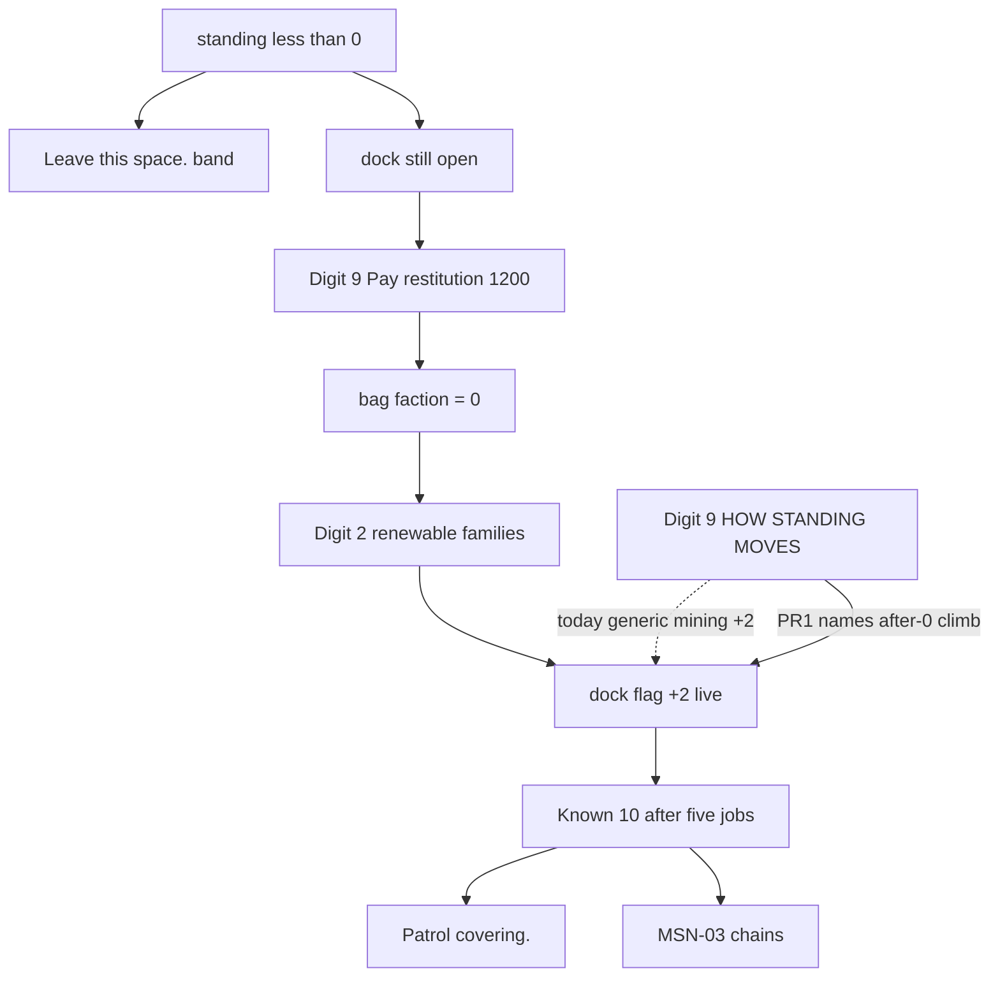

# RIMWARD REP-03 remaining remedial missions

| Field | Value |
|---|---|
| **Title** | RIMWARD REP-03 remaining remedial missions |
| **Author** | Wave 110 REP-03 integrator |
| **Date** | 2026-08-24 |
| **Status** | first impl Wave 111 PR1 |
| **Wave** | 111 — Digit 9 copy names live +2 job families after restitution-to-0. |
| **Owner request** | Remaining REP-03 leftover after police leave, risky dock, restitution-to-neutral, and POD-01 survivor return: **remedial missions can then rebuild genuine standing**. Inventory: renewable job families **already write +2** to the dock flag with **no standing gate**. Named Digit 9 loop copy is **not** shipped. |
| **Merge law** | [`out/w110/rep03/shared-contract.md`](../out/w110/rep03/shared-contract.md). If this brief and that file conflict, the contract wins. |
| **Honor** | HUD-01 empty hub. Digit 0 shipyard. Digit 2 Jobs. Digit 8/9 stay. `state.js` READ-ONLY; later **no** `state.js` write and **no** new persist key. `innerHTML` forbidden later. No wanted pip. No new Digit. No new job `kind`. Do not retune `RESTITUTION_UU` 1200. Do not impersonate kill −5, covering Known 10, jump −25. Digit 2 family caps, unique four, MSN-03 chains — **do not reopen**. REP-05 sibling — **do not edit** `docs/Rep05ConsequencesDesign.md`. Kit mutate omit. BIO/MSN unique SKU / PHY-05 are **other workers**. |

**Verifier record:**

| Note | Path |
|---|---|
| Inventory (code wins) | [`out/w110/rep03/current-rep03-inventory.md`](../out/w110/rep03/current-rep03-inventory.md) |
| Merge law | [`out/w110/rep03/shared-contract.md`](../out/w110/rep03/shared-contract.md) |
| Security review | [`out/w110/rep03/security-review.md`](../out/w110/rep03/security-review.md) |
| Design-doc review | [`out/w110/rep03/code-review.md`](../out/w110/rep03/code-review.md) |
| UI audit | [`out/w110/rep03/ui-audit.md`](../out/w110/rep03/ui-audit.md) |
| Wave 111 probe | [`out/w111/rep03/probe.mjs`](../out/w111/rep03/probe.mjs) |
| Wave 111 pin extract | [`out/w111/rep03/wave111-pins.mjs`](../out/w111/rep03/wave111-pins.mjs) |
| Wave 111 security | [`out/w111/rep03/security-review.md`](../out/w111/rep03/security-review.md) |
| Wave 111 code review | [`out/w111/rep03/code-review.md`](../out/w111/rep03/code-review.md) |
| Wave 111 UI audit | [`out/w111/rep03/ui-audit.md`](../out/w111/rep03/ui-audit.md) |

Siblings REP-04, REP-05, POD-01, MSN-03, unique four, HUD, TGT, SHP, BIO, PHY, NAV, wishlist, `PROGRESS.md`, and `docs/OwnerDecisions*.md` are **other workers**. **Do not edit** those paths. Do **not** write `docs/OwnerDecisionsWave110.md`.

**This is not restitution retune.** **This is not police leave.** **This is not covering / jump refuse.** **This is not a new job family.** Wishlist REP-03 still wants a **then**: after pay-to-0, missions rebuild genuine standing.

---

## Overview

Wave 83 landed the Digit 9 restitution desk: **1200 UU**, two-step confirm, offended `FACTIONS` key set to **0**. Wave 95 landed `Leave this space.` in the hostile band. Dock never standing-gates a risky run. POD-01 return of that flag's survivors already writes `RESCUE` standing. Digit 2 renewable families already credit the **dock flag +2** on success (`MINING_REP`) with **no** standing gate.

The leftover is **not** a missing writer. Digit 9 never names the **reset then climb** loop. A player who pays restitution sees Stranger 0, the RESTITUTION block hides, and HOW STANDING MOVES still lists mining +2 as a generic fact — not as the path from 0 to Known.

This brief is the integrator document for a **later** implementation wave. Wave 110 this worker lands markdown only. Bindings do not change here.

HUD-01 empty aim glass stays empty. `state.js` stays READ-ONLY. No new persist key. Digit 0 stays shipyard. Digit 2 stays Jobs. Digit 8/9 stay. Do not invent a `kind`. Do not invent UU. Do not steal MATCH/hover. Do not reopen family caps.

Wave 110 deputize (recorded here and in the contract; owner may override after playtest): after restitution to **0**, Digit 9 copy points at **existing** renewable families (mining, trade, hunt, passenger, explore, spy, war) that write **+2** to the offended dock flag; fail closed if the notes helper is missing; no new Digit; no `state.js` write.

---

## Background & Motivation

### Current state (inventory)

Source of truth: [`out/w110/rep03/current-rep03-inventory.md`](../out/w110/rep03/current-rep03-inventory.md). Code wins over “remedial not shipped” if that is read as “no +standing jobs.”

| Surface | Today | Cite |
|---|---|---|
| Restitution UU | **1200** | `restitution.js` 5 |
| Restitution write | offended key **= 0** | `restitution.js` 62 |
| Digit 9 desk | Pay / Confirm / short; standing `< 0` | `station.js` 5820–5842 |
| Ladder at 0 | Stranger tier 0 | `state.js` 714–721 |
| `standingRead` | miss → 0 | `data-trade.js` 73–80 |
| Digit 9 move notes | mining +2, patrol Freehold +5, rescue, sale, graft | `station.js` 1151–1160 |
| Digit 9 live notes | hunt −10, leave, yards, covering 10, jump −25, restitution 1200 | `station.js` 1163–1192 |
| Renewable +2 | mining/trade/hunt/passenger/explore/spy/war; **no standing gate** | `station.js` 3902, 3952, 3620, 4000, 4065, 4139, 3554 |
| Chain gate | Known `tier >= 1` | `jobs-chains.js` 84–86 |
| Unique four | ace/patrol/haul/ferry; patrol **Freehold +5 only** | `save.js` 152–157; `station.js` 3784 |
| Family caps | 2 / system | `station.js` 225–231 |
| Police leave | `Leave this space.` band `< 0` and `> −10` | `police-leave.js` 5, 117 |
| Covering | Known 10 | `police-cover.js` 9 |
| Jump refuse | dest `< −25`; dock open | `jump.js` 10, 104–111 |
| Kill | −5 | `kill-standing.js` 6 |
| POD-01 | other +4 / kill +1 | `state.js` 331–336; `station.js` 2003–2029 |
| Dock | range 45; **no** standing check | `station.js` 6222–6233 |
| Empty hub | 80 px + RANGE | `hud.css` 184–193; `hud.js` 709–712 |
| Digit 0 / 2 / 8 / 9 | shipyard / jobs / launch / Standing | `station.js` 188, 5938, 6075–6077 |
| Persist | `reputation` + `jobs` already | `save.js` 76–78 |
| Wanted field | **absent** | `WORLD_FIELDS` 76–101 |

### Pain points

- A naive later PR that adds `kind: 'remedial'` would smash Digit 2 caps, unique four, and `JOB_KINDS` sanitize.
- A naive later PR that “locks jobs until restitution” would **lie** — families already post below 0 — and would steal Digit 2.
- A naive later PR that lowers MSN-03 chains to Stranger would reopen Known 10.
- A naive later PR that adds `world.wanted` would smash REP-04 local standing.
- Putting a wanted / remedial pip on the 80 px hub would reopen HUD-01.
- Stealing Digit 0/8/9 would smash shipyard, launch, Standing, or papers.
- Stealing Digit 2 for a “penance” pane would smash the jobs board.
- Writing `REMEDIAL_REP` into `state.js` would violate READ-ONLY.
- Retuning `RESTITUTION_UU` or `MINING_REP` would impersonate the owner.
- Impersonating kill −5, covering 10, or jump −25 as “remedial knobs” would smash REP-04/05.
- Claiming patrol rebuilds every offended flag would lie (Freehold only).
- Blanking Digit 9 if a helper is missing would hide Pay restitution.

### Why now (design) / why not now (code)

The owner asked for the REP-03 integrator leftover so later serials can name the **genuine climb after 0** without inventing a career. Inventory shows restitution-to-0, live +2 writers, Digit 9 notes that omit the loop, and persist already on `reputation` / `jobs`. Merge law can exist without touching `src/`. Implementation waits so hub theft, Digit theft, `state.js` writes, new persist keys, new job kinds, UU retune, and lying copy are frozen before the first extra `screen-note`. Wave 110 this worker does not ship `src/`.

---

## Goals & Non-Goals

### Goals

1. Document live restitution, Digit 9 copy, job standing writers, leave/covering/jump, persist, HUD/Digit from **live code**.
2. Freeze **reuse** of `MINING_REP` / existing job success deltas. No new `kind`.
3. Freeze Digit 9 as the only new copy surface. Digit 2 stays Jobs.
4. Freeze persist: **no** new `WORLD_FIELDS`. Inventory: bag + jobs already serialize.
5. Freeze no wanted meter, no hub pip, no new Digit, no `state.js` write, no UU retune.
6. Freeze fail-closed: missing notes helper → live Digit 9; **never** blank Standing.
7. Freeze copy honesty: jobs already work below 0; restitution is reset to 0; climb is +2 from 0; five jobs reach Known 10; patrol is Freehold-only; graft still caps Beautiful.
8. Freeze a serial PR plan. This wave writes the brief. A later wave ships serially.

### Non-goals (locked — do not reopen)

- No `src/` or live bindings in this worker.
- No new job `kind`. No Digit 2 family-cap change. No unique-four reopen. No MSN-03 chain-gate change.
- No restitution 1200 retune. No `MINING_REP` retune. No `RESCUE` retune.
- No police-leave / covering / jump / kill reopen.
- No standing-gated dock.
- No aim-glass wanted pip / RANGE rewrite.
- No new Digit. No toast required.
- No `state.js` extra fields. No invented UU (do not mint a second 1200).
- No persist `world.wanted` / `world.remedial`. No settings checkbox.
- Do not edit the wishlist, `PROGRESS.md`, Bio*, Nav*, Msn*, Phy*, `docs/Rep05ConsequencesDesign.md`, `docs/Rep04AttributionDesign.md`, `docs/RepStandingDesign.md`, OwnerDecisions*.
- Do not write `docs/OwnerDecisionsWave110.md`.
- Do not fix known boot FAILs.

---

## Proposed Design

### 1. Merge resolutions (contract wins)

| Question | Integrator freeze | Why |
|---|---|---|
| New persist key? | **No** | Inventory: `reputation` + `jobs` already serialize |
| `state.js` write? | **No** | Contract §0.5 |
| New job `kind`? | **Forbidden** | Inventory §3 writers exist |
| Steal Digit 2 / 0 / 8 / 9? | **No** | Contract §0.3 |
| Retune 1200 / +2 / −5 / 10 / −25? | **No** | Honor live knobs |
| Wanted meter / hub pip? | **No** | HUD-01 / REP-04 |
| Fail closed? | Live Digit 9; never blank | Owner; inventory §10 |
| Lower chain gate? | **No** | MSN-03 frozen |
| HUD / SKU? | **No** | Frozen |
| First serial steal Digit 0/8/9? | **No** | Contract §0.3 |
| First serial write `state.js`? | **No** | Contract §0.5 |

### 2. Current motion (do not break restitution / jobs / leave)

See inventory §§1–4. Load-bearing loop:

**Hostile → pay → climb (live writers; missing copy)**

1. Standing `< 0` and `> −10`: `Leave this space.` once per visit. Dock still opens.
2. Standing ≤ −10: patrols may hunt. Dock still opens. Jump dest `< −25` refuses inbound (`No passage.`); dock still opens.
3. Digit 9: Pay 1200 → confirm → offended key **= 0** (Beautiful graft may pull to −10).
4. Digit 2: mining/trade/hunt/passenger/explore/spy/war still post. Success **+2** dock/origin flag. **No standing gate.**
5. At **10** Known: covering and MSN-03 chains open. Digit 9 live notes already say this.

**This serial must not change** restitution debit, job pay, family caps, unique four, chain gate, leave, covering, jump, kill −5, POD-01, graft cap. Additive: Digit 9 note(s) only.

Digit 0 and `DOCK_KEY_SERVICES` stay. Digit 8/9 stay. Digit 2 stays Jobs.

### 3. Deputize table (copy of contract §0.1)

Owner may override after playtest. Do not park.

| Knob | Value |
|---|---|
| Fail-closed | Digit 9 Pay restitution + live notes if helper missing; never blank |
| Additive | Digit 9 copy naming live +2 families after 0; **not** inside the `< 0` RESTITUTION block |
| Families | mining, trade, hunt, passenger, explore, spy, war |
| Climb | 0 + 5 × `MINING_REP` 2 = Known 10 |
| Patrol | Freehold +5 only if mentioned |
| Persist | none |
| First serial | PR1 copy; no Digit 0/2/8/9 steal; no `state.js` |

### 4. Neighbours

| Module | REP-03 leftover does | REP-03 leftover does not |
|---|---|---|
| `station.js` `renderEpics` | later PR1 notes | new Digit / restitution math |
| `station.js` `standingMoveNotes` | optional one line | replace live leave/covering/jump lines |
| Digit 2 `sync*` / `acceptJob` | **none** | family caps / unique four |
| `jobs-chains.js` | consume Known gate | lower gate |
| `restitution.js` | consume | retune 1200 |
| `police-leave.js` / `police-cover.js` / `jump.js` / `kill-standing.js` | consume | impersonate knobs |
| `save.js` | consume `reputation` / `jobs` | new `WORLD_FIELDS` |
| `state.js` | **read** `RANK_LADDER` / `RESCUE` | write |
| HUD-01 | none | hub pip |
| Digit 0/8/9 | cite freeze | bind remedial as a verb |

### 5. Serial PR plan

Matches contract §3. **Named only. Do not implement in Wave 110.**

| PR | Lands | Does not land |
|---|---|---|
| **PR1 Digit 9 copy** | Fail-closed notes helper + `renderEpics` `textContent` lines | `state.js`; Digit steal; new `kind`; new persist key; family caps; UU; HUD |
| **PR2 pins** | Optional grep Digit 9 names Jobs / +2 / after restitution; no new key; no hub child; no `kind: 'remedial'` | Known boot FAIL fixes; wishlist rewrite |
| **PR3 census (optional)** | Re-grep +2 writers still ungated | Retune `MINING_REP` |

First remaining serial is **PR1**. It must not steal Digit 0/8/9. It must not steal Digit 2. It must not write `state.js`.

### 6. Picture

Reuse live Digit 9 `screen-note` rows. No new chrome. Player readability is **Standing text that names the climb**, not a HUD pip.

No wanted pip. RANGE stays TGT-01. No toast required (job `commLine` already speaks `standing +2`).

---

## Player outcome (later serial; freeze here)

Dock hostile. Digit 9 still offers **Pay restitution** at 1200 UU when standing is below 0 and credits cover it.

Pay. Standing with this dock's flag is **0** (Stranger), unless Beautiful graft caps −10. RESTITUTION hides.

Open **Jobs board** (Digit 2). Take a mining (or live sibling) contract. File it. Digit 9 now reads **+2**. Five such jobs reach **Known 10**. Covering and unique chains then match live REP-05 / MSN-03 gates.

The 80 px hub stays empty. Digit 0 is still shipyard. Digit 8 is still launch. Nobody sells a “wanted” meter.

**Police leave** is **not** this work. **Covering / jump** is **not** this work. **POD-01** is **not** this work. **MSN-03** is **not** this work.

---

## Security

See [`out/w110/rep03/security-review.md`](../out/w110/rep03/security-review.md).

- XSS: no new hub DOM. `innerHTML` forbidden later. Digit 9 `h()` `textContent`.
- Proto: copy-only helper; writes stay `writeFactionStanding` / live job paths with `Object.hasOwn(FACTIONS)`.
- Persist: no new key.
- No secrets. No Digit theft. No UU retune.
- Fail-closed never blank Standing.

---

## Acceptance direction (implementation wave)

1. After successful restitution, dock standing is 0 (Stranger) unless graft caps Beautiful at −10.
2. Digit 2 renewable families still post. One success adds +2 to that dock flag (live writer).
3. Digit 9 names that path. Copy does not invent a `kind`. Copy does not say jobs were locked until pay. Copy does not say patrol rebuilds every flag.
4. Fail closed: missing helper → live Digit 9. Never throw. Never blank. Pay restitution still shows when standing `< 0`.
5. Five +2 from 0 reach Known 10 (unless graft). Chain/covering gates unchanged.
6. No new persist key. Digit 0 shipyard. Digit 2 Jobs. Hub 80 px empty of new children.
7. No wanted meter. No new job kind. No `state.js` write.
8. Leave / dock-open / 1200 / POD-01 / covering / jump / kill −5 unchanged.
9. No `innerHTML` on paths this serial touches.
10. Known boot FAILs untouched.

---

## Alternatives considered

| Alternative | Why not |
|---|---|
| New `kind: 'remedial'` | Inventory: +2 writers exist; would smash caps / sanitize |
| Lock jobs until restitution | Lies; jobs already post below 0; steals Digit 2 |
| Lower chain gate to 0 | Reopens MSN-03 Known |
| New `WORLD_FIELDS` wanted | Smash REP-04; inventory does not need it |
| Wanted pip / RANGE rewrite | HUD-01 |
| Digit / SKU / UU retune | Owner impersonation |
| `state.js` REMEDIAL table | READ-ONLY |
| Blank Digit 9 if helper missing | Hides Pay restitution |
| Claim patrol rebuilds all flags | Freehold only |
| Retune 1200 / +2 | Honor live knobs |
| Standing-gate dock | Reverses risky run |
| Second police hail | Leave is LIVE |
| Edit REP-05 / wishlist | Other workers |

---

## Regression risks

| Risk | Mitigation |
|---|---|
| New job kind sneaks in | contract §0.10; PR2 grep `kind: 'remedial'` |
| Digit 2 stolen | contract §0.3; PR1 copy-only |
| Digit 0/8/9 stolen | contract §0.3 |
| `state.js` write / new persist key | contract §0.5–0.6 |
| Hub pip | contract §0.2 |
| Copy lies (jobs locked until pay) | contract §0.19 |
| Patrol-as-generic-rebuild lie | contract §0.18 |
| Graft climb lie | contract §0.20 |
| UU / −5 / 10 / −25 impersonation | contract §0.5, §0.11 |
| Proto merge from save | copy-only; `standingRead` / `Object.hasOwn` |
| Blank Standing | fail-closed §0.16 |
| Known boot FAIL “fixes” | do not touch WAVE4/26/35 |

---

## Ownership

| Object | Writer | Reader |
|---|---|---|
| Digit 9 remedial note | later PR1 | `renderEpics` |
| Job success +2 | **none** (live) | Digit 9 number, NPC |
| `applyRestitution` | **none** | Digit 9 desk |
| Digit 2 board | **none** | player |
| `state.js` | **none** | ladder read |
| HUD / Digit map | **none** | — |

---

## Open owner questions

**Deputized this wave** (contract §0.1). Owner may override after playtest. Do not park.

1. Smallest additive = Digit 9 copy naming live +2 families after restitution-to-0. Fail closed = live Digit 9.
2. No new `kind`. No new persist key. No `state.js` write.
3. Climb math = five × `MINING_REP` 2 from 0 to Known 10. Do not retune +2.
4. Home: Digit 9 `station.js` notes. Not Digit 2 rewrite. Not `state.js`. Not a hub pip.
5. REP-05 covering/jump, POD-01, unique four, MSN-03 stay siblings.
