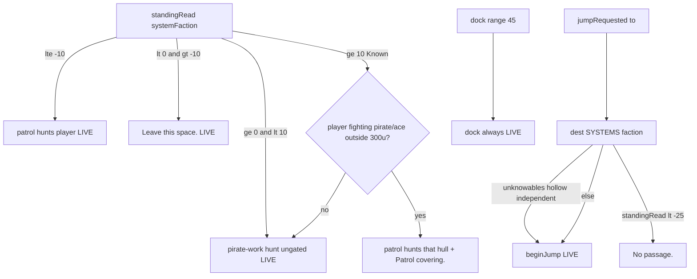

# RIMWARD REP-05 remaining consequences (allies + locked systems)

| Field | Value |
|---|---|
| **Title** | RIMWARD REP-05 remaining REP-02 consequences: allies in space and locked systems |
| **Author** | Wave 103 REP-05 integrator |
| **Date** | 2026-08-23 |
| **Status** | Wave 107 PR3 Digit 9 copy landed. Merge law still wins. |
| **Wave** | 104 — first impl of remaining REP-02 covering + inbound jump refuse. Wave 103 was markdown only. |
| **Owner request** | Remaining REP-02 after explain, kill attribution, restitution, and police leave: **allies assisting in space** and **locked systems / station access**, without a galaxy wanted number, without stealing HUD-01 empty 80 px hub, without stealing Digit 0/8/9, without `innerHTML`, without inventing UU / standing deltas, and without reopening restitution 1200 or police leave. |
| **Merge law** | [`out/w103/rep05/shared-contract.md`](../out/w103/rep05/shared-contract.md). If this brief and that file conflict, the contract wins. |
| **Honor** | HUD-01 empty hub. Digit 0 shipyard. Digit 8/9 stay. `state.js` READ-ONLY. Wave 82 kill −5 / restitution 1200. Wave 93/95 police leave **LIVE**. Wave 100 standing deputize. REP-04 local attribution. Risky run: dock is not standing-gated. **Do not edit** those docs. Code wins over stale “police not live” comments in [`docs/RepStandingDesign.md`](RepStandingDesign.md). |

**Verifier record:**

| Note | Path |
|---|---|
| Inventory (code wins) | [`out/w103/rep05/current-rep05-inventory.md`](../out/w103/rep05/current-rep05-inventory.md) |
| Merge law | [`out/w103/rep05/shared-contract.md`](../out/w103/rep05/shared-contract.md) |
| Security review | [`out/w103/rep05/security-review.md`](../out/w103/rep05/security-review.md) |
| Design-doc review | [`out/w103/rep05/code-review.md`](../out/w103/rep05/code-review.md) |
| UI audit | [`out/w103/rep05/ui-audit.md`](../out/w103/rep05/ui-audit.md) |

Siblings HUD-03, MSN-03, TGT-03, BIO, NAV, SHP, HUD-02, NPC, POD, EXP, OwnerDecisions*, wishlist, and `PROGRESS.md` are **other workers**. **Do not edit** those paths. Those sibling files need not exist for this brief to stand. Do **not** write `docs/OwnerDecisionsWave103.md`.

---

## Overview

Faction standing already writes locally, explains on Digit 9, hunts at ≤ −10, orders `Leave this space.` in the hostile band, sells hulls only at ≥ 0 with ace/frigate min-rep, opens the Freehold locker at fear 40 or Freehold `< −25`, and posts restitution 1200. Wishlist REP-02 still names **allies and assistance** and **restricted-system or station access**. Those two sim pieces are absent. Patrols already hunt pirate work as **ungated law**. Dock already accepts a risky run. Jump already ignores standing.

This brief is the integrator document. Wave 103 landed the markdown only. Wave 104 ships PR1 covering and PR2 inbound jump refuse. PR3 Digit 9 copy is not this wave. Bindings for covering and jump refuse land in `src/game/police-cover.js`, `src/systems/npc.js`, and `src/game/jump.js`. Merge law in [`out/w103/rep05/shared-contract.md`](../out/w103/rep05/shared-contract.md) still wins.

HUD-01 empty aim glass stays empty. No ally pip. No lock box. `state.js` stays READ-ONLY. No new persist key. Digit 0 stays shipyard. Digit 8/9 stay. Do not invent UU. Do not impersonate `RANK_LADDER`. Do not reopen restitution 1200. Do not redesign police leave.

Wave 103 deputize (recorded here and in the contract; owner may override after playtest): covering is local-system **patrol** vs already-hostile pirate/ace when standing ≥ **Known 10**; inbound jump refuses dest standing **< −25** (Marked exclusive); dock stays open; Unknowables/hollow/independent fail-closed; `commLine` only; no `WORLD_FIELDS`.

---

## Background & Motivation

### Current state (inventory)

Source of truth: [`out/w103/rep05/current-rep05-inventory.md`](../out/w103/rep05/current-rep05-inventory.md). Code wins over stale `RepStandingDesign.md` police-defer rows.

| Surface | Today | Cite |
|---|---|---|
| Ladder | Sworn 50 … Marked −1000 | `state.js` 714–721 |
| `standingRead` | miss / reserved / non-finite → 0 | `data-trade.js` 73–81 |
| Persist | `'reputation'` + `sanitizeReputation` | `save.js` 76–78, 919–938 |
| Digit 0 / 8 / 9 dock | shipyard / launch / epics | `station.js` 185, 6023–6028 |
| Digit 9 copy | hunt, yards, min-rep, locker, restitution — **not** leave/allies/locks | `station.js` 1160–1179 |
| Hunt | patrols ≤ −10 | `npc.js` 96, 1091–1093 |
| Police leave | **LIVE** `Leave this space.` band `< 0` and `> −10`, 300 u, once/visit | `police-leave.js`; `npc.js` 2378 |
| Hail leave card | **none** (leave is `commLine`) | `hail.js` 48 |
| Dock | range 45; **no** standing check | `station.js` 5951–5978, 6181 |
| Jump | `beginJump` if `SYSTEMS[to]`; **no** standing | `jump.js` 70–76; `gate.js` 648–649 |
| Yard | `rep < 0` or below min-rep → `No sale.` | `shipyard.js` 64–71, 219 |
| Locker | fear ≥ 40 or Freehold `< −25` | `station.js` 187, 2055–2058 |
| Archive | standing `< 0` → `No sale.` | `station.js` 1192–1194, 1414–1416 |
| Unique chains | Known `tier >= 1` | `jobs-chains.js` 84–86 |
| Restitution | 1200 UU, set key to 0 | `restitution.js` 5, 45–66 |
| Kill | victim −5 | `kill-standing.js` 6 |
| Pirate-work hunt | ungated; patrol hunts pirate/ace working a civilian or the player, outside 300 u | `npc.js` 1274–1280 |
| Ally covering | **absent** | no Known+ branch |
| Jump lock | **absent** | no dest standing read |
| Wanted field | **absent** | `WORLD_FIELDS` 76–101 |
| Empty hub | 80 px + RANGE | `hud.css` 184–191; `hud.js` 709–712 |
| `innerHTML` | none in station/hud/jump/police-leave | modelsbrowser only |

The player who is Known already buys aces and opens unique chains. The player who is Marked already opens the Freehold locker and still **docks**. Patrols already shoot pirates as law, not as a reputation perk. Wishlist “allies” and “locked systems” as **standing-gated sim** are absent. They are not missing HUD discs.

### Pain points

- A naive later PR that “adds police leave” would double Wave 95.
- A naive later PR that “blocks dock at Marked” would reverse risky run without naming it.
- A naive later PR that “locks the galaxy” with `world.wanted` would smash REP-04.
- Putting an ally pip on the 80 px hub would reopen HUD-01.
- Stealing Digit 0/8/9 would smash shipyard, launch, Standing, or arms papers.
- Inventing escort UU or a wing SKU would impersonate the owner.
- Treating `findPirateWork` as the ally perk would lie: it already runs at standing 0.
- Using `npc.standingOf` for covering would skip `hasOwn` and can read proto keys.
- Jump-locking Unknowables/hollow/independent would invent a wanted net on hush/drift flags.
- Reusing `Leave this space.` for covering or jump would lie.
- Digit 9 listing unshipped allies today would lie; listing them after PR1 without a copy PR is a later serial, not this wave.
- `innerHTML` of a faction name on a lock toast would XSS.

### Why now (design) / why not now (code)

The owner asked for the remaining REP-02 integrator brief so later serials can land covering and inbound refuse without a wanted meter. Inventory shows police leave **live**, dock **open**, jump **open**, pirate-work hunt **ungated**, covering **absent**, inbound lock **absent**. Merge law can exist without touching `src/`. Implementation waits so hub theft, Digit theft, persist collision, dock reverse, and invented UU are frozen before the first patrol retarget. Wave 103 does not ship `src/`.

---

## Goals & Non-Goals

### Goals

1. Document live standing, police leave, dock, jump, yard, locker, archive, unique-chain Known gate, and patrol pirate-work hunt from **live code**.
2. Freeze **who / when / what** for allies, and **what is locked** for systems, with Wave 100 deputize defaults copied from live `RANK_LADDER` / locker / police-leave allowlist.
3. Freeze no new persist key. Reuse `'reputation'`. No galaxy wanted number.
4. Freeze fail-closed Unknowables / hollow / independent; missing numbers → contract defaults.
5. Freeze `innerHTML` = 0, `textContent` / `h()` / `el()` only, `commLine` only, empty hub, Digit 0/8/9.
6. Freeze a serial PR plan. This wave writes the brief. A later wave ships serially.

### Non-goals (locked — do not reopen)

- No `src/` or live bindings in Wave 103.
- No police-leave redesign. No restitution 1200 reopen. No kill −5 reopen. No `RANK_LADDER` rungs.
- No dock refuse. No outbound jump trap.
- No escort formation AI. No player wing spawn. No ally SKU.
- No aim-glass ally pip / lock box / RANGE rewrite.
- No HUD-02 reopen. HUD never writes `hullKind`.
- No new Digit. First remaining serial must not steal Digit 0/8/9. Digit 9 copy is PR3, after sim.
- No `crimeScore` / `wanted` / extra `WORLD_FIELDS`.
- No invented UU or standing deltas. `state.js` READ-ONLY; later default no write.
- No hail card. No `'allyAssist'` event.
- Do not retune BIO −10, POD 160/240, rescue +4/+1, locker −25, fear 40, ace/frigate min-rep.
- Do not silently retarget patrol job `freehold` +5.
- Do not edit the wishlist, `PROGRESS.md`, `docs/RepStandingDesign.md`, OwnerDecisions*, or sibling packs.
- Do not write `docs/OwnerDecisionsWave103.md`.
- Do not fix known boot FAILs.

---

## Proposed Design

### 1. Merge resolutions (contract wins)

| Question | Integrator freeze | Why |
|---|---|---|
| New persist key? | **No** | Inventory: `'reputation'` is enough |
| Galaxy wanted / `crimeScore`? | **Forbidden** | REP-04 |
| Police leave? | **LIVE; do not redesign** | `police-leave.js` |
| Restitution UU? | **1200 frozen** | Wave 82 |
| Kill delta? | **−5 frozen** | Wave 82 |
| `RANK_LADDER` extra rung? | **No** | `state.js` READ-ONLY |
| Who covers? | Local-system `patrol` only | Copy police-leave who |
| Covering standing? | **≥ 10** Known | Copy ace min-rep / chain gate |
| Covering action? | **Fire** hunt vs pirate/ace player fight | Not escort, not hail |
| vsPlayer covering? | **Never** | Hunt already owns ≤ −10 |
| vsAlready-hostile? | pirate/ace only | Civilians never hunt |
| Pirate-work hunt? | **Keep ungated** | Law, not a perk |
| Law zone 300? | **Keep** | Do not reverse |
| Covering copy? | `Patrol covering.` once/visit `commLine` | Do not reuse leave line |
| What jump-locks? | **Inbound** dest standing **< −25** | Copy locker Marked exclusive |
| Outbound jump? | **Always** | Do not trap |
| Dock lock? | **No** | Risky run named |
| Yard / locker / archive? | **Already live** | Do not double-gate |
| Unknowables/hollow/independent lock? | **No** | Fail-closed |
| Beautiful covering? | **No** | Copy leave `BLOCKED_FACTIONS` |
| Jump copy? | `No passage.` | Do not reuse leave / `No sale.` |
| Chart lock box? | **No** | HUD-01 / NAV |
| Hub pip? | **No** | HUD-01 empty 80 px |
| Digit 9 copy this wave? | **No.** Named PR3 | First serial must not steal Digit 9 |
| `innerHTML` / new event? | **No** / default no | Live `h()` / `commLine` |
| `state.js` write later? | **Default no** | Copy live numbers |
| WAVE4 / WAVE26 / WAVE35? | Do not “fix” | Orchestrator law |

### 2. Current standing (do not break)

See inventory §§4–10. The load-bearing loop is:

1. Restore heals the bag (`sanitizeReputation`).
2. Digit 9 explains live writers and live consequences (not covering, not jump lock, **and not police leave copy yet**).
3. Patrols hunt the player at ≤ −10. Police leave fires in `< 0` and `> −10`.
4. Patrols hunt pirate work without a standing gate.
5. Dock does not read standing. Jump does not read standing.
6. Yards / locker / archive / unique chains already gate.

**This remaining serial is additive and fail-closed.** It must not change steps 1, 3, 4, 5’s dock, or live UU.

### 3. Persist: reuse sanitize

Later PRs: **no new field**. Covering and jump refuse recompute from the bag + `SYSTEMS` faction.

Do **not** add `world.allies`. Do **not** persist `Patrol covering.` latches.

### 4. Allies vertical slice (after later PR1)

**Beats:**

1. Player standing with the **system flag** is ≥ 10 (`standingRead`).
2. A local-system-faction patrol is live, not Beautiful/Unknowable/independent/hollow-blocked.
3. The player is fighting a pirate or ace (`lastAttackerOf === 'player'` or current lock is that hull).
4. Outside the 300 u law zone.
5. That patrol takes `hunt` on **that hull**, not the player.
6. Once per visit, `'commLine'` `Patrol covering.` HUD toasts via `textContent`.

**Not beats:**

- Escort formation, hail card, aim-glass pip.
- Covering the player as a target.
- Hunting a trader the player scratched.
- Inside the law zone.
- Standing 0–9 (pirate-work hunt may still run as live law).

### 5. Locked systems vertical slice (after later PR2)

**Beats:**

1. Player in a gate zone requests jump to `to`.
2. Dest `SYSTEMS[to].faction` is a lockable flag (not unknowables/hollow/independent).
3. `standingRead(destFaction) < −25`.
4. `beginJump` no-ops. `'commLine'` `No passage.` once per dest per visit.
5. Player can still dock here. Player can still jump **out** even if current standing is Marked.

**Not beats:**

- Dock refuse.
- Chart lock box / hub disc.
- NAV `blocked` reuse.
- Yard `No sale.` reuse for the toast.

### 6. Neighbours

| Module | REP-05 does | REP-05 does not |
|---|---|---|
| Police leave | Cite LIVE | Change who/when/copy |
| Restitution | Cite 1200 | Retune |
| Kill | Cite −5 local | System-owner stamp |
| MSN unique chains | Cite Known gate | Steal `chainStandingGate` |
| NAV / chart | Cite hover rank | Steal `blocked` / NAV-02 cue |
| HUD-01/02/03 | Toast `commLine` | Hub pip; `hullKind` write; KeyO |
| SHP Digit 0 | Cite hostile no-sale | Touch catalog |
| BIO graft | Leave −10 cap | Retune |
| TGT | Leave KeyT/KeyV | Lock box |

### 7. Serial PR plan

Matches contract §8. **Named only. Do not implement in Wave 103.**

| PR | Lands | Does not land |
|---|---|---|
| **PR1 allies covering** | helper + `tickPatrolJob` additive hunt; Known 10; `Patrol covering.` | Digit 0/8/9; escort; persist |
| **PR2 inbound jump** | `beginJump` refuse `< −25`; `No passage.` | dock refuse; chart widget |
| **PR3 Digit 9 copy** | `standingLiveNotes` police-leave **LIVE** line + covering + jump refuse **after** those exist | new Digit; lying copy |
| **PR4 boot pins** | no wanted; vsPlayer skip; independent dest not locked; Digit 0 shipyard | wishlist rewrite |

First remaining serial is **PR1**. It must not steal Digit 0/8/9.

### 8. Picture

Reuse live `commLine` toast. Do not put a pip on `.rw-reticle`. Do not bind Digit 0.

---

## Player outcome (later serial; freeze here)

**Allies.** Fly a system whose flag reads you **Known** (10) or better. When a local patrol is already in space and you fight a pirate or ace, that patrol **fires on that hull**. You hear **Patrol covering.** once that visit. Traders do not help. Beautiful and Unknowable space do not grow a covering wing. Patrols still hunt pirates as law even when you are a Stranger — that is not the perk. The aim glass stays empty. No new Digit.

**Locked systems.** If a destination flag reads you **Marked** (standing **below −25**), the gate **does not charge**. You hear **No passage.** You can still **leave** a Marked system. You can still **dock** for a risky run, pay restitution 1200, and use the yard’s `No sale.` as today. Unknowables, Hollow, and Independent destinations do not use this lock. Chart grows no lock box.

**Police leave** is already live: hostile band, 300 u, **Leave this space.** This brief does not change it.

---

## Security

See [`out/w103/rep05/security-review.md`](../out/w103/rep05/security-review.md).

- XSS: authored lines + `FACTIONS[].name` after `hasOwn`; `textContent` only.
- Proto: `standingRead` + `Object.hasOwn(SYSTEMS)` / `FACTIONS`; never `standingOf` for new gates.
- Persist: no new key; latches are live memory.
- No secrets. No innerHTML. No Digit theft. No wanted field.

---

## Acceptance direction (implementation wave)

1. No `wanted` / `crimeScore` / `world.locks` on `WORLD_FIELDS` or live world after restore.
2. Covering does not run at standing 0. Pirate-work hunt still can.
3. Covering never targets the player.
4. Covering skips beautiful / unknowables / independent / hollow system flags.
5. `beginJump` to a Freehold dest at standing −26 refuses. At −25 it does **not**. Independent dest at −1000 still jumps.
6. Dock at standing −1000 still docks in range.
7. Outbound jump from a Marked current system still starts.
8. Digit 0 is still shipyard. Digit 8/9 still launch/epics and papers. Hub still 80 px without an ally child.
9. Police leave still emits `Leave this space.` in its live band. Restitution still 1200. Kill still −5.
10. No `innerHTML` on those paths. `RANK_LADDER` still six rungs.

---

## Alternatives considered

| Alternative | Why not |
|---|---|
| Escort formation | New AI mode; HUD pip temptation; not playable-small |
| Sworn 50 covering | Unplayable wait; Known already gates aces/chains |
| Dock refuse at Marked | Silently reverses risky run |
| Inbound **and** outbound lock | Traps the player |
| Jump lock at `< 0` | Collides with leave band / Stranger; too harsh vs locker |
| Reuse `Leave this space.` | Lies |
| Persist `world.wanted` | REP-04 smash |
| Ally pip on hub | HUD-01 smash |
| Digit for “Access” | Digit 0/8/9 freeze |
| Treat pirate-work hunt as the ally perk | Ungated; Stranger already gets it |
| Chart `is-unreachable` for Marked | Steals NAV plot meaning |

---

## Regression risks

| Risk | Mitigation |
|---|---|
| Wanted field sneaks in | Contract §0.7; PR4 pin |
| Dock reverse | Contract §0.12; PR4 pin dock at −1000 |
| Police leave smash | Contract §0.9; do not share latches |
| vsPlayer covering | Contract §1.3; PR4 |
| Independent dest locked | Contract §2.2; PR4 |
| Digit steal | Contract §0.3; first serial PR1 has no station Digit bind |
| Hub pip | Contract §0.2 |
| `innerHTML` names | Contract §0.4 |
| Invented UU / delta | Contract §0.6, §9 |
| `standingOf` proto read | Contract §1.2 use `standingRead` |
| Double `Leave this space.` | New strings only |
| Digit 9 lies before sim | PR3 after PR1/PR2 |

---

## Ownership

| Object | Writer | Reader |
|---|---|---|
| `ctx.world.reputation` | existing | covering, jump refuse, Digit 9 |
| Police leave | live `police-leave.js` | HUD toast |
| Covering latch | later helper | later helper |
| Jump refuse | later `jump.js` | HUD toast |
| `state.js` | serial data owner only | **feature PRs read-only** |

---

## Open owner questions

**Deputized this wave** (contract §1–§2). Owner may override after playtest. Do not park.

1. Covering who / when / what: patrol / Known 10 / fire vs pirate-ace player fight.
2. Jump lock: inbound `< −25` only; dock open.
3. Copy: `Patrol covering.` / `No passage.`
4. Fail-closed Unknowables / hollow / independent.

Do not invent prices or new standing integers in a later impl without a successor owner line.
