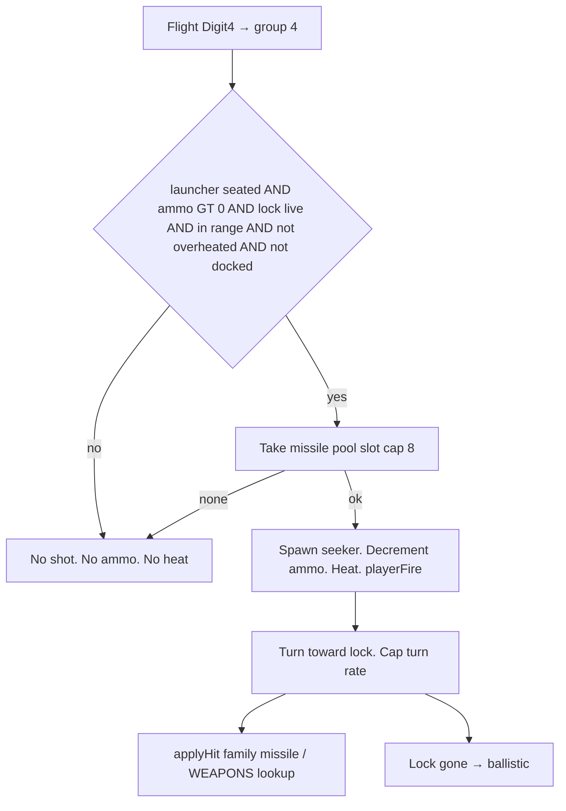
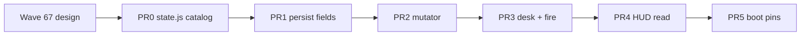

# RIMWARD SHP-03 weapons, missiles, and mounts

| Field | Value |
|---|---|
| **Title** | RIMWARD SHP-03 weapons, missiles, and mounts |
| **Author** | Wave 67 SHP-03 weapons integrator |
| **Date** | 2026-08-19 |
| **Status** | Implemented. Wave 67 was markdown only. Wave 68 shipped PR0–PR5. |
| **Wave** | 67 — design. 68 — first impl. |
| **Owner request** | Weapons / mounts brief covering missiles, turrets (TGT-04), and mass-power (deferred in Waves 63–66). Do not ship weapons, launchers, HUD gauges, or `src/` here. |
| **Merge law** | [`out/w67/shp03/shared-contract.md`](../out/w67/shp03/shared-contract.md). If a sibling note and that file conflict, the contract wins. |

**Historical note:** [`docs/ShpDesign.md`](ShpDesign.md) is the Wave 63/64 **first-slice** record. Its non-goals still say no missiles, no turrets, no mass-power. That freeze applied to Wave 64. **This document supersedes that “no missiles” freeze for a later implementation wave only.** Do not edit `docs/ShpDesign.md`. Do not treat Wave 64 as incomplete.

**Verifier record (this wave):**

| Note | Path |
|---|---|
| Inventory (code wins) | [`out/w67/shp03/current-weapons-inventory.md`](../out/w67/shp03/current-weapons-inventory.md) |
| Merge law | [`out/w67/shp03/shared-contract.md`](../out/w67/shp03/shared-contract.md) |
| Security review | [`out/w67/shp03/security-review.md`](../out/w67/shp03/security-review.md) |
| Design-doc review | [`out/w67/shp03/code-review.md`](../out/w67/shp03/code-review.md) |

---

## Overview

The player already owns a hangar, a Digit 0 Shipyard, and per-hull scanner / mining / Q-ship fields. Combat still has three groups: energy cannon, disruptor, mining beam. There are no missiles, no player turrets, and no mass or power ledger.

Wishlist SHP-03 still asks for missiles with launcher hardpoints, TGT-04 turrets, conventional parts on living hulls, and a bounded fit. Waves 63–66 deferred that work on purpose.

This brief is the integrator document for a **later** implementation wave. It freezes the live inventory, the missile family (lock, ammo, fire, counterplay), the turret family with class gates, a minimal mass law (seat counts) with power **out**, flat save keys, Outfitting digits 8/9 plus Confirm papers, HUD read-only WPN/RANGE/lead, and a serial PR plan. Wave 67 lands this markdown only. Weapons do not ship here.

HUD-02 is closed. POD-02 is closed. Digit 0 stays Shipyard. Remount-on-buy stays rejected.

---

## Background & Motivation

### Current state (inventory)

Source of truth: [`out/w67/shp03/current-weapons-inventory.md`](../out/w67/shp03/current-weapons-inventory.md). Code wins over stale comments.

| Surface | Today | Cite |
|---|---|---|
| `WEAPONS` | `cannon`, `disruptor`, `mining` only | `state.js` 85–97 |
| Groups | 1 / 2 / 3. Digit1–3. No Digit4. | `combat.js` 169; `controls.js` 150–158; `ctx.js` 81 |
| Fire | Hold LMB. ROF + heat. Reticle aim. Optional frontal lead converge. | `combat.js` 969–1002, 1456–1466 |
| Pool | 64 bolts. Drop when exhausted. | `combat.js` 159, 787 |
| NPC | `npcFire` cannon only. ±2° error. | `npc.js` 1509; `combat.js` 1004–1024 |
| Mining | Installed head via world mirror | `combat.js` 1028–1031; `hangar.js` 355–357 |
| Hangar | Flat row. Unknown keys drop. No `loadout`. | `hangar.js` 123–148 |
| Gear | `scanner` 0\|1\|2, `miningLaser` 0\|1\|2\|3, `concealedMounts` bool | `hangar.js` 137–139, 346–368 |
| Dock | Ten keys. Digit 0 = `shipyard`. Outfitting 1–7 spent. | `station.js` 122, 2406–2413, 2448–2454 |
| Hull confirm | Shipyard Confirm papers. Outfitter 1–7 one-shot. | `shipyard-desk.js` 198–201 |
| HUD | WPN / RANGE / lead for groups 1–3. HUD-02 skins shipped. | `hud.js` 185, 994–1071, 1427–1435 |
| Heat | One pool `HEAT.max` 100 | `state.js` 98 |
| Mass / power | **No fields** on `SHIP_CLASSES` | `state.js` 34–41 |
| Events | Frozen list. `playerFire { weapon }`. No missile types. | `ctx.js` 191–219 |

`createShipState` (`state.js` 118–139) does not attach weapons. `state.js` 7–8 is READ-ONLY for feature workers.

### Pain points

- Wishlist SHP-03: missiles as a class with launcher hardpoints. Code has none.
- Wishlist TGT-04: turrets / automatic guns with hull and mount gates. NPC auto-cannon is not a player turret.
- TGT-03 remaining names missile warnings. HUD-01 / HUD-02 already reject a lock box and an incoming gauge on the aim glass.
- Wave 63 sketched a nested `loadout`. Wave 64 flattened. A weapons wave that reintroduces `loadout` would be dropped on sanitize.
- Deepcore is 11000 UU and still one-shots. Launchers must not copy that for new SKUs; hull papers already exist.
- Mass-power was deferred with no numbers. An impl wave cannot invent a triad and a seeker in one merge.

### Why now (design) / why not now (code)

The owner asked for the weapons brief after hangar, HUD-02, and POD-02 closed. Inventory and merge law exist. Implementation waits for a later serial wave so persist, combat, and HUD land against a frozen contract instead of painting a lock box.

---

## Goals & Non-Goals

### Goals

1. Inventory of weapons and mounts **today**, cited from live code.
2. A missile family (lock, ammo, fire, counterplay) that fits the current projectile combat model.
3. A turret / automatic-gun family (TGT-04) with `classKey` gates.
4. Mass-power: seat-count mass law **in**; power ledger **out** of the first impl wave, with reasons.
5. Save / hangar field map: three new **flat** keys, sanitize, tamper.
6. Serial PR plan: persist → mutator → desk/fire → HUD readouts → boot pins, plus a dedicated `state.js` catalog PR.
7. Non-goals locked so HUD-02, POD-02, and Digit 0 stay closed.
8. Verification targets for that later wave.
9. Regression risks named (auto-aim, HUD clutter, living identity, Digit collisions, CPU).

### Non-goals (locked — do not reopen)

- No `src/` in Wave 67. No missiles shipped here.
- No HUD-03 free skin checkbox. No HUD write of `hullKind`.
- No incoming-missile gauge. No lock box. No aspect ring. No 13 s timer. No new HUD tree.
- No eleventh dock service. No missile shop inside Shipyard. Digit 0 stays Shipyard. Digits 1–9 stay.
- No nested `loadout`. No remount-on-buy. No POD-02 reopen.
- No NPC missiles in the first impl wave. No NPC player-style turrets (NPC already auto-fires cannon).
- No power ledger. No heat-per-fit persist. No mass kg field.
- No `general` array. Cannon + disruptor stay. No unequip of the starter pair.
- No chaff / countermeasures. No BIO-02 growth-center gate.
- No multi-rack arrays in persist (one `launcher` string, one `turret` string).
- No new `settings.js` key. No `sessionStorage` weapon key that becomes save state.
- Do not edit the wishlist, `PROGRESS.md`, or `docs/ShpDesign.md`.

---

## Proposed Design

### 1. Merge resolutions (contract wins)

| Question | Integrator freeze | Why |
|---|---|---|
| Nested loadout? | **No.** Flat `launcher` / `missileAmmo` / `turret`. | Wave 64 sanitize drops unknown keys. Frozen 1. |
| `state.js` in feature PRs? | **No.** Dedicated serial PR for `WEAPONS` + `MOUNT_TABLE`. | Header READ-ONLY. Frozen 2. |
| Incoming gauge? | **Off.** | HUD-01 aim glass; HUD-02 non-goal. Frozen 3. |
| Which desk? | **Outfitting** Digit 8 launcher, Digit 9 turret. | Digit 0 is Shipyard. Outfitting can grow. Frozen 4. |
| Confirm? | Papers for every new launcher / turret SKU. Default confirm on ammo restock. | Same law as hull buy. Frozen 5. |
| Mass-power? | Seat counts = mass. Power out. Heat-per-fit out. `HEAT` + `heatPerShot` stay. | No class power field today. Frozen 9. |
| Living + guns? | Allowed. Do not flip `hullKind`. | Wishlist + HUD-02. Frozen 8. |
| NPC missiles? | **No** in first impl. | Makes the incoming-gauge off decision honest. |
| New ctx event? | Reuse `playerFire`. Named `missileFire` is **not frozen**. | `ctx.js` freeze until impl edits it. |

---

### 2. Inventory today (summary)

See the inventory note for tables. Facts the impl wave must not contradict:

- Three groups. Mining `speed` 0 hides lead (`hud.js` 1000–1002).
- Unknowables ignore non-beam (`state.js` 147–149). Missiles are not beams. Default: they miss Unknowables.
- World mirrors are how combat and HUD read mining / scanner / Q-ship **right now**. New launcher fields follow that pattern in the first impl PR train.
- `addHeat` runs even if the bolt pool is exhausted (`combat.js` 997–1001). Missile ammo must **not** copy that bug: spend ammo only when a missile actually spawns.

---

### 3. Missile family

Grounded in live combat: dodgeable projectiles, ROF, heat, reticle aim, existing target lock, pooled meshes, no hitscan (`combat.js` 19–21).



#### 3.1 Catalog (dedicated `state.js` PR)

First impl ships **one** player launcher SKU. Suggested id `dart` (name in catalog copy, `textContent` only).

Suggested `WEAPONS.missile` (numbers are a starting point for the catalog PR; combat must read this row, not the save):

| Field | Value | Why vs live guns |
|---|---|---|
| `name` | Dart rack | WPN text |
| `damage` | 22 | Between cannon 8 and a punch that skips the duel |
| `rof` | 0.45 | Slow. Not a bolt spam |
| `speed` | 260 | Cannon is 900. Dodge is possible |
| `range` | 720 | Longer than cannon 500. RANGE still works |
| `heatPerShot` | 14 | Shared `HEAT` pool. Two shots bite |
| `family` | `missile` | `applyHit` lookup |
| seeker turn | authored, **not persisted** | Cap so a cutter can still cut |

`LAUNCHER_IDS = { dart: { wkey: 'missile', ammoMax: 8, cost: 6500, restockCost: 400, restockUnit: 2, classMin: missile seats > 0 } }`.

Do not persist those numbers.

#### 3.2 Lock

There is already a target lock (`ctx.targets.current`). HUD already shows bracket, DIST, RANGE, lead.

Missile lock **is that lock**. No new instrument.

Refuse fire when:

- no live ship lock, or
- `targetDistNow` > launcher range, or
- lock is not a ship (asteroid / gate).

Do not add an aspect diamond. Do not add a hold-to-lock timer.

#### 3.3 Fire

- Group 4. `controls.js` Digit4 sets `input.weaponGroup = 4` in **flight**.
  Docked **level 1** (`station.js` 122, 2334, 2406–2413): Digit N selects `DOCK_KEY_SERVICES[N-1]`. Digit **4** is **Feed** (`feed`, index 3). Digit **6** is Outfitting. Digit **8** is Launch. Digit **0** is Shipyard. Digit4 is not Outfitting on the dock root.
  Docked **outfitting level 2**: Digit4 stays Wolfeye Mk II (`station.js` 2452). Digit 8/9 become launcher/turret papers (this brief). Same dock-vs-flight split as Digit1–3.
- `GROUP_WEAPON[4]` maps to the seated launcher’s `wkey` (first impl: `'missile'`).
- `fireHeld` + ROF + heat lock, same as guns (`combat.js` 1456–1465).
- Aim spawn: nose + reticle ray, then seeker takes over. Do **not** snap the shot onto the lock at t=0 (that would be hitscan-adjacent auto-aim). Spawn along the reticle; seeker steers after.
- Ammo: decrement on successful spawn only.
- Park `missileAmmo` through `packLiveHull`.

#### 3.4 Counterplay

| Threat | Answer |
|---|---|
| Player dart vs NPC | NPC already dodges via flight, not via chaff. Seeker turn is capped. Speed 260 vs cutter cruise 105. |
| Incoming darts | **No NPC missiles** in first impl. Incoming gauge stays off without lying. |
| Unknowables | Non-beam miss. Mining beam remains the odd tool that couples. |
| Heat / ammo | Empty rack is a dry WPN line. Overheat locks group 4 with the guns. |

Chaff is later. TGT-03 missile warnings are later.

#### 3.5 HUD read (PR4)

When group 4 is selected:

- WPN: `4 · Dart rack · 6` (ammo integer). `textContent`.
- RANGE: launcher range.
- Lead: TOF from `speed` 260, same formula as cannon (`hud.js` 994–1008). Guided flight makes the pip **advisory**, not a promise. Still not auto-aim.

When group 4 is selected but no launcher: `4 · —`. Do not hide Screen / Shell / RANGE word rules for groups 1–3.

---

### 4. Turret / automatic-gun family (TGT-04)

Wishlist: equipment upgrade with hull, mount, power, and balance restrictions. Power ledger is out (§5), so **mount + class + heat + ROF** are the restrictions.

#### 4.1 Gates

`MOUNT_TABLE.turret`: light / cutter / freighter **0**. Heavy **2** (first impl seats **one**). Ace **1**. Frigate **4** (one string until a later array).

Outfitter Digit 9 refuses when the mounted `classKey` has turret 0. Sanitize drops a tampered `turret` on a light.

#### 4.2 Behavior

Turrets are **not** a weapon group.

Each combat tick (player only, first impl):

1. If `ctx.world.turret === ''` (mirror) → skip.
2. If docked / destroyed / overheated → skip.
3. Pick nearest hostile live ship in the **forward** cone (`CONVERGE_DOT` 0.72) and turret range.
4. If none → skip. Do not spin to aft threats in the first impl (aft coverage would make combat trivial and fight FORE/AFT language).
5. Fire a pooled **gun** bolt at authored turret ROF into the 64-bolt pool **or** a tiny turret sub-cap (default: share bolt pool but **max 2** live turret bolts). Prefer a sub-cap so player cannon still works.
6. `addHeat(heatPerShot)`.
7. Do not emit a new HUD pip. Do not write `input`.

Suggested first SKU id `auto`: damage 4, rof 3, speed 800, range 380, heatPerShot 2, family `energy` (reuse cannon colors). Dedicated `WEAPONS.turret` row in the `state.js` PR so `applyHit` and muzzle tints stay explicit.

#### 4.3 Auto-aim regression

TGT-04 risk: “aim assist becoming auto-aim” (`PLAYER-EXPERIENCE-WISHLIST.md` 251–254).

Freeze:

- Player groups 1–2 **keep** the shipped converge (`combat.js` 976–995). Do not widen `CONVERGE_DOT`. Do not snap to turret target.
- Turret lead is independent and **invisible**.
- Turret DPS stays below a player who can already land cannon hits (TGT-01 shipped). A turret is a pressure hose, not a win button.
- MATCH and throttle stay `ship.js` / `controls.js`.

---

### 5. Mass / power / heat-per-fit

**In (minimal mass law):** `MOUNT_TABLE` counts + single-string seats. A light has zero missile seats. That is the mass check. Implement the table in the dedicated `state.js` PR. Do not persist counts.

**Out (power):** no kW field, no Plant-bar coupling, no fit-fail because “generator short”. `SHIP_CLASSES` has no power key (`state.js` 34–41). HUD-02 locked Plant / Flight / Heat as aux. A ledger here would reopen HUD chrome and `state.js` in the same train as seekers.

**Out (heat-per-fit):** no per-module heat capacity on the hangar row. `HEAT` (`state.js` 98) + `heatPerShot` remain. Overheat already gates `fireHeld` (`combat.js` 1458). Turrets obey the same flag.

**In (missile ammo only):** `missileAmmo` 0..`ammoMax`. Guns and turrets have no magazine.

This is explicit, not a deferral without a reason. A later balance wave may add mass/power **after** missiles exist to tune. It must update this contract first.

---

### 6. Save / hangar field map

```js
// hangar hull row — still flat after the weapons wave
{
  id, hullKind, faction, classKey, name,
  scanner, miningLaser, concealedMounts,
  cargoCapacity, cargo,
  hull, hullMax, screen, screenMax, shell, shellMax, engine, engineMax, heat,
  launcher: '',       // allowlisted id or ''
  missileAmmo: 0,     // 0..catalogMax(launcher)
  turret: '',         // allowlisted id or ''
}
```

Sanitize (`hangar.js` `sanitizeHangarRecord` pattern):

1. Build a fresh literal. Own-property reads only.
2. Drop unknown keys, including `loadout`, `damage`, `mass`, `power`, `__proto__`.
3. `launcher` / `turret`: `Object.hasOwn(CATALOG, id)` else `''`. Cap id length at `ID_MAX` (64) before the catalog check.
4. `missileAmmo`: **same `healMissileAmmo` as the contract §1.2 / §1.3.** If `launcher === ''` → `0`. Else if `Number.isInteger(value)` and `value >= 0` → `Math.min(value, catalogMax(launcher))`. Else `0`. Do not trunc. `'2'` / `2.9` → `0` (scanner `'2'` → 0, `hangar.js` 35–37; `save.js` 306–309). `99` with dart → `ammoMax`.
5. If `MOUNT_TABLE[classKey].missile === 0` → launcher `''`, ammo 0. Same for turret.
6. Unknowables still force `hullKind: 'living'`.
7. World mirrors after load / park / `writeMountedGear`.
8. `WORLD_FIELDS` gains `launcher`, `missileAmmo`, `turret`. After hangar sanitize, copy the mounted row onto those world keys.

Restore order (must match the contract):

1. Copy `WORLD_FIELDS` as today (`save.js` 387–389).
2. `sanitizeHangar(ctx)`.
3. `healPlayerHullKind` + `syncMountedToPlayer` as today.
4. Overwrite `ctx.world.launcher` / `missileAmmo` / `turret` from the mounted row.
5. Missing hangar / starter rebuild → `''` / `0` / `''` on the three mirrors.

A legacy blob with `world.launcher: 'dart'` and no hangar must not keep the dart. The world blob must not win over the row.

Combat decrements through `spendMissileAmmo` (hangar helper): mounted row **and** world mirror in one call. Do not spend ammo on a dropped pool spawn. Do not add heat on a dry fire.

Tamper cases:

| Blob | Result |
|---|---|
| `launcher: 'dart'` on `light` | `''` |
| `launcher: 'god'` | `''` |
| `missileAmmo: 99` with dart | `ammoMax` (8) |
| `missileAmmo: '2'` | 0 (not integer; same class as scanner `'2'` → 0) |
| `{ loadout: { missile: 1 } }` | `loadout` dropped. Empty launcher |
| `turret: true` | `''` |
| save `cost: 0` | Outfitter ignores. Authored price |

`input.weaponGroup` stays session. A restore with group 4 and empty launcher: combat treats as cannon fallback (`?? 'cannon'` today). After group 4 exists, fallback should be **1** if 4 is empty, not cannon-via-unknown. Spec: `GROUP_WEAPON[4]` only when launcher seated; else treat as group 1 for fire, HUD shows `4 · —` if the player left the group on 4.

---

### 7. Living ships

Mount table is `classKey`. A living heavy may take dart + auto. HUD `hudFamily` stays `bio` (`hud.js` 65–74). Weapons never write `hullKind`.

Concealed mounts remain the Q-ship hail flag (`npc.js` 1296–1298). A seated turret or launcher does **not** auto-set `concealedMounts`. Fiction: Q-ship is still an outfitter buy.

---

### 8. Desk UX

Outfitting subtitle can stay `OUTFITTING — hull work & instruments`. Append two rows after the mining ladder (`station.js` 2098–2108):

- Digit 8: if class missile 0 → note “This hull has no launcher hardpoint.” Else if empty → papers for dart list price. Else note name + ammo and papers for restock.
- Digit 9: same pattern for turret.

Bind these digits only inside the existing `ui.service === 'outfitting'` level-2 branch (`station.js` 2448–2454). Digit 8 on the dock root is Launch. Digit 9 is Standing.

Pending papers live on `ui.outfitPending` (or equal). Esc cancels (`station.js` 2418 pattern). Confirm control label: **Confirm papers**.

All strings: `h()` `textContent`. Catalog `line` is authored, still `textContent` (a future authored line with markup must not switch to `innerHTML`).

---

### 9. Architecture (ctx ownership)

| Channel | Writer | Reader |
|---|---|---|
| `input.weaponGroup` | `controls.js` | combat, HUD |
| `world.launcher` / `missileAmmo` / `turret` | hangar mutator, combat (ammo only) | combat, HUD, outfitter |
| Hangar row | hangar.js | save, desk |
| `player.heat` | combat `addHeat` / `tickShipState` | HUD strain |
| `hullKind` | SHP / save heal | HUD family |
| Events | combat may `playerFire` | song / FX |

Combat may write **ammo** (decrement). Outfitter writes launcher id, restock ammo, turret id. HUD writes none of these.

`ctx.js` comment: document group 4 and the three world mirrors when PR1/PR3 land. Default: no new event type. If someone adds `missileFire`, that PR must edit the frozen comment in `ctx.js`. Until then the name is **not frozen**.

---

## API / Interface Changes

No public API change in Wave 67.

Later implementation wave:

| Surface | Change |
|---|---|
| `src/game/state.js` | **PR0 exclusive write.** `WEAPONS.missile` (+ optional `turret`). Frozen `MOUNT_TABLE`. Later feature PRs import only. |
| `src/game/weapon-fit.js` (new) | **Lands with PR0.** Ids, prices, ammoMax, `canSeat`. PR1+ import (read). PR3 must not add SKUs. |
| `src/game/save.js` | PR1: `WORLD_FIELDS` + heals + restore order (hangar row overwrites world mirrors). |
| `src/game/hangar.js` | PR1 sanitize/pack/load. PR2 `writeMountedGear` keys + class-gate helper. |
| `src/game/shipyard.js` | Stock rows include empty launcher / turret. |
| `src/systems/station.js` | PR3: outfitting 8/9 + papers, **level 2 only**. `textContent`. Digit 1–9 / 0 untouched on level 1. |
| `src/systems/combat.js` | PR3: group 4 fire, missile pool, turret loop. |
| `src/systems/controls.js` | PR3: Digit4 → group 4. |
| `src/systems/hud.js` | **PR4 read only.** WPN / RANGE / lead. No new nodes required if WPN string carries ammo. |
| `src/core/ctx.js` | Comment: group 4; world mirrors. Event list unchanged by default. |
| `src/systems/settings.js` | **No change.** |
| `scripts/boot-test.mjs` | PR5 pins. |
| `src/systems/npc.js` / `hail.js` | **No missile change** in first impl. Q-ship still `concealedMounts`. |

---

## Data Model Changes

Wave 67 adds **no** persist keys in the running game.

Later:

| Field | Owner | Persist | Rule |
|---|---|---|---|
| `hull.launcher` | SHP outfitter | Hangar row | Allowlisted id or `''` |
| `hull.missileAmmo` | Outfitter + combat decrement | Hangar row | `healMissileAmmo` (contract §1.2): integer clamp `0..catalogMax`, else 0. Empty launcher → 0 |
| `hull.turret` | SHP outfitter | Hangar row | Allowlisted id or `''` |
| `world.launcher` / `missileAmmo` / `turret` | Mirrors | `WORLD_FIELDS` | Heal like scanner |
| `input.weaponGroup` | controls | **No** | 1–4 session |
| `WEAPONS.missile` | state.js dedicated PR | **No** | Code |
| `MOUNT_TABLE` | state.js dedicated PR | **No** | Code |
| `sessionStorage` weapon debug | forbidden as save | Session only if ever added | Never copy onto hangar |

---

## Alternatives Considered

### Desk

**Alt D1 — New dock service `armory`.**  
Rejected. Would append an eleventh key or steal a digit. Digit 0 is Shipyard. Frozen 4: Outfitting grows.

**Alt D2 — Sell launchers on Shipyard Yard pane.**  
Rejected. Yard sells hulls. Mixing SKUs with Confirm papers hulls collides Digit 3+ hull index (`shipyard-desk.js` 198–201).

**Chosen:** Outfitting Digit 8/9.

### Incoming gauge

**Alt G1 — Hub lamp when a seeker exists.**  
Rejected. HUD-01 “do not obscure aim”. HUD-02 non-goal. First impl has no NPC missiles, so the lamp would mostly be a player-own-dart toy.

**Chosen:** off. TGT-03 warnings remain later.

### Persist shape

**Alt P1 — Nested `loadout.missile = { id, ammo }`.**  
Rejected. Wave 64 flatten. Sanitize would drop it unless the allowlist grows a nested object — worse tamper surface.

**Alt P2 — Integer ladder like mining.**  
Possible, but a string id matches a small catalog and fails closed on unknown families. Chosen: string id + ammo int.

### Mass-power

**Alt M1 — Full kg/kW/heat-per-fit in the same impl wave.**  
Rejected. No fields exist. Would force `state.js` class budgets, HUD aux redesign, and persist numbers alongside seekers. Frozen 9.

**Alt M2 — Pretend heat is mass.**  
Rejected. Heat already means overheat lockout.

**Chosen:** seat counts in; power out; heat-per-fit out.

### Auto-aim

**Alt A1 — Missile spawns already on the lock.**  
Rejected. Hitscan-adjacent. Spawn on reticle; seeker steers.

**Alt A2 — Turret tracks the player lock.**  
Rejected. Makes group 1–2 skill less relevant. Turret uses nearest forward hostile.

---

## Security & Privacy Considerations

See [`out/w67/shp03/security-review.md`](../out/w67/shp03/security-review.md).

| Risk | Severity | Mitigation |
|---|---|---|
| XSS via launcher / turret names | **High** | `textContent` only |
| Tampered `launcher: 'dart'` on light | **Medium** | Class gate on sanitize **and** outfitter **and** fire |
| Save-supplied damage / ammo 999 | **Medium** | Drop combat stats. Clamp ammo. Integer check (no `'2'`) |
| Prototype key on hangar row | **Medium** | Fresh literal. Drop unknown |
| Blob `cost: 0` | **Medium** | Authored catalog. Confirm papers. Live credits |
| `sessionStorage` weapon debug persisted | **Low** | Forbidden |
| Group 4 hail overlap | **Low** | Known Digit1–3 pattern. Document |

Threat model: local browser game. Fail closed on types, seats, ids, and price.

---

## Observability

No production metrics stack. Acceptance is Playwright / boot pins in the impl wave.

| Signal | How |
|---|---|
| Digits | 1–9 unchanged. Digit 0 still `shipyard`. Outfitting 8/9 do not debit without papers. |
| Sanitize | Light + `launcher: 'dart'` → empty. `missileAmmo: 99` → max. `'2'` ammo → 0. |
| Swap | Ammo and launcher stay on hull A when B mounts. |
| Fire | Group 4 with empty rack does not emit `playerFire`. Ammo unchanged. |
| HUD | Group 4 WPN is `textContent`. No extra glance node. Family still `bio` on living + dart. |
| Unknowables | Dart does not apply hull damage (`applyHit` non-beam). |
| Pool | 64-bolt cannon still fires while 8 missiles exist. |
| XSS | Catalog names via `h()`. |

---

## Rollout Plan

Wave 67: this document only.

Later implementation is **serial**. `state.js` is not a sibling write-set.

| PR | Owner files | What | Touches `state.js`? |
|---|---|---|---|
| **PR0** | `state.js` + new `weapon-fit.js` | `WEAPONS.missile` (and `turret` if used). Frozen `MOUNT_TABLE`. Fit ids / prices / ammoMax / `canSeat`. No fire. No persist. | **Yes — exclusive write** |
| **PR1** | `save.js`, `hangar.js` | Flat keys + `WORLD_FIELDS` + heals + pack/load. Restore overwrites world from mounted row. Empty defaults. No UI. Imports `weapon-fit.js` (read). | No |
| **PR2** | `hangar.js`, `shipyard.js` stock | `writeMountedGear` + `canSeat`. Stock empty racks. | No |
| **PR3** | `station.js`, `combat.js`, `controls.js` | Outfitting 8/9 papers (level 2 only). Group 4 fire. Missile pool. Turret loop. Imports fit catalog (read). | No |
| **PR4** | `hud.js` | WPN / RANGE / lead read group 4 + ammo. No new tree. | No |
| **PR5** | `scripts/boot-test.mjs` | Digit pins, sanitize pins, family pin, confirm pin. | No |

Do not land PR3 before PR0 and PR1. Do not parallel-edit `station.js` with another dock-digit PR.

Rollback: revert the failed PR. Leave persist allowlists if UI rolls back so saves stay loadable.



---

## Open Questions (defaults 2026-08-19)

HUD-02 Q1–Q3 stay **final**. Do not reopen them.

| # | Question | Default |
|---|---|---|
| 1 | Incoming-missile gauge? | **Off.** |
| 2 | NPC missiles? | **No** in first impl. |
| 3 | Multi-rack persist arrays? | **No.** One launcher string, one turret string. |
| 4 | Power ledger? | **Out.** Seat counts are mass. |
| 5 | New ctx event? | Reuse `playerFire`. `missileFire` not frozen. |
| 6 | Unknowables vs darts? | Non-beam miss. |
| 7 | Confirm ammo restock? | **Yes.** |
| 8 | Shop desk? | Outfitting 8/9. |
| 9 | Turret tracks player lock? | **No.** Nearest forward hostile. |
| 10 | Second launcher SKU? | Later. First impl one `dart`. |

---

## Verification targets (later impl wave)

Domain: **data** (this design wave) and boot pins (impl wave).

This design wave:

1. Integrator + contract + inventory agree on flat keys, Digit 0, HUD-02 closed, power out.
2. Every freeze cites live code or an explicit “later, not in tree” table.
3. `git diff -- src` is empty.
4. Serial PR write-sets: only PR0 **writes** `state.js`. PR1–PR5 may import it. PR3 does not write `weapon-fit.js`.

Impl wave (do not run here):

- Restore tampered light + dart → empty launcher.
- Buy dart on heavy: papers required; credits drop by authored cost; row `launcher === 'dart'`.
- Swap to light → world.launcher `''`; swap back → dart + parked ammo.
- Group 4 empty: no `playerFire`, ammo 0.
- Living heavy + dart: `hudFamily` `bio`.
- Digit0 still shipyard. Dock 1–9 unchanged. Outfitting 1–7 unchanged.
- Unknowable target: dart spawn allowed; `applyHit` returns [].
- No new glance node in `#hud` for incoming missiles.

---

## Regression risks

| Risk | Mitigation |
|---|---|
| Auto-aim | Missile spawns on reticle; seeker capped. Turret does not drive groups 1–2. Do not widen `CONVERGE_DOT`. |
| HUD clutter | WPN text only. Incoming gauge off. No lock box. Nodes still created once (`hud.js` 18–20). |
| Living-ship identity | Weapons do not write `hullKind`. Unknowables force living. HUD 5 Hz rereads. |
| Boot-test Digit collisions | No new dock key. Outfitting 8/9 **level 2 only**. Digit 8 on the dock root stays Launch. Digit 0 unused in outfitting. PR5 must re-read Digit0 → last service. |
| CPU | Missile pool 8. No NPC missiles. Turret max 2 live bolts. Seekers are a handful of vector ops, not a new allocator (`combat.js` zero per-frame allocation law). |
| Cannon starve | Do not put seekers in the 64-bolt pool. |
| Ammo spent on dropped shot | Decrement only after spawn. Do not copy `addHeat` after a null spawn for ammo. |
| Nested loadout revival | Sanitize drops unknown keys. Contract forbids the child object. |
| Deepcore-style one-shot debit | New SKUs use Confirm papers. |

---

## References

- [`out/w67/shp03/shared-contract.md`](../out/w67/shp03/shared-contract.md)
- [`out/w67/shp03/current-weapons-inventory.md`](../out/w67/shp03/current-weapons-inventory.md)
- [`out/w63/shared-contract.md`](../out/w63/shared-contract.md) — first-slice flatten, Digit 0, `state.js` READ-ONLY
- [`docs/ShpDesign.md`](ShpDesign.md) — historical first slice (do not edit)
- [`docs/Hud02IdentitiesDesign.md`](Hud02IdentitiesDesign.md)
- [`docs/HudUtilityChangeProposal.md`](HudUtilityChangeProposal.md)
- [`docs/Pod02TraffickingDesign.md`](Pod02TraffickingDesign.md) — Digit 0 already SHP; do not reopen
- [`docs/PLAYER-EXPERIENCE-WISHLIST.md`](PLAYER-EXPERIENCE-WISHLIST.md) — SHP-03, TGT-03 remaining, TGT-04
- `src/game/state.js` — `WEAPONS`, `SHIP_CLASSES`, `HEAT`, `createShipState`, `applyHit`
- `src/game/hangar.js` — flat sanitize, `writeMountedGear`
- `src/systems/combat.js` — fire path, pool, heat
- `src/systems/hud.js` — WPN, RANGE, lead, `hudFamily`
- `src/systems/station.js` — `DOCK_KEY_SERVICES`, Digit 0, outfitting 1–7
- `src/core/ctx.js` — frozen events, `weaponGroup`

---

## Key Decisions

| Topic | Decision | Rationale |
|---|---|---|
| Wave 67 | Markdown only | Same pattern as Wave 61 / 63 / 65. |
| Supersede ShpDesign missiles? | For the **future** impl wave only | First slice stays shipped. |
| Persist | Flat `launcher` / `missileAmmo` / `turret` | Unknown keys drop. |
| Desk | Outfitting 8/9 | Digit 0 is Shipyard. |
| Confirm | Papers on new SKUs | Hull buy precedent. |
| HUD | WPN / RANGE / lead only | HUD-02 closed. Gauge off. |
| Missiles | Group 4, existing lock, seeker, ammo, player-only | Grounded in projectile combat. |
| Turrets | Auto-fire forward hostile, not a group | TGT-04 without auto-aim of player guns. |
| Mass | `MOUNT_TABLE` seats | Only mass law with live data. |
| Power | Out of first impl | No fields. HUD aux locked. |
| `state.js` | Dedicated PR0 | Parallel feature PRs stay READ-ONLY. |
| Events | Reuse `playerFire` | New names not frozen until `ctx.js` changes. |
| Living | Conventional parts ok | `hullKind` unchanged. |
