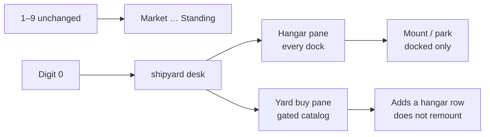
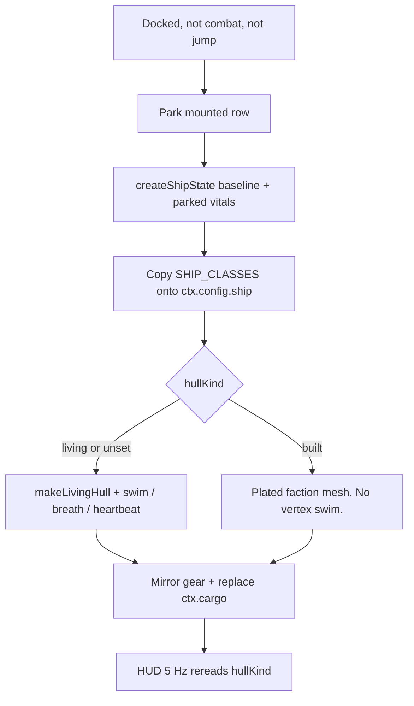
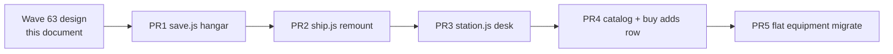

# RIMWARD SHP shipyards, hangar, and first-slice loadouts

| Field | Value |
|---|---|
| **Title** | RIMWARD SHP shipyards, hangar, and first-slice loadouts |
| **Author** | Wave 63 SHP integrator |
| **Date** | 2026-08-18 |
| **Status** | Accepted. Wave 63 is design. Wave 64 landed the serial first slice (PR1–PR5). |
| **Wave** | 63 — design. 64 — first implementation. |
| **Owner request** | SHP design brief. Do not ship yards, hangar, or hull swap in this wave. |
| **Merge law** | [`out/w63/shared-contract.md`](../out/w63/shared-contract.md). If a family brief and that file conflict, the contract wins. |

**Verifier record:**

| Note | Verifier | Result |
|---|---|---|
| [`out/w63/current-shp-inventory.md`](../out/w63/current-shp-inventory.md) | [`verify-inventory.txt`](../out/w63/verify-inventory.txt) | **CLEAN** |
| [`out/w63/shp-01-shipyards.md`](../out/w63/shp-01-shipyards.md) | [`verify-shp-01.txt`](../out/w63/verify-shp-01.txt) | **MEDIUM** merge nits — contract wins |
| [`out/w63/shp-02-hangar.md`](../out/w63/shp-02-hangar.md) | [`verify-shp-02-recheck.txt`](../out/w63/verify-shp-02-recheck.txt) | **CLEAN** |
| [`out/w63/shp-03-loadouts.md`](../out/w63/shp-03-loadouts.md) | [`verify-shp-03.txt`](../out/w63/verify-shp-03.txt) | **MEDIUM** persist shape — flatten to contract |
| [`out/w63/shared-contract.md`](../out/w63/shared-contract.md) | [`verify-shared-recheck.txt`](../out/w63/verify-shared-recheck.txt) | **CLEAN** |

---

## Overview

The player flies one living `light` hull forever. There is no shipyard desk, no hangar blob, and no player mesh swap. Wishlist SHP still needs faction yards, magical multi-ship storage, and a first move of existing equipment onto the hull.

This brief is the integrator document for that later implementation wave. It freezes the dock service key, Digit 0, hangar persist on `WORLD_FIELDS`, `hullKind` write sites, remount flight-envelope copy, SHP-03 flat hull fields, New Game / death rules, and a serial PR plan. Wave 63 lands this markdown only. Yards do not ship here.

HUD-02 already reads `ctx.player.hullKind` (`hudFamily` in `src/systems/hud.js`). SHP writes that field. HUD never writes it. Do not reopen HUD-02 owner answers Q1–Q3.

---

## Background & Motivation

### Current state (inventory)

Source of truth for “ships today”: [`out/w63/current-shp-inventory.md`](../out/w63/current-shp-inventory.md) (verifier CLEAN). Code wins over stale comments.

| Surface | Today | Cite |
|---|---|---|
| Player mesh | One living hull. `makeLivingHull`. Never replaced. | `ship.js` 7–25, 248–321, 393 |
| Player record | `createShipState('light')`. No `hullKind`. | `ship.js` 397–398; `state.js` 118–139 |
| Player cruise | `ctx.config.ship` light baseline (`maxSpeed` 120, `creep` 30). `ship.js` does not import `SHIP_CLASSES`. | `ctx.js` 43–47; `ship.js` 533–562 |
| Player turn | Follows `classKey` via `hoverTurnRateFor`. | `ship.js` 513–515 |
| Dock keys | Nine frozen services. Digit N → index N−1. Digit 0 is −1 and is rejected. | `station.js` 116, 2248–2251 |
| Equipment | `ctx.world.scanner` / `miningLaser` / `concealedMounts` on `WORLD_FIELDS`. One Deepcore for the career. | `save.js` 65–82, 244–256 |
| Cargo | Live hold is `ctx.cargo`. `player.cargo` is NPC/record only. | `save.js` 167; inventory §9 |
| Persist player | Wholesale `player: ctx.player`. `Object.assign` keeps extra keys. | `save.js` 170, 359 |
| New Game | `clearAutosave()` only (`rimward-save-v1`). Berths 1–3 survive. | `save.js` 200–206; `title.js` |
| Death, no save | `freshStart` assigns a new light. Leftover keys such as `hullKind` **keep**. | `save.js` 375–402 |
| HUD family | Reads `hullKind`. Live default `bio`. | `hud.js` 64–74 |

`SHIP_CLASSES` keys: `light` `heavy` `freighter` `ace` `cutter` `frigate` (`state.js` 34–41). Those numbers feed vitals / `bookValue` / NPC cruise. They do **not** retune player cruise today.

### Pain points

- Wishlist SHP-01: no faction yard, no purchasable hull, no reputation+price gate.
- Wishlist SHP-02: buying a hull cannot store the old one; there is no hangar.
- Wishlist SHP-03: scanner / mining head / Q-ship are career-global. A later swap would share one Deepcore across every stored ship.
- A remount that only writes `player.classKey` leaves a heavy / freighter on the light 120/30 envelope.
- Extra player keys persist unsanitized. A hand-edited `hullKind: 'built'` already forces HUD `mech`.
- `station.js`, `save.js`, `state.js`, and `ship.js` are not parallel-safe.

### Why now (design) / why not now (code)

The owner asked for the SHP brief after HUD-02 skins. Inventory, family notes, and the shared contract exist. Implementation waits for a later serial wave so yards, hangar, and remount land against a frozen contract.

---

## Goals & Non-Goals

### Goals

1. One dock desk, two panes: Hangar (every dock) + Yard buy (gated). Append **one** service after `epics`.
2. Magical hangar on `ctx.world.hangar` = `{ mountedId, hulls }`. Live hull is a row. Cap **8**.
3. Buy **adds** a hangar row. It does not remount or trade away the mounted hull.
4. Cargo travels with the hull. `ctx.cargo` is the mounted hold.
5. SHP writes `hullKind` `'living' | 'built'`. HUD reads. Unknowables force `'living'` on every path. Unset = bio.
6. Remount copies authored `SHIP_CLASSES[classKey]` onto `ctx.config.ship`. Turn already follows `classKey`; cruise does not today.
7. Bio companion is not a hull and survives swaps.
8. First slice: yards + hangar + `hullKind` + remount. SHP-03 first = move existing equipment onto flat hull fields. World keys stay live mirrors.
9. World strings stay `textContent`. Persist is allowlisted.
10. This wave writes the brief. A later wave ships serially. Do not weaken the living player mesh.

### Non-goals (locked — do not reopen)

- No yards, hangar, or remount in Wave 63.
- No mid-list insert into `DOCK_KEY_SERVICES`. Digits 1–9 stay Market…Standing.
- No SHP-01 key `'yard'`. The service key is `'shipyard'`.
- No remount-on-buy. SHP-01 “park then remount the SKU as the live ship” is rejected.
- No nested hangar `loadout` object. Contract sanitize drops unknown keys.
- No missiles, launchers, lock-box, missile timer, or incoming-missile gauge.
- No turrets / TGT-04 automatic guns.
- No mass / power / heat-per-fit sim. Plant / Flight / Heat stay HUD aux.
- No new `WEAPONS` / `MINING_LASERS` / `SHIP_CLASSES` rows in a parallel feature PR. `state.js` is READ-ONLY for feature workers.
- No HUD-03 free skin checkbox. Do not reopen HUD-02 Q1–Q3.
- No HUD write of `hullKind`, `faction`, or `classKey`.
- No persist of `ctx.config.ship`, cruise numbers on the hangar blob, or `sessionStorage['rw-hud-family']`.
- No factory-reset of `ctx.bio` on buy, park, remount, or New Game-adjacent hull work.
- No conventional starter as the boot default.
- No weakening `makeLivingHull` swim / breath / heartbeat to make remount easier.
- No new `localStorage` hangar key. New Game stays `clearAutosave` only.

---

## Proposed Design

### 1. Merge resolutions (contract wins)

Sibling notes that lost:

| Sibling claim | Integrator freeze | Why |
|---|---|---|
| SHP-01 append `'yard'`, click-only, Digit 0 later | Key **`'shipyard'`**. Digits 1–9 unchanged. Digit **0** opens shipyard (`Number('0')-1 === -1` needs a special case). | Contract §2.2. Frozen 1. |
| SHP-01 every buy parks then remounts the SKU | Buy **adds a hangar row**. Mounted hull stays mounted. Swap is a Hangar-pane verb. | Contract §2.3. Frozen 2. |
| SHP-01 cargo stays a world hold on buy | Cargo parks/loads with the hull. `ctx.cargo` is the mounted hold. | Contract §8 Q2. Frozen 3. |
| SHP-03 nested `hull.loadout` / `hangar.mounted` / `instanceId` | Flat row fields. Pointer is `mountedId`. Row id is `id`. | Contract §1.2. Frozen 8. Verifier MEDIUM persist shape. |
| SHP-03 PR3 drops world equipment keys from `WORLD_FIELDS` | First slice **keeps** world mirrors. | Contract §1.1 / §5. Frozen 8. |
| SHP-02 first-pass stored-only array / cap 4+3 / KeyY-only / `freshStart` vault | Rejected in the hangar recheck. Shape `{ mountedId, hulls }`, cap 8, Digit 0, no-save death rebuilds one living starter. | Contract §1.2, §1.3, §8. Frozen 4, 10. |

---

### 2. Dock UI

Shipped (`station.js` 116):

```js
export const DOCK_KEY_SERVICES = Object.freeze([
  'market', 'jobs', 'bar', 'feed', 'repair', 'outfitting', 'people', 'launch', 'epics',
]);
```

Level-1: `DigitN` → index `N - 1`. Digits 1–9 map the nine keys. Digit 0 is index −1 and is rejected today.

**Later implementation — append only:**

```js
[...existing nine, 'shipyard']
```

| Index | Digit | Key | Label |
|---|---|---|---|
| 0–8 | 1–9 | unchanged | Market … Standing |
| 9 | **0** | `shipyard` | `Shipyard` |

Hotkey law:

- Digits 1–9 keep today’s services. Launch stays 8. Standing stays 9.
- Digit **0** selects the appended `shipyard`. Special-case `Digit0` → last key.
- Optional extra: `KeyY` may also open Shipyard. Do not refuse Digit 0.
- Legend: `1-9, 0 select service · Esc/B launch` (or equal). Still `textContent`.
- `selectService('launch')` still undocks. The new key opens level 2 like the others.

Do **not** insert before `launch`, between `people` and `launch`, or anywhere in the middle. Do **not** fold hull sales into Outfitting (Outfitting already spends digits 1–7).

#### 2.1 One desk, two panes

Not two `DOCK_KEY_SERVICES` entries.

1. **Hangar (every dock).** List owned hulls. Mount / park. Magical: any station, any shipyard, no delivery.
2. **Yard buy (gated).** If this dock sells hulls, list the authored catalog for that yard. Price + reputation gate. Buy **adds** a hangar row.

Hangar still opens when the dock sells nothing. Empty buy pane: fail-closed note, no debit.

Inside Shipyard (level 2): Digit **1** = Hangar pane, Digit **2** = Yard buy pane (or the reverse if the implementer documents the legend). Pane-local digits 3+ index the active pane only. Re-read the pane at keydown.

Confirm before debit. Digit keys must not one-shot a sale.

#### 2.2 UI construction

`station.js` `h()` already sets `textContent` (1450–1454). Keep that. Overlay clear uses `overlay.textContent = ''` (2175) — that is a wipe, not a world-string interpolate. Catalog names, hull names, notices, and faction strings stay `textContent`.

Do not rebuild the whole dock chrome. Append the menu button in the existing `forEach`.



---

### 3. Hangar persist

Add **`hangar`** to `WORLD_FIELDS`. Nothing else HUD-shaped. Do not store hangar on `ctx.player`. Do not add a second `localStorage` key.

JSON-plain shape (contract §1.2):

```js
// ctx.world.hangar — magical, dock-global
{
  mountedId: 'hull_starter', // SAFE_ID, must name a row in hulls
  hulls: [
    {
      id: 'hull_starter',
      hullKind: 'living',        // 'living' | 'built' only
      faction: 'independent',    // sanitizeFaction
      classKey: 'light',         // must exist on SHIP_CLASSES
      name: '',                  // optional; mounted copy is world.shipName
      scanner: 0,                // 0|1|2
      miningLaser: 0,            // 0|1|2|3
      concealedMounts: false,    // literal true or false
      cargoCapacity: 20,
      cargo: [],                 // sanitizeCargoList
      hull: 100, hullMax: 100,
      screen: 40, screenMax: 40,
      shell: 60, shellMax: 60,
      engine: 100, engineMax: 100,
      heat: 0,
    },
  ],
}
```

Rules:

- Missing / non-object `hangar` on a legacy save → build **one** living starter row from live `ctx.player` + current world mirrors. Starter `hullKind` is `'living'`. `mountedId` is that row. Do not heal to `[]`.
- `hulls` must be an array. Drop non-objects. Cap **8** (includes the mounted row). Extra rows drop from the tail after the mounted row is kept.
- Each row: drop unknown keys. Drop `__proto__`, `prototype`, `constructor`. Fresh literals only. Never `Object.assign(target, rawSlot)`.
- `id`: `SAFE_ID` (`save.js` 85), length ≤ `ID_MAX` (64). Dedupe by first wins. Empty / reserved id → drop the row. Do not use the id as an object key into `world`.
- `hullKind`: `'living'` or `'built'` only. Anything else → **delete** the key (HUD fall-through is `bio`). Unknowables rows that survive sanitize must be `'living'`.
- `classKey`: must be a key of `SHIP_CLASSES`. Else coerce to `'light'`. Persist **admits** `ace` / `cutter` / `frigate`. First-slice **buy lists** may omit those three; sanitize does not drop a stored capital row.
- `faction`: `sanitizeFaction`. Else `'independent'`.
- `scanner` / `miningLaser` / `concealedMounts`: same heals as world.
- `cargo` / `cargoCapacity`: `sanitizeCargoList`; capacity finite and ≥ 20.
- Vitals: non-finite → rebuild from `createShipState(classKey)`. Clamp current ≤ max. Overwrite maxes from `SHIP_CLASSES`.
- `mountedId` must match a remaining hull. Else first hull, or starter rebuild.
- Do not persist meshes, THREE objects, functions, `bio`, `input`, `flags`, HUD family, session debug keys, `personality`, cruise / burn / creep / stopTime, or `ctx.config.ship`.

`snapshot()` must park the live hull into its row **before** the `WORLD_FIELDS` copy (manual berth, autosave, `requestAutosave`). Park is JSON only. Do not remount and do not write `ctx.bio`.

Live hull **is a row in `hulls`**. After park / load / restore, the mounted row and `ctx.player` must agree on `hullKind`, `faction`, and `classKey`.

---

### 4. `hullKind` / HUD

SHP-owned. Tokens: `'living' | 'built'`. HUD reads via shipped `hudFamily` (`hud.js` 65–74). HUD never writes.

```js
export function hudFamily(ctx) {
  const debug = sessionHudFamilyOverride(); // session-only; mech|bio
  if (debug === 'mech' || debug === 'bio') return debug;
  const p = ctx.player;
  if (!p) return 'bio';
  if (p.hullKind === 'built') return 'mech';
  if (p.hullKind === 'living') return 'bio';
  if (isBeautiful(p.faction)) return 'bio';
  return 'bio';
}
```

#### 4.1 Identity triple

| Field | Meaning | HUD | SHP |
|---|---|---|---|
| `hullKind` | Grown vs plated **mounted** hull | Read. Never write. | Write on buy / mount / sanitize. |
| `faction` | Banner of the mounted hull | `isBeautiful` after kind miss only | Write the purchased banner. Unknowables → kind `'living'`. |
| `classKey` | `SHIP_CLASSES` row (role / stats) | Do **not** switch on class | Write a real class key. Ace / cutter / light can be either culture. |

Do **not** key HUD or remount culture on: `ctx.world.origin`, `ctx.bio`, `classKey` alone, `flags.camera`, `flags.combat`, scanner tier, target faction, or a HUD-03 checkbox.

#### 4.2 Cases

| Case | `hullKind` SHP must write | `hudFamily` |
|---|---|---|
| Fresh boot / legacy save / living starter | `'living'` on first hangar migrate (or leave unset; both are `bio`) | `bio` |
| Beautiful Ones purchased hull | `'living'` | `bio` |
| Unknowables purchased hull | **`'living'`**. Never `'built'`. | `bio` |
| Freehold / Ledger / Ferrous / other plated hull | `'built'` | `mech` |
| Swap back to a living hangar row | `'living'` | `bio` on next 5 Hz tick |
| Living hull with conventional guns | still `'living'` | `bio` — weapons do not pick the HUD |
| Session `rw-hud-family` | do not copy onto player | debug override until tab close |

Live default stays the living starter until a `'built'` hull is **mounted**. There is no conventional player mesh in the tree today. Do not fake one with origin.

Purchased independent hulls are plated (`'built'`). The **starter** is living, unset or `'living'`, current mesh. Do not stamp `'built'` on the starter except by a real purchase that the player then mounts.

#### 4.3 Unknowables force (every path)

After the enum allowlist on pack / park, unpack / load, sanitize / restore, player allowlist, remount, buy stock, and `freshStart`:

```
if (faction === 'unknowables') hullKind = 'living';
```

Use the faction on **that object**. Also, if the mounted row is Unknowables, write `'living'` on the player. A coder who follows only numbered steps cannot remount Unknowables as built.

#### 4.4 Player-record heal

After every `Object.assign(ctx.player, snap.player)` and after every mount:

1. If `hullKind` is not `'living'` or `'built'`, **delete** `ctx.player.hullKind`.
2. If the mounted hangar row (or player faction) is Unknowables, force `'living'`.
3. Do not accept `'mech'`, `'bio'`, `'live'`, `true`, `1`, or any other token.

`sanitizeRestored` today heals NaN vitals only. It does **not** drop unknown keys. That is why HUD must never write the field, and why SHP sanitize is mandatory.

Do **not** smuggle `hullKind` through a silent `createShipState` edit in a parallel PR. First slice writes it at SHP mount / sanitize sites. `state.js` stays READ-ONLY for feature workers.

HUD must **not**: assign `hullKind` / `faction` / `classKey` to pick a skin; persist `rw-hud-family`; add an O-panel HUD-style checkbox; rebuild `#hud` nodes on swap (5 Hz `data-family` refresh already exists); write `ctx.input.throttle`.

No HUD-03 free skin override (HUD-02 Q3, 2026-08-18).

---

### 5. Swap / remount

Swap is instant and **dock-only**. Hangar is magical. Station UI calls one verb (for example `switchTo(ctx, id)` in a new `hangar.js`). It does not mutate hangar by hand.

Refuse if: not docked; in combat; mid-jump; player destroyed; paused; target id missing after sanitize; target is already mounted.

#### 5.1 Must do

1. Park the mounted hull into its hangar row: identity triple, name (`world.shipName`), vitals, scanner, miningLaser, concealedMounts, cargo list, cargoCapacity.
2. Load the chosen row onto `ctx.player` with `createShipState(classKey, { name, faction })` as the **numeric baseline**, then apply parked vitals and `hullKind`. `createShipState` sets vitals / `bookValue` only. It does **not** retune player cruise.
3. **Copy the flight envelope** from authored `SHIP_CLASSES[classKey]` onto **`ctx.config.ship`** (same object `ship.js` already reads). Sanitized class key. Map:
   - `cruise` → `ctx.config.ship.maxSpeed`
   - `creep` → `ctx.config.ship.creep`
   - `burn` → afterburner peak so cruise × `afterburner.multiplier` equals `burn` (today light is 120 × 2 = 240)
   - `stopTime` → settle (`damping` / accel as `ship.js` already uses so she stops in ~`stopTime`)
   Restore / `freshStart` remount must run this copy too. Do **not** persist `ctx.config.ship`. Do **not** read cruise / burn / creep / stopTime off the save blob.
4. Mirror scanner / miningLaser / concealedMounts onto `ctx.world`.
5. Replace `ctx.cargo` with the parked list (`sanitizeCargoList`). Set `ctx.cargoCapacity` from the row. Do not concat.
6. Set `ctx.world.shipName` from the row `name`.
7. Set `hangar.mountedId`.
8. Remount the **mesh**:
   - `hullKind === 'living'` (or unset) → living path. Reuse `makeLivingHull` + swim / breath / heartbeat. Do not substitute a static organic prop. Envelope copy must **not** idle those fields.
   - `hullKind === 'built'` → a plated faction mesh. Do not run living vertex swim on plated hulls. Default mesh source: reuse existing faction NPC ship builders, player-scaled. Do not replace the living starter with that mesh until a `'built'` mount.
9. Keep the dock transform. Zero velocity / speed. Do not teleport. One `ctx.ship.object`. Dispose the old root. Never `ctx.ships.push` the player.
10. Rebuild player combat flags from the parked row (or healthy baseline). Do not leave `destroyed` / `disabled` / `engineOut` stuck from the previous hull.
11. Leave MATCH alone except as `ship.js` already does: docked play clears `flags.matchSpeed`. Do **not** write `ctx.input.throttle`.
12. Let HUD 5 Hz reread `hullKind` / `faction`. Do not add a persist event for the family flip.
13. Debit credits only on **buy**, from the authored catalog price, after re-checking purse and reputation. Swap is free.
14. Ignore `createShipState` `personality` (`Math.random()`). Do not persist personality as a hangar field.
15. Do not write `ctx.bio`.

If remount throws, restore the pre-switch snapshot of player + cargo + hangar + cargoCapacity + world mirrors + `ctx.config.ship`.

#### 5.2 Must not do

**Today’s fact (shipped, not optional):** `classKey` alone does **not** change player cruise. Turn already follows `classKey`. A remount that only writes `player.classKey` leaves a heavy / freighter on the light 120/30 envelope.

| Do not | Why |
|---|---|
| Reset or re-roll `ctx.bio` | Companion is not a hull. |
| Dump cargo into the void or a global pile | Cargo travels with the hull. |
| Move credits, reputation, jobs, origin, epics, contacts, mystery | Career / world. |
| Weaken living motion or vein skin on a living remount | Wishlist BIO preserve. |
| Delete `makeLivingHull` or idle living fields “to make remount easier” | Same. |
| Invent a conventional starter as the boot default | Only mounted hull today is living. |
| Write HUD family, settings, or `hullKind` from `hud.js` | §4. |
| Insert a dock service mid-list | §2. |
| Trade away the current hull on purchase | Frozen 2. |
| Trust `bookValue` or a save-authored price | §8. |
| Write `ctx.input.throttle` | MATCH law. |
| Run swap in space, mid-jump, or while `playerDestroyed` | Dock desk only. |
| Leave `ctx.config.ship` at the light baseline after a non-light mount | Cruise reads `config.ship`, not `classKey`. |
| Persist `ctx.config.ship` or copy cruise numbers from the hangar blob | Tamper must not author a 999 cruise. |
| Grow a new `SHIP_CLASSES` row in a parallel feature PR | `state.js` shared, READ-ONLY. |



---

### 6. Buy (SHP-01)

Catalog is **code**, not save. Cost and min-rep live next to the hull offer.

#### 6.1 Who sells

- Hangar on **every** dock.
- A dock shows a buy list only when the dock faction has a catalog.
- Each faction that has a catalog has at least one such yard in the galaxy.
- Independent / hollow catalogs may stay empty (hangar-only docks) until the owner adds stock.

First-slice catalogs **may** start at authored capitals (Freehold Landing, Veridian Spire, Ledger Anchorage) with a small stock. Generated docks need not sell in the first slice. Wishlist “at least one yard per faction” is later depth for banners that still have empty catalogs.

#### 6.2 What they sell

Use existing `SHIP_CLASSES` keys. Do not add class rows in a parallel PR.

- First-slice **buy lists may omit** `frigate` / `ace` / `cutter`. Persist still admits those keys.
- Contract default: omit `frigate` from buy lists (capital row). This brief also omits `ace` and `cutter` from first-slice BUY so the first career fork is `light` vs later `heavy` / `freighter` when those catalogs exist.
- Do not dump `Object.keys(SHIP_CLASSES)` onto a generated dock.

Authored list-price floors (not `hull * 12` `bookValue`):

```
YARD_LIST_UU = {
  light: 8000,
  cutter: 11000,
  heavy: 20000,
  ace: 28000,
  freighter: 24000,
  frigate: 80000,
}
```

The yard **never** reads `ctx.player.bookValue` or a save-supplied price. Recompute from the table + live rank every click.

Optional first-slice rank discount on hull list price only (do not stack epic / `FACTION_SERVICES.buyMult`): Sworn 15%, Trusted 10%, Known 5%, Stranger 0%. Hostile (`reputation[faction] < 0`) is **no sale**, not a surcharge.

#### 6.3 Reputation gate

Field: `ctx.world.reputation[dockFaction]` (`?? 0`). Fail closed.

- Do **not** gate on `ctx.world.origin`.
- Do **not** gate on `ctx.player.faction`.
- Do **not** read a floor off the hangar slot.

Default (contract §8 Q6): refuse when `reputation[faction] < 0`. Higher class rows may set a higher authored floor. Do not require Known for `light` unless the catalog row says so.

#### 6.4 Buy flow (adds a row)

1. `hulls.length >= 8` → refuse. Notice: hangar is full. Do not silently sell the mount.
2. Recompute price. `credits < price` → refuse.
3. Re-check live reputation vs catalog floor.
4. Confirm control (`Confirm papers` / Esc cancel). No single digit completes a sale.
5. Build a stock row. It must pass hangar sanitize **before** use. `hullKind` from an allowlist table, never a button attribute. Unknowables → `'living'`.
6. `parkMounted` so the live hull’s cargo/gear/vitals are in its row.
7. Push the new row onto `hulls`. **Do not** `loadMounted` / remount in the first slice. The player keeps flying the current hull. The new ship appears in Hangar.
8. Debit `ctx.world.credits`. Integer UU. No negative purse. One debit (refuse re-entry while a buy is in flight).
9. `requestAutosave` (same gates as `trySave`). Do not leave the purchase only in RAM until undock.

Allowlist the click: `classKey` ∈ `SHIP_CLASSES` ∩ this dock’s `YARD_STOCK`; `faction` = dock flag, never `data-faction`; `hullKind` = table, never a button attribute.

No trade-in. Do not subtract `bookValue`. Do not delete the mounted hull to pay.

If asset not primed for a later **mount** of that SKU, the Hangar switch fails closed with a notice. Buy may still add the row only if the implementer can remount that SKU when the player later switches; otherwise refuse the buy (`The yard cannot release this hull yet.`).

---

### 7. SHP-03 first slice (flat hull fields)

First slice binds equipment that **already exists** to the hangar hull. It does not add missiles or turrets.

**Source of truth after hangar exists:** the mounted **row**.

| Field | After first slice | World key |
|---|---|---|
| `scanner` 0\|1\|2 | Per-hull, flat | Live **mirror** of the mount |
| `miningLaser` 0\|1\|2\|3 | Per-hull, flat | Live mirror |
| `concealedMounts` literal true else false | Per-hull, flat | Live mirror |
| `cargo` / `cargoCapacity` | Per-hull (SHP-02) | Live hold is `ctx.cargo` / `ctx.cargoCapacity` |
| Cannon / disruptor | Stay groups 1–2 as shipped. Do not persist a nested `general` array. | — |
| `ctx.input.weaponGroup` | Session. Not persisted. | — |

Do **not** persist a nested `loadout` object. Contract drop-unknown-keys would strip it. Do not use `hangar.mounted` or `instanceId`.

Outfitter stays the existing dock service. Digit keys on the dock root are already spent. Outfitter writes the **mounted** hull row, then mirrors to `ctx.world`. No new outfitting digits in the first slice. Digit1–7 stay hold / Mk I / concealed / Mk II / mining heads.

#### 7.1 Migrate once (mounted hull only)

Trigger: first load or first hangar create after SHP-02 exists.

- Copy current world `scanner` / `miningLaser` / `concealedMounts` / `cargoCapacity` onto the **mounted** row (flat fields).
- Other stored hulls that SHP-02 seeds empty get **stock** (scanner 0, miningLaser 0, concealedMounts false, capacity 20), not a copy of the world Deepcore.
- Sanitize runs **every restore, on every hangar hull**. A migrate-once flag must not skip the heal.
- A save with **no** hangar keeps today’s world-key path and today’s heals.

After migrate, world keys remain write-through mirrors so combat / HUD / hail / outfitter readers do not fork in the same PR. First implementation does **not** drop those keys from `WORLD_FIELDS`.

Swap isolation: park writes mirrors onto the outgoing row; load copies the incoming row onto world. One Deepcore must not sit on every stored ship.

#### 7.2 Living ships and conventional parts

Mount counts (later table) are by `classKey`, not `hullKind`. A living `light` and a built `light` share counts. Conventional cannon / disruptor / mining / Wolfeye / concealed mounts may seat on `hullKind: 'living'`. Weapons do not pick the HUD. Do not require BIO-02 growth-center. Do not strip the living starter’s cannon or disruptor. Unknowables purchased hulls stay `'living'` and still take these flat fields.

#### 7.3 Later (not first slice)

Missiles + launcher hardpoints; turret / automatic guns (TGT-04); new `WEAPONS` families; mass / power / ammo sim; dropping world mirrors from `WORLD_FIELDS`; a nested loadout schema (only if the persist contract is updated first).

If a later weapon appears, it shows in **WPN text**, not a lock box, not a new HUD tree.

---

### 8. New Game, death, berths

| Path | Hangar | Live mount | Berths 1–3 |
|---|---|---|---|
| **New Game** (`clearAutosave` → reload) | Autosave hangar gone with `rimward-save-v1`. New session migrates to one living starter. | Fresh `light` from `ship.js`. | **Must survive.** Each slot keeps `world.hangar` inside its `{v:1}` blob. |
| **Death + autosave** | Restore snapshot hangar, then sanitize. | Restore snapshot player, then allowlist + copy from mounted row. | Untouched. |
| **Death + no autosave** (`freshStart`) | **Rebuild** to one living starter. Do not keep parked rows. Do not pack the wreck. | Rebuild `light`. **Then** player allowlist. Delete leftover `'built'`. Force `'living'`. Clear live cargo. World gear mirrors = starter zeros. Envelope copy for light. | Untouched. |
| **Manual berth Save / Load** | `snapshot` / `restore` via `WORLD_FIELDS`. Park first on save. | Allowlist + mounted-row copy. | That slot only. |

**Forbidden:** wiping `rimward-save-v1-slot-1..3` on New Game.  
**Forbidden:** storing hangar only in a new top-level key that berth `snapshot()` forgets.

`freshStart` numbered hangar heal:

1. Existing `Object.assign(ctx.player, createShipState('light', { name }))`.
2. Player allowlist (`living`\|`built` or delete; Unknowables → `'living'`).
3. Force `hullKind: 'living'` on this recovery light. Delete leftover `'built'`.
4. Build one starter row. Sanitize (includes Unknowables force).
5. Write `ctx.world.hangar = { mountedId: starter.id, hulls: [starter] }`.
6. Mirror starter gear onto world. Replace `ctx.cargo` with `[]`. Set capacity 20.
7. Copy light envelope onto `ctx.config.ship`. Remount living mesh if the implementation already has remount; do not leave a plated mesh on the recovery light.

Bio on these paths stays the existing `save.js` contract. Hangar does not write her.

---

### 9. Security (design law)

Threat model: local browser game. Practical attacks are save tamper, DOM XSS from world strings, prototype-key smuggling, and trusting a save blob for price / class / kind / cruise.

| Value | Allow |
|---|---|
| `hullKind` | `living`, `built` — else delete. Then Unknowables → `'living'`. |
| `classKey` | keys of `SHIP_CLASSES` — else `light` |
| `faction` | `sanitizeFaction` — else `independent` |
| `scanner` | `0,1,2` — else `0` |
| `miningLaser` | `0,1,2,3` — else `0` |
| `concealedMounts` | literal `true` else `false` |
| HUD family debug | `mech`, `bio` in **session** only |
| Dock service key | frozen list + appended `shipyard` |
| Buy price / min-rep | authored catalog + live credits / reputation |

- Hull names, faction names, catalog lines, yard notices, `shipName`: `textContent` / `Text` nodes. No `innerHTML` / `insertAdjacentHTML` / `document.write` of world or save strings.
- CSS is authored. Do not interpolate faction ids into stylesheet text.
- Build hangar / hull objects with `Object.create(null)` **or** assign onto a fresh literal and copy allowlisted keys only.
- Cap `hulls.length`. Cap cargo rows via existing sanitizer.
- Do not eval or hydrate functions from JSON.
- A hand-edited hangar can spawn extra hulls (credits are already editable). Still fail closed on **types**, caps, class keys, Unknowables kind, and buy-path price.

---

## API / Interface Changes

No public API change in Wave 63.

Later implementation wave:

| Surface | Change |
|---|---|
| `src/game/save.js` | Append `'hangar'` to `WORLD_FIELDS`. Park before snapshot. `sanitizeHangar`. Player `hullKind` allowlist. `freshStart` hangar rebuild. Export narrow `requestAutosave` if needed. Do not touch berth keys in `clearAutosave`. |
| `src/systems/ship.js` | `remountPlayerHull`. Envelope copy onto `ctx.config.ship`. Gate living swim. Built path uses faction mesh. Unknowables → `'living'` before mesh branch. **Do not** weaken `makeLivingHull`. **Do not** write `input.throttle`. |
| `src/systems/station.js` | Append `'shipyard'`. Digit 0 special-case. Two panes. Outfitter writes mounted row then world mirrors. `textContent` only. |
| New `src/game/hangar.js` (or equal) | Cap, sanitize, park, load, switch, `canAcceptPurchase`. Pure data. |
| New `src/game/shipyard.js` (or equal) | `YARD_STOCK`, `YARD_LIST_UU`, `hullKindFor`, `yardPrice`. Report before touching `state.js`. |
| `src/game/state.js` | **No change** unless a serial owner later lands tables. Feature workers READ-ONLY. |
| `src/systems/hud.js` | **Read only.** Confirm 5 Hz already flips on `hullKind`. No write. |
| `src/systems/settings.js` | **No change.** |
| `src/core/ctx.js` | Comment only if `world.hangar` / `requestAutosave` need a note. No new persist event. Do not persist `config.ship`. |
| `src/systems/combat.js` / `hail.js` / `npc.js` | Keep reading world mirrors in the first slice. |
| `src/game/bio.js` | Companion only. Not a hull store. |

---

## Data Model Changes

Wave 63 adds **no** persist keys in the running game. Later implementation:

| Field | Owner | Persist | Rule |
|---|---|---|---|
| `ctx.world.hangar` | SHP + `save.js` | New `WORLD_FIELDS` key | `{ mountedId, hulls }`. Cap 8. Allowlist rows. |
| `ctx.player.hullKind` | SHP mount / buy / restore | Extra player key that already **keeps** via `Object.assign` | Allowlist `'living' \| 'built'`; else delete. Unknowables force `'living'`. HUD never writes. |
| `ctx.player.faction` / `classKey` | SHP mount / buy | Already persisted | Sanitize faction; class ∈ `SHIP_CLASSES` else `'light'`. |
| `world.scanner` / `miningLaser` / `concealedMounts` | Outfitter + remount | Stay on `WORLD_FIELDS` | Live mirrors of the mounted row. |
| `ctx.cargo` / `ctx.cargoCapacity` | Hangar park/load | Existing snapshot siblings | Mounted hold. |
| `ctx.bio` | `bio.js` | Existing | Not on a hangar slot. |
| `ctx.config.ship` | Remount | **Do not persist** | Copy from authored `SHIP_CLASSES`. |
| `ctx.settings.*` | `settings.js` | `rimward-settings-v1` | No HUD-skin field. |
| `sessionStorage['rw-hud-family']` | HUD debug | Session | Never copy onto hangar / player. |

---

## Alternatives Considered

### Dock key

**Alt D1 — SHP-01 `'yard'`, click-only, Digit 0 later.**  
Rejected. Merge law names `'shipyard'` and Digit 0 in the first slice. Both append (digits 1–9 stay), but two tokens would land two keys or the wrong one.

**Alt D2 — Insert before `epics` or fold into Outfitting.**  
Forbidden. Renumbers 1–9 or shifts mining-head ladder keys.

**Chosen:** append `'shipyard'` after `epics`. Digit 0 special-case.

### Buy vs remount

**Alt B1 — SHP-01 remount-on-buy (park current, fly the SKU immediately).**  
Rejected. Wishlist SHP-02 is own-many / store / switch. Buy that remounts still changes the mounted ship. First-slice desk **adds a hangar row**.

**Alt B2 — Trade-in / delete the mounted hull to pay.**  
Rejected. No trade-in. Full authored list.

**Chosen:** buy adds a row. Hangar pane mounts.

### Persist envelope

**Alt P1 — Stored-only array + `player.hangarId`.**  
Rejected. Dual live copy. Player is not a whitelist.

**Alt P2 — Nested `loadout` child on each hull.**  
Rejected. Contract §1.2 is a flat row. Unknown keys drop. Verifier MEDIUM on SHP-03.

**Alt P3 — New `localStorage` hangar key.**  
Rejected. New Game / berth rule would fork.

**Chosen:** `ctx.world.hangar` on `WORLD_FIELDS`. Flat rows. Cap 8.

### Cargo

**Alt C1 — Shared career hold / world pile.**  
Rejected. Freighter ore would follow a fighter hop. Contract default: cargo travels with the hull.

**Chosen:** `ctx.cargo` is the mounted hold. Park/load replace, do not concat. Delete `player.cargo` on sanitize.

### Flight remount

**Alt F1 — Write `classKey` only.**  
Rejected. Player cruise reads `ctx.config.ship`. A purchased heavy would still fly 120/30.

**Alt F2 — Persist cruise numbers on the hangar row.**  
Rejected. Save tamper authors god-speed.

**Chosen:** remount copies authored `SHIP_CLASSES[classKey]` onto `ctx.config.ship`. Turn already follows `classKey`.

---

## Security & Privacy Considerations

See also `out/w63/shared-security.md`, family security briefs, and `out/w63/integrator-security.md`.

| Risk | Severity | Mitigation |
|---|---|---|
| HTML injection via hull names, catalog lines, notices, `shipName` | **High** | `h()` `textContent`. No `innerHTML` of world or save strings. |
| Unsanitized `hullKind` on wholesale player restore | **Medium** | SHP allowlist + delete. HUD never writes. Unknowables force `'living'`. `freshStart` deletes leftover `'built'`. |
| Nested `loadout` / extra keys smuggled on hangar rows | **Medium** | Flat allowlist. Drop unknown keys including `__proto__`. |
| Buy trusts blob `price` / `bookValue` / `minRep` | **Medium** | Authored catalog. Live credits and reputation. |
| Save-authored cruise / `maxSpeed` | **Medium** | Envelope from `SHIP_CLASSES` only. Do not persist `config.ship`. |
| Prototype `Object.assign` from raw JSON | **Low** | Fresh literals. Never assign raw slots onto player or world. |
| Side-channel hangar `localStorage` key | **Low** | Hangar rides `{v:1}` via `WORLD_FIELDS`. `clearAutosave` stays one key. |
| Session HUD override copied onto hangar | **Low** | Session only. Not a persist field. |
| Logging bio / hull names with identifiers | **Low** | Do not. |

Threat model: local browser game. Practical threat is XSS through world strings and persist-key smuggling. Fail closed on both.

---

## Observability

No production metrics stack exists. Acceptance is Playwright / boot pins (later implementation wave).

| Signal | How |
|---|---|
| Dock digits | Pins: 1–9 unchanged; Digit 0 opens `shipyard`; `DOCK_KEY_SERVICES.length === 10`. |
| Hangar shape | Restore `{ mountedId, hulls }`. Cap 8. Mounted row kept when truncating. |
| `hullKind` | `'nope'` / `99` / `'mech'` deleted → `hudFamily` `bio`. Unknowables + `'built'` → `'living'` + bio mesh. |
| Buy | Blob `price: 0` ignored. Credits decrement by authored cost. Mounted id unchanged. `hulls.length` + 1. |
| Remount | Heavy / freighter changes `ctx.config.ship.maxSpeed` / `creep` from authored class, not from the blob. Living remount still swims. |
| Equipment | Mk IV on hull A; swap to B → world miningLaser is B’s 0; swap back → 3. |
| New Game | Berth slots 1–3 still load hangar. Autosave gone. |
| Death no-save | One living starter. No leftover `'built'`. |
| XSS | Names painted with `textContent` only. |

Suggested later boot pins (`scripts/boot-test.mjs`): Digit0 → last service; `hudFamily({ player: { hullKind: 'built', faction: 'freehold' } })` → `mech`; restore after `freshStart` → family `bio`; hangar missing → one living row.

---

## Rollout Plan

Wave 63: this document only. Do not schedule or land the PRs below in Wave 63.

Later implementation is **serial**. One owner at a time on `station.js`, `save.js`, `state.js`, `ship.js`.

| PR | Owner file | What |
|---|---|---|
| **PR1** | `save.js` (+ hangar helper) | Hangar persist + sanitize + `hullKind` allowlist. Legacy migrate to one living row. `freshStart` rebuild. No UI. |
| **PR2** | `ship.js` | Remount + `ctx.config.ship` retune from `SHIP_CLASSES`. Living preserve. Unknowables living before mesh. |
| **PR3** | `station.js` | Append `'shipyard'` + Digit 0 + two-pane UI. Hangar list / switch. Empty buy pane ok. |
| **PR4** | catalog module + `station.js` | Stock / catalog + buy **adds** hangar row. Authored price. Reputation gate. No remount-on-buy. |
| **PR5** | `save.js` + outfitter | Migrate world equipment onto flat hull rows. Outfitter writes row then mirrors. Swap isolation. No missiles. |

Do not parallel-edit the four unsafe files. Safer companions (`hangar.js`, `shipyard.js`) still coordinate with those four.

Rollback: revert the PR that failed; leave persist allowlists if UI rolls back so saves stay loadable.



---

## Open Questions (defaults 2026-08-18)

Owner answers in HUD-02 Q1–Q3 stay **final**. Do not reopen them here.

Only questions that still need the owner. Implementers use the default unless the owner overrides this file.

| # | Question | Default |
|---|---|---|
| 1 | Tenth dock digit? | Digit **0** opens appended `shipyard`. Do not renumber 1–9. |
| 2 | Does cargo stay on the hull? | **Yes.** `ctx.cargo` / `cargoCapacity` park/load with the hull. Credits stay world. |
| 3 | Built player mesh source? | Reuse existing faction NPC ship builders, player-scaled. Do not replace the living starter until a `'built'` mount. |
| 4 | Hangar cap? | **8** hulls. Extra restore rows drop from the tail after the mounted row is kept. Purchase refuses at cap. |
| 5 | Who sells? | Hangar on **every** dock. Buy list only when the dock faction has a catalog. Each faction with a catalog has ≥1 yard. Independent / hollow catalogs may stay empty. |
| 6 | Reputation floor for the cheapest hull of a banner? | Refuse when `reputation[faction] < 0`. Higher class rows may set a higher authored floor. Do not read the floor from the save. |
| 7 | Remount immediately on buy? | **No.** Buy adds a hangar row. Hangar pane mounts. |
| 8 | Nested `loadout` object? | **No.** Flat hull fields. World keys stay mirrors in the first slice. |
| 9 | First-slice BUY of ace / cutter / frigate? | **Omit** those three from buy lists. Persist still admits `SHIP_CLASSES` keys. |
| 10 | Sell / scrap / rename in the first code wave? | **No.** |
| 11 | `freshStart` keep parked hulls as a vault? | **No.** Rebuild one living starter. |
| 12 | New `hullSwitched` persist event? | **No.** Frozen event list. HUD 5 Hz. |
| 13 | HUD-03 free skin override? | **No** (HUD-02 Q3). Do not reopen. |

---

## References

- [`out/w63/shared-contract.md`](../out/w63/shared-contract.md) — merge law
- [`out/w63/current-shp-inventory.md`](../out/w63/current-shp-inventory.md)
- [`out/w63/shp-01-shipyards.md`](../out/w63/shp-01-shipyards.md)
- [`out/w63/shp-02-hangar.md`](../out/w63/shp-02-hangar.md)
- [`out/w63/shp-03-loadouts.md`](../out/w63/shp-03-loadouts.md)
- [`out/w63/verify-inventory.txt`](../out/w63/verify-inventory.txt) CLEAN
- [`out/w63/verify-shp-01.txt`](../out/w63/verify-shp-01.txt) MEDIUM merge nits; contract wins
- [`out/w63/verify-shp-02-recheck.txt`](../out/w63/verify-shp-02-recheck.txt) CLEAN
- [`out/w63/verify-shp-03.txt`](../out/w63/verify-shp-03.txt) MEDIUM persist shape; flatten to contract
- [`out/w63/verify-shared-recheck.txt`](../out/w63/verify-shared-recheck.txt) CLEAN
- [`docs/Hud02IdentitiesDesign.md`](Hud02IdentitiesDesign.md) — `hullKind` / Unknowables / HUD never writes / no HUD-03 checkbox
- [`docs/PLAYER-EXPERIENCE-WISHLIST.md`](PLAYER-EXPERIENCE-WISHLIST.md) — initiative SHP + BIO preserve
- `src/systems/station.js` — `DOCK_KEY_SERVICES`, DigitN, `h()` textContent, outfitter
- `src/game/save.js` — `WORLD_FIELDS`, wholesale player, `sanitizeRestored`, `clearAutosave`, `freshStart`
- `src/game/state.js` — `SHIP_CLASSES`, `WEAPONS`, `MINING_LASERS`, `createShipState`, `FACTIONS`
- `src/systems/ship.js` — living starter mesh, MATCH flag, `ctx.config.ship` flight
- `src/systems/hud.js` — `hudFamily` (Wave 62)
- `src/core/ctx.js` — light `config.ship` baseline; cargo; frozen events

---

## Key Decisions

| Topic | Decision | Rationale |
|---|---|---|
| Wave 63 | Markdown only | Same pattern as Wave 61 HUD-02. |
| Service key | `'shipyard'` appended after `epics` | SHP-01 `'yard'` rejected. Digits 1–9 frozen. |
| Digit 0 | Opens shipyard | `Number('0')-1 === -1` needs a special case. |
| Desk | One service, two panes | Hangar every dock; buy gated. Not two dock keys. |
| Buy | Adds a hangar row | Does not remount or trade away the mounted hull. |
| Cargo | Travels with the hull | `ctx.cargo` is the mounted hold. |
| Hangar persist | `ctx.world.hangar` = `{ mountedId, hulls }` | Live hull is a row. Cap 8. `WORLD_FIELDS`. |
| `hullKind` | `'living' \| 'built'` | SHP writes. HUD reads. Unset = bio. |
| Unknowables | Force `'living'` on every path | Owner 2026-08-18. HUD-02 Q2. |
| Envelope | Copy `SHIP_CLASSES` onto `ctx.config.ship` | Turn already follows `classKey`. Cruise does not. |
| Bio | Not a hull | Survives swaps. Do not factory-reset. |
| SHP-03 first | Flat `scanner` / `miningLaser` / `concealedMounts` | Nested `loadout` would be dropped. World keys stay mirrors. |
| Missiles / turrets / mass-power | Later | First slice is bind existing gear. |
| Buy lists | May omit frigate / ace / cutter | Persist still admits `SHIP_CLASSES` keys. |
| New Game | `clearAutosave` only | Berths 1–3 keep hangar. |
| Death, no save | One living starter | Delete leftover player `hullKind`. |
| World strings | `textContent` only | XSS. |
| Parallelism | `station.js`, `save.js`, `state.js`, `ship.js` serial | One owner. |
| Living mesh | Do not weaken | BIO preserve benchmark. |
| HUD-02 Q1–Q3 | Closed | Skins already shipped; Unknowables living; no free skin checkbox. |
